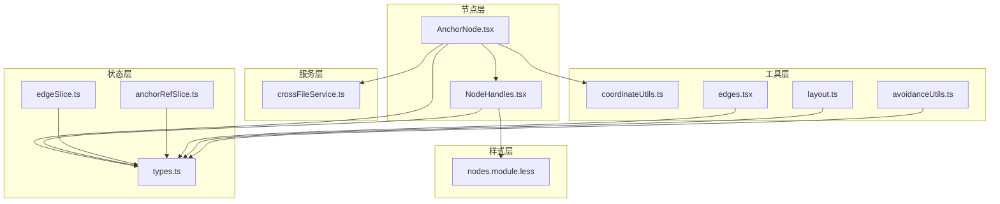
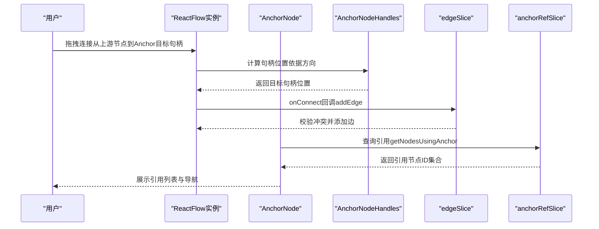
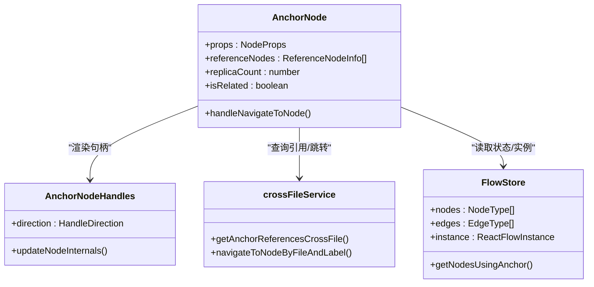
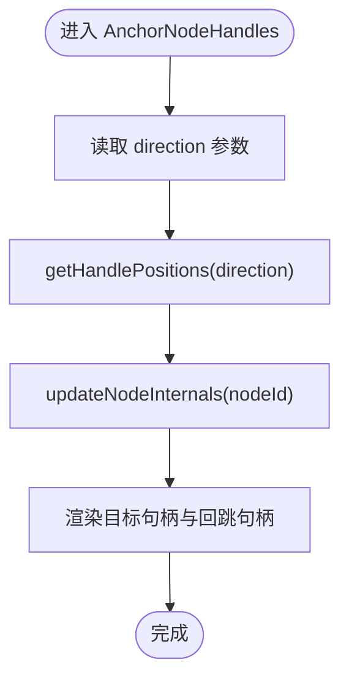
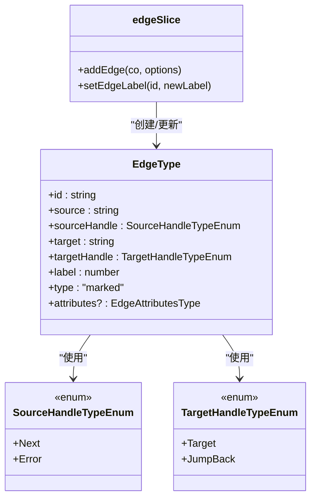
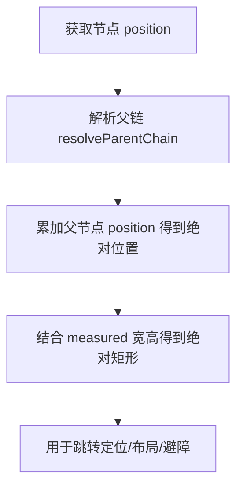
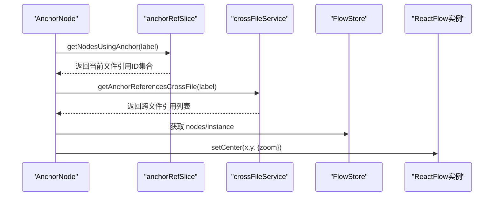
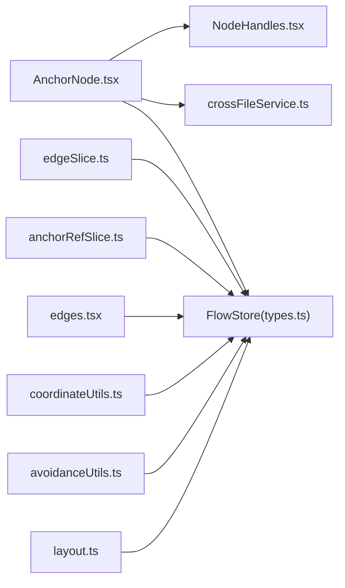

# Anchor节点

<cite>
**本文档引用的文件**
- [AnchorNode.tsx](file://src/components/flow/nodes/AnchorNode.tsx)
- [NodeHandles.tsx](file://src/components/flow/nodes/components/NodeHandles.tsx)
- [constants.ts](file://src/components/flow/nodes/constants.ts)
- [types.ts](file://src/stores/flow/types.ts)
- [edgeSlice.ts](file://src/stores/flow/slices/edgeSlice.ts)
- [anchorRefSlice.ts](file://src/stores/flow/slices/anchorRefSlice.ts)
- [crossFileService.ts](file://src/services/crossFileService.ts)
- [coordinateUtils.ts](file://src/stores/flow/utils/coordinateUtils.ts)
- [nodes.module.less](file://src/styles/flow/nodes.module.less)
- [edges.tsx](file://src/components/flow/edges.tsx)
- [layout.ts](file://src/core/layout.ts)
- [avoidanceUtils.ts](file://src/core/avoidanceUtils.ts)
</cite>

## 目录
1. [简介](#简介)
2. [项目结构](#项目结构)
3. [核心组件](#核心组件)
4. [架构总览](#架构总览)
5. [详细组件分析](#详细组件分析)
6. [依赖关系分析](#依赖关系分析)
7. [性能考量](#性能考量)
8. [故障排查指南](#故障排查指南)
9. [结论](#结论)

## 简介
Anchor节点是工作流编辑器中的“锚点”节点，用于在复杂工作流中建立可复用的连接枢纽。它通过目标句柄（Target）和回跳句柄（JumpBack）实现灵活的连接控制，并支持跨文件引用与导航。本文档深入解析Anchor节点的锚点作用、连接机制、定位系统、坐标计算、位置锁定、句柄实现原理、连接点配置、连接方向控制、与其他节点的连接规则与约束，以及配置选项与使用技巧。

## 项目结构
与Anchor节点相关的核心文件组织如下：
- 节点实现：src/components/flow/nodes/AnchorNode.tsx
- 句柄组件：src/components/flow/nodes/components/NodeHandles.tsx
- 节点常量与句柄方向：src/components/flow/nodes/constants.ts
- 流状态类型定义：src/stores/flow/types.ts
- 边状态管理：src/stores/flow/slices/edgeSlice.ts
- Anchor引用索引：src/stores/flow/slices/anchorRefSlice.ts
- 跨文件服务：src/services/crossFileService.ts
- 坐标工具：src/stores/flow/utils/coordinateUtils.ts
- 样式定义：src/styles/flow/nodes.module.less
- 边渲染与方向：src/components/flow/edges.tsx
- 布局算法：src/core/layout.ts
- 绕行工具：src/core/avoidanceUtils.ts

**图表来源**
- [AnchorNode.tsx:120-371](file://src/components/flow/nodes/AnchorNode.tsx#L120-L371)
- [NodeHandles.tsx:1-277](file://src/components/flow/nodes/components/NodeHandles.tsx#L1-L277)
- [constants.ts:1-47](file://src/components/flow/nodes/constants.ts#L1-L47)
- [types.ts:132-136](file://src/stores/flow/types.ts#L132-L136)
- [edgeSlice.ts:165-222](file://src/stores/flow/slices/edgeSlice.ts#L165-L222)
- [anchorRefSlice.ts:57-100](file://src/stores/flow/slices/anchorRefSlice.ts#L57-L100)
- [crossFileService.ts:626-709](file://src/services/crossFileService.ts#L626-L709)
- [coordinateUtils.ts:85-144](file://src/stores/flow/utils/coordinateUtils.ts#L85-L144)
- [edges.tsx:336-370](file://src/components/flow/edges.tsx#L336-L370)
- [layout.ts:153-219](file://src/core/layout.ts#L153-L219)
- [avoidanceUtils.ts:590-602](file://src/core/avoidanceUtils.ts#L590-L602)
- [nodes.module.less:1-200](file://src/styles/flow/nodes.module.less#L1-L200)

**章节来源**
- [AnchorNode.tsx:1-371](file://src/components/flow/nodes/AnchorNode.tsx#L1-L371)
- [NodeHandles.tsx:1-277](file://src/components/flow/nodes/components/NodeHandles.tsx#L1-L277)
- [constants.ts:1-47](file://src/components/flow/nodes/constants.ts#L1-L47)

## 核心组件
- AnchorNode：Anchor节点的主组件，负责渲染标题、引用列表、句柄、上下文菜单与焦点透明度逻辑。
- AnchorNodeHandles：Anchor节点的句柄组件，提供目标句柄与回跳句柄，并根据方向动态更新句柄位置。
- NodeHandles：通用句柄组件集合，包含PipelineNodeHandles、ExternalNodeHandles与AnchorNodeHandles的实现与方向计算。
- constants：定义句柄方向枚举、默认方向与选项。
- types：定义AnchorNodeDataType、EdgeType等类型，支撑节点与边的数据结构。
- edgeSlice：边状态管理，包含边添加、去重与顺序计算。
- anchorRefSlice：Anchor引用索引构建与查询。
- crossFileService：跨文件节点搜索、跳转与引用查询。
- coordinateUtils：节点绝对位置与矩形计算。
- edges.tsx：边渲染与方向解析。
- layout.ts：对齐与布局算法。
- avoidanceUtils：基于句柄位置的绕行决策。

**章节来源**
- [AnchorNode.tsx:120-371](file://src/components/flow/nodes/AnchorNode.tsx#L120-L371)
- [NodeHandles.tsx:223-276](file://src/components/flow/nodes/components/NodeHandles.tsx#L223-L276)
- [constants.ts:28-46](file://src/components/flow/nodes/constants.ts#L28-L46)
- [types.ts:132-136](file://src/stores/flow/types.ts#L132-L136)
- [edgeSlice.ts:165-222](file://src/stores/flow/slices/edgeSlice.ts#L165-L222)
- [anchorRefSlice.ts:57-100](file://src/stores/flow/slices/anchorRefSlice.ts#L57-L100)
- [crossFileService.ts:626-709](file://src/services/crossFileService.ts#L626-L709)
- [coordinateUtils.ts:85-144](file://src/stores/flow/utils/coordinateUtils.ts#L85-L144)
- [edges.tsx:336-370](file://src/components/flow/edges.tsx#L336-L370)
- [layout.ts:153-219](file://src/core/layout.ts#L153-L219)
- [avoidanceUtils.ts:590-602](file://src/core/avoidanceUtils.ts#L590-L602)

## 架构总览
Anchor节点在工作流中的作用：
- 锚点枢纽：通过目标句柄接收上游连接，通过回跳句柄支持反向连接。
- 引用导航：展示引用此Anchor的节点列表，支持跨文件跳转。
- 方向控制：依据句柄方向（左右、上下）决定句柄位置与样式。
- 焦点效果：根据选中状态、路径模式与相关性计算透明度，突出显示。

**图表来源**
- [AnchorNode.tsx:163-240](file://src/components/flow/nodes/AnchorNode.tsx#L163-L240)
- [NodeHandles.tsx:223-276](file://src/components/flow/nodes/components/NodeHandles.tsx#L223-L276)
- [edgeSlice.ts:165-222](file://src/stores/flow/slices/edgeSlice.ts#L165-L222)
- [anchorRefSlice.ts:94-100](file://src/stores/flow/slices/anchorRefSlice.ts#L94-L100)

## 详细组件分析

### AnchorNode组件
职责与实现要点：
- 引用节点收集：从当前文件索引与跨文件服务中聚合引用该Anchor的节点，支持跨文件跳转。
- 导航逻辑：支持当前文件内跳转与跨文件跳转，调用跨文件服务与视图中心定位。
- 焦点透明度：根据焦点透明度配置、路径模式、选中状态与相关性计算节点透明度。
- 句柄渲染：通过AnchorNodeHandles传入句柄方向，渲染目标句柄与回跳句柄。
- 上下文菜单：包裹NodeContextMenu，提供节点操作入口。

**图表来源**
- [AnchorNode.tsx:120-371](file://src/components/flow/nodes/AnchorNode.tsx#L120-L371)
- [NodeHandles.tsx:223-276](file://src/components/flow/nodes/components/NodeHandles.tsx#L223-L276)
- [crossFileService.ts:626-709](file://src/services/crossFileService.ts#L626-L709)
- [types.ts:230-236](file://src/stores/flow/types.ts#L230-L236)

**章节来源**
- [AnchorNode.tsx:120-371](file://src/components/flow/nodes/AnchorNode.tsx#L120-L371)

### AnchorNodeHandles句柄组件
职责与实现要点：
- 方向解析：根据HandleDirection映射到Position（Left/Right/Top/Bottom），并判断是否垂直布局。
- 句柄位置：目标句柄与回跳句柄共享同一位置，但通过样式偏移实现左右/上下分布。
- 实时更新：监听方向变化，调用updateNodeInternals确保句柄位置即时生效。
- 样式适配：根据垂直/水平方向应用不同样式类，保证视觉一致性。

**图表来源**
- [NodeHandles.tsx:223-276](file://src/components/flow/nodes/components/NodeHandles.tsx#L223-L276)
- [constants.ts:28-46](file://src/components/flow/nodes/constants.ts#L28-L46)

**章节来源**
- [NodeHandles.tsx:223-276](file://src/components/flow/nodes/components/NodeHandles.tsx#L223-L276)
- [constants.ts:15-46](file://src/components/flow/nodes/constants.ts#L15-L46)

### 连接规则与约束
- 句柄类型：Anchor节点使用目标句柄（Target）与回跳句柄（JumpBack），类型枚举由TargetHandleTypeEnum定义。
- 方向影响：句柄方向决定句柄位置（Position.Left/Right/Top/Bottom），进而影响连线走向。
- 边类型：EdgeType包含source、sourceHandle、target、targetHandle、label与attributes等字段。
- 冲突校验：edgeSlice在添加边时进行冲突检测（如Next与Error不能同时指向同一目标），避免重复连接。
- 顺序计算：根据source、sourceHandle计算边的label顺序，确保同源同类型边的有序排列。

**图表来源**
- [types.ts:29-40](file://src/stores/flow/types.ts#L29-L40)
- [edgeSlice.ts:165-222](file://src/stores/flow/slices/edgeSlice.ts#L165-L222)
- [constants.ts:2-11](file://src/components/flow/nodes/constants.ts#L2-L11)

**章节来源**
- [types.ts:29-40](file://src/stores/flow/types.ts#L29-L40)
- [edgeSlice.ts:165-222](file://src/stores/flow/slices/edgeSlice.ts#L165-L222)
- [constants.ts:2-11](file://src/components/flow/nodes/constants.ts#L2-L11)

### 定位系统、坐标计算与位置锁定
- 绝对位置：getNodeAbsolutePosition通过父链累加计算节点绝对位置，用于跨文件跳转时的视图定位。
- 矩形计算：getNodeAbsoluteRect结合节点尺寸与绝对位置，提供边界矩形，便于布局与碰撞检测。
- 位置锁定：在布局对齐与移动操作中，通过更新节点position并批量提交NodeChange，实现位置锁定与批量刷新。
- 绕行决策：avoidanceUtils基于句柄位置判断连线绕行方向，提升复杂布局的可读性。

**图表来源**
- [coordinateUtils.ts:85-144](file://src/stores/flow/utils/coordinateUtils.ts#L85-L144)
- [avoidanceUtils.ts:590-602](file://src/core/avoidanceUtils.ts#L590-L602)
- [layout.ts:153-219](file://src/core/layout.ts#L153-L219)

**章节来源**
- [coordinateUtils.ts:85-144](file://src/stores/flow/utils/coordinateUtils.ts#L85-L144)
- [avoidanceUtils.ts:590-602](file://src/core/avoidanceUtils.ts#L590-L602)
- [layout.ts:153-219](file://src/core/layout.ts#L153-L219)

### 跨文件引用与导航
- 引用索引：anchorRefSlice维护anchor名称到使用该anchor的节点ID集合的索引，支持快速查询。
- 跨文件查询：crossFileService.getAnchorReferencesCrossFile遍历已加载与未加载文件，筛选引用该anchor的节点。
- 导航跳转：支持当前文件内跳转与跨文件跳转，调用getNodeAbsolutePosition与instance.setCenter实现视图定位。

**图表来源**
- [anchorRefSlice.ts:94-100](file://src/stores/flow/slices/anchorRefSlice.ts#L94-L100)
- [crossFileService.ts:626-709](file://src/services/crossFileService.ts#L626-L709)
- [AnchorNode.tsx:198-240](file://src/components/flow/nodes/AnchorNode.tsx#L198-L240)

**章节来源**
- [anchorRefSlice.ts:57-100](file://src/stores/flow/slices/anchorRefSlice.ts#L57-L100)
- [crossFileService.ts:626-709](file://src/services/crossFileService.ts#L626-L709)
- [AnchorNode.tsx:163-240](file://src/components/flow/nodes/AnchorNode.tsx#L163-L240)

### 配置选项与使用技巧
- 句柄方向：支持"left-right"、"right-left"、"top-bottom"、"bottom-top"四种方向，通过HandleDirection枚举与DEFAULT_HANDLE_DIRECTION控制默认方向。
- 自动完成：AnchorEditor提供自动完成功能，支持跨文件节点搜索与过滤，便于快速选择锚点名称。
- 位置调整：通过布局对齐（左/右/上/下/居中/中点）与手动拖拽实现节点位置调整；使用updateNodes批量提交位置变更。
- 连接验证：利用edgeSlice的冲突检测与顺序计算，确保连接合法且有序；必要时可禁用校验（isCheck=false）以满足特殊场景。
- 布局优化：结合avoidanceUtils的绕行策略与layout.ts的对齐算法，优化复杂工作流的连线可读性与整体美观。

**章节来源**
- [constants.ts:28-46](file://src/components/flow/nodes/constants.ts#L28-L46)
- [AnchorEditor.tsx:19-60](file://src/components/panels/node-editors/AnchorEditor.tsx#L19-L60)
- [layout.ts:153-219](file://src/core/layout.ts#L153-L219)
- [avoidanceUtils.ts:590-602](file://src/core/avoidanceUtils.ts#L590-L602)
- [edgeSlice.ts:165-222](file://src/stores/flow/slices/edgeSlice.ts#L165-L222)

## 依赖关系分析
- 组件耦合：AnchorNode依赖NodeHandles进行句柄渲染，依赖crossFileService进行跨文件引用查询，依赖FlowStore进行状态读取与实例访问。
- 状态管理：edgeSlice与anchorRefSlice分别负责边状态与Anchor引用索引，二者通过FlowStore统一协调。
- 工具函数：coordinateUtils提供绝对位置与矩形计算，edges.tsx解析节点方向，avoidanceUtils提供绕行策略，layout.ts提供对齐算法。

**图表来源**
- [AnchorNode.tsx:1-371](file://src/components/flow/nodes/AnchorNode.tsx#L1-L371)
- [NodeHandles.tsx:1-277](file://src/components/flow/nodes/components/NodeHandles.tsx#L1-L277)
- [crossFileService.ts:1-740](file://src/services/crossFileService.ts#L1-L740)
- [types.ts:1-439](file://src/stores/flow/types.ts#L1-L439)
- [edgeSlice.ts:1-238](file://src/stores/flow/slices/edgeSlice.ts#L1-L238)
- [anchorRefSlice.ts:1-100](file://src/stores/flow/slices/anchorRefSlice.ts#L1-L100)
- [edges.tsx:336-370](file://src/components/flow/edges.tsx#L336-L370)
- [coordinateUtils.ts:1-198](file://src/stores/flow/utils/coordinateUtils.ts#L1-L198)
- [avoidanceUtils.ts:590-602](file://src/core/avoidanceUtils.ts#L590-L602)
- [layout.ts:153-219](file://src/core/layout.ts#L153-L219)

**章节来源**
- [AnchorNode.tsx:1-371](file://src/components/flow/nodes/AnchorNode.tsx#L1-L371)
- [NodeHandles.tsx:1-277](file://src/components/flow/nodes/components/NodeHandles.tsx#L1-L277)
- [crossFileService.ts:1-740](file://src/services/crossFileService.ts#L1-L740)
- [types.ts:1-439](file://src/stores/flow/types.ts#L1-L439)
- [edgeSlice.ts:1-238](file://src/stores/flow/slices/edgeSlice.ts#L1-L238)
- [anchorRefSlice.ts:1-100](file://src/stores/flow/slices/anchorRefSlice.ts#L1-L100)
- [edges.tsx:336-370](file://src/components/flow/edges.tsx#L336-L370)
- [coordinateUtils.ts:1-198](file://src/stores/flow/utils/coordinateUtils.ts#L1-L198)
- [avoidanceUtils.ts:590-602](file://src/core/avoidanceUtils.ts#L590-L602)
- [layout.ts:153-219](file://src/core/layout.ts#L153-L219)

## 性能考量
- 句柄更新：AnchorNodeHandles在方向变化时调用updateNodeInternals并使用定时器确保更新生效，避免闪烁与布局抖动。
- 引用查询：anchorRefSlice维护索引，getNodesUsingAnchor返回O(1)查询结果；crossFileService在未连接LocalBridge时限制跨文件搜索范围。
- 批量更新：布局对齐与位置调整通过批量NodeChange提交，减少多次重绘。
- 边顺序：edgeSlice在删除边时自动重排同源同类型边的label，避免频繁重算。

[本节为通用性能建议，无需特定文件引用]

## 故障排查指南
- 连接冲突：若出现“next与error不能同时指向同一节点”的问题，检查目标节点的连接类型，确保唯一性。
- 句柄位置异常：确认HandleDirection正确传递至AnchorNodeHandles，观察updateNodeInternals是否被触发。
- 跨文件跳转失败：检查crossFileService的连接状态与文件加载状态，确认目标节点存在且可定位。
- 引用列表为空：确认anchorRefSlice的索引已重建，Anchor名称与节点others.anchor字段一致。

**章节来源**
- [edgeSlice.ts:175-194](file://src/stores/flow/slices/edgeSlice.ts#L175-L194)
- [NodeHandles.tsx:233-244](file://src/components/flow/nodes/components/NodeHandles.tsx#L233-L244)
- [crossFileService.ts:52-54](file://src/services/crossFileService.ts#L52-L54)
- [anchorRefSlice.ts:68-73](file://src/stores/flow/slices/anchorRefSlice.ts#L68-L73)

## 结论
Anchor节点通过目标句柄与回跳句柄实现了灵活的连接控制，配合跨文件引用导航与方向驱动的句柄布局，为复杂工作流提供了强大的锚点能力。借助状态管理与工具函数的支持，Anchor节点在连接验证、坐标计算、布局优化与性能保障方面均具备良好的工程实践。合理配置句柄方向与使用自动完成功能，可显著提升工作流设计效率与可维护性。