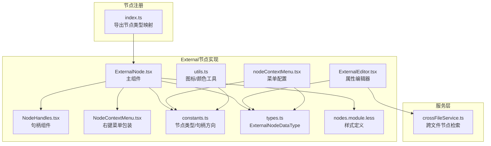
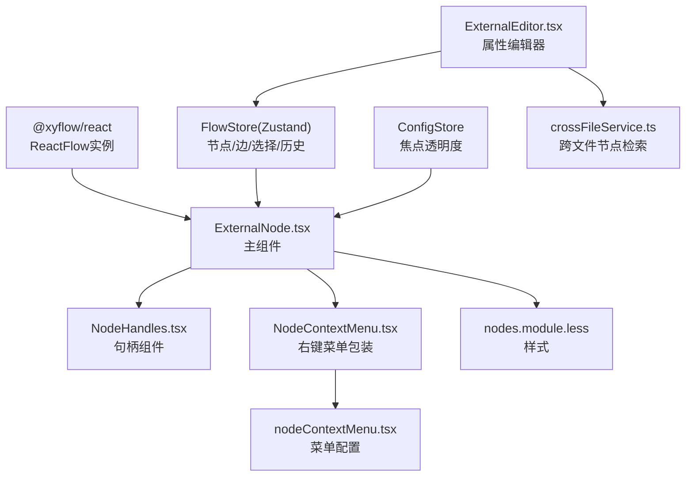
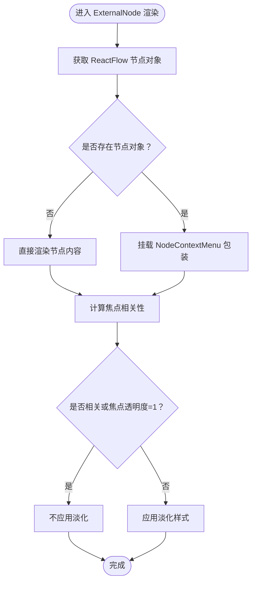
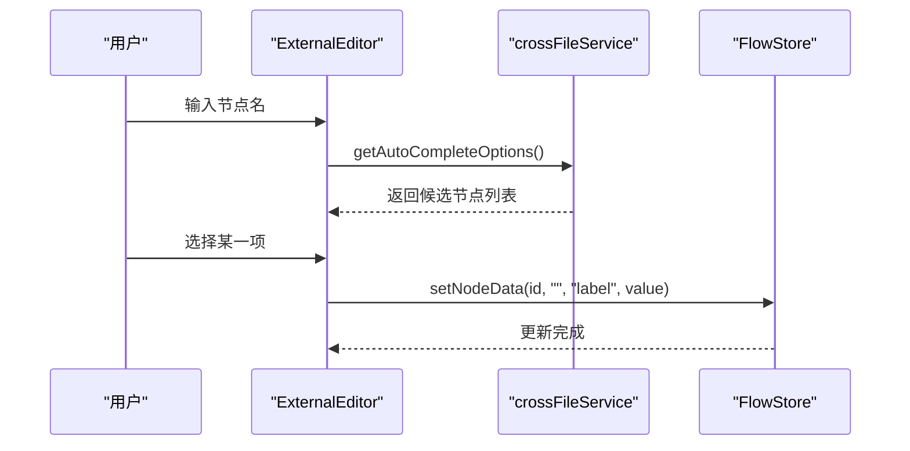
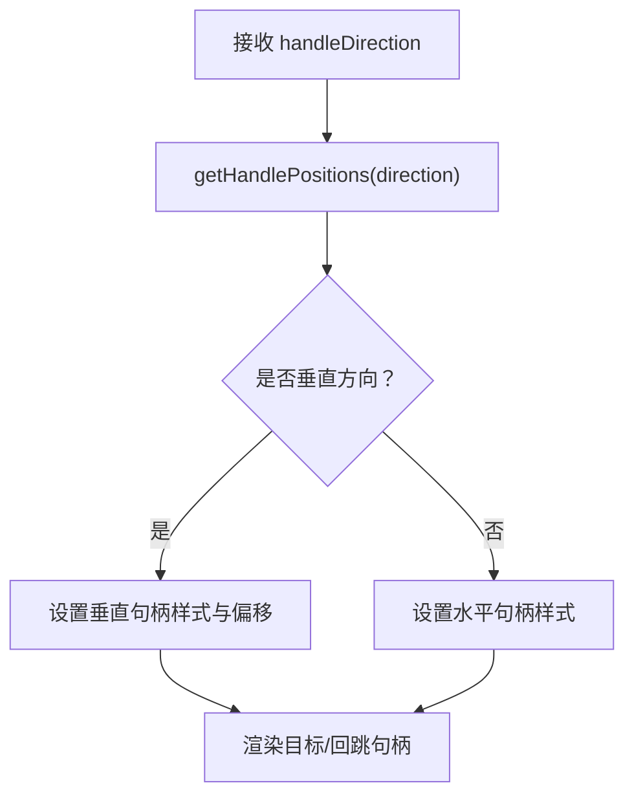
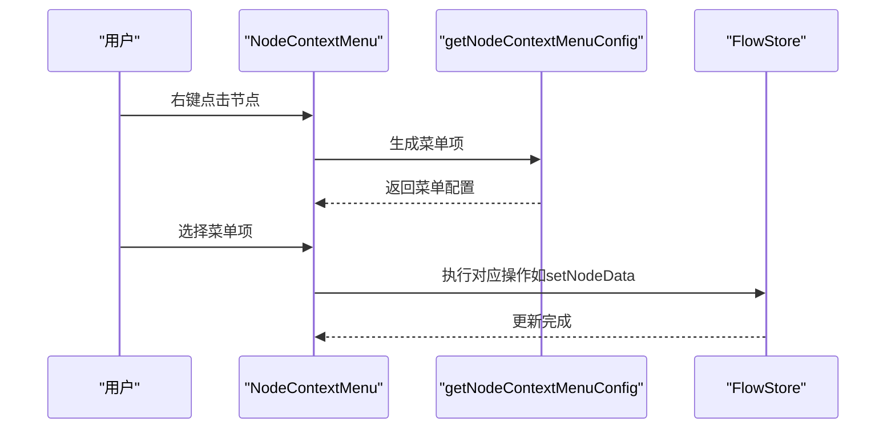
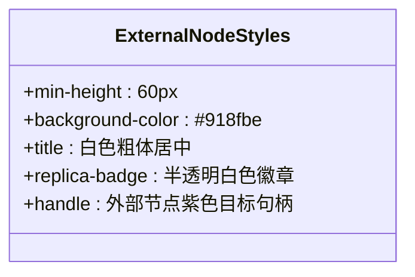
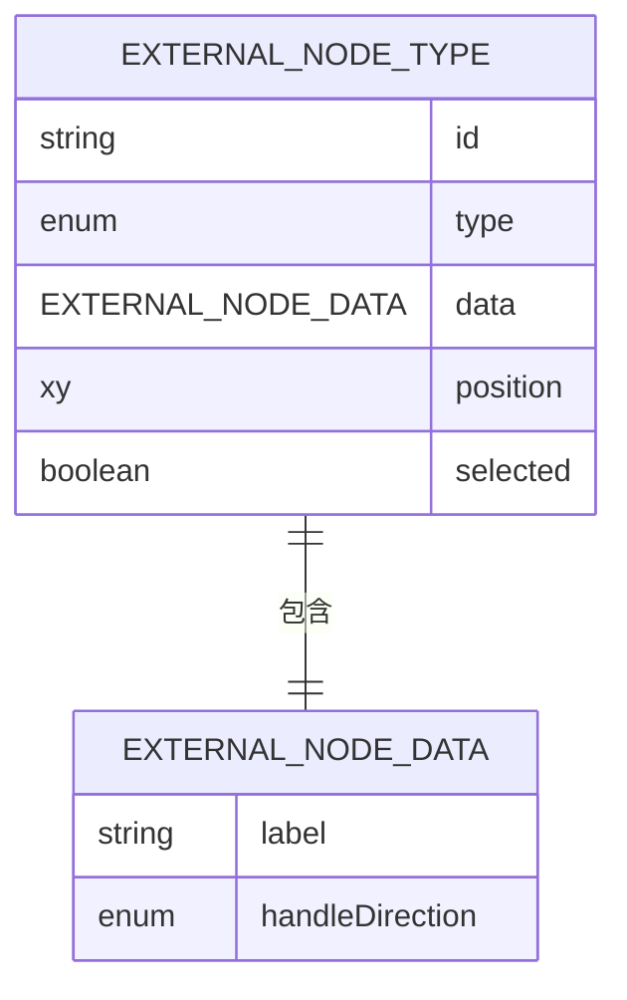
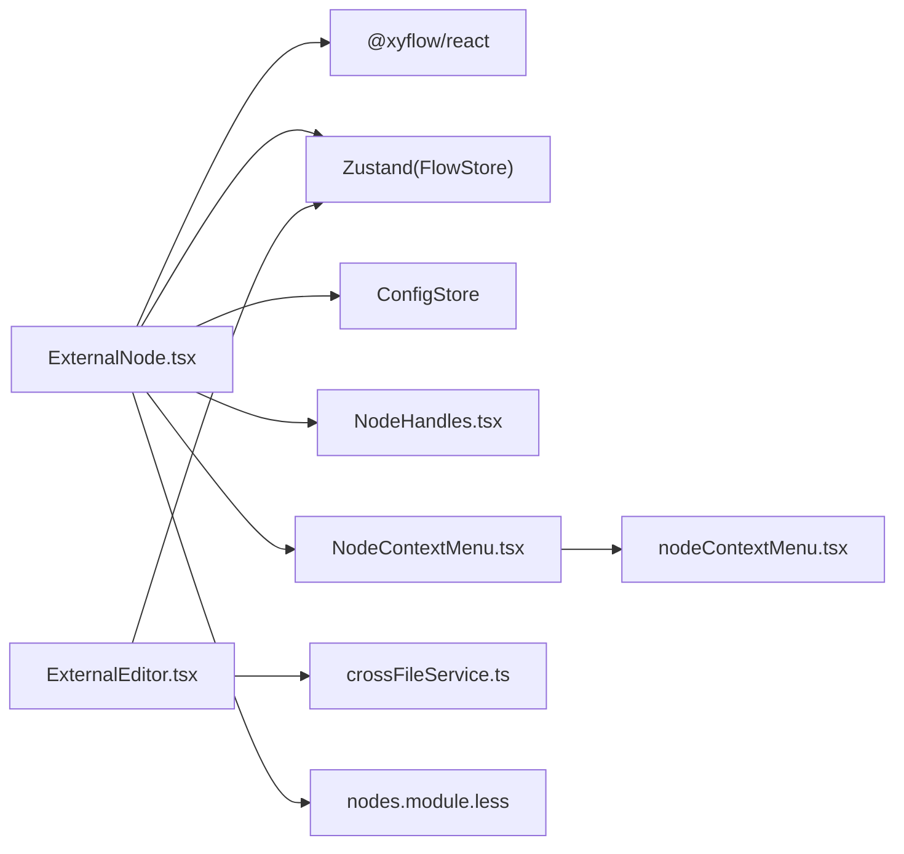

# External节点

<cite>
**本文档引用的文件**
- [ExternalNode.tsx](file://src/components/flow/nodes/ExternalNode.tsx)
- [ExternalEditor.tsx](file://src/components/panels/node-editors/ExternalEditor.tsx)
- [types.ts](file://src/stores/flow/types.ts)
- [constants.ts](file://src/components/flow/nodes/constants.ts)
- [NodeContextMenu.tsx](file://src/components/flow/nodes/components/NodeContextMenu.tsx)
- [NodeHandles.tsx](file://src/components/flow/nodes/components/NodeHandles.tsx)
- [nodes.module.less](file://src/styles/flow/nodes.module.less)
- [nodeContextMenu.tsx](file://src/components/flow/nodes/nodeContextMenu.tsx)
- [index.ts](file://src/components/flow/nodes/index.ts)
- [crossFileService.ts](file://src/services/crossFileService.ts)
- [utils.ts](file://src/components/flow/nodes/utils.ts)
</cite>

## 目录
1. [简介](#简介)
2. [项目结构](#项目结构)
3. [核心组件](#核心组件)
4. [架构总览](#架构总览)
5. [详细组件分析](#详细组件分析)
6. [依赖关系分析](#依赖关系分析)
7. [性能考量](#性能考量)
8. [故障排查指南](#故障排查指南)
9. [结论](#结论)
10. [附录](#附录)

## 简介
External节点用于在流程图中表示对外部文件或跨文件引用的节点。它允许用户通过自动完成功能从本地桥接扫描的资源中选择外部节点，并以统一的视觉样式呈现。该节点具备右键菜单、焦点淡化、句柄布局等特性，便于在复杂流程中进行导航与调试。

## 项目结构
External节点位于流程节点体系中，作为五种节点类型之一，与其他节点共享相同的渲染框架与交互机制。

**图表来源**
- [index.ts:8-14](file://src/components/flow/nodes/index.ts#L8-L14)
- [ExternalNode.tsx:1-203](file://src/components/flow/nodes/ExternalNode.tsx#L1-L203)
- [ExternalEditor.tsx:1-106](file://src/components/panels/node-editors/ExternalEditor.tsx#L1-L106)
- [NodeHandles.tsx:160-214](file://src/components/flow/nodes/components/NodeHandles.tsx#L160-L214)
- [NodeContextMenu.tsx:28-260](file://src/components/flow/nodes/components/NodeContextMenu.tsx#L28-L260)
- [constants.ts:14-47](file://src/components/flow/nodes/constants.ts#L14-L47)
- [types.ts:127-130](file://src/stores/flow/types.ts#L127-L130)
- [nodes.module.less:372-418](file://src/styles/flow/nodes.module.less#L372-L418)
- [nodeContextMenu.tsx:467-701](file://src/components/flow/nodes/nodeContextMenu.tsx#L467-L701)
- [crossFileService.ts:590-608](file://src/services/crossFileService.ts#L590-L608)
- [utils.ts:91-102](file://src/components/flow/nodes/utils.ts#L91-L102)

**章节来源**
- [index.ts:1-26](file://src/components/flow/nodes/index.ts#L1-L26)
- [ExternalNode.tsx:1-203](file://src/components/flow/nodes/ExternalNode.tsx#L1-L203)
- [ExternalEditor.tsx:1-106](file://src/components/panels/node-editors/ExternalEditor.tsx#L1-L106)

## 核心组件
- ExternalNode主组件：负责渲染External节点的UI、焦点淡化逻辑、右键菜单挂载以及句柄展示。
- ExternalEditor属性编辑器：提供节点名（label）的自动完成功能，支持跨文件节点检索。
- NodeHandles句柄组件：根据句柄方向渲染目标与回跳句柄，支持水平/垂直布局。
- NodeContextMenu右键菜单包装：为节点提供统一的右键菜单入口，承载通用菜单项。
- 菜单配置：nodeContextMenu.tsx定义了所有节点类型的右键菜单项及可见性规则。
- 数据类型：ExternalNodeDataType定义了External节点的数据结构。
- 样式：nodes.module.less定义了External节点的外观与焦点状态样式。

**章节来源**
- [ExternalNode.tsx:45-181](file://src/components/flow/nodes/ExternalNode.tsx#L45-L181)
- [ExternalEditor.tsx:8-106](file://src/components/panels/node-editors/ExternalEditor.tsx#L8-L106)
- [NodeHandles.tsx:165-214](file://src/components/flow/nodes/components/NodeHandles.tsx#L165-L214)
- [NodeContextMenu.tsx:28-260](file://src/components/flow/nodes/components/NodeContextMenu.tsx#L28-L260)
- [nodeContextMenu.tsx:467-701](file://src/components/flow/nodes/nodeContextMenu.tsx#L467-L701)
- [types.ts:127-130](file://src/stores/flow/types.ts#L127-L130)
- [nodes.module.less:372-418](file://src/styles/flow/nodes.module.less#L372-L418)

## 架构总览
External节点的架构围绕“组件-样式-服务-存储”四层展开，通过React Flow的节点渲染机制与Zustand状态管理协同工作。

**图表来源**
- [ExternalNode.tsx:45-181](file://src/components/flow/nodes/ExternalNode.tsx#L45-L181)
- [ExternalEditor.tsx:8-106](file://src/components/panels/node-editors/ExternalEditor.tsx#L8-L106)
- [NodeHandles.tsx:165-214](file://src/components/flow/nodes/components/NodeHandles.tsx#L165-L214)
- [NodeContextMenu.tsx:28-260](file://src/components/flow/nodes/components/NodeContextMenu.tsx#L28-L260)
- [nodeContextMenu.tsx:467-701](file://src/components/flow/nodes/nodeContextMenu.tsx#L467-L701)
- [crossFileService.ts:590-608](file://src/services/crossFileService.ts#L590-L608)
- [nodes.module.less:372-418](file://src/styles/flow/nodes.module.less#L372-L418)

## 详细组件分析

### ExternalNode主组件
- 渲染逻辑：包含标题与副本徽章、句柄展示；根据是否获取到完整节点对象决定是否挂载右键菜单包装。
- 焦点淡化：通过ConfigStore读取焦点透明度，结合选中状态与路径模式计算是否应用淡化效果。
- 副本计数：统计同label的其他External节点数量，用于显示副本徽章。
- 右键菜单：通过NodeContextMenu包装，提供统一的菜单入口。

**图表来源**
- [ExternalNode.tsx:45-181](file://src/components/flow/nodes/ExternalNode.tsx#L45-L181)

**章节来源**
- [ExternalNode.tsx:45-181](file://src/components/flow/nodes/ExternalNode.tsx#L45-L181)

### ExternalEditor属性编辑器
- 自动完成功能：基于crossFileService.getAutoCompleteOptions()提供节点建议，支持搜索过滤。
- 选项渲染：自定义下拉项渲染，展示节点名与文件路径。
- 数据写入：通过FlowStore.setNodeData更新节点label。

**图表来源**
- [ExternalEditor.tsx:8-106](file://src/components/panels/node-editors/ExternalEditor.tsx#L8-L106)
- [crossFileService.ts:590-608](file://src/services/crossFileService.ts#L590-L608)

**章节来源**
- [ExternalEditor.tsx:8-106](file://src/components/panels/node-editors/ExternalEditor.tsx#L8-L106)
- [crossFileService.ts:590-608](file://src/services/crossFileService.ts#L590-L608)

### NodeHandles句柄组件（External专用）
- 句柄类型：目标句柄与回跳句柄，支持四种方向（左右、右左、上下、下上）。
- 位置计算：根据方向返回目标与源句柄的位置，并在方向变化时触发内部更新。
- 样式定位：在垂直布局时对句柄进行偏移定位，确保视觉对齐。

**图表来源**
- [NodeHandles.tsx:165-214](file://src/components/flow/nodes/components/NodeHandles.tsx#L165-L214)

**章节来源**
- [NodeHandles.tsx:165-214](file://src/components/flow/nodes/components/NodeHandles.tsx#L165-L214)

### NodeContextMenu右键菜单包装
- 统一入口：通过Dropdown组件提供右键触发，支持动态生成菜单项。
- 菜单配置：由nodeContextMenu.tsx提供，包含调试、复制、编辑JSON、删除等常用操作。
- 能力检测：首次打开时根据连接状态与能力清单触发能力请求。

**图表来源**
- [NodeContextMenu.tsx:28-260](file://src/components/flow/nodes/components/NodeContextMenu.tsx#L28-L260)
- [nodeContextMenu.tsx:467-701](file://src/components/flow/nodes/nodeContextMenu.tsx#L467-L701)

**章节来源**
- [NodeContextMenu.tsx:28-260](file://src/components/flow/nodes/components/NodeContextMenu.tsx#L28-L260)
- [nodeContextMenu.tsx:467-701](file://src/components/flow/nodes/nodeContextMenu.tsx#L467-L701)

### 样式系统与视觉标识
- 节点外观：深灰紫色背景，白色粗体标题，居中对齐。
- 副本徽章：显示额外副本数量，提示用户存在多个同名引用。
- 句柄样式：外部节点使用紫色目标句柄，回跳句柄采用统一的垂直/水平布局样式。
- 焦点状态：通过透明度与阴影实现“焦点淡化”，提升主流程可视性。

**图表来源**
- [nodes.module.less:372-418](file://src/styles/flow/nodes.module.less#L372-L418)

**章节来源**
- [nodes.module.less:372-418](file://src/styles/flow/nodes.module.less#L372-L418)

### 数据模型与类型定义
- ExternalNodeDataType：包含label与可选的handleDirection。
- ExternalNodeType：扩展基础节点类型，包含id、position、selected等通用字段。

**图表来源**
- [types.ts:127-130](file://src/stores/flow/types.ts#L127-L130)
- [types.ts:171-183](file://src/stores/flow/types.ts#L171-L183)

**章节来源**
- [types.ts:127-183](file://src/stores/flow/types.ts#L127-L183)

### 节点图标与标识
- 节点类型图标：External节点使用链接图标，便于识别其引用性质。
- 图标工具：提供按节点类型/识别类型/动作类型选择图标的工具函数。

**章节来源**
- [utils.ts:91-102](file://src/components/flow/nodes/utils.ts#L91-L102)

## 依赖关系分析
- 组件耦合：ExternalNode依赖ReactFlow实例、Zustand状态、样式模块与句柄组件；右键菜单通过包装器与菜单配置解耦。
- 存储交互：通过FlowStore读取/更新节点数据，支持批量更新与历史记录。
- 服务依赖：ExternalEditor依赖crossFileService进行跨文件节点检索与自动完成。
- 外部系统：通过LocalBridge连接状态影响菜单能力请求与资源预检。

**图表来源**
- [ExternalNode.tsx:1-203](file://src/components/flow/nodes/ExternalNode.tsx#L1-L203)
- [ExternalEditor.tsx:1-106](file://src/components/panels/node-editors/ExternalEditor.tsx#L1-L106)
- [NodeContextMenu.tsx:28-260](file://src/components/flow/nodes/components/NodeContextMenu.tsx#L28-L260)
- [nodeContextMenu.tsx:467-701](file://src/components/flow/nodes/nodeContextMenu.tsx#L467-L701)
- [crossFileService.ts:590-608](file://src/services/crossFileService.ts#L590-L608)
- [nodes.module.less:372-418](file://src/styles/flow/nodes.module.less#L372-L418)

**章节来源**
- [ExternalNode.tsx:1-203](file://src/components/flow/nodes/ExternalNode.tsx#L1-L203)
- [ExternalEditor.tsx:1-106](file://src/components/panels/node-editors/ExternalEditor.tsx#L1-L106)
- [NodeContextMenu.tsx:28-260](file://src/components/flow/nodes/components/NodeContextMenu.tsx#L28-L260)
- [nodeContextMenu.tsx:467-701](file://src/components/flow/nodes/nodeContextMenu.tsx#L467-L701)
- [crossFileService.ts:590-608](file://src/services/crossFileService.ts#L590-L608)
- [nodes.module.less:372-418](file://src/styles/flow/nodes.module.less#L372-L418)

## 性能考量
- 渲染优化：ExternalNodeMemo通过浅比较避免不必要的重渲染；ENodeContent为memo化子组件。
- 计算缓存：副本计数与焦点相关性使用useMemo缓存，减少重复计算。
- 句柄更新：方向变更时通过useEffect触发内部更新，确保句柄位置正确。
- 自动完成限制：跨文件选项默认限制数量，搜索时也限制返回条目，降低渲染压力。

**章节来源**
- [ExternalNode.tsx:183-202](file://src/components/flow/nodes/ExternalNode.tsx#L183-L202)
- [ExternalEditor.tsx:19-32](file://src/components/panels/node-editors/ExternalEditor.tsx#L19-L32)

## 故障排查指南
- 右键菜单无响应：检查LocalBridge连接状态与调试能力请求是否触发；确认菜单项禁用条件。
- 自动完成无结果：确认crossFileService已连接且存在可用节点；检查过滤条件与搜索关键词。
- 句柄位置异常：确认handleDirection合法；检查useEffect内部更新是否执行。
- 焦点淡化无效：检查ConfigStore中的focusOpacity配置；确认selected状态与路径模式。

**章节来源**
- [NodeContextMenu.tsx:88-106](file://src/components/flow/nodes/components/NodeContextMenu.tsx#L88-L106)
- [crossFileService.ts:590-608](file://src/services/crossFileService.ts#L590-L608)
- [NodeHandles.tsx:175-186](file://src/components/flow/nodes/components/NodeHandles.tsx#L175-L186)
- [ExternalNode.tsx:157-160](file://src/components/flow/nodes/ExternalNode.tsx#L157-L160)

## 结论
External节点通过简洁的UI与完善的交互机制，实现了对外部引用的可视化管理。其与右键菜单、自动完成、样式系统和状态管理的紧密协作，使得用户能够在复杂的多文件流程中高效地定位与编辑外部节点。未来可在以下方面持续优化：增强跨文件节点的元信息展示、提供更细粒度的焦点控制策略、以及扩展更多快捷操作与状态反馈。

## 附录

### External节点的配置选项与自定义开发指导
- 属性定义
  - label：节点显示名称，支持自动完成与跨文件检索。
  - handleDirection：句柄方向，支持左右、右左、上下、下上四种。
- 事件绑定
  - setNodeData：通过FlowStore更新节点属性，支持批量更新与历史记录。
  - 右键菜单：通过NodeContextMenu包装统一处理，菜单项由nodeContextMenu.tsx集中配置。
- 状态管理
  - FlowStore：维护节点列表、选中状态、边信息、历史快照等。
  - ConfigStore：提供焦点透明度等全局配置。
- 样式定制
  - nodes.module.less中可调整背景色、字体、徽章样式与句柄颜色。
- 集成与数据交换
  - ExternalEditor通过crossFileService检索可用节点，返回节点全名供引用。
  - LocalBridge连接状态影响菜单能力请求与资源预检流程。

**章节来源**
- [types.ts:127-130](file://src/stores/flow/types.ts#L127-L130)
- [constants.ts:28-46](file://src/components/flow/nodes/constants.ts#L28-L46)
- [ExternalEditor.tsx:8-106](file://src/components/panels/node-editors/ExternalEditor.tsx#L8-L106)
- [nodeContextMenu.tsx:467-701](file://src/components/flow/nodes/nodeContextMenu.tsx#L467-L701)
- [nodes.module.less:372-418](file://src/styles/flow/nodes.module.less#L372-L418)
- [crossFileService.ts:590-608](file://src/services/crossFileService.ts#L590-L608)