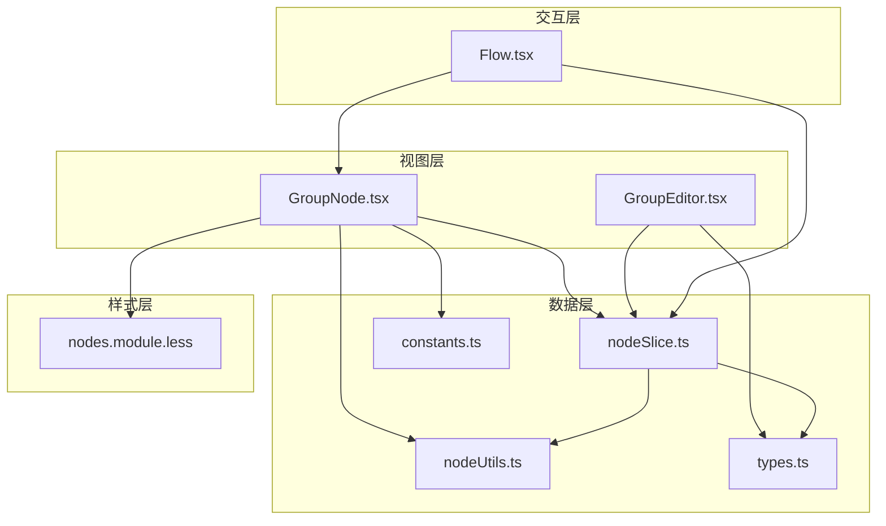
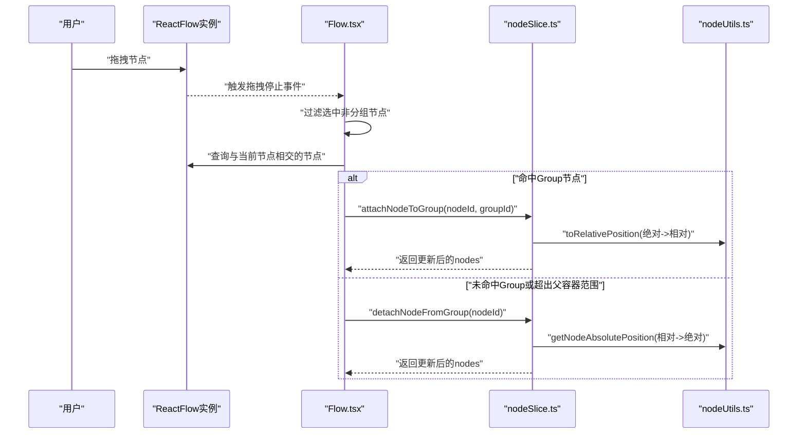
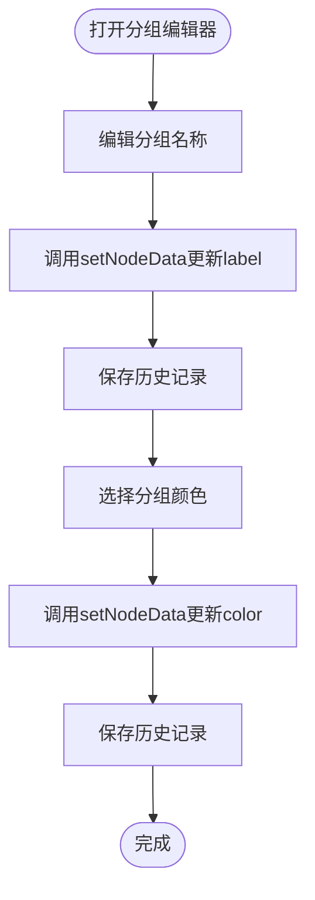
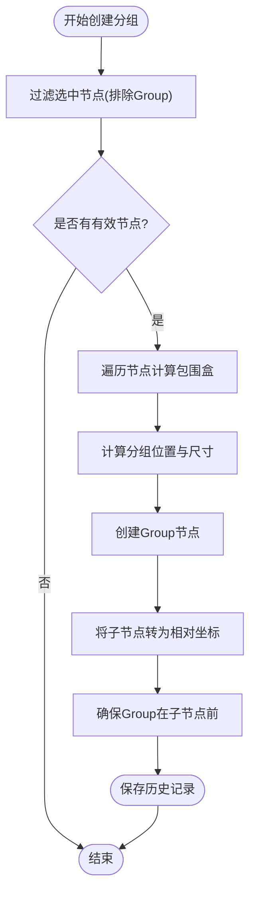
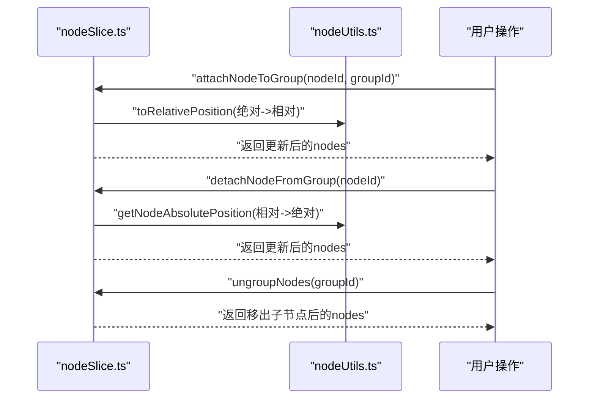
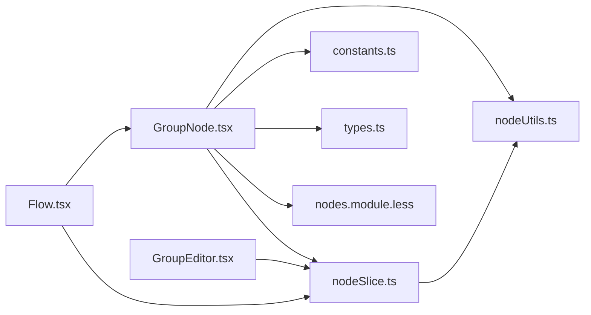

# Group节点

<cite>
**本文档引用的文件**
- [GroupNode.tsx](file://src/components/flow/nodes/GroupNode.tsx)
- [GroupEditor.tsx](file://src/components/panels/node-editors/GroupEditor.tsx)
- [nodes.module.less](file://src/styles/flow/nodes.module.less)
- [constants.ts](file://src/components/flow/nodes/constants.ts)
- [types.ts](file://src/stores/flow/types.ts)
- [nodeSlice.ts](file://src/stores/flow/slices/nodeSlice.ts)
- [nodeUtils.ts](file://src/stores/flow/utils/nodeUtils.ts)
- [Flow.tsx](file://src/components/Flow.tsx)
- [nodeJsonValidator.ts](file://src/utils/node/nodeJsonValidator.ts)
</cite>

## 目录
1. [简介](#简介)
2. [项目结构](#项目结构)
3. [核心组件](#核心组件)
4. [架构总览](#架构总览)
5. [详细组件分析](#详细组件分析)
6. [依赖关系分析](#依赖关系分析)
7. [性能考量](#性能考量)
8. [故障排查指南](#故障排查指南)
9. [结论](#结论)
10. [附录](#附录)

## 简介
本文件系统性阐述Group节点的分组功能与容器特性，覆盖节点组合、层级管理、批量操作、边界计算、展开折叠、内容显示与交互控制，并提供配置选项、样式定制与扩展开发指导。Group节点作为容器型节点，用于将多个子节点组织在一个可调整大小的分组框内，支持子节点的相对定位与父子关系维护。

## 项目结构
Group节点由三部分组成：
- 视图层：GroupNode.tsx负责渲染分组UI、标题输入、尺寸调整与上下文菜单。
- 数据层：Flow Store中的nodeSlice.ts提供分组创建、解散、子节点加入/移出等操作；nodeUtils.ts提供创建分组节点与保证父子顺序的工具方法。
- 编辑器：GroupEditor.tsx提供分组名称与颜色的主题配置面板。
- 样式：nodes.module.less定义分组节点的视觉样式与选中态。
- 类型与常量：types.ts定义Group节点数据结构；constants.ts定义节点类型枚举。



**图表来源**
- [GroupNode.tsx:110-158](file://src/components/flow/nodes/GroupNode.tsx#L110-L158)
- [GroupEditor.tsx:20-101](file://src/components/panels/node-editors/GroupEditor.tsx#L20-L101)
- [nodeSlice.ts:548-717](file://src/stores/flow/slices/nodeSlice.ts#L548-L717)
- [nodeUtils.ts:281-339](file://src/stores/flow/utils/nodeUtils.ts#L281-L339)
- [nodes.module.less:859-906](file://src/styles/flow/nodes.module.less#L859-L906)
- [constants.ts:14-20](file://src/components/flow/nodes/constants.ts#L14-L20)
- [types.ts:148-156](file://src/stores/flow/types.ts#L148-L156)
- [Flow.tsx:545-608](file://src/components/Flow.tsx#L545-L608)

**章节来源**
- [GroupNode.tsx:1-178](file://src/components/flow/nodes/GroupNode.tsx#L1-L178)
- [GroupEditor.tsx:1-102](file://src/components/panels/node-editors/GroupEditor.tsx#L1-L102)
- [nodeSlice.ts:548-717](file://src/stores/flow/slices/nodeSlice.ts#L548-L717)
- [nodeUtils.ts:281-339](file://src/stores/flow/utils/nodeUtils.ts#L281-L339)
- [nodes.module.less:859-906](file://src/styles/flow/nodes.module.less#L859-L906)
- [constants.ts:14-20](file://src/components/flow/nodes/constants.ts#L14-L20)
- [types.ts:148-156](file://src/stores/flow/types.ts#L148-L156)
- [Flow.tsx:545-608](file://src/components/Flow.tsx#L545-L608)

## 核心组件
- GroupNode组件：渲染分组容器、标题输入、尺寸调整器与上下文菜单，支持主题色配置与选中态样式。
- GroupEditor编辑器：提供分组名称与颜色主题的配置入口。
- Flow Store分组操作：创建分组、解散分组、子节点加入/移出、批量更新与历史记录保存。
- 工具函数：创建Group节点、确保父子顺序、坐标转换与绝对/相对位置换算。
- 样式模块：定义分组容器、标题栏、内容区与选中态的CSS类。

**章节来源**
- [GroupNode.tsx:110-158](file://src/components/flow/nodes/GroupNode.tsx#L110-L158)
- [GroupEditor.tsx:20-101](file://src/components/panels/node-editors/GroupEditor.tsx#L20-L101)
- [nodeSlice.ts:548-717](file://src/stores/flow/slices/nodeSlice.ts#L548-L717)
- [nodeUtils.ts:281-339](file://src/stores/flow/utils/nodeUtils.ts#L281-L339)
- [nodes.module.less:859-906](file://src/styles/flow/nodes.module.less#L859-L906)

## 架构总览
Group节点的架构围绕“容器-子节点”关系展开，采用React Flow的父子节点模型。Group节点本身不参与常规节点交互（如聚焦），但通过Flow.tsx的拖拽逻辑实现自动加入/脱离分组的行为。



**图表来源**
- [Flow.tsx:545-608](file://src/components/Flow.tsx#L545-L608)
- [nodeSlice.ts:663-717](file://src/stores/flow/slices/nodeSlice.ts#L663-L717)
- [nodeUtils.ts:1-200](file://src/stores/flow/utils/nodeUtils.ts#L1-L200)

**章节来源**
- [Flow.tsx:545-608](file://src/components/Flow.tsx#L545-L608)
- [nodeSlice.ts:663-717](file://src/stores/flow/slices/nodeSlice.ts#L663-L717)
- [nodeUtils.ts:1-200](file://src/stores/flow/utils/nodeUtils.ts#L1-L200)

## 详细组件分析

### GroupNode组件
- 主要职责
  - 渲染分组容器与标题输入框，支持主题色配置。
  - 提供尺寸调整器（NodeResizer），限定最小宽高。
  - 选中态时显示调整器与选中阴影。
  - 通过上下文菜单集成统一的节点操作入口。
- 关键实现要点
  - 主题色映射：GROUP_COLOR_THEMES根据color字段动态应用背景、边框、头部背景与文字色。
  - 标题变更：受控输入框，变更后调用setNodeData更新label，并在失焦时保存历史记录。
  - 选中态样式：基于props.selected切换CSS类，突出选中分组的视觉反馈。
  - 与Flow Store交互：通过useFlowStore访问setNodeData与saveHistory。

```mermaid
classDiagram
class GroupNode {
+props : NodeProps
+state : contextMenuOpen
+render() : JSX.Element
}
class GroupContent {
+props : { data, nodeId }
+handleTitleChange(e)
+handleTitleBlur()
+render() : JSX.Element
}
class NodeResizer {
+minWidth : number
+minHeight : number
+isVisible : boolean
+lineStyle
+handleStyle
}
class NodeContextMenu {
+node : NodeContextMenuNode
+open : boolean
+onOpenChange()
}
GroupNode --> GroupContent : "组合"
GroupNode --> NodeResizer : "使用"
GroupNode --> NodeContextMenu : "包装"
```

**图表来源**
- [GroupNode.tsx:110-158](file://src/components/flow/nodes/GroupNode.tsx#L110-L158)
- [GroupNode.tsx:52-107](file://src/components/flow/nodes/GroupNode.tsx#L52-L107)

**章节来源**
- [GroupNode.tsx:110-158](file://src/components/flow/nodes/GroupNode.tsx#L110-L158)
- [GroupNode.tsx:52-107](file://src/components/flow/nodes/GroupNode.tsx#L52-L107)

### GroupEditor编辑器
- 主要职责
  - 提供分组名称与颜色主题的配置入口。
  - 支持弹出气泡说明，提升易用性。
- 关键实现要点
  - 名称输入：受控Input，变更后调用setNodeData更新label。
  - 颜色选择：Select下拉框，支持多种主题色，变更后保存历史记录。



**图表来源**
- [GroupEditor.tsx:20-101](file://src/components/panels/node-editors/GroupEditor.tsx#L20-L101)

**章节来源**
- [GroupEditor.tsx:20-101](file://src/components/panels/node-editors/GroupEditor.tsx#L20-L101)

### 分组创建与边界计算
- 创建分组
  - 从选中节点集合中排除Group节点，计算包围盒，生成分组ID并创建Group节点。
  - 将选中节点设置为Group子节点，位置转换为相对坐标，最后确保Group在子节点之前。
- 边界计算
  - 使用节点测量尺寸或默认尺寸，计算包围盒的最小外接矩形，考虑内边距与标题高度。
  - 生成的分组尺寸为包围盒加内边距与标题高度的综合。



**图表来源**
- [nodeSlice.ts:548-624](file://src/stores/flow/slices/nodeSlice.ts#L548-L624)
- [nodeUtils.ts:281-339](file://src/stores/flow/utils/nodeUtils.ts#L281-L339)

**章节来源**
- [nodeSlice.ts:548-624](file://src/stores/flow/slices/nodeSlice.ts#L548-L624)
- [nodeUtils.ts:281-339](file://src/stores/flow/utils/nodeUtils.ts#L281-L339)

### 子节点管理与父子关系
- 加入分组
  - 将节点的parentId设为Group ID，并将绝对坐标转换为相对坐标。
  - 保持Group在子节点之前，确保渲染顺序正确。
- 移出分组
  - 清除parentId并将相对坐标转换回绝对坐标。
- 解散分组
  - 将Group的子节点全部移出，恢复为独立节点，同时清理Group自身。



**图表来源**
- [nodeSlice.ts:663-717](file://src/stores/flow/slices/nodeSlice.ts#L663-L717)
- [nodeUtils.ts:1-200](file://src/stores/flow/utils/nodeUtils.ts#L1-L200)

**章节来源**
- [nodeSlice.ts:663-717](file://src/stores/flow/slices/nodeSlice.ts#L663-L717)
- [nodeUtils.ts:1-200](file://src/stores/flow/utils/nodeUtils.ts#L1-L200)

### 展开折叠、内容显示与交互控制
- 展开/折叠
  - Group节点本身不提供显式的展开/折叠开关；其容器特性通过尺寸调整器与子节点的相对定位体现。
- 内容显示
  - 分组容器内部的“内容区”用于承载子节点渲染，标题栏用于编辑分组名称。
- 交互控制
  - 拖拽节点进入Group区域自动加入；拖出父容器范围自动移出。
  - 选中态显示尺寸调整器，支持最小宽高限制。

**章节来源**
- [GroupNode.tsx:110-158](file://src/components/flow/nodes/GroupNode.tsx#L110-L158)
- [Flow.tsx:545-608](file://src/components/Flow.tsx#L545-L608)

### 节点选择、移动与删除的批量处理
- 批量选择与移动
  - 仅对非Group节点执行加入/脱离分组判断；Group节点本身不参与常规拖拽逻辑。
  - 移动节点时，若节点中心超出父容器范围则自动脱离。
- 批量删除
  - 删除Group节点时，先将其子节点脱离父关系，再清理Group自身。
  - 删除完成后清理选中状态与顺序索引，并保存历史记录。

**章节来源**
- [nodeSlice.ts:54-135](file://src/stores/flow/slices/nodeSlice.ts#L54-L135)
- [Flow.tsx:545-608](file://src/components/Flow.tsx#L545-L608)

### 配置选项、样式定制与扩展开发
- 配置选项
  - 分组名称：支持编辑，变更后保存历史记录。
  - 颜色主题：支持蓝色、绿色、紫色、橙色、灰色五种主题。
- 样式定制
  - 通过主题色映射表动态应用背景、边框、头部背景与文字色。
  - 选中态添加阴影与高亮边框，提升交互反馈。
- 扩展开发
  - 自定义分组行为：可在Flow.tsx的拖拽逻辑基础上扩展新的加入/脱离规则。
  - 自定义操作接口：通过nodeSlice.ts提供的API扩展更多分组管理能力。

**章节来源**
- [GroupNode.tsx:13-47](file://src/components/flow/nodes/GroupNode.tsx#L13-L47)
- [nodes.module.less:859-906](file://src/styles/flow/nodes.module.less#L859-L906)
- [GroupEditor.tsx:11-17](file://src/components/panels/node-editors/GroupEditor.tsx#L11-L17)
- [Flow.tsx:545-608](file://src/components/Flow.tsx#L545-L608)

## 依赖关系分析
- 组件耦合
  - GroupNode依赖Flow Store进行数据更新与历史记录保存。
  - Flow.tsx通过React Flow实例与Store协作，实现自动加入/脱离分组。
- 外部依赖
  - 使用@xyflow/react的NodeResizer与NodeContextMenu组件。
  - 使用Ant Design的Select与Input组件构建编辑器。
- 类型与常量
  - NodeTypeEnum定义Group类型；GroupNodeDataType定义数据结构。



**图表来源**
- [GroupNode.tsx:1-11](file://src/components/flow/nodes/GroupNode.tsx#L1-L11)
- [GroupEditor.tsx:1-9](file://src/components/panels/node-editors/GroupEditor.tsx#L1-L9)
- [Flow.tsx:545-608](file://src/components/Flow.tsx#L545-L608)
- [nodeSlice.ts:548-717](file://src/stores/flow/slices/nodeSlice.ts#L548-L717)
- [nodeUtils.ts:281-339](file://src/stores/flow/utils/nodeUtils.ts#L281-L339)
- [constants.ts:14-20](file://src/components/flow/nodes/constants.ts#L14-L20)
- [types.ts:148-156](file://src/stores/flow/types.ts#L148-L156)
- [nodes.module.less:859-906](file://src/styles/flow/nodes.module.less#L859-L906)

**章节来源**
- [GroupNode.tsx:1-11](file://src/components/flow/nodes/GroupNode.tsx#L1-L11)
- [GroupEditor.tsx:1-9](file://src/components/panels/node-editors/GroupEditor.tsx#L1-L9)
- [Flow.tsx:545-608](file://src/components/Flow.tsx#L545-L608)
- [nodeSlice.ts:548-717](file://src/stores/flow/slices/nodeSlice.ts#L548-L717)
- [nodeUtils.ts:281-339](file://src/stores/flow/utils/nodeUtils.ts#L281-L339)
- [constants.ts:14-20](file://src/components/flow/nodes/constants.ts#L14-L20)
- [types.ts:148-156](file://src/stores/flow/types.ts#L148-L156)
- [nodes.module.less:859-906](file://src/styles/flow/nodes.module.less#L859-L906)

## 性能考量
- 渲染优化
  - GroupNode使用memo包裹，避免不必要的重渲染；GroupNodeMemo对关键字段进行浅比较。
  - GroupContent内部仅在数据变化时更新，减少输入框重渲染。
- 数据更新
  - 批量操作通过Flow Store的slice集中处理，避免频繁触发订阅。
- 坐标计算
  - 使用测量尺寸优先策略，减少默认尺寸带来的误差与重排。

**章节来源**
- [GroupNode.tsx:160-177](file://src/components/flow/nodes/GroupNode.tsx#L160-L177)
- [nodeSlice.ts:548-624](file://src/stores/flow/slices/nodeSlice.ts#L548-L624)

## 故障排查指南
- 分组无法加入/脱离
  - 检查节点是否处于选中状态且非Group节点。
  - 确认父容器尺寸与节点中心位置计算逻辑。
- 标题编辑无效
  - 确认setNodeData调用链路与saveHistory是否正常触发。
- 颜色主题不生效
  - 检查color字段是否为允许值（blue/green/purple/orange/gray）。
- 导入数据异常
  - 使用节点JSON校验器验证Group节点的label与color字段。

**章节来源**
- [Flow.tsx:545-608](file://src/components/Flow.tsx#L545-L608)
- [GroupNode.tsx:61-76](file://src/components/flow/nodes/GroupNode.tsx#L61-L76)
- [nodeJsonValidator.ts:316-352](file://src/utils/node/nodeJsonValidator.ts#L316-L352)

## 结论
Group节点通过容器化设计实现了节点的逻辑分组与层级管理，结合Flow Store的分组操作与自动加入/脱离机制，提供了直观高效的批量操作体验。配合主题化样式与编辑器，用户可以灵活地组织与管理复杂的工作流结构。

## 附录
- 相关类型定义
  - GroupNodeDataType：包含label与color字段。
  - GroupColorTheme：支持的颜色主题枚举。
- 常用工具
  - createGroupNode：创建Group节点。
  - ensureGroupNodeOrder：保证Group在子节点之前。
  - toRelativePosition/getNodeAbsolutePosition：坐标转换工具。

**章节来源**
- [types.ts:148-156](file://src/stores/flow/types.ts#L148-L156)
- [nodeUtils.ts:281-339](file://src/stores/flow/utils/nodeUtils.ts#L281-L339)
- [constants.ts:14-20](file://src/components/flow/nodes/constants.ts#L14-L20)