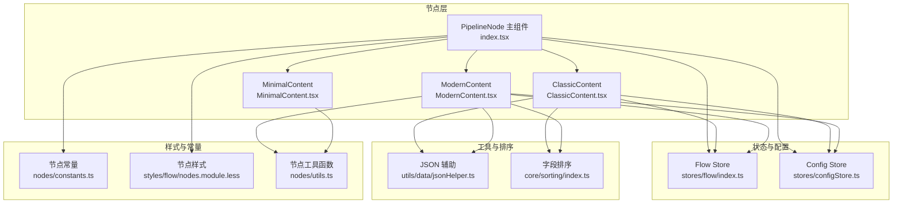
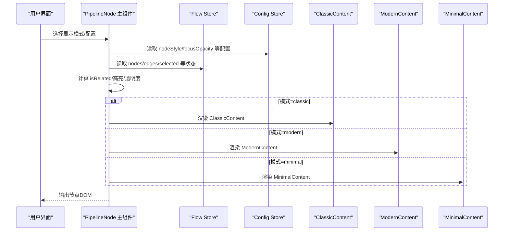
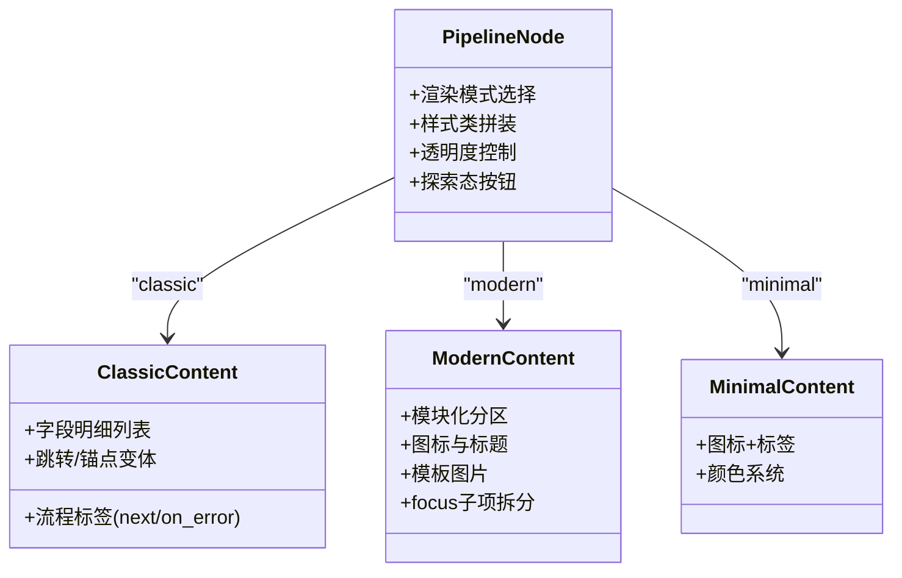
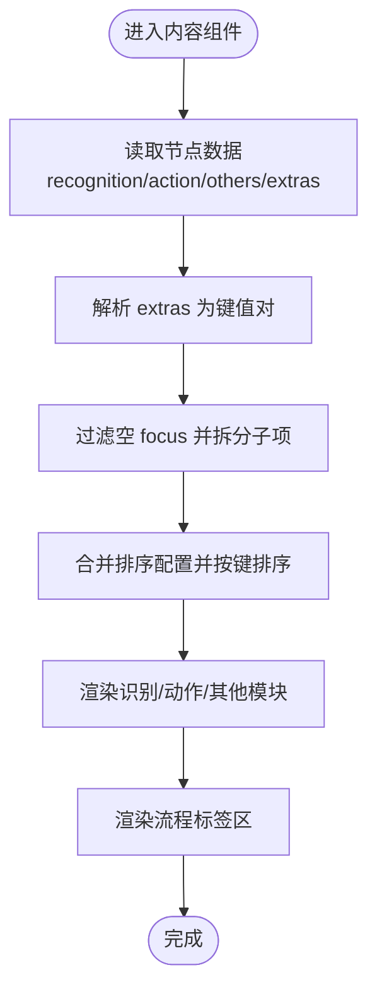
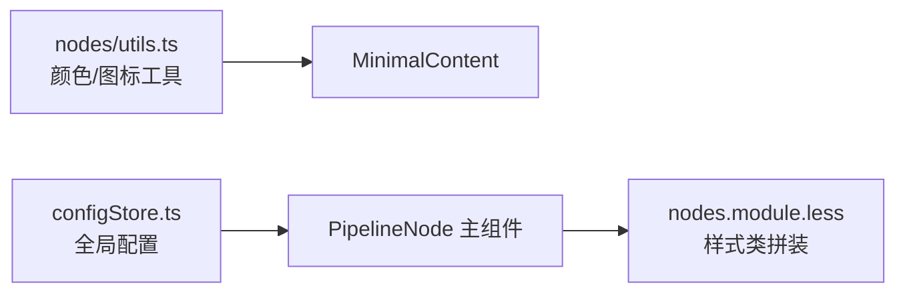
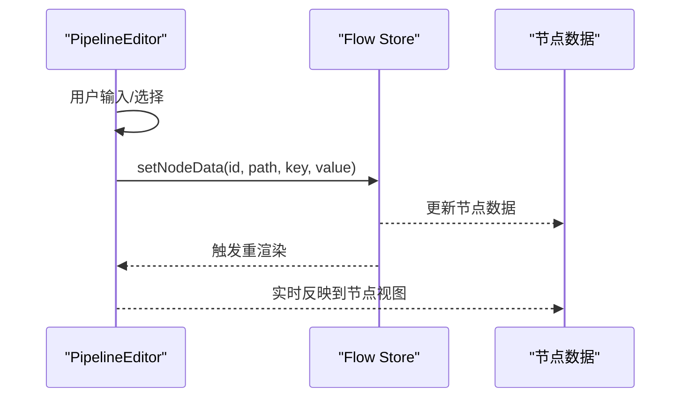
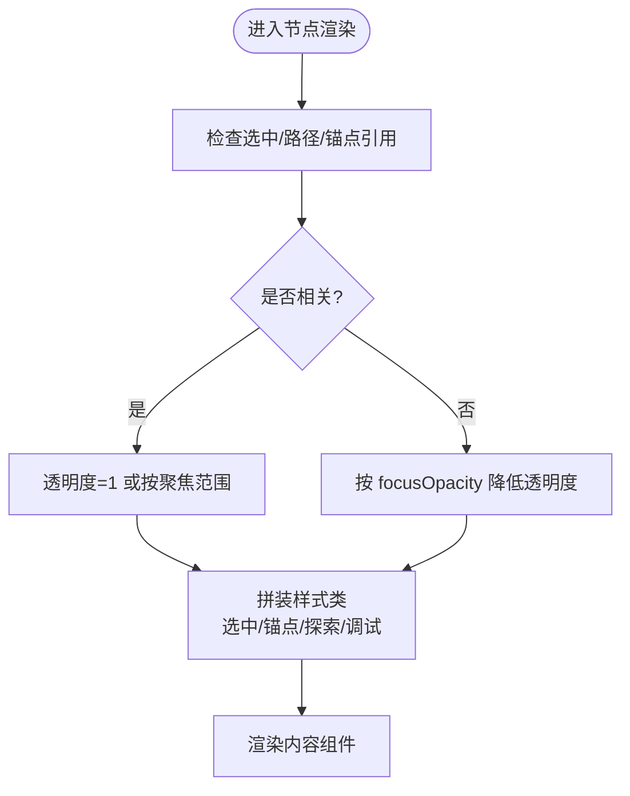
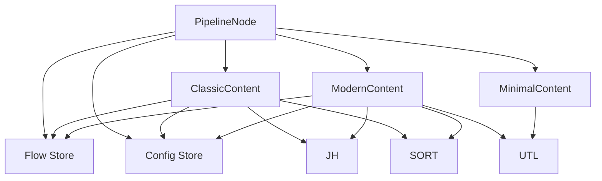

# Pipeline节点

<cite>
**本文引用的文件**
- [src/components/flow/nodes/PipelineNode/index.tsx](file://src/components/flow/nodes/PipelineNode/index.tsx)
- [src/components/flow/nodes/PipelineNode/ClassicContent.tsx](file://src/components/flow/nodes/PipelineNode/ClassicContent.tsx)
- [src/components/flow/nodes/PipelineNode/ModernContent.tsx](file://src/components/flow/nodes/PipelineNode/ModernContent.tsx)
- [src/components/flow/nodes/PipelineNode/MinimalContent.tsx](file://src/components/flow/nodes/PipelineNode/MinimalContent.tsx)
- [src/components/panels/node-editors/PipelineEditor.tsx](file://src/components/panels/node-editors/PipelineEditor.tsx)
- [src/components/flow/nodes/constants.ts](file://src/components/flow/nodes/constants.ts)
- [src/stores/flow/index.ts](file://src/stores/flow/index.ts)
- [src/stores/configStore.ts](file://src/stores/configStore.ts)
- [src/utils/data/jsonHelper.ts](file://src/utils/data/jsonHelper.ts)
- [src/core/sorting/index.ts](file://src/core/sorting/index.ts)
- [src/components/flow/nodes/utils.ts](file://src/components/flow/nodes/utils.ts)
- [src/styles/flow/nodes.module.less](file://src/styles/flow/nodes.module.less)
</cite>

## 目录
1. [简介](#简介)
2. [项目结构](#项目结构)
3. [核心组件](#核心组件)
4. [架构总览](#架构总览)
5. [详细组件分析](#详细组件分析)
6. [依赖分析](#依赖分析)
7. [性能考虑](#性能考虑)
8. [故障排查指南](#故障排查指南)
9. [结论](#结论)
10. [附录](#附录)

## 简介
本文件面向Pipeline节点的技术文档，系统性阐述其核心功能、三种显示模式（Classic、Modern、Minimal）的设计差异与适用场景、内容渲染机制、标签颜色系统与样式定制、属性编辑与字段配置、动态内容更新策略、状态管理与交互反馈，以及扩展开发指南（自定义显示模式、属性编辑器与事件处理）。文档以仓库现有实现为依据，结合可视化图示帮助读者快速理解与二次开发。

## 项目结构
Pipeline节点位于前端Flow画布的节点体系中，采用“主组件 + 多种内容渲染子组件”的分层设计，配合全局状态与配置中心，实现可配置、可扩展、可交互的节点体验。

**图表来源**
- [src/components/flow/nodes/PipelineNode/index.tsx:1-310](file://src/components/flow/nodes/PipelineNode/index.tsx#L1-L310)
- [src/components/flow/nodes/PipelineNode/ClassicContent.tsx:1-169](file://src/components/flow/nodes/PipelineNode/ClassicContent.tsx#L1-L169)
- [src/components/flow/nodes/PipelineNode/ModernContent.tsx:1-331](file://src/components/flow/nodes/PipelineNode/ModernContent.tsx#L1-L331)
- [src/components/flow/nodes/PipelineNode/MinimalContent.tsx:1-58](file://src/components/flow/nodes/PipelineNode/MinimalContent.tsx#L1-L58)
- [src/stores/flow/index.ts](file://src/stores/flow/index.ts)
- [src/stores/configStore.ts](file://src/stores/configStore.ts)
- [src/utils/data/jsonHelper.ts](file://src/utils/data/jsonHelper.ts)
- [src/core/sorting/index.ts](file://src/core/sorting/index.ts)
- [src/components/flow/nodes/constants.ts](file://src/components/flow/nodes/constants.ts)
- [src/styles/flow/nodes.module.less](file://src/styles/flow/nodes.module.less)
- [src/components/flow/nodes/utils.ts](file://src/components/flow/nodes/utils.ts)

**章节来源**
- [src/components/flow/nodes/PipelineNode/index.tsx:1-310](file://src/components/flow/nodes/PipelineNode/index.tsx#L1-L310)
- [src/components/flow/nodes/constants.ts:1-47](file://src/components/flow/nodes/constants.ts#L1-L47)

## 核心组件
- PipelineNode 主组件：负责根据全局配置选择渲染模式、计算节点样式、处理探索态交互、聚合状态与上下文菜单。
- ClassicContent：经典模式，强调字段明细与流程连接展示，适合初学者与需要完整信息的场景。
- ModernContent：现代模式，模块化分区、图标增强、模板图片支持，适合追求信息密度与视觉层次的场景。
- MinimalContent：极简模式，仅保留关键标识与名称，适合大规模布局与低干扰场景。
- PipelineEditor：节点属性编辑器，提供字段增删改、排序、复杂字段（如waitFreezes）的结构化编辑能力。

**章节来源**
- [src/components/flow/nodes/PipelineNode/index.tsx:28-310](file://src/components/flow/nodes/PipelineNode/index.tsx#L28-L310)
- [src/components/flow/nodes/PipelineNode/ClassicContent.tsx:17-169](file://src/components/flow/nodes/PipelineNode/ClassicContent.tsx#L17-L169)
- [src/components/flow/nodes/PipelineNode/ModernContent.tsx:35-331](file://src/components/flow/nodes/PipelineNode/ModernContent.tsx#L35-L331)
- [src/components/flow/nodes/PipelineNode/MinimalContent.tsx:10-58](file://src/components/flow/nodes/PipelineNode/MinimalContent.tsx#L10-L58)
- [src/components/panels/node-editors/PipelineEditor.tsx:1-964](file://src/components/panels/node-editors/PipelineEditor.tsx#L1-L964)

## 架构总览
Pipeline节点的运行链路由“状态驱动渲染 + 配置驱动外观 + 工具函数辅助”构成。主组件根据全局配置决定渲染模式；内容组件基于数据与排序配置渲染字段与流程标签；编辑器通过统一的数据更新接口修改节点数据；样式与工具函数提供主题与颜色、图标等辅助能力。

**图表来源**
- [src/components/flow/nodes/PipelineNode/index.tsx:29-200](file://src/components/flow/nodes/PipelineNode/index.tsx#L29-L200)
- [src/stores/configStore.ts](file://src/stores/configStore.ts)
- [src/stores/flow/index.ts](file://src/stores/flow/index.ts)

## 详细组件分析

### 显示模式对比与适用场景
- Classic（经典）
  - 特点：列表式字段展示、流程连接区清晰标注 next/on_error 与跳转/锚点变体。
  - 适用：初学者入门、需要完整字段一览、便于审阅与教学。
- Modern（现代）
  - 特点：模块化分区（识别/动作/其他）、图标增强、模板图片展示、支持 focus 子项拆分显示。
  - 适用：信息密度较高、需要视觉层级与可读性的场景。
- Minimal（极简）
  - 特点：仅保留图标与标签，使用识别类型色板，适合大规模布局。
  - 适用：画布拥挤、强调连接关系、降低视觉噪音。

**图表来源**
- [src/components/flow/nodes/PipelineNode/index.tsx:190-200](file://src/components/flow/nodes/PipelineNode/index.tsx#L190-L200)
- [src/components/flow/nodes/PipelineNode/ClassicContent.tsx:105-166](file://src/components/flow/nodes/PipelineNode/ClassicContent.tsx#L105-L166)
- [src/components/flow/nodes/PipelineNode/ModernContent.tsx:192-328](file://src/components/flow/nodes/PipelineNode/ModernContent.tsx#L192-L328)
- [src/components/flow/nodes/PipelineNode/MinimalContent.tsx:24-55](file://src/components/flow/nodes/PipelineNode/MinimalContent.tsx#L24-L55)

**章节来源**
- [src/components/flow/nodes/PipelineNode/ClassicContent.tsx:17-169](file://src/components/flow/nodes/PipelineNode/ClassicContent.tsx#L17-L169)
- [src/components/flow/nodes/PipelineNode/ModernContent.tsx:35-331](file://src/components/flow/nodes/PipelineNode/ModernContent.tsx#L35-L331)
- [src/components/flow/nodes/PipelineNode/MinimalContent.tsx:10-58](file://src/components/flow/nodes/PipelineNode/MinimalContent.tsx#L10-L58)

### 内容渲染机制与字段排序
- 字段来源与过滤
  - recognition/action/others/extras 统一从节点数据读取，支持字符串/对象混合存储并通过 JSON 辅助进行解析与回写。
  - 对 others 中的 focus 字段进行空值过滤与结构化拆分，避免冗余显示。
- 排序策略
  - 合并全局字段排序配置，对三类字段分别排序，保证渲染一致性与可配置性。
- 流程连接渲染
  - 基于出边集合，区分 next 与 on_error，标注 jump_back 与 anchor 变体，形成“标签+箭头+目标”的连接区。

**图表来源**
- [src/components/flow/nodes/PipelineNode/ClassicContent.tsx:56-103](file://src/components/flow/nodes/PipelineNode/ClassicContent.tsx#L56-L103)
- [src/components/flow/nodes/PipelineNode/ModernContent.tsx:89-149](file://src/components/flow/nodes/PipelineNode/ModernContent.tsx#L89-L149)
- [src/utils/data/jsonHelper.ts](file://src/utils/data/jsonHelper.ts)
- [src/core/sorting/index.ts](file://src/core/sorting/index.ts)

**章节来源**
- [src/components/flow/nodes/PipelineNode/ClassicContent.tsx:22-103](file://src/components/flow/nodes/PipelineNode/ClassicContent.tsx#L22-L103)
- [src/components/flow/nodes/PipelineNode/ModernContent.tsx:62-149](file://src/components/flow/nodes/PipelineNode/ModernContent.tsx#L62-L149)
- [src/utils/data/jsonHelper.ts](file://src/utils/data/jsonHelper.ts)
- [src/core/sorting/index.ts](file://src/core/sorting/index.ts)

### 标签颜色系统与样式定制
- 颜色系统
  - 极简模式使用识别类型对应的颜色配置，通过工具函数返回主色与背景色，保证不同识别类型的节点具备一致的语义色感。
- 样式定制
  - 主组件根据全局配置拼装样式类，支持选中态、锚点引用高亮、探索态高亮、调试态高亮等多态样式叠加。
  - 透明度与聚焦范围由配置控制，支持“仅聚焦相关节点”的视觉引导。

**图表来源**
- [src/components/flow/nodes/utils.ts](file://src/components/flow/nodes/utils.ts)
- [src/components/flow/nodes/PipelineNode/MinimalContent.tsx:13-32](file://src/components/flow/nodes/PipelineNode/MinimalContent.tsx#L13-L32)
- [src/components/flow/nodes/PipelineNode/index.tsx:157-182](file://src/components/flow/nodes/PipelineNode/index.tsx#L157-L182)
- [src/stores/configStore.ts](file://src/stores/configStore.ts)
- [src/styles/flow/nodes.module.less](file://src/styles/flow/nodes.module.less)

**章节来源**
- [src/components/flow/nodes/PipelineNode/MinimalContent.tsx:13-32](file://src/components/flow/nodes/PipelineNode/MinimalContent.tsx#L13-L32)
- [src/components/flow/nodes/PipelineNode/index.tsx:157-188](file://src/components/flow/nodes/PipelineNode/index.tsx#L157-L188)

### 属性编辑与字段配置
- 编辑入口
  - PipelineEditor 作为节点属性面板，提供识别类型、动作类型、others 等字段的增删改与排序。
- 复杂字段处理
  - focus/waitFreezes 等字段支持字符串/对象两种模式，切换时弹窗确认，避免数据丢失。
  - waitFreezes 支持整数与结构化子字段混合编辑，提供增删子项与回退逻辑。
- 数据更新
  - 通过 Flow Store 的统一 setNodeData 接口更新节点数据，确保响应式刷新与历史记录可用。

**图表来源**
- [src/components/panels/node-editors/PipelineEditor.tsx:24-800](file://src/components/panels/node-editors/PipelineEditor.tsx#L24-L800)
- [src/stores/flow/index.ts](file://src/stores/flow/index.ts)

**章节来源**
- [src/components/panels/node-editors/PipelineEditor.tsx:54-800](file://src/components/panels/node-editors/PipelineEditor.tsx#L54-L800)

### 状态管理、选择高亮与交互反馈
- 状态聚合
  - 主组件从 Flow Store 读取 selectedNodes/selectedEdges/edges/pathMode/pathNodeIds/anchorRefHighlightedNodeIds 等状态，综合判断“相关性”与“聚焦范围”。
- 透明度与高亮
  - 当节点与选中元素相关、处于路径模式或锚点引用高亮时，提升可见性；否则按配置降低透明度。
- 探索态交互
  - 在 review 状态且匹配 ghostNodeId 时，显示执行/重新生成/确认三个快捷按钮，直接调用 Flow Store 的执行/再生/确认流程。
- 调试态高亮
  - 结合调试覆盖层，高亮当前节点与正在识别的节点，辅助定位问题。

**图表来源**
- [src/components/flow/nodes/PipelineNode/index.tsx:77-188](file://src/components/flow/nodes/PipelineNode/index.tsx#L77-L188)

**章节来源**
- [src/components/flow/nodes/PipelineNode/index.tsx:77-188](file://src/components/flow/nodes/PipelineNode/index.tsx#L77-L188)

### 扩展开发指南
- 自定义显示模式
  - 新建一个内容组件（如 MyModeContent），遵循现有结构：接收 data 与 props，渲染标题、字段与流程标签，必要时引入工具函数与样式类。
  - 在主组件的渲染分支中增加模式判断，返回新组件实例。
- 自定义属性编辑器
  - 在 PipelineEditor 中新增字段面板，参考 waitFreezes 的双模式切换与确认弹窗逻辑，确保数据安全与可回退。
  - 使用统一 setNodeData 接口更新节点数据，保持响应式联动。
- 事件处理
  - 在主组件中注册右键菜单与快捷按钮事件，调用 Flow Store 的执行/再生/确认等方法，实现探索态闭环。
  - 如需跨组件通信，可通过全局状态或事件总线扩展。

**章节来源**
- [src/components/flow/nodes/PipelineNode/index.tsx:190-200](file://src/components/flow/nodes/PipelineNode/index.tsx#L190-L200)
- [src/components/panels/node-editors/PipelineEditor.tsx:132-195](file://src/components/panels/node-editors/PipelineEditor.tsx#L132-L195)

## 依赖分析
- 组件耦合
  - 主组件对内容组件采用组合式渲染，耦合度低；内容组件依赖 Flow Store、Config Store、排序与 JSON 工具。
- 外部依赖
  - @xyflow/react 提供节点框架；Ant Design 提供 UI 组件与图标；Less 提供样式组织。
- 循环依赖
  - 未发现循环依赖迹象；工具函数与样式独立于组件树。

**图表来源**
- [src/components/flow/nodes/PipelineNode/index.tsx:1-310](file://src/components/flow/nodes/PipelineNode/index.tsx#L1-L310)
- [src/components/flow/nodes/PipelineNode/ClassicContent.tsx:1-169](file://src/components/flow/nodes/PipelineNode/ClassicContent.tsx#L1-L169)
- [src/components/flow/nodes/PipelineNode/ModernContent.tsx:1-331](file://src/components/flow/nodes/PipelineNode/ModernContent.tsx#L1-L331)
- [src/components/flow/nodes/PipelineNode/MinimalContent.tsx:1-58](file://src/components/flow/nodes/PipelineNode/MinimalContent.tsx#L1-L58)
- [src/stores/flow/index.ts](file://src/stores/flow/index.ts)
- [src/stores/configStore.ts](file://src/stores/configStore.ts)
- [src/utils/data/jsonHelper.ts](file://src/utils/data/jsonHelper.ts)
- [src/core/sorting/index.ts](file://src/core/sorting/index.ts)
- [src/components/flow/nodes/utils.ts](file://src/components/flow/nodes/utils.ts)

**章节来源**
- [src/components/flow/nodes/constants.ts:1-47](file://src/components/flow/nodes/constants.ts#L1-L47)

## 性能考虑
- 渲染优化
  - 使用 memo 包裹内容组件与主组件，减少不必要的重渲染。
  - 通过 useMemo 缓存排序结果、边与节点映射、焦点拆分等计算结果。
- 数据访问
  - 优先使用浅订阅与选择器，避免全量状态订阅导致的过度渲染。
- 大规模画布
  - 极简模式与较低透明度有助于在大量节点场景下维持流畅度。

[本节为通用建议，无需特定文件引用]

## 故障排查指南
- 字段显示异常
  - 检查 extras 是否为合法对象/字符串，确认 JSON 解析与回写逻辑。
  - 核对排序配置是否正确合并，确保字段按键排序。
- 流程标签不显示
  - 确认出边集合与 sourceHandle/targetHandle 类型是否正确，检查 jump_back/anchor 标记逻辑。
- 样式错乱
  - 检查全局配置是否正确，确认样式类拼装顺序与覆盖关系。
- 探索态按钮无效
  - 确认 ghostNodeId 与状态是否匹配 review，检查执行/再生/确认方法是否正确绑定。

**章节来源**
- [src/components/flow/nodes/PipelineNode/ClassicContent.tsx:22-40](file://src/components/flow/nodes/PipelineNode/ClassicContent.tsx#L22-L40)
- [src/components/flow/nodes/PipelineNode/ModernContent.tsx:62-80](file://src/components/flow/nodes/PipelineNode/ModernContent.tsx#L62-L80)
- [src/components/flow/nodes/PipelineNode/index.tsx:202-216](file://src/components/flow/nodes/PipelineNode/index.tsx#L202-L216)

## 结论
Pipeline节点通过“主组件 + 多模式内容组件 + 全局状态/配置 + 工具函数”的架构，实现了可配置、可扩展、可交互的节点体验。三种显示模式满足不同场景需求，属性编辑器提供完善的字段管理能力，状态与样式系统保障了良好的交互反馈。扩展开发时，遵循现有模式即可快速集成新的渲染与编辑能力。

[本节为总结，无需特定文件引用]

## 附录
- 关键常量与类型
  - 节点类型与句柄方向枚举、默认方向与选项，用于统一节点行为与布局。
- 样式命名约定
  - 节点样式类按 classic/modern/minimal 与状态态命名，便于主题化与覆盖。

**章节来源**
- [src/components/flow/nodes/constants.ts:1-47](file://src/components/flow/nodes/constants.ts#L1-L47)
- [src/styles/flow/nodes.module.less](file://src/styles/flow/nodes.module.less)