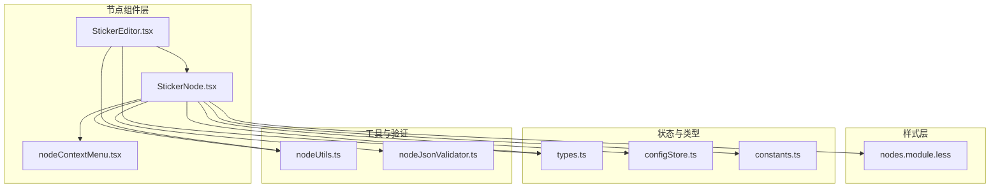
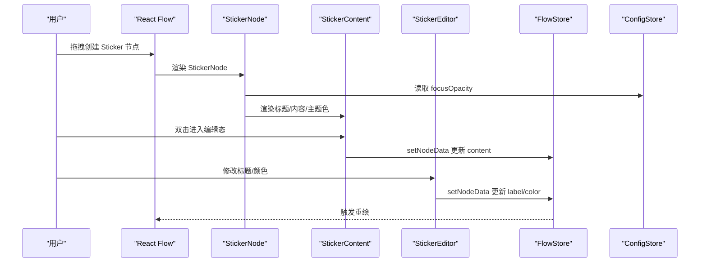
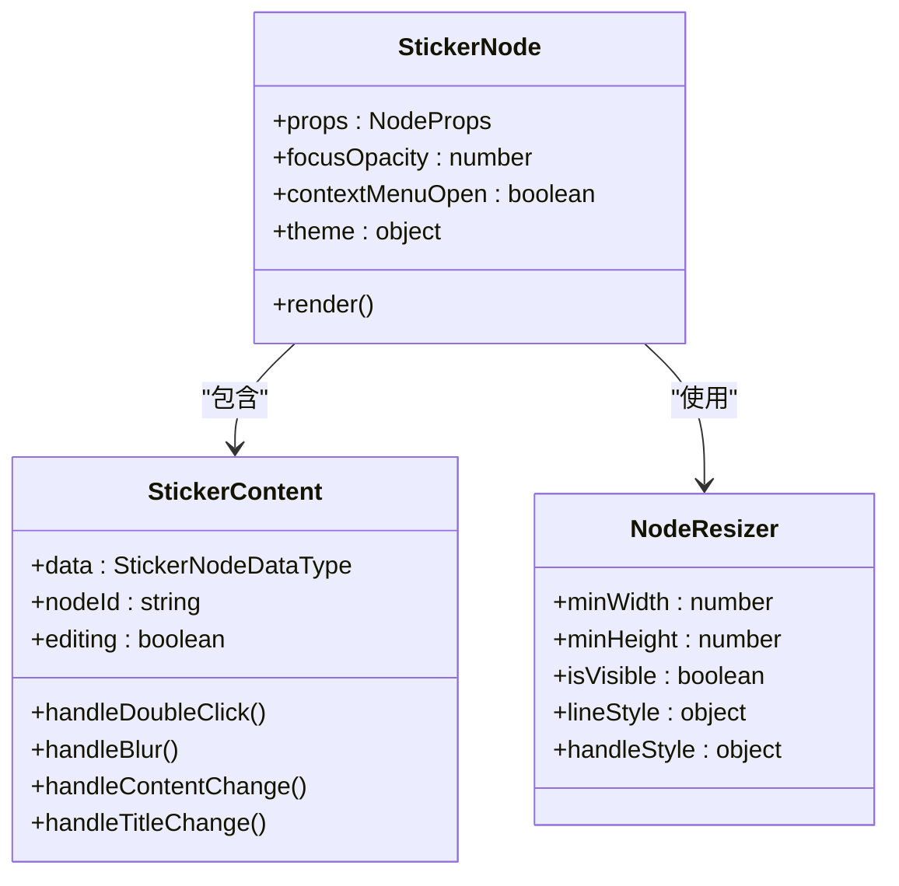
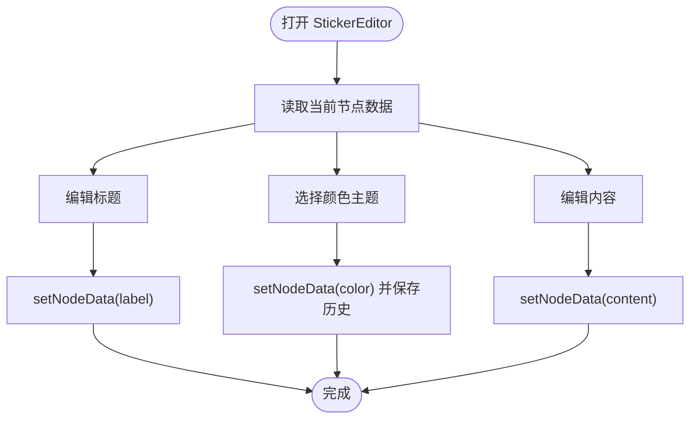
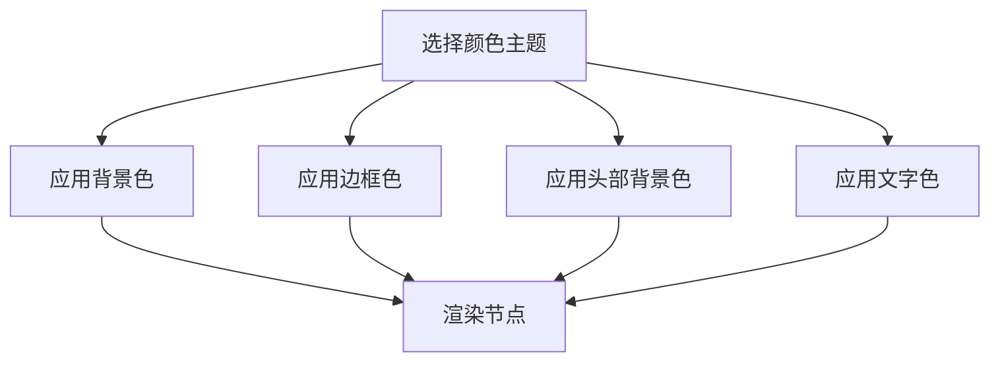
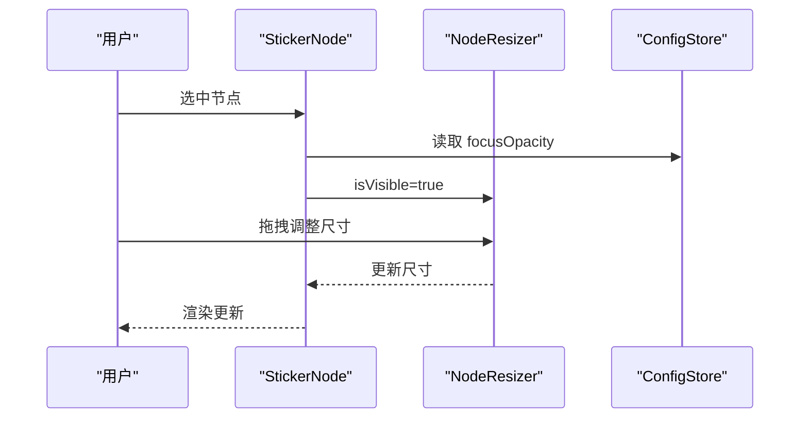
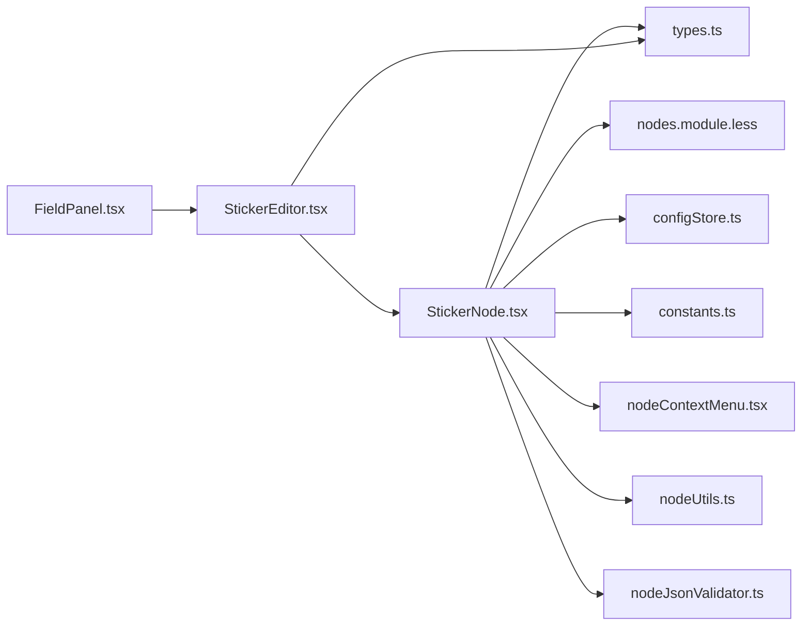

# Sticker节点

<cite>
**本文档引用的文件**
- [StickerNode.tsx](file://src/components/flow/nodes/StickerNode.tsx)
- [StickerEditor.tsx](file://src/components/panels/node-editors/StickerEditor.tsx)
- [types.ts](file://src/stores/flow/types.ts)
- [nodes.module.less](file://src/styles/flow/nodes.module.less)
- [constants.ts](file://src/components/flow/nodes/constants.ts)
- [configStore.ts](file://src/stores/configStore.ts)
- [nodeContextMenu.tsx](file://src/components/flow/nodes/nodeContextMenu.tsx)
- [nodeUtils.ts](file://src/stores/flow/utils/nodeUtils.ts)
- [nodeJsonValidator.ts](file://src/utils/node/nodeJsonValidator.ts)
- [FieldPanel.tsx](file://src/components/panels/main/FieldPanel.tsx)
</cite>

## 目录
1. [简介](#简介)
2. [项目结构](#项目结构)
3. [核心组件](#核心组件)
4. [架构总览](#架构总览)
5. [详细组件分析](#详细组件分析)
6. [依赖关系分析](#依赖关系分析)
7. [性能考量](#性能考量)
8. [故障排查指南](#故障排查指南)
9. [结论](#结论)
10. [附录](#附录)

## 简介
本文件系统性阐述 Sticker 节点的设计理念、装饰功能与交互行为，覆盖节点的视觉样式、尺寸调整、透明度控制、上下文菜单操作、拖拽放置与层级管理，并提供素材管理、自定义贴纸与样式定制的实践指导。Sticker 节点作为流程图中的“便签”装饰元素，强调可读性与标注能力，同时保持与主流程节点一致的编辑与持久化体验。

## 项目结构
Sticker 节点位于前端可视化编辑器的节点体系中，采用 React + Less 样式组织，配合全局配置与节点存储层实现统一的数据驱动与状态管理。

**图表来源**
- [StickerNode.tsx:1-242](file://src/components/flow/nodes/StickerNode.tsx#L1-L242)
- [StickerEditor.tsx:1-137](file://src/components/panels/node-editors/StickerEditor.tsx#L1-L137)
- [nodes.module.less:752-843](file://src/styles/flow/nodes.module.less#L752-L843)
- [types.ts:138-146](file://src/stores/flow/types.ts#L138-L146)
- [configStore.ts:147-210](file://src/stores/configStore.ts#L147-L210)
- [constants.ts:14-20](file://src/components/flow/nodes/constants.ts#L14-L20)
- [nodeContextMenu.tsx:637-700](file://src/components/flow/nodes/nodeContextMenu.tsx#L637-L700)
- [nodeUtils.ts:120-161](file://src/stores/flow/utils/nodeUtils.ts#L120-L161)
- [nodeJsonValidator.ts:259-311](file://src/utils/node/nodeJsonValidator.ts#L259-L311)

**章节来源**
- [StickerNode.tsx:1-242](file://src/components/flow/nodes/StickerNode.tsx#L1-L242)
- [StickerEditor.tsx:1-137](file://src/components/panels/node-editors/StickerEditor.tsx#L1-L137)
- [nodes.module.less:752-843](file://src/styles/flow/nodes.module.less#L752-L843)

## 核心组件
- StickerNode：Sticker 节点的渲染与交互入口，负责尺寸调整、主题色、上下文菜单、编辑态切换等。
- StickerEditor：Sticker 节点的属性编辑器，提供标题、内容、颜色的主题选择。
- 样式模块 nodes.module.less：定义 Sticker 节点的视觉样式与交互态。
- 类型与常量：StickerNodeDataType、StickerColorTheme、NodeTypeEnum 等。
- 配置中心：focusOpacity 等全局配置影响 Sticker 节点的聚焦表现。
- 工具与验证：节点创建工具、JSON 校验器确保数据一致性。

**章节来源**
- [types.ts:138-146](file://src/stores/flow/types.ts#L138-L146)
- [constants.ts:14-20](file://src/components/flow/nodes/constants.ts#L14-L20)
- [configStore.ts:147-210](file://src/stores/configStore.ts#L147-L210)

## 架构总览
Sticker 节点在 React Flow 的节点体系中运行，通过 NodeResizer 提供尺寸调整，通过 StickerContent 支持双击编辑文本，通过上下文菜单支持颜色切换与删除等操作。节点数据由 FlowStore 管理，编辑器 FieldPanel 在右侧展示当前选中节点的属性面板。

**图表来源**
- [StickerNode.tsx:168-219](file://src/components/flow/nodes/StickerNode.tsx#L168-L219)
- [StickerEditor.tsx:21-69](file://src/components/panels/node-editors/StickerEditor.tsx#L21-L69)
- [configStore.ts:147-210](file://src/stores/configStore.ts#L147-L210)

## 详细组件分析

### StickerNode 组件
- 设计理念
  - 以“便签”为核心语义，强调可读性与标注能力；标题栏突出、内容区支持多行文本。
  - 主题色通过 STICKER_COLOR_THEMES 配置，统一边框、背景与文字色彩。
- 交互行为
  - NodeResizer：最小宽高限制，仅选中时可见，支持拖拽调整尺寸。
  - StickerContent：双击进入编辑态，失焦保存历史记录；支持标题输入与内容编辑。
  - 上下文菜单：支持颜色切换与删除节点。
- 焦点与层级
  - Sticker 节点不受全局 focusOpacity 的聚焦效果影响，保持稳定视觉。
  - 选中态通过样式类切换，增强可发现性。

**图表来源**
- [StickerNode.tsx:16-51](file://src/components/flow/nodes/StickerNode.tsx#L16-L51)
- [StickerNode.tsx:55-165](file://src/components/flow/nodes/StickerNode.tsx#L55-L165)
- [StickerNode.tsx:168-219](file://src/components/flow/nodes/StickerNode.tsx#L168-L219)

**章节来源**
- [StickerNode.tsx:16-51](file://src/components/flow/nodes/StickerNode.tsx#L16-L51)
- [StickerNode.tsx:55-165](file://src/components/flow/nodes/StickerNode.tsx#L55-L165)
- [StickerNode.tsx:168-219](file://src/components/flow/nodes/StickerNode.tsx#L168-L219)

### StickerEditor 编辑器
- 字段说明
  - 标题：支持直接修改节点标签。
  - 颜色：提供五种主题色选择，变更后保存历史记录。
  - 内容：多行文本编辑，支持自动高度调整。
- 数据绑定
  - 通过 useFlowStore 的 setNodeData 更新对应字段，保证与节点数据同步。

**图表来源**
- [StickerEditor.tsx:21-69](file://src/components/panels/node-editors/StickerEditor.tsx#L21-L69)

**章节来源**
- [StickerEditor.tsx:21-69](file://src/components/panels/node-editors/StickerEditor.tsx#L21-L69)

### 样式与主题系统
- 样式模块 nodes.module.less
  - 定义 sticker-node、stickerInner、stickerHeader、stickerBody、stickerTextarea、stickerText 等类名。
  - 选中态样式通过 sticker-node-selected 控制阴影与边框。
- 主题色配置
  - STICKER_COLOR_THEMES 提供五种颜色主题，分别映射背景、边框、头部背景与文字色。

**图表来源**
- [nodes.module.less:752-843](file://src/styles/flow/nodes.module.less#L752-L843)
- [StickerNode.tsx:17-51](file://src/components/flow/nodes/StickerNode.tsx#L17-L51)

**章节来源**
- [nodes.module.less:752-843](file://src/styles/flow/nodes.module.less#L752-L843)
- [StickerNode.tsx:17-51](file://src/components/flow/nodes/StickerNode.tsx#L17-L51)

### 尺寸调整与透明度控制
- 尺寸调整
  - NodeResizer 提供最小宽高限制与可见性控制，仅在节点选中时显示拖拽手柄。
- 透明度控制
  - Sticker 节点不受全局 focusOpacity 的聚焦效果影响，保持稳定视觉；其他节点会根据 focusOpacity 调整透明度。

**图表来源**
- [StickerNode.tsx:204-210](file://src/components/flow/nodes/StickerNode.tsx#L204-L210)
- [configStore.ts:147-210](file://src/stores/configStore.ts#L147-L210)

**章节来源**
- [StickerNode.tsx:204-210](file://src/components/flow/nodes/StickerNode.tsx#L204-L210)
- [configStore.ts:147-210](file://src/stores/configStore.ts#L147-L210)

### 拖拽放置、位置固定与层级管理
- 拖拽放置
  - 通过 NodeResizer 实现尺寸调整；Sticker 节点本身作为装饰元素，不参与流程连接的端点方向配置。
- 位置固定
  - 节点位置由 React Flow 管理，Sticker 节点支持绝对坐标渲染。
- 层级管理
  - Sticker 节点在层级上独立于流程节点，避免因聚焦效果导致的层级错乱。

**章节来源**
- [StickerNode.tsx:187-195](file://src/components/flow/nodes/StickerNode.tsx#L187-L195)
- [constants.ts:14-20](file://src/components/flow/nodes/constants.ts#L14-L20)

### 上下文菜单与操作
- 颜色切换
  - 上下文菜单提供五种颜色选项，点击后调用 handleSetStickerColor 更新节点颜色。
- 删除节点
  - 提供删除菜单项，执行删除操作。

**章节来源**
- [nodeContextMenu.tsx:637-700](file://src/components/flow/nodes/nodeContextMenu.tsx#L637-L700)

### 数据模型与校验
- 数据模型
  - StickerNodeDataType：包含 label、content、color 三要素。
  - StickerNodeType：扩展了 position、dragging、selected、measured、style 等节点通用属性。
- JSON 校验
  - nodeJsonValidator 对 Sticker 节点进行字段完整性与类型校验，确保 color 属于允许值集。

**章节来源**
- [types.ts:138-146](file://src/stores/flow/types.ts#L138-L146)
- [nodeJsonValidator.ts:259-311](file://src/utils/node/nodeJsonValidator.ts#L259-L311)

### 节点创建与默认样式
- 节点创建
  - nodeUtils 提供 createStickerNode，支持传入初始 label、position、datas（content/color）、style（width/height）等。
- 默认尺寸
  - 若未提供 style，将使用默认宽度与高度。

**章节来源**
- [nodeUtils.ts:120-161](file://src/stores/flow/utils/nodeUtils.ts#L120-L161)

## 依赖关系分析
Sticker 节点与编辑器、样式、配置、工具与验证模块存在明确的依赖关系，形成清晰的分层：

**图表来源**
- [StickerNode.tsx:1-242](file://src/components/flow/nodes/StickerNode.tsx#L1-L242)
- [StickerEditor.tsx:1-137](file://src/components/panels/node-editors/StickerEditor.tsx#L1-L137)
- [nodes.module.less:752-843](file://src/styles/flow/nodes.module.less#L752-L843)
- [types.ts:138-146](file://src/stores/flow/types.ts#L138-L146)
- [configStore.ts:147-210](file://src/stores/configStore.ts#L147-L210)
- [constants.ts:14-20](file://src/components/flow/nodes/constants.ts#L14-L20)
- [nodeContextMenu.tsx:637-700](file://src/components/flow/nodes/nodeContextMenu.tsx#L637-L700)
- [nodeUtils.ts:120-161](file://src/stores/flow/utils/nodeUtils.ts#L120-L161)
- [nodeJsonValidator.ts:259-311](file://src/utils/node/nodeJsonValidator.ts#L259-L311)
- [FieldPanel.tsx:271-273](file://src/components/panels/main/FieldPanel.tsx#L271-L273)

**章节来源**
- [StickerNode.tsx:1-242](file://src/components/flow/nodes/StickerNode.tsx#L1-L242)
- [StickerEditor.tsx:1-137](file://src/components/panels/node-editors/StickerEditor.tsx#L1-L137)
- [FieldPanel.tsx:271-273](file://src/components/panels/main/FieldPanel.tsx#L271-L273)

## 性能考量
- 渲染优化
  - StickerNode 使用 memo 包装，基于关键属性比较决定是否重渲染，减少不必要的更新。
  - StickerContent 也使用 memo，避免编辑态切换时的重复渲染。
- 事件处理
  - 双击编辑与失焦保存采用回调缓存，降低闭包开销。
- 样式计算
  - 主题色通过常量映射，避免运行时复杂计算。

**章节来源**
- [StickerNode.tsx:221-242](file://src/components/flow/nodes/StickerNode.tsx#L221-L242)
- [StickerNode.tsx:55-165](file://src/components/flow/nodes/StickerNode.tsx#L55-L165)

## 故障排查指南
- 无法编辑内容
  - 检查 StickerContent 的双击与失焦逻辑是否触发；确认 setNodeData 调用链路正常。
- 颜色切换无效
  - 检查上下文菜单的颜色项是否正确调用 handleSetStickerColor；确认 StickerNode 的主题色映射有效。
- 尺寸调整不可见
  - 确认节点处于选中状态；检查 NodeResizer 的 isVisible 与最小尺寸配置。
- 数据校验失败
  - 使用 nodeJsonValidator 校验 Sticker 节点数据，确保 label、content、color 字段完整且类型正确。

**章节来源**
- [StickerNode.tsx:74-97](file://src/components/flow/nodes/StickerNode.tsx#L74-L97)
- [nodeContextMenu.tsx:637-700](file://src/components/flow/nodes/nodeContextMenu.tsx#L637-L700)
- [nodeJsonValidator.ts:259-311](file://src/utils/node/nodeJsonValidator.ts#L259-L311)

## 结论
Sticker 节点通过简洁的视觉设计与直观的交互方式，为流程图提供了高效的标注与说明能力。其与编辑器、样式、配置与工具链的协作，确保了良好的可维护性与扩展性。建议在团队协作中统一颜色主题与命名规范，提升可读性与一致性。

## 附录
- 素材管理建议
  - 将 Sticker 作为装饰元素使用，避免承载关键业务数据；必要时可通过外部资源或注释辅助说明。
- 自定义贴纸与样式定制
  - 可在 STICKER_COLOR_THEMES 中新增主题色，或扩展样式类以适配品牌风格。
- 最佳实践
  - 合理使用 Sticker 节点数量，避免视觉噪音；结合上下文菜单与编辑器进行高效标注。