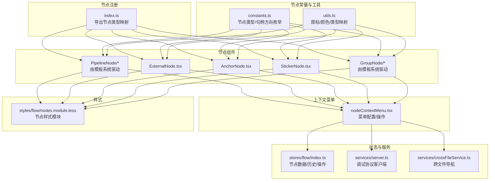
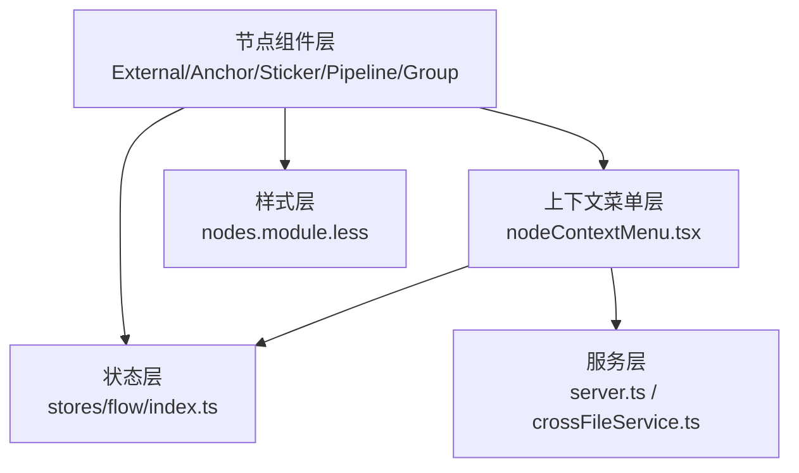
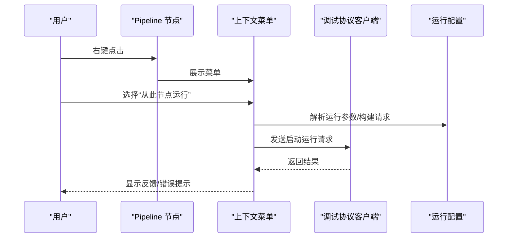
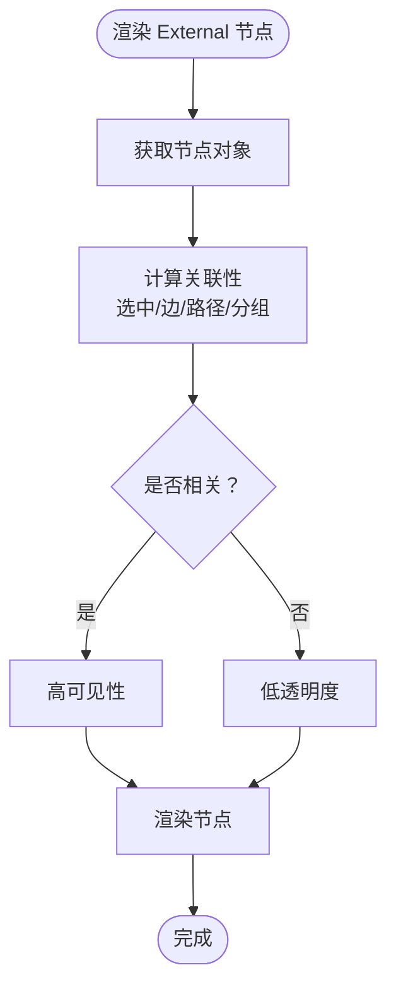
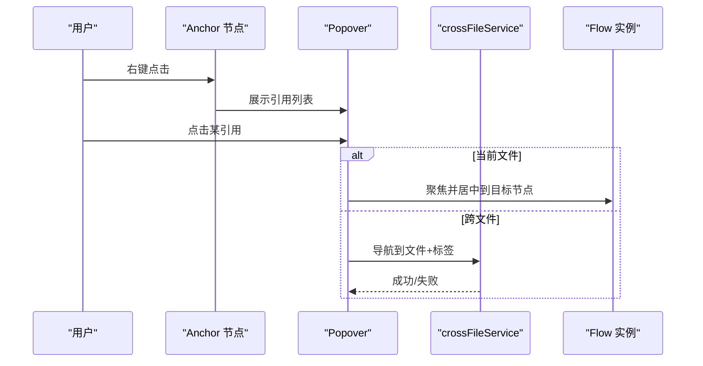
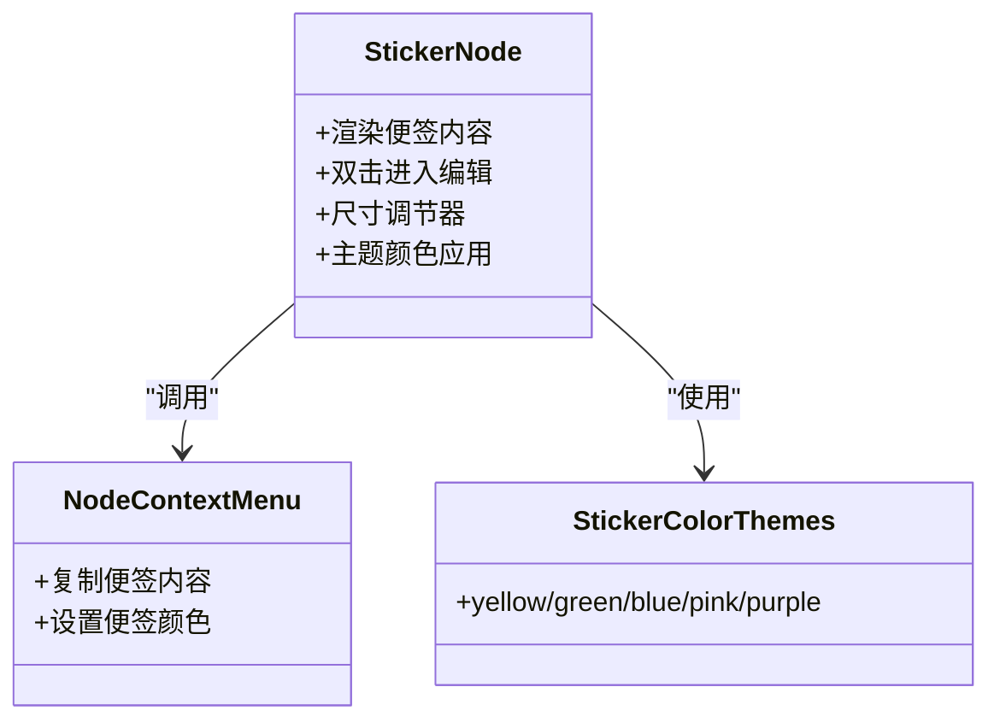
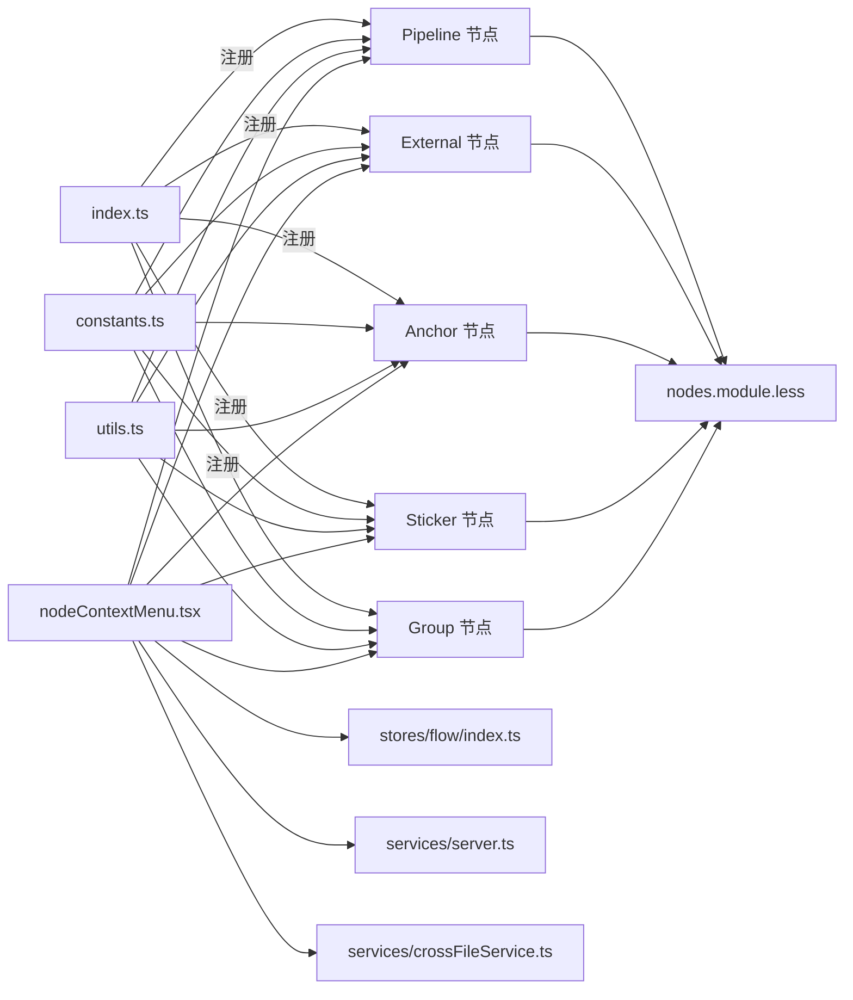

# 节点系统

<cite>
**本文档引用的文件**
- [src/components/flow/nodes/index.ts](file://src/components/flow/nodes/index.ts)
- [src/components/flow/nodes/constants.ts](file://src/components/flow/nodes/constants.ts)
- [src/components/flow/nodes/utils.ts](file://src/components/flow/nodes/utils.ts)
- [src/components/flow/nodes/nodeContextMenu.tsx](file://src/components/flow/nodes/nodeContextMenu.tsx)
- [src/components/flow/nodes/ExternalNode.tsx](file://src/components/flow/nodes/ExternalNode.tsx)
- [src/components/flow/nodes/AnchorNode.tsx](file://src/components/flow/nodes/AnchorNode.tsx)
- [src/components/flow/nodes/StickerNode.tsx](file://src/components/flow/nodes/StickerNode.tsx)
- [src/stores/flow/index.ts](file://src/stores/flow/index.ts)
- [src/services/server.ts](file://src/services/server.ts)
- [src/services/crossFileService.ts](file://src/services/crossFileService.ts)
- [src/styles/flow/nodes.module.less](file://src/styles/flow/nodes.module.less)
</cite>

## 目录
1. [简介](#简介)
2. [项目结构](#项目结构)
3. [核心组件](#核心组件)
4. [架构总览](#架构总览)
5. [详细组件分析](#详细组件分析)
6. [依赖分析](#依赖分析)
7. [性能考虑](#性能考虑)
8. [故障排除指南](#故障排除指南)
9. [结论](#结论)
10. [附录](#附录)

## 简介
本文件面向“节点系统”的技术文档，围绕五种节点类型（Pipeline、External、Anchor、Sticker、Group）进行深入解析，涵盖节点渲染机制、样式定制系统、交互行为、节点模板与预览、上下文菜单、拖拽/缩放/旋转/分组等能力，并提供节点扩展与自定义的开发指导。

## 项目结构
节点系统位于前端 Flow 子模块中，采用按类型拆分的组件组织方式：
- 节点注册与导出：通过统一入口聚合各节点类型，便于 Flow 容器注册
- 节点常量与工具：集中管理节点类型枚举、句柄方向、图标映射与颜色主题
- 节点组件：每个节点类型独立实现渲染、交互与上下文菜单
- 状态与服务：节点数据由全局状态管理，调试与跨文件导航由服务层支撑
- 样式：节点样式通过模块化 CSS 实现主题化与可定制

图表来源
- [src/components/flow/nodes/index.ts:1-26](file://src/components/flow/nodes/index.ts#L1-L26)
- [src/components/flow/nodes/constants.ts:1-47](file://src/components/flow/nodes/constants.ts#L1-L47)
- [src/components/flow/nodes/utils.ts:1-139](file://src/components/flow/nodes/utils.ts#L1-L139)
- [src/components/flow/nodes/nodeContextMenu.tsx:1-701](file://src/components/flow/nodes/nodeContextMenu.tsx#L1-L701)
- [src/stores/flow/index.ts](file://src/stores/flow/index.ts)
- [src/services/server.ts](file://src/services/server.ts)
- [src/services/crossFileService.ts](file://src/services/crossFileService.ts)
- [src/styles/flow/nodes.module.less](file://src/styles/flow/nodes.module.less)

章节来源
- [src/components/flow/nodes/index.ts:1-26](file://src/components/flow/nodes/index.ts#L1-L26)
- [src/components/flow/nodes/constants.ts:1-47](file://src/components/flow/nodes/constants.ts#L1-L47)
- [src/components/flow/nodes/utils.ts:1-139](file://src/components/flow/nodes/utils.ts#L1-L139)

## 核心组件
- 节点类型注册表：以枚举值为键，将各节点组件记忆化版本注册到统一映射，供 Flow 容器使用
- 句柄方向与类型：定义源句柄/目标句柄类型，以及节点输入输出方向（左右/上下/反转等）
- 图标与颜色体系：基于识别/动作类型与节点类型提供图标与极简配色方案
- 上下文菜单：统一的菜单配置与操作处理器，覆盖调试、复制、颜色、端点位置、删除等

章节来源
- [src/components/flow/nodes/index.ts:8-14](file://src/components/flow/nodes/index.ts#L8-L14)
- [src/components/flow/nodes/constants.ts:14-46](file://src/components/flow/nodes/constants.ts#L14-L46)
- [src/components/flow/nodes/utils.ts:91-139](file://src/components/flow/nodes/utils.ts#L91-L139)
- [src/components/flow/nodes/nodeContextMenu.tsx:467-700](file://src/components/flow/nodes/nodeContextMenu.tsx#L467-L700)

## 架构总览
节点系统采用“组件-状态-服务-样式”分层设计：
- 组件层：各节点类型负责自身渲染、交互与上下文菜单
- 状态层：Flow Store 提供节点数据、选择状态、历史记录与操作接口
- 服务层：调试协议客户端、跨文件导航服务等为节点提供外部能力
- 样式层：模块化 CSS 支持主题化与可定制外观

图表来源
- [src/components/flow/nodes/nodeContextMenu.tsx:1-701](file://src/components/flow/nodes/nodeContextMenu.tsx#L1-L701)
- [src/stores/flow/index.ts](file://src/stores/flow/index.ts)
- [src/services/server.ts](file://src/services/server.ts)
- [src/services/crossFileService.ts](file://src/services/crossFileService.ts)
- [src/styles/flow/nodes.module.less](file://src/styles/flow/nodes.module.less)

## 详细组件分析

### Pipeline 节点
- 设计要点
  - 作为流程核心节点，提供调试入口设置、多种运行模式（从节点运行、单节点运行、仅识别、仅动作）
  - 支持保存为模板、复制 Reco JSON、复制节点名等常用操作
  - 通过句柄方向控制输入输出布局
- 渲染与交互
  - 使用统一的节点容器与句柄组件，结合样式模块实现外观
  - 右键菜单提供调试与编辑能力
- 调试集成
  - 通过调试协议客户端发起运行请求，支持资源预检与自动调度
- 模板与预览
  - 通过模板系统将节点数据持久化为可复用模板

图表来源
- [src/components/flow/nodes/nodeContextMenu.tsx:233-451](file://src/components/flow/nodes/nodeContextMenu.tsx#L233-L451)
- [src/services/server.ts](file://src/services/server.ts)

章节来源
- [src/components/flow/nodes/nodeContextMenu.tsx:467-700](file://src/components/flow/nodes/nodeContextMenu.tsx#L467-L700)

### External 节点
- 设计要点
  - 表示外部引用节点，支持视觉副本计数与焦点聚焦效果
  - 通过句柄方向控制输入输出
- 渲染与交互
  - 在相关性判断下维持高可见性，否则按配置降低透明度
  - 右键菜单提供复制名称、编辑 JSON、删除等通用操作
- 关联性计算
  - 结合选中节点/边、路径模式、分组父子关系等综合判断

图表来源
- [src/components/flow/nodes/ExternalNode.tsx:84-145](file://src/components/flow/nodes/ExternalNode.tsx#L84-L145)

章节来源
- [src/components/flow/nodes/ExternalNode.tsx:45-181](file://src/components/flow/nodes/ExternalNode.tsx#L45-L181)

### Anchor 节点
- 设计要点
  - 作为跨文件/跨标签页的导航锚点，展示引用它的节点列表
  - 支持当前文件内跳转与跨文件跳转
- 渲染与交互
  - 引用列表通过气泡弹窗展示，点击条目触发跳转
  - 同样具备焦点聚焦效果与右键菜单
- 跨文件导航
  - 通过跨文件服务查询引用并定位目标节点

图表来源
- [src/components/flow/nodes/AnchorNode.tsx:198-240](file://src/components/flow/nodes/AnchorNode.tsx#L198-L240)
- [src/services/crossFileService.ts](file://src/services/crossFileService.ts)

章节来源
- [src/components/flow/nodes/AnchorNode.tsx:120-350](file://src/components/flow/nodes/AnchorNode.tsx#L120-L350)

### Sticker 节点
- 设计要点
  - 便签节点支持可调整尺寸、多色彩主题、双击编辑内容
  - 标题与内容均可编辑，编辑后记录历史
- 渲染与交互
  - 使用节点尺寸调节器，仅在选中时显示
  - 主题通过颜色主题映射实现统一风格
- 上下文菜单
  - 提供复制便签内容、设置便签颜色等操作

图表来源
- [src/components/flow/nodes/StickerNode.tsx:16-51](file://src/components/flow/nodes/StickerNode.tsx#L16-L51)
- [src/components/flow/nodes/StickerNode.tsx:168-219](file://src/components/flow/nodes/StickerNode.tsx#L168-L219)
- [src/components/flow/nodes/nodeContextMenu.tsx:594-664](file://src/components/flow/nodes/nodeContextMenu.tsx#L594-L664)

章节来源
- [src/components/flow/nodes/StickerNode.tsx:168-243](file://src/components/flow/nodes/StickerNode.tsx#L168-L243)

### Group 节点
- 设计要点
  - 作为分组容器，支持设置分组颜色、解散分组、删除分组
  - 通过 Flow Store 提供的分组操作接口实现
- 渲染与交互
  - 右键菜单提供颜色选择与分组管理操作
- 与 Pipeline/External/Anchor 的差异
  - 不直接参与识别/动作流程，主要承担组织与可视化作用

章节来源
- [src/components/flow/nodes/nodeContextMenu.tsx:471-513](file://src/components/flow/nodes/nodeContextMenu.tsx#L471-L513)

## 依赖分析
- 节点类型注册：通过 index.ts 将各节点组件注册到统一映射
- 常量与工具：constants.ts 与 utils.ts 为所有节点提供共享的类型与外观配置
- 上下文菜单：nodeContextMenu.tsx 作为统一入口，协调调试、编辑、删除等操作
- 状态与服务：Flow Store 提供节点数据与操作接口；调试协议客户端与跨文件服务提供外部能力
- 样式：nodes.module.less 提供节点通用样式与主题变量

图表来源
- [src/components/flow/nodes/index.ts:1-26](file://src/components/flow/nodes/index.ts#L1-L26)
- [src/components/flow/nodes/constants.ts:1-47](file://src/components/flow/nodes/constants.ts#L1-L47)
- [src/components/flow/nodes/utils.ts:1-139](file://src/components/flow/nodes/utils.ts#L1-L139)
- [src/components/flow/nodes/nodeContextMenu.tsx:1-701](file://src/components/flow/nodes/nodeContextMenu.tsx#L1-L701)
- [src/stores/flow/index.ts](file://src/stores/flow/index.ts)
- [src/services/server.ts](file://src/services/server.ts)
- [src/services/crossFileService.ts](file://src/services/crossFileService.ts)
- [src/styles/flow/nodes.module.less](file://src/styles/flow/nodes.module.less)

章节来源
- [src/components/flow/nodes/index.ts:8-14](file://src/components/flow/nodes/index.ts#L8-L14)
- [src/components/flow/nodes/constants.ts:14-46](file://src/components/flow/nodes/constants.ts#L14-L46)
- [src/components/flow/nodes/utils.ts:91-139](file://src/components/flow/nodes/utils.ts#L91-L139)
- [src/components/flow/nodes/nodeContextMenu.tsx:467-700](file://src/components/flow/nodes/nodeContextMenu.tsx#L467-L700)

## 性能考虑
- 节点渲染优化
  - 使用记忆化组件（memo）减少不必要的重渲染
  - External/Anchor/Sticker 节点均实现了自定义浅比较函数，仅在必要字段变化时更新
- 焦点聚焦效果
  - 通过配置项控制非相关节点透明度，避免过度绘制
- 复制/模板操作
  - 模板保存与 JSON 复制为轻量操作，避免阻塞主线程
- 调试运行
  - 资源预检采用异步监听与定时清理，防止内存泄漏与重复订阅

章节来源
- [src/components/flow/nodes/ExternalNode.tsx:183-202](file://src/components/flow/nodes/ExternalNode.tsx#L183-L202)
- [src/components/flow/nodes/AnchorNode.tsx:351-370](file://src/components/flow/nodes/AnchorNode.tsx#L351-L370)
- [src/components/flow/nodes/StickerNode.tsx:221-242](file://src/components/flow/nodes/StickerNode.tsx#L221-L242)
- [src/components/flow/nodes/nodeContextMenu.tsx:314-359](file://src/components/flow/nodes/nodeContextMenu.tsx#L314-L359)

## 故障排除指南
- 调试运行失败
  - 检查调试能力清单与运行模式支持情况
  - 若资源预检失败，确认资源路径配置与 LocalBridge 连接状态
- 跨文件跳转失败
  - 确认目标文件存在且包含对应标签
  - 检查跨文件服务返回的文件路径与相对路径
- 便签编辑无效
  - 确认节点处于选中状态，编辑状态切换正常
  - 检查 Flow Store 的 setNodeData 接口是否正确调用
- 分组颜色/解散分组异常
  - 确认 Group 节点 ID 正确，调用 Flow Store 的相应操作接口

章节来源
- [src/components/flow/nodes/nodeContextMenu.tsx:233-451](file://src/components/flow/nodes/nodeContextMenu.tsx#L233-L451)
- [src/components/flow/nodes/AnchorNode.tsx:198-240](file://src/components/flow/nodes/AnchorNode.tsx#L198-L240)
- [src/components/flow/nodes/StickerNode.tsx:80-97](file://src/components/flow/nodes/StickerNode.tsx#L80-L97)

## 结论
节点系统通过清晰的分层设计与统一的上下文菜单，提供了完善的节点渲染、样式定制与交互体验。各节点类型在保持一致性的同时，针对自身职责提供了差异化能力（如 Anchor 的跨文件导航、Sticker 的富文本编辑、Pipeline 的调试运行）。配合模板与预览功能，系统既满足日常编辑需求，也为扩展与二次开发提供了良好基础。

## 附录

### 节点类型与句柄方向
- 节点类型枚举：Pipeline、External、Anchor、Sticker、Group
- 句柄方向：left-right、right-left、top-bottom、bottom-top
- 句柄类型：源句柄（next、on_error）、目标句柄（target、jump_back）

章节来源
- [src/components/flow/nodes/constants.ts:14-46](file://src/components/flow/nodes/constants.ts#L14-L46)

### 图标与颜色主题
- 节点类型图标：根据类型返回对应图标与尺寸
- 识别/动作类型图标：基于类型映射到具体图标
- 极简节点颜色：按识别/动作类型分配主色与背景色

章节来源
- [src/components/flow/nodes/utils.ts:91-139](file://src/components/flow/nodes/utils.ts#L91-L139)

### 上下文菜单操作一览
- 调试相关：设为入口节点、从此节点运行、单节点运行、仅识别、仅动作
- 编辑相关：复制节点名、编辑 JSON、复制便签内容、复制 Reco JSON、保存为模板
- 样式相关：便签颜色、分组颜色、端点位置
- 删除与分组：删除节点、解散分组、删除分组

章节来源
- [src/components/flow/nodes/nodeContextMenu.tsx:467-700](file://src/components/flow/nodes/nodeContextMenu.tsx#L467-L700)

### 开发指导：节点扩展与自定义
- 注册新节点类型
  - 在节点类型枚举中添加新类型
  - 在节点注册表中新增映射
- 定义节点数据结构
  - 在 Flow Store 中定义节点数据类型与默认值
  - 在节点组件中读取并渲染数据
- 实现交互行为
  - 在上下文菜单中添加操作项与处理器
  - 通过 Flow Store 或服务层实现业务逻辑
- 样式定制
  - 在样式模块中新增节点类名与主题变量
  - 通过主题映射或颜色配置实现外观定制
- 事件处理
  - 使用全局事件或回调函数与外部系统集成
  - 注意异步处理与错误反馈

章节来源
- [src/components/flow/nodes/index.ts:8-14](file://src/components/flow/nodes/index.ts#L8-L14)
- [src/components/flow/nodes/constants.ts:14-46](file://src/components/flow/nodes/constants.ts#L14-L46)
- [src/components/flow/nodes/utils.ts:91-139](file://src/components/flow/nodes/utils.ts#L91-L139)
- [src/components/flow/nodes/nodeContextMenu.tsx:467-700](file://src/components/flow/nodes/nodeContextMenu.tsx#L467-L700)