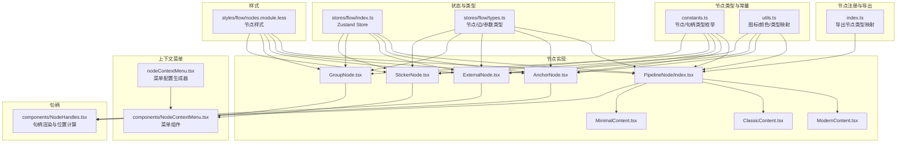
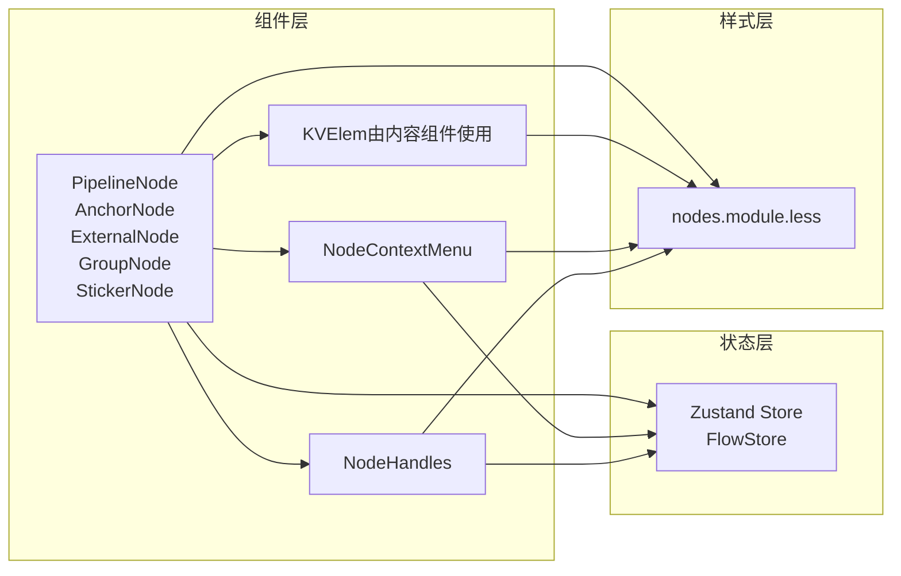
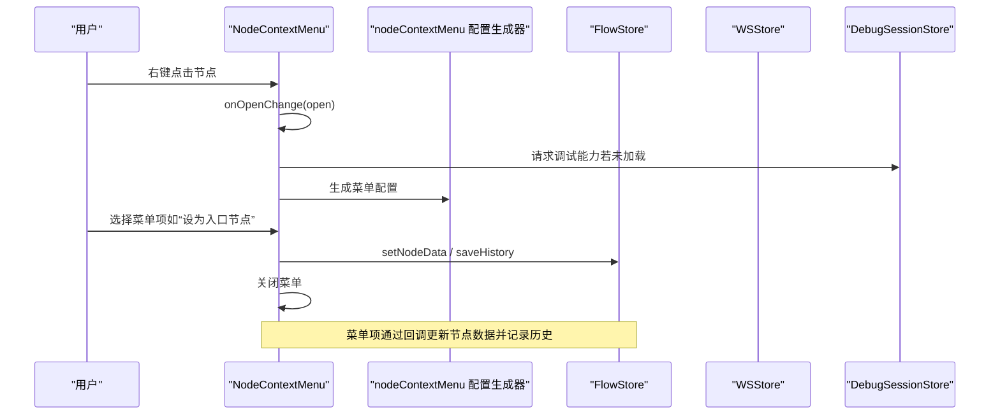
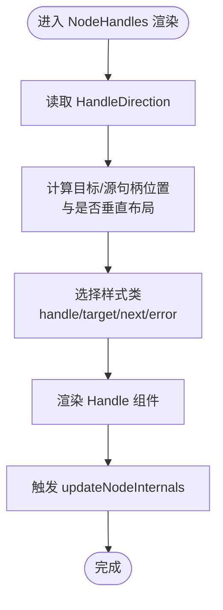
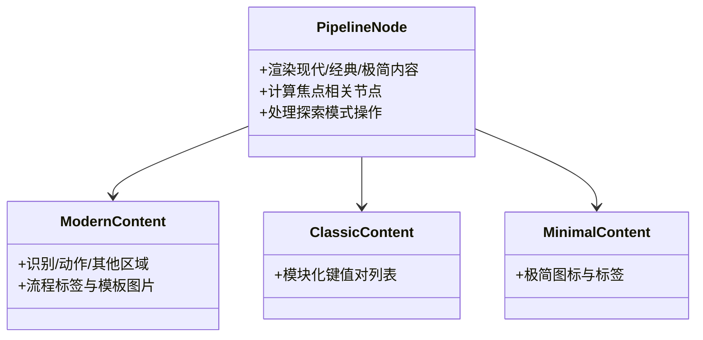
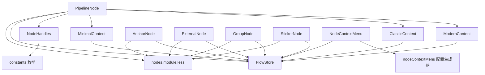

# 节点组件库

<cite>
**本文档引用的文件**
- [src/components/flow/nodes/index.ts](file://src/components/flow/nodes/index.ts)
- [src/components/flow/nodes/constants.ts](file://src/components/flow/nodes/constants.ts)
- [src/components/flow/nodes/utils.ts](file://src/components/flow/nodes/utils.ts)
- [src/components/flow/nodes/nodeContextMenu.tsx](file://src/components/flow/nodes/nodeContextMenu.tsx)
- [src/components/flow/nodes/components/NodeContextMenu.tsx](file://src/components/flow/nodes/components/NodeContextMenu.tsx)
- [src/components/flow/nodes/components/NodeHandles.tsx](file://src/components/flow/nodes/components/NodeHandles.tsx)
- [src/components/flow/nodes/PipelineNode/index.tsx](file://src/components/flow/nodes/PipelineNode/index.tsx)
- [src/components/flow/nodes/PipelineNode/ModernContent.tsx](file://src/components/flow/nodes/PipelineNode/ModernContent.tsx)
- [src/components/flow/nodes/PipelineNode/ClassicContent.tsx](file://src/components/flow/nodes/PipelineNode/ClassicContent.tsx)
- [src/components/flow/nodes/PipelineNode/MinimalContent.tsx](file://src/components/flow/nodes/PipelineNode/MinimalContent.tsx)
- [src/components/flow/nodes/AnchorNode.tsx](file://src/components/flow/nodes/AnchorNode.tsx)
- [src/components/flow/nodes/ExternalNode.tsx](file://src/components/flow/nodes/ExternalNode.tsx)
- [src/components/flow/nodes/GroupNode.tsx](file://src/components/flow/nodes/GroupNode.tsx)
- [src/components/flow/nodes/StickerNode.tsx](file://src/components/flow/nodes/StickerNode.tsx)
- [src/stores/flow/index.ts](file://src/stores/flow/index.ts)
- [src/stores/flow/types.ts](file://src/stores/flow/types.ts)
- [src/styles/flow/nodes.module.less](file://src/styles/flow/nodes.module.less)
</cite>

## 目录
1. [简介](#简介)
2. [项目结构](#项目结构)
3. [核心组件](#核心组件)
4. [架构总览](#架构总览)
5. [详细组件分析](#详细组件分析)
6. [依赖分析](#依赖分析)
7. [性能考虑](#性能考虑)
8. [故障排查指南](#故障排查指南)
9. [结论](#结论)
10. [附录](#附录)

## 简介
本文件面向“节点组件库”的技术文档，系统化阐述节点系统的通用组件设计与复用机制，重点覆盖键值对元素（KVElem）、节点上下文菜单、节点句柄（Handles）等核心组件的实现原理；解释属性传递、事件处理与状态管理机制；说明样式系统、主题适配与响应式设计；并提供扩展开发指导，帮助读者基于现有架构创建自定义节点与交互。

## 项目结构
节点组件库位于前端工程的可视化流程编辑模块中，采用“按功能域分层 + 按组件类型聚合”的组织方式：
- 节点注册与导出：统一在节点目录入口进行类型注册与导出
- 节点类型与常量：集中定义节点类型、句柄类型与方向枚举
- 通用工具：图标映射、颜色主题、句柄位置计算等
- 节点实现：PipelineNode、AnchorNode、ExternalNode、GroupNode、StickerNode
- 上下文菜单：统一的右键菜单组件与菜单配置生成器
- 样式系统：Less 模块化样式，支持主题与响应式

图表来源
- [src/components/flow/nodes/index.ts:1-26](file://src/components/flow/nodes/index.ts#L1-L26)
- [src/components/flow/nodes/constants.ts:1-47](file://src/components/flow/nodes/constants.ts#L1-L47)
- [src/components/flow/nodes/utils.ts:1-139](file://src/components/flow/nodes/utils.ts#L1-L139)
- [src/components/flow/nodes/PipelineNode/index.tsx:1-310](file://src/components/flow/nodes/PipelineNode/index.tsx#L1-L310)
- [src/components/flow/nodes/components/NodeContextMenu.tsx:1-260](file://src/components/flow/nodes/components/NodeContextMenu.tsx#L1-L260)
- [src/components/flow/nodes/components/NodeHandles.tsx:1-277](file://src/components/flow/nodes/components/NodeHandles.tsx#L1-L277)
- [src/stores/flow/index.ts:1-124](file://src/stores/flow/index.ts#L1-L124)
- [src/stores/flow/types.ts:1-439](file://src/stores/flow/types.ts#L1-L439)
- [src/styles/flow/nodes.module.less:1-907](file://src/styles/flow/nodes.module.less#L1-L907)

章节来源
- [src/components/flow/nodes/index.ts:1-26](file://src/components/flow/nodes/index.ts#L1-L26)
- [src/components/flow/nodes/constants.ts:1-47](file://src/components/flow/nodes/constants.ts#L1-L47)
- [src/components/flow/nodes/utils.ts:1-139](file://src/components/flow/nodes/utils.ts#L1-L139)
- [src/stores/flow/index.ts:1-124](file://src/stores/flow/index.ts#L1-L124)
- [src/stores/flow/types.ts:1-439](file://src/stores/flow/types.ts#L1-L439)
- [src/styles/flow/nodes.module.less:1-907](file://src/styles/flow/nodes.module.less#L1-L907)

## 核心组件
本节聚焦于三大通用组件：键值对元素（KVElem）、节点上下文菜单、节点句柄（Handles），并说明它们在节点系统中的职责与协作方式。

- 键值对元素（KVElem）
  - 作用：以键值形式展示节点参数，支持不同节点风格下的统一渲染
  - 位置：由各节点内容组件（如 ModernContent、ClassicContent、MinimalContent）在渲染时调用
  - 特性：根据配置决定是否显示详细字段；支持排序与过滤空值
- 节点上下文菜单
  - 作用：为节点提供右键菜单能力，包含调试、编辑、复制、颜色设置、端点位置等操作
  - 实现：统一的菜单组件负责渲染与事件绑定；菜单配置生成器根据节点类型与状态动态构建
- 节点句柄（Handles）
  - 作用：为节点提供输入输出连接点，支持方向切换（左右/上下）
  - 实现：根据方向计算 Handle 的位置与样式类，确保连接线布局正确

章节来源
- [src/components/flow/nodes/PipelineNode/ModernContent.tsx:1-331](file://src/components/flow/nodes/PipelineNode/ModernContent.tsx#L1-L331)
- [src/components/flow/nodes/PipelineNode/ClassicContent.tsx:1-169](file://src/components/flow/nodes/PipelineNode/ClassicContent.tsx#L1-L169)
- [src/components/flow/nodes/PipelineNode/MinimalContent.tsx:1-58](file://src/components/flow/nodes/PipelineNode/MinimalContent.tsx#L1-L58)
- [src/components/flow/nodes/components/NodeContextMenu.tsx:1-260](file://src/components/flow/nodes/components/NodeContextMenu.tsx#L1-L260)
- [src/components/flow/nodes/nodeContextMenu.tsx:1-701](file://src/components/flow/nodes/nodeContextMenu.tsx#L1-L701)
- [src/components/flow/nodes/components/NodeHandles.tsx:1-277](file://src/components/flow/nodes/components/NodeHandles.tsx#L1-L277)

## 架构总览
节点系统采用“组件-状态-样式”三层解耦：
- 组件层：节点组件（Pipeline/Anchor/External/Group/Sticker）与通用子组件（KVElem、NodeContextMenu、NodeHandles）
- 状态层：Zustand Store 将视图、选择、历史、节点、边、图数据、路径、锚点引用、探索模式等切片组合
- 样式层：Less 模块化样式，支持主题色、透明度、焦点效果、极简风格等

图表来源
- [src/components/flow/nodes/PipelineNode/index.tsx:1-310](file://src/components/flow/nodes/PipelineNode/index.tsx#L1-L310)
- [src/components/flow/nodes/AnchorNode.tsx:1-371](file://src/components/flow/nodes/AnchorNode.tsx#L1-L371)
- [src/components/flow/nodes/ExternalNode.tsx:1-203](file://src/components/flow/nodes/ExternalNode.tsx#L1-L203)
- [src/components/flow/nodes/GroupNode.tsx:1-178](file://src/components/flow/nodes/GroupNode.tsx#L1-L178)
- [src/components/flow/nodes/StickerNode.tsx:1-243](file://src/components/flow/nodes/StickerNode.tsx#L1-L243)
- [src/components/flow/nodes/components/NodeContextMenu.tsx:1-260](file://src/components/flow/nodes/components/NodeContextMenu.tsx#L1-L260)
- [src/components/flow/nodes/components/NodeHandles.tsx:1-277](file://src/components/flow/nodes/components/NodeHandles.tsx#L1-L277)
- [src/stores/flow/index.ts:1-124](file://src/stores/flow/index.ts#L1-L124)
- [src/styles/flow/nodes.module.less:1-907](file://src/styles/flow/nodes.module.less#L1-L907)

## 详细组件分析

### 节点上下文菜单（NodeContextMenu）
- 设计要点
  - 统一的菜单组件负责渲染 Ant Design Dropdown，支持可见性、禁用、危险项、子菜单等
  - 菜单配置由配置生成器根据节点类型与状态动态产出，包含调试入口、运行模式、复制、编辑 JSON、颜色设置、端点位置等
  - 支持监听全局“编辑 JSON”事件，触发对应节点的 JSON 编辑弹窗
- 事件与状态
  - 打开/关闭回调与本地状态联动
  - 调试能力请求与能力状态检查
  - 通过 Store 更新节点数据、保存历史记录
- 交互流程

图表来源
- [src/components/flow/nodes/components/NodeContextMenu.tsx:1-260](file://src/components/flow/nodes/components/NodeContextMenu.tsx#L1-L260)
- [src/components/flow/nodes/nodeContextMenu.tsx:1-701](file://src/components/flow/nodes/nodeContextMenu.tsx#L1-L701)
- [src/stores/flow/index.ts:1-124](file://src/stores/flow/index.ts#L1-L124)

章节来源
- [src/components/flow/nodes/components/NodeContextMenu.tsx:1-260](file://src/components/flow/nodes/components/NodeContextMenu.tsx#L1-L260)
- [src/components/flow/nodes/nodeContextMenu.tsx:1-701](file://src/components/flow/nodes/nodeContextMenu.tsx#L1-L701)

### 节点句柄（NodeHandles）
- 设计要点
  - 根据 HandleDirection 计算目标与源句柄的位置（左/右/上/下）
  - 支持垂直与水平两种布局，分别应用不同的样式类
  - 通过 React Flow Handle 组件挂载，配合 updateNodeInternals 确保布局生效
- 复用机制
  - PipelineNodeHandles：提供 next/on_error 与 target/jump_back 四种句柄
  - ExternalNodeHandles/AnchorNodeHandles：提供 target/jump_back 两种句柄，位置微调
- 性能与一致性
  - 在方向变更时多次触发 updateNodeInternals，保证渲染稳定

图表来源
- [src/components/flow/nodes/components/NodeHandles.tsx:1-277](file://src/components/flow/nodes/components/NodeHandles.tsx#L1-L277)
- [src/components/flow/nodes/constants.ts:1-47](file://src/components/flow/nodes/constants.ts#L1-L47)

章节来源
- [src/components/flow/nodes/components/NodeHandles.tsx:1-277](file://src/components/flow/nodes/components/NodeHandles.tsx#L1-L277)
- [src/components/flow/nodes/constants.ts:1-47](file://src/components/flow/nodes/constants.ts#L1-L47)

### 键值对元素（KVElem）
- 设计要点
  - 作为通用展示单元，接收 paramKey 与 value，渲染为键值对条目
  - 在不同节点风格（Classic/Modern/Minimal）中被复用
  - 支持排序与过滤空值，避免冗余展示
- 与内容组件的关系
  - ModernContent：按识别/动作/其他三个区域分别渲染 KVElem
  - ClassicContent：按模块化列表渲染 KVElem
  - MinimalContent：不渲染详细字段，仅展示极简图标与标签

章节来源
- [src/components/flow/nodes/PipelineNode/ModernContent.tsx:1-331](file://src/components/flow/nodes/PipelineNode/ModernContent.tsx#L1-L331)
- [src/components/flow/nodes/PipelineNode/ClassicContent.tsx:1-169](file://src/components/flow/nodes/PipelineNode/ClassicContent.tsx#L1-L169)
- [src/components/flow/nodes/PipelineNode/MinimalContent.tsx:1-58](file://src/components/flow/nodes/PipelineNode/MinimalContent.tsx#L1-L58)

### 节点类型与数据模型
- 节点类型枚举与句柄类型
  - NodeTypeEnum：pipeline、external、anchor、sticker、group
  - SourceHandleTypeEnum/TargetHandleTypeEnum：next、on_error、target、jump_back
  - HandleDirection：left-right、right-left、top-bottom、bottom-top
- 数据模型（FlowStore Types）
  - PipelineNodeDataType：label、recognition/action/others/extras、handleDirection
  - ExternalNodeDataType/AnchorNodeDataType：label、handleDirection
  - StickerNodeDataType/GroupNodeDataType：label/color
- 状态与历史
  - Store 提供 setNodeData/batchSetNodeData、setNodes、saveHistory 等接口
  - 历史栈支持撤销/重做，记录操作类别与目标节点

章节来源
- [src/components/flow/nodes/constants.ts:1-47](file://src/components/flow/nodes/constants.ts#L1-L47)
- [src/stores/flow/types.ts:1-439](file://src/stores/flow/types.ts#L1-L439)
- [src/stores/flow/index.ts:1-124](file://src/stores/flow/index.ts#L1-L124)

### Pipeline 节点（多风格）
- 多风格渲染
  - Classic：传统列表风格，模块化展示识别/动作/其他参数
  - Modern：头部+三段式内容区域，支持流程连接标签与模板图片
  - Minimal：极简风格，仅展示图标与标签，适合紧凑布局
- 交互与状态
  - 根据配置控制是否显示详细字段与流程标签
  - 与 Store 协作，支持探索模式下的 Ghost 节点与确认/执行/重新生成

图表来源
- [src/components/flow/nodes/PipelineNode/index.tsx:1-310](file://src/components/flow/nodes/PipelineNode/index.tsx#L1-L310)
- [src/components/flow/nodes/PipelineNode/ModernContent.tsx:1-331](file://src/components/flow/nodes/PipelineNode/ModernContent.tsx#L1-L331)
- [src/components/flow/nodes/PipelineNode/ClassicContent.tsx:1-169](file://src/components/flow/nodes/PipelineNode/ClassicContent.tsx#L1-L169)
- [src/components/flow/nodes/PipelineNode/MinimalContent.tsx:1-58](file://src/components/flow/nodes/PipelineNode/MinimalContent.tsx#L1-L58)

章节来源
- [src/components/flow/nodes/PipelineNode/index.tsx:1-310](file://src/components/flow/nodes/PipelineNode/index.tsx#L1-L310)
- [src/components/flow/nodes/PipelineNode/ModernContent.tsx:1-331](file://src/components/flow/nodes/PipelineNode/ModernContent.tsx#L1-L331)
- [src/components/flow/nodes/PipelineNode/ClassicContent.tsx:1-169](file://src/components/flow/nodes/PipelineNode/ClassicContent.tsx#L1-L169)
- [src/components/flow/nodes/PipelineNode/MinimalContent.tsx:1-58](file://src/components/flow/nodes/PipelineNode/MinimalContent.tsx#L1-L58)

### Anchor/External/Group/Sticker 节点
- AnchorNode
  - 展示引用计数与导航按钮，支持跨文件跳转
  - 与 Store 协作，计算与选中元素的关联关系，控制焦点透明度
- ExternalNode
  - 外部引用节点，支持视觉副本计数
- GroupNode
  - 可调整大小的分组容器，支持多种颜色主题
- StickerNode
  - 便签节点，支持可编辑内容与多种颜色主题

章节来源
- [src/components/flow/nodes/AnchorNode.tsx:1-371](file://src/components/flow/nodes/AnchorNode.tsx#L1-L371)
- [src/components/flow/nodes/ExternalNode.tsx:1-203](file://src/components/flow/nodes/ExternalNode.tsx#L1-L203)
- [src/components/flow/nodes/GroupNode.tsx:1-178](file://src/components/flow/nodes/GroupNode.tsx#L1-L178)
- [src/components/flow/nodes/StickerNode.tsx:1-243](file://src/components/flow/nodes/StickerNode.tsx#L1-L243)

## 依赖分析
- 组件耦合
  - 节点内容组件依赖 Store 读取边/节点信息，计算 next/on_error 目标标签
  - NodeContextMenu 依赖 nodeContextMenu 配置生成器与 Store 更新数据
  - NodeHandles 依赖 constants 与 React Flow 的 Handle/Position
- 状态与事件
  - Store 提供 setNodeData/saveHistory/updateSelection 等接口，被各组件广泛使用
  - 全局事件“编辑 JSON”驱动 NodeContextMenu 打开 JSON 编辑弹窗
- 样式与主题
  - nodes.module.less 提供基础样式、主题色、焦点与调试高亮、极简风格等
  - 不同节点类型通过 className 与主题变量实现差异化外观

图表来源
- [src/components/flow/nodes/PipelineNode/index.tsx:1-310](file://src/components/flow/nodes/PipelineNode/index.tsx#L1-L310)
- [src/components/flow/nodes/components/NodeContextMenu.tsx:1-260](file://src/components/flow/nodes/components/NodeContextMenu.tsx#L1-L260)
- [src/components/flow/nodes/nodeContextMenu.tsx:1-701](file://src/components/flow/nodes/nodeContextMenu.tsx#L1-L701)
- [src/components/flow/nodes/components/NodeHandles.tsx:1-277](file://src/components/flow/nodes/components/NodeHandles.tsx#L1-L277)
- [src/components/flow/nodes/constants.ts:1-47](file://src/components/flow/nodes/constants.ts#L1-L47)
- [src/stores/flow/index.ts:1-124](file://src/stores/flow/index.ts#L1-L124)
- [src/styles/flow/nodes.module.less:1-907](file://src/styles/flow/nodes.module.less#L1-L907)

章节来源
- [src/components/flow/nodes/index.ts:1-26](file://src/components/flow/nodes/index.ts#L1-L26)
- [src/components/flow/nodes/constants.ts:1-47](file://src/components/flow/nodes/constants.ts#L1-L47)
- [src/stores/flow/index.ts:1-124](file://src/stores/flow/index.ts#L1-L124)

## 性能考虑
- 渲染优化
  - 大量节点使用 memo 包裹，减少不必要的重渲染（如 PipelineNodeMemo、各节点组件）
  - useMemo 用于计算 isRelated、焦点高亮、颜色与图标配置等昂贵操作
- 布局与句柄
  - NodeHandles 在方向变更时多次触发 updateNodeInternals，确保布局稳定
- 状态更新
  - Store 的批量更新接口（batchSetNodeData）与延迟保存（saveHistory）降低频繁 setState 带来的抖动
- 样式与主题
  - Less 变量与主题色统一管理，避免重复计算与样式闪烁

## 故障排查指南
- 右键菜单不显示或不可用
  - 检查调试能力是否已请求与加载
  - 确认节点类型与可见性条件（如仅 Pipeline 显示“从此节点运行”）
- 句柄位置异常或连接线错位
  - 确认 handleDirection 是否正确传入
  - 检查 NodeHandles 是否在方向变更后触发了 updateNodeInternals
- 便签/分组颜色设置无效
  - 确认 setNodeData 的路径与键名（direct/sticker/color）
  - 检查 saveHistory 是否被调用以记录操作
- 焦点透明度与相关节点高亮不符合预期
  - 检查 focusOpacity 配置与 isRelated 计算逻辑
  - 确认选中节点/边与路径模式的状态

章节来源
- [src/components/flow/nodes/components/NodeContextMenu.tsx:1-260](file://src/components/flow/nodes/components/NodeContextMenu.tsx#L1-L260)
- [src/components/flow/nodes/components/NodeHandles.tsx:1-277](file://src/components/flow/nodes/components/NodeHandles.tsx#L1-L277)
- [src/stores/flow/index.ts:1-124](file://src/stores/flow/index.ts#L1-L124)

## 结论
节点组件库通过清晰的分层设计与通用组件复用，实现了高度可扩展的可视化节点系统。上下文菜单、句柄与键值对元素构成了节点交互与展示的核心，结合 Zustand Store 与 Less 样式体系，既保证了开发效率，又提供了良好的用户体验与主题适配能力。遵循本文档的扩展指导，可快速创建符合规范的新节点与交互行为。

## 附录

### 样式系统与主题适配
- 主题色与变量
  - 通过 Less 变量定义 next/error/jumpback/anchor 等颜色，统一在 nodes.module.less 中使用
- 焦点与调试高亮
  - focusOpacity 控制非相关节点透明度
  - 调试高亮（current/recognizing）与锚点引用高亮（anchor-ref-highlighted）提供视觉反馈
- 响应式与尺寸
  - 不同节点风格（classic/modern/minimal）具有不同的尺寸与布局策略
  - 分组与便签节点支持可调整大小与颜色主题

章节来源
- [src/styles/flow/nodes.module.less:1-907](file://src/styles/flow/nodes.module.less#L1-L907)

### 扩展开发指导
- 创建自定义节点
  - 定义节点类型与数据模型（参考 types.ts）
  - 实现节点组件（参考各节点实现文件），在 index.ts 注册
  - 如需上下文菜单，参考 nodeContextMenu.tsx 与 NodeContextMenu 组件
  - 如需句柄，参考 NodeHandles 的方向计算与样式类
- 属性定义与传递
  - 使用 Store 的 setNodeData/batchSetNodeData 更新节点数据
  - 通过 saveHistory 记录操作，便于撤销/重做
- 交互行为实现
  - 事件处理建议集中在 NodeContextMenu 或节点内部，避免跨组件耦合
  - 使用全局事件（如“编辑 JSON”）触发特定行为，保持组件解耦

章节来源
- [src/components/flow/nodes/index.ts:1-26](file://src/components/flow/nodes/index.ts#L1-L26)
- [src/components/flow/nodes/nodeContextMenu.tsx:1-701](file://src/components/flow/nodes/nodeContextMenu.tsx#L1-L701)
- [src/components/flow/nodes/components/NodeContextMenu.tsx:1-260](file://src/components/flow/nodes/components/NodeContextMenu.tsx#L1-L260)
- [src/components/flow/nodes/components/NodeHandles.tsx:1-277](file://src/components/flow/nodes/components/NodeHandles.tsx#L1-L277)
- [src/stores/flow/types.ts:1-439](file://src/stores/flow/types.ts#L1-L439)
- [src/stores/flow/index.ts:1-124](file://src/stores/flow/index.ts#L1-L124)