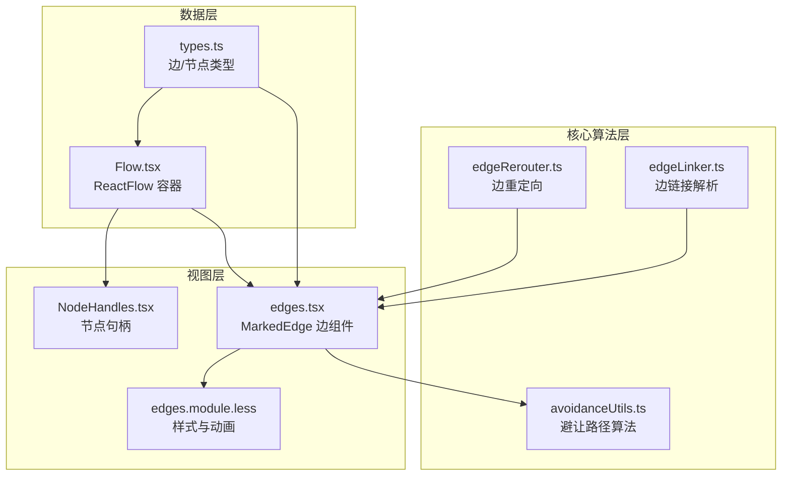
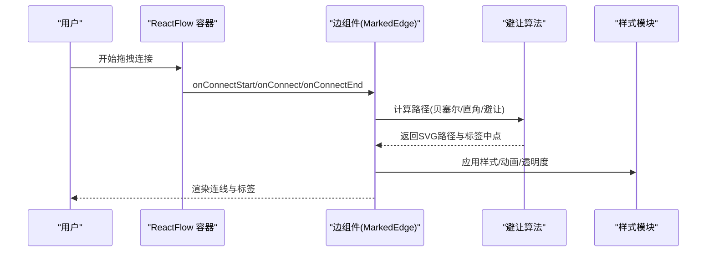
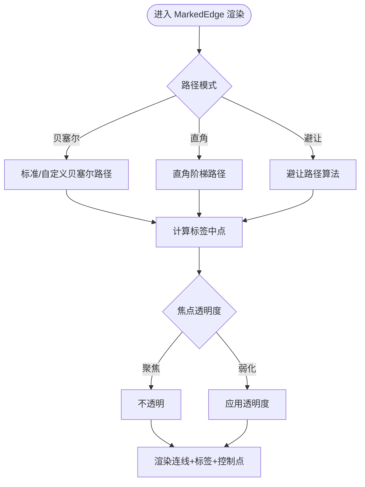
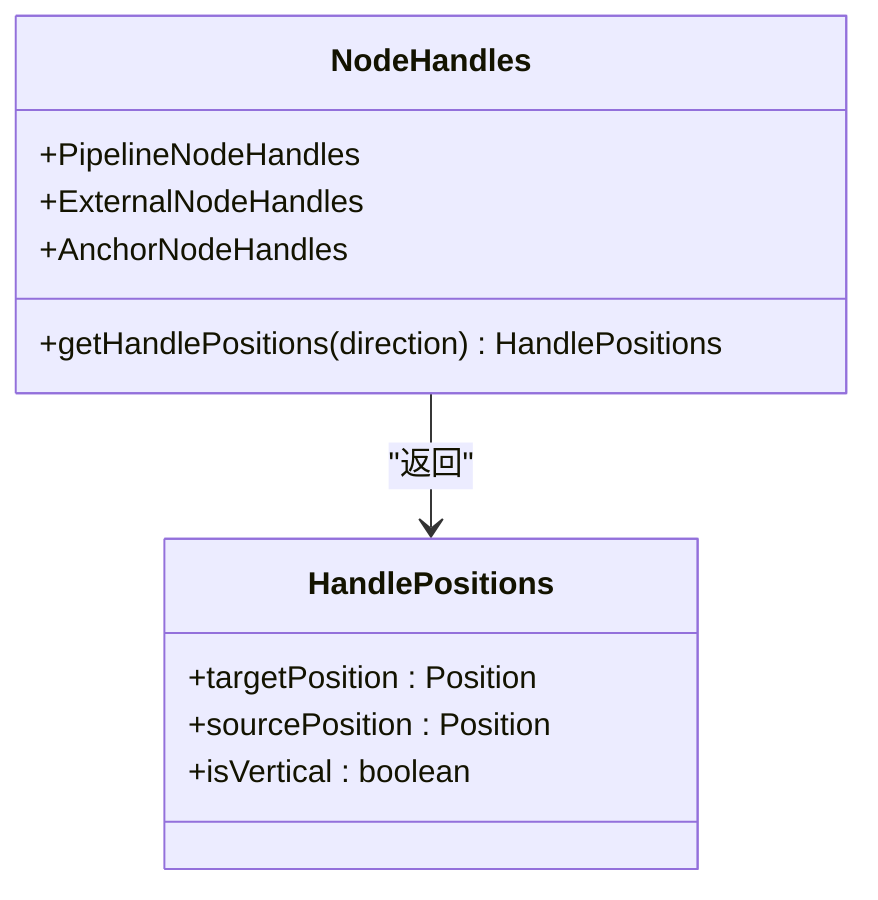
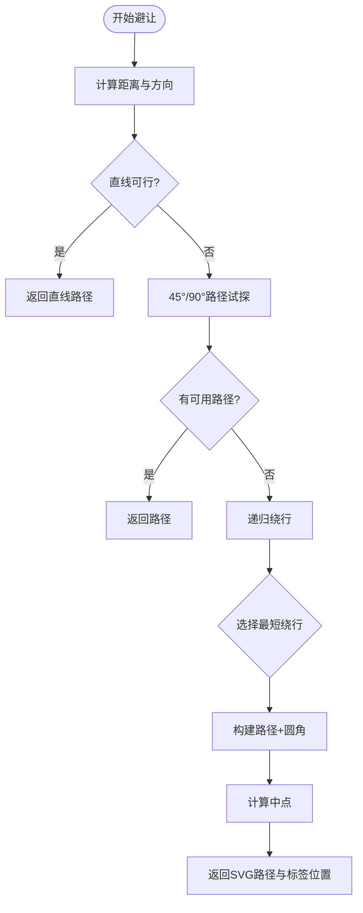
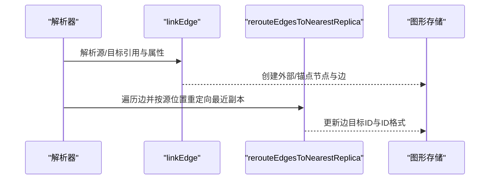
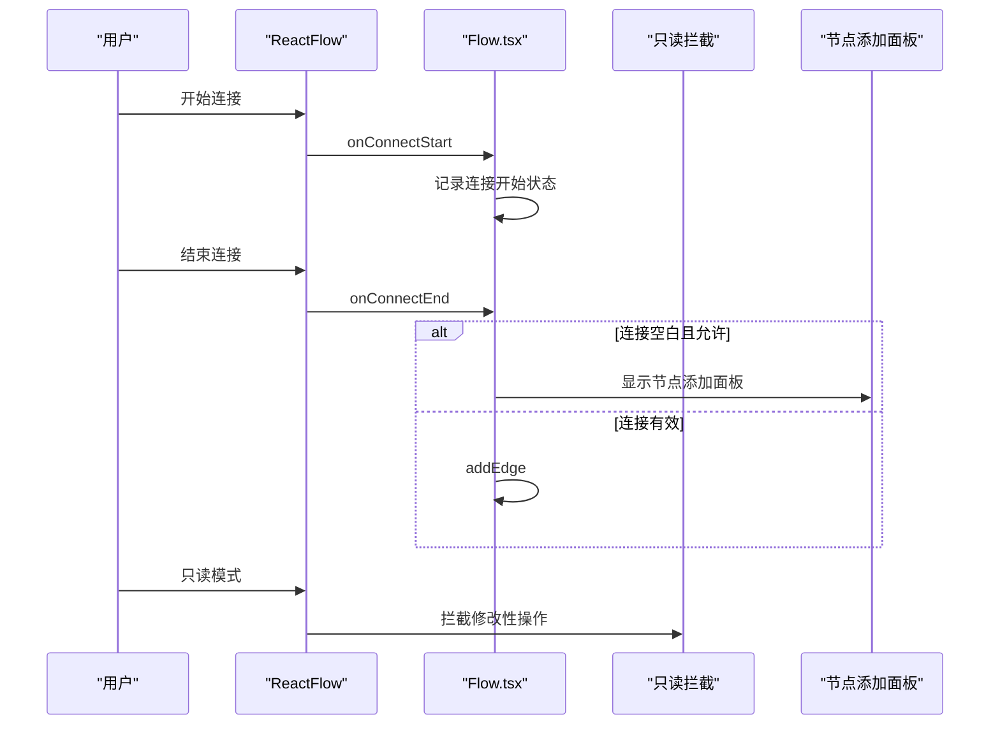
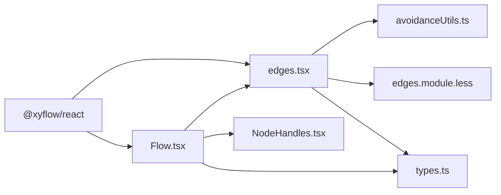

# 连线系统

<cite>
**本文档引用的文件**
- [edges.tsx](file://src/components/flow/edges.tsx)
- [Flow.tsx](file://src/components/Flow.tsx)
- [edgeLinker.ts](file://src/core/parser/edgeLinker.ts)
- [edgeRerouter.ts](file://src/core/parser/edgeRerouter.ts)
- [avoidanceUtils.ts](file://src/core/avoidanceUtils.ts)
- [index.ts](file://src/components/flow/nodes/index.ts)
- [constants.ts](file://src/components/flow/nodes/constants.ts)
- [NodeHandles.tsx](file://src/components/flow/nodes/components/NodeHandles.tsx)
- [edges.module.less](file://src/styles/flow/edges.module.less)
- [types.ts](file://src/stores/flow/types.ts)
</cite>

## 目录
1. [简介](#简介)
2. [项目结构](#项目结构)
3. [核心组件](#核心组件)
4. [架构总览](#架构总览)
5. [详细组件分析](#详细组件分析)
6. [依赖分析](#依赖分析)
7. [性能考虑](#性能考虑)
8. [故障排查指南](#故障排查指南)
9. [结论](#结论)
10. [附录](#附录)

## 简介
本文件系统化梳理连线（边）子系统的完整技术实现，涵盖连线渲染机制、连接点系统、智能避让算法、样式与动画、交互行为、检测与验证、冲突处理、编辑与修改能力，以及扩展与自定义开发指导。目标是帮助开发者快速理解并高效扩展连线系统。

## 项目结构
连线系统主要由以下层次构成：
- 视图层：基于 ReactFlow 的边组件与样式模块
- 核心算法层：避让路径计算、节点边界构建、路径中点计算
- 数据层：边与节点的数据模型、状态管理接口
- 连接解析层：边链接与重定向逻辑
- 节点句柄层：连接点布局与方向控制

**图表来源**
- [edges.tsx:1-676](file://src/components/flow/edges.tsx#L1-L676)
- [avoidanceUtils.ts:1-780](file://src/core/avoidanceUtils.ts#L1-L780)
- [edgeLinker.ts:1-162](file://src/core/parser/edgeLinker.ts#L1-L162)
- [edgeRerouter.ts:1-89](file://src/core/parser/edgeRerouter.ts#L1-L89)
- [NodeHandles.tsx:1-277](file://src/components/flow/nodes/components/NodeHandles.tsx#L1-L277)
- [edges.module.less:1-98](file://src/styles/flow/edges.module.less#L1-L98)
- [types.ts:1-439](file://src/stores/flow/types.ts#L1-L439)
- [Flow.tsx:1-709](file://src/components/Flow.tsx#L1-L709)

**章节来源**
- [edges.tsx:1-676](file://src/components/flow/edges.tsx#L1-L676)
- [Flow.tsx:1-709](file://src/components/Flow.tsx#L1-L709)

## 核心组件
- MarkedEdge 边组件：负责连线渲染、标签与控制点绘制、拖拽调整、焦点透明度、路径模式切换（贝塞尔/直角/避让）、样式分类（普通/错误/回跳/错误回跳）。
- ReactFlow 容器：统一挂载节点与边，处理连接生命周期（开始/结束/完成）、只读模式下的拦截、节点磁吸对齐、视口变化与保存。
- 避让路径算法：基于包围盒相交检测、Cohen-Sutherland 思想、多策略路径组合（直线/45°/90°直角/递归绕行），支持自环与平行边偏移。
- 连接点系统：句柄类型（目标/回跳/下一/错误）、方向枚举（左右/右左/上下/下上）、句柄位置计算与样式映射。
- 样式与动画：虚线描边、动画位移、选中态加粗、标签与控制点显隐与过渡、颜色分类（正常/错误/回跳/错误回跳）。

**章节来源**
- [edges.tsx:311-676](file://src/components/flow/edges.tsx#L311-L676)
- [Flow.tsx:235-709](file://src/components/Flow.tsx#L235-L709)
- [avoidanceUtils.ts:20-780](file://src/core/avoidanceUtils.ts#L20-L780)
- [NodeHandles.tsx:15-277](file://src/components/flow/nodes/components/NodeHandles.tsx#L15-L277)
- [edges.module.less:1-98](file://src/styles/flow/edges.module.less#L1-L98)

## 架构总览
连线系统采用“视图组件 + 核心算法 + 数据模型”的分层设计。视图组件负责渲染与交互；算法层提供路径规划与避让；数据层定义类型与状态；连接解析层负责从逻辑到图形的落地。

**图表来源**
- [Flow.tsx:346-418](file://src/components/Flow.tsx#L346-L418)
- [edges.tsx:390-458](file://src/components/flow/edges.tsx#L390-L458)
- [avoidanceUtils.ts:691-779](file://src/core/avoidanceUtils.ts#L691-L779)
- [edges.module.less:15-22](file://src/styles/flow/edges.module.less#L15-L22)

## 详细组件分析

### 连线渲染与交互（MarkedEdge）
- 路径计算策略
  - 贝塞尔曲线：支持控制点拖拽，动态调整曲率与切线长度，避免过远时过度弯曲。
  - 直角阶梯：使用现成的直角路径生成器，适合强对齐场景。
  - 避让路径：在节点密集区域自动规避，支持自环与平行边偏移。
- 标签与控制点
  - 标签随路径中点定位，支持选中态放大与背景强化。
  - 控制点可拖拽调整路径，双击重置，拖拽时显示抓取样式。
- 焦点与透明度
  - 根据选中节点/边与路径模式动态调整透明度，突出相关连线。
- 样式分类
  - 普通/错误/回跳/错误回跳四类样式，配合颜色与选中态样式类。

**图表来源**
- [edges.tsx:390-458](file://src/components/flow/edges.tsx#L390-L458)
- [edges.tsx:573-642](file://src/components/flow/edges.tsx#L573-L642)

**章节来源**
- [edges.tsx:311-676](file://src/components/flow/edges.tsx#L311-L676)
- [edges.module.less:44-98](file://src/styles/flow/edges.module.less#L44-L98)

### 连接点系统与句柄布局（NodeHandles）
- 句柄类型
  - 目标（Target）、回跳（JumpBack）、下一（Next）、错误（Error）。
- 方向枚举
  - left-right、right-left、top-bottom、bottom-top，决定输入输出方向。
- 位置计算
  - 根据方向映射到 Position（左/右/上/下），并支持垂直/水平布局。
- 样式映射
  - 不同方向与风格（极简/常规）映射到不同样式类，保证视觉一致性。

**图表来源**
- [NodeHandles.tsx:15-53](file://src/components/flow/nodes/components/NodeHandles.tsx#L15-L53)
- [constants.ts:1-47](file://src/components/flow/nodes/constants.ts#L1-L47)

**章节来源**
- [NodeHandles.tsx:15-277](file://src/components/flow/nodes/components/NodeHandles.tsx#L15-L277)
- [constants.ts:1-47](file://src/components/flow/nodes/constants.ts#L1-L47)

### 智能避让算法（avoidanceUtils）
- 核心能力
  - 包围盒相交检测、线段跨立试验、最近阻挡节点查找。
  - 直线/45°/90°直角路径试探，递归绕行与最短路径选择。
  - 自环路径与平行边偏移，圆角转角处理，路径中点计算。
- 配置项
  - 最大递归深度、避让边距、转角半径、直线最大距离、边偏移步长。
- 性能要点
  - 早期包围盒快速排斥、严格内部相交检测减少无效计算。

**图表来源**
- [avoidanceUtils.ts:380-577](file://src/core/avoidanceUtils.ts#L380-L577)
- [avoidanceUtils.ts:691-779](file://src/core/avoidanceUtils.ts#L691-L779)

**章节来源**
- [avoidanceUtils.ts:20-780](file://src/core/avoidanceUtils.ts#L20-L780)

### 连接解析与重定向（edgeLinker / edgeRerouter）
- 边链接
  - 支持字符串与对象两种节点引用格式，自动解析前缀（锚点/回跳），创建外部或锚点节点，并生成边。
- 视觉副本重定向
  - 将以 External/Anchor 为目标的边按源节点绝对位置就近改写目标，解决导入后副本未连边问题。

**图表来源**
- [edgeLinker.ts:91-161](file://src/core/parser/edgeLinker.ts#L91-L161)
- [edgeRerouter.ts:15-88](file://src/core/parser/edgeRerouter.ts#L15-L88)

**章节来源**
- [edgeLinker.ts:1-162](file://src/core/parser/edgeLinker.ts#L1-162)
- [edgeRerouter.ts:1-89](file://src/core/parser/edgeRerouter.ts#L1-89)

### ReactFlow 容器与交互（Flow.tsx）
- 连接生命周期
  - onConnectStart/onConnect/onConnectEnd：捕获连接状态，支持只读模式拦截与快速创建节点。
- 选择与菜单
  - onSelectionChange、右键选区菜单、双击空白打开节点添加面板。
- 磁吸与分组
  - 节点拖拽磁吸对齐、进入/离开分组检测与自动附着/脱离。
- 保存与持久化
  - 视口变化监听与保存、防抖更新、本地持久化触发。

**图表来源**
- [Flow.tsx:360-418](file://src/components/Flow.tsx#L360-L418)
- [Flow.tsx:300-345](file://src/components/Flow.tsx#L300-L345)
- [Flow.tsx:468-608](file://src/components/Flow.tsx#L468-L608)

**章节来源**
- [Flow.tsx:235-709](file://src/components/Flow.tsx#L235-L709)

## 依赖分析
- 组件耦合
  - edges.tsx 依赖节点句柄方向、避让算法、配置状态与样式模块。
  - Flow.tsx 作为容器协调连接生命周期与只读拦截。
- 外部依赖
  - @xyflow/react 提供 ReactFlow、Handle、BaseEdge、路径生成器等。
- 数据契约
  - types.ts 定义边/节点类型与状态接口，确保上下游一致。

**图表来源**
- [edges.tsx:4-12](file://src/components/flow/edges.tsx#L4-L12)
- [Flow.tsx:13-27](file://src/components/Flow.tsx#L13-L27)
- [avoidanceUtils.ts:1-7](file://src/core/avoidanceUtils.ts#L1-L7)
- [types.ts:1-16](file://src/stores/flow/types.ts#L1-L16)

**章节来源**
- [edges.tsx:1-32](file://src/components/flow/edges.tsx#L1-L32)
- [Flow.tsx:1-50](file://src/components/Flow.tsx#L1-L50)
- [types.ts:1-439](file://src/stores/flow/types.ts#L1-L439)

## 性能考虑
- 路径计算
  - 避让算法采用包围盒快速排斥与严格内部相交检测，减少无效计算。
  - 平行边偏移与圆角转角在保证可读性的前提下尽量简化路径段数。
- 渲染优化
  - 控制点仅在有偏移且非拖拽时显示，降低 DOM 数量。
  - 透明度与过渡动画使用 CSS，避免 JS 频繁重排。
- 交互节流
  - 视口变化与选择变更使用防抖保存，降低持久化频率。

[本节为通用建议，无需特定文件引用]

## 故障排查指南
- 连线无法拖拽或样式异常
  - 检查只读模式开关与拦截逻辑，确认未被拦截。
  - 核对样式模块类名与配置项（标签显示、控制点显示、路径模式）。
- 避让路径不符合预期
  - 调整避让配置（边距、圆角、递归深度、偏移步长）。
  - 检查节点尺寸与绝对位置计算，确保边界框正确。
- 标签或控制点位置异常
  - 确认路径中点计算与标签定位逻辑，检查拖拽偏移与路径模式切换。
- 复制粘贴或导入后边未连接到副本
  - 使用视觉副本重定向函数对以 External/Anchor 为目标的边进行就近重定向。

**章节来源**
- [Flow.tsx:300-345](file://src/components/Flow.tsx#L300-L345)
- [edges.module.less:63-98](file://src/styles/flow/edges.module.less#L63-L98)
- [avoidanceUtils.ts:691-779](file://src/core/avoidanceUtils.ts#L691-L779)
- [edgeRerouter.ts:15-88](file://src/core/parser/edgeRerouter.ts#L15-L88)

## 结论
该连线系统通过清晰的分层设计与完善的交互机制，实现了从连接点布局、路径计算到渲染与样式的全链路闭环。避让算法在复杂场景下保持良好的可读性与稳定性，同时提供丰富的样式与动画能力。结合解析与重定向逻辑，能够满足从导入到编辑再到导出的完整工作流需求。

## 附录

### 连线样式定制清单
- 基础样式
  - 线宽、虚线样式、动画参数、选中态加粗。
- 颜色分类
  - 普通/错误/回跳/错误回跳四类颜色变量与过渡。
- 标签与控制点
  - 标签背景、边框、选中态放大与过渡、控制点显隐与拖拽态样式。

**章节来源**
- [edges.module.less:1-98](file://src/styles/flow/edges.module.less#L1-L98)

### 连线类型与属性
- 边类型
  - 标识、源/目标节点、句柄类型、标签、类型标记、可选属性。
- 句柄类型
  - 源：Next、Error；目标：Target、JumpBack。
- 节点类型
  - Pipeline、External、Anchor、Sticker、Group。

**章节来源**
- [types.ts:29-40](file://src/stores/flow/types.ts#L29-L40)
- [constants.ts:1-11](file://src/components/flow/nodes/constants.ts#L1-L11)
- [types.ts:157-236](file://src/stores/flow/types.ts#L157-L236)

### 事件与回调
- 连接事件
  - onConnectStart/onConnect/onConnectEnd：连接生命周期。
- 选择与菜单
  - onSelectionChange、onPaneContextMenu、onDoubleClick。
- 节点拖拽
  - onNodeDrag/onNodeDragStop：磁吸与分组检测。

**章节来源**
- [Flow.tsx:346-461](file://src/components/Flow.tsx#L346-L461)
- [Flow.tsx:468-608](file://src/components/Flow.tsx#L468-L608)