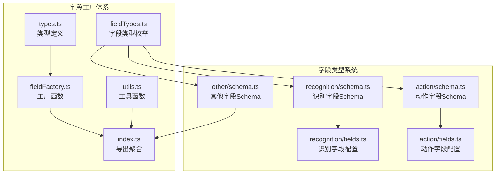
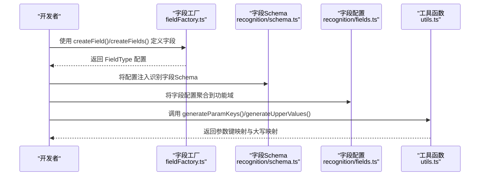
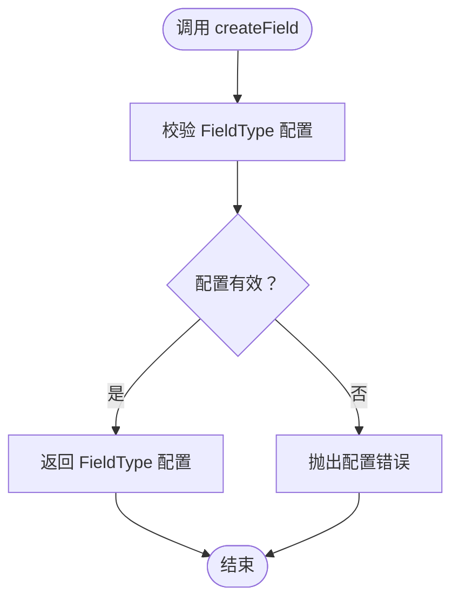
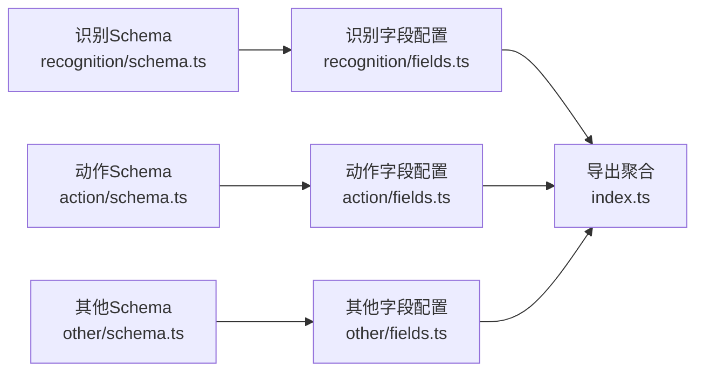
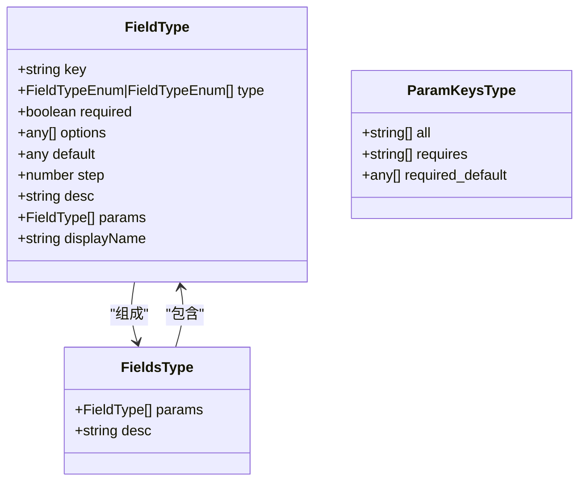
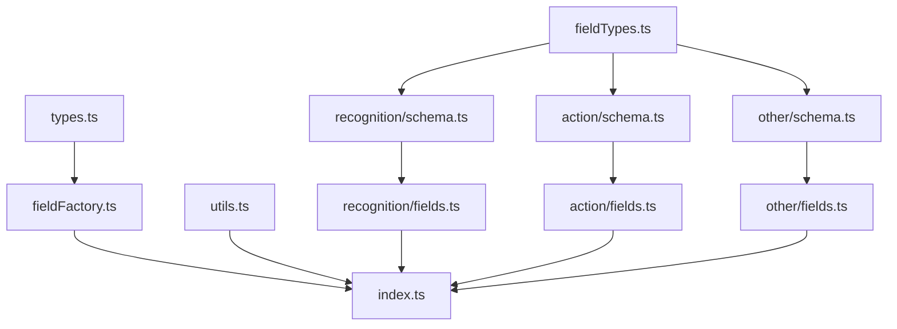

# 字段工厂系统

<cite>
**本文档引用的文件**
- [fieldFactory.ts](file://src/core/fields/fieldFactory.ts)
- [index.ts](file://src/core/fields/index.ts)
- [types.ts](file://src/core/fields/types.ts)
- [utils.ts](file://src/core/fields/utils.ts)
- [fieldTypes.ts](file://src/core/fields/fieldTypes.ts)
- [recognition/schema.ts](file://src/core/fields/recognition/schema.ts)
- [recognition/fields.ts](file://src/core/fields/recognition/fields.ts)
- [action/schema.ts](file://src/core/fields/action/schema.ts)
- [action/fields.ts](file://src/core/fields/action/fields.ts)
- [other/schema.ts](file://src/core/fields/other/schema.ts)
- [fields.ts](file://src/core/fields.ts)
</cite>

## 目录
1. [简介](#简介)
2. [项目结构](#项目结构)
3. [核心组件](#核心组件)
4. [架构总览](#架构总览)
5. [详细组件分析](#详细组件分析)
6. [依赖关系分析](#依赖关系分析)
7. [性能考量](#性能考量)
8. [故障排查指南](#故障排查指南)
9. [结论](#结论)
10. [附录](#附录)

## 简介
本文件系统性阐述字段工厂（Field Factory）的设计与实现，重点覆盖以下方面：
- 字段类型注册机制与字段类型系统协作
- 动态实例化与默认值处理
- 类型推断与校验流程
- fieldFactory 的核心能力：createField()/createFields() 的设计意图与使用方式
- 字段工厂与字段类型系统的集成，以及对序列化/反序列化的支持策略
- 扩展开发指南：如何注册自定义字段类型与最佳实践
- 实际使用示例与常见应用场景

## 项目结构
字段工厂体系位于前端核心模块 src/core/fields 下，采用“按功能域分层 + 类型集中管理”的组织方式：
- 类型定义：types.ts 定义 FieldType/FieldsType/ParamKeysType 等核心类型
- 字段类型枚举：fieldTypes.ts 定义 FieldTypeEnum，统一约束字段类型
- 字段工厂：fieldFactory.ts 提供 createField/createFields 简化字段定义
- 字段类型系统：recognition/action/other 三大域各自维护 schema 与 fields 配置
- 工具函数：utils.ts 提供参数键生成、大写映射等辅助能力
- 导出聚合：index.ts 汇总导出类型、枚举、各域字段、工具函数与派生数据

**图表来源**
- [types.ts:1-34](file://src/core/fields/types.ts#L1-L34)
- [fieldTypes.ts:1-27](file://src/core/fields/fieldTypes.ts#L1-L27)
- [fieldFactory.ts:1-16](file://src/core/fields/fieldFactory.ts#L1-L16)
- [utils.ts:1-41](file://src/core/fields/utils.ts#L1-L41)
- [index.ts:1-45](file://src/core/fields/index.ts#L1-L45)
- [recognition/schema.ts:1-276](file://src/core/fields/recognition/schema.ts#L1-L276)
- [recognition/fields.ts:1-115](file://src/core/fields/recognition/fields.ts#L1-L115)
- [action/schema.ts:1-299](file://src/core/fields/action/schema.ts#L1-L299)
- [action/fields.ts:1-149](file://src/core/fields/action/fields.ts#L1-L149)
- [other/schema.ts:1-363](file://src/core/fields/other/schema.ts#L1-L363)

**章节来源**
- [index.ts:1-45](file://src/core/fields/index.ts#L1-L45)
- [fields.ts:1-2](file://src/core/fields.ts#L1-L2)

## 核心组件
- 字段类型定义（FieldType/FieldsType/ParamKeysType）：统一描述字段的键、类型、默认值、选项、描述、子参数等元信息
- 字段类型枚举（FieldTypeEnum）：标准化字段类型，涵盖基础类型、列表类型、数组类型、图片路径类型等
- 字段工厂（createField/createFields）：提供简化的字段定义语法，便于在 schema 中声明字段配置
- 字段类型系统（识别/动作/其他）：通过 schema 定义具体字段，通过 fields 将字段按功能域聚合
- 工具函数（generateParamKeys/generateUpperValues）：从字段配置生成参数键映射与大写值映射，便于 UI 与业务逻辑使用

**章节来源**
- [types.ts:1-34](file://src/core/fields/types.ts#L1-L34)
- [fieldTypes.ts:1-27](file://src/core/fields/fieldTypes.ts#L1-L27)
- [fieldFactory.ts:1-16](file://src/core/fields/fieldFactory.ts#L1-L16)
- [utils.ts:1-41](file://src/core/fields/utils.ts#L1-L41)

## 架构总览
字段工厂与字段类型系统的协作关系如下：
- 字段类型系统通过 schema 定义具体字段，字段类型由 FieldTypeEnum 统一约束
- 字段工厂提供 createField/createFields，使 schema 的声明更简洁直观
- 工具函数根据字段配置生成参数键映射与大写值映射，供 UI 与业务逻辑使用
- index.ts 汇总导出，形成对外统一的 API

**图表来源**
- [fieldFactory.ts:1-16](file://src/core/fields/fieldFactory.ts#L1-L16)
- [recognition/schema.ts:1-276](file://src/core/fields/recognition/schema.ts#L1-L276)
- [recognition/fields.ts:1-115](file://src/core/fields/recognition/fields.ts#L1-L115)
- [utils.ts:1-41](file://src/core/fields/utils.ts#L1-L41)

## 详细组件分析

### 字段工厂（fieldFactory）
- 设计目的：简化字段定义，避免重复书写 key/type/default 等公共字段
- 核心能力：
  - createField(config: FieldType): 直接返回传入的 FieldType 配置，便于在 schema 中声明字段
  - createFields(configs: FieldType[]): 直接返回字段配置数组，便于批量声明
- 使用建议：
  - 在 schema 中优先使用 createField/createFields，确保字段配置的一致性与可读性
  - 字段配置应严格遵循 FieldType 接口，包含 key、type、default、desc 等关键字段

**图表来源**
- [fieldFactory.ts:1-16](file://src/core/fields/fieldFactory.ts#L1-L16)

**章节来源**
- [fieldFactory.ts:1-16](file://src/core/fields/fieldFactory.ts#L1-L16)

### 字段类型系统（识别/动作/其他）
- 识别字段（recognition）：涵盖 ROI、模板匹配、颜色匹配、OCR、特征匹配、神经网络、组合识别、自定义识别等
- 动作字段（action）：涵盖点击、长按、滑动、滚动、按键、输入、应用控制、命令执行、截图等
- 其他字段（other）：涵盖速率限制、超时、锚点、反转、启用状态、最大命中次数、前后延迟、等待画面静止、关注节点、重复执行、附加对象等

字段配置通过 schema 定义，通过 fields 聚合到功能域，最终由 index.ts 汇总导出。

**图表来源**
- [recognition/schema.ts:1-276](file://src/core/fields/recognition/schema.ts#L1-L276)
- [recognition/fields.ts:1-115](file://src/core/fields/recognition/fields.ts#L1-L115)
- [action/schema.ts:1-299](file://src/core/fields/action/schema.ts#L1-L299)
- [action/fields.ts:1-149](file://src/core/fields/action/fields.ts#L1-L149)
- [other/schema.ts:1-363](file://src/core/fields/other/schema.ts#L1-L363)
- [index.ts:1-45](file://src/core/fields/index.ts#L1-L45)

**章节来源**
- [recognition/schema.ts:1-276](file://src/core/fields/recognition/schema.ts#L1-L276)
- [recognition/fields.ts:1-115](file://src/core/fields/recognition/fields.ts#L1-L115)
- [action/schema.ts:1-299](file://src/core/fields/action/schema.ts#L1-L299)
- [action/fields.ts:1-149](file://src/core/fields/action/fields.ts#L1-L149)
- [other/schema.ts:1-363](file://src/core/fields/other/schema.ts#L1-L363)

### 类型定义与工具函数
- 类型定义（types.ts）：统一字段元信息结构，支持子参数 params、显示名 displayName、可选 required、选项 options、步长 step 等
- 工具函数（utils.ts）：
  - generateParamKeys：从字段配置生成参数键映射，包含 all/requires/required_default
  - generateUpperValues：生成大写值映射，便于大小写无关的查找

**图表来源**
- [types.ts:1-34](file://src/core/fields/types.ts#L1-L34)

**章节来源**
- [types.ts:1-34](file://src/core/fields/types.ts#L1-L34)
- [utils.ts:1-41](file://src/core/fields/utils.ts#L1-L41)

### 字段类型枚举（FieldTypeEnum）
- 基础类型：int、double、bool、string、any
- 列表类型：list<int>、list<double>、list<string>、list<object>、list<string|object>
- 数组类型：array<int,2>、array<int,4>、list<array<int,4>>
- 组合类型：true | string | array<int,4>、list<true|string|array<int,4>>
- 图片路径类型：image_path、list<image_path>
- 该枚举为字段类型系统提供统一约束，确保字段配置的类型安全

**章节来源**
- [fieldTypes.ts:1-27](file://src/core/fields/fieldTypes.ts#L1-L27)

## 依赖关系分析
字段工厂与字段类型系统的依赖关系如下：
- types.ts 为所有字段配置提供类型约束
- fieldTypes.ts 为字段类型提供统一枚举
- fieldFactory.ts 为 schema 定义提供便捷函数
- utils.ts 为字段配置生成派生数据
- index.ts 汇总导出，形成对外统一 API

**图表来源**
- [types.ts:1-34](file://src/core/fields/types.ts#L1-L34)
- [fieldTypes.ts:1-27](file://src/core/fields/fieldTypes.ts#L1-L27)
- [fieldFactory.ts:1-16](file://src/core/fields/fieldFactory.ts#L1-L16)
- [utils.ts:1-41](file://src/core/fields/utils.ts#L1-L41)
- [index.ts:1-45](file://src/core/fields/index.ts#L1-L45)
- [recognition/schema.ts:1-276](file://src/core/fields/recognition/schema.ts#L1-L276)
- [action/schema.ts:1-299](file://src/core/fields/action/schema.ts#L1-L299)
- [other/schema.ts:1-363](file://src/core/fields/other/schema.ts#L1-L363)

**章节来源**
- [index.ts:1-45](file://src/core/fields/index.ts#L1-L45)

## 性能考量
- 字段配置的静态声明：字段配置在构建时确定，运行时仅进行读取与校验，无额外计算开销
- 参数键映射与大写映射：generateParamKeys/generateUpperValues 在初始化阶段一次性生成，避免运行时重复计算
- 字段类型枚举：统一的 FieldTypeEnum 减少类型判断分支，提升类型校验效率
- 批量创建：createFields 支持批量声明，减少重复代码与配置错误

## 故障排查指南
- 字段配置缺失关键字段：检查 FieldType 是否包含 key、type、default、desc 等必要字段
- 类型不匹配：确认字段类型与 FieldTypeEnum 枚举一致，避免类型不兼容导致的校验失败
- 默认值异常：核对 default 值与字段类型是否匹配，特别是列表与数组类型
- 参数键映射错误：使用 generateParamKeys 生成的映射进行核对，确保 all/requires/required_default 正确
- 大小写问题：使用 generateUpperValues 生成的大写映射进行查找，避免大小写不一致导致的查找失败

**章节来源**
- [types.ts:1-34](file://src/core/fields/types.ts#L1-L34)
- [utils.ts:1-41](file://src/core/fields/utils.ts#L1-L41)

## 结论
字段工厂系统通过类型定义、类型枚举、工厂函数与工具函数的协同，实现了字段配置的标准化与可扩展性。字段工厂简化了字段定义，字段类型系统提供了丰富的字段类型与配置，工具函数增强了 UI 与业务逻辑的可用性。整体架构清晰、职责明确，易于扩展与维护。

## 附录

### 字段工厂扩展开发指南
- 注册自定义字段类型
  - 在 FieldTypeEnum 中添加新的枚举值，确保与现有类型不冲突
  - 在相应域的 schema 中定义字段配置，使用 createField/createFields 简化声明
  - 在 fields 中将字段聚合到功能域
  - 如需参数键映射或大写映射，调用 generateParamKeys/generateUpperValues
- 最佳实践
  - 字段配置应包含完整的 key、type、default、desc，并在需要时提供 options/step
  - 子参数（params）应清晰表达层级关系，避免过度嵌套
  - 使用 displayName 提升 UI 可读性
  - 对于复杂字段（如等待画面静止），提供 params 子字段以支持结构化配置
  - 保持字段配置的可读性与一致性，避免冗余字段

**章节来源**
- [fieldTypes.ts:1-27](file://src/core/fields/fieldTypes.ts#L1-L27)
- [fieldFactory.ts:1-16](file://src/core/fields/fieldFactory.ts#L1-L16)
- [utils.ts:1-41](file://src/core/fields/utils.ts#L1-L41)
- [recognition/schema.ts:1-276](file://src/core/fields/recognition/schema.ts#L1-L276)
- [action/schema.ts:1-299](file://src/core/fields/action/schema.ts#L1-L299)
- [other/schema.ts:1-363](file://src/core/fields/other/schema.ts#L1-L363)

### 实际使用示例（路径指引）
- 识别字段示例：参考 [识别字段Schema:1-276](file://src/core/fields/recognition/schema.ts#L1-L276) 与 [识别字段配置:1-115](file://src/core/fields/recognition/fields.ts#L1-L115)
- 动作字段示例：参考 [动作字段Schema:1-299](file://src/core/fields/action/schema.ts#L1-L299) 与 [动作字段配置:1-149](file://src/core/fields/action/fields.ts#L1-L149)
- 其他字段示例：参考 [其他字段Schema:1-363](file://src/core/fields/other/schema.ts#L1-L363)
- 字段工厂使用：参考 [字段工厂:1-16](file://src/core/fields/fieldFactory.ts#L1-L16)
- 工具函数使用：参考 [工具函数:1-41](file://src/core/fields/utils.ts#L1-L41)