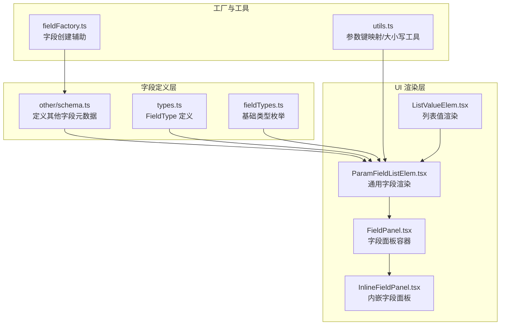
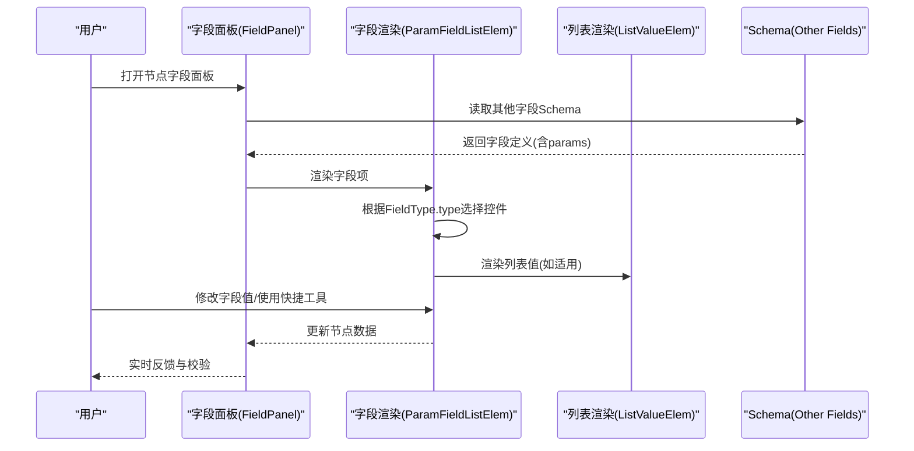
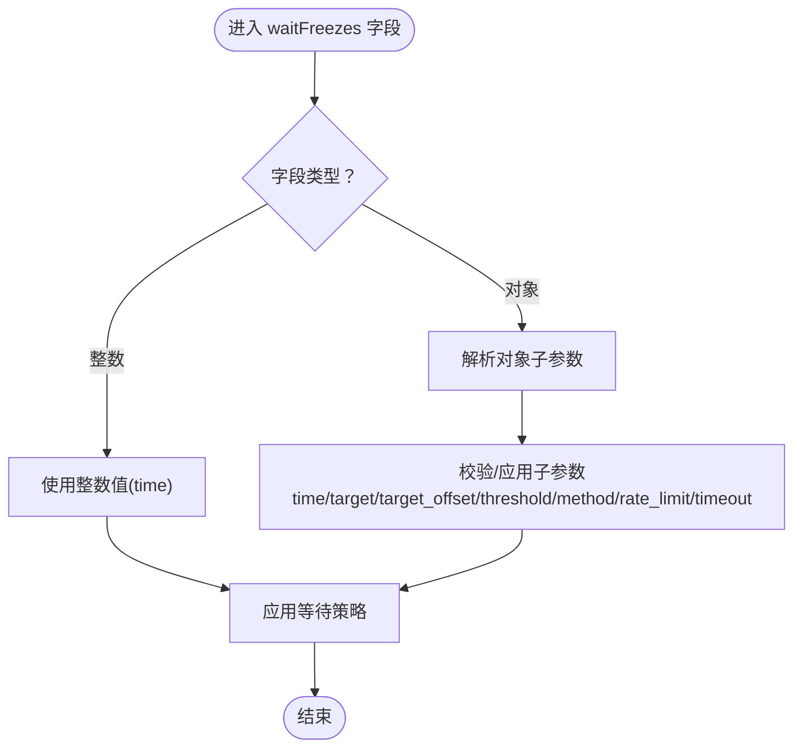
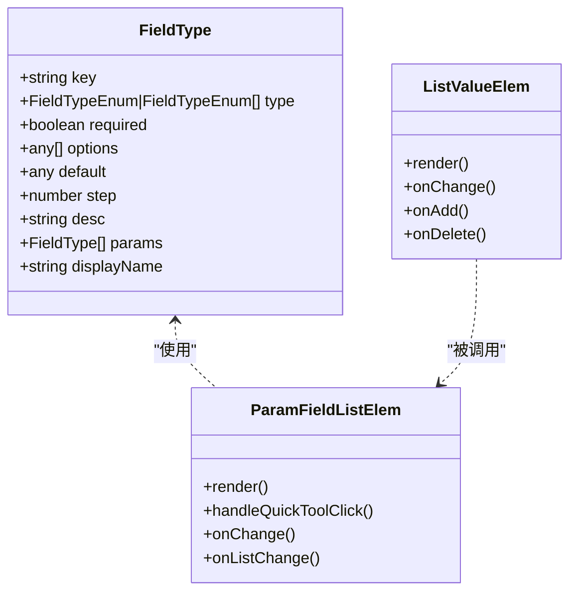
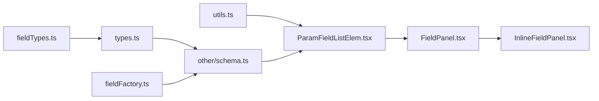

# 其他字段类型

<cite>
**本文档引用的文件**
- [schema.ts](file://src/core/fields/other/schema.ts)
- [index.ts](file://src/core/fields/other/index.ts)
- [types.ts](file://src/core/fields/types.ts)
- [fieldTypes.ts](file://src/core/fields/fieldTypes.ts)
- [fieldFactory.ts](file://src/core/fields/fieldFactory.ts)
- [utils.ts](file://src/core/fields/utils.ts)
- [ParamFieldListElem.tsx](file://src/components/panels/field/items/ParamFieldListElem.tsx)
- [ListValueElem.tsx](file://src/components/panels/field/items/ListValueElem.tsx)
- [FieldPanel.tsx](file://src/components/panels/main/FieldPanel.tsx)
- [InlineFieldPanel.tsx](file://src/components/panels/main/InlineFieldPanel.tsx)
</cite>

## 目录
1. [简介](#简介)
2. [项目结构](#项目结构)
3. [核心组件](#核心组件)
4. [架构总览](#架构总览)
5. [详细组件分析](#详细组件分析)
6. [依赖关系分析](#依赖关系分析)
7. [性能考量](#性能考量)
8. [故障排查指南](#故障排查指南)
9. [结论](#结论)
10. [附录](#附录)

## 简介
本章节系统梳理“其他字段类型”的完整定义与使用方法，涵盖通用参数字段、配置选项字段、辅助功能字段等。重点解释字段在工作流中的作用、典型应用场景、参数说明、配置示例路径、使用注意事项以及字段间的依赖关系与组合方式，并提供扩展与自定义开发指南。

## 项目结构
“其他字段类型”位于前端核心字段体系中，采用统一的字段定义规范与渲染机制：
- 字段定义：集中于 other/schema.ts，提供字段键、类型、默认值、描述、子参数等元数据。
- 字段类型枚举：fieldTypes.ts 定义基础类型，如整型、浮点、布尔、字符串、XYWH、图片路径等。
- 字段类型定义：types.ts 提供 FieldType 结构，支持 params 子参数列表与显示名等。
- 工厂与工具：fieldFactory.ts 提供字段创建辅助；utils.ts 提供参数键映射与大小写转换等工具。
- UI 渲染：ParamFieldListElem.tsx 与 ListValueElem.tsx 负责将字段元数据渲染为可编辑的表单项，支持快捷工具（如 ROI、OCR、模板截图、颜色取点、位移差值等）。

图表来源
- [schema.ts:1-363](file://src/core/fields/other/schema.ts#L1-L363)
- [types.ts:1-34](file://src/core/fields/types.ts#L1-L34)
- [fieldTypes.ts:1-27](file://src/core/fields/fieldTypes.ts#L1-L27)
- [fieldFactory.ts:1-16](file://src/core/fields/fieldFactory.ts#L1-L16)
- [utils.ts:1-41](file://src/core/fields/utils.ts#L1-L41)
- [ParamFieldListElem.tsx:1-775](file://src/components/panels/field/items/ParamFieldListElem.tsx#L1-L775)
- [ListValueElem.tsx:1-149](file://src/components/panels/field/items/ListValueElem.tsx#L1-L149)
- [FieldPanel.tsx:1-524](file://src/components/panels/main/FieldPanel.tsx#L1-L524)
- [InlineFieldPanel.tsx:141-191](file://src/components/panels/main/InlineFieldPanel.tsx#L141-L191)

章节来源
- [schema.ts:1-363](file://src/core/fields/other/schema.ts#L1-L363)
- [types.ts:1-34](file://src/core/fields/types.ts#L1-L34)
- [fieldTypes.ts:1-27](file://src/core/fields/fieldTypes.ts#L1-L27)
- [fieldFactory.ts:1-16](file://src/core/fields/fieldFactory.ts#L1-L16)
- [utils.ts:1-41](file://src/core/fields/utils.ts#L1-L41)
- [ParamFieldListElem.tsx:1-775](file://src/components/panels/field/items/ParamFieldListElem.tsx#L1-L775)
- [ListValueElem.tsx:1-149](file://src/components/panels/field/items/ListValueElem.tsx#L1-L149)
- [FieldPanel.tsx:1-524](file://src/components/panels/main/FieldPanel.tsx#L1-L524)
- [InlineFieldPanel.tsx:141-191](file://src/components/panels/main/InlineFieldPanel.tsx#L141-L191)

## 核心组件
- 其他字段 Schema：定义所有“其他字段类型”的键、类型、默认值、描述与子参数（params），并导出字段列表与其他工具。
- 字段类型枚举：统一的基础类型，支持整型、浮点、布尔、字符串、XYWH、图片路径、列表等。
- 字段类型定义：FieldType 支持 required、options、default、step、desc、params、displayName 等。
- 工具函数：生成参数键映射、生成大写值映射，便于 UI 与业务逻辑使用。
- UI 渲染组件：ParamFieldListElem.tsx 将字段元数据渲染为可编辑表单，支持快捷工具；ListValueElem.tsx 渲染列表值。

章节来源
- [schema.ts:7-308](file://src/core/fields/other/schema.ts#L7-L308)
- [types.ts:6-16](file://src/core/fields/types.ts#L6-L16)
- [fieldTypes.ts:4-26](file://src/core/fields/fieldTypes.ts#L4-L26)
- [utils.ts:6-25](file://src/core/fields/utils.ts#L6-L25)
- [ParamFieldListElem.tsx:420-669](file://src/components/panels/field/items/ParamFieldListElem.tsx#L420-L669)
- [ListValueElem.tsx:60-148](file://src/components/panels/field/items/ListValueElem.tsx#L60-L148)

## 架构总览
“其他字段类型”在系统中的职责与交互如下：
- 定义层：other/schema.ts 提供字段元数据，包含通用参数、配置选项与辅助功能三类字段。
- 渲染层：ParamFieldListElem.tsx 根据 FieldType.type 与 FieldType.options 渲染不同输入控件（数字、开关、下拉、文本、图片路径、列表等），并提供快捷工具。
- 交互层：FieldPanel.tsx 与 InlineFieldPanel.tsx 提供字段面板容器，承载字段编辑与校验修复能力。
- 工具层：fieldFactory.ts 与 utils.ts 提供字段创建与参数键映射等辅助能力。

图表来源
- [FieldPanel.tsx:240-380](file://src/components/panels/main/FieldPanel.tsx#L240-L380)
- [ParamFieldListElem.tsx:420-669](file://src/components/panels/field/items/ParamFieldListElem.tsx#L420-L669)
- [ListValueElem.tsx:60-148](file://src/components/panels/field/items/ListValueElem.tsx#L60-L148)
- [schema.ts:7-308](file://src/core/fields/other/schema.ts#L7-L308)

章节来源
- [FieldPanel.tsx:240-380](file://src/components/panels/main/FieldPanel.tsx#L240-L380)
- [ParamFieldListElem.tsx:420-669](file://src/components/panels/field/items/ParamFieldListElem.tsx#L420-L669)
- [ListValueElem.tsx:60-148](file://src/components/panels/field/items/ListValueElem.tsx#L60-L148)
- [schema.ts:7-308](file://src/core/fields/other/schema.ts#L7-L308)

## 详细组件分析

### 通用参数字段
通用参数字段用于控制节点的执行行为与识别策略，常见字段包括：
- rate_limit：识别速率限制，单位毫秒。可选，默认 1000。每轮识别 next 最低消耗 rate_limit 毫秒，不足的时间将会 sleep 等待。
- timeout：next 列表循环识别的超时时间，毫秒。可选，默认 20*1000（20 秒）。设置为 -1 表示无限等待。
- pre_delay：识别到到执行动作前的延迟，毫秒。可选，默认 200。
- post_delay：执行动作后到识别 next 的延迟，毫秒。可选，默认 200。
- pre_wait_freezes：识别到到执行动作前等待画面不动的时间，毫秒。可选，默认 0。支持整数或对象两种模式，对象模式包含 time、target、target_offset、threshold、method、rate_limit、timeout 等子参数。
- post_wait_freezes：执行动作后到识别 next 等待画面不动的时间，毫秒。可选，默认 0。支持整数或对象两种模式，参数与 pre_wait_freezes 类似。
- repeat：动作重复执行次数。可选，默认 1。执行流程为 action - [repeat_wait_freezes - repeat_delay - action] × (repeat-1)。
- repeat_delay：每次重复动作之间的延迟，毫秒。可选，默认 0。仅当 repeat > 1 时生效。
- repeat_wait_freezes：每次重复动作之间等待画面不动的时间，毫秒。可选，默认 0。仅当 repeat > 1 时生效。

应用场景
- 通过 rate_limit 与 timeout 控制识别节奏与稳定性。
- 通过 pre/post_delay 与 wait_freezes 精准控制动作前后时机与画面稳定。
- 通过 repeat 系列字段实现批量重复操作，提升效率。

使用注意事项
- 频繁使用延迟会影响稳定性，推荐优先拆分中间过程节点。
- wait_freezes 的对象模式支持更精细的模板匹配阈值与算法参数。
- repeat 系列字段仅在 repeat > 1 时生效。

章节来源
- [schema.ts:8-179](file://src/core/fields/other/schema.ts#L8-L179)
- [schema.ts:337-341](file://src/core/fields/other/schema.ts#L337-L341)

### 配置选项字段
配置选项字段用于控制节点的启用、识别结果反转、最大命中次数等：
- enabled：是否启用该节点。可选，默认 true。若为 false，其他节点的 next 列表中的该节点会被跳过。
- inverse：反转识别结果。可选，默认 false。注意：由此识别出的节点，Click 等动作的点击自身将失效（因为实际并未识别到东西）。
- max_hit：该节点最多可被识别成功多少次。可选，默认无限制。超过次数后，其他节点的 next 列表中的该节点会被跳过。
- anchor：锚点名称。可选，默认空。支持字符串、字符串数组、对象三种格式。在 next 或 on_error 中可通过 [Anchor] 属性引用该锚点，运行时会解析为最后设置该锚点的节点。若引用的锚点未设置或已被清除，该节点将被跳过。

应用场景
- 通过 enabled 控制条件执行与调试阶段的节点开关。
- 通过 inverse 实现“未识别到即执行”的反向逻辑。
- 通过 max_hit 限制节点的执行次数，避免重复执行。
- 通过 anchor 实现跨节点的引用与联动。

使用注意事项
- anchor 支持多种格式，需根据场景选择合适的锚点表达方式。
- anchor 的引用解析在运行时进行，若引用的锚点不存在或被清除，节点将被跳过。

章节来源
- [schema.ts:22-45](file://src/core/fields/other/schema.ts#L22-L45)

### 辅助功能字段
辅助功能字段用于增强节点的可观测性与调试能力：
- focus：关注节点，会额外产生部分回调消息。可选，默认空。键为消息类型，值为模板字符串，模板字符串支持文件路径、URL 或直接文本，内容支持 Markdown 格式，支持国际化（以 $ 开头）。模板中可使用 {字段名} 格式的占位符，UI 会自动替换为实际值。支持的消息类型包括：Node.Recognition.Starting、Node.Recognition.Succeeded、Node.Recognition.Failed、Node.Action.Starting、Node.Action.Succeeded、Node.Action.Failed。
- attach：附加 JSON 对象，用于保存节点的附加配置。可选，默认空对象。该字段会与默认值中的 attach 进行字典合并（dict merge），而不是覆盖。

应用场景
- 通过 focus 输出识别与动作的生命周期消息，便于调试与可视化。
- 通过 attach 存储自定义配置信息，不影响执行逻辑但可通过接口获取。

使用注意事项
- focus 的模板字符串支持占位符与国际化，需确保占位符与节点字段一致。
- attach 的合并策略为字典合并，相同键的值会被节点中的值覆盖，其他键保留。

章节来源
- [schema.ts:180-229](file://src/core/fields/other/schema.ts#L180-L229)
- [schema.ts:302-307](file://src/core/fields/other/schema.ts#L302-L307)

### waitFreezes 字段的双模式处理
waitFreezes 字段（pre_wait_freezes、post_wait_freezes、repeat_wait_freezes）支持整数与对象两种模式：
- 整数模式：直接指定等待时间（毫秒）。
- 对象模式：包含 time、target、target_offset、threshold、method、rate_limit、timeout 等子参数，用于更精细的等待策略。

图表来源
- [schema.ts:65-118](file://src/core/fields/other/schema.ts#L65-L118)
- [schema.ts:125-178](file://src/core/fields/other/schema.ts#L125-L178)
- [schema.ts:247-300](file://src/core/fields/other/schema.ts#L247-L300)

章节来源
- [schema.ts:65-118](file://src/core/fields/other/schema.ts#L65-L118)
- [schema.ts:125-178](file://src/core/fields/other/schema.ts#L125-L178)
- [schema.ts:247-300](file://src/core/fields/other/schema.ts#L247-L300)

### 字段在 UI 中的渲染与交互
- ParamFieldListElem.tsx 根据 FieldType.type 选择渲染控件：整型/浮点使用输入框，布尔使用开关，字符串/Any 使用文本域，列表使用 ListValueElem.tsx，图片路径使用 ImageSelect。
- 支持快捷工具：ROI 选择、ROI 偏移、OCR 识别、模板截图、颜色取点、位移差值等，通过模态框与设备连接状态联动。
- 支持 params 子参数渲染：对于具有 params 的字段（如 focus、waitFreezes 等），UI 会递归渲染子参数项。

图表来源
- [types.ts:6-16](file://src/core/fields/types.ts#L6-L16)
- [ParamFieldListElem.tsx:420-669](file://src/components/panels/field/items/ParamFieldListElem.tsx#L420-L669)
- [ListValueElem.tsx:60-148](file://src/components/panels/field/items/ListValueElem.tsx#L60-L148)

章节来源
- [ParamFieldListElem.tsx:420-669](file://src/components/panels/field/items/ParamFieldListElem.tsx#L420-L669)
- [ListValueElem.tsx:60-148](file://src/components/panels/field/items/ListValueElem.tsx#L60-L148)
- [types.ts:6-16](file://src/core/fields/types.ts#L6-L16)

## 依赖关系分析
- 字段定义依赖字段类型枚举与类型定义，确保 UI 渲染与业务逻辑的一致性。
- UI 渲染依赖字段定义与工具函数，生成参数键映射与大小写转换，便于动态渲染与校验。
- 字段面板容器负责承载字段编辑与校验修复，保证节点数据结构的完整性。

图表来源
- [fieldTypes.ts:1-27](file://src/core/fields/fieldTypes.ts#L1-L27)
- [types.ts:1-34](file://src/core/fields/types.ts#L1-L34)
- [fieldFactory.ts:1-16](file://src/core/fields/fieldFactory.ts#L1-L16)
- [utils.ts:1-41](file://src/core/fields/utils.ts#L1-L41)
- [schema.ts:1-363](file://src/core/fields/other/schema.ts#L1-L363)
- [ParamFieldListElem.tsx:1-775](file://src/components/panels/field/items/ParamFieldListElem.tsx#L1-L775)
- [FieldPanel.tsx:1-524](file://src/components/panels/main/FieldPanel.tsx#L1-L524)
- [InlineFieldPanel.tsx:141-191](file://src/components/panels/main/InlineFieldPanel.tsx#L141-L191)

章节来源
- [fieldTypes.ts:1-27](file://src/core/fields/fieldTypes.ts#L1-L27)
- [types.ts:1-34](file://src/core/fields/types.ts#L1-L34)
- [fieldFactory.ts:1-16](file://src/core/fields/fieldFactory.ts#L1-L16)
- [utils.ts:1-41](file://src/core/fields/utils.ts#L1-L41)
- [schema.ts:1-363](file://src/core/fields/other/schema.ts#L1-L363)
- [ParamFieldListElem.tsx:1-775](file://src/components/panels/field/items/ParamFieldListElem.tsx#L1-L775)
- [FieldPanel.tsx:1-524](file://src/components/panels/main/FieldPanel.tsx#L1-L524)
- [InlineFieldPanel.tsx:141-191](file://src/components/panels/main/InlineFieldPanel.tsx#L141-L191)

## 性能考量
- 识别节奏：合理设置 rate_limit 与 timeout，避免过度等待导致流程卡顿。
- 延迟策略：优先使用中间过程节点替代频繁延迟，提升稳定性与响应速度。
- 等待画面静止：wait_freezes 的对象模式可结合阈值与算法参数，减少无效等待。
- 重复执行：repeat 系列字段在大量重复操作时可显著提升效率，但需注意动作前后延迟与等待策略的配合。

## 故障排查指南
- 节点数据结构问题：FieldPanel.tsx 提供节点数据验证与修复逻辑，自动补全 recognition、action、others 等关键字段。
- 设备连接状态：ParamFieldListElem.tsx 在使用快捷工具（如 ROI、OCR、模板截图、颜色取点、位移差值）时会检查连接状态，未连接时提示用户先连接设备。
- 字段值解析：ListValueElem.tsx 在编辑列表值时采用本地状态并在失焦时解析 JSON，避免即时解析导致的输入体验问题。

章节来源
- [FieldPanel.tsx:41-119](file://src/components/panels/main/FieldPanel.tsx#L41-L119)
- [ParamFieldListElem.tsx:115-196](file://src/components/panels/field/items/ParamFieldListElem.tsx#L115-L196)
- [ListValueElem.tsx:13-58](file://src/components/panels/field/items/ListValueElem.tsx#L13-L58)

## 结论
“其他字段类型”通过统一的字段定义与渲染机制，为工作流提供了灵活的执行控制、识别策略与辅助观测能力。合理使用通用参数、配置选项与辅助功能字段，可显著提升流程的稳定性、可维护性与可观测性。扩展与自定义开发应遵循字段类型定义与 UI 渲染规范，确保新字段与现有体系无缝集成。

## 附录

### 字段类型扩展与自定义开发指南
- 新增字段：在 other/schema.ts 中定义新的 FieldType，包含 key、type、default、desc、params（如有）等。
- 类型声明：在 fieldTypes.ts 中补充必要的基础类型，或复用现有类型。
- UI 渲染：在 ParamFieldListElem.tsx 中根据 FieldType.type 自动渲染相应控件；如需特殊交互，可在组件中扩展处理逻辑。
- 参数键映射：使用 utils.ts 中的工具函数生成参数键映射，便于动态渲染与校验。
- 字段创建辅助：使用 fieldFactory.ts 中的 createField/createFields 简化字段定义与批量创建。

章节来源
- [schema.ts:1-363](file://src/core/fields/other/schema.ts#L1-L363)
- [fieldTypes.ts:1-27](file://src/core/fields/fieldTypes.ts#L1-L27)
- [ParamFieldListElem.tsx:420-669](file://src/components/panels/field/items/ParamFieldListElem.tsx#L420-L669)
- [utils.ts:6-25](file://src/core/fields/utils.ts#L6-L25)
- [fieldFactory.ts:6-15](file://src/core/fields/fieldFactory.ts#L6-L15)