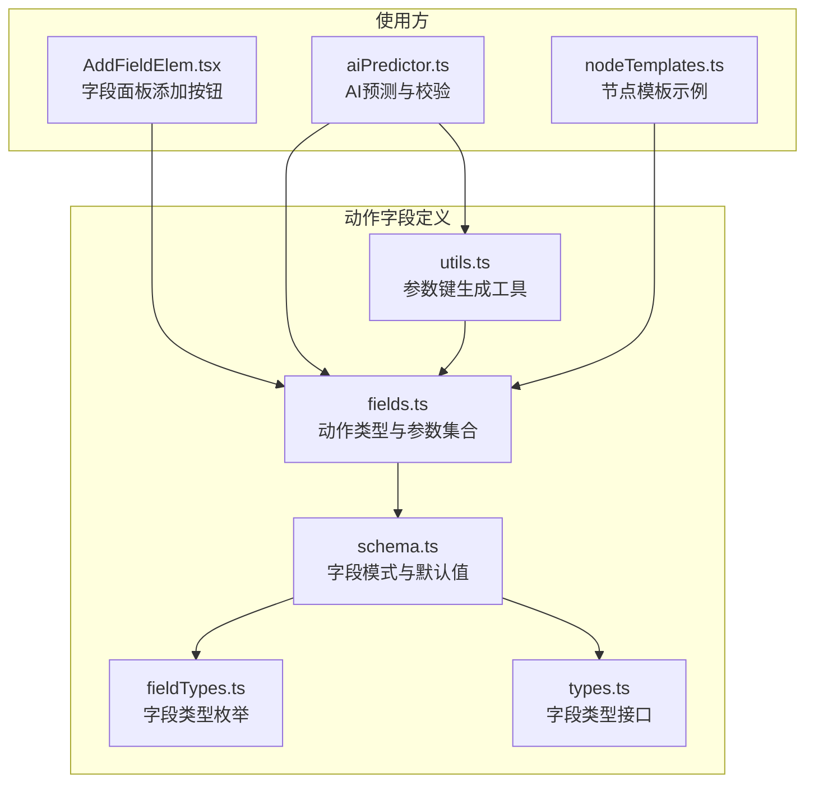
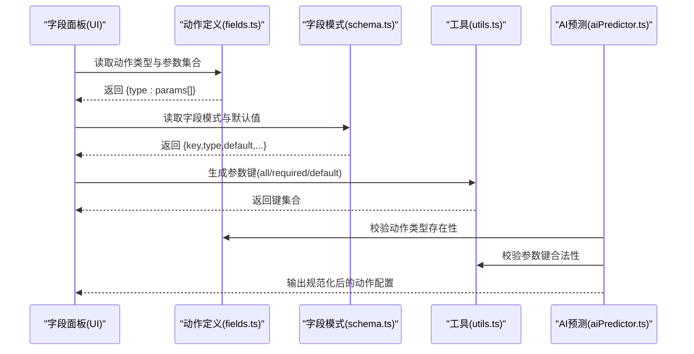
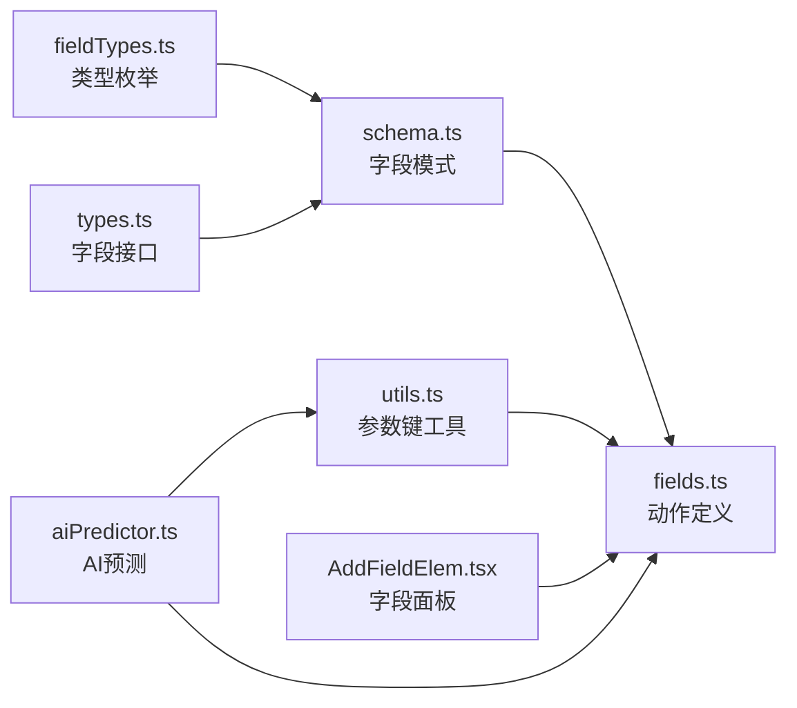

# 动作字段类型

<cite>
**本文档引用的文件**
- [fields.ts](file://src/core/fields/action/fields.ts)
- [schema.ts](file://src/core/fields/action/schema.ts)
- [index.ts](file://src/core/fields/action/index.ts)
- [types.ts](file://src/core/fields/types.ts)
- [fieldTypes.ts](file://src/core/fields/fieldTypes.ts)
- [utils.ts](file://src/core/fields/utils.ts)
- [aiPredictor.ts](file://src/utils/aiPredictor.ts)
- [nodeTemplates.ts](file://src/data/nodeTemplates.ts)
- [AddFieldElem.tsx](file://src/components/panels/field/items/AddFieldElem.tsx)
</cite>

## 目录
1. [简介](#简介)
2. [项目结构](#项目结构)
3. [核心组件](#核心组件)
4. [架构总览](#架构总览)
5. [详细组件分析](#详细组件分析)
6. [依赖关系分析](#依赖关系分析)
7. [性能考量](#性能考量)
8. [故障排查指南](#故障排查指南)
9. [结论](#结论)
10. [附录](#附录)

## 简介
本文件系统性梳理“动作字段类型”，覆盖点击、滑动、输入、应用控制、命令执行、截图等动作类型，逐项说明参数配置、坐标系统、时间设置、执行顺序、参数校验与错误处理机制，并给出适用场景与最佳实践，以及安全考虑与性能优化建议。内容基于前端字段定义与解析逻辑，帮助非技术用户也能准确理解与使用。

## 项目结构
动作字段类型由“字段定义 + 字段模式 + 类型枚举 + 工具函数”构成，统一在核心字段模块中管理，供 UI 组件与解析器使用。

图表来源
- [fields.ts:1-149](file://src/core/fields/action/fields.ts#L1-L149)
- [schema.ts:1-299](file://src/core/fields/action/schema.ts#L1-L299)
- [types.ts:1-34](file://src/core/fields/types.ts#L1-L34)
- [fieldTypes.ts:1-27](file://src/core/fields/fieldTypes.ts#L1-L27)
- [utils.ts:1-41](file://src/core/fields/utils.ts#L1-L41)
- [AddFieldElem.tsx:1-62](file://src/components/panels/field/items/AddFieldElem.tsx#L1-L62)
- [aiPredictor.ts:673-713](file://src/utils/aiPredictor.ts#L673-L713)
- [nodeTemplates.ts:1-108](file://src/data/nodeTemplates.ts#L1-L108)

章节来源
- [fields.ts:1-149](file://src/core/fields/action/fields.ts#L1-L149)
- [schema.ts:1-299](file://src/core/fields/action/schema.ts#L1-L299)
- [types.ts:1-34](file://src/core/fields/types.ts#L1-L34)
- [fieldTypes.ts:1-27](file://src/core/fields/fieldTypes.ts#L1-L27)
- [utils.ts:1-41](file://src/core/fields/utils.ts#L1-L41)

## 核心组件
- 动作类型集合：定义了所有可用动作及其参数列表与描述。
- 字段模式：定义每个字段的键、类型、是否必填、默认值、步长、可选项与说明。
- 类型枚举：统一的字段类型体系，涵盖整数、布尔、字符串、列表、坐标四元组等。
- 工具函数：生成参数键集合、大小写映射，辅助 UI 与解析器使用。

章节来源
- [fields.ts:7-148](file://src/core/fields/action/fields.ts#L7-L148)
- [schema.ts:7-291](file://src/core/fields/action/schema.ts#L7-L291)
- [fieldTypes.ts:4-26](file://src/core/fields/fieldTypes.ts#L4-L26)
- [utils.ts:6-25](file://src/core/fields/utils.ts#L6-L25)

## 架构总览
动作字段的“定义—校验—渲染—执行”流程如下：

图表来源
- [fields.ts:7-148](file://src/core/fields/action/fields.ts#L7-L148)
- [schema.ts:7-291](file://src/core/fields/action/schema.ts#L7-L291)
- [utils.ts:6-25](file://src/core/fields/utils.ts#L6-L25)
- [aiPredictor.ts:673-713](file://src/utils/aiPredictor.ts#L673-L713)

## 详细组件分析

### 动作类型总览与参数键
- 动作类型集合包含：空动作、点击、自定义动作、滑动、滚轮、按键、长按、多指滑动、触控点按下/移动/抬起、长按按键、按键按下/松开、输入文本、启动/停止应用、停止任务、执行命令、执行Shell、截图等。
- 每个动作由一组参数组成，参数键来自字段模式；工具函数生成“全部参数键、必填参数键、必填默认值”的映射，便于 UI 与解析器使用。

章节来源
- [fields.ts:7-148](file://src/core/fields/action/fields.ts#L7-L148)
- [utils.ts:6-25](file://src/core/fields/utils.ts#L6-L25)

### 字段类型与坐标系统
- 坐标系统采用“左上角为原点”的屏幕坐标系，单位为像素。
- 坐标表达形式：
  - 四元组 [x, y, w, h]：矩形区域，w/h 为宽高；当 w/h 为 0 时表示全屏。
  - 二元组 [x, y]：固定点。
  - 布尔 true：引用本节点刚识别到的目标（即自身）。
  - 字符串：引用之前某个节点的识别结果（节点名）。
  - 列表形式：支持多点或多段路径（如滑动终点列表、多指滑动）。
- 目标偏移 target_offset：在目标基础上额外平移，四个分量分别相加。

章节来源
- [schema.ts:9-25](file://src/core/fields/action/schema.ts#L9-L25)
- [schema.ts:28-45](file://src/core/fields/action/schema.ts#L28-L45)
- [schema.ts:48-82](file://src/core/fields/action/schema.ts#L48-L82)
- [schema.ts:103-131](file://src/core/fields/action/schema.ts#L103-L131)
- [schema.ts:140-165](file://src/core/fields/action/schema.ts#L140-L165)
- [fieldTypes.ts:14-16](file://src/core/fields/fieldTypes.ts#L14-L16)

### 点击动作（Click）
- 参数要点
  - 目标 target：支持 true、节点名、固定点、固定区域。
  - 目标偏移 target_offset：对目标进行二次定位。
  - 触点 contact：区分不同触控点（多指）。
  - 压力 pressure：触控压力（取决于控制器实现）。
- 适用场景
  - 点击按钮、图标、菜单项等。
- 最佳实践
  - 优先使用识别结果作为 target，避免硬编码坐标。
  - 在不确定目标位置时，使用区域定位并配合偏移微调。
- 安全与性能
  - 避免在高频点击中使用过大压力，防止误触。
  - 合理设置点击间隔，避免连续点击导致的误判。

章节来源
- [fields.ts:12-20](file://src/core/fields/action/fields.ts#L12-L20)
- [schema.ts:9-25](file://src/core/fields/action/schema.ts#L9-L25)
- [schema.ts:140-165](file://src/core/fields/action/schema.ts#L140-L165)

### 滑动动作（Swipe）
- 参数要点
  - 起点 begin / 起点偏移 begin_offset。
  - 终点 end / 终点偏移 end_offset：v4.5+ 支持列表，形成折线滑动。
  - 持续时间 duration：可为单值或与终点列表对应的列表。
  - 抬起点停留 end_hold：到达终点后额外等待再抬起。
  - 仅悬停 only_hover：仅移动不按下/抬起。
  - 触点 contact / 压力 pressure。
- 适用场景
  - 列表滚动、页面滑动、拖拽、多点手势。
- 最佳实践
  - 折线滑动使用终点列表，避免多次独立滑动导致的手抬手落。
  - 持续时间与速度需匹配设备刷新率，避免卡顿。
- 安全与性能
  - 避免过小的持续时间导致滑动不完整。
  - 多点滑动时注意触点编号与设备支持情况。

章节来源
- [fields.ts:30-43](file://src/core/fields/action/fields.ts#L30-L43)
- [schema.ts:48-102](file://src/core/fields/action/schema.ts#L48-L102)
- [schema.ts:140-165](file://src/core/fields/action/schema.ts#L140-L165)

### 滚轮动作（Scroll）
- 参数要点
  - 目标 target / 目标偏移 target_offset。
  - 水平/垂直滚动增量 dx/dy：Win32 控制器支持，建议使用 120 的整数倍以适配标准滚轮。
- 适用场景
  - 文本编辑器滚动、网页/应用内滚动。
- 最佳实践
  - 使用整数倍增量，保证兼容性。
  - 滚动前先将鼠标移动到目标区域，避免跨区域滚动。
- 安全与性能
  - ADB/PlayCover 控制器不支持，需在 Win32 环境使用。

章节来源
- [fields.ts:44-52](file://src/core/fields/action/fields.ts#L44-L52)
- [schema.ts:103-131](file://src/core/fields/action/schema.ts#L103-L131)

### 长按动作（LongPress）
- 参数要点
  - 目标 target / 偏移 target_offset。
  - 持续时间 duration：单位毫秒。
  - 触点 contact / 压力 pressure。
- 适用场景
  - 弹出菜单、长按选择、拖拽准备。
- 最佳实践
  - 持续时间应覆盖目标界面的菜单弹出时间。
  - 与点击动作配合时，注意先后顺序与间隔。

章节来源
- [fields.ts:57-66](file://src/core/fields/action/fields.ts#L57-L66)
- [schema.ts:28-45](file://src/core/fields/action/schema.ts#L28-L45)
- [schema.ts:140-165](file://src/core/fields/action/schema.ts#L140-L165)

### 多指滑动（MultiSwipe）
- 参数要点
  - swipes：对象数组，每个对象包含：
    - starting：滑动起始时间（毫秒），用于确定执行顺序。
    - begin / begin_offset / end / end_offset / duration / end_hold / only_hover / contact。
  - contact 编号规则：若为 0，将使用数组索引作为触点编号。
- 适用场景
  - 多点手势、捏合/张开、复杂路径滑动。
- 最佳实践
  - 合理安排 starting，确保多指动作的时序正确。
  - 起点/终点尽量在同一坐标系下，避免跨区域抖动。

章节来源
- [fields.ts:67-70](file://src/core/fields/action/fields.ts#L67-L70)
- [schema.ts:132-138](file://src/core/fields/action/schema.ts#L132-L138)
- [schema.ts:140-165](file://src/core/fields/action/schema.ts#L140-L165)

### 触控点动作（TouchDown/TouchMove/TouchUp）
- 参数要点
  - 触点编号 contact：区分不同触控点。
  - 目标 target / 偏移 target_offset。
  - 压力 pressure。
- 适用场景
  - 精细触控、多指交互、模拟手写。
- 最佳实践
  - 先 TouchDown，再 TouchMove 更新位置，最后 TouchUp 结束。
  - 注意触点编号与设备支持上限。

章节来源
- [fields.ts:71-92](file://src/core/fields/action/fields.ts#L71-L92)
- [schema.ts:140-165](file://src/core/fields/action/schema.ts#L140-L165)

### 按键动作（ClickKey/LongPressKey/KeyDown/KeyUp）
- 参数要点
  - 单击按键 clickKey：支持整数列表或单值。
  - 长按按键 longPressKey / longPressKeyDuration。
  - 按下/松开按键：与长按配合，实现自定义按键序列。
- 适用场景
  - 系统热键、快捷键、游戏内按键。
- 最佳实践
  - 使用控制器支持的虚拟按键码。
  - 长按与按下/松开组合时，注意时序与间隔。

章节来源
- [fields.ts:53-107](file://src/core/fields/action/fields.ts#L53-L107)
- [schema.ts:168-189](file://src/core/fields/action/schema.ts#L168-L189)

### 输入动作（InputText）
- 参数要点
  - input_text：要输入的文本，部分控制器仅支持 ASCII。
- 适用场景
  - 文本输入框、搜索框、聊天窗口。
- 最佳实践
  - 预先聚焦目标输入框，避免输入到错误位置。
  - 文本中包含特殊字符时，确认控制器支持情况。

章节来源
- [fields.ts:108-111](file://src/core/fields/action/fields.ts#L108-L111)
- [schema.ts:192-198](file://src/core/fields/action/schema.ts#L192-L198)

### 应用动作（StartApp/StopApp）
- 参数要点
  - package：包名或 Activity 入口，如 com.example.app 或 com.example.app/com.example.MainActivity。
- 适用场景
  - 启动/关闭应用、切换应用。
- 最佳实践
  - 使用稳定的包名或 Activity 入口，避免版本差异导致的失效。
  - 启动后适当延时，等待应用完全加载。

章节来源
- [fields.ts:112-119](file://src/core/fields/action/fields.ts#L112-L119)
- [schema.ts:200-207](file://src/core/fields/action/schema.ts#L200-L207)

### 命令动作（Command/Shell）
- 参数要点
  - Command：exec（程序路径）、args（参数列表）、detach（分离子进程）。
  - Shell：cmd（shell 命令）、shell_timeout（超时时间，毫秒，-1 表示无限）。
- 适用场景
  - 设备配置、系统调试、自动化脚本。
- 最佳实践
  - Shell 命令需在 ADB 设备上执行，注意权限与超时设置。
  - 参数中可使用占位符（如任务入口名、节点名、截图路径等）。

章节来源
- [fields.ts:124-135](file://src/core/fields/action/fields.ts#L124-L135)
- [schema.ts:210-242](file://src/core/fields/action/schema.ts#L210-L242)

### 截图动作（Screencap）
- 参数要点
  - filename：文件名（不含扩展名），默认使用“时间戳_节点名”。
  - format：png/jpg/jpeg，默认 png。
  - quality：0-100，仅对 jpg/jpeg 有效。
- 适用场景
  - 识别调试、问题复现、记录关键帧。
- 最佳实践
  - png 适合无损记录，jpg 适合节省空间。
  - 截图保存在 log_dir/screencap/ 目录下，注意磁盘空间。

章节来源
- [fields.ts:136-143](file://src/core/fields/action/fields.ts#L136-L143)
- [schema.ts:244-264](file://src/core/fields/action/schema.ts#L244-L264)

### 自定义动作（Custom）
- 参数要点
  - custom_action：动作名，与注册接口传入的识别器名一致。
  - custom_action_param：任意类型参数，通过回调传出。
  - target：目标位置，通过回调 box 传出。
- 适用场景
  - 扩展业务动作、第三方集成。
- 最佳实践
  - 与后端资源注册保持一致，确保动作名与参数结构匹配。

章节来源
- [fields.ts:21-29](file://src/core/fields/action/fields.ts#L21-L29)
- [schema.ts:267-291](file://src/core/fields/action/schema.ts#L267-L291)

### 空动作（DoNothing）
- 参数要点
  - 无参数。
- 适用场景
  - 占位、调试、条件分支中的空操作。
- 最佳实践
  - 仅用于占位，避免在 AI 预测中误用。

章节来源
- [fields.ts:8-11](file://src/core/fields/action/fields.ts#L8-L11)
- [aiPredictor.ts:684-691](file://src/utils/aiPredictor.ts#L684-L691)

### 停止任务（StopTask）
- 参数要点
  - 无参数。
- 适用场景
  - 主动中断当前任务链。
- 最佳实践
  - 在异常或不可恢复状态时使用，避免误触发。

章节来源
- [fields.ts:120-123](file://src/core/fields/action/fields.ts#L120-L123)

### 已废弃动作（Key）
- 参数要点
  - 已废弃，兼容保留，推荐使用 ClickKey。
- 适用场景
  - 历史配置兼容。
- 最佳实践
  - 新建配置请使用 ClickKey。

章节来源
- [fields.ts:144-147](file://src/core/fields/action/fields.ts#L144-L147)

### 执行顺序与参数验证
- 执行顺序
  - 动作按节点在工作流中的顺序依次执行。
  - 多指滑动通过 starting 字段确定执行时序。
- 参数验证
  - AI 预测阶段会检查动作类型是否存在，以及参数键是否合法。
  - DoNothing 不应包含任何参数，AI 将忽略多余参数。
  - 未在允许键集合内的参数会被忽略并记录警告。
- 错误处理
  - 类型不存在：记录“动作类型错误”并忽略。
  - 参数非法：记录“参数不在有效字段中”并忽略。
  - 目标为空：滚动目标引用的前置节点或锚点识别结果为空时，视为动作失败。

章节来源
- [aiPredictor.ts:673-713](file://src/utils/aiPredictor.ts#L673-L713)
- [utils.ts:6-25](file://src/core/fields/utils.ts#L6-L25)
- [schema.ts:112-113](file://src/core/fields/action/schema.ts#L112-L113)

### 使用示例（基于模板）
- 文字识别后点击：识别类型为 OCR，动作类型为 Click，参数为空。
- 图像识别后点击：识别类型为 TemplateMatch，动作类型为 Click，参数为空。
- 直接点击：动作类型为 Click，target 为 [0,0,0,0]（全屏）。
- 自定义动作：动作类型为 Custom，填写 custom_action 与 custom_action_param。

章节来源
- [nodeTemplates.ts:19-82](file://src/data/nodeTemplates.ts#L19-L82)

## 依赖关系分析
动作字段的依赖关系如下：

图表来源
- [fieldTypes.ts:1-27](file://src/core/fields/fieldTypes.ts#L1-L27)
- [types.ts:1-34](file://src/core/fields/types.ts#L1-L34)
- [schema.ts:1-299](file://src/core/fields/action/schema.ts#L1-L299)
- [fields.ts:1-149](file://src/core/fields/action/fields.ts#L1-L149)
- [utils.ts:1-41](file://src/core/fields/utils.ts#L1-L41)
- [AddFieldElem.tsx:1-62](file://src/components/panels/field/items/AddFieldElem.tsx#L1-L62)
- [aiPredictor.ts:673-713](file://src/utils/aiPredictor.ts#L673-L713)

## 性能考量
- 滑动与点击
  - 合理设置持续时间与抬起点停留，避免频繁微小移动造成卡顿。
  - 多指滑动时减少同时触点数量，降低设备压力。
- 输入与命令
  - 输入文本前确保焦点已设置，减少无效尝试。
  - Shell 命令设置合理超时，避免长时间阻塞。
- 截图
  - 优先使用 png 记录关键帧，jpg 用于大量截图场景。
  - 控制截图频率，避免占用过多磁盘空间。

## 故障排查指南
- 动作类型错误
  - 现象：动作被忽略并记录错误。
  - 处理：检查动作类型是否在预定义列表中，必要时转换为大写后重试。
- 参数键不合法
  - 现象：参数被忽略并记录警告。
  - 处理：核对参数键是否属于动作允许的键集合，移除无效键。
- 目标为空
  - 现象：滚动动作失败。
  - 处理：确认前置节点或锚点已正确识别，目标不为空。
- 滚轮不生效
  - 现象：滚轮操作无响应。
  - 处理：仅 Win32 控制器支持，且 dx/dy 建议使用 120 的整数倍。

章节来源
- [aiPredictor.ts:673-713](file://src/utils/aiPredictor.ts#L673-L713)
- [schema.ts:51-52](file://src/core/fields/action/schema.ts#L51-L52)
- [schema.ts:112-113](file://src/core/fields/action/schema.ts#L112-L113)

## 结论
动作字段类型提供了完善的参数体系与校验机制，覆盖点击、滑动、输入、应用控制、命令执行、截图等常见场景。通过坐标系统、时间参数与多指触控的支持，能够满足复杂自动化需求。建议在实际使用中遵循“先识别后操作、参数最小化、时序明确化”的原则，并结合性能与安全考量进行优化。

## 附录
- 字段键生成与映射
  - 自动生成“全部参数键、必填参数键、必填默认值”集合，便于 UI 与解析器快速判断。
- UI 交互
  - 字段面板提供“添加参数”按钮，展示字段说明，提升易用性。

章节来源
- [utils.ts:6-25](file://src/core/fields/utils.ts#L6-L25)
- [AddFieldElem.tsx:12-61](file://src/components/panels/field/items/AddFieldElem.tsx#L12-L61)