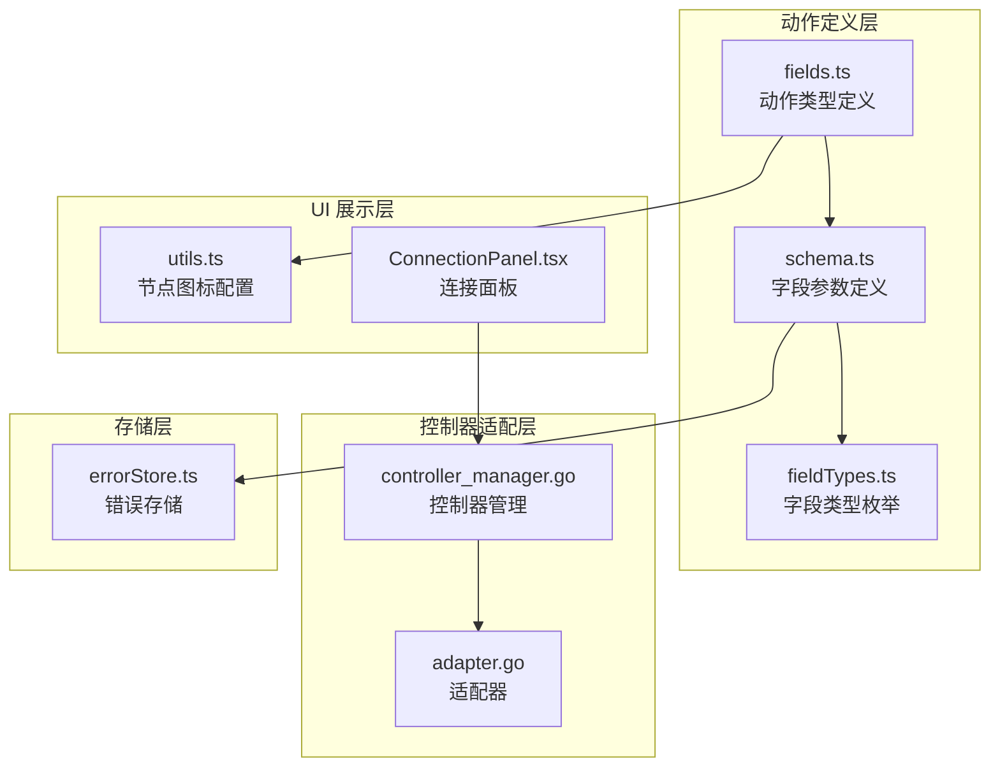
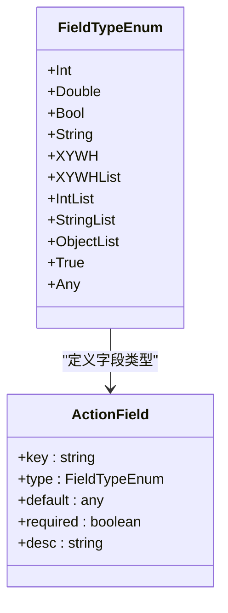
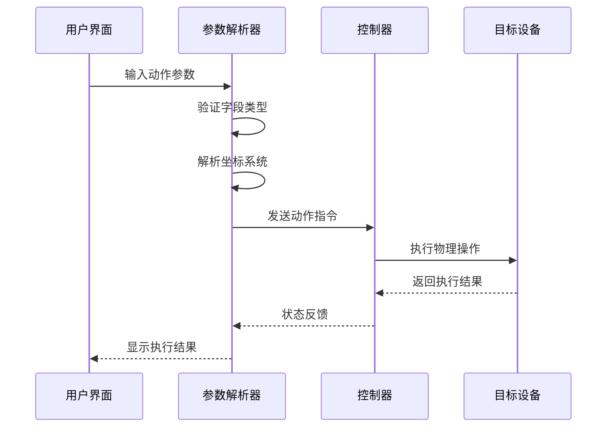
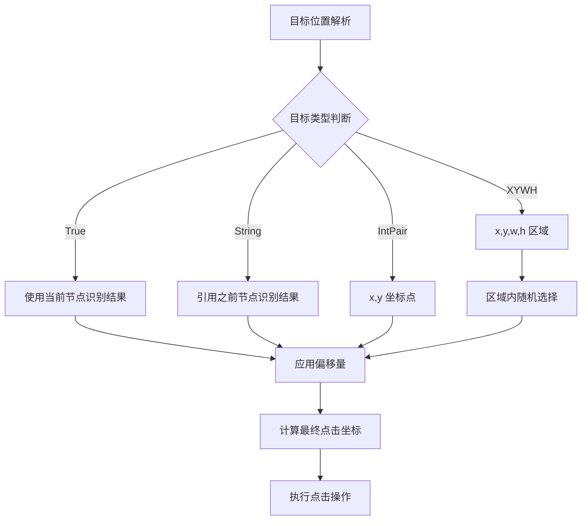
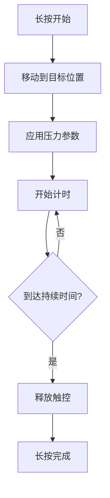
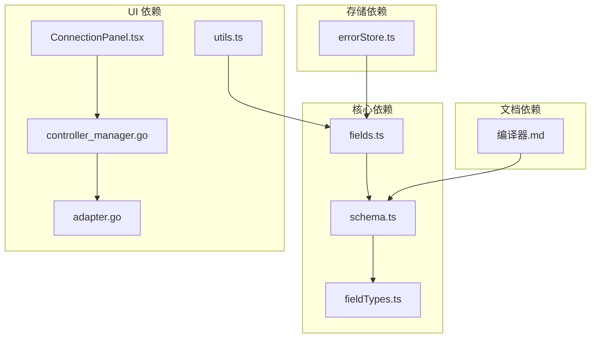
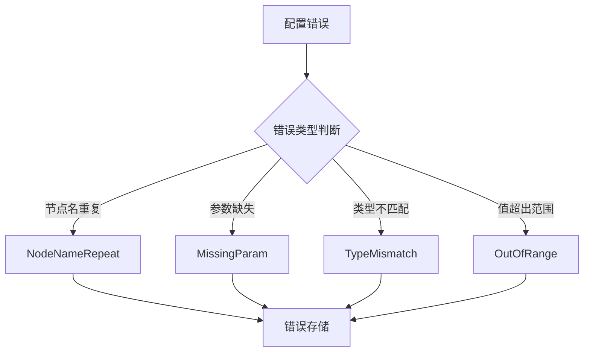

# 基础点击动作

<cite>
**本文档引用的文件**
- [fields.ts](file://src/core/fields/action/fields.ts)
- [schema.ts](file://src/core/fields/action/schema.ts)
- [fieldTypes.ts](file://src/core/fields/fieldTypes.ts)
- [utils.ts](file://src/components/flow/nodes/utils.ts)
- [ConnectionPanel.tsx](file://src/components/panels/main/ConnectionPanel.tsx)
- [controller_manager.go](file://LocalBridge/internal/mfw/controller_manager.go)
- [adapter.go](file://LocalBridge/internal/mfw/adapter.go)
- [errorStore.ts](file://src/stores/errorStore.ts)
- [编译器.md](file://docsite/docs/01.指南/30.特性/01.编译器.md)
</cite>

## 目录
1. [简介](#简介)
2. [项目结构](#项目结构)
3. [核心组件](#核心组件)
4. [架构概览](#架构概览)
5. [详细组件分析](#详细组件分析)
6. [依赖关系分析](#依赖关系分析)
7. [性能考虑](#性能考虑)
8. [故障排除指南](#故障排除指南)
9. [结论](#结论)

## 简介

本文档详细介绍了 MaaPipelineEditor 中的基础点击动作类型，包括 Click、LongPress、ClickKey、LongPressKey 等核心动作的参数配置、使用方法和最佳实践。文档重点解释了坐标系统、偏移量设置、压力参数和接触点配置，并提供了针对不同控制器（Win32、ADB、PlayCover）的支持差异说明。

## 项目结构

基础点击动作的实现主要分布在以下几个关键文件中：

**图表来源**
- [fields.ts:1-149](file://src/core/fields/action/fields.ts#L1-L149)
- [schema.ts:1-299](file://src/core/fields/action/schema.ts#L1-L299)
- [fieldTypes.ts:1-26](file://src/core/fields/fieldTypes.ts#L1-L26)

**章节来源**
- [fields.ts:1-149](file://src/core/fields/action/fields.ts#L1-L149)
- [schema.ts:1-299](file://src/core/fields/action/schema.ts#L1-L299)
- [fieldTypes.ts:1-26](file://src/core/fields/fieldTypes.ts#L1-L26)

## 核心组件

### 动作类型定义

基础点击动作的核心类型包括：

| 动作类型 | 参数配置 | 描述 |
|---------|----------|------|
| Click | target, target_offset, contact, pressure | 标准点击操作 |
| LongPress | target, target_offset, duration, contact, pressure | 长按操作 |
| ClickKey | key | 按键单击 |
| LongPressKey | key, duration | 按键长按 |

### 字段类型系统

系统采用统一的字段类型枚举体系：

**图表来源**
- [fieldTypes.ts:4-26](file://src/core/fields/fieldTypes.ts#L4-L26)
- [schema.ts:7-291](file://src/core/fields/action/schema.ts#L7-L291)

**章节来源**
- [fields.ts:12-99](file://src/core/fields/action/fields.ts#L12-L99)
- [schema.ts:9-189](file://src/core/fields/action/schema.ts#L9-L189)
- [fieldTypes.ts:4-26](file://src/core/fields/fieldTypes.ts#L4-L26)

## 架构概览

基础点击动作的完整架构流程如下：

**图表来源**
- [fields.ts:12-99](file://src/core/fields/action/fields.ts#L12-L99)
- [schema.ts:9-189](file://src/core/fields/action/schema.ts#L9-L189)
- [ConnectionPanel.tsx:427-428](file://src/components/panels/main/ConnectionPanel.tsx#L427-L428)

## 详细组件分析

### Click 动作详解

Click 动作是最基础的点击操作，支持完整的坐标系统和参数配置。

#### 参数配置

| 参数名称 | 类型 | 默认值 | 描述 |
|---------|------|--------|------|
| target | XYWH \| IntPair \| True \| String | [0,0,0,0] | 点击目标位置，支持多种格式 |
| target_offset | XYWH \| IntPair | [0,0,0,0] | 目标偏移量，四个值分别相加 |
| contact | Int | 0 | 触点编号，区分不同触控点 |
| pressure | Int | 0 | 触控压力值 |

#### 坐标系统说明

Click 动作支持多种坐标表示方式：

**图表来源**
- [schema.ts:9-25](file://src/core/fields/action/schema.ts#L9-L25)

#### 使用场景和最佳实践

1. **精确点击**：使用 IntPair 格式指定具体坐标
2. **区域点击**：使用 XYWH 格式在区域内随机选择
3. **动态定位**：使用 True 或字符串引用前序节点结果
4. **多点触控**：通过 contact 参数区分不同触控点

**章节来源**
- [fields.ts:12-20](file://src/core/fields/action/fields.ts#L12-L20)
- [schema.ts:9-25](file://src/core/fields/action/schema.ts#L9-L25)

### LongPress 动作详解

LongPress 动作提供长按功能，支持自定义持续时间和压力参数。

#### 参数配置

| 参数名称 | 类型 | 默认值 | 描述 |
|---------|------|--------|------|
| target | XYWH \| IntPair \| True \| String | [0,0,0,0] | 长按目标位置 |
| target_offset | XYWH \| IntPair | [0,0,0,0] | 目标偏移量 |
| duration | Int | 1000 | 长按持续时间（毫秒） |
| contact | Int | 0 | 触点编号 |
| pressure | Int | 0 | 触控压力值 |

#### 持续时间配置

**图表来源**
- [schema.ts:39-45](file://src/core/fields/action/schema.ts#L39-L45)

**章节来源**
- [fields.ts:57-66](file://src/core/fields/action/fields.ts#L57-L66)
- [schema.ts:28-45](file://src/core/fields/action/schema.ts#L28-L45)

### ClickKey 和 LongPressKey 动作

按键操作分为单击和长按两种模式：

#### ClickKey 参数

| 参数名称 | 类型 | 默认值 | 描述 |
|---------|------|--------|------|
| key | IntList \| Int | [1] | 要单击的键值，支持虚拟按键码 |

#### LongPressKey 参数

| 参数名称 | 类型 | 默认值 | 描述 |
|---------|------|--------|------|
| key | Int | 1 | 要按下的键值 |
| duration | Int | 1000 | 长按持续时间（毫秒） |

**章节来源**
- [fields.ts:53-56](file://src/core/fields/action/fields.ts#L53-L56)
- [fields.ts:93-99](file://src/core/fields/action/fields.ts#L93-L99)
- [schema.ts:168-189](file://src/core/fields/action/schema.ts#L168-L189)

### 触控点和压力参数

#### 触控点配置

不同控制器对触控点的支持存在差异：

| 控制器类型 | 触控点编号 | 支持范围 |
|-----------|-----------|----------|
| ADB 控制器 | 手指编号 | 0, 1, 2, ...（第一根到第三根手指） |
| Win32 控制器 | 鼠标按键 | 0（左键）、1（右键）、2（中键）、3（XBUTTON1）、4（XBUTTON2） |

#### 压力参数说明

压力参数的范围取决于具体控制器的实现，建议：
- 使用控制器支持的最小步进值
- 避免超出设备支持的最大压力值
- 在不同设备间测试压力效果的一致性

**章节来源**
- [schema.ts:141-165](file://src/core/fields/action/schema.ts#L141-L165)

## 依赖关系分析

基础点击动作的依赖关系如下：

**图表来源**
- [fields.ts:1-2](file://src/core/fields/action/fields.ts#L1-L2)
- [schema.ts:1-2](file://src/core/fields/action/schema.ts#L1-L2)
- [fieldTypes.ts:1-2](file://src/core/fields/fieldTypes.ts#L1-L2)

**章节来源**
- [utils.ts:42-88](file://src/components/flow/nodes/utils.ts#L42-L88)
- [ConnectionPanel.tsx:427-428](file://src/components/panels/main/ConnectionPanel.tsx#L427-L428)
- [controller_manager.go:47-89](file://LocalBridge/internal/mfw/controller_manager.go#L47-L89)
- [adapter.go:120-156](file://LocalBridge/internal/mfw/adapter.go#L120-L156)

## 性能考虑

### 参数解析优化

系统采用优先级解析策略，确保参数解析的效率和准确性：

1. **类型匹配优先**：优先匹配精确的类型定义
2. **格式兼容性**：支持多种数据格式的自动转换
3. **默认值处理**：合理的默认值设置减少配置负担

### 控制器性能

不同控制器的性能特点：

| 控制器类型 | 响应速度 | 精度 | 适用场景 |
|-----------|----------|------|----------|
| Win32 | 高 | 精确 | PC 游戏自动化 |
| ADB | 中等 | 依赖设备 | Android 应用测试 |
| PlayCover | 中等 | 依赖模拟器 | iOS 应用测试 |

## 故障排除指南

### 常见错误类型

系统定义了多种错误类型用于标识不同类型的配置问题：

**图表来源**
- [errorStore.ts:3-11](file://src/stores/errorStore.ts#L3-L11)

### 参数验证规则

系统实现了严格的参数验证机制：

1. **必需参数检查**：确保必填字段不为空
2. **类型兼容性验证**：检查参数类型与期望类型匹配
3. **范围限制验证**：验证数值参数在合理范围内
4. **组合约束检查**：检查参数间的逻辑关系

### 安全注意事项

1. **坐标范围验证**：确保点击坐标在屏幕范围内
2. **压力参数限制**：避免设置超过设备支持的压力值
3. **持续时间合理性**：防止设置过长的按键持续时间
4. **多点触控协调**：确保不同触控点的编号不冲突

**章节来源**
- [errorStore.ts:13-38](file://src/stores/errorStore.ts#L13-L38)
- [编译器.md:16-36](file://docsite/docs/01.指南/30.特性/01.编译器.md#L16-L36)

## 结论

基础点击动作系统提供了完整的坐标定位、触控管理和参数配置功能。通过统一的字段类型系统和严格的验证机制，确保了动作执行的准确性和可靠性。不同控制器的支持差异需要在实际使用中特别注意，建议根据具体的应用场景选择合适的控制器类型和参数配置。

系统的设计充分考虑了扩展性和维护性，为后续的功能增强和性能优化奠定了良好的基础。通过合理的参数配置和最佳实践，可以实现稳定高效的自动化操作。