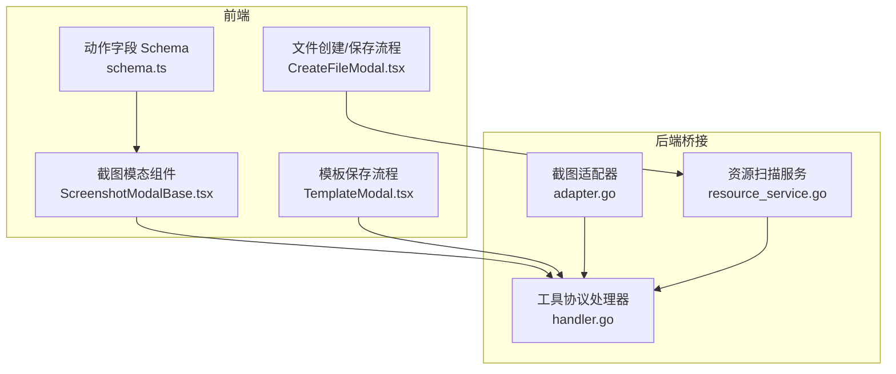
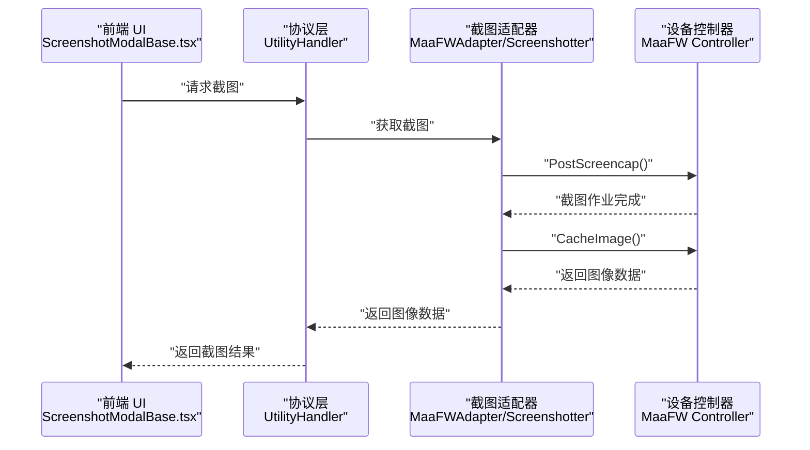
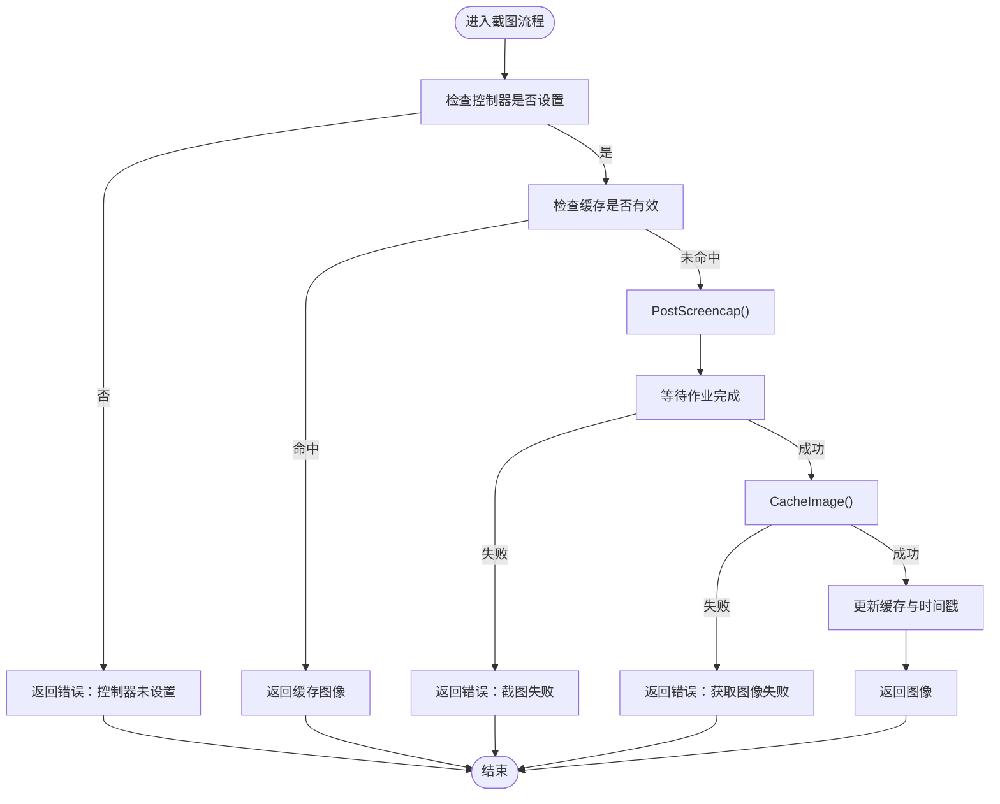
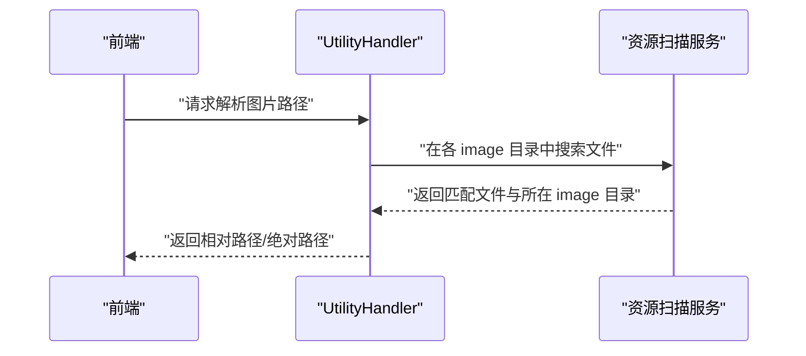
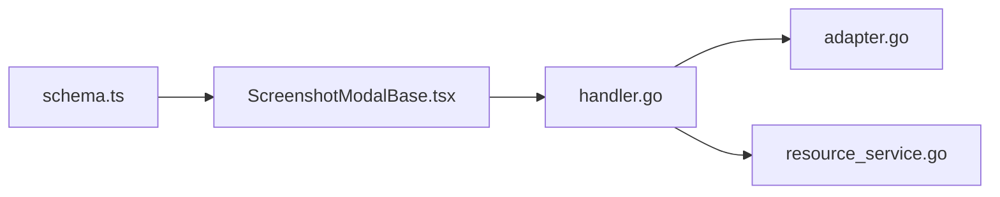

# 屏幕截图动作

<cite>
**本文档引用的文件**
- [schema.ts](file://src/core/fields/action/schema.ts)
- [ScreenshotModalBase.tsx](file://src/components/modals/ScreenshotModalBase.tsx)
- [adapter.go](file://LocalBridge/internal/mfw/adapter.go)
- [handler.go](file://LocalBridge/internal/protocol/utility/handler.go)
- [resource_service.go](file://LocalBridge/internal/service/resource/resource_service.go)
- [TemplateModal.tsx](file://src/components/modals/TemplateModal.tsx)
- [CreateFileModal.tsx](file://src/components/modals/CreateFileModal.tsx)
</cite>

## 目录
1. [简介](#简介)
2. [项目结构](#项目结构)
3. [核心组件](#核心组件)
4. [架构总览](#架构总览)
5. [详细组件分析](#详细组件分析)
6. [依赖分析](#依赖分析)
7. [性能考虑](#性能考虑)
8. [故障排查指南](#故障排查指南)
9. [结论](#结论)
10. [附录](#附录)

## 简介
本文件系统性阐述“屏幕截图动作”的配置、执行与存储策略，覆盖以下关键主题：
- 截图功能配置：文件名、格式与质量参数
- 图像格式选择与对比：PNG、JPEG、WebP 的适用场景与权衡
- 截图保存路径与命名规则
- 截图执行时机、并发控制与磁盘空间管理最佳实践

## 项目结构
围绕屏幕截图动作，涉及前端可视化交互、后端截图适配与协议处理、资源扫描与路径解析等模块。下图展示与截图动作相关的关键文件与职责边界。

图表来源
- [schema.ts:244-264](file://src/core/fields/action/schema.ts#L244-L264)
- [ScreenshotModalBase.tsx:124-169](file://src/components/modals/ScreenshotModalBase.tsx#L124-L169)
- [adapter.go:648-656](file://LocalBridge/internal/mfw/adapter.go#L648-L656)
- [handler.go:452-514](file://LocalBridge/internal/protocol/utility/handler.go#L452-L514)
- [resource_service.go:14-46](file://LocalBridge/internal/service/resource/resource_service.go#L14-L46)

章节来源
- [schema.ts:244-264](file://src/core/fields/action/schema.ts#L244-L264)
- [ScreenshotModalBase.tsx:124-169](file://src/components/modals/ScreenshotModalBase.tsx#L124-L169)
- [adapter.go:648-656](file://LocalBridge/internal/mfw/adapter.go#L648-L656)
- [handler.go:452-514](file://LocalBridge/internal/protocol/utility/handler.go#L452-L514)
- [resource_service.go:14-46](file://LocalBridge/internal/service/resource/resource_service.go#L14-L46)

## 核心组件
- 动作字段 Schema：定义截图动作的参数键、默认值与描述，包括文件名、格式与质量。
- 截图适配器：封装底层控制器截图能力，提供缓存与 Base64 输出。
- 工具协议处理器：接收前端请求，执行截图并返回结果；支持路径解析与日志打开等辅助功能。
- 资源扫描服务：扫描资源包内的 image 目录，提供图片路径解析与相对路径计算。
- 前端截图模态：提供实时预览、缩放与确认操作，触发后端截图并回传。

章节来源
- [schema.ts:244-264](file://src/core/fields/action/schema.ts#L244-L264)
- [adapter.go:724-823](file://LocalBridge/internal/mfw/adapter.go#L724-L823)
- [handler.go:452-514](file://LocalBridge/internal/protocol/utility/handler.go#L452-L514)
- [resource_service.go:14-46](file://LocalBridge/internal/service/resource/resource_service.go#L14-L46)
- [ScreenshotModalBase.tsx:124-169](file://src/components/modals/ScreenshotModalBase.tsx#L124-L169)

## 架构总览
下图展示从前端触发截图到后端执行与返回的完整链路。

图表来源
- [ScreenshotModalBase.tsx:124-169](file://src/components/modals/ScreenshotModalBase.tsx#L124-L169)
- [handler.go:134-146](file://LocalBridge/internal/protocol/utility/handler.go#L134-L146)
- [adapter.go:755-790](file://LocalBridge/internal/mfw/adapter.go#L755-L790)

## 详细组件分析

### 截图动作配置与参数
- 文件名（filename）：截图保存的文件名（不含扩展名）。可选，默认使用“时间戳_节点名”格式。
- 图像格式（format）：可选值为 png、jpg、jpeg。默认 png（无损）。
- 图像质量（quality）：0-100，仅对 jpg/jpeg 有效。默认 80。png 格式始终为无损压缩，该字段无效。

章节来源
- [schema.ts:244-264](file://src/core/fields/action/schema.ts#L244-L264)

### 截图执行与缓存机制
- 前端通过协议请求截图，后端截图适配器封装控制器调用，执行截图并缓存最近一次图像。
- 默认缓存有效期为 100ms，避免短时间内重复截图带来的性能损耗。
- 提供强制截图接口以绕过缓存。

图表来源
- [adapter.go:755-790](file://LocalBridge/internal/mfw/adapter.go#L755-L790)
- [adapter.go:792-807](file://LocalBridge/internal/mfw/adapter.go#L792-L807)

章节来源
- [adapter.go:724-823](file://LocalBridge/internal/mfw/adapter.go#L724-L823)

### 前端截图预览与交互
- 打开模态时自动请求截图，并监听后端返回的截图结果。
- 支持缩放、平移与确认保存等操作。
- 截图以 Base64 形式传输，前端以 Image 元素加载并渲染。

章节来源
- [ScreenshotModalBase.tsx:124-169](file://src/components/modals/ScreenshotModalBase.tsx#L124-L169)
- [ScreenshotModalBase.tsx:171-188](file://src/components/modals/ScreenshotModalBase.tsx#L171-L188)

### 图像格式选择与质量控制
- PNG：无损压缩，适合需要保留细节的场景（如模板、标注）。体积通常较大。
- JPEG/JPG：有损压缩，适合照片或大图场景。可通过 quality 参数在 0-100 间调节，数值越大质量越高、体积越大。
- WebP：现代格式，通常在同等质量下体积更小，兼容性需结合目标平台评估。

说明：仓库中资源扫描服务支持多种扩展名（含 WebP），但动作字段 Schema 仅暴露 png、jpg、jpeg 三种格式选项。因此在“屏幕截图动作”中，推荐优先使用 png（无损）或 jpg（有损）。

章节来源
- [schema.ts:251-256](file://src/core/fields/action/schema.ts#L251-L256)
- [resource_service.go:231-238](file://LocalBridge/internal/service/resource/resource_service.go#L231-L238)

### 截图保存路径、命名规则与存储策略
- 文件名规则：若未显式指定 filename，则采用“时间戳_节点名”格式（由上层逻辑生成，见动作字段描述）。
- 保存目录：模板保存流程使用浏览器文件系统 API（如 showSaveFilePicker）或传统下载方式，允许用户选择保存目录与文件名。
- 路径解析：当需要将保存的图片路径转换为资源包内的相对路径时，工具协议处理器会在所有 image 目录中搜索匹配文件，返回相对路径与绝对路径，便于在工程内引用。

图表来源
- [handler.go:452-514](file://LocalBridge/internal/protocol/utility/handler.go#L452-L514)
- [resource_service.go:14-46](file://LocalBridge/internal/service/resource/resource_service.go#L14-L46)

章节来源
- [TemplateModal.tsx:442-485](file://src/components/modals/TemplateModal.tsx#L442-L485)
- [handler.go:452-514](file://LocalBridge/internal/protocol/utility/handler.go#L452-L514)
- [resource_service.go:14-46](file://LocalBridge/internal/service/resource/resource_service.go#L14-L46)

### 截图执行时机与并发控制
- 执行时机：前端打开截图模态时自动请求；也可通过“重新截图”按钮手动触发。
- 并发控制：截图适配器内部使用互斥锁保护状态；默认缓存 100ms，避免频繁截图导致性能抖动。
- 强制刷新：提供强制截图接口以清除缓存并立即获取最新图像。

章节来源
- [ScreenshotModalBase.tsx:134-145](file://src/components/modals/ScreenshotModalBase.tsx#L134-L145)
- [adapter.go:748-753](file://LocalBridge/internal/mfw/adapter.go#L748-L753)
- [adapter.go:809-816](file://LocalBridge/internal/mfw/adapter.go#L809-L816)

### 磁盘空间管理与最佳实践
- 优先使用 png 以减少二次压缩损失，适用于模板与标注；对大图或照片场景可使用 jpg 并根据质量需求调整 quality。
- 使用资源扫描服务与路径解析功能，将图片保存在资源包的 image 目录下，便于版本管理与跨项目复用。
- 控制截图频率，利用默认缓存策略降低 I/O 压力；必要时通过强制截图接口确保数据新鲜度。

章节来源
- [schema.ts:251-264](file://src/core/fields/action/schema.ts#L251-L264)
- [resource_service.go:14-46](file://LocalBridge/internal/service/resource/resource_service.go#L14-L46)
- [adapter.go:748-753](file://LocalBridge/internal/mfw/adapter.go#L748-L753)

## 依赖分析
- 前端动作字段 Schema 与截图模态组件共同定义了截图动作的参数与交互。
- 工具协议处理器依赖截图适配器执行截图，并通过资源扫描服务实现路径解析。
- 资源扫描服务扫描资源包内的 image 目录，为路径解析提供基础。

图表来源
- [schema.ts:244-264](file://src/core/fields/action/schema.ts#L244-L264)
- [ScreenshotModalBase.tsx:124-169](file://src/components/modals/ScreenshotModalBase.tsx#L124-L169)
- [handler.go:452-514](file://LocalBridge/internal/protocol/utility/handler.go#L452-L514)
- [adapter.go:648-656](file://LocalBridge/internal/mfw/adapter.go#L648-L656)
- [resource_service.go:14-46](file://LocalBridge/internal/service/resource/resource_service.go#L14-L46)

章节来源
- [schema.ts:244-264](file://src/core/fields/action/schema.ts#L244-L264)
- [ScreenshotModalBase.tsx:124-169](file://src/components/modals/ScreenshotModalBase.tsx#L124-L169)
- [handler.go:452-514](file://LocalBridge/internal/protocol/utility/handler.go#L452-L514)
- [adapter.go:648-656](file://LocalBridge/internal/mfw/adapter.go#L648-L656)
- [resource_service.go:14-46](file://LocalBridge/internal/service/resource/resource_service.go#L14-L46)

## 性能考虑
- 缓存策略：默认 100ms 缓存可显著降低重复截图开销，适合 UI 预览与频繁交互场景。
- 质量与体积平衡：在保证视觉质量的前提下，优先选择较小的 quality 值；对模板类图像建议使用 png 以避免有损压缩。
- I/O 优化：批量保存或导出时合并请求，避免频繁写盘；模板保存流程支持浏览器文件系统 API，减少中间层拷贝。

## 故障排查指南
- 控制器未设置：检查控制器连接状态与截图适配器是否正确绑定。
- 截图失败：查看作业状态与错误信息，确认设备权限与驱动状态。
- 获取图像失败：确认 CacheImage 接口可用性与内存占用情况。
- 路径解析失败：确认文件名与资源包内 image 目录结构一致，或手动输入绝对路径。

章节来源
- [adapter.go:755-790](file://LocalBridge/internal/mfw/adapter.go#L755-L790)
- [handler.go:452-514](file://LocalBridge/internal/protocol/utility/handler.go#L452-L514)

## 结论
“屏幕截图动作”在本项目中通过前端参数配置、后端适配器与协议处理形成闭环。合理选择图像格式与质量、遵循命名与路径规范、利用缓存与并发控制策略，可在保证质量的同时提升性能与可维护性。建议在模板与标注场景优先使用 png，在大图场景使用 jpg 并适度调整质量；通过资源扫描与路径解析实现工程内统一管理。

## 附录
- 动作字段 Schema 中的截图相关参数键与默认值
- 前端截图模态的交互与生命周期
- 工具协议处理器的截图与路径解析流程
- 资源扫描服务的目录扫描与路径计算