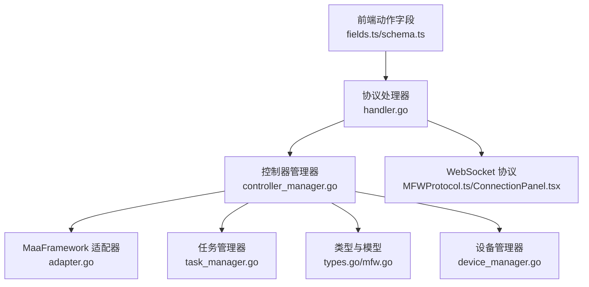
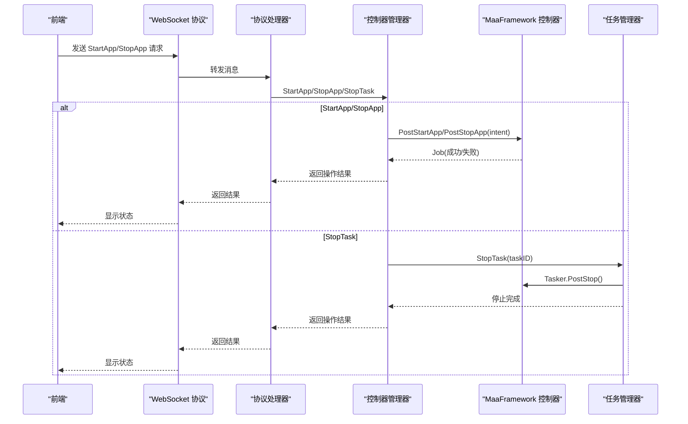
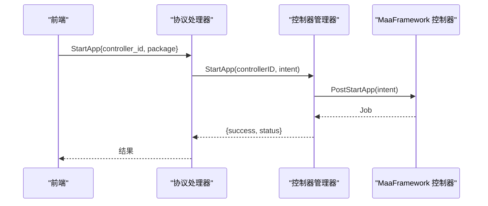
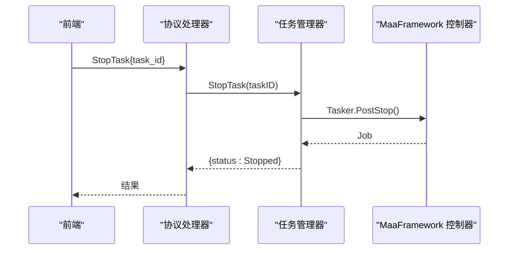
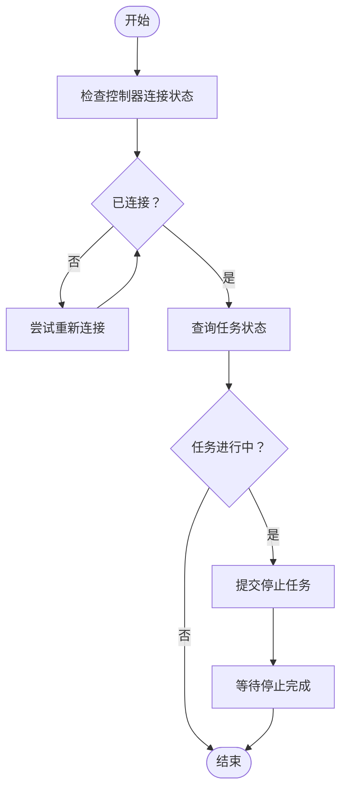
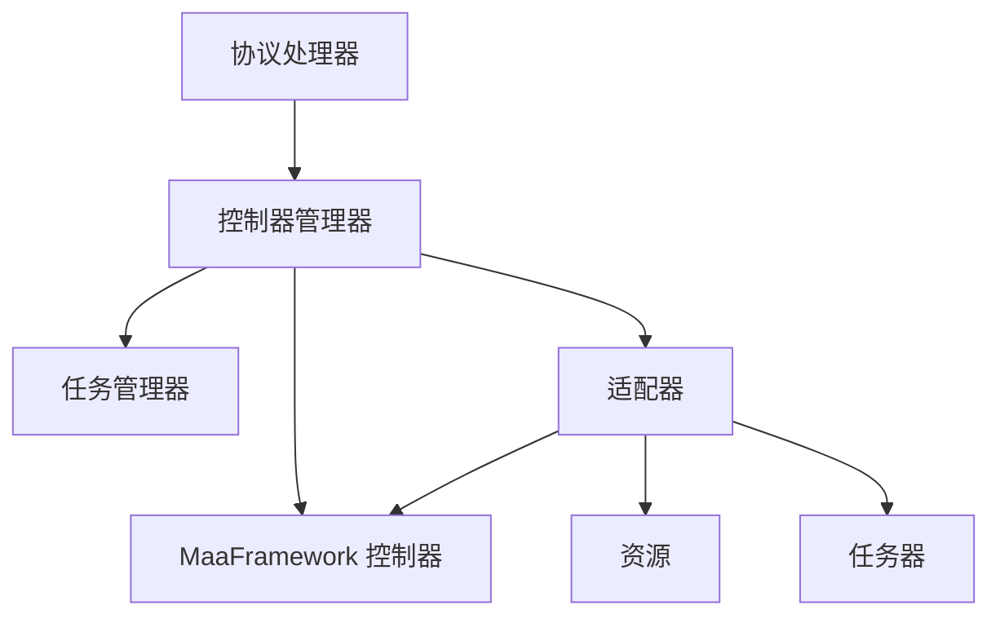

# 应用控制动作

<cite>
**本文档引用的文件**
- [controller_manager.go](file://LocalBridge/internal/mfw/controller_manager.go)
- [adapter.go](file://LocalBridge/internal/mfw/adapter.go)
- [task_manager.go](file://LocalBridge/internal/mfw/task_manager.go)
- [types.go](file://LocalBridge/internal/mfw/types.go)
- [mfw.go](file://LocalBridge/pkg/models/mfw.go)
- [handler.go](file://LocalBridge/internal/protocol/mfw/handler.go)
- [fields.ts](file://src/core/fields/action/fields.ts)
- [schema.ts](file://src/core/fields/action/schema.ts)
- [ConnectionPanel.tsx](file://src/components/panels/main/ConnectionPanel.tsx)
- [MFWProtocol.ts](file://src/services/protocols/MFWProtocol.ts)
- [device_manager.go](file://LocalBridge/internal/mfw/device_manager.go)
- [default_pipeline.json](file://LocalBridge/test-json/base/default_pipeline.json)
- [debug_service_v2.go](file://LocalBridge/internal/mfw/debug_service_v2.go)
</cite>

## 目录
1. [简介](#简介)
2. [项目结构](#项目结构)
3. [核心组件](#核心组件)
4. [架构总览](#架构总览)
5. [详细组件分析](#详细组件分析)
6. [依赖关系分析](#依赖关系分析)
7. [性能考量](#性能考量)
8. [故障排查指南](#故障排查指南)
9. [结论](#结论)
10. [附录](#附录)

## 简介
本文件系统性阐述应用控制动作（StartApp、StopApp、StopTask）的设计与实现，涵盖包名识别机制、应用启动参数、进程管理、状态检查、超时处理与异常恢复、跨平台兼容性以及生命周期与安全终止策略。内容基于仓库中的本地桥接层（LocalBridge）与前端动作字段定义，确保技术深度与可操作性兼顾。

## 项目结构
应用控制动作贯穿前端动作字段定义、协议层、本地桥接层与底层框架（MaaFramework）：

- 前端动作字段与参数定义：位于 src/core/fields/action 下，描述 StartApp/StopApp/StopTask 的参数与行为。
- 协议层：LocalBridge/internal/protocol/mfw 定义了与前端交互的请求/响应模型与处理器。
- 本地桥接层：LocalBridge/internal/mfw 实现控制器管理、任务管理、适配器封装与设备管理。
- 底层框架：通过 MaaFramework Go SDK 提供跨平台控制器能力（ADB、Win32、PlayCover 等）。

图表来源
- [fields.ts:112-123](file://src/core/fields/action/fields.ts#L112-L123)
- [schema.ts:209-242](file://src/core/fields/action/schema.ts#L209-L242)
- [handler.go:448-486](file://LocalBridge/internal/protocol/mfw/handler.go#L448-L486)
- [controller_manager.go:444-514](file://LocalBridge/internal/mfw/controller_manager.go#L444-L514)
- [adapter.go:25-50](file://LocalBridge/internal/mfw/adapter.go#L25-L50)
- [task_manager.go:12-22](file://LocalBridge/internal/mfw/task_manager.go#L12-L22)
- [types.go:41-49](file://LocalBridge/internal/mfw/types.go#L41-L49)
- [mfw.go:72-82](file://LocalBridge/pkg/models/mfw.go#L72-L82)
- [device_manager.go:27-60](file://LocalBridge/internal/mfw/device_manager.go#L27-L60)

章节来源
- [fields.ts:112-123](file://src/core/fields/action/fields.ts#L112-L123)
- [schema.ts:209-242](file://src/core/fields/action/schema.ts#L209-L242)
- [handler.go:448-486](file://LocalBridge/internal/protocol/mfw/handler.go#L448-L486)
- [controller_manager.go:444-514](file://LocalBridge/internal/mfw/controller_manager.go#L444-L514)
- [adapter.go:25-50](file://LocalBridge/internal/mfw/adapter.go#L25-L50)
- [task_manager.go:12-22](file://LocalBridge/internal/mfw/task_manager.go#L12-L22)
- [types.go:41-49](file://LocalBridge/internal/mfw/types.go#L41-L49)
- [mfw.go:72-82](file://LocalBridge/pkg/models/mfw.go#L72-L82)
- [device_manager.go:27-60](file://LocalBridge/internal/mfw/device_manager.go#L27-L60)

## 核心组件
- 控制器管理器（ControllerManager）：负责创建、连接、操作控制器，实现 StartApp/StopApp/StopTask 等动作。
- 适配器（MaaFWAdapter）：封装 MaaFramework 控制器、资源、任务器与 Agent 的生命周期与事件。
- 任务管理器（TaskManager）：管理任务提交、状态查询与停止。
- 类型与模型（types.go/mfw.go）：定义控制器信息、操作类型、请求/响应结构。
- 协议处理器（handler.go）：解析前端请求，调用控制器管理器执行动作。
- 前端动作字段（fields.ts/schema.ts）：定义 StartApp/StopApp/StopTask 的参数与描述。

章节来源
- [controller_manager.go:21-31](file://LocalBridge/internal/mfw/controller_manager.go#L21-L31)
- [adapter.go:25-50](file://LocalBridge/internal/mfw/adapter.go#L25-L50)
- [task_manager.go:12-22](file://LocalBridge/internal/mfw/task_manager.go#L12-L22)
- [types.go:93-123](file://LocalBridge/internal/mfw/types.go#L93-L123)
- [mfw.go:72-82](file://LocalBridge/pkg/models/mfw.go#L72-L82)
- [handler.go:448-486](file://LocalBridge/internal/protocol/mfw/handler.go#L448-L486)
- [fields.ts:112-123](file://src/core/fields/action/fields.ts#L112-L123)
- [schema.ts:209-242](file://src/core/fields/action/schema.ts#L209-L242)

## 架构总览
应用控制动作的端到端流程如下：

图表来源
- [handler.go:448-486](file://LocalBridge/internal/protocol/mfw/handler.go#L448-L486)
- [controller_manager.go:444-514](file://LocalBridge/internal/mfw/controller_manager.go#L444-L514)
- [task_manager.go:69-90](file://LocalBridge/internal/mfw/task_manager.go#L69-L90)
- [adapter.go:427-443](file://LocalBridge/internal/mfw/adapter.go#L427-L443)

## 详细组件分析

### StartApp 动作
- 参数与用途
  - package：应用包名（Android）或目标标识（其他平台），用于启动对应应用。
- 执行流程
  - 协议处理器接收请求，提取 controller_id 与 package。
  - 调用控制器管理器的 StartApp，内部通过控制器 PostStartApp(intent) 提交异步任务。
  - 等待 Job 完成并返回结果。
- 包名识别机制
  - 通过 intent 字符串传递包名；具体解析与启动逻辑由底层 MaaFramework 控制器实现。
- 超时与异常
  - 控制器连接阶段存在超时保护；应用启动动作本身通过 Job 等待完成，未见显式启动超时参数。
- 平台差异
  - Android：intent 通常为包名；PlayCover/Win32 等平台需确认对应控制器支持的启动方式。

图表来源
- [handler.go:448-466](file://LocalBridge/internal/protocol/mfw/handler.go#L448-L466)
- [controller_manager.go:444-478](file://LocalBridge/internal/mfw/controller_manager.go#L444-L478)
- [fields.ts:112-115](file://src/core/fields/action/fields.ts#L112-L115)
- [schema.ts:209-242](file://src/core/fields/action/schema.ts#L209-L242)

章节来源
- [handler.go:448-466](file://LocalBridge/internal/protocol/mfw/handler.go#L448-L466)
- [controller_manager.go:444-478](file://LocalBridge/internal/mfw/controller_manager.go#L444-L478)
- [fields.ts:112-115](file://src/core/fields/action/fields.ts#L112-L115)
- [schema.ts:209-242](file://src/core/fields/action/schema.ts#L209-L242)

### StopApp 动作
- 参数与用途
  - package：目标应用包名，用于停止对应应用。
- 执行流程
  - 协议处理器接收请求，调用控制器管理器的 StopApp。
  - 通过控制器 PostStopApp(intent) 提交任务并等待完成。
- 平台差异
  - Android：通过包名停止应用；PlayCover/Win32 需确认控制器支持情况。

图表来源
- [handler.go:468-486](file://LocalBridge/internal/protocol/mfw/handler.go#L468-L486)
- [controller_manager.go:480-514](file://LocalBridge/internal/mfw/controller_manager.go#L480-L514)

章节来源
- [handler.go:468-486](file://LocalBridge/internal/protocol/mfw/handler.go#L468-L486)
- [controller_manager.go:480-514](file://LocalBridge/internal/mfw/controller_manager.go#L480-L514)

### StopTask 动作
- 参数与用途
  - 无参数，用于停止当前任务链（单个任务链）。
- 执行流程
  - 协议处理器接收请求，调用任务管理器 StopTask。
  - 通过 Tasker.PostStop() 提交停止任务，并等待完成。
- 生命周期与安全机制
  - 任务停止后更新状态为 Stopped，避免资源泄漏。
  - 调试会话中也提供 Stop 方法，用于停止调试流程并断开 Agent。

图表来源
- [handler.go:744-754](file://LocalBridge/internal/protocol/mfw/handler.go#L744-L754)
- [task_manager.go:69-90](file://LocalBridge/internal/mfw/task_manager.go#L69-L90)
- [debug_service_v2.go:279-299](file://LocalBridge/internal/mfw/debug_service_v2.go#L279-L299)

章节来源
- [handler.go:744-754](file://LocalBridge/internal/protocol/mfw/handler.go#L744-L754)
- [task_manager.go:69-90](file://LocalBridge/internal/mfw/task_manager.go#L69-L90)
- [debug_service_v2.go:279-299](file://LocalBridge/internal/mfw/debug_service_v2.go#L279-L299)

### 包名识别机制与应用启动参数
- 包名识别
  - 前端字段定义 package 为应用包名；协议层将 package 映射为 intent 字符串传递给控制器。
- 启动参数
  - 通过 intent 字符串携带包名；如需更复杂的启动参数，可在上层业务中构造合适的 intent。
- 平台支持
  - ADB：通过包名启动 Android 应用。
  - PlayCover：在 macOS 上运行 iOS 应用，需确认控制器支持。
  - Win32：针对窗口句柄的控制器，启动方式与 Android 不同。

章节来源
- [fields.ts:112-119](file://src/core/fields/action/fields.ts#L112-L119)
- [schema.ts:209-242](file://src/core/fields/action/schema.ts#L209-L242)
- [mfw.go:72-82](file://LocalBridge/pkg/models/mfw.go#L72-L82)
- [device_manager.go:27-60](file://LocalBridge/internal/mfw/device_manager.go#L27-L60)

### 应用状态检查与生命周期管理
- 状态检查
  - 控制器连接状态：通过 GetControllerStatus 返回 connected 与 uuid。
  - 任务状态：通过 TaskManager.GetTaskStatus 查询任务状态。
- 生命周期管理
  - 控制器：创建后连接，非活跃超时自动清理，断开时销毁。
  - 任务：提交后等待完成，支持停止与清空。
  - 调试会话：运行中可停止并断开 Agent。

图表来源
- [controller_manager.go:587-598](file://LocalBridge/internal/mfw/controller_manager.go#L587-L598)
- [task_manager.go:55-66](file://LocalBridge/internal/mfw/task_manager.go#L55-L66)
- [debug_service_v2.go:279-299](file://LocalBridge/internal/mfw/debug_service_v2.go#L279-L299)

章节来源
- [controller_manager.go:587-598](file://LocalBridge/internal/mfw/controller_manager.go#L587-L598)
- [task_manager.go:55-66](file://LocalBridge/internal/mfw/task_manager.go#L55-L66)
- [debug_service_v2.go:279-299](file://LocalBridge/internal/mfw/debug_service_v2.go#L279-L299)

### 启动超时处理与异常恢复
- 控制器连接超时
  - 连接阶段使用 select + 10 秒超时，超时则判定连接失败。
- 应用启动等待
  - 通过 Job.Wait() 等待完成；未见显式启动超时参数。
- 异常恢复
  - 失败时返回统一错误码与错误信息；调试会话中记录错误事件并更新状态。

章节来源
- [controller_manager.go:271-288](file://LocalBridge/internal/mfw/controller_manager.go#L271-L288)
- [handler.go:448-466](file://LocalBridge/internal/protocol/mfw/handler.go#L448-L466)

### 跨平台兼容性与平台差异
- Android（ADB）
  - 通过包名启动/停止应用；支持多种截图与输入方法。
- Windows（Win32）
  - 通过窗口句柄控制；支持多种截图与输入方法。
- macOS（PlayCover）
  - 通过 PlayCover 控制器运行 iOS 应用；需确认控制器支持。
- 平台差异总结
  - 启动方式：Android 使用包名，Win32 使用窗口句柄，PlayCover 使用设备地址/UUID。
  - 截图与输入方法：各平台提供不同的方法集合，需根据设备能力选择。

章节来源
- [device_manager.go:27-95](file://LocalBridge/internal/mfw/device_manager.go#L27-L95)
- [ConnectionPanel.tsx:256-573](file://src/components/panels/main/ConnectionPanel.tsx#L256-L573)
- [MFWProtocol.ts:329-384](file://src/services/protocols/MFWProtocol.ts#L329-L384)
- [controller_manager.go:164-192](file://LocalBridge/internal/mfw/controller_manager.go#L164-L192)

## 依赖关系分析
- 组件耦合
  - 协议处理器依赖控制器管理器；控制器管理器依赖 MaaFramework 控制器与任务管理器。
  - 适配器封装控制器、资源与任务器，降低上层复杂度。
- 外部依赖
  - MaaFramework Go SDK 提供跨平台控制器能力。
  - WebSocket 协议用于前后端通信。

图表来源
- [handler.go:448-486](file://LocalBridge/internal/protocol/mfw/handler.go#L448-L486)
- [controller_manager.go:444-514](file://LocalBridge/internal/mfw/controller_manager.go#L444-L514)
- [adapter.go:25-50](file://LocalBridge/internal/mfw/adapter.go#L25-L50)
- [task_manager.go:12-22](file://LocalBridge/internal/mfw/task_manager.go#L12-L22)

章节来源
- [handler.go:448-486](file://LocalBridge/internal/protocol/mfw/handler.go#L448-L486)
- [controller_manager.go:444-514](file://LocalBridge/internal/mfw/controller_manager.go#L444-L514)
- [adapter.go:25-50](file://LocalBridge/internal/mfw/adapter.go#L25-L50)
- [task_manager.go:12-22](file://LocalBridge/internal/mfw/task_manager.go#L12-L22)

## 性能考量
- 截图缓存
  - 适配器内置截图缓存器，支持 TTL 控制，减少重复截图开销。
- 连接超时
  - 控制器连接阶段设置超时，避免长时间阻塞。
- 任务停止
  - 通过 Tasker.PostStop() 异步停止任务，及时释放资源。

章节来源
- [adapter.go:724-753](file://LocalBridge/internal/mfw/adapter.go#L724-L753)
- [controller_manager.go:271-288](file://LocalBridge/internal/mfw/controller_manager.go#L271-L288)
- [task_manager.go:78-84](file://LocalBridge/internal/mfw/task_manager.go#L78-L84)

## 故障排查指南
- 启动/停止应用失败
  - 检查控制器连接状态与 UUID；确认包名正确。
  - 查看协议处理器返回的错误码与错误信息。
- 任务无法停止
  - 确认 task_id 正确；检查任务状态；必要时调用 StopTask。
- 调试会话异常
  - 检查会话状态与最后错误；必要时销毁会话并重建。

章节来源
- [controller_manager.go:587-598](file://LocalBridge/internal/mfw/controller_manager.go#L587-L598)
- [handler.go:448-466](file://LocalBridge/internal/protocol/mfw/handler.go#L448-L466)
- [task_manager.go:69-90](file://LocalBridge/internal/mfw/task_manager.go#L69-L90)
- [debug_service_v2.go:380-438](file://LocalBridge/internal/mfw/debug_service_v2.go#L380-L438)

## 结论
应用控制动作在本项目中通过清晰的分层设计实现：前端动作字段定义参数，协议层解析请求并路由至控制器管理器，底层通过 MaaFramework 控制器执行具体动作。StartApp/StopApp/StopTask 三类动作分别面向应用启动/停止与任务停止，具备状态检查、超时处理与异常恢复能力。跨平台支持通过不同控制器类型实现，平台差异体现在启动方式与可用方法集。建议在实际使用中结合设备能力选择合适的方法，并通过状态检查与超时机制保障稳定性。

## 附录
- 默认管道配置
  - 默认超时与延迟参数可在测试资源中查看，便于理解全局超时策略。

章节来源
- [default_pipeline.json:1-6](file://LocalBridge/test-json/base/default_pipeline.json#L1-L6)