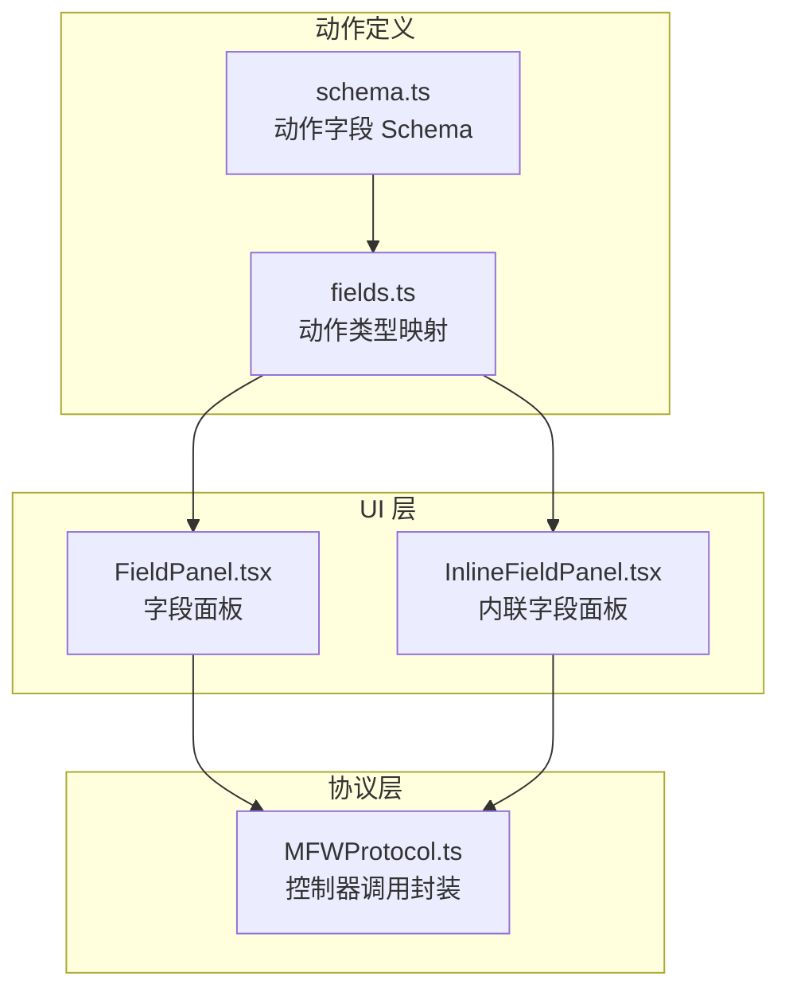
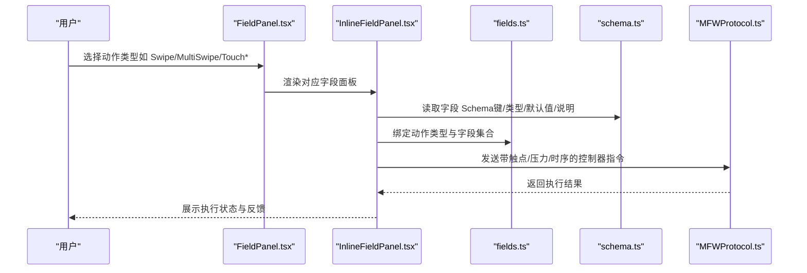
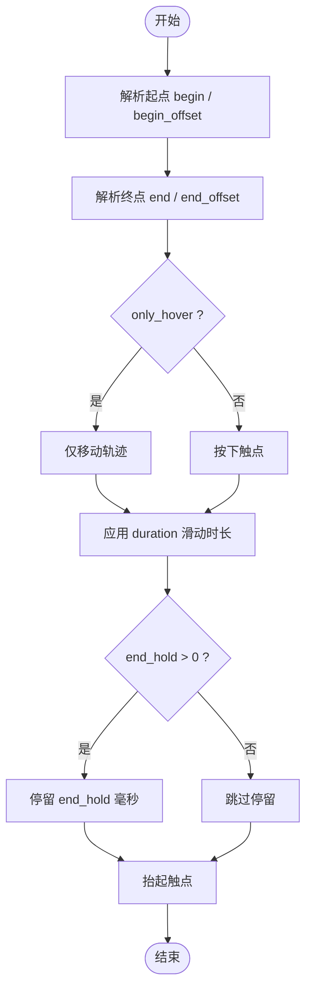
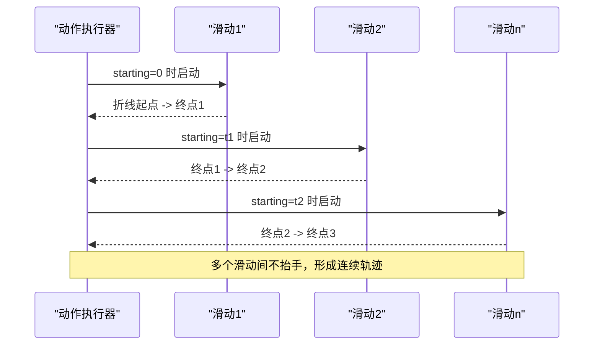
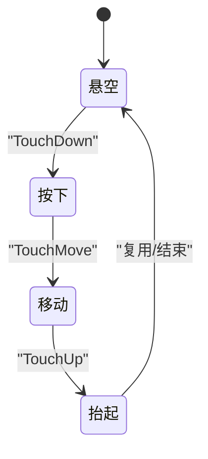
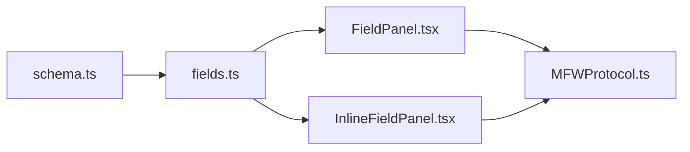

# 手势滑动动作

<cite>
**本文引用的文件**
- [schema.ts](file://src/core/fields/action/schema.ts)
- [fields.ts](file://src/core/fields/action/fields.ts)
- [MFWProtocol.ts](file://src/services/protocols/MFWProtocol.ts)
- [FieldPanel.tsx](file://src/components/panels/main/FieldPanel.tsx)
- [InlineFieldPanel.tsx](file://src/components/panels/main/InlineFieldPanel.tsx)
</cite>

## 目录
1. [简介](#简介)
2. [项目结构](#项目结构)
3. [核心组件](#核心组件)
4. [架构总览](#架构总览)
5. [详细组件分析](#详细组件分析)
6. [依赖关系分析](#依赖关系分析)
7. [性能考虑](#性能考虑)
8. [故障排查指南](#故障排查指南)
9. [结论](#结论)
10. [附录](#附录)

## 简介
本文件系统化梳理“手势滑动动作”在本项目中的配置与使用方式，覆盖以下动作类型：
- 单指线性滑动：Swipe
- 多指线性滑动：MultiSwipe
- 触控点按下：TouchDown
- 触控点移动：TouchMove
- 触控点抬起：TouchUp

重点说明：
- 起点/终点坐标来源与偏移规则
- 滑动持续时间、结束保持时间
- 悬浮模式（仅移动无按下/抬起）
- 多指滑动的实现原理与触点编号
- 压力控制与触控点管理
- 手势动画效果调节与性能优化建议
- 滑动轨迹的精确控制方法

## 项目结构
围绕“动作字段与动作类型”的组织方式如下：
- 动作字段定义与描述：位于动作字段 Schema 中，统一声明每个动作的参数键、类型、默认值与说明
- 动作类型与字段映射：位于动作类型定义中，将具体动作名称与字段集合关联
- 协议层：通过 MFW 协议封装底层控制器调用（如带压力的滑动）
- UI 层：FieldPanel 与 InlineFieldPanel 负责渲染与交互，承载动作参数的可视化编辑

图表来源
- [schema.ts:1-299](file://src/core/fields/action/schema.ts#L1-L299)
- [fields.ts:1-149](file://src/core/fields/action/fields.ts#L1-L149)
- [MFWProtocol.ts:700-774](file://src/services/protocols/MFWProtocol.ts#L700-L774)
- [FieldPanel.tsx:305-323](file://src/components/panels/main/FieldPanel.tsx#L305-L323)
- [InlineFieldPanel.tsx:42-76](file://src/components/panels/main/InlineFieldPanel.tsx#L42-L76)

章节来源
- [schema.ts:1-299](file://src/core/fields/action/schema.ts#L1-L299)
- [fields.ts:1-149](file://src/core/fields/action/fields.ts#L1-L149)

## 核心组件
本节聚焦“滑动相关动作”的字段定义与行为要点。

- Swipe（单指线性滑动）
  - 起点/终点：支持固定坐标、区域随机点、引用识别结果、字符串锚点等
  - 偏移：begin_offset、end_offset 分别在起点/终点基础上叠加
  - 持续时间：duration（毫秒）
  - 结束保持：end_hold（毫秒）
  - 模式：only_hover（仅悬停移动，无按下/抬起）
  - 触点与压力：contact、pressure
- MultiSwipe（多指线性滑动）
  - swipes：滑动序列数组，每个元素含起点/终点、持续时间、结束保持、触点编号等
  - starting：在动作开始后的指定时刻启动该滑动（毫秒）
  - 路径：v4.5+ 支持在 end 中使用列表，形成一次“不抬手”的折线滑动
  - 触点编号：contact=0 时，使用该滑动在数组中的索引作为触点编号
- TouchDown/TouchMove/TouchUp
  - 三者构成触控点的“按下-移动-抬起”完整生命周期
  - 支持 contact、pressure 等触控参数
  - TouchMove 字段含义与 TouchDown 一致，用于更新触点位置

章节来源
- [schema.ts:47-138](file://src/core/fields/action/schema.ts#L47-L138)
- [fields.ts:30-92](file://src/core/fields/action/fields.ts#L30-L92)

## 架构总览
从“字段定义 -> 类型映射 -> 协议调用 -> UI 渲染”的整体流程如下：

图表来源
- [fields.ts:1-149](file://src/core/fields/action/fields.ts#L1-L149)
- [schema.ts:1-299](file://src/core/fields/action/schema.ts#L1-L299)
- [MFWProtocol.ts:700-774](file://src/services/protocols/MFWProtocol.ts#L700-L774)
- [FieldPanel.tsx:305-323](file://src/components/panels/main/FieldPanel.tsx#L305-L323)
- [InlineFieldPanel.tsx:42-76](file://src/components/panels/main/InlineFieldPanel.tsx#L42-L76)

## 详细组件分析

### Swipe（单指滑动）参数详解
- 起点/终点坐标来源
  - 支持：固定点 [x,y]、区域 [x,y,w,h]（矩形内按概率分布采样）、引用识别结果（true 或节点名）、锚点（v5.9+）
  - 偏移：begin_offset、end_offset 以 [dx, dy, dw, dh] 形式在基础坐标上叠加
- 持续时间与结束保持
  - duration：滑动总时长（毫秒）
  - end_hold：到达终点后额外停留再抬起（毫秒）
- 模式与触控
  - only_hover：仅移动，不产生按下/抬起
  - contact：触点编号（Adb：手指编号；Win32：鼠标按键编号）
  - pressure：触控压力（范围取决于控制器实现）

图表来源
- [schema.ts:47-102](file://src/core/fields/action/schema.ts#L47-L102)

章节来源
- [schema.ts:47-102](file://src/core/fields/action/schema.ts#L47-L102)

### MultiSwipe（多指滑动）参数详解
- swipes：滑动序列数组，元素包含：
  - begin / begin_offset：起点
  - end / end_offset：终点（v4.5+ 支持列表，形成连续折线）
  - duration / end_hold：时序控制
  - contact：触点编号（contact=0 时使用数组索引）
  - starting：在动作开始后的延迟启动（毫秒）
- 实现要点
  - 多个 end 之间不抬手，形成一次连续折线滑动
  - 起始时间由 starting 决定，数组元素顺序不影响执行顺序

图表来源
- [schema.ts:132-138](file://src/core/fields/action/schema.ts#L132-L138)

章节来源
- [schema.ts:132-138](file://src/core/fields/action/schema.ts#L132-L138)

### TouchDown/TouchMove/TouchUp（触控点生命周期）
- TouchDown：在指定位置“按下”触点，支持 contact、pressure
- TouchMove：更新触点位置（字段语义与 TouchDown 一致）
- TouchUp：抬起指定触点
- 适用场景：需要精细控制触控点位置与压力的复杂手势

图表来源
- [fields.ts:71-92](file://src/core/fields/action/fields.ts#L71-L92)
- [schema.ts:140-165](file://src/core/fields/action/schema.ts#L140-L165)

章节来源
- [fields.ts:71-92](file://src/core/fields/action/fields.ts#L71-L92)
- [schema.ts:140-165](file://src/core/fields/action/schema.ts#L140-L165)

### 坐标系统与多指滑动原理
- 坐标来源
  - 支持绝对坐标、区域采样、识别结果引用、锚点引用
  - 偏移以 [dx, dy, dw, dh] 形式叠加，便于微调
- 多指原理
  - 每个滑动元素绑定一个触点编号（contact）
  - MultiSwipe 中 contact=0 时，自动以元素索引作为触点编号，避免重复触点冲突
  - 多个滑动可并发或按 starting 时序启动，形成多指协同轨迹

章节来源
- [schema.ts:47-138](file://src/core/fields/action/schema.ts#L47-L138)

### 压力控制与触控点管理
- pressure：触控压力值（范围取决于控制器实现）
- contact：触点编号
  - Adb 控制器：0 表示第一根手指，1 表示第二根，依此类推
  - Win32 控制器：0 表示左键，1 表示右键，2 表示中键，3/4 表示 XBUTTON1/XBUTTON2
- 触控点管理建议
  - 多指场景优先显式设置 contact，避免使用默认索引导致的歧义
  - 对于 TouchDown/TouchMove/TouchUp，确保三者成对出现且顺序正确

章节来源
- [schema.ts:140-165](file://src/core/fields/action/schema.ts#L140-L165)

### 手势动画效果与轨迹控制
- 持续时间与结束保持
  - duration 控制滑动速度与平滑度
  - end_hold 可用于模拟“驻留”效果，提升识别稳定性
- 轨迹精确控制
  - 使用 end_offset 与 begin_offset 微调起点/终点
  - v4.5+ 的 end 列表支持折线路径，减少多次滑动的中断感
- 悬浮模式
  - only_hover 适合“拖拽预览”或“无按键事件”的场景，避免误触发

章节来源
- [schema.ts:47-102](file://src/core/fields/action/schema.ts#L47-L102)
- [schema.ts:132-138](file://src/core/fields/action/schema.ts#L132-L138)

## 依赖关系分析
- 字段定义依赖：各动作类型通过 fields.ts 将动作名称与字段集合绑定
- 协议依赖：MFWProtocol.ts 提供控制器调用封装（如 swipeV2、clickV2），UI 层通过协议发送指令
- UI 依赖：FieldPanel 与 InlineFieldPanel 负责渲染字段面板并收集用户输入

图表来源
- [schema.ts:1-299](file://src/core/fields/action/schema.ts#L1-L299)
- [fields.ts:1-149](file://src/core/fields/action/fields.ts#L1-L149)
- [FieldPanel.tsx:305-323](file://src/components/panels/main/FieldPanel.tsx#L305-L323)
- [InlineFieldPanel.tsx:42-76](file://src/components/panels/main/InlineFieldPanel.tsx#L42-L76)
- [MFWProtocol.ts:700-774](file://src/services/protocols/MFWProtocol.ts#L700-L774)

章节来源
- [fields.ts:1-149](file://src/core/fields/action/fields.ts#L1-L149)
- [schema.ts:1-299](file://src/core/fields/action/schema.ts#L1-L299)
- [MFWProtocol.ts:700-774](file://src/services/protocols/MFWProtocol.ts#L700-L774)
- [FieldPanel.tsx:305-323](file://src/components/panels/main/FieldPanel.tsx#L305-L323)
- [InlineFieldPanel.tsx:42-76](file://src/components/panels/main/InlineFieldPanel.tsx#L42-L76)

## 性能考虑
- 减少不必要的抬起/按下：在仅需移动的场景启用 only_hover，降低事件开销
- 合理设置 duration/end_hold：过短可能造成识别不稳定，过长影响整体流程效率
- 多指滑动的触点分配：优先显式设置 contact，避免默认索引带来的调度不确定性
- 折线路径：使用 v4.5+ 的 end 列表减少多次滑动的中断与抬手成本
- 压力与坐标采样：区域采样会引入随机性，必要时改为固定点以保证一致性

## 故障排查指南
- 坐标无效或未命中
  - 检查 begin/end 是否为 true/节点名/锚点，确认前置识别已成功
  - 使用 begin_offset/end_offset 微调
- 多指冲突
  - 显式设置 contact，避免 contact=0 导致的索引冲突
- 滑动不生效
  - 确认 only_hover 与控制器支持情况
  - 检查 duration/end_hold 是否过短
- 压力无效
  - 确认控制器支持 pressure 参数，并检查取值范围

章节来源
- [schema.ts:47-165](file://src/core/fields/action/schema.ts#L47-L165)
- [fields.ts:30-92](file://src/core/fields/action/fields.ts#L30-L92)

## 结论
本项目的“手势滑动动作”通过统一的字段 Schema 与动作类型映射，提供了从单指到多指、从简单滑动到触控点生命周期的完整能力。配合 MFW 协议层，可在不同控制器上稳定执行带压力与触点编号的手势。建议在实际使用中：
- 明确起点/终点与偏移策略
- 合理设置时序参数
- 在多指场景显式管理触点编号
- 利用折线路径与悬浮模式提升体验与性能

## 附录
- 动作类型与字段映射参考：见 [fields.ts:30-92](file://src/core/fields/action/fields.ts#L30-L92)
- 字段定义与说明参考：见 [schema.ts:47-165](file://src/core/fields/action/schema.ts#L47-L165)
- 协议调用封装参考：见 [MFWProtocol.ts:700-774](file://src/services/protocols/MFWProtocol.ts#L700-L774)
- UI 面板渲染参考：见 [FieldPanel.tsx:305-323](file://src/components/panels/main/FieldPanel.tsx#L305-L323)、[InlineFieldPanel.tsx:42-76](file://src/components/panels/main/InlineFieldPanel.tsx#L42-L76)