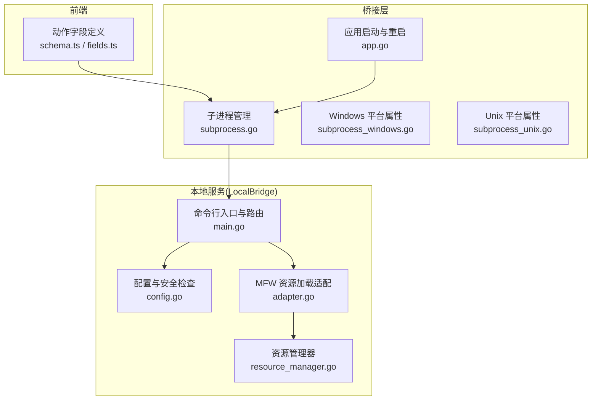
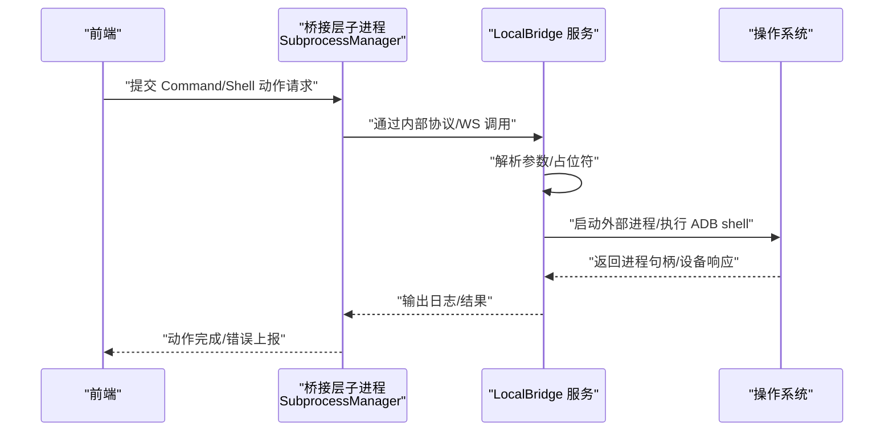
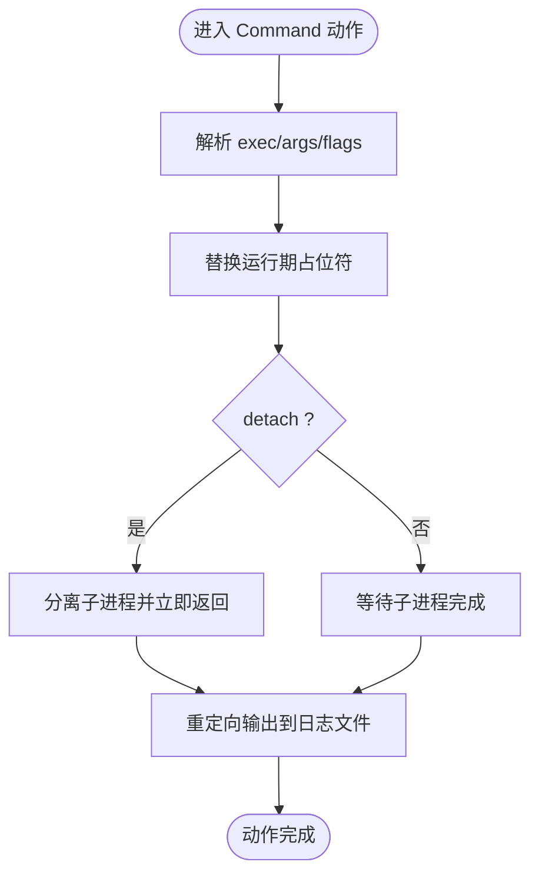
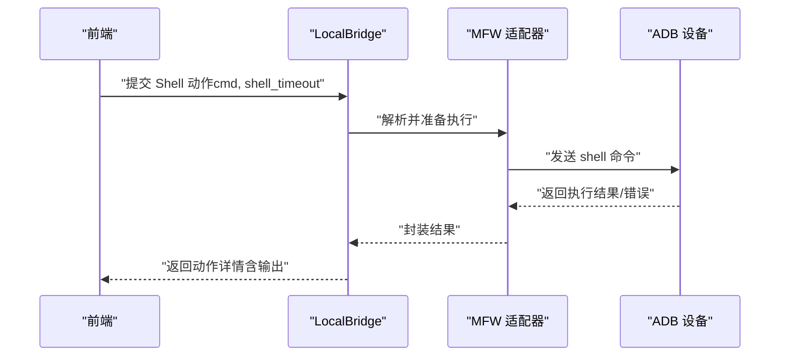
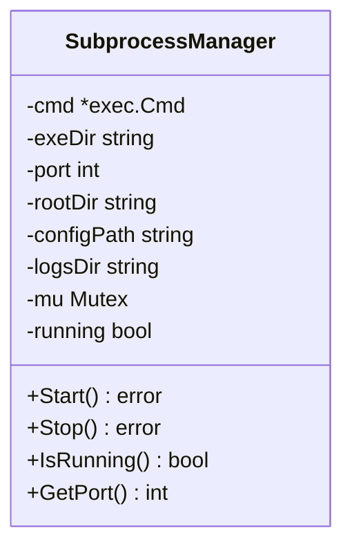
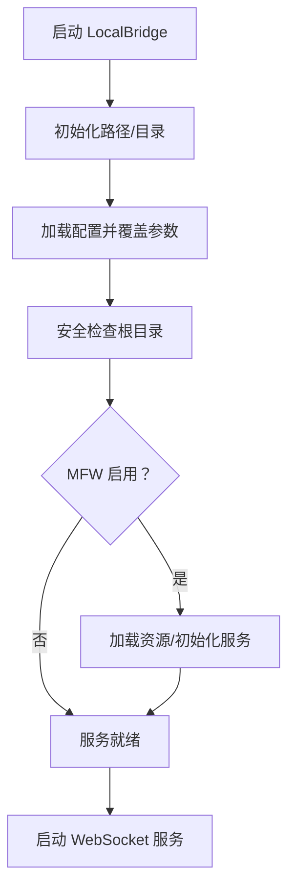
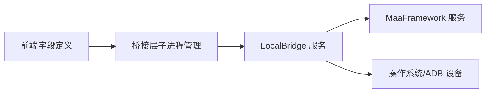

# 系统命令动作

<cite>
**本文档引用的文件**
- [schema.ts](file://src/core/fields/action/schema.ts)
- [fields.ts](file://src/core/fields/action/fields.ts)
- [subprocess.go](file://Extremer/internal/bridge/subprocess.go)
- [subprocess_unix.go](file://Extremer/internal/bridge/subprocess_unix.go)
- [subprocess_windows.go](file://Extremer/internal/bridge/subprocess_windows.go)
- [app.go](file://Extremer/app.go)
- [main.go](file://LocalBridge/cmd/lb/main.go)
- [config.go](file://LocalBridge/internal/config/config.go)
- [adapter.go](file://LocalBridge/internal/mfw/adapter.go)
- [resource_manager.go](file://LocalBridge/internal/mfw/resource_manager.go)
- [ErrorProtocol.ts](file://src/services/protocols/ErrorProtocol.ts)
- [install.ps1](file://tools/install.ps1)
- [install.sh](file://tools/install.sh)
- [install.bat](file://tools/install.bat)
</cite>

## 目录
1. [简介](#简介)
2. [项目结构](#项目结构)
3. [核心组件](#核心组件)
4. [架构总览](#架构总览)
5. [详细组件分析](#详细组件分析)
6. [依赖分析](#依赖分析)
7. [性能考量](#性能考量)
8. [故障排查指南](#故障排查指南)
9. [结论](#结论)
10. [附录](#附录)

## 简介
本文件聚焦“系统命令动作”类型，系统性阐述两类动作的配置、执行与输出处理：
- Command：执行外部程序（可分离子进程，支持参数替换）
- Shell：在 ADB 设备上执行 shell 命令（支持超时控制）

文档涵盖命令执行环境、参数传递、输出处理、跨平台兼容性、权限与安全、资源限制、超时与错误捕获、结果解析，以及 Shell 命令在 ADB 设备上的特殊使用场景与注意事项。

## 项目结构
围绕命令动作的关键模块分布于前端字段定义、桥接层子进程管理、本地服务（LocalBridge）与 MaaFramework 集成：

**图表来源**
- [schema.ts:209-242](file://src/core/fields/action/schema.ts#L209-L242)
- [fields.ts:124-135](file://src/core/fields/action/fields.ts#L124-L135)
- [subprocess.go:35-104](file://Extremer/internal/bridge/subprocess.go#L35-L104)
- [subprocess_windows.go:10-25](file://Extremer/internal/bridge/subprocess_windows.go#L10-L25)
- [subprocess_unix.go:10-29](file://Extremer/internal/bridge/subprocess_unix.go#L10-L29)
- [app.go:290-303](file://Extremer/app.go#L290-L303)
- [main.go:182-440](file://LocalBridge/cmd/lb/main.go#L182-L440)
- [config.go:234-257](file://LocalBridge/internal/config/config.go#L234-L257)
- [adapter.go:205-291](file://LocalBridge/internal/mfw/adapter.go#L205-L291)
- [resource_manager.go:26-105](file://LocalBridge/internal/mfw/resource_manager.go#L26-L105)

**章节来源**
- [schema.ts:209-242](file://src/core/fields/action/schema.ts#L209-L242)
- [fields.ts:124-135](file://src/core/fields/action/fields.ts#L124-L135)
- [subprocess.go:35-104](file://Extremer/internal/bridge/subprocess.go#L35-L104)
- [app.go:290-303](file://Extremer/app.go#L290-L303)
- [main.go:182-440](file://LocalBridge/cmd/lb/main.go#L182-L440)

## 核心组件
- 动作字段定义（Command/Shell）
  - Command：exec（可执行文件路径）、args（参数列表，支持运行期替换占位符）、detach（分离执行）
  - Shell：cmd（shell 命令字符串）、shell_timeout（超时毫秒，-1 表示无限）
- 子进程管理（桥接层）
  - 跨平台进程属性设置、启动与停止、日志重定向、运行状态管理
- 本地服务（LocalBridge）
  - 命令行入口、配置加载、安全检查、MFW 资源加载、WebSocket 服务、日志推送
- 错误协议与诊断
  - 统一错误映射与前端提示，控制器/设备连接异常时的状态清理

**章节来源**
- [schema.ts:209-242](file://src/core/fields/action/schema.ts#L209-L242)
- [fields.ts:124-135](file://src/core/fields/action/fields.ts#L124-L135)
- [subprocess.go:12-33](file://Extremer/internal/bridge/subprocess.go#L12-L33)
- [main.go:182-440](file://LocalBridge/cmd/lb/main.go#L182-L440)
- [ErrorProtocol.ts:39-67](file://src/services/protocols/ErrorProtocol.ts#L39-L67)

## 架构总览
命令动作的执行链路如下：

**图表来源**
- [fields.ts:124-135](file://src/core/fields/action/fields.ts#L124-L135)
- [subprocess.go:35-104](file://Extremer/internal/bridge/subprocess.go#L35-L104)
- [main.go:182-440](file://LocalBridge/cmd/lb/main.go#L182-L440)

## 详细组件分析

### Command 动作
- 配置项
  - exec：外部可执行文件路径
  - args：参数列表，支持运行期替换占位符（如 ENTRY、NODE、IMAGE、BOX、RESOURCE_DIR、LIBRARY_DIR）
  - detach：是否分离子进程（不等待完成）
- 执行环境
  - 由桥接层 SubprocessManager 启动 LocalBridge 子进程，LocalBridge 解析并执行外部命令
  - 日志重定向至日志目录，便于问题定位
- 参数传递与占位符
  - 占位符在运行期解析，确保与当前任务/节点/资源上下文一致
- 输出处理
  - 进程标准输出/错误被重定向到日志文件；分离模式下不阻塞后续任务
- 超时与错误
  - 分离模式下可通过外部机制或上层调度控制；非分离模式遵循进程生命周期
- 权限与安全
  - 建议在受控目录执行，避免高风险路径；结合 LocalBridge 的安全检查策略

**图表来源**
- [schema.ts:210-228](file://src/core/fields/action/schema.ts#L210-L228)
- [subprocess.go:78-87](file://Extremer/internal/bridge/subprocess.go#L78-L87)

**章节来源**
- [schema.ts:210-228](file://src/core/fields/action/schema.ts#L210-L228)
- [fields.ts:124-129](file://src/core/fields/action/fields.ts#L124-L129)
- [subprocess.go:78-87](file://Extremer/internal/bridge/subprocess.go#L78-L87)

### Shell 动作（ADB 设备）
- 配置项
  - cmd：要执行的 shell 命令
  - shell_timeout：超时毫秒，-1 表示无限等待（仅对 ADB 控制器有效）
- 执行环境
  - 仅在 ADB 控制器有效；通过 LocalBridge 的 MFW 服务与设备通信
- 参数传递与输出
  - 命令输出可通过 MaaTaskerGetActionDetail 在动作详情中获取
- 超时控制
  - 支持超时中断；超时后可选择是否返回中间结果
- 错误捕获
  - 设备/控制器异常时，前端统一映射并清理连接状态

**图表来源**
- [schema.ts:229-242](file://src/core/fields/action/schema.ts#L229-L242)
- [fields.ts:132-135](file://src/core/fields/action/fields.ts#L132-L135)
- [adapter.go:205-291](file://LocalBridge/internal/mfw/adapter.go#L205-L291)

**章节来源**
- [schema.ts:229-242](file://src/core/fields/action/schema.ts#L229-L242)
- [fields.ts:132-135](file://src/core/fields/action/fields.ts#L132-L135)
- [adapter.go:205-291](file://LocalBridge/internal/mfw/adapter.go#L205-L291)

### 子进程管理（跨平台）
- 平台差异
  - Windows：隐藏控制台窗口、直接终止进程
  - Unix：创建新进程组，优先发送 SIGTERM，失败则强制终止
- 启动与停止
  - 启动时设置平台属性、重定向日志、后台 Wait 监控；停止时根据平台策略终止
- 运行状态
  - 提供 IsRunning 查询，避免重复启动

**图表来源**
- [subprocess.go:12-33](file://Extremer/internal/bridge/subprocess.go#L12-L33)
- [subprocess_windows.go:10-25](file://Extremer/internal/bridge/subprocess_windows.go#L10-L25)
- [subprocess_unix.go:10-29](file://Extremer/internal/bridge/subprocess_unix.go#L10-L29)

**章节来源**
- [subprocess.go:35-104](file://Extremer/internal/bridge/subprocess.go#L35-L104)
- [subprocess_windows.go:10-25](file://Extremer/internal/bridge/subprocess_windows.go#L10-L25)
- [subprocess_unix.go:10-29](file://Extremer/internal/bridge/subprocess_unix.go#L10-L29)

### LocalBridge 与 MaaFramework 集成
- 启动流程
  - 初始化路径、加载配置、安全检查、启动文件服务与资源扫描、创建 WebSocket 服务器
- MFW 资源加载
  - 资源包加载、哈希校验、工作目录切换与短路径处理（Windows）
- 错误处理
  - 统一日志推送、错误码封装、前端错误映射与连接状态清理

**图表来源**
- [main.go:182-440](file://LocalBridge/cmd/lb/main.go#L182-L440)
- [config.go:234-257](file://LocalBridge/internal/config/config.go#L234-L257)
- [resource_manager.go:26-105](file://LocalBridge/internal/mfw/resource_manager.go#L26-L105)

**章节来源**
- [main.go:182-440](file://LocalBridge/cmd/lb/main.go#L182-L440)
- [config.go:234-257](file://LocalBridge/internal/config/config.go#L234-L257)
- [resource_manager.go:26-105](file://LocalBridge/internal/mfw/resource_manager.go#L26-L105)

## 依赖分析
- 前端动作字段定义驱动执行行为
- 桥接层负责进程生命周期与平台差异
- LocalBridge 负责服务编排、配置与设备交互
- MFW 提供 OCR/资源能力，与命令动作协同

**图表来源**
- [fields.ts:124-135](file://src/core/fields/action/fields.ts#L124-L135)
- [subprocess.go:35-104](file://Extremer/internal/bridge/subprocess.go#L35-L104)
- [main.go:182-440](file://LocalBridge/cmd/lb/main.go#L182-L440)

**章节来源**
- [fields.ts:124-135](file://src/core/fields/action/fields.ts#L124-L135)
- [subprocess.go:35-104](file://Extremer/internal/bridge/subprocess.go#L35-L104)
- [main.go:182-440](file://LocalBridge/cmd/lb/main.go#L182-L440)

## 性能考量
- 分离执行（detach）降低任务链阻塞，适合耗时外部命令
- 超时控制（shell_timeout）避免长时间挂起，提升整体吞吐
- 日志重定向减少 stdout/stderr 对主线程的影响
- 资源加载（MFW）采用异步作业与哈希校验，避免重复加载

[本节为通用指导，无需具体文件分析]

## 故障排查指南
- 常见错误与映射
  - 控制器/设备相关错误：自动清理连接状态，避免脏数据
  - MFW 未初始化/资源未配置：检查配置与资源路径
- 日志定位
  - LocalBridge 将日志推送至前端，结合子进程日志文件定位问题
- 安全检查
  - 高风险根目录会被拒绝启动，需调整项目目录

**章节来源**
- [ErrorProtocol.ts:39-67](file://src/services/protocols/ErrorProtocol.ts#L39-L67)
- [config.go:234-257](file://LocalBridge/internal/config/config.go#L234-L257)
- [subprocess.go:78-87](file://Extremer/internal/bridge/subprocess.go#L78-L87)

## 结论
- Command/Shell 动作提供了灵活的系统命令执行能力
- 通过桥接层与 LocalBridge 的协作，实现了跨平台、可配置、可观测的命令执行
- 建议在生产环境中配合超时、分离执行、日志与安全检查，确保稳定性与安全性

[本节为总结，无需具体文件分析]

## 附录

### A. 跨平台兼容性说明
- Windows
  - 隐藏控制台窗口，直接终止进程
  - 文件管理器打开使用 explorer
- Unix/Linux
  - 创建新进程组，优先 SIGTERM，失败则强制终止
  - 文件管理器打开使用 xdg-open/open
- LocalBridge 安装脚本
  - 提供一键安装与 PATH 配置，便于在各平台快速部署

**章节来源**
- [subprocess_windows.go:10-25](file://Extremer/internal/bridge/subprocess_windows.go#L10-L25)
- [subprocess_unix.go:10-29](file://Extremer/internal/bridge/subprocess_unix.go#L10-L29)
- [main.go:471-489](file://LocalBridge/cmd/lb/main.go#L471-L489)
- [install.ps1:1-73](file://tools/install.ps1#L1-L73)
- [install.sh:56-91](file://tools/install.sh#L56-L91)
- [install.bat:1-114](file://tools/install.bat#L1-L114)

### B. 命令执行权限与安全沙箱
- LocalBridge 启动前进行根目录安全检查，高风险路径拒绝启动
- 建议将命令执行限定在受信目录，避免对系统关键目录进行写操作
- Shell 动作仅在 ADB 控制器有效，减少对主机系统的直接干预

**章节来源**
- [config.go:234-257](file://LocalBridge/internal/config/config.go#L234-L257)
- [schema.ts:229-242](file://src/core/fields/action/schema.ts#L229-L242)

### C. 资源限制与超时控制
- Shell 动作支持 shell_timeout，-1 表示无限等待
- Command 动作可通过 detach 实现非阻塞执行，结合上层调度实现超时
- 子进程日志重定向，便于在超时后快速定位问题

**章节来源**
- [schema.ts:236-242](file://src/core/fields/action/schema.ts#L236-L242)
- [subprocess.go:78-87](file://Extremer/internal/bridge/subprocess.go#L78-L87)

### D. ADB 设备上的 Shell 使用要点
- 仅在 ADB 控制器有效
- 命令输出可通过动作详情获取
- 异常时前端统一映射并清理连接状态

**章节来源**
- [schema.ts:229-242](file://src/core/fields/action/schema.ts#L229-L242)
- [ErrorProtocol.ts:39-67](file://src/services/protocols/ErrorProtocol.ts#L39-L67)