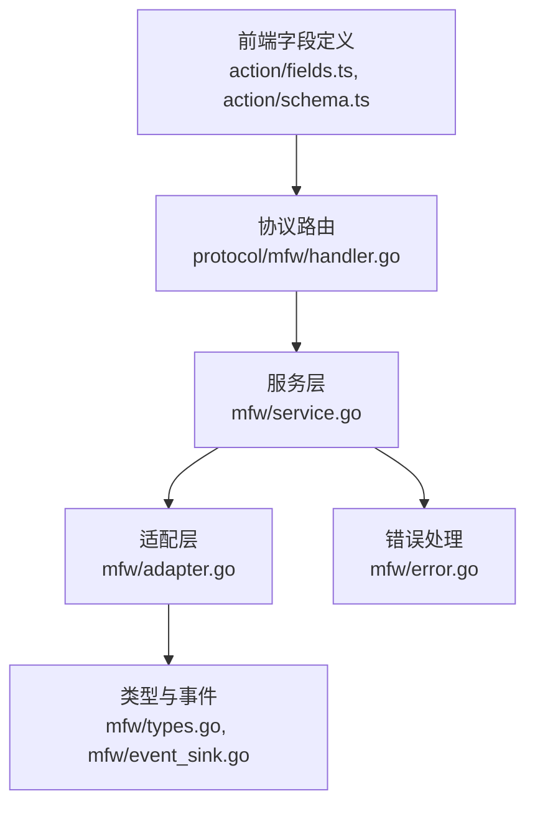
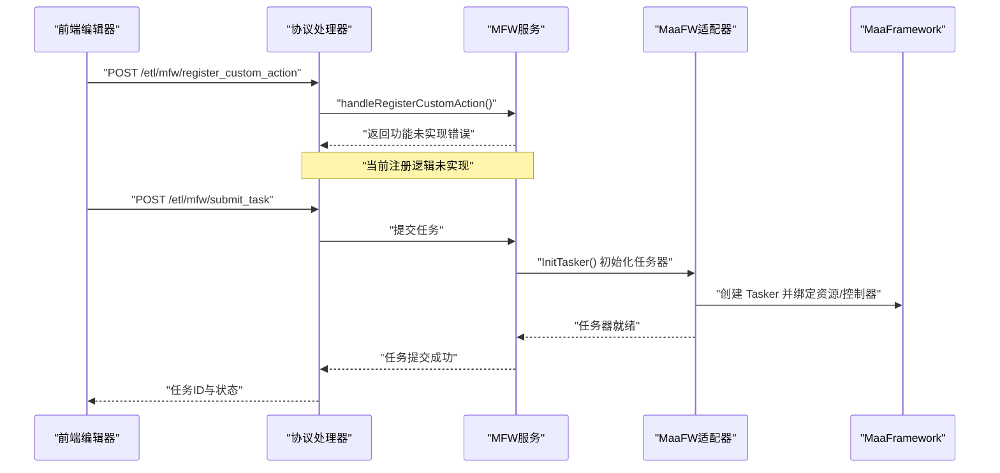
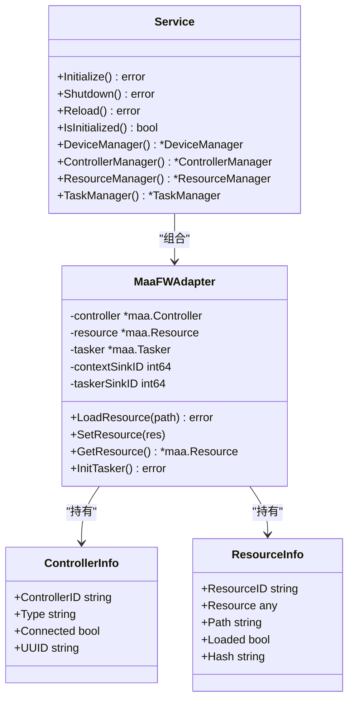
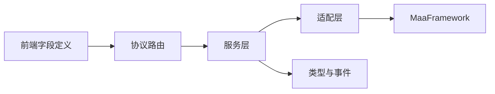

# 自定义外部动作

<cite>
**本文档引用的文件**
- [handler.go](file://LocalBridge/internal/protocol/mfw/handler.go)
- [fields.ts](file://src/core/fields/action/fields.ts)
- [schema.ts](file://src/core/fields/action/schema.ts)
- [adapter.go](file://LocalBridge/internal/mfw/adapter.go)
- [service.go](file://LocalBridge/internal/mfw/service.go)
- [types.go](file://LocalBridge/internal/mfw/types.go)
- [event_sink.go](file://LocalBridge/internal/mfw/event_sink.go)
- [error.go](file://LocalBridge/internal/mfw/error.go)
</cite>

## 目录
1. [简介](#简介)
2. [项目结构](#项目结构)
3. [核心组件](#核心组件)
4. [架构总览](#架构总览)
5. [详细组件分析](#详细组件分析)
6. [依赖关系分析](#依赖关系分析)
7. [性能考量](#性能考量)
8. [故障排查指南](#故障排查指南)
9. [结论](#结论)
10. [附录](#附录)

## 简介
本文件面向需要在 MaaFramework 管道中使用自定义外部动作的开发者，系统阐述 Custom 动作的注册机制、回调函数实现、参数传递方法，以及与 MaaFramework 的集成方式。当前仓库中，前端已完整定义了 Custom 动作的字段与描述，后端协议层已预留注册接口路由，但注册逻辑尚未实现。本文将基于现有代码结构，给出完整的开发流程、调试方法、性能优化建议、安全验证与版本管理策略。

## 项目结构
围绕自定义外部动作的关键模块分布如下：
- 前端字段定义：定义 Custom 动作的参数键、类型与默认值，确保编辑器正确渲染与校验。
- 协议层路由：暴露注册自定义动作的接口路由，当前为占位实现。
- 适配层与服务层：封装 MaaFramework 的控制器、资源、任务器等能力，负责初始化、生命周期管理与错误处理。
- 事件与类型：统一事件类型与数据结构，便于调试与可观测性。

**图表来源**
- [fields.ts:21-29](file://src/core/fields/action/fields.ts#L21-L29)
- [schema.ts:266-291](file://src/core/fields/action/schema.ts#L266-L291)
- [handler.go:108-109](file://LocalBridge/internal/protocol/mfw/handler.go#L108-L109)
- [service.go:16-34](file://LocalBridge/internal/mfw/service.go#L16-L34)
- [adapter.go:23-50](file://LocalBridge/internal/mfw/adapter.go#L23-L50)
- [types.go:40-70](file://LocalBridge/internal/mfw/types.go#L40-L70)
- [event_sink.go:15-33](file://LocalBridge/internal/mfw/event_sink.go#L15-L33)
- [error.go:34-52](file://LocalBridge/internal/mfw/error.go#L34-L52)

**章节来源**
- [fields.ts:1-149](file://src/core/fields/action/fields.ts#L1-L149)
- [schema.ts:266-291](file://src/core/fields/action/schema.ts#L266-L291)
- [handler.go:108-109](file://LocalBridge/internal/protocol/mfw/handler.go#L108-L109)

## 核心组件
- 前端动作字段定义：明确 Custom 动作的参数键（动作名、动作参数、目标位置、偏移），并提供默认值与描述，保证编辑器与序列化一致性。
- 协议层注册路由：预留注册自定义动作的路由，当前返回“功能未实现”错误，后续需完善注册逻辑。
- 适配层与服务层：负责 MaaFramework 初始化、资源加载、任务提交与状态查询，以及控制器与截图器管理。
- 类型与事件：统一控制器、资源、任务等对象的结构，定义调试事件类型，便于前端展示与后端追踪。

**章节来源**
- [fields.ts:21-29](file://src/core/fields/action/fields.ts#L21-L29)
- [schema.ts:266-291](file://src/core/fields/action/schema.ts#L266-L291)
- [handler.go:808-812](file://LocalBridge/internal/protocol/mfw/handler.go#L808-L812)
- [adapter.go:23-50](file://LocalBridge/internal/mfw/adapter.go#L23-L50)
- [service.go:16-34](file://LocalBridge/internal/mfw/service.go#L16-L34)
- [types.go:40-70](file://LocalBridge/internal/mfw/types.go#L40-L70)
- [event_sink.go:15-33](file://LocalBridge/internal/mfw/event_sink.go#L15-L33)

## 架构总览
自定义外部动作的调用链路由前端节点触发，经协议层路由转发至服务层，最终由适配层与 MaaFramework 交互。当前注册接口处于占位状态，动作执行依赖前端传入的动作名与参数。

**图表来源**
- [handler.go:108-109](file://LocalBridge/internal/protocol/mfw/handler.go#L108-L109)
- [handler.go:808-812](file://LocalBridge/internal/protocol/mfw/handler.go#L808-L812)
- [adapter.go:308-319](file://LocalBridge/internal/mfw/adapter.go#L308-L319)
- [service.go:16-34](file://LocalBridge/internal/mfw/service.go#L16-L34)

## 详细组件分析

### 前端字段与参数传递
- 动作名（custom_action）：必填字符串，与注册接口传入的动作名一致，同时通过回调传出。
- 动作参数（custom_action_param）：任意类型，默认空 JSON，通过回调传出。
- 目标位置（custom_target）：支持真值、字符串节点名、坐标点或区域，通过回调 box 传出。
- 目标偏移（target_offset）：与目标叠加的偏移量，通过回调传出。

这些字段在前端被渲染为可编辑表单，并在节点执行时序列化为任务参数，供后端与 MaaFramework 使用。

**章节来源**
- [fields.ts:21-29](file://src/core/fields/action/fields.ts#L21-L29)
- [schema.ts:266-291](file://src/core/fields/action/schema.ts#L266-L291)

### 协议层注册接口
- 路由：/etl/mfw/register_custom_action
- 当前实现：返回“功能未实现”错误，需补充注册逻辑（如接收动作名、回调句柄、参数约束等）。
- 与任务提交的区别：注册接口负责将自定义动作句柄注册到资源或任务器；任务提交接口负责执行已注册的动作。

**章节来源**
- [handler.go:108-109](file://LocalBridge/internal/protocol/mfw/handler.go#L108-L109)
- [handler.go:808-812](file://LocalBridge/internal/protocol/mfw/handler.go#L808-L812)

### 适配层与服务层集成
- 初始化：服务层负责 MaaFramework 初始化、日志目录设置、中文路径兼容处理。
- 资源管理：适配层封装资源加载、销毁与查询，确保资源句柄正确持有与释放。
- 任务器初始化：在控制器与资源均准备就绪后初始化任务器，为动作执行提供上下文。
- 事件与类型：统一事件类型与对象结构，便于调试与状态上报。

**图表来源**
- [service.go:16-34](file://LocalBridge/internal/mfw/service.go#L16-L34)
- [adapter.go:23-50](file://LocalBridge/internal/mfw/adapter.go#L23-L50)
- [types.go:40-70](file://LocalBridge/internal/mfw/types.go#L40-L70)

**章节来源**
- [service.go:36-138](file://LocalBridge/internal/mfw/service.go#L36-L138)
- [adapter.go:205-287](file://LocalBridge/internal/mfw/adapter.go#L205-L287)
- [types.go:40-70](file://LocalBridge/internal/mfw/types.go#L40-L70)

### 事件与调试
- 调试事件类型：节点级（开始/成功/失败）、识别级（开始/成功/失败）、动作级（开始/成功/失败）、任务级（开始/成功/失败）。
- 事件用途：前端可订阅节点/动作/任务事件，实现可视化调试与状态展示。

**章节来源**
- [event_sink.go:15-33](file://LocalBridge/internal/mfw/event_sink.go#L15-L33)

## 依赖关系分析
- 前端字段定义依赖于类型系统与字段枚举，确保参数合法与默认值一致。
- 协议层路由依赖服务层提供的设备、控制器、资源、任务管理能力。
- 适配层依赖 MaaFramework 的控制器、资源、任务器与代理客户端，负责生命周期与错误处理。
- 类型与事件定义贯穿前后端，统一数据结构与调试体验。

**图表来源**
- [fields.ts:1-149](file://src/core/fields/action/fields.ts#L1-L149)
- [schema.ts:266-291](file://src/core/fields/action/schema.ts#L266-L291)
- [handler.go:108-109](file://LocalBridge/internal/protocol/mfw/handler.go#L108-L109)
- [service.go:16-34](file://LocalBridge/internal/mfw/service.go#L16-L34)
- [adapter.go:23-50](file://LocalBridge/internal/mfw/adapter.go#L23-L50)
- [types.go:40-70](file://LocalBridge/internal/mfw/types.go#L40-L70)

**章节来源**
- [handler.go:108-109](file://LocalBridge/internal/protocol/mfw/handler.go#L108-L109)
- [service.go:16-34](file://LocalBridge/internal/mfw/service.go#L16-L34)
- [adapter.go:23-50](file://LocalBridge/internal/mfw/adapter.go#L23-L50)
- [types.go:40-70](file://LocalBridge/internal/mfw/types.go#L40-L70)

## 性能考量
- 资源加载：批量加载资源时应避免阻塞主线程，采用异步加载与进度反馈。
- 任务执行：合理设置动作重复次数与延迟，减少无效重试与设备压力。
- 图像处理：截图与图像处理应在后台线程执行，避免阻塞 UI。
- 内存管理：及时释放不再使用的资源与控制器句柄，防止内存泄漏。
- 日志级别：生产环境建议降低日志级别，减少磁盘 IO 与 CPU 占用。

## 故障排查指南
- 未初始化错误：检查 MaaFramework 库路径配置，确保初始化成功后再发起请求。
- 注册接口错误：当前返回“功能未实现”，需完善注册逻辑并增加参数校验。
- 任务提交失败：确认控制器与资源均已连接/加载，且任务入口存在。
- 事件缺失：检查事件订阅与网络连接，确保前端能够接收调试事件。

**章节来源**
- [handler.go:33-41](file://LocalBridge/internal/protocol/mfw/handler.go#L33-L41)
- [handler.go:808-812](file://LocalBridge/internal/protocol/mfw/handler.go#L808-L812)
- [service.go:36-138](file://LocalBridge/internal/mfw/service.go#L36-L138)
- [error.go:34-52](file://LocalBridge/internal/mfw/error.go#L34-L52)

## 结论
当前仓库已为自定义外部动作提供了完善的前端字段定义与协议路由占位。后续开发重点在于补齐注册接口的实现，使前端传入的动作名与参数能够正确绑定到 MaaFramework 的动作回调。在此基础上，结合适配层的服务化封装与事件体系，可构建稳定、可观测、易维护的自定义动作执行链路。

## 附录

### 自定义动作开发流程（建议）
- 前端配置：在节点中选择 Custom 动作，填写动作名、动作参数、目标位置与偏移。
- 后端注册：实现 /etl/mfw/register_custom_action，接收动作名与回调句柄，建立映射关系。
- 提交任务：通过 /etl/mfw/submit_task 提交任务，确保控制器与资源已就绪。
- 执行与调试：订阅动作级事件，观察执行状态与错误信息。
- 优化与发布：根据性能指标调整参数，打包发布并进行版本管理。

**章节来源**
- [fields.ts:21-29](file://src/core/fields/action/fields.ts#L21-L29)
- [schema.ts:266-291](file://src/core/fields/action/schema.ts#L266-L291)
- [handler.go:108-109](file://LocalBridge/internal/protocol/mfw/handler.go#L108-L109)
- [adapter.go:308-319](file://LocalBridge/internal/mfw/adapter.go#L308-L319)

### 参数传递与回调约定（建议）
- 动作名：必须与注册时一致，用于定位回调句柄。
- 动作参数：支持任意类型，建议提供默认值与校验规则。
- 目标位置：支持多种表达形式，建议在回调中统一转换为像素坐标。
- 回调字段：动作名、动作参数、目标框（box）、偏移等，确保前后端一致。

**章节来源**
- [schema.ts:266-291](file://src/core/fields/action/schema.ts#L266-L291)

### 安全验证与版本管理策略（建议）
- 安全验证：对动作名与参数进行白名单校验，限制敏感操作；对参数类型进行严格校验，防止注入。
- 版本管理：记录 MaaFramework 版本与本地桥版本，确保兼容性；对注册接口与回调签名进行版本化管理。
- 兼容性：针对不同平台（Windows/macOS/Linux）与控制器类型（ADB/Win32/PlayCover）进行兼容性测试。

**章节来源**
- [service.go:67-94](file://LocalBridge/internal/mfw/service.go#L67-L94)
- [adapter.go:23-50](file://LocalBridge/internal/mfw/adapter.go#L23-L50)