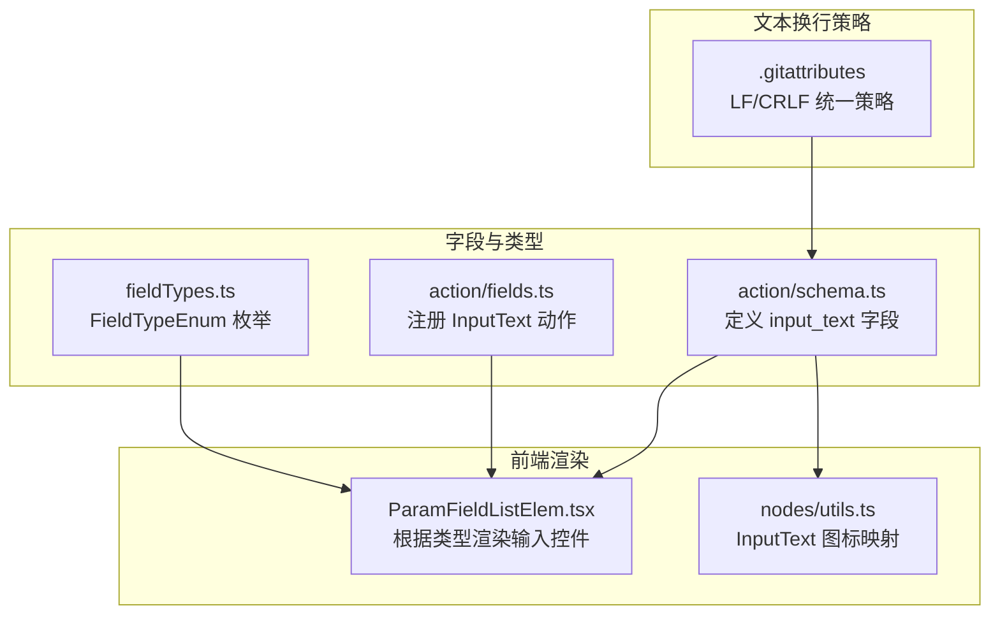
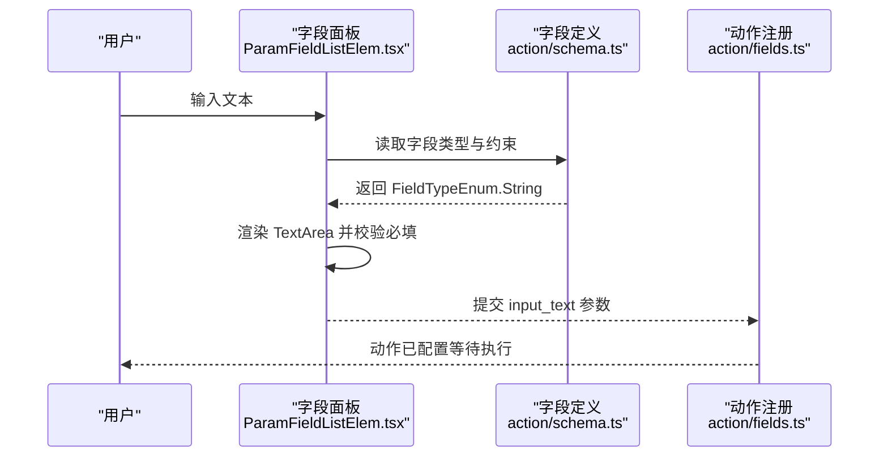
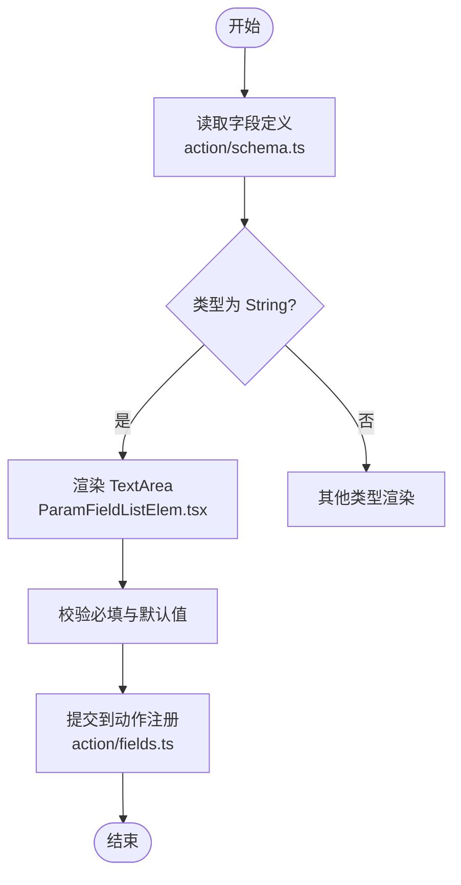
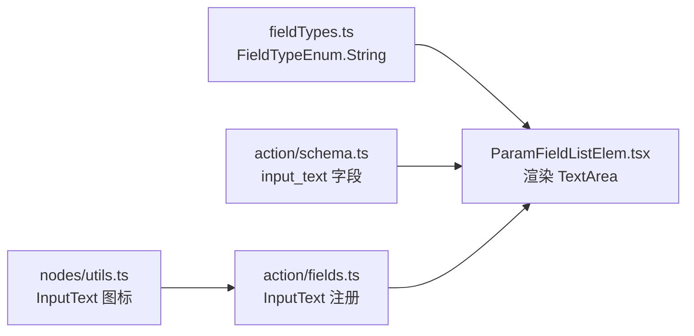

# 输入文本动作

<cite>
**本文档引用的文件**
- [src/core/fields/action/schema.ts](file://src/core/fields/action/schema.ts)
- [src/core/fields/action/fields.ts](file://src/core/fields/action/fields.ts)
- [src/core/fields/fieldTypes.ts](file://src/core/fields/fieldTypes.ts)
- [src/components/flow/nodes/utils.ts](file://src/components/flow/nodes/utils.ts)
- [src/components/panels/field/items/ParamFieldListElem.tsx](file://src/components/panels/field/items/ParamFieldListElem.tsx)
- [.gitattributes](file://.gitattributes)
</cite>

## 目录
1. [简介](#简介)
2. [项目结构](#项目结构)
3. [核心组件](#核心组件)
4. [架构总览](#架构总览)
5. [详细组件分析](#详细组件分析)
6. [依赖分析](#依赖分析)
7. [性能考量](#性能考量)
8. [故障排查指南](#故障排查指南)
9. [结论](#结论)
10. [附录](#附录)

## 简介
本文件聚焦于“输入文本”动作（InputText）的完整说明，涵盖文本输入机制、字符编码与输入法支持、时机控制、输入缓冲与字符延迟设置、跨平台兼容性、特殊字符与表情符号、多语言支持、安全与性能优化策略。内容基于前端字段定义与类型系统，结合项目中已有的字段与类型约束，给出可落地的实践建议。

## 项目结构
围绕 InputText 动作的关键文件与职责如下：
- 字段定义与描述：位于动作字段 Schema 中，定义 input_text 字段的类型、必填性与默认值。
- 动作类型注册：在动作字段集合中声明 InputText 动作及其参数。
- 字段类型系统：统一的 FieldTypeEnum 定义，确保前端渲染与校验的一致性。
- 前端渲染：字段面板根据类型选择合适的输入控件（如文本域）。
- 图标与节点展示：节点工具函数为 InputText 提供专用图标。
- 文本换行与换行符处理：仓库采用 LF/CRLF 统一策略，影响文本文件与字符串存储。

图表来源
- [src/core/fields/action/schema.ts:191-198](file://src/core/fields/action/schema.ts#L191-L198)
- [src/core/fields/action/fields.ts:108-111](file://src/core/fields/action/fields.ts#L108-L111)
- [src/core/fields/fieldTypes.ts:4-26](file://src/core/fields/fieldTypes.ts#L4-L26)
- [src/components/panels/field/items/ParamFieldListElem.tsx:584-608](file://src/components/panels/field/items/ParamFieldListElem.tsx#L584-L608)
- [src/components/flow/nodes/utils.ts:73-74](file://src/components/flow/nodes/utils.ts#L73-L74)
- [.gitattributes:1-48](file://.gitattributes#L1-L48)

章节来源
- [src/core/fields/action/schema.ts:191-198](file://src/core/fields/action/schema.ts#L191-L198)
- [src/core/fields/action/fields.ts:108-111](file://src/core/fields/action/fields.ts#L108-L111)
- [src/core/fields/fieldTypes.ts:4-26](file://src/core/fields/fieldTypes.ts#L4-L26)
- [src/components/panels/field/items/ParamFieldListElem.tsx:584-608](file://src/components/panels/field/items/ParamFieldListElem.tsx#L584-L608)
- [src/components/flow/nodes/utils.ts:73-74](file://src/components/flow/nodes/utils.ts#L73-L74)
- [.gitattributes:1-48](file://.gitattributes#L1-L48)

## 核心组件
- InputText 动作字段
  - 字段键：input_text
  - 类型：字符串（String）
  - 必填：是
  - 默认值：空字符串
  - 描述：要输入的文本，部分控制器仅支持 ASCII
- 动作注册
  - 在动作集合中，InputText 动作为一个动作类型，参数仅为 input_text
- 字段类型系统
  - FieldTypeEnum.String 映射到字符串输入控件
  - 前端根据类型选择 TextArea 或 InputNumber 等控件

章节来源
- [src/core/fields/action/schema.ts:191-198](file://src/core/fields/action/schema.ts#L191-L198)
- [src/core/fields/action/fields.ts:108-111](file://src/core/fields/action/fields.ts#L108-L111)
- [src/core/fields/fieldTypes.ts:4-26](file://src/core/fields/fieldTypes.ts#L4-L26)

## 架构总览
InputText 动作从前端字段面板接收字符串输入，经由字段类型系统与渲染组件进行校验与展示，最终进入任务管线。由于仓库未包含具体控制器层的输入实现细节，以下序列图展示从字段到渲染与任务管线的抽象流程。

图表来源
- [src/components/panels/field/items/ParamFieldListElem.tsx:584-608](file://src/components/panels/field/items/ParamFieldListElem.tsx#L584-L608)
- [src/core/fields/action/schema.ts:191-198](file://src/core/fields/action/schema.ts#L191-L198)
- [src/core/fields/action/fields.ts:108-111](file://src/core/fields/action/fields.ts#L108-L111)

## 详细组件分析

### 字段定义与渲染
- 字段定义
  - input_text 为必填字符串，控制器兼容性提示为“部分控制器仅支持 ASCII”
- 渲染逻辑
  - 前端根据 FieldTypeEnum.String 渲染文本域控件，支持多行输入与自动高度调整
  - 任何类型字段均提供占位符与变更回调，确保输入即时反馈

图表来源
- [src/core/fields/action/schema.ts:191-198](file://src/core/fields/action/schema.ts#L191-L198)
- [src/components/panels/field/items/ParamFieldListElem.tsx:584-608](file://src/components/panels/field/items/ParamFieldListElem.tsx#L584-L608)
- [src/core/fields/action/fields.ts:108-111](file://src/core/fields/action/fields.ts#L108-L111)

章节来源
- [src/core/fields/action/schema.ts:191-198](file://src/core/fields/action/schema.ts#L191-L198)
- [src/components/panels/field/items/ParamFieldListElem.tsx:584-608](file://src/components/panels/field/items/ParamFieldListElem.tsx#L584-L608)
- [src/core/fields/action/fields.ts:108-111](file://src/core/fields/action/fields.ts#L108-L111)

### 文本输入机制与字符编码
- 字符集与编码
  - 字段定义明确指出“部分控制器仅支持 ASCII”，因此建议优先使用 ASCII 字符串
  - 若需多语言字符，请确认目标控制器与设备的字符集支持能力
- 换行与换行符
  - 仓库统一换行策略：LF（Unix）用于大多数文本文件；Windows 批处理脚本使用 CRLF
  - 在字符串中出现换行时，应遵循该策略，避免跨平台差异导致的解析问题

章节来源
- [src/core/fields/action/schema.ts:197](file://src/core/fields/action/schema.ts#L197)
- [.gitattributes:1-LF/CRLF 统一策略:1-48](file://.gitattributes#L1-L48)

### 输入法支持与时机控制
- 输入法支持
  - 仓库未提供针对输入法（IME）的专门实现或配置项
  - 建议在具备 IME 的环境中，优先使用系统原生输入法，确保复杂字符与组合字符正确输入
- 时机控制
  - 本仓库未提供显式的“输入时机控制”字段（如等待焦点、等待键盘弹出等）
  - 实际执行时机由任务管线与控制器决定，建议在调用 InputText 前确保输入框处于可编辑状态

章节来源
- [src/core/fields/action/fields.ts:108-111](file://src/core/fields/action/fields.ts#L108-L111)

### 输入缓冲与字符延迟设置
- 输入缓冲
  - 仓库未提供“输入缓冲”相关字段或配置
- 字符延迟
  - 仓库未提供“逐字符延迟”相关字段或配置
- 建议
  - 如需模拟人类输入节奏，可在业务侧通过任务链拆分与延时动作实现“分批输入”效果

章节来源
- [src/core/fields/action/schema.ts:191-198](file://src/core/fields/action/schema.ts#L191-L198)

### 跨平台与控制器兼容性
- 控制器兼容性
  - 字段描述明确“部分控制器仅支持 ASCII”，因此在多语言场景下需谨慎评估控制器能力
- 操作系统与设备
  - 不同操作系统与设备的输入法行为存在差异，建议在目标设备上进行充分测试
  - 对于需要表情符号或多语言的场景，优先验证目标控制器与设备的字符集支持

章节来源
- [src/core/fields/action/schema.ts:197](file://src/core/fields/action/schema.ts#L197)

### 特殊字符、表情符号与多语言支持
- 特殊字符与表情符号
  - 仓库未提供针对表情符号或特殊字符的专用处理逻辑
  - 建议在输入前进行字符集检查，并在控制器支持范围内使用
- 多语言文本
  - 由于控制器兼容性限制，多语言文本可能受限
  - 建议在设计阶段明确目标环境的语言与字符集覆盖范围

章节来源
- [src/core/fields/action/schema.ts:197](file://src/core/fields/action/schema.ts#L197)

### 安全考虑
- 输入校验
  - input_text 为必填字符串，前端渲染组件提供占位符与变更回调，便于在提交前进行校验
- 数据完整性
  - 建议在任务执行前对输入文本进行长度与字符集校验，避免异常字符导致控制器错误
- 跨平台一致性
  - 遵循仓库的换行策略（LF/CRLF），减少跨平台解析差异带来的风险

章节来源
- [src/core/fields/action/schema.ts:191-198](file://src/core/fields/action/schema.ts#L191-L198)
- [.gitattributes:1-LF/CRLF 统一策略:1-48](file://.gitattributes#L1-L48)

## 依赖分析
InputText 动作的依赖关系主要体现在字段定义、类型系统与前端渲染组件之间的协作。

图表来源
- [src/core/fields/fieldTypes.ts:4-26](file://src/core/fields/fieldTypes.ts#L4-L26)
- [src/components/panels/field/items/ParamFieldListElem.tsx:584-608](file://src/components/panels/field/items/ParamFieldListElem.tsx#L584-L608)
- [src/core/fields/action/schema.ts:191-198](file://src/core/fields/action/schema.ts#L191-L198)
- [src/core/fields/action/fields.ts:108-111](file://src/core/fields/action/fields.ts#L108-L111)
- [src/components/flow/nodes/utils.ts:73-74](file://src/components/flow/nodes/utils.ts#L73-L74)

章节来源
- [src/core/fields/fieldTypes.ts:4-26](file://src/core/fields/fieldTypes.ts#L4-L26)
- [src/components/panels/field/items/ParamFieldListElem.tsx:584-608](file://src/components/panels/field/items/ParamFieldListElem.tsx#L584-L608)
- [src/core/fields/action/schema.ts:191-198](file://src/core/fields/action/schema.ts#L191-L198)
- [src/core/fields/action/fields.ts:108-111](file://src/core/fields/action/fields.ts#L108-L111)
- [src/components/flow/nodes/utils.ts:73-74](file://src/components/flow/nodes/utils.ts#L73-L74)

## 性能考量
- 字符串处理
  - 建议避免过长的单次输入，必要时拆分为多段输入，降低控制器压力
- 控制器兼容性
  - 优先使用 ASCII 字符，减少字符集转换与编码处理开销
- 渲染与交互
  - TextArea 支持自动高度调整，建议合理设置最大行数，避免频繁重排

章节来源
- [src/core/fields/action/schema.ts:197](file://src/core/fields/action/schema.ts#L197)
- [src/components/panels/field/items/ParamFieldListElem.tsx:584-608](file://src/components/panels/field/items/ParamFieldListElem.tsx#L584-L608)

## 故障排查指南
- 输入为空或未生效
  - 确认 input_text 为必填且非空
  - 确认目标输入框处于可编辑状态
- 字符乱码或缺失
  - 检查目标控制器是否支持所需字符集
  - 在多语言场景下，优先使用 ASCII 或验证控制器支持范围
- 换行符问题
  - 遵循仓库的 LF/CRLF 统一策略，避免跨平台差异导致的解析异常

章节来源
- [src/core/fields/action/schema.ts:191-198](file://src/core/fields/action/schema.ts#L191-L198)
- [.gitattributes:1-LF/CRLF 统一策略:1-48](file://.gitattributes#L1-L48)

## 结论
InputText 动作在当前仓库中通过标准字符串字段与类型系统实现，强调了控制器兼容性与字符集限制。实际输入体验与性能表现取决于目标控制器与设备能力。建议在设计阶段明确字符集与多语言需求，并在目标环境中进行充分测试与验证。

## 附录
- 字段与类型参考
  - input_text 字段定义与约束：[字段定义:191-198](file://src/core/fields/action/schema.ts#L191-L198)
  - 动作注册与参数：[动作注册:108-111](file://src/core/fields/action/fields.ts#L108-L111)
  - 字段类型枚举：[类型系统:4-26](file://src/core/fields/fieldTypes.ts#L4-L26)
- 前端渲染参考
  - 字符串字段渲染与校验：[渲染组件:584-608](file://src/components/panels/field/items/ParamFieldListElem.tsx#L584-L608)
- 图标与节点展示
  - InputText 动作图标：[节点工具函数:73-74](file://src/components/flow/nodes/utils.ts#L73-L74)
- 文本换行策略
  - 统一换行策略：[仓库属性:1-48](file://.gitattributes#L1-L48)