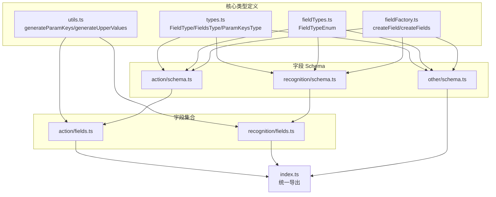
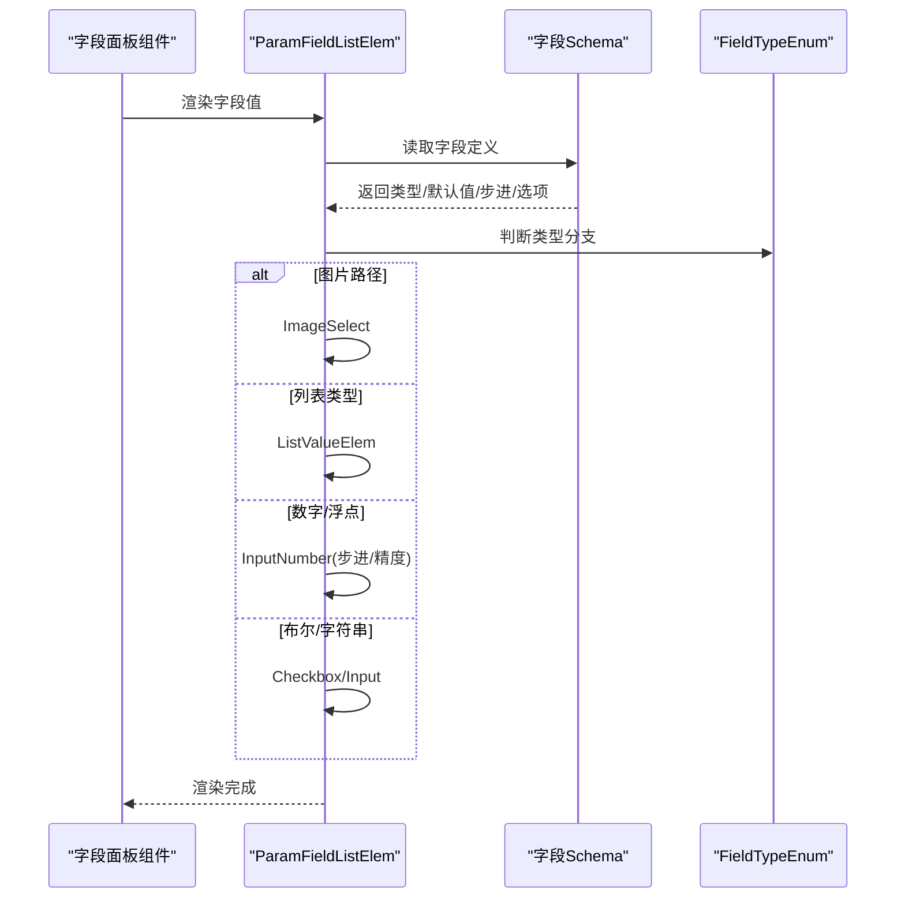
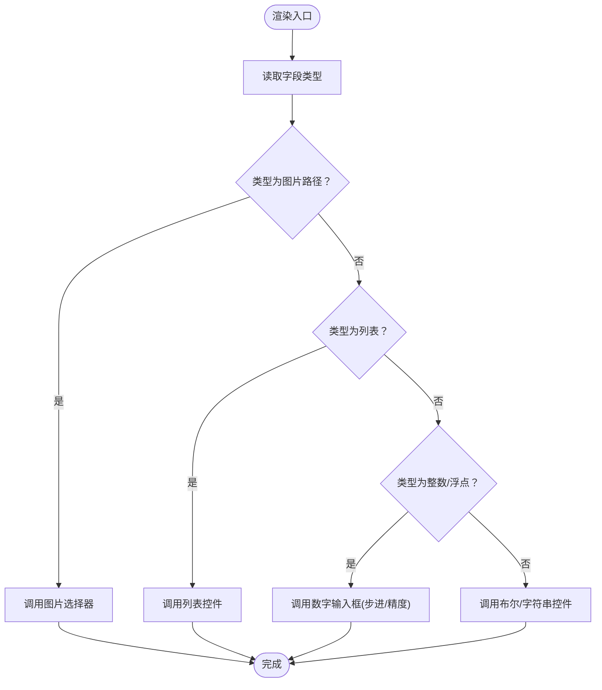
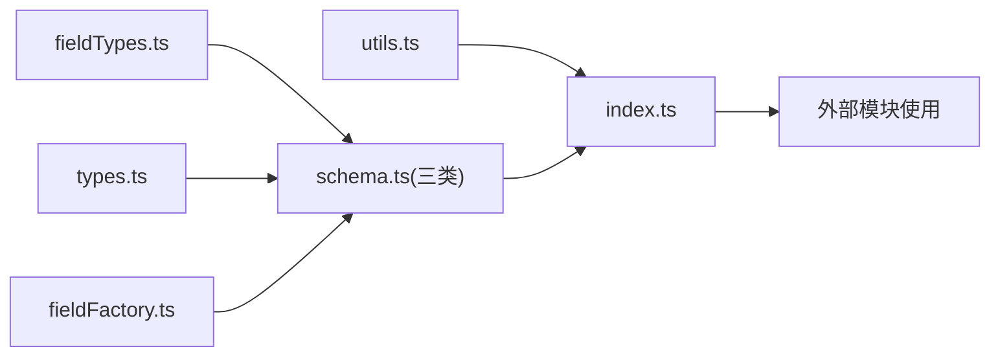

# 基础字段类型

<cite>
**本文档引用的文件**
- [src/core/fields/types.ts](file://src/core/fields/types.ts)
- [src/core/fields/fieldTypes.ts](file://src/core/fields/fieldTypes.ts)
- [src/core/fields/utils.ts](file://src/core/fields/utils.ts)
- [src/core/fields/fieldFactory.ts](file://src/core/fields/fieldFactory.ts)
- [src/core/fields/action/schema.ts](file://src/core/fields/action/schema.ts)
- [src/core/fields/recognition/schema.ts](file://src/core/fields/recognition/schema.ts)
- [src/core/fields/other/schema.ts](file://src/core/fields/other/schema.ts)
- [src/core/fields/action/fields.ts](file://src/core/fields/action/fields.ts)
- [src/core/fields/recognition/fields.ts](file://src/core/fields/recognition/fields.ts)
- [src/core/fields/index.ts](file://src/core/fields/index.ts)
- [src/components/panels/field/items/ParamFieldListElem.tsx](file://src/components/panels/field/items/ParamFieldListElem.tsx)
- [docsite/docs/01.指南/10.工作流面板/30.字段面板.md](file://docsite/docs/01.指南/10.工作流面板/30.字段面板.md)
</cite>

## 目录
1. [简介](#简介)
2. [项目结构](#项目结构)
3. [核心组件](#核心组件)
4. [架构总览](#架构总览)
5. [详细组件分析](#详细组件分析)
6. [依赖关系分析](#依赖关系分析)
7. [性能考量](#性能考量)
8. [故障排查指南](#故障排查指南)
9. [结论](#结论)

## 简介
本文件系统性梳理工作流编辑器中的“基础字段类型”，涵盖：
- 基本类型：整数、浮点数、布尔值、字符串、任意类型
- 复合类型：列表、数组、对象
- 特殊类型：图片路径、位置坐标、位置列表等
- 语法规范、默认值、数据验证规则与实际使用示例

通过对字段类型定义、字段 Schema、UI 渲染与文档说明的综合分析，帮助开发者与使用者准确理解并正确使用各类字段。

## 项目结构
字段类型体系由“类型定义 + 枚举 + Schema + 工厂/工具函数 + 导出聚合”构成，前端通过组件将类型映射为可视化输入控件。

**图表来源**
- [src/core/fields/types.ts:1-34](file://src/core/fields/types.ts#L1-L34)
- [src/core/fields/fieldTypes.ts:1-27](file://src/core/fields/fieldTypes.ts#L1-L27)
- [src/core/fields/fieldFactory.ts:1-16](file://src/core/fields/fieldFactory.ts#L1-L16)
- [src/core/fields/utils.ts:1-41](file://src/core/fields/utils.ts#L1-L41)
- [src/core/fields/action/schema.ts:1-299](file://src/core/fields/action/schema.ts#L1-L299)
- [src/core/fields/recognition/schema.ts:1-276](file://src/core/fields/recognition/schema.ts#L1-L276)
- [src/core/fields/other/schema.ts:1-363](file://src/core/fields/other/schema.ts#L1-L363)
- [src/core/fields/action/fields.ts:1-149](file://src/core/fields/action/fields.ts#L1-L149)
- [src/core/fields/recognition/fields.ts:1-115](file://src/core/fields/recognition/fields.ts#L1-L115)
- [src/core/fields/index.ts:1-45](file://src/core/fields/index.ts#L1-L45)

**章节来源**
- [src/core/fields/index.ts:1-45](file://src/core/fields/index.ts#L1-L45)

## 核心组件
- 字段类型定义：描述字段的键、类型、是否必需、可选项、默认值、步进、描述、子参数、显示名等。
- 字段类型枚举：统一声明所有可用的基础/复合/特殊类型标识。
- 字段工厂：简化字段定义，便于批量创建。
- 工具函数：生成参数键映射、生成大写映射，辅助字段校验与渲染。

**章节来源**
- [src/core/fields/types.ts:6-24](file://src/core/fields/types.ts#L6-L24)
- [src/core/fields/fieldTypes.ts:4-26](file://src/core/fields/fieldTypes.ts#L4-L26)
- [src/core/fields/fieldFactory.ts:6-15](file://src/core/fields/fieldFactory.ts#L6-L15)
- [src/core/fields/utils.ts:6-25](file://src/core/fields/utils.ts#L6-L25)

## 架构总览
字段类型在前端以“类型 -> 控件”的方式呈现，不同类型对应不同输入控件与行为约束。

**图表来源**
- [src/components/panels/field/items/ParamFieldListElem.tsx:485-569](file://src/components/panels/field/items/ParamFieldListElem.tsx#L485-L569)
- [src/core/fields/action/schema.ts:7-291](file://src/core/fields/action/schema.ts#L7-L291)
- [src/core/fields/recognition/schema.ts:7-268](file://src/core/fields/recognition/schema.ts#L7-L268)
- [src/core/fields/other/schema.ts:7-308](file://src/core/fields/other/schema.ts#L7-L308)

## 详细组件分析

### 基础数据类型
- 整数（int）
  - 语法规范：整数值，支持步进（step）控制。
  - 默认值：见各字段定义。
  - 验证规则：整数类型检查，步进粒度控制。
  - 使用示例：延迟、阈值、计数等。
- 浮点数（double）
  - 语法规范：小数值，支持步进（step）控制。
  - 默认值：见各字段定义。
  - 验证规则：浮点类型检查，步进粒度控制。
  - 使用示例：置信度阈值、比率等。
- 布尔值（bool）
  - 语法规范：true/false。
  - 默认值：见各字段定义。
  - 验证规则：布尔类型检查。
  - 使用示例：开关控制、条件判断。
- 字符串（string）
  - 语法规范：文本值。
  - 默认值：见各字段定义。
  - 验证规则：字符串类型检查。
  - 使用示例：路径、模型名、描述等。
- 任意类型（any）
  - 语法规范：JSON 兼容对象/数组/标量。
  - 默认值：见各字段定义。
  - 验证规则：不强制类型，允许任意 JSON 结构。
  - 使用示例：自定义参数、附加配置。

**章节来源**
- [src/core/fields/fieldTypes.ts:5-10](file://src/core/fields/fieldTypes.ts#L5-L10)
- [src/core/fields/action/schema.ts:168-198](file://src/core/fields/action/schema.ts#L168-L198)
- [src/core/fields/recognition/schema.ts:151-188](file://src/core/fields/recognition/schema.ts#L151-L188)
- [src/core/fields/other/schema.ts:8-39](file://src/core/fields/other/schema.ts#L8-L39)

### 复合类型
- 列表（list<T, ...>）
  - 语法规范：list<类型, ...>，支持一维/二维列表。
  - 默认值：见各字段定义。
  - 验证规则：数组类型检查，内部元素类型一致性。
  - 使用示例：模板路径列表、滑动路径点、颜色区间等。
- 数组（array<T, N>）
  - 语法规范：固定长度数组，如 array<int, 2>、array<int, 4>。
  - 默认值：见各字段定义。
  - 验证规则：数组长度与元素类型检查。
  - 使用示例：坐标点、矩形区域等。
- 对象（object）
  - 语法规范：JSON 对象。
  - 默认值：见各字段定义。
  - 验证规则：对象类型检查。
  - 使用示例：多字段结构体、复杂参数容器。

**章节来源**
- [src/core/fields/fieldTypes.ts:10-22](file://src/core/fields/fieldTypes.ts#L10-L22)
- [src/core/fields/action/schema.ts:132-138](file://src/core/fields/action/schema.ts#L132-L138)
- [src/core/fields/recognition/schema.ts:28-55](file://src/core/fields/recognition/schema.ts#L28-L55)
- [src/core/fields/other/schema.ts:320-362](file://src/core/fields/other/schema.ts#L320-L362)

### 特殊类型
- 图片路径（image_path）
  - 语法规范：相对路径或受支持的 URL。
  - 默认值：见各字段定义。
  - 验证规则：前端提供图片选择器，支持常见图片格式。
  - 使用示例：模板匹配、截图保存等。
- 位置坐标（XYWH）
  - 语法规范：array<int, 4>，表示 [x, y, w, h]。
  - 默认值：见各字段定义。
  - 验证规则：长度为 4，元素为整数。
  - 使用示例：识别区域、点击目标区域。
- 位置列表（PositionList）
  - 语法规范：list<true | string | array<int, 4>>，支持锚点、节点名或坐标区域。
  - 默认值：见各字段定义。
  - 验证规则：列表元素类型联合校验。
  - 使用示例：滑动终点、多点路径。

**章节来源**
- [src/core/fields/fieldTypes.ts:14-16](file://src/core/fields/fieldTypes.ts#L14-L16)
- [src/core/fields/fieldTypes.ts:24-25](file://src/core/fields/fieldTypes.ts#L24-L25)
- [src/core/fields/action/schema.ts:8-76](file://src/core/fields/action/schema.ts#L8-L76)
- [src/core/fields/recognition/schema.ts:9-20](file://src/core/fields/recognition/schema.ts#L9-L20)
- [src/components/panels/field/items/ParamFieldListElem.tsx:502-531](file://src/components/panels/field/items/ParamFieldListElem.tsx#L502-L531)

### 字段定义与使用示例（按类型）
- 动作字段（Action）
  - 示例：点击、长按、滑动、输入文本、启动/停止应用、执行命令、截图等。
  - 关键字段：target/target_offset、duration、begin/end/swipes、input_text、package、exec/args/detach、cmd/shell_timeout、filename/format/quality 等。
- 识别字段（Recognition）
  - 示例：OCR、模板匹配、颜色匹配、特征匹配、神经网络分类/检测、组合识别（And/Or）、自定义识别等。
  - 关键字段：roi/roi_offset、template/threshold/method/green_mask、order_by/index、lower/upper/count/connected、ocrExpected/ocrThreshold/replace/onlyRec/model/colorFilter、labels/model/expected、all_of/any_of/sub_name/custom* 等。
- 其他字段（Other）
  - 示例：速率限制、超时、锚点、反转、启用/禁用、最大命中次数、前后延迟、等待画面静止、关注节点、重复执行、附加配置等。
  - 关键字段：rate_limit/timeout、anchor、inverse/enabled/max_hit、pre/post_delay、pre/post_wait_freezes/focus/repeat/repeatDelay/repeat_wait_freezes、attach 等。

**章节来源**
- [src/core/fields/action/fields.ts:7-149](file://src/core/fields/action/fields.ts#L7-L149)
- [src/core/fields/recognition/fields.ts:7-115](file://src/core/fields/recognition/fields.ts#L7-L115)
- [src/core/fields/action/schema.ts:7-291](file://src/core/fields/action/schema.ts#L7-L291)
- [src/core/fields/recognition/schema.ts:7-268](file://src/core/fields/recognition/schema.ts#L7-L268)
- [src/core/fields/other/schema.ts:7-308](file://src/core/fields/other/schema.ts#L7-L308)

### 字段类型与 UI 渲染映射
- 图片路径：专用图片选择器组件。
- 列表类型：通用列表控件，支持增删改。
- 数字/浮点：带步进的数字输入框。
- 布尔/字符串：复选框或输入框。

**图表来源**
- [src/components/panels/field/items/ParamFieldListElem.tsx:485-569](file://src/components/panels/field/items/ParamFieldListElem.tsx#L485-L569)

**章节来源**
- [src/components/panels/field/items/ParamFieldListElem.tsx:485-569](file://src/components/panels/field/items/ParamFieldListElem.tsx#L485-L569)

## 依赖关系分析
- 类型与枚举：所有字段 Schema 依赖 FieldTypeEnum 与 FieldType 定义。
- 工具函数：通过 generateParamKeys 生成参数键映射，辅助字段校验与渲染。
- 导出聚合：统一导出字段 Schema、字段集合与工具函数，便于上层模块使用。

**图表来源**
- [src/core/fields/fieldTypes.ts:1-27](file://src/core/fields/fieldTypes.ts#L1-L27)
- [src/core/fields/types.ts:1-34](file://src/core/fields/types.ts#L1-L34)
- [src/core/fields/fieldFactory.ts:1-16](file://src/core/fields/fieldFactory.ts#L1-L16)
- [src/core/fields/utils.ts:1-41](file://src/core/fields/utils.ts#L1-L41)
- [src/core/fields/index.ts:1-45](file://src/core/fields/index.ts#L1-L45)

**章节来源**
- [src/core/fields/index.ts:1-45](file://src/core/fields/index.ts#L1-L45)

## 性能考量
- 列表与数组：尽量避免过长列表，减少渲染与序列化开销。
- 浮点与步进：合理设置 step，避免频繁微小变更导致的重渲染。
- 图片路径：优先使用相对路径，减少网络请求与缓存压力。
- 等待静止：预等待/后等待与重复等待应谨慎设置，避免不必要的轮询与卡顿。

## 故障排查指南
- 类型不匹配
  - 现象：字段值无法通过类型校验。
  - 排查：确认字段类型与默认值，检查是否误用字符串/数字/布尔。
- 列表长度不符
  - 现象：模板匹配阈值与模板列表长度不一致。
  - 排查：确保 list 长度一致，或使用标量作为默认值。
- 图片路径无效
  - 现象：图片无法加载或路径错误。
  - 排查：使用图片选择器或检查相对路径是否正确。
- 位置坐标异常
  - 现象：点击/滑动目标不准确。
  - 排查：核对 XYWH 值与 offset，确认 ROI 范围。

**章节来源**
- [src/core/fields/recognition/schema.ts:36-42](file://src/core/fields/recognition/schema.ts#L36-L42)
- [src/core/fields/action/schema.ts:17-18](file://src/core/fields/action/schema.ts#L17-L18)
- [src/core/fields/other/schema.ts:60-64](file://src/core/fields/other/schema.ts#L60-L64)

## 结论
本文件系统化梳理了工作流编辑器中的基础字段类型，明确了基本/复合/特殊类型的语法规范、默认值与验证规则，并结合字段 Schema 与前端渲染组件展示了实际使用方式。建议在实际使用中：
- 严格遵循字段类型与默认值约定；
- 合理设置步进与阈值，提升稳定性；
- 使用图片选择器与列表控件，降低输入错误；
- 通过锚点、等待静止等机制优化流程可靠性。