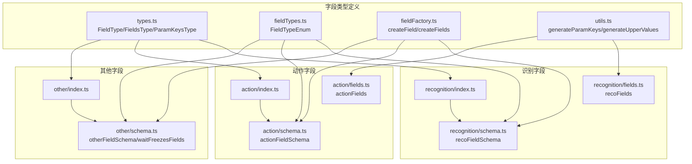
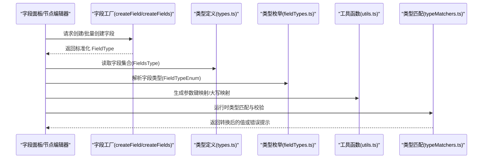
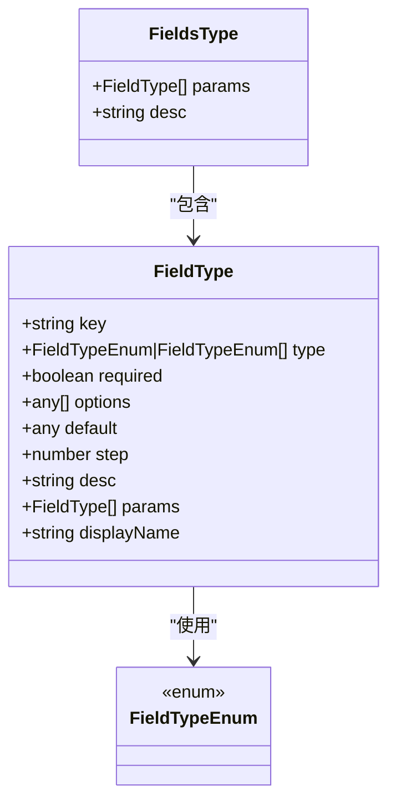
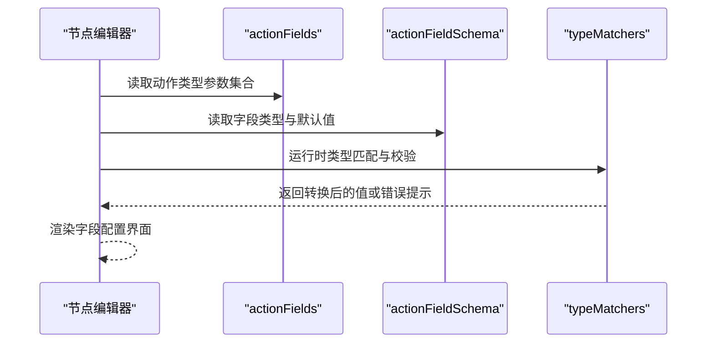
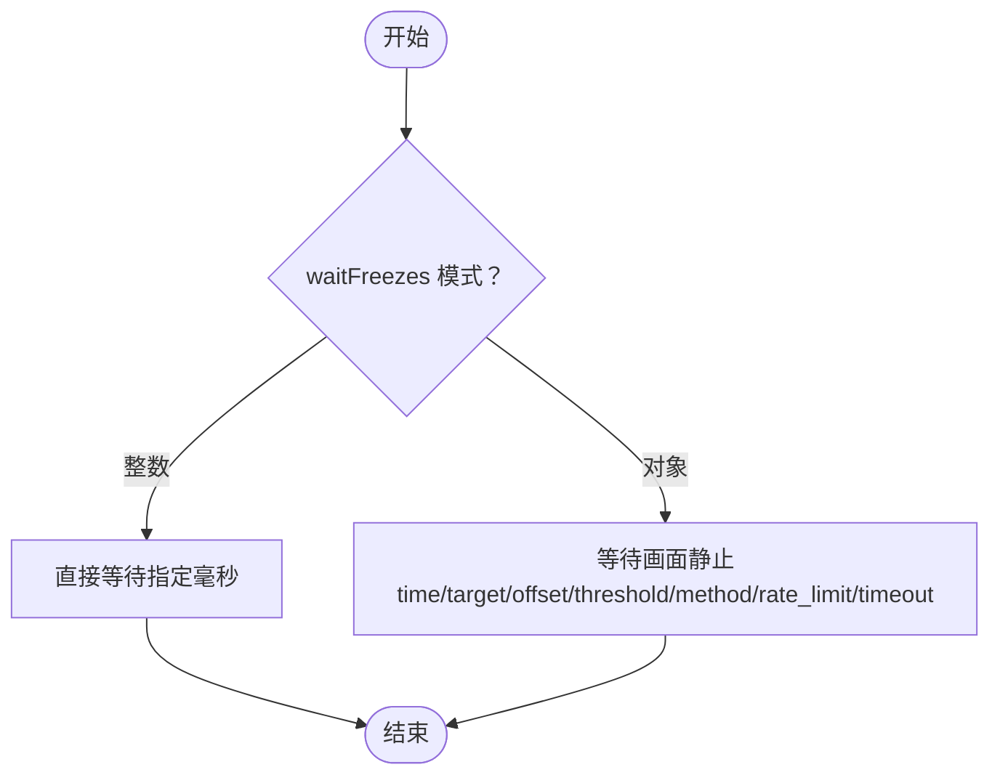
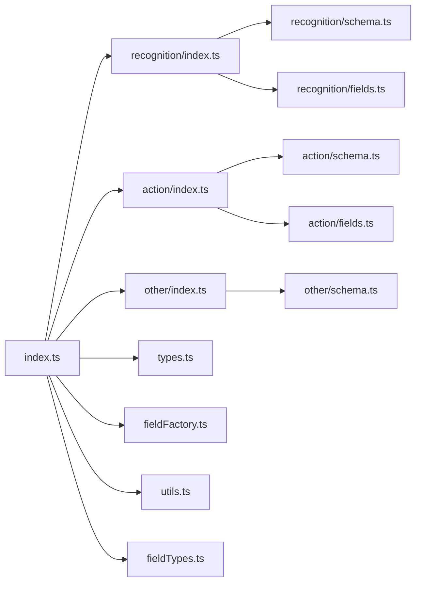

# 字段类型定义

<cite>
**本文档引用的文件**
- [src/core/fields/index.ts](file://src/core/fields/index.ts)
- [src/core/fields/types.ts](file://src/core/fields/types.ts)
- [src/core/fields/fieldFactory.ts](file://src/core/fields/fieldFactory.ts)
- [src/core/fields/utils.ts](file://src/core/fields/utils.ts)
- [src/core/fields/fieldTypes.ts](file://src/core/fields/fieldTypes.ts)
- [src/core/fields/recognition/index.ts](file://src/core/fields/recognition/index.ts)
- [src/core/fields/recognition/schema.ts](file://src/core/fields/recognition/schema.ts)
- [src/core/fields/recognition/fields.ts](file://src/core/fields/recognition/fields.ts)
- [src/core/fields/action/index.ts](file://src/core/fields/action/index.ts)
- [src/core/fields/action/schema.ts](file://src/core/fields/action/schema.ts)
- [src/core/fields/action/fields.ts](file://src/core/fields/action/fields.ts)
- [src/core/fields/other/index.ts](file://src/core/fields/other/index.ts)
- [src/core/fields/other/schema.ts](file://src/core/fields/other/schema.ts)
- [src/core/parser/typeMatchers.ts](file://src/core/parser/typeMatchers.ts)
- [src/utils/aiPredictor.ts](file://src/utils/aiPredictor.ts)
- [src/components/panels/main/FieldPanel.tsx](file://src/components/panels/main/FieldPanel.tsx)
- [src/components/panels/node-editors/PipelineEditor.tsx](file://src/components/panels/node-editors/PipelineEditor.tsx)
</cite>

## 目录
1. [简介](#简介)
2. [项目结构](#项目结构)
3. [核心组件](#核心组件)
4. [架构总览](#架构总览)
5. [详细组件分析](#详细组件分析)
6. [依赖分析](#依赖分析)
7. [性能考量](#性能考量)
8. [故障排查指南](#故障排查指南)
9. [结论](#结论)
10. [附录](#附录)

## 简介
本文件系统性梳理并说明字段类型定义体系，涵盖识别字段（OCR识别、TemplateMatch识别、DirectHit识别等）、动作字段（点击、滑动、输入、应用等）、以及“其他参数字段”（如等待静止、锚点、重复执行等）。文档从数据结构、属性定义、配置选项、使用示例、继承与接口规范、数据验证规则与约束、扩展指南、最佳实践与性能考虑等方面进行全面阐述，帮助开发者与使用者高效理解与正确使用字段类型。

## 项目结构
字段类型定义位于前端核心模块 src/core/fields 下，采用分层组织：
- 类型与工厂：types.ts、fieldFactory.ts、utils.ts、fieldTypes.ts
- 识别字段：recognition/index.ts、recognition/schema.ts、recognition/fields.ts
- 动作字段：action/index.ts、action/schema.ts、action/fields.ts
- 其他字段：other/index.ts、other/schema.ts
- 导出聚合：index.ts

图表来源
- [src/core/fields/index.ts:1-45](file://src/core/fields/index.ts#L1-L45)
- [src/core/fields/types.ts:1-34](file://src/core/fields/types.ts#L1-L34)
- [src/core/fields/fieldTypes.ts:1-27](file://src/core/fields/fieldTypes.ts#L1-L27)
- [src/core/fields/fieldFactory.ts:1-16](file://src/core/fields/fieldFactory.ts#L1-L16)
- [src/core/fields/utils.ts:1-41](file://src/core/fields/utils.ts#L1-L41)
- [src/core/fields/recognition/index.ts:1-3](file://src/core/fields/recognition/index.ts#L1-L3)
- [src/core/fields/recognition/schema.ts:1-276](file://src/core/fields/recognition/schema.ts#L1-L276)
- [src/core/fields/recognition/fields.ts:1-115](file://src/core/fields/recognition/fields.ts#L1-L115)
- [src/core/fields/action/index.ts:1-3](file://src/core/fields/action/index.ts#L1-L3)
- [src/core/fields/action/schema.ts:1-299](file://src/core/fields/action/schema.ts#L1-L299)
- [src/core/fields/action/fields.ts:1-149](file://src/core/fields/action/fields.ts#L1-L149)
- [src/core/fields/other/index.ts:1-8](file://src/core/fields/other/index.ts#L1-L8)
- [src/core/fields/other/schema.ts:1-363](file://src/core/fields/other/schema.ts#L1-L363)

章节来源
- [src/core/fields/index.ts:1-45](file://src/core/fields/index.ts#L1-L45)

## 核心组件
- 字段类型定义（FieldType）：统一描述字段的键、类型、是否必填、可选值、默认值、步长、描述、子参数列表、显示名等。
- 字段集合（FieldsType）：描述某一具体字段族（如识别类型、动作类型）的参数集合与描述。
- 参数键集合（ParamKeysType）：记录某一字段族的所有参数键、必填键、必填键默认值。
- 字段类型枚举（FieldTypeEnum）：标准化字段类型，覆盖基础类型、复合类型、图片路径类型等。
- 工厂函数：createField/createFields，简化字段定义。
- 工具函数：generateParamKeys、generateUpperValues，用于生成参数键映射与大写映射。

章节来源
- [src/core/fields/types.ts:1-34](file://src/core/fields/types.ts#L1-L34)
- [src/core/fields/fieldTypes.ts:1-27](file://src/core/fields/fieldTypes.ts#L1-L27)
- [src/core/fields/fieldFactory.ts:1-16](file://src/core/fields/fieldFactory.ts#L1-L16)
- [src/core/fields/utils.ts:1-41](file://src/core/fields/utils.ts#L1-L41)

## 架构总览
字段类型系统通过“类型定义 + 枚举 + 工厂 + 工具函数”的组合，为识别、动作、其他三类字段提供统一的结构化描述与运行时校验支撑。UI 层通过字段面板与节点编辑器读取这些定义，生成可视化的字段配置界面，并在导出/导入时依据类型进行序列化/反序列化与校验。

图表来源
- [src/core/fields/fieldFactory.ts:1-16](file://src/core/fields/fieldFactory.ts#L1-L16)
- [src/core/fields/types.ts:1-34](file://src/core/fields/types.ts#L1-L34)
- [src/core/fields/fieldTypes.ts:1-27](file://src/core/fields/fieldTypes.ts#L1-L27)
- [src/core/fields/utils.ts:1-41](file://src/core/fields/utils.ts#L1-L41)
- [src/core/parser/typeMatchers.ts:1-60](file://src/core/parser/typeMatchers.ts#L1-L60)

## 详细组件分析

### 识别字段（Recognition）
识别字段用于描述“如何从屏幕/图像中找到目标”，支持多种识别算法与组合识别。

- 支持的识别类型
  - DirectHit：直接命中，不进行识别，直接执行动作。
  - OCR：文字识别。
  - TemplateMatch：模板匹配（找图）。
  - ColorMatch：颜色匹配（找色）。
  - FeatureMatch：特征匹配（更强大的找图）。
  - NeuralNetworkClassify：神经网络分类。
  - NeuralNetworkDetect：神经网络检测。
  - And/Or：组合识别（逻辑与/逻辑或）。
  - Custom：自定义识别。

- 公共属性与特有属性
  - 公共：roi、roiOffset、index 等。
  - OCR：expected、threshold、replace、only_rec、model、color_filter 等。
  - TemplateMatch：template、threshold、method、green_mask 等。
  - ColorMatch：method（颜色空间）、lower、upper、count、connected 等。
  - FeatureMatch：detector（SIFT/KAZE/AKAZE/ORBR等）、ratio、count 等。
  - NeuralNetworkClassify/Detect：labels、model、expected 等。
  - And/Or：all_of/any_of、box_index、sub_name 等。
  - Custom：custom_recognition、custom_recognition_param、custom_roi 等。

- 使用示例（路径）
  - OCR 期望文本与阈值配置示例：[OCR 字段定义:150-188](file://src/core/fields/recognition/schema.ts#L150-L188)
  - 模板匹配阈值与方法配置示例：[TemplateMatch 字段定义:28-55](file://src/core/fields/recognition/schema.ts#L28-L55)
  - 颜色匹配下限/上限与连通性配置示例：[ColorMatch 字段定义:116-148](file://src/core/fields/recognition/schema.ts#L116-L148)
  - 组合识别 all_of/any_of 配置示例：[组合识别字段定义:220-246](file://src/core/fields/recognition/schema.ts#L220-L246)
  - 自定义识别配置示例：[Custom 字段定义:248-267](file://src/core/fields/recognition/schema.ts#L248-L267)

- 数据验证规则与约束
  - DirectHit 不应携带任何识别参数，AI 预测器会忽略非空参数。
  - OCR 与 TemplateMatch/FeatureMatch 存在互斥组合（如 expected 与 only_rec 的组合）。
  - ColorMatch 与 template/expected 存在互斥组合。
  - 以上互斥关系由 AI 预测器在验证阶段检查并给出警告或修正。

- UI 集成
  - 字段面板与节点编辑器通过读取 recoFields 与 recoFieldSchema 生成识别字段配置项。
  - UI 支持根据类型动态渲染不同参数项与提示。

图表来源
- [src/core/fields/types.ts:6-24](file://src/core/fields/types.ts#L6-L24)
- [src/core/fields/fieldTypes.ts:4-26](file://src/core/fields/fieldTypes.ts#L4-L26)

章节来源
- [src/core/fields/recognition/schema.ts:1-276](file://src/core/fields/recognition/schema.ts#L1-L276)
- [src/core/fields/recognition/fields.ts:1-115](file://src/core/fields/recognition/fields.ts#L1-L115)
- [src/utils/aiPredictor.ts:606-647](file://src/utils/aiPredictor.ts#L606-L647)
- [src/components/panels/main/FieldPanel.tsx:408-454](file://src/components/panels/main/FieldPanel.tsx#L408-L454)
- [src/components/panels/node-editors/PipelineEditor.tsx:450-490](file://src/components/panels/node-editors/PipelineEditor.tsx#L450-L490)

### 动作字段（Action）
动作字段用于描述“对设备或系统执行的操作”，涵盖点击、滑动、输入、应用控制、命令执行、截图等。

- 支持的动作类型
  - DoNothing：无动作。
  - Click/LongPress：点击/长按。
  - Swipe/MultiSwipe：线性滑动/多指滑动。
  - Scroll：鼠标滚轮滚动。
  - ClickKey/LongPressKey/KeyDown/KeyUp：按键操作。
  - InputText：输入文本。
  - StartApp/StopApp：启动/关闭应用。
  - StopTask：停止当前任务链。
  - Command/Shell：执行外部命令。
  - Screencap：截图保存。
  - TouchDown/TouchMove/TouchUp：触控点按下/移动/抬起。
  - Custom：自定义动作。

- 公共属性与特有属性
  - 公共：target/target_offset、contact、pressure 等。
  - Click/LongPress：target/target_offset、contact、pressure。
  - Swipe/MultiSwipe：begin/end、duration、end_hold、only_hover、contact、pressure。
  - Scroll：target、dx/dy。
  - InputText：input_text。
  - StartApp/StopApp：package。
  - Command：exec、args、detach。
  - Shell：cmd、shell_timeout。
  - Screencap：filename/format/quality。
  - Custom：custom_action、custom_action_param、custom_target。

- 使用示例（路径）
  - 点击目标与偏移配置示例：[Click 字段定义:9-25](file://src/core/fields/action/schema.ts#L9-L25)
  - 滑动起点/终点与持续时间配置示例：[Swipe 字段定义:47-89](file://src/core/fields/action/schema.ts#L47-L89)
  - 输入文本配置示例：[InputText 字段定义:191-198](file://src/core/fields/action/schema.ts#L191-L198)
  - 启动应用配置示例：[StartApp 字段定义:200-207](file://src/core/fields/action/schema.ts#L200-L207)
  - Shell 命令与超时配置示例：[Shell 字段定义:229-242](file://src/core/fields/action/schema.ts#L229-L242)
  - 自定义动作配置示例：[Custom 字段定义:266-290](file://src/core/fields/action/schema.ts#L266-L290)

- 数据验证规则与约束
  - 多指滑动 swipes 的字段结构较为复杂，包含 starting、begin、end、duration、end_hold、only_hover、contact 等，需遵循数组元素顺序与触点编号规则。
  - Shell 动作仅对 ADB 控制器有效，且支持运行期参数替换。

- UI 集成
  - 字段面板与节点编辑器通过 actionFields 与 actionFieldSchema 生成动作字段配置项。

图表来源
- [src/core/fields/action/fields.ts:1-149](file://src/core/fields/action/fields.ts#L1-L149)
- [src/core/fields/action/schema.ts:1-299](file://src/core/fields/action/schema.ts#L1-L299)
- [src/core/parser/typeMatchers.ts:1-60](file://src/core/parser/typeMatchers.ts#L1-L60)

章节来源
- [src/core/fields/action/schema.ts:1-299](file://src/core/fields/action/schema.ts#L1-L299)
- [src/core/fields/action/fields.ts:1-149](file://src/core/fields/action/fields.ts#L1-L149)
- [src/components/panels/main/FieldPanel.tsx:408-454](file://src/components/panels/main/FieldPanel.tsx#L408-L454)
- [src/components/panels/node-editors/PipelineEditor.tsx:450-490](file://src/components/panels/node-editors/PipelineEditor.tsx#L450-L490)

### 其他参数字段（Others）
其他参数字段用于控制节点行为与流程控制，如等待画面静止、锚点、重复执行、启用/禁用、最大命中次数、前后延迟、关注事件等。

- 支持的其他参数
  - rate_limit、timeout：识别速率限制与超时。
  - anchor：锚点设置与引用。
  - inverse/enabled/max_hit：反转识别结果、启用开关、最大命中次数。
  - pre_delay/post_delay：识别到到执行动作前/执行动作后延迟。
  - pre_wait_freezes/post_wait_freezes/repeat_wait_freezes：等待画面静止（支持整数与对象两种模式）。
  - focus：关注事件，触发回调消息。
  - repeat/repeat_delay：重复执行次数与间隔。
  - attach：附加 JSON 对象，用于保存自定义配置。

- 使用示例（路径）
  - 等待画面静止（整数/对象）配置示例：[waitFreezes 字段定义:60-178](file://src/core/fields/other/schema.ts#L60-L178)
  - 锚点与 inverse/enabled/max_hit 配置示例：[其他字段定义:8-60](file://src/core/fields/other/schema.ts#L8-L60)
  - 重复执行与间隔配置示例：[repeat/repeat_delay 字段定义:230-301](file://src/core/fields/other/schema.ts#L230-L301)

- 数据验证规则与约束
  - waitFreezes 支持整数（毫秒）与对象两种模式，对象模式下可进一步配置 time、target、offset、threshold、method、rate_limit、timeout 等子参数。
  - focus 字段为结构化对象，键为消息类型，值为模板字符串（支持占位符与国际化）。

- UI 集成
  - 字段面板与节点编辑器通过 otherFieldSchema 与其他参数列表生成“其他字段”配置项。

图表来源
- [src/core/fields/other/schema.ts:60-178](file://src/core/fields/other/schema.ts#L60-L178)

章节来源
- [src/core/fields/other/schema.ts:1-363](file://src/core/fields/other/schema.ts#L1-L363)

### 字段类型枚举与工厂/工具函数
- 字段类型枚举（FieldTypeEnum）：统一描述基础类型（int、double、bool、string）、复合类型（list/array、object、any）、图片路径类型（image_path/list<image_path>）等。
- 工厂函数（createField/createFields）：简化字段定义，便于复用与维护。
- 工具函数（generateParamKeys/generateUpperValues）：为字段族生成参数键映射与大写键映射，便于运行时查找与校验。

章节来源
- [src/core/fields/fieldTypes.ts:1-27](file://src/core/fields/fieldTypes.ts#L1-L27)
- [src/core/fields/fieldFactory.ts:1-16](file://src/core/fields/fieldFactory.ts#L1-L16)
- [src/core/fields/utils.ts:1-41](file://src/core/fields/utils.ts#L1-L41)

## 依赖分析
字段类型系统内部依赖清晰，UI 层通过 index.ts 聚合导出，运行时通过类型匹配器进行校验。

图表来源
- [src/core/fields/index.ts:1-45](file://src/core/fields/index.ts#L1-L45)
- [src/core/fields/recognition/index.ts:1-3](file://src/core/fields/recognition/index.ts#L1-L3)
- [src/core/fields/action/index.ts:1-3](file://src/core/fields/action/index.ts#L1-L3)
- [src/core/fields/other/index.ts:1-8](file://src/core/fields/other/index.ts#L1-L8)

章节来源
- [src/core/fields/index.ts:1-45](file://src/core/fields/index.ts#L1-L45)

## 性能考量
- 识别性能
  - 模板匹配与特征匹配的阈值与算法选择直接影响识别速度与稳定性，建议在保证准确率的前提下选择更高效的算法。
  - ROI 限定与 roiOffset 的合理使用可显著减少处理区域，提升性能。
- 动作性能
  - 多指滑动（MultiSwipe）与多次滑动相比，可在一次触控过程中完成多段路径，减少抬手/落手带来的额外开销。
  - 长按/滚动等动作在不同控制器上的支持度不同，需根据目标设备选择合适动作。
- 流程控制
  - rate_limit 与 timeout 的合理设置可避免过度轮询与卡顿。
  - waitFreezes 的 time、threshold、method 等参数需权衡准确度与等待时间。

## 故障排查指南
- 字段校验
  - UI 提供“字段配置”标签页，若存在数据不合法，会弹出警告并提供“应用修复”按钮，便于快速修复。
  - 配置面板支持“忽略字段校验”，在特殊情况下可临时绕过校验，但不建议长期开启。
- 常见问题
  - OCR 与 TemplateMatch/FeatureMatch 的参数互斥：当同时设置了 expected 与 only_rec 或设置了 template 与 only_rec 时，AI 预测器会发出警告并忽略冲突参数。
  - ColorMatch 与 template/expected 的互斥：同时设置 template 与 expected 会导致识别异常。
  - Shell 动作仅对 ADB 控制器有效，若在其他控制器上执行会失败。
  - waitFreezes 的对象模式需确保子参数完整，否则可能导致等待逻辑异常。

章节来源
- [src/components/panels/main/FieldPanel.tsx:427-443](file://src/components/panels/main/FieldPanel.tsx#L427-L443)
- [src/utils/aiPredictor.ts:606-647](file://src/utils/aiPredictor.ts#L606-L647)
- [src/core/parser/typeMatchers.ts:1-60](file://src/core/parser/typeMatchers.ts#L1-L60)

## 结论
字段类型定义体系通过统一的类型枚举、结构化字段定义与工厂/工具函数，为识别、动作、其他三类字段提供了清晰、可扩展、可校验的配置框架。配合 UI 层的可视化配置与运行时类型匹配，能够有效提升开发效率与配置准确性。建议在实际使用中遵循互斥与约束规则，合理设置 ROI、阈值与等待策略，以获得更优的性能与稳定性。

## 附录

### 字段类型扩展指南
- 新增识别/动作/其他字段
  - 在对应 schema.ts 中新增字段定义，明确 key、type、default、desc、required/options/params 等。
  - 在对应 fields.ts 中将新字段加入目标类型参数集合。
  - 如涉及 UI 渲染，需在字段面板与节点编辑器中补充相应渲染逻辑。
- 新增字段类型枚举
  - 在 fieldTypes.ts 中扩展 FieldTypeEnum，确保类型匹配器与 UI 能识别新类型。
- 生成参数键映射
  - 使用 generateParamKeys 与 generateUpperValues 生成映射，便于运行时查找与大小写兼容。
- 数据验证与约束
  - 在 AI 预测器或类型匹配器中补充必要的互斥与约束检查，确保配置合法性。

章节来源
- [src/core/fields/fieldTypes.ts:1-27](file://src/core/fields/fieldTypes.ts#L1-L27)
- [src/core/fields/utils.ts:1-41](file://src/core/fields/utils.ts#L1-L41)
- [src/core/fields/recognition/schema.ts:1-276](file://src/core/fields/recognition/schema.ts#L1-L276)
- [src/core/fields/action/schema.ts:1-299](file://src/core/fields/action/schema.ts#L1-L299)
- [src/core/fields/other/schema.ts:1-363](file://src/core/fields/other/schema.ts#L1-L363)