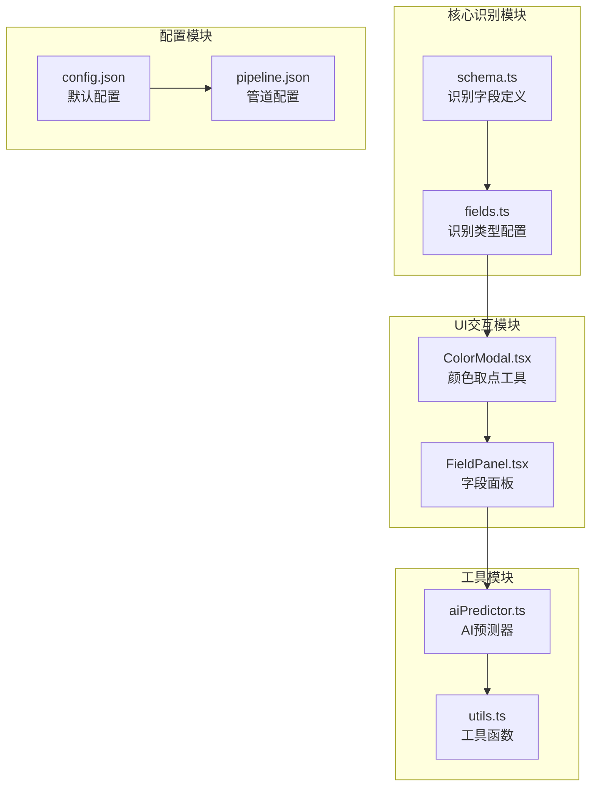
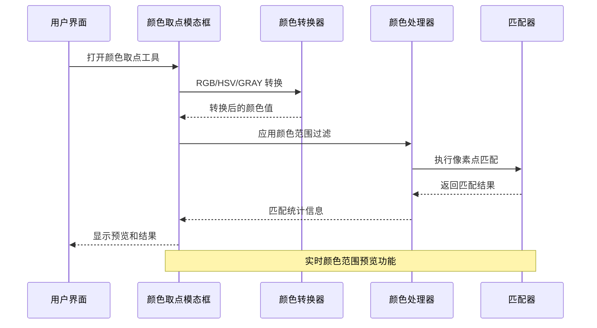
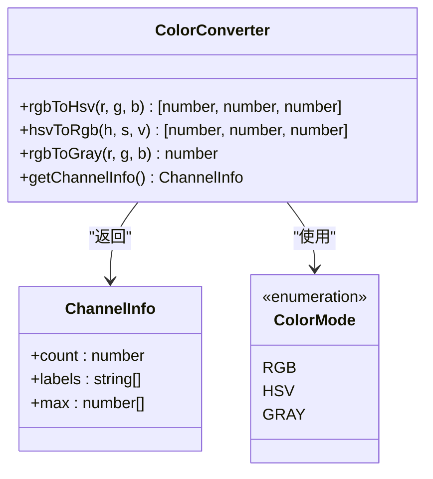
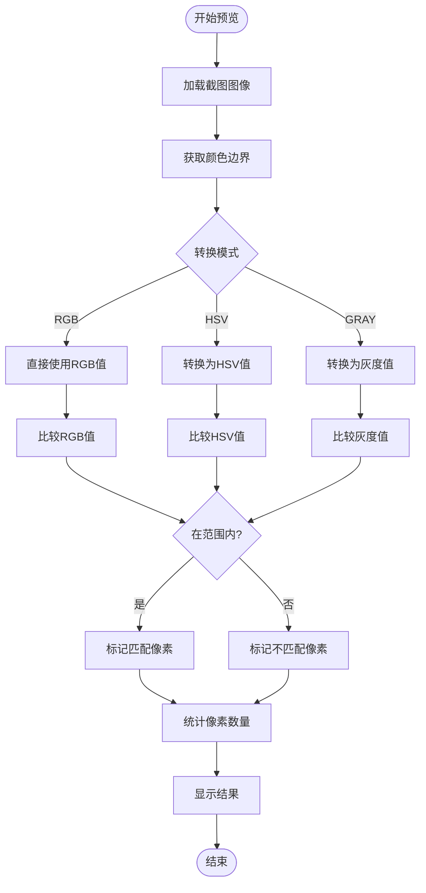
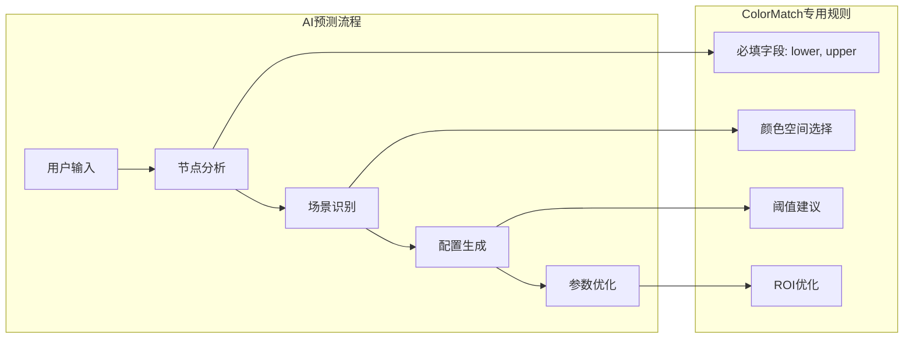
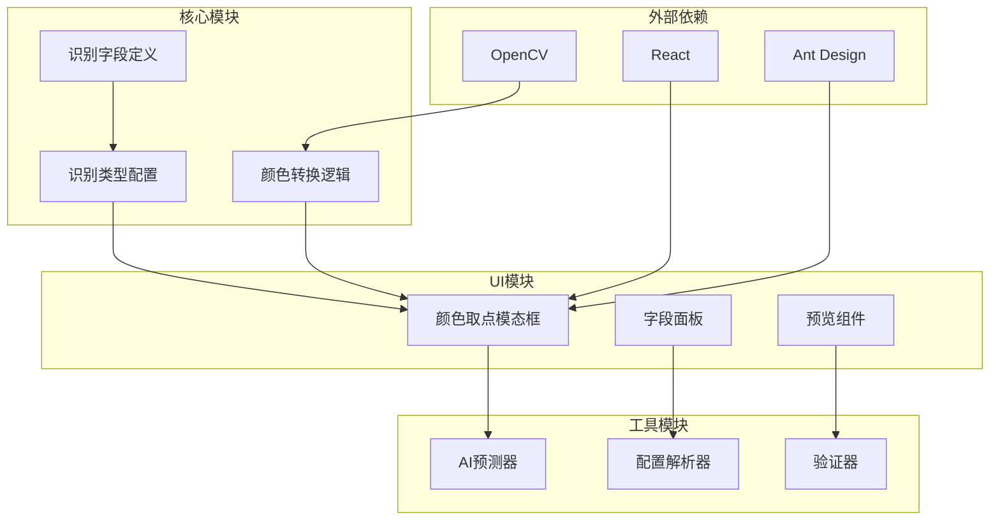

# ColorMatch 颜色匹配识别

<cite>
**本文档引用的文件**
- [schema.ts](file://src/core/fields/recognition/schema.ts)
- [fields.ts](file://src/core/fields/recognition/fields.ts)
- [ColorModal.tsx](file://src/components/modals/ColorModal.tsx)
- [aiPredictor.ts](file://src/utils/aiPredictor.ts)
- [README.md](file://README.md)
</cite>

## 目录
1. [简介](#简介)
2. [项目结构](#项目结构)
3. [核心组件](#核心组件)
4. [架构概览](#架构概览)
5. [详细组件分析](#详细组件分析)
6. [依赖关系分析](#依赖关系分析)
7. [性能考虑](#性能考虑)
8. [故障排除指南](#故障排除指南)
9. [结论](#结论)
10. [附录](#附录)

## 简介

ColorMatch 是一个基于颜色空间转换的颜色匹配识别系统，主要用于在图像中识别特定颜色区域。该系统支持多种颜色空间转换，包括RGB、HSV和灰度模式，能够实现精确的颜色识别和匹配。

该系统的核心功能包括：
- 多颜色空间支持（RGB、HSV、GRAY）
- 颜色范围阈值设置
- 像素点计数和连接性分析
- ROI（感兴趣区域）限定
- 结果排序和索引选择

## 项目结构

ColorMatch 颜色匹配识别系统在项目中的组织结构如下：

**图表来源**
- [schema.ts:116-148](file://src/core/fields/recognition/schema.ts#L116-L148)
- [fields.ts:40-53](file://src/core/fields/recognition/fields.ts#L40-L53)

**章节来源**
- [schema.ts:1-276](file://src/core/fields/recognition/schema.ts#L1-L276)
- [fields.ts:1-54](file://src/core/fields/recognition/fields.ts#L1-L54)

## 核心组件

### 颜色匹配字段定义

ColorMatch 系统的核心配置参数包括以下关键字段：

#### 颜色转换代码 (colorConversionCodes)
- **类型**: 整数 (Int)
- **默认值**: 4
- **描述**: 颜色匹配方式，对应 OpenCV 的 ColorConversionCodes
- **可用值**: 
  - 4: RGB (3通道)
  - 40: HSV (3通道) 
  - 6: GRAY (1通道)

#### 颜色范围 (lower/upper)
- **类型**: 整数列表或列表的列表
- **必需**: 是
- **描述**: 颜色范围的上下限值
- **通道要求**: 最内层数组长度需与 method 的通道数一致

#### 匹配数量 (colorMatchCount)
- **类型**: 整数 (Int)
- **默认值**: 1
- **描述**: 符合的像素点的最低数量要求（阈值）

#### 连通性 (connected)
- **类型**: 布尔值 (Bool)
- **默认值**: true
- **描述**: 是否要求像素点相连
- **行为**: 
  - true: 只会计数完全相连的最大块
  - false: 不考虑像素点是否相连

#### 排序方式 (areaOrderBy)
- **类型**: 字符串 (String)
- **默认值**: "Horizontal"
- **可用值**: "Horizontal" | "Vertical" | "Score" | "Area" | "Random"

#### 索引 (index)
- **类型**: 整数 (Int)
- **默认值**: 0
- **描述**: 命中第几个结果

**章节来源**
- [schema.ts:116-148](file://src/core/fields/recognition/schema.ts#L116-L148)
- [fields.ts:40-53](file://src/core/fields/recognition/fields.ts#L40-L53)

## 架构概览

ColorMatch 系统采用分层架构设计，实现了颜色识别的完整流程：

**图表来源**
- [ColorModal.tsx:101-191](file://src/components/modals/ColorModal.tsx#L101-L191)
- [ColorModal.tsx:232-331](file://src/components/modals/ColorModal.tsx#L232-L331)

## 详细组件分析

### 颜色转换器组件

颜色转换器负责在不同颜色空间之间进行转换，支持 RGB、HSV 和灰度三种模式：

**图表来源**
- [ColorModal.tsx:101-191](file://src/components/modals/ColorModal.tsx#L101-L191)
- [ColorModal.tsx:193-207](file://src/components/modals/ColorModal.tsx#L193-L207)

#### RGB 到 HSV 转换算法

RGB 到 HSV 的转换遵循标准算法：
- **H (色调)**: 通过 RGB 值的相对比例计算
- **S (饱和度)**: 饱和度 = (max - min) / max
- **V (明度)**: V = max

#### 颜色模式特性对比

| 颜色模式 | 通道数 | 取值范围 | 适用场景 |
|---------|--------|----------|----------|
| RGB | 3 | R:0-255, G:0-255, B:0-255 | 常规颜色识别，精确匹配 |
| HSV | 3 | H:0-360, S:0-100, V:0-100 | 光照变化场景，容忍亮度差异 |
| GRAY | 1 | 0-255 | 灰度图像，黑白界面识别 |

**章节来源**
- [ColorModal.tsx:101-191](file://src/components/modals/ColorModal.tsx#L101-L191)
- [ColorModal.tsx:193-207](file://src/components/modals/ColorModal.tsx#L193-L207)

### 颜色范围预览组件

颜色范围预览功能提供了实时的颜色匹配可视化：

**图表来源**
- [ColorModal.tsx:232-331](file://src/components/modals/ColorModal.tsx#L232-L331)

#### 预览功能特性

- **实时计算**: 使用 requestAnimationFrame 进行高效渲染
- **像素统计**: 显示匹配像素数量和占比
- **视觉反馈**: 绿色半透明高亮匹配区域，黑色半透明遮罩非匹配区域
- **性能优化**: 使用 ImageData 直接操作像素数据

**章节来源**
- [ColorModal.tsx:232-331](file://src/components/modals/ColorModal.tsx#L232-L331)
- [ColorModal.tsx:333-344](file://src/components/modals/ColorModal.tsx#L333-L344)

### AI 预测器集成

AI 预测器为 ColorMatch 提供智能配置建议：

**图表来源**
- [aiPredictor.ts:315-325](file://src/utils/aiPredictor.ts#L315-L325)

**章节来源**
- [aiPredictor.ts:315-325](file://src/utils/aiPredictor.ts#L315-L325)
- [aiPredictor.ts:391-402](file://src/utils/aiPredictor.ts#L391-L402)

## 依赖关系分析

ColorMatch 系统的依赖关系呈现清晰的层次结构：

**图表来源**
- [schema.ts:1-276](file://src/core/fields/recognition/schema.ts#L1-L276)
- [fields.ts:1-54](file://src/core/fields/recognition/fields.ts#L1-L54)

**章节来源**
- [schema.ts:1-276](file://src/core/fields/recognition/schema.ts#L1-L276)
- [fields.ts:1-54](file://src/core/fields/recognition/fields.ts#L1-L54)

## 性能考虑

### 颜色空间转换性能

不同颜色空间转换的性能特点：

| 转换方向 | 复杂度 | 性能特点 | 适用场景 |
|---------|--------|----------|----------|
| RGB → HSV | O(1) | 最快 | 实时预览 |
| HSV → RGB | O(1) | 快速 | 颜色显示 |
| RGB → GRAY | O(1) | 最快 | 简单灰度处理 |

### 像素处理优化

系统采用了多项性能优化技术：

1. **批量像素处理**: 使用单次遍历处理所有像素
2. **内存复用**: 重用 ImageData 对象避免频繁分配
3. **异步渲染**: 使用 requestAnimationFrame 避免阻塞UI线程
4. **条件渲染**: 仅在需要时重新计算预览

### 内存使用优化

- **ImageData 直接操作**: 避免中间变量创建
- **Canvas 缓存**: 复用画布对象减少GC压力
- **状态最小化**: 仅保存必要的状态信息

## 故障排除指南

### 常见问题及解决方案

#### 颜色范围不匹配

**问题**: 颜色范围设置正确但无法识别

**可能原因**:
1. 颜色空间选择错误
2. ROI 区域设置不当
3. 阈值设置过高

**解决方法**:
1. 检查颜色转换代码是否正确
2. 调整 ROI 区域范围
3. 降低 colorMatchCount 阈值

#### 性能问题

**问题**: 预览功能响应缓慢

**解决方法**:
1. 减少 ROI 区域大小
2. 降低图像分辨率
3. 关闭不必要的预览功能

#### 颜色识别不稳定

**问题**: 同一颜色在不同光照条件下识别不一致

**解决方法**:
1. 使用 HSV 颜色空间
2. 调整饱和度和明度阈值
3. 增加 connected 参数的使用

**章节来源**
- [ColorModal.tsx:232-331](file://src/components/modals/ColorModal.tsx#L232-L331)
- [schema.ts:116-148](file://src/core/fields/recognition/schema.ts#L116-L148)

## 结论

ColorMatch 颜色匹配识别系统是一个功能完整、性能优良的颜色识别解决方案。系统的主要优势包括：

1. **多颜色空间支持**: 支持 RGB、HSV、GRAY 三种颜色空间
2. **直观的UI交互**: 提供实时的颜色范围预览功能
3. **灵活的配置选项**: 支持详细的参数调整和优化
4. **智能AI辅助**: 提供配置建议和优化方案

该系统适用于各种颜色识别场景，包括游戏界面元素识别、状态指示灯检测、按钮颜色匹配等应用。

## 附录

### 配置参数完整列表

| 参数名 | 类型 | 默认值 | 描述 |
|-------|------|--------|------|
| method | Int | 4 | 颜色转换代码 (4=RGB, 40=HSV, 6=GRAY) |
| lower | IntList/List | [0,0,0] | 颜色下限值 |
| upper | IntList/List | [255,255,255] | 颜色上限值 |
| count | Int | 1 | 匹配像素点最低数量 |
| connected | Bool | true | 是否要求像素点相连 |
| order_by | String | "Horizontal" | 结果排序方式 |
| index | Int | 0 | 命中第几个结果 |

### 典型应用场景

1. **游戏自动化**: 识别游戏界面中的特定颜色元素
2. **状态监控**: 检测设备状态指示灯的颜色变化
3. **质量检测**: 在生产线上识别产品颜色缺陷
4. **图像处理**: 作为其他识别算法的预处理步骤

### 最佳实践建议

1. **颜色空间选择**: 
   - 静态颜色识别使用 RGB
   - 光照变化场景使用 HSV
   - 简单灰度场景使用 GRAY

2. **阈值设置**:
   - 从保守阈值开始，逐步放宽
   - 考虑噪声和边缘效应
   - 使用 connected 参数提高准确性

3. **ROI 优化**:
   - 尽量缩小识别区域
   - 避免包含无关背景
   - 考虑动态变化的区域