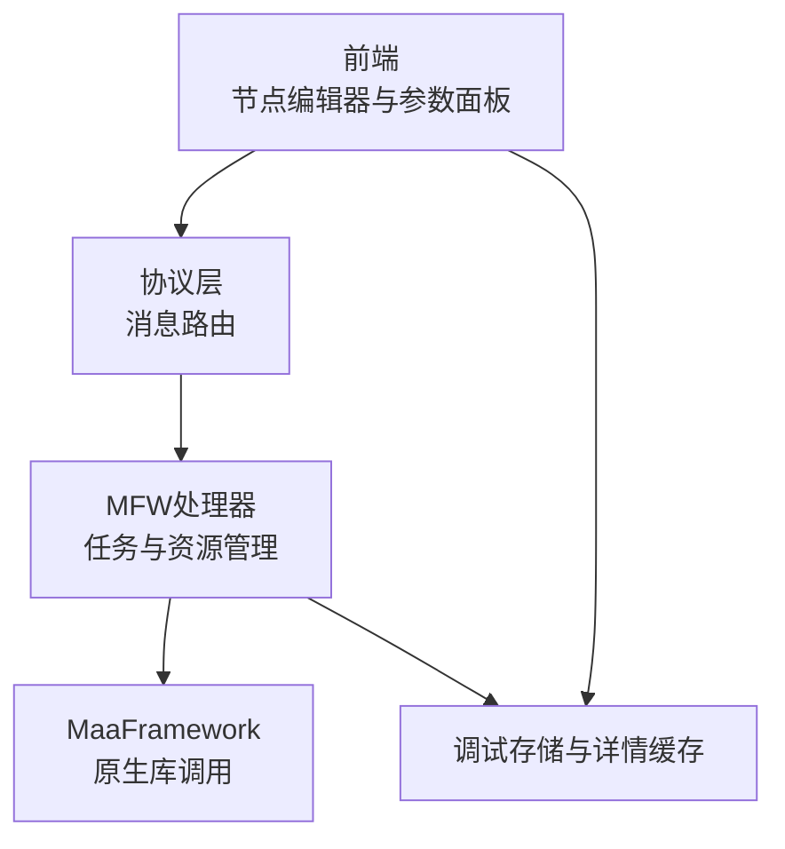
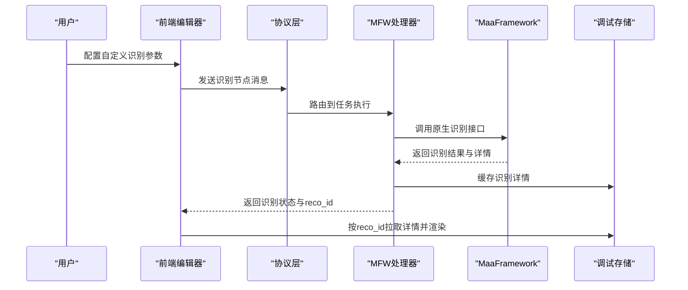
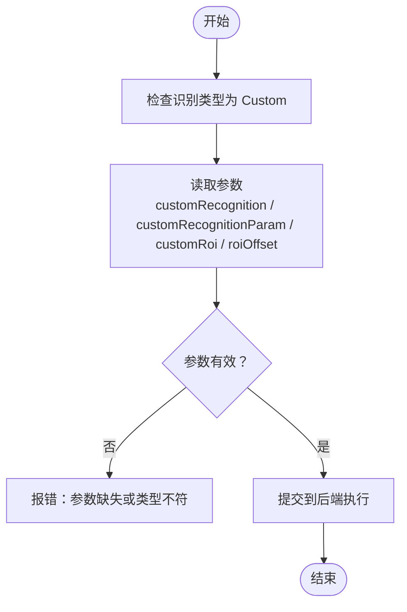
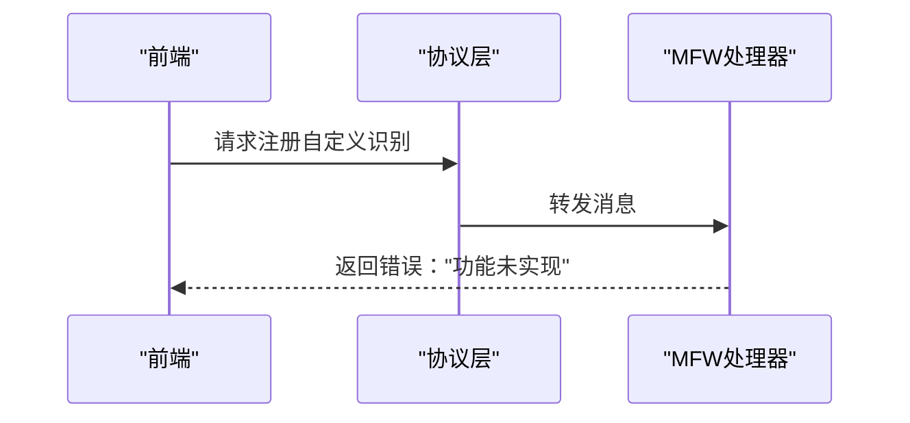
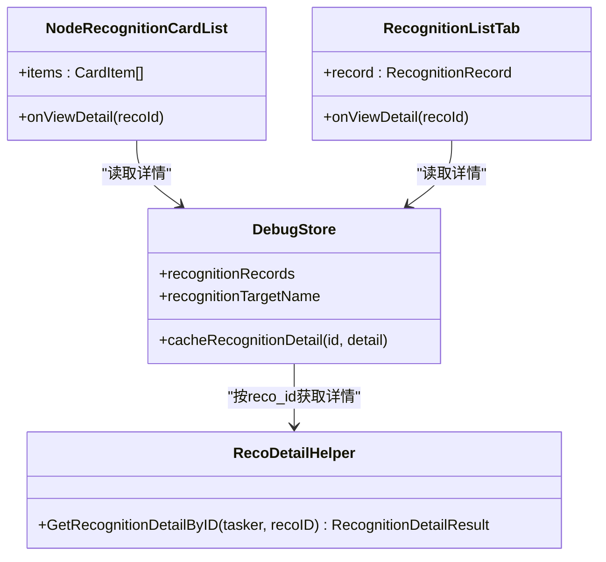
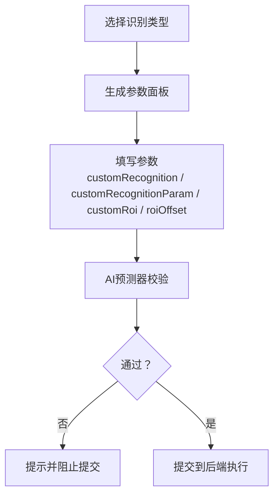
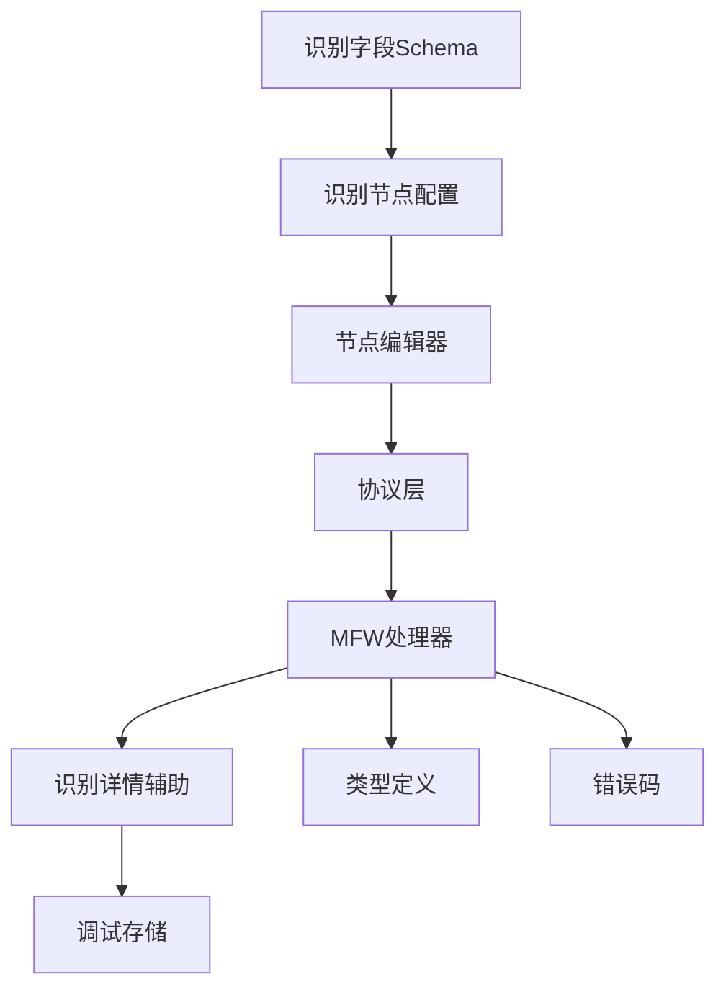

# 自定义识别

<cite>
**本文档引用的文件**
- [schema.ts](file://src/core/fields/recognition/schema.ts)
- [fields.ts](file://src/core/fields/recognition/fields.ts)
- [handler.go](file://LocalBridge/internal/protocol/mfw/handler.go)
- [reco_detail_helper.go](file://LocalBridge/internal/mfw/reco_detail_helper.go)
- [types.go](file://LocalBridge/internal/mfw/types.go)
- [error.go](file://LocalBridge/internal/mfw/error.go)
- [NodeRecognitionCardList.tsx](file://src/components/panels/tools/NodeRecognitionCardList.tsx)
- [RecognitionListTab.tsx](file://src/components/panels/tools/RecognitionListTab.tsx)
- [debugStore.ts](file://src/stores/debugStore.ts)
- [PipelineEditor.tsx](file://src/components/panels/node-editors/PipelineEditor.tsx)
- [aiPredictor.ts](file://src/utils/aiPredictor.ts)
- [default_pipeline.json](file://LocalBridge/test-json/base/default_pipeline.json)
</cite>

## 目录
1. [简介](#简介)
2. [项目结构](#项目结构)
3. [核心组件](#核心组件)
4. [架构总览](#架构总览)
5. [详细组件分析](#详细组件分析)
6. [依赖分析](#依赖分析)
7. [性能考量](#性能考量)
8. [故障排查指南](#故障排查指南)
9. [结论](#结论)
10. [附录](#附录)

## 简介
本文件围绕“自定义识别”类型展开，系统性说明如何在本项目中使用 MaaResourceRegisterCustomRecognition 接口注册自定义识别器，并在前端可视化编辑器中配置与调试。内容涵盖：
- 自定义识别器的注册与调用机制
- 配置参数详解：自定义识别名、自定义识别参数、自定义ROI区域、ROI偏移
- 开发与集成指南：回调参数传递、调试画像与识别详情获取
- 应用场景与实现注意事项：典型业务用例、常见陷阱与最佳实践

## 项目结构
自定义识别涉及前后端协同：
- 前端负责参数配置与可视化展示，定义识别字段与节点编辑器
- 后端负责资源加载、任务执行与识别详情回传
- 通信协议负责将前端指令下发到后端并接收执行结果

图表来源
- [fields.ts:54-62](file://src/core/fields/recognition/fields.ts#L54-L62)
- [handler.go:802-806](file://LocalBridge/internal/protocol/mfw/handler.go#L802-L806)
- [reco_detail_helper.go:85-162](file://LocalBridge/internal/mfw/reco_detail_helper.go#L85-L162)

章节来源
- [fields.ts:54-62](file://src/core/fields/recognition/fields.ts#L54-L62)
- [schema.ts:248-268](file://src/core/fields/recognition/schema.ts#L248-L268)

## 核心组件
- 自定义识别字段定义：在识别字段 Schema 中定义了自定义识别所需的键、类型、默认值与描述
- 自定义识别节点类型：在识别节点配置中声明 Custom 类型及其参数集合
- 注册接口占位：协议层预留了自定义识别注册的消息处理，当前标记为“功能未实现”
- 识别详情辅助：通过原生 API 获取识别名称、算法、命中框、原始截图与绘制图像
- 调试与详情展示：前端识别卡片与列表组件展示识别状态与详情

章节来源
- [schema.ts:248-268](file://src/core/fields/recognition/schema.ts#L248-L268)
- [fields.ts:54-62](file://src/core/fields/recognition/fields.ts#L54-L62)
- [handler.go:802-806](file://LocalBridge/internal/protocol/mfw/handler.go#L802-L806)
- [reco_detail_helper.go:168-267](file://LocalBridge/internal/mfw/reco_detail_helper.go#L168-L267)

## 架构总览
自定义识别的端到端流程如下：

图表来源
- [handler.go:802-806](file://LocalBridge/internal/protocol/mfw/handler.go#L802-L806)
- [reco_detail_helper.go:168-267](file://LocalBridge/internal/mfw/reco_detail_helper.go#L168-L267)
- [debugStore.ts:597-685](file://src/stores/debugStore.ts#L597-L685)

## 详细组件分析

### 自定义识别字段与节点类型
- 字段定义
  - customRecognition：必填字符串，对应注册时的识别名，同时通过回调传出
  - customRecognitionParam：可选任意类型参数，通过回调传出
  - customRoi：可选ROI区域，支持数组[x,y,w,h]或字符串引用前置节点名
- 节点类型
  - Custom 类型包含上述参数，并描述为“执行通过 MaaResourceRegisterCustomRecognition 接口传入的识别器句柄”

图表来源
- [fields.ts:54-62](file://src/core/fields/recognition/fields.ts#L54-L62)
- [schema.ts:248-268](file://src/core/fields/recognition/schema.ts#L248-L268)

章节来源
- [fields.ts:54-62](file://src/core/fields/recognition/fields.ts#L54-L62)
- [schema.ts:248-268](file://src/core/fields/recognition/schema.ts#L248-L268)

### 注册接口与协议层
- 当前协议层对自定义识别注册的消息处理标记为“功能未实现”，返回资源加载失败错误
- 该占位为未来扩展预留，当前阶段应通过框架侧的 MaaResourceRegisterCustomRecognition 完成注册

图表来源
- [handler.go:802-806](file://LocalBridge/internal/protocol/mfw/handler.go#L802-L806)
- [error.go:6-21](file://LocalBridge/internal/mfw/error.go#L6-L21)

章节来源
- [handler.go:802-806](file://LocalBridge/internal/protocol/mfw/handler.go#L802-L806)
- [error.go:6-21](file://LocalBridge/internal/mfw/error.go#L6-L21)

### 识别详情与调试展示
- 后端通过原生 API 获取识别详情：名称、算法、命中状态、框坐标、原始截图与绘制图像
- 前端识别卡片与列表根据 reco_id 拉取详情并高亮命中状态
- 调试存储缓存识别详情，便于查看详情弹窗与历史记录

图表来源
- [debugStore.ts:597-685](file://src/stores/debugStore.ts#L597-L685)
- [NodeRecognitionCardList.tsx:81-106](file://src/components/panels/tools/NodeRecognitionCardList.tsx#L81-L106)
- [RecognitionListTab.tsx:71-105](file://src/components/panels/tools/RecognitionListTab.tsx#L71-L105)
- [reco_detail_helper.go:168-267](file://LocalBridge/internal/mfw/reco_detail_helper.go#L168-L267)

章节来源
- [debugStore.ts:597-685](file://src/stores/debugStore.ts#L597-L685)
- [NodeRecognitionCardList.tsx:81-106](file://src/components/panels/tools/NodeRecognitionCardList.tsx#L81-L106)
- [RecognitionListTab.tsx:71-105](file://src/components/panels/tools/RecognitionListTab.tsx#L71-L105)
- [reco_detail_helper.go:168-267](file://LocalBridge/internal/mfw/reco_detail_helper.go#L168-L267)

### 参数配置与校验
- 前端节点编辑器根据识别类型动态生成参数面板
- AI预测器对识别参数进行基础校验，避免无效组合
- 默认配置与校验逻辑确保参数完整性与一致性

图表来源
- [PipelineEditor.tsx:346-383](file://src/components/panels/node-editors/PipelineEditor.tsx#L346-L383)
- [aiPredictor.ts:606-647](file://src/utils/aiPredictor.ts#L606-L647)
- [default_pipeline.json:1-7](file://LocalBridge/test-json/base/default_pipeline.json#L1-L7)

章节来源
- [PipelineEditor.tsx:346-383](file://src/components/panels/node-editors/PipelineEditor.tsx#L346-L383)
- [aiPredictor.ts:606-647](file://src/utils/aiPredictor.ts#L606-L647)
- [default_pipeline.json:1-7](file://LocalBridge/test-json/base/default_pipeline.json#L1-L7)

## 依赖分析
- 前端识别字段与节点类型依赖于统一的 Schema 与字段配置
- 协议层与 MFW 处理器负责消息路由与资源/任务管理
- 调试存储与详情辅助模块共同支撑可视化调试体验

图表来源
- [schema.ts:1-276](file://src/core/fields/recognition/schema.ts#L1-L276)
- [fields.ts:1-115](file://src/core/fields/recognition/fields.ts#L1-L115)
- [handler.go:802-806](file://LocalBridge/internal/protocol/mfw/handler.go#L802-L806)
- [reco_detail_helper.go:1-162](file://LocalBridge/internal/mfw/reco_detail_helper.go#L1-L162)
- [types.go:1-124](file://LocalBridge/internal/mfw/types.go#L1-L124)
- [error.go:1-53](file://LocalBridge/internal/mfw/error.go#L1-L53)

章节来源
- [schema.ts:1-276](file://src/core/fields/recognition/schema.ts#L1-L276)
- [fields.ts:1-115](file://src/core/fields/recognition/fields.ts#L1-L115)
- [handler.go:802-806](file://LocalBridge/internal/protocol/mfw/handler.go#L802-L806)
- [reco_detail_helper.go:1-162](file://LocalBridge/internal/mfw/reco_detail_helper.go#L1-L162)
- [types.go:1-124](file://LocalBridge/internal/mfw/types.go#L1-L124)
- [error.go:1-53](file://LocalBridge/internal/mfw/error.go#L1-L53)

## 性能考量
- 自定义识别的性能取决于底层算法与图像处理开销，建议：
  - 合理设置 ROI，缩小识别范围
  - 使用合适的模板/特征匹配参数，避免过度计算
  - 在高频识别场景中启用缓存与批处理策略（如可用）
- 前端渲染与调试详情的图片传输可能带来带宽压力，建议按需加载与压缩

## 故障排查指南
- 注册接口未实现
  - 现象：前端请求注册自定义识别返回“功能未实现”
  - 处理：按照框架文档完成 MaaResourceRegisterCustomRecognition 注册，而非通过协议层
- 识别参数错误
  - 现象：参数类型不符或缺失导致校验失败
  - 处理：核对 customRecognition、customRecognitionParam、customRoi 的类型与格式
- 识别详情为空
  - 现象：reco_id 存在但详情为空
  - 处理：确认后端已调用原生 API 并缓存详情；检查任务上下文与回调时机
- 调试卡片不显示详情
  - 现象：点击查看详情无响应
  - 处理：确认调试存储中存在对应 reco_id 的缓存；检查前端组件的详情拉取逻辑

章节来源
- [handler.go:802-806](file://LocalBridge/internal/protocol/mfw/handler.go#L802-L806)
- [error.go:6-21](file://LocalBridge/internal/mfw/error.go#L6-L21)
- [debugStore.ts:597-685](file://src/stores/debugStore.ts#L597-L685)
- [NodeRecognitionCardList.tsx:81-106](file://src/components/panels/tools/NodeRecognitionCardList.tsx#L81-L106)

## 结论
本项目已完整定义自定义识别的字段与节点类型，并在协议层预留了注册接口。当前阶段，注册与回调参数的传递需通过框架侧接口完成；前端负责参数配置、可视化调试与详情展示。遵循本文档的配置与注意事项，可高效集成自定义识别能力。

## 附录

### 配置参数速查
- customRecognition：必填字符串，对应注册时的识别名
- customRecognitionParam：可选任意类型，作为回调参数透传
- customRoi：可选，数组[x,y,w,h]或字符串引用前置节点名
- roiOffset：可选，基于 ROI 的额外偏移

章节来源
- [schema.ts:248-268](file://src/core/fields/recognition/schema.ts#L248-L268)
- [fields.ts:54-62](file://src/core/fields/recognition/fields.ts#L54-L62)