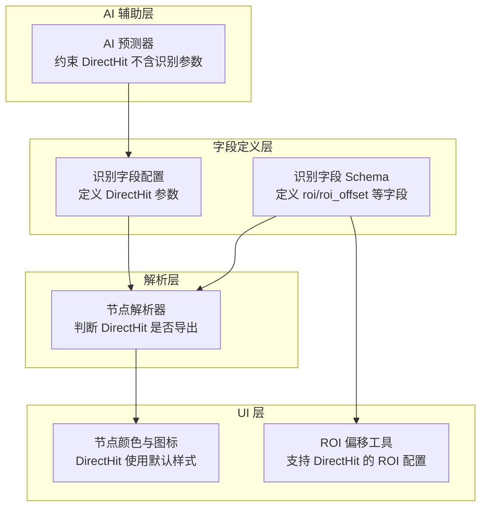
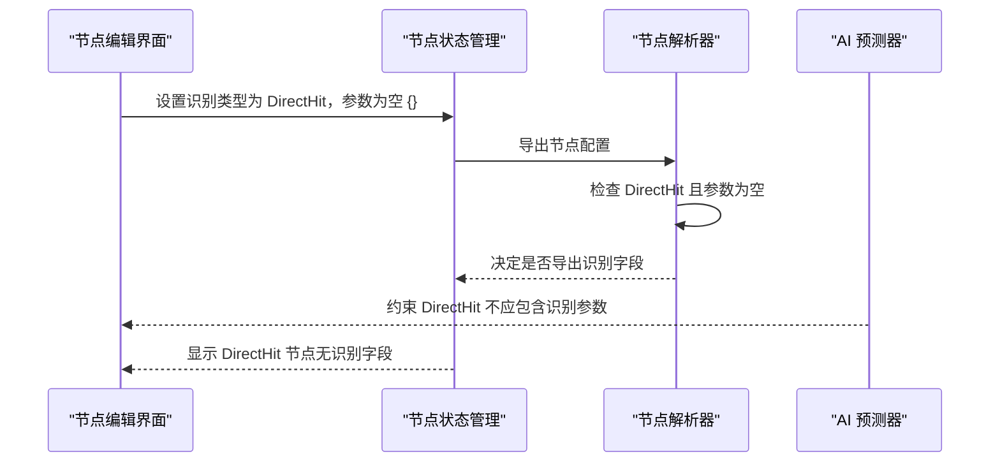
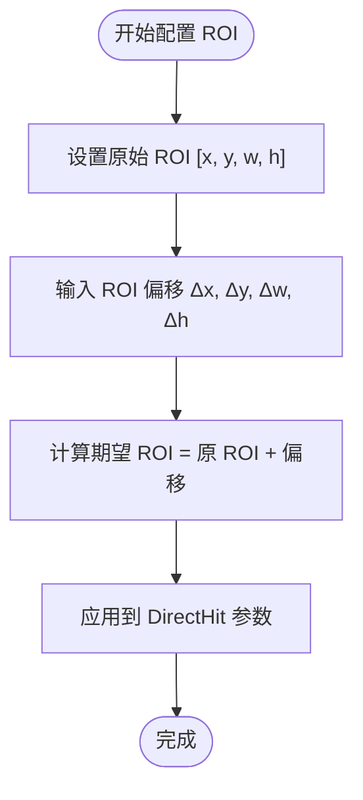
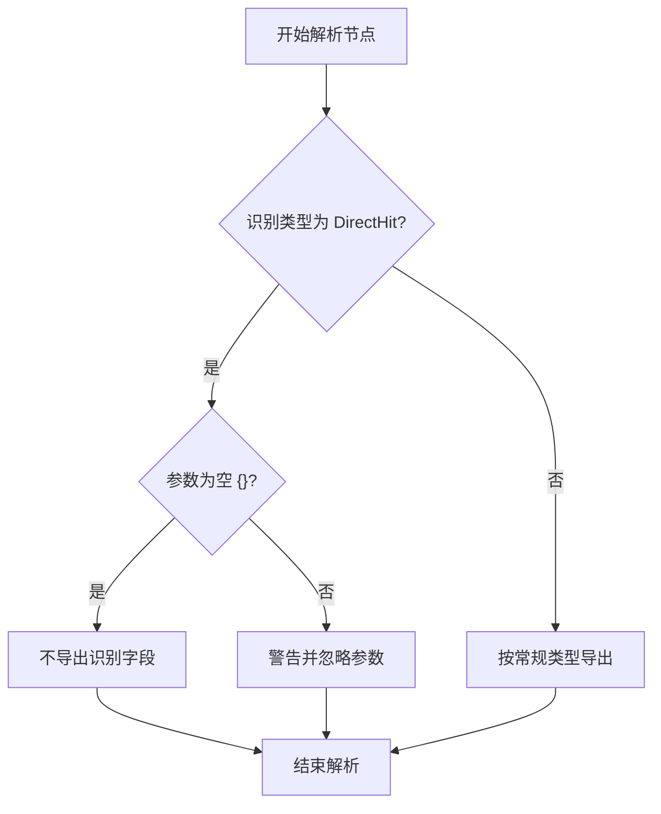
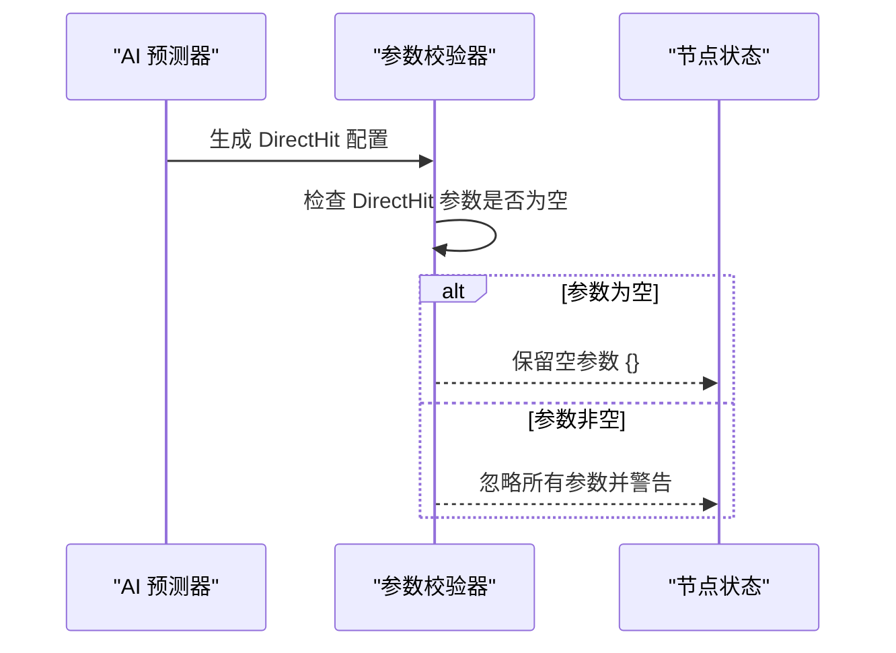
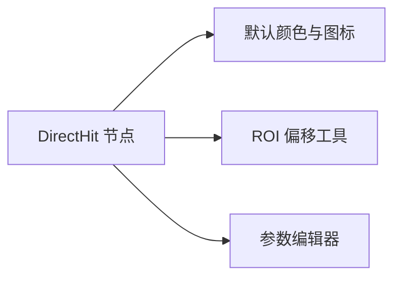
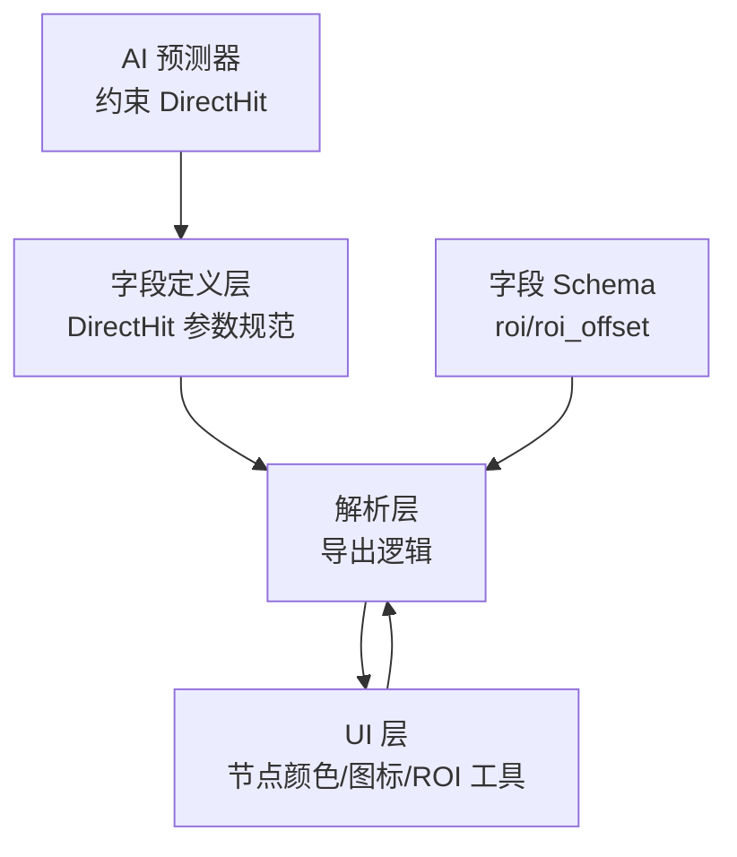

# DirectHit 直接命中识别

<cite>
**本文档引用的文件**
- [fields.ts](file://src/core/fields/recognition/fields.ts)
- [schema.ts](file://src/core/fields/recognition/schema.ts)
- [aiPredictor.ts](file://src/utils/aiPredictor.ts)
- [utils.ts](file://src/components/flow/nodes/utils.ts)
- [nodeParser.ts](file://src/core/parser/nodeParser.ts)
- [nodeSlice.ts](file://src/stores/flow/slices/nodeSlice.ts)
- [nodeUtils.ts](file://src/stores/flow/utils/nodeUtils.ts)
- [ROIOffsetModal.tsx](file://src/components/modals/ROIOffsetModal.tsx)
- [OCRModal.tsx](file://src/components/modals/OCRModal.tsx)
- [ParamFieldListElem.tsx](file://src/components/panels/field/items/ParamFieldListElem.tsx)
</cite>

## 目录
1. [简介](#简介)
2. [项目结构](#项目结构)
3. [核心组件](#核心组件)
4. [架构总览](#架构总览)
5. [详细组件分析](#详细组件分析)
6. [依赖关系分析](#依赖关系分析)
7. [性能考量](#性能考量)
8. [故障排除指南](#故障排除指南)
9. [结论](#结论)
10. [附录](#附录)

## 简介
DirectHit 是一种特殊的识别类型，其核心特点是“不进行实际识别，直接执行动作”。它不依赖任何模板、颜色或文字等识别参数，也不使用 expected、template、roi 等识别字段。DirectHit 适合用于无条件执行的动作节点，例如起始节点、流程控制节点或需要立即触发的动作。

DirectHit 的配置非常简洁：识别类型为 DirectHit，参数对象为空（即 param: {}）。这种设计确保了 DirectHit 在解析和导出时不会携带任何识别相关的冗余字段，从而简化配置并避免误用。

## 项目结构
DirectHit 的实现涉及多个层面的文件：
- 字段定义层：在识别字段配置中定义 DirectHit 的可用参数（ROI 相关参数）。
- 解析层：在节点解析过程中，DirectHit 的空参数将决定是否导出识别字段。
- UI 层：在节点编辑界面中，DirectHit 的参数编辑与其它识别类型保持一致，但校验逻辑会拒绝非空参数。
- AI 辅助层：AI 预测器在生成配置时，会明确指出 DirectHit 不应包含任何识别参数。



**图表来源**
- [fields.ts:7-11](file://src/core/fields/recognition/fields.ts#L7-L11)
- [schema.ts:9-19](file://src/core/fields/recognition/schema.ts#L9-L19)
- [nodeParser.ts:88-96](file://src/core/parser/nodeParser.ts#L88-L96)
- [utils.ts:111-138](file://src/components/flow/nodes/utils.ts#L111-L138)
- [ROIOffsetModal.tsx:527-936](file://src/components/modals/ROIOffsetModal.tsx#L527-L936)
- [aiPredictor.ts:278-282](file://src/utils/aiPredictor.ts#L278-L282)

**章节来源**
- [fields.ts:7-11](file://src/core/fields/recognition/fields.ts#L7-L11)
- [schema.ts:9-19](file://src/core/fields/recognition/schema.ts#L9-L19)
- [nodeParser.ts:88-96](file://src/core/parser/nodeParser.ts#L88-L96)
- [utils.ts:111-138](file://src/components/flow/nodes/utils.ts#L111-L138)
- [ROIOffsetModal.tsx:527-936](file://src/components/modals/ROIOffsetModal.tsx#L527-L936)
- [aiPredictor.ts:278-282](file://src/utils/aiPredictor.ts#L278-L282)

## 核心组件
- DirectHit 类型定义：在识别字段配置中，DirectHit 被定义为仅支持 ROI 相关参数（roi、roi_offset），描述为“直接命中，即不进行识别，直接执行动作”。
- ROI 参数：DirectHit 支持 roi 和 roi_offset 两个通用参数，用于限定动作执行的区域范围。
- 解析逻辑：在节点解析阶段，当识别类型为 DirectHit 且参数为空时，将决定是否导出识别字段，避免导出冗余配置。
- UI 样式：DirectHit 在节点颜色与图标上采用默认样式，便于区分其“无识别”的特性。
- AI 约束：AI 预测器明确指出 DirectHit 不应包含任何识别参数，否则将被忽略。

**章节来源**
- [fields.ts:7-11](file://src/core/fields/recognition/fields.ts#L7-L11)
- [schema.ts:9-19](file://src/core/fields/recognition/schema.ts#L9-L19)
- [nodeParser.ts:88-96](file://src/core/parser/nodeParser.ts#L88-L96)
- [utils.ts:111-138](file://src/components/flow/nodes/utils.ts#L111-L138)
- [aiPredictor.ts:278-282](file://src/utils/aiPredictor.ts#L278-L282)

## 架构总览
DirectHit 的工作流从 UI 编辑开始，经过字段校验、解析导出，最终在运行时直接执行动作。AI 预测器在整个流程中提供约束，确保 DirectHit 不携带识别参数。



**图表来源**
- [nodeSlice.ts:420-433](file://src/stores/flow/slices/nodeSlice.ts#L420-L433)
- [nodeParser.ts:88-96](file://src/core/parser/nodeParser.ts#L88-L96)
- [aiPredictor.ts:516-517](file://src/utils/aiPredictor.ts#L516-L517)

**章节来源**
- [nodeSlice.ts:420-433](file://src/stores/flow/slices/nodeSlice.ts#L420-L433)
- [nodeParser.ts:88-96](file://src/core/parser/nodeParser.ts#L88-L96)
- [aiPredictor.ts:516-517](file://src/utils/aiPredictor.ts#L516-L517)

## 详细组件分析

### DirectHit 类型与参数
DirectHit 的类型定义明确了其“无识别”的本质，仅支持 ROI 相关参数，用于限定动作执行区域。参数校验确保 DirectHit 的 param 必须为空对象，避免误用识别参数。

```mermaid
classDiagram
class DirectHit {
+类型 : "DirectHit"
+参数 : {}
+描述 : "直接命中，即不进行识别，直接执行动作"
+支持参数 : roi, roi_offset
}
class ROI参数 {
+roi : "[x, y, w, h]"
+roi_offset : "[Δx, Δy, Δw, Δh]"
}
DirectHit --> ROI参数 : "使用"
```

**图表来源**
- [fields.ts:7-11](file://src/core/fields/recognition/fields.ts#L7-L11)
- [schema.ts:9-19](file://src/core/fields/recognition/schema.ts#L9-L19)

**章节来源**
- [fields.ts:7-11](file://src/core/fields/recognition/fields.ts#L7-L11)
- [schema.ts:9-19](file://src/core/fields/recognition/schema.ts#L9-L19)

### ROI 区域与 ROI 偏移配置
DirectHit 支持通过 roi 和 roi_offset 来定义动作执行的区域。ROI 偏移工具允许用户直观地计算期望 ROI，支持 Δx、Δy、Δw、Δh 的输入，并自动计算期望 ROI。



**图表来源**
- [ROIOffsetModal.tsx:527-936](file://src/components/modals/ROIOffsetModal.tsx#L527-L936)
- [ParamFieldListElem.tsx:326-344](file://src/components/panels/field/items/ParamFieldListElem.tsx#L326-L344)

**章节来源**
- [ROIOffsetModal.tsx:527-936](file://src/components/modals/ROIOffsetModal.tsx#L527-L936)
- [ParamFieldListElem.tsx:326-344](file://src/components/panels/field/items/ParamFieldListElem.tsx#L326-L344)

### 解析与导出逻辑
在节点解析阶段，DirectHit 的空参数决定了是否导出识别字段。这有助于减少配置冗余，提升可读性。



**图表来源**
- [nodeParser.ts:88-96](file://src/core/parser/nodeParser.ts#L88-L96)

**章节来源**
- [nodeParser.ts:88-96](file://src/core/parser/nodeParser.ts#L88-L96)

### AI 预测与约束
AI 预测器在生成配置时，明确约束 DirectHit 不应包含任何识别参数，否则将被忽略。这一约束确保了 DirectHit 的纯粹性。



**图表来源**
- [aiPredictor.ts:619-632](file://src/utils/aiPredictor.ts#L619-L632)

**章节来源**
- [aiPredictor.ts:619-632](file://src/utils/aiPredictor.ts#L619-L632)

### UI 样式与交互
DirectHit 在 UI 上使用默认的节点颜色与图标，便于用户识别其“无识别”的特性。ROI 偏移工具与参数编辑器支持 DirectHit 的 ROI 配置。



**图表来源**
- [utils.ts:111-138](file://src/components/flow/nodes/utils.ts#L111-L138)
- [ROIOffsetModal.tsx:527-936](file://src/components/modals/ROIOffsetModal.tsx#L527-L936)
- [OCRModal.tsx:724-764](file://src/components/modals/OCRModal.tsx#L724-L764)

**章节来源**
- [utils.ts:111-138](file://src/components/flow/nodes/utils.ts#L111-L138)
- [ROIOffsetModal.tsx:527-936](file://src/components/modals/ROIOffsetModal.tsx#L527-L936)
- [OCRModal.tsx:724-764](file://src/components/modals/OCRModal.tsx#L724-L764)

## 依赖关系分析
DirectHit 的实现依赖于字段定义、解析器、UI 组件和 AI 预测器之间的协作。字段定义层提供 DirectHit 的参数规范；解析层负责在导出时处理 DirectHit 的空参数；UI 层提供 ROI 配置工具；AI 层提供约束以保证 DirectHit 的正确使用。



**图表来源**
- [fields.ts:7-11](file://src/core/fields/recognition/fields.ts#L7-L11)
- [schema.ts:9-19](file://src/core/fields/recognition/schema.ts#L9-L19)
- [nodeParser.ts:88-96](file://src/core/parser/nodeParser.ts#L88-L96)
- [utils.ts:111-138](file://src/components/flow/nodes/utils.ts#L111-L138)
- [aiPredictor.ts:278-282](file://src/utils/aiPredictor.ts#L278-L282)

**章节来源**
- [fields.ts:7-11](file://src/core/fields/recognition/fields.ts#L7-L11)
- [schema.ts:9-19](file://src/core/fields/recognition/schema.ts#L9-L19)
- [nodeParser.ts:88-96](file://src/core/parser/nodeParser.ts#L88-L96)
- [utils.ts:111-138](file://src/components/flow/nodes/utils.ts#L111-L138)
- [aiPredictor.ts:278-282](file://src/utils/aiPredictor.ts#L278-L282)

## 性能考量
- DirectHit 不进行任何识别操作，因此在性能上几乎不产生额外开销。
- ROI 区域的设置可以缩小动作执行范围，减少不必要的屏幕处理。
- ROI 偏移工具的使用有助于更精确地定位目标区域，提高动作成功率。

[本节为通用指导，不直接分析具体文件]

## 故障排除指南
- DirectHit 参数错误：确保 DirectHit 的参数对象为空（{}），不要添加 expected、template、roi 等识别参数。AI 预测器会忽略非空参数并发出警告。
- ROI 配置问题：使用 ROI 偏移工具计算期望 ROI，确保 Δx、Δy、Δw、Δh 的输入正确。
- 导出配置冗余：由于 DirectHit 的空参数，解析器将决定是否导出识别字段，避免导出冗余配置。

**章节来源**
- [aiPredictor.ts:619-632](file://src/utils/aiPredictor.ts#L619-L632)
- [ROIOffsetModal.tsx:527-936](file://src/components/modals/ROIOffsetModal.tsx#L527-L936)
- [nodeParser.ts:88-96](file://src/core/parser/nodeParser.ts#L88-L96)

## 结论
DirectHit 是一种简洁高效的识别类型，适用于无条件执行的动作节点。通过严格的参数约束和解析逻辑，DirectHit 确保了配置的纯净性与可读性。配合 ROI 区域与 ROI 偏移工具，用户可以精确控制动作执行范围，提升自动化脚本的稳定性与效率。

[本节为总结性内容，不直接分析具体文件]

## 附录

### DirectHit 使用场景与配置示例
- 无条件执行的起始节点：DirectHit 适合用作流程的起始节点，不需要任何识别条件，直接执行动作。
- 纯流程控制节点：在复杂的自动化流程中，DirectHit 可用于跳过识别环节，直接进入下一步动作。
- ROI 精确定位：通过 roi 和 roi_offset 精确设置动作执行区域，确保动作在正确的屏幕区域内执行。

**章节来源**
- [aiPredictor.ts:398-402](file://src/utils/aiPredictor.ts#L398-L402)
- [ROIOffsetModal.tsx:527-936](file://src/components/modals/ROIOffsetModal.tsx#L527-L936)

### 与其他识别类型的对比与选择建议
- DirectHit vs OCR：OCR 用于文字识别，需要设置 expected；DirectHit 不进行识别，直接执行动作。
- DirectHit vs TemplateMatch：TemplateMatch 用于模板匹配，需要设置 template；DirectHit 不进行识别，直接执行动作。
- DirectHit vs ColorMatch：ColorMatch 用于颜色匹配，需要设置 lower 和 upper；DirectHit 不进行识别，直接执行动作。
- 选择建议：当不需要任何识别条件，仅需无条件执行动作时，选择 DirectHit；当需要基于文字、图像或颜色进行识别时，选择相应的识别类型。

**章节来源**
- [aiPredictor.ts:386-402](file://src/utils/aiPredictor.ts#L386-L402)
- [fields.ts:12-53](file://src/core/fields/recognition/fields.ts#L12-L53)