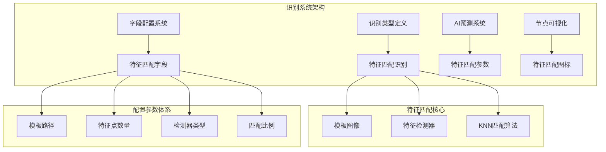
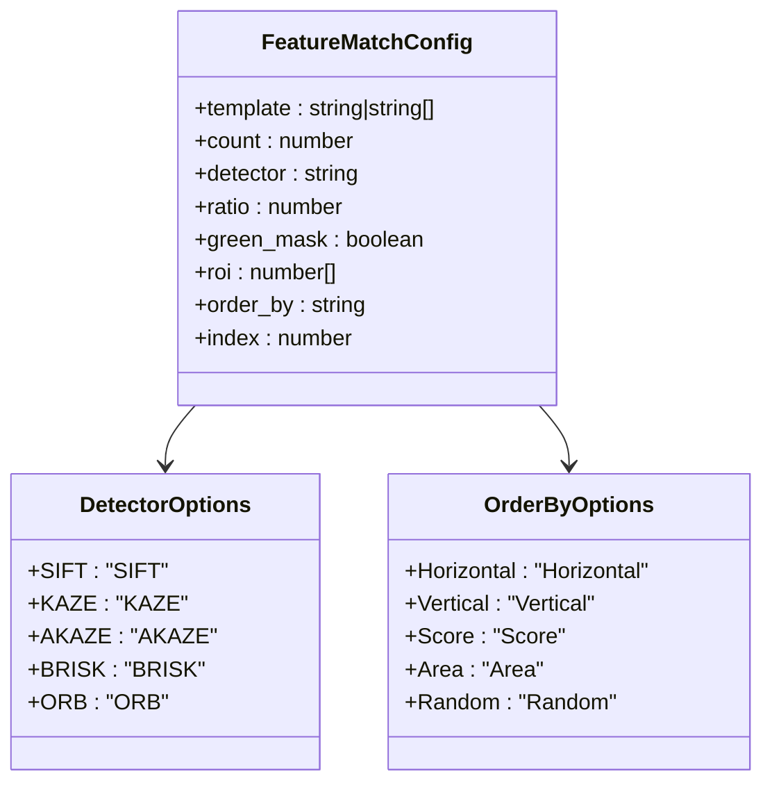
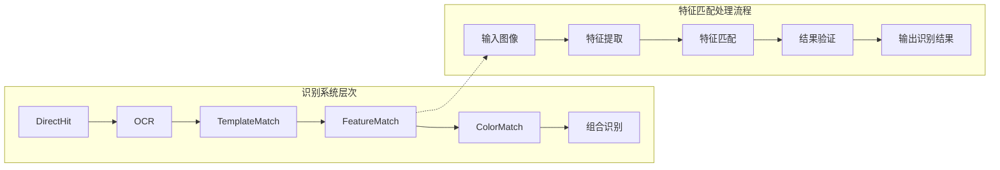
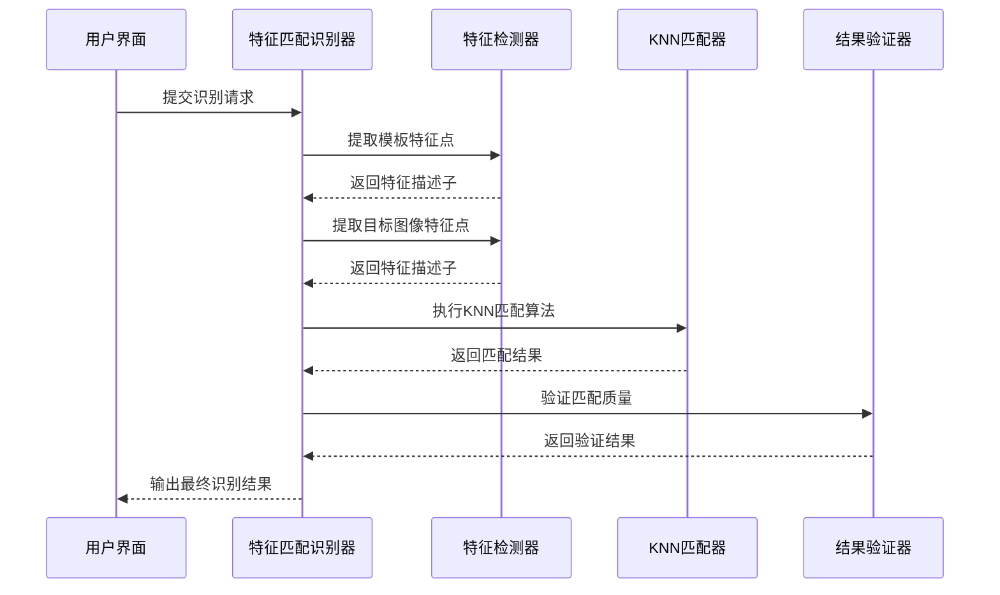
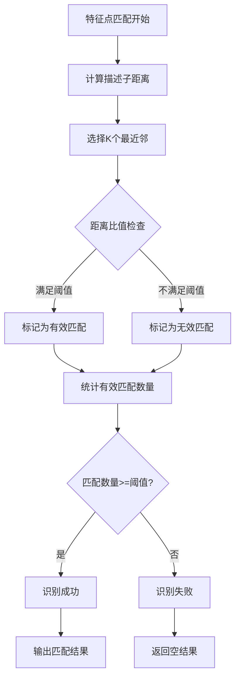
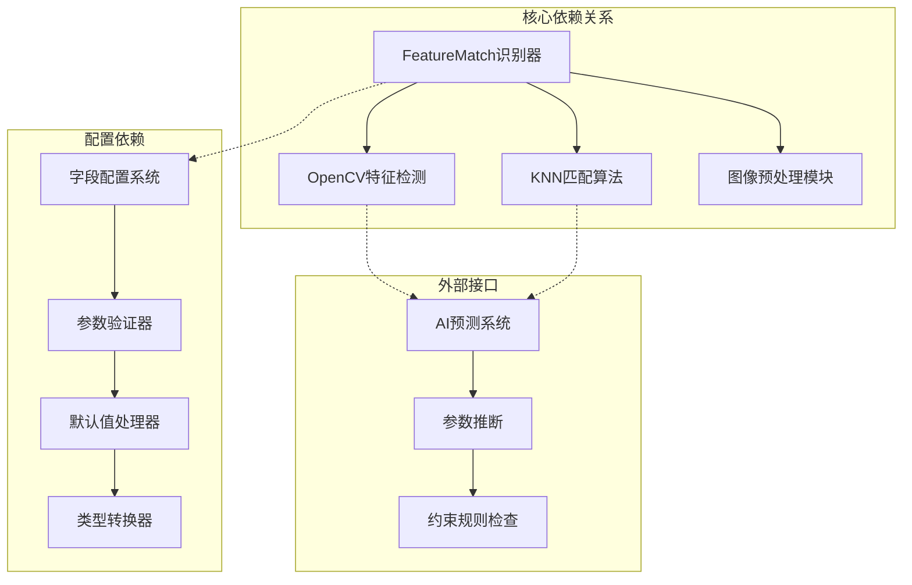
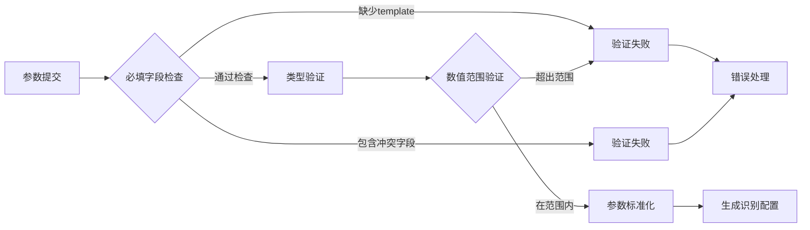

# FeatureMatch 特征匹配识别

<cite>
**本文档引用的文件**
- [schema.ts](file://src/core/fields/recognition/schema.ts)
- [fields.ts](file://src/core/fields/recognition/fields.ts)
- [aiPredictor.ts](file://src/utils/aiPredictor.ts)
- [utils.ts](file://src/components/flow/nodes/utils.ts)
</cite>

## 目录
1. [简介](#简介)
2. [项目结构](#项目结构)
3. [核心组件](#核心组件)
4. [架构概览](#架构概览)
5. [详细组件分析](#详细组件分析)
6. [依赖关系分析](#依赖关系分析)
7. [性能考量](#性能考量)
8. [故障排除指南](#故障排除指南)
9. [结论](#结论)
10. [附录](#附录)

## 简介

FeatureMatch（特征匹配）是本项目中一种基于特征点的图像识别技术，相比传统的模板匹配具有更强的泛化能力。它能够有效应对透视变换、尺寸变化、旋转、光照变化等复杂场景，为自动化流程提供更稳定的识别基础。

特征匹配的核心优势体现在以下几个方面：
- **抗透视变形**：能够识别经过透视变换的图像
- **抗尺寸变化**：对目标物体的放大缩小具有鲁棒性
- **抗旋转变化**：支持不同角度的物体识别
- **光照鲁棒性**：对明暗变化具有一定适应能力
- **纹理不变性**：基于特征点描述子，对局部纹理变化不敏感

## 项目结构

FeatureMatch功能在项目的识别系统中占据重要地位，其架构设计体现了清晰的分层结构：

**图表来源**
- [fields.ts:63-76](file://src/core/fields/recognition/fields.ts#L63-L76)
- [schema.ts:94-114](file://src/core/fields/recognition/schema.ts#L94-L114)

**章节来源**
- [fields.ts:1-115](file://src/core/fields/recognition/fields.ts#L1-L115)
- [schema.ts:1-276](file://src/core/fields/recognition/schema.ts#L1-L276)

## 核心组件

### 特征匹配识别类型

FeatureMatch作为独立的识别类型，具有完整的参数配置体系：

| 参数名称 | 类型 | 默认值 | 描述 |
|---------|------|--------|------|
| template | 图片路径 | 必填 | 模板图片路径，支持单张或多张模板 |
| count | 整数 | 4 | 匹配的特征点最低数量要求 |
| detector | 字符串 | SIFT | 特征检测器类型选择 |
| ratio | 浮点数 | 0.6 | KNN匹配算法的距离比值 |
| green_mask | 布尔值 | false | 是否进行绿色掩码处理 |

### 字段配置系统

特征匹配的参数配置遵循统一的字段定义规范，确保了配置的一致性和可维护性：

**图表来源**
- [schema.ts:94-114](file://src/core/fields/recognition/schema.ts#L94-L114)
- [schema.ts:101-106](file://src/core/fields/recognition/schema.ts#L101-L106)
- [schema.ts:65-70](file://src/core/fields/recognition/schema.ts#L65-L70)

**章节来源**
- [schema.ts:94-114](file://src/core/fields/recognition/schema.ts#L94-L114)
- [fields.ts:63-76](file://src/core/fields/recognition/fields.ts#L63-L76)

## 架构概览

FeatureMatch在整个识别系统中的位置和作用：

**图表来源**
- [fields.ts:7-114](file://src/core/fields/recognition/fields.ts#L7-L114)
- [aiPredictor.ts:305-314](file://src/utils/aiPredictor.ts#L305-L314)

### 处理流程序列图

**图表来源**
- [aiPredictor.ts:305-314](file://src/utils/aiPredictor.ts#L305-L314)
- [schema.ts:94-114](file://src/core/fields/recognition/schema.ts#L94-L114)

## 详细组件分析

### 特征检测器选择策略

不同的特征检测器具有各自的特点和适用场景：

| 检测器类型 | 速度 | 尺度不变性 | 旋转不变性 | 精度 | 适用场景 |
|-----------|------|------------|------------|------|----------|
| SIFT | 慢 | ✅ | ✅ | 最高 | 高精度要求场景 |
| KAZE | 慢 | ✅ | ✅ | 较高 | 2D/3D图像处理 |
| AKAZE | 中等 | ✅ | ✅ | 较高 | 速度与精度平衡 |
| BRISK | 快 | ✅ | ✅ | 中等 | 实时性要求高 |
| ORB | 最快 | ❌ | ✅ | 较低 | 尺寸一致场景 |

### KNN匹配算法原理

特征匹配采用K最近邻(KNN)算法进行特征点匹配：

**图表来源**
- [schema.ts:108-114](file://src/core/fields/recognition/schema.ts#L108-L114)
- [schema.ts:95-99](file://src/core/fields/recognition/schema.ts#L95-L99)

### 参数配置详解

#### 模板配置 (template)
- 支持单张图片或多张模板
- 图片需为无损原图缩放到720p后的裁剪
- 支持文件夹路径递归加载

#### 特征点数量阈值 (count)
- 默认值4，确保足够的匹配稳定性
- 数值越大识别越严格，但可能漏检
- 数值越小识别越宽松，但可能出现误检

#### 检测器选择 (detector)
- **SIFT**：最高精度，适合高要求场景
- **KAZE/AKAZE**：平衡性能与精度
- **BRISK**：实时性优先
- **ORB**：仅适用于尺寸一致场景

#### 匹配比例 (ratio)
- KNN算法的距离比值，范围[0, 1.0]
- 值越大匹配越宽松
- 默认0.6提供较好的平衡

**章节来源**
- [schema.ts:29-35](file://src/core/fields/recognition/schema.ts#L29-L35)
- [schema.ts:95-114](file://src/core/fields/recognition/schema.ts#L95-L114)
- [schema.ts:101-106](file://src/core/fields/recognition/schema.ts#L101-L106)

## 依赖关系分析

### 组件耦合度分析

**图表来源**
- [fields.ts:63-76](file://src/core/fields/recognition/fields.ts#L63-L76)
- [aiPredictor.ts:384-409](file://src/utils/aiPredictor.ts#L384-L409)

### 参数验证约束

系统对FeatureMatch参数设置了严格的验证规则：

**图表来源**
- [aiPredictor.ts:391-396](file://src/utils/aiPredictor.ts#L391-L396)
- [aiPredictor.ts:638-647](file://src/utils/aiPredictor.ts#L638-L647)

**章节来源**
- [aiPredictor.ts:384-409](file://src/utils/aiPredictor.ts#L384-L409)
- [aiPredictor.ts:638-647](file://src/utils/aiPredictor.ts#L638-L647)

## 性能考量

### 计算复杂度分析

特征匹配的性能特点：
- **时间复杂度**：O(n log n) 到 O(n²)，取决于特征点数量和匹配算法
- **空间复杂度**：O(n)，主要用于存储特征描述子
- **实时性**：BRISK和ORB相对较快，SIFT较慢但精度最高

### 优化建议

1. **模板优化**
   - 使用高对比度、清晰的模板图像
   - 避免过于复杂的背景纹理
   - 考虑多尺度模板以提高鲁棒性

2. **参数调优**
   - 根据场景复杂度调整count参数
   - 在精度和速度间找到平衡点
   - 合理设置ratio参数以适应环境变化

3. **硬件加速**
   - 利用GPU进行特征计算
   - 考虑使用SIMD指令集优化
   - 实施缓存机制减少重复计算

## 故障排除指南

### 常见问题及解决方案

| 问题类型 | 症状 | 可能原因 | 解决方案 |
|---------|------|----------|----------|
| 识别失败 | 无法识别目标 | 模板质量差、参数设置不当 | 重新制作高质量模板、调整count和ratio |
| 误识别 | 错误匹配 | 模糊模板、相似背景 | 使用更清晰的模板、增加green_mask |
| 性能问题 | 处理速度慢 | 检测器选择不当、模板过大 | 选择更快的检测器、优化模板大小 |
| 稳定性差 | 结果不稳定 | 环境光照变化、模板模糊 | 增加模板数量、使用SIFT检测器 |

### 参数调优最佳实践

1. **初始设置**
   - 使用SIFT检测器作为默认选择
   - count参数从4开始，逐步调整
   - ratio参数从0.6开始，根据结果调整

2. **场景适配**
   - 高精度场景：SIFT + 较高count值
   - 实时场景：ORB/BRISK + 较低count值
   - 复杂背景：增加green_mask使用

3. **监控指标**
   - 识别准确率
   - 处理延迟
   - 内存使用情况
   - GPU利用率

**章节来源**
- [aiPredictor.ts:305-314](file://src/utils/aiPredictor.ts#L305-L314)
- [schema.ts:101-106](file://src/core/fields/recognition/schema.ts#L101-L106)

## 结论

FeatureMatch特征匹配识别技术为本项目提供了强大的图像识别能力。通过合理的参数配置和检测器选择，能够在各种复杂场景下实现稳定可靠的识别效果。

关键优势总结：
- **强泛化能力**：有效应对透视、尺寸、旋转变化
- **灵活配置**：多种检测器和参数组合
- **智能优化**：AI辅助参数推断和约束检查
- **易于集成**：与现有识别系统无缝对接

建议在实际应用中：
1. 根据具体场景选择合适的检测器
2. 通过实验确定最优参数组合
3. 定期评估识别性能并进行调整
4. 结合其他识别技术形成混合识别策略

## 附录

### 使用场景对比

| 技术类型 | 适用场景 | 优势 | 局限性 |
|---------|----------|------|--------|
| 模板匹配 | 固定视角、标准尺寸 | 实现简单、速度较快 | 对透视、尺寸变化敏感 |
| 特征匹配 | 复杂视角、多变尺寸 | 泛化能力强、适应性好 | 计算开销较大 |
| OCR | 文字识别 | 准确率高 | 受字体、光照影响 |
| 颜色匹配 | 颜色区域识别 | 实时性强 | 精度相对较低 |

### 参数配置参考表

| 参数名称 | 推荐范围 | 默认值 | 调整建议 |
|---------|----------|--------|----------|
| count | 3-10 | 4 | 根据场景复杂度调整 |
| ratio | 0.4-0.8 | 0.6 | 环境变化大时增大 |
| detector | SIFT/KAZE/AKAZE/BRISK/ORB | SIFT | 实时性要求高时选择BRISK/ORB |
| green_mask | true/false | false | 复杂背景时建议开启 |