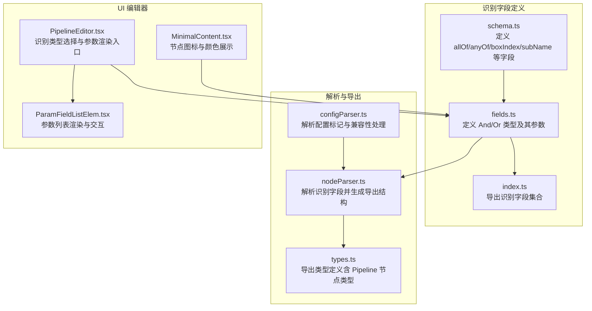
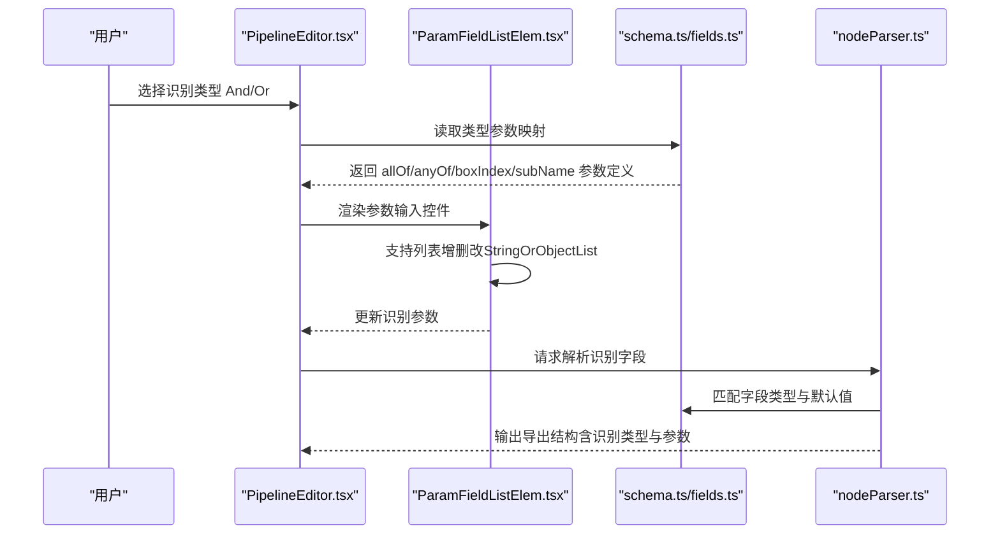
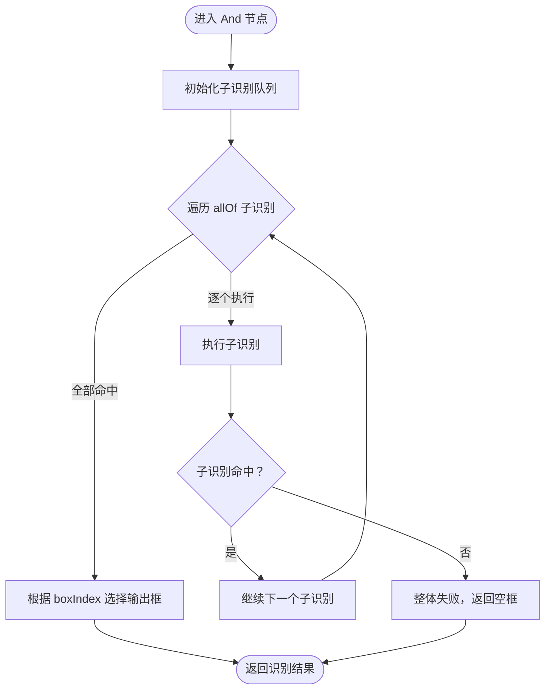
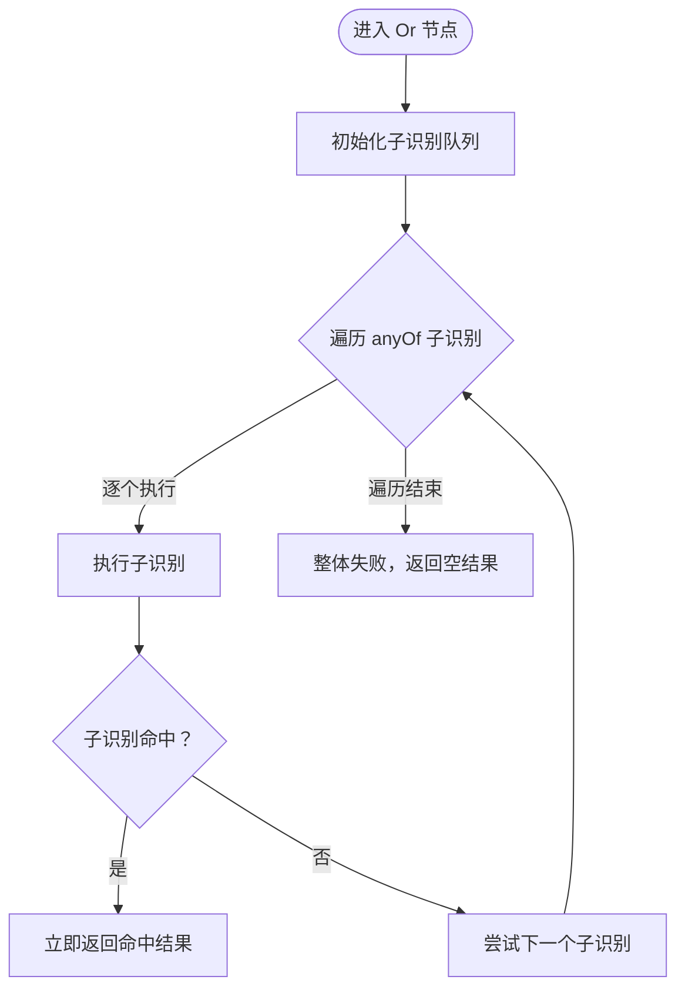
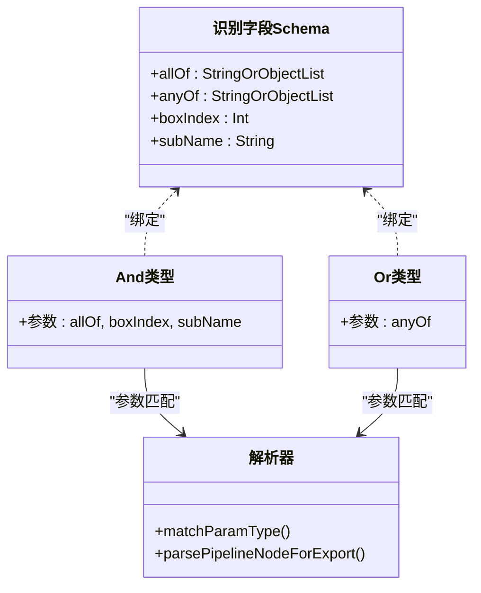
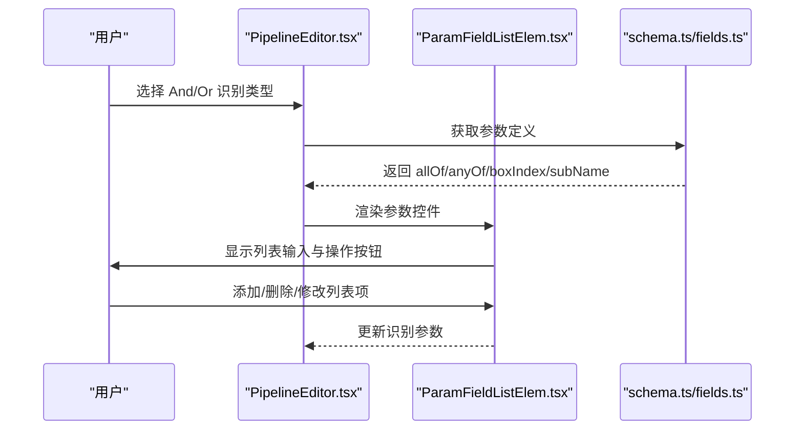
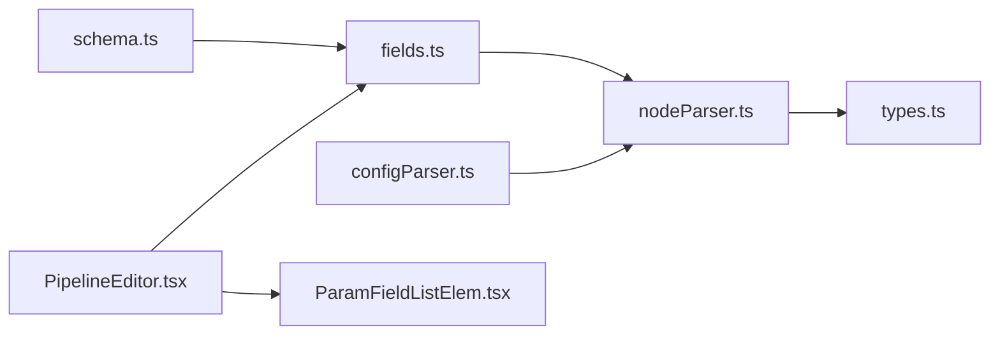

# 逻辑组合识别

<cite>
**本文档引用的文件**
- [schema.ts](file://src/core/fields/recognition/schema.ts)
- [fields.ts](file://src/core/fields/recognition/fields.ts)
- [index.ts](file://src/core/fields/recognition/index.ts)
- [nodeParser.ts](file://src/core/parser/nodeParser.ts)
- [types.ts](file://src/core/parser/types.ts)
- [PipelineEditor.tsx](file://src/components/panels/node-editors/PipelineEditor.tsx)
- [ParamFieldListElem.tsx](file://src/components/panels/field/items/ParamFieldListElem.tsx)
- [MinimalContent.tsx](file://src/components/flow/nodes/PipelineNode/MinimalContent.tsx)
- [configParser.ts](file://src/core/parser/configParser.ts)
- [default_pipeline.json](file://LocalBridge/test-json/base/default_pipeline.json)
</cite>

## 目录
1. [简介](#简介)
2. [项目结构](#项目结构)
3. [核心组件](#核心组件)
4. [架构总览](#架构总览)
5. [详细组件分析](#详细组件分析)
6. [依赖分析](#依赖分析)
7. [性能考虑](#性能考虑)
8. [故障排查指南](#故障排查指南)
9. [结论](#结论)
10. [附录](#附录)

## 简介
本文件系统性阐述“逻辑组合识别”的设计与实现，重点覆盖以下内容：
- And 逻辑与识别与 Or 逻辑或识别的工作原理与使用场景
- 配置参数详解：子识别列表（allOf/anyOf）、框索引（boxIndex）、子名称（subName）
- 复杂识别场景的设计思路与最佳实践
- 性能考量与调试技巧
- 实际应用案例与配置示例

## 项目结构
围绕逻辑组合识别的关键代码分布在“识别字段定义”“解析与导出”“UI 编辑器”三大部分：
- 识别字段定义：集中于识别字段 Schema 与识别类型映射
- 解析与导出：负责将 Flow 节点转换为可导出的 Pipeline 结构
- UI 编辑器：提供参数输入、校验与可视化

图表来源
- [schema.ts:1-276](file://src/core/fields/recognition/schema.ts#L1-L276)
- [fields.ts:1-115](file://src/core/fields/recognition/fields.ts#L1-L115)
- [index.ts:1-3](file://src/core/fields/recognition/index.ts#L1-L3)
- [nodeParser.ts:1-287](file://src/core/parser/nodeParser.ts#L1-L287)
- [types.ts:1-106](file://src/core/parser/types.ts#L1-L106)
- [configParser.ts:1-69](file://src/core/parser/configParser.ts#L1-L69)
- [PipelineEditor.tsx:346-383](file://src/components/panels/node-editors/PipelineEditor.tsx#L346-L383)
- [ParamFieldListElem.tsx:608-697](file://src/components/panels/field/items/ParamFieldListElem.tsx#L608-L697)
- [MinimalContent.tsx:1-41](file://src/components/flow/nodes/PipelineNode/MinimalContent.tsx#L1-L41)

章节来源
- [schema.ts:1-276](file://src/core/fields/recognition/schema.ts#L1-L276)
- [fields.ts:1-115](file://src/core/fields/recognition/fields.ts#L1-L115)
- [nodeParser.ts:1-287](file://src/core/parser/nodeParser.ts#L1-L287)
- [types.ts:1-106](file://src/core/parser/types.ts#L1-L106)
- [configParser.ts:1-69](file://src/core/parser/configParser.ts#L1-L69)
- [PipelineEditor.tsx:346-383](file://src/components/panels/node-editors/PipelineEditor.tsx#L346-L383)
- [ParamFieldListElem.tsx:608-697](file://src/components/panels/field/items/ParamFieldListElem.tsx#L608-L697)
- [MinimalContent.tsx:1-41](file://src/components/flow/nodes/PipelineNode/MinimalContent.tsx#L1-L41)

## 核心组件
- 识别字段 Schema：集中定义 allOf、anyOf、boxIndex、subName 等字段的类型、默认值与描述
- 识别类型映射：And/Or 类型绑定相应字段，形成可编辑的参数集合
- 解析器：将识别参数按协议版本与字段类型进行匹配与导出
- UI 编辑器：根据识别类型动态渲染参数，并支持列表型参数的增删改

章节来源
- [schema.ts:220-246](file://src/core/fields/recognition/schema.ts#L220-L246)
- [fields.ts:77-88](file://src/core/fields/recognition/fields.ts#L77-L88)
- [nodeParser.ts:21-96](file://src/core/parser/nodeParser.ts#L21-L96)
- [PipelineEditor.tsx:346-383](file://src/components/panels/node-editors/PipelineEditor.tsx#L346-L383)

## 架构总览
逻辑组合识别的端到端流程如下：
- 用户在 UI 中选择 And/Or 识别类型
- 编辑器根据类型映射渲染参数（allOf/anyOf、boxIndex、subName）
- 解析器将识别参数与字段 Schema 匹配，生成导出结构
- 导出结构包含识别类型与参数，供后续运行时执行

图表来源
- [PipelineEditor.tsx:346-383](file://src/components/panels/node-editors/PipelineEditor.tsx#L346-L383)
- [ParamFieldListElem.tsx:608-697](file://src/components/panels/field/items/ParamFieldListElem.tsx#L608-L697)
- [schema.ts:220-246](file://src/core/fields/recognition/schema.ts#L220-L246)
- [fields.ts:77-88](file://src/core/fields/recognition/fields.ts#L77-L88)
- [nodeParser.ts:21-96](file://src/core/parser/nodeParser.ts#L21-L96)

## 详细组件分析

### And 逻辑与识别
- 工作原理
  - allOf 子识别列表：所有子识别均命中才判定整体成功
  - boxIndex：指定输出哪一个子识别的识别框（box）作为当前节点的识别框
  - subName：为后续子识别提供基于前序子识别 filtered 结果的 ROI 引用
- 参数与约束
  - allOf：字符串或对象列表，元素可为节点名称引用或内联识别定义
  - boxIndex：整数，取值范围需满足 0 <= box_index < all_of.size
  - subName：字符串，仅在当前节点内有效，同名以最后一个为准
- 使用场景
  - 多条件协同：如“先定位区域，再在区域内匹配模板”，任一环节失败则整体失败
  - ROI 串联：利用 subName 将前序识别结果作为后续识别的感兴趣区域

图表来源
- [schema.ts:220-239](file://src/core/fields/recognition/schema.ts#L220-L239)
- [fields.ts:77-84](file://src/core/fields/recognition/fields.ts#L77-L84)

章节来源
- [schema.ts:220-239](file://src/core/fields/recognition/schema.ts#L220-L239)
- [fields.ts:77-84](file://src/core/fields/recognition/fields.ts#L77-L84)

### Or 逻辑或识别
- 工作原理
  - anyOf 子识别列表：命中第一个即成功，后续不再识别
- 参数与约束
  - anyOf：字符串或对象列表，元素可为节点名称引用或内联识别定义
- 使用场景
  - 多策略备选：如“优先匹配 A，否则尝试 B”，减少误判概率
  - 并行分支：不同识别策略在同一层级竞争，提升鲁棒性

图表来源
- [schema.ts:240-246](file://src/core/fields/recognition/schema.ts#L240-L246)
- [fields.ts:85-88](file://src/core/fields/recognition/fields.ts#L85-L88)

章节来源
- [schema.ts:240-246](file://src/core/fields/recognition/schema.ts#L240-L246)
- [fields.ts:85-88](file://src/core/fields/recognition/fields.ts#L85-L88)

### 参数与字段映射
- 字段定义与默认值
  - allOf/anyOf：字符串或对象列表，支持混合引用与内联定义
  - boxIndex：整数，默认 0，需满足范围约束
  - subName：字符串，默认空，用于跨子识别的 ROI 传递
- 类型映射
  - And/Or 类型分别绑定相应字段，形成可编辑的参数集合
- 解析与导出
  - 解析器依据字段类型与默认值进行匹配，生成导出结构
  - 支持协议版本切换（v1 字符串 vs v2 对象）

图表来源
- [schema.ts:220-246](file://src/core/fields/recognition/schema.ts#L220-L246)
- [fields.ts:77-88](file://src/core/fields/recognition/fields.ts#L77-L88)
- [nodeParser.ts:21-96](file://src/core/parser/nodeParser.ts#L21-L96)

章节来源
- [schema.ts:220-246](file://src/core/fields/recognition/schema.ts#L220-L246)
- [fields.ts:77-88](file://src/core/fields/recognition/fields.ts#L77-L88)
- [nodeParser.ts:21-96](file://src/core/parser/nodeParser.ts#L21-L96)

### UI 与参数渲染
- 识别类型选择
  - 在编辑器中选择 And/Or，动态加载对应参数
- 参数列表渲染
  - 支持 StringOrObjectList 类型的列表增删改
  - 提供模板预览、ROI/OCR 等专用模态辅助
- 节点展示
  - 节点图标与颜色根据识别类型动态呈现

图表来源
- [PipelineEditor.tsx:346-383](file://src/components/panels/node-editors/PipelineEditor.tsx#L346-L383)
- [ParamFieldListElem.tsx:608-697](file://src/components/panels/field/items/ParamFieldListElem.tsx#L608-L697)
- [fields.ts:77-88](file://src/core/fields/recognition/fields.ts#L77-L88)

章节来源
- [PipelineEditor.tsx:346-383](file://src/components/panels/node-editors/PipelineEditor.tsx#L346-L383)
- [ParamFieldListElem.tsx:608-697](file://src/components/panels/field/items/ParamFieldListElem.tsx#L608-L697)
- [MinimalContent.tsx:10-41](file://src/components/flow/nodes/PipelineNode/MinimalContent.tsx#L10-L41)

## 依赖分析
- 内聚与耦合
  - 识别字段定义与类型映射高内聚，解耦于解析器与 UI
  - 解析器依赖字段 Schema 与类型匹配函数，保证导出一致性
- 外部依赖
  - 协议版本与兼容性处理由解析器统一管理
  - 配置标记与兼容性键名由解析器与配置解析器共同处理

图表来源
- [schema.ts:1-276](file://src/core/fields/recognition/schema.ts#L1-L276)
- [fields.ts:1-115](file://src/core/fields/recognition/fields.ts#L1-L115)
- [nodeParser.ts:1-287](file://src/core/parser/nodeParser.ts#L1-L287)
- [types.ts:1-106](file://src/core/parser/types.ts#L1-L106)
- [configParser.ts:1-69](file://src/core/parser/configParser.ts#L1-L69)
- [PipelineEditor.tsx:346-383](file://src/components/panels/node-editors/PipelineEditor.tsx#L346-L383)
- [ParamFieldListElem.tsx:608-697](file://src/components/panels/field/items/ParamFieldListElem.tsx#L608-L697)

章节来源
- [schema.ts:1-276](file://src/core/fields/recognition/schema.ts#L1-L276)
- [fields.ts:1-115](file://src/core/fields/recognition/fields.ts#L1-L115)
- [nodeParser.ts:1-287](file://src/core/parser/nodeParser.ts#L1-L287)
- [types.ts:1-106](file://src/core/parser/types.ts#L1-L106)
- [configParser.ts:1-69](file://src/core/parser/configParser.ts#L1-L69)
- [PipelineEditor.tsx:346-383](file://src/components/panels/node-editors/PipelineEditor.tsx#L346-L383)
- [ParamFieldListElem.tsx:608-697](file://src/components/panels/field/items/ParamFieldListElem.tsx#L608-L697)

## 性能考虑
- And 与 Or 的执行顺序
  - And：顺序执行所有子识别，整体性能取决于最长耗时的子识别
  - Or：命中即停，整体性能受首个命中的子识别影响
- ROI 串联与过滤
  - 合理使用 subName 将前序识别的 filtered 作为后续 ROI，可显著缩小搜索范围，降低计算量
- 模板与阈值
  - 模板匹配阈值与方法的选择直接影响性能与精度，应结合场景权衡
- 批处理与并发
  - 在可行范围内尽量避免重复 ROI 计算，减少不必要的重复识别

## 故障排查指南
- 参数范围错误
  - boxIndex 越界：确保 0 <= box_index < all_of.size
- 子识别引用无效
  - 子识别名称不存在或未正确命名，导致引用失败
- ROI 为空
  - 前置识别结果为空时，后续基于 subName 的 ROI 会失败
- 导出结构异常
  - 检查协议版本与字段类型匹配，必要时启用默认识别/动作导出开关
- 配置标记与兼容性
  - 使用配置解析器处理新旧版本标记，避免解析失败

章节来源
- [schema.ts:228-239](file://src/core/fields/recognition/schema.ts#L228-L239)
- [configParser.ts:9-69](file://src/core/parser/configParser.ts#L9-L69)

## 结论
And/Or 逻辑组合识别提供了强大的多条件协同与策略备选能力。通过合理配置 allOf/anyOf、boxIndex 与 subName，可在复杂场景中实现高鲁棒性的识别流程。配合 UI 参数渲染与解析器导出机制，能够高效地构建、调试与维护识别管道。

## 附录

### 配置参数速查
- allOf：子识别列表（逻辑与），元素可为字符串（节点名称引用）或对象（内联识别定义）
- anyOf：子识别列表（逻辑或），命中首个即成功
- boxIndex：输出框索引（整数），默认 0，需满足范围约束
- subName：子名称（字符串），用于后续子识别引用前序 filtered 作为 ROI

章节来源
- [schema.ts:220-246](file://src/core/fields/recognition/schema.ts#L220-L246)

### 实际应用案例与最佳实践
- 多阶段定位
  - 先用颜色匹配粗定位，再用模板匹配精确定位，最后用 OCR 校验文本
  - 使用 subName 将颜色匹配的 filtered 作为模板匹配的 ROI，提升稳定性
- 备选策略
  - 同一目标采用多种模板或不同阈值，通过 Or 逻辑并行备选，提高成功率
- 性能优化
  - 尽量缩短 anyOf 列表长度，优先放置命中率高、耗时短的策略
  - 合理设置模板阈值与匹配方法，避免过度搜索

### 测试与示例文件
- 默认 Pipeline 配置示例
  - [default_pipeline.json:1-7](file://LocalBridge/test-json/base/default_pipeline.json#L1-L7)