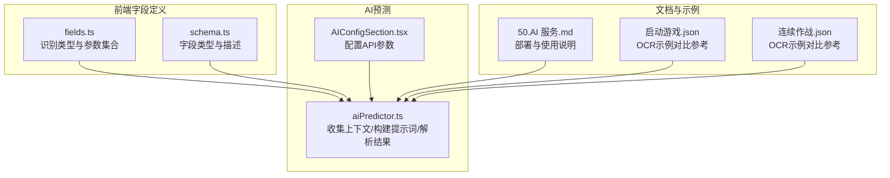
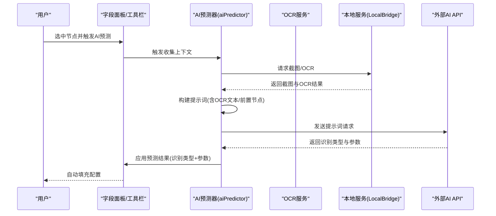
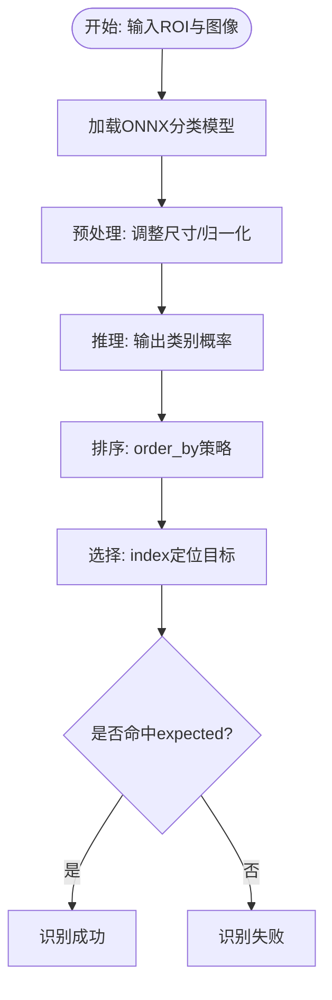
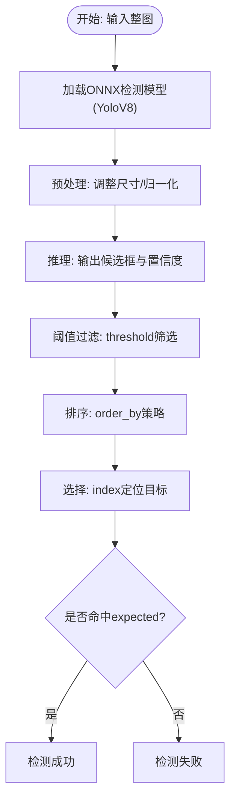
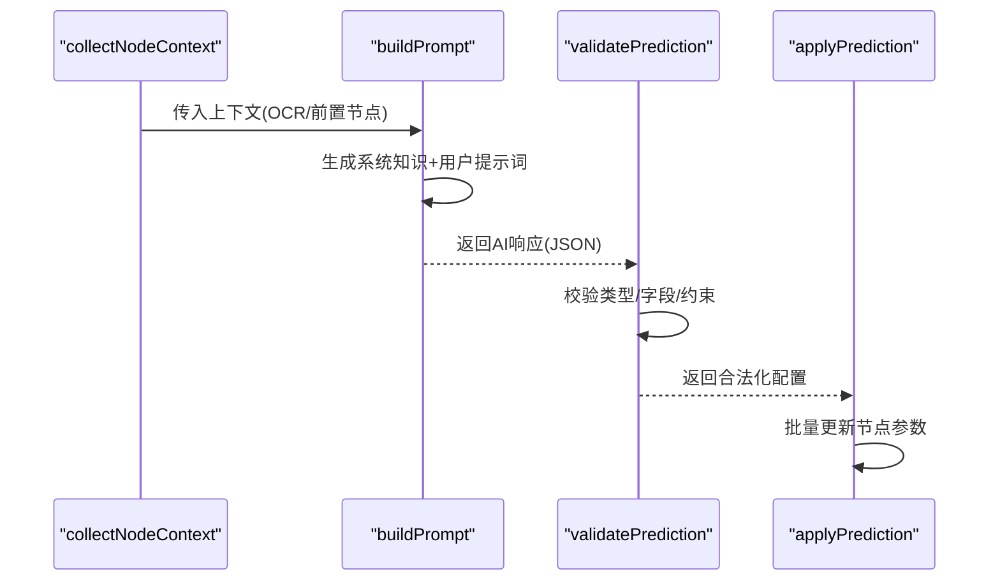
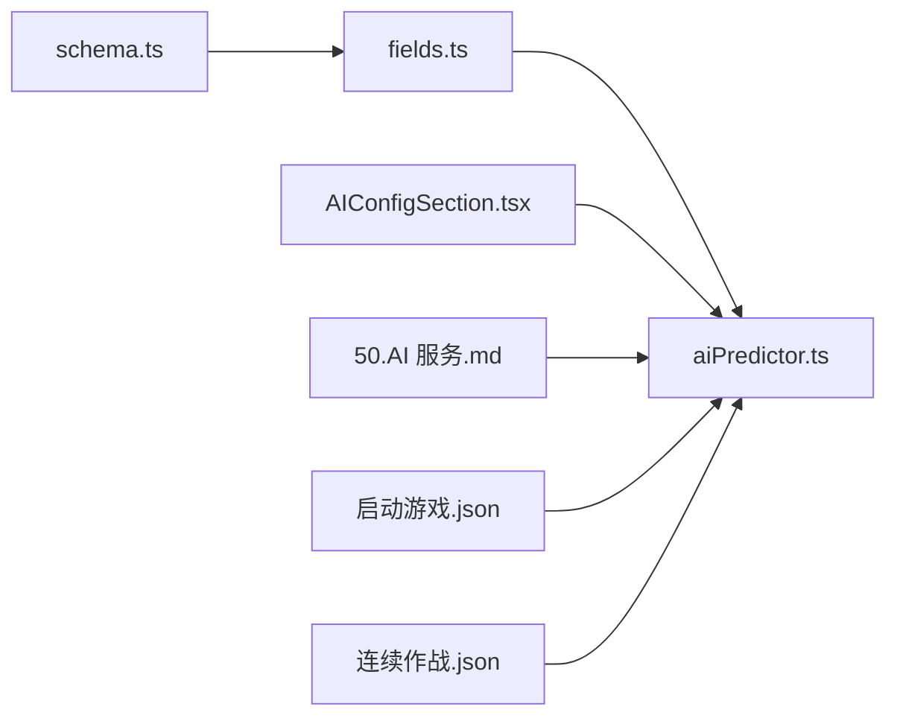

# 神经网络识别

<cite>
**本文档引用的文件**
- [schema.ts](file://src/core/fields/recognition/schema.ts)
- [fields.ts](file://src/core/fields/recognition/fields.ts)
- [aiPredictor.ts](file://src/utils/aiPredictor.ts)
- [AIConfigSection.tsx](file://src/components/panels/config/AIConfigSection.tsx)
- [50.AI 服务.md](file://docsite/docs/01.指南/20.本地服务/50.AI 服务.md)
- [启动游戏.json](file://LocalBridge/test-json/base/pipeline/日常任务/启动游戏.json)
- [连续作战.json](file://LocalBridge/test-json/base/pipeline/开荒功能/连续作战.json)
</cite>

## 目录
1. [简介](#简介)
2. [项目结构](#项目结构)
3. [核心组件](#核心组件)
4. [架构总览](#架构总览)
5. [详细组件分析](#详细组件分析)
6. [依赖分析](#依赖分析)
7. [性能考量](#性能考量)
8. [故障排查指南](#故障排查指南)
9. [结论](#结论)
10. [附录](#附录)

## 简介
本文件面向使用神经网络识别的开发者与使用者，系统性阐述两类识别能力：
- NeuralNetworkClassify（神经网络分类）：在固定区域内判断图像属于哪一类，适合“固定位置+多分类”的场景。
- NeuralNetworkDetect（神经网络检测）：在整幅画面中检测目标，适合“任意位置+目标检测”的场景。

文档涵盖工作原理、配置参数详解、模型选择建议、训练数据准备、性能优化与部署注意事项，并提供可视化流程图帮助理解。

## 项目结构
神经网络识别能力由前端字段定义、AI预测器与文档说明共同构成，关键文件如下：
- 字段定义：识别类型与其参数在 schema.ts 与 fields.ts 中统一声明
- AI预测：aiPredictor.ts 提供基于OCR上下文的智能推荐
- 配置面板：AIConfigSection.tsx 提供API配置入口
- 使用指南：docsite/docs/01.指南/20.本地服务/50.AI 服务.md 提供部署与使用说明

**图表来源**
- [fields.ts:89-113](file://src/core/fields/recognition/fields.ts#L89-L113)
- [schema.ts:190-218](file://src/core/fields/recognition/schema.ts#L190-L218)
- [aiPredictor.ts:271-525](file://src/utils/aiPredictor.ts#L271-L525)
- [AIConfigSection.tsx:11-148](file://src/components/panels/config/AIConfigSection.tsx#L11-L148)
- [50.AI 服务.md:59-187](file://docsite/docs/01.指南/20.本地服务/50.AI 服务.md#L59-L187)
- [启动游戏.json:1-314](file://LocalBridge/test-json/base/pipeline/日常任务/启动游戏.json#L1-L314)
- [连续作战.json:1-118](file://LocalBridge/test-json/base/pipeline/开荒功能/连续作战.json#L1-L118)

**章节来源**
- [fields.ts:89-113](file://src/core/fields/recognition/fields.ts#L89-L113)
- [schema.ts:190-218](file://src/core/fields/recognition/schema.ts#L190-L218)
- [aiPredictor.ts:271-525](file://src/utils/aiPredictor.ts#L271-L525)
- [AIConfigSection.tsx:11-148](file://src/components/panels/config/AIConfigSection.tsx#L11-L148)
- [50.AI 服务.md:59-187](file://docsite/docs/01.指南/20.本地服务/50.AI 服务.md#L59-L187)

## 核心组件
- NeuralNetworkClassify（神经网络分类）
  - 用途：在固定区域内进行多分类判断
  - 关键参数：model（模型路径）、labels（分类标签）、expected（期望类别下标）、order_by（排序方式）、index（结果索引）
- NeuralNetworkDetect（神经网络检测）
  - 用途：在整幅画面中检测目标，支持任意位置
  - 关键参数：model（模型路径）、labels（分类标签）、expected（期望类别下标）、threshold（置信度阈值）、order_by（排序方式）、index（结果索引）

上述参数在字段定义与AI预测提示词中均有明确说明，便于统一配置与智能推荐。

**章节来源**
- [fields.ts:89-113](file://src/core/fields/recognition/fields.ts#L89-L113)
- [schema.ts:190-218](file://src/core/fields/recognition/schema.ts#L190-L218)
- [aiPredictor.ts:327-342](file://src/utils/aiPredictor.ts#L327-L342)

## 架构总览
AI预测器通过收集节点上下文（含前置节点、OCR结果等），构建提示词并调用外部AI服务，最终将识别类型与参数写回到节点配置。神经网络识别参数在字段定义中严格约束，保证一致性与可维护性。

**图表来源**
- [aiPredictor.ts:82-172](file://src/utils/aiPredictor.ts#L82-L172)
- [aiPredictor.ts:271-525](file://src/utils/aiPredictor.ts#L271-L525)
- [50.AI 服务.md:78-110](file://docsite/docs/01.指南/20.本地服务/50.AI 服务.md#L78-L110)

## 详细组件分析

### NeuralNetworkClassify（神经网络分类）
- 工作原理
  - 在指定ROI区域内对图像进行分类，输出各类别的概率或置信度，按排序策略选取最优结果
  - 适合固定位置的多分类任务，如按钮类别、状态图标分类等
- 关键参数
  - model：模型文件路径（model/classify相对路径），必填，ONNX格式
  - labels：分类标签名，可选，用于调试与日志
  - expected：期望的分类下标（可为单个或多个），必填
  - order_by：排序方式，支持Horizontal、Vertical、Score、Random、Expected
  - index：结果索引，支持负数与范围校验
- 配置要点
  - ROI应覆盖目标区域，避免过大导致性能下降
  - expected与labels需与训练模型一致
  - 排序策略可结合index实现稳定命中

**图表来源**
- [schema.ts:190-218](file://src/core/fields/recognition/schema.ts#L190-L218)
- [fields.ts:89-99](file://src/core/fields/recognition/fields.ts#L89-L99)

**章节来源**
- [fields.ts:89-99](file://src/core/fields/recognition/fields.ts#L89-L99)
- [schema.ts:190-218](file://src/core/fields/recognition/schema.ts#L190-L218)

### NeuralNetworkDetect（神经网络检测）
- 工作原理
  - 在整幅画面中检测目标，输出候选框与置信度，支持任意位置
  - 适合复杂场景下的目标检测，如UI元素定位、多目标识别
- 关键参数
  - model：模型文件路径（model/detect相对路径），必填，当前支持YoloV8 ONNX
  - labels：分类标签名，可选
  - expected：期望类别下标（可为单个或多个），必填
  - threshold：置信度阈值，可选，默认0.3
  - order_by：排序方式，支持Horizontal、Vertical、Score、Area、Random、Expected
  - index：结果索引
- 配置要点
  - ROI可设为全屏或限定区域，限定区域可提升性能
  - threshold需结合业务场景调整，避免误检或漏检
  - 与其他识别类型配合使用时，注意排序与索引策略的一致性

**图表来源**
- [schema.ts:190-218](file://src/core/fields/recognition/schema.ts#L190-L218)
- [fields.ts:101-113](file://src/core/fields/recognition/fields.ts#L101-L113)

**章节来源**
- [fields.ts:101-113](file://src/core/fields/recognition/fields.ts#L101-L113)
- [schema.ts:190-218](file://src/core/fields/recognition/schema.ts#L190-L218)

### AI预测与参数校验
- 上下文收集：包含当前节点、前置节点关系、OCR结果等
- 提示词构建：基于系统知识与用户提示词，生成JSON格式的识别与动作配置
- 参数校验：过滤无效字段与类型，确保生成配置合法
- 应用结果：批量更新节点配置，支持撤销与重试

**图表来源**
- [aiPredictor.ts:82-172](file://src/utils/aiPredictor.ts#L82-L172)
- [aiPredictor.ts:271-525](file://src/utils/aiPredictor.ts#L271-L525)
- [aiPredictor.ts:603-713](file://src/utils/aiPredictor.ts#L603-L713)
- [aiPredictor.ts:720-784](file://src/utils/aiPredictor.ts#L720-L784)

**章节来源**
- [aiPredictor.ts:82-172](file://src/utils/aiPredictor.ts#L82-L172)
- [aiPredictor.ts:271-525](file://src/utils/aiPredictor.ts#L271-L525)
- [aiPredictor.ts:603-713](file://src/utils/aiPredictor.ts#L603-L713)
- [aiPredictor.ts:720-784](file://src/utils/aiPredictor.ts#L720-L784)

## 依赖分析
- 字段定义依赖
  - fields.ts 依赖 schema.ts 提供的字段类型与默认值
- AI预测依赖
  - aiPredictor.ts 依赖字段定义、本地服务（截图/OCR）、外部AI API
- 配置依赖
  - AIConfigSection.tsx 提供API配置项，影响AI预测可用性

**图表来源**
- [schema.ts:1-276](file://src/core/fields/recognition/schema.ts#L1-L276)
- [fields.ts:1-115](file://src/core/fields/recognition/fields.ts#L1-L115)
- [aiPredictor.ts:1-785](file://src/utils/aiPredictor.ts#L1-L785)
- [AIConfigSection.tsx:11-148](file://src/components/panels/config/AIConfigSection.tsx#L11-L148)
- [50.AI 服务.md:59-187](file://docsite/docs/01.指南/20.本地服务/50.AI 服务.md#L59-L187)
- [启动游戏.json:1-314](file://LocalBridge/test-json/base/pipeline/日常任务/启动游戏.json#L1-L314)
- [连续作战.json:1-118](file://LocalBridge/test-json/base/pipeline/开荒功能/连续作战.json#L1-L118)

**章节来源**
- [schema.ts:1-276](file://src/core/fields/recognition/schema.ts#L1-L276)
- [fields.ts:1-115](file://src/core/fields/recognition/fields.ts#L1-L115)
- [aiPredictor.ts:1-785](file://src/utils/aiPredictor.ts#L1-L785)
- [AIConfigSection.tsx:11-148](file://src/components/panels/config/AIConfigSection.tsx#L11-L148)
- [50.AI 服务.md:59-187](file://docsite/docs/01.指南/20.本地服务/50.AI 服务.md#L59-L187)

## 性能考量
- 模型选择
  - 分类模型：ONNX格式，适合固定区域、多分类任务
  - 检测模型：当前支持YoloV8 ONNX，适合任意位置、多目标任务
- ROI与阈值
  - 缩小ROI可显著降低推理开销
  - threshold需结合业务场景调整，避免误检/漏检
- 排序与索引
  - 合理使用order_by与index，减少后处理成本
- 资源占用
  - 检测模型通常更复杂，需更多训练数据与推理资源

[本节为通用指导，无需列出具体文件来源]

## 故障排查指南
- AI预测失败
  - 确认已连接本地服务与设备、OCR可用、AI API配置正确
  - 参考文档中的常见问题与解决方案
- OCR识别失败
  - 检查MaaFramework路径、OCR模型文件、设备画面清晰度
- CORS跨域问题
  - 使用支持CORS的API代理或更换提供商
- 参数无效
  - AI预测器会对无效字段进行过滤，检查字段类型与约束

**章节来源**
- [50.AI 服务.md:156-187](file://docsite/docs/01.指南/20.本地服务/50.AI 服务.md#L156-L187)
- [AIConfigSection.tsx:22-43](file://src/components/panels/config/AIConfigSection.tsx#L22-L43)

## 结论
神经网络识别为固定位置分类与任意位置检测提供了强大的自动化能力。通过字段定义与AI预测器的协同，可在保证一致性的同时实现智能配置。建议结合业务场景合理选择模型、调整ROI与阈值，并利用排序与索引策略提升稳定性与性能。

[本节为总结性内容，无需列出具体文件来源]

## 附录

### 配置参数速查
- 通用参数
  - roi：感兴趣区域，可为数组或节点名引用
  - roi_offset：在roi基础上的额外偏移
  - index：结果索引，支持负数与范围校验
- NeuralNetworkClassify
  - model：模型路径（model/classify相对路径），必填
  - labels：分类标签名，可选
  - expected：期望类别下标（可为单个或多个），必填
  - order_by：排序方式，支持Horizontal、Vertical、Score、Random、Expected
- NeuralNetworkDetect
  - model：模型路径（model/detect相对路径），必填
  - labels：分类标签名，可选
  - expected：期望类别下标（可为单个或多个），必填
  - threshold：置信度阈值，可选，默认0.3
  - order_by：排序方式，支持Horizontal、Vertical、Score、Area、Random、Expected

**章节来源**
- [schema.ts:9-26](file://src/core/fields/recognition/schema.ts#L9-L26)
- [schema.ts:58-92](file://src/core/fields/recognition/schema.ts#L58-L92)
- [schema.ts:190-218](file://src/core/fields/recognition/schema.ts#L190-L218)
- [fields.ts:89-113](file://src/core/fields/recognition/fields.ts#L89-L113)

### 实际使用示例（对比参考）
- OCR示例（用于理解AI预测上下文）
  - 启动游戏.json：包含OCR识别节点，可作为AI预测的上下文参考
  - 连续作战.json：包含OCR识别节点，可作为AI预测的上下文参考

**章节来源**
- [启动游戏.json:1-314](file://LocalBridge/test-json/base/pipeline/日常任务/启动游戏.json#L1-L314)
- [连续作战.json:1-118](file://LocalBridge/test-json/base/pipeline/开荒功能/连续作战.json#L1-L118)