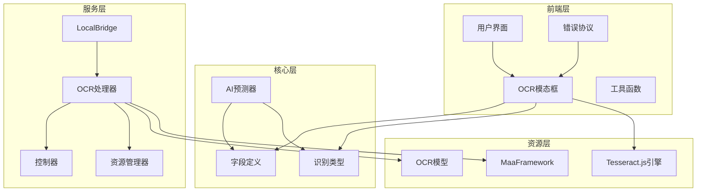
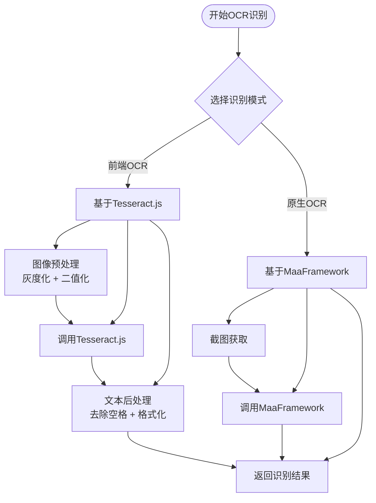
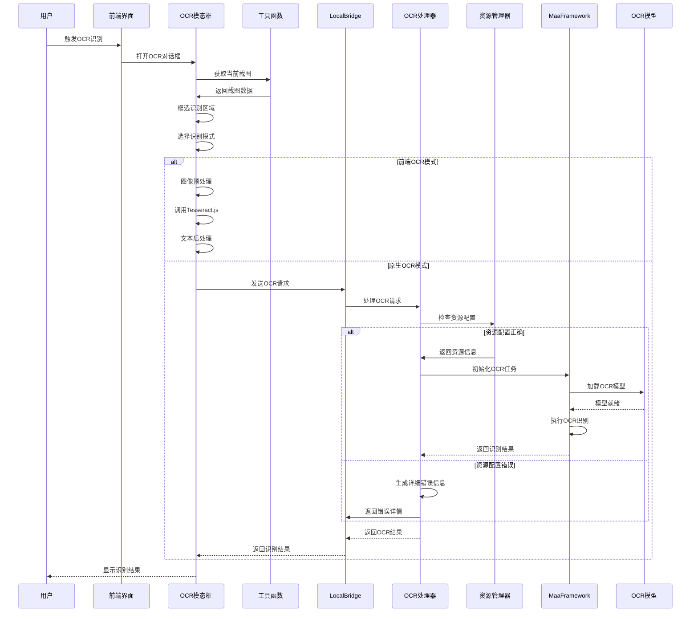
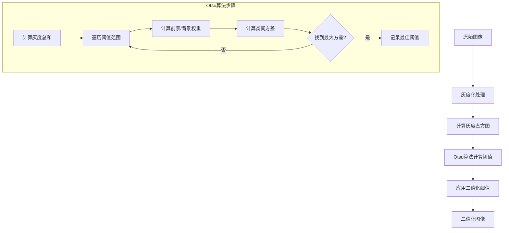
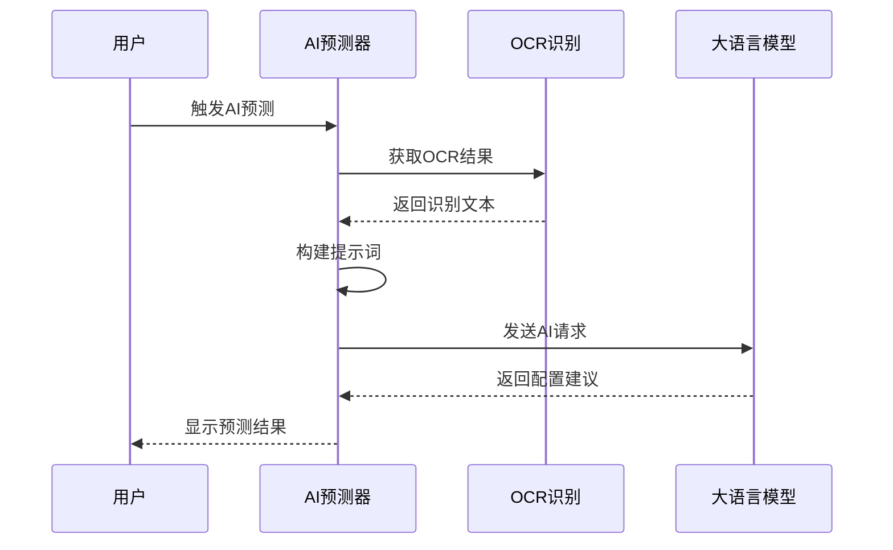
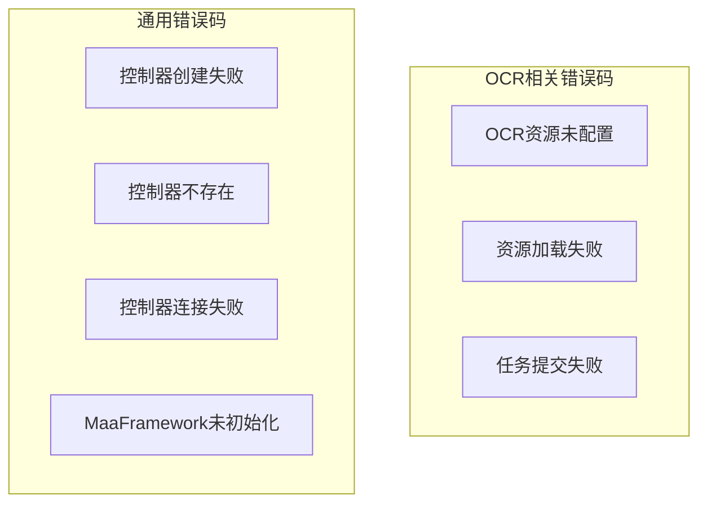
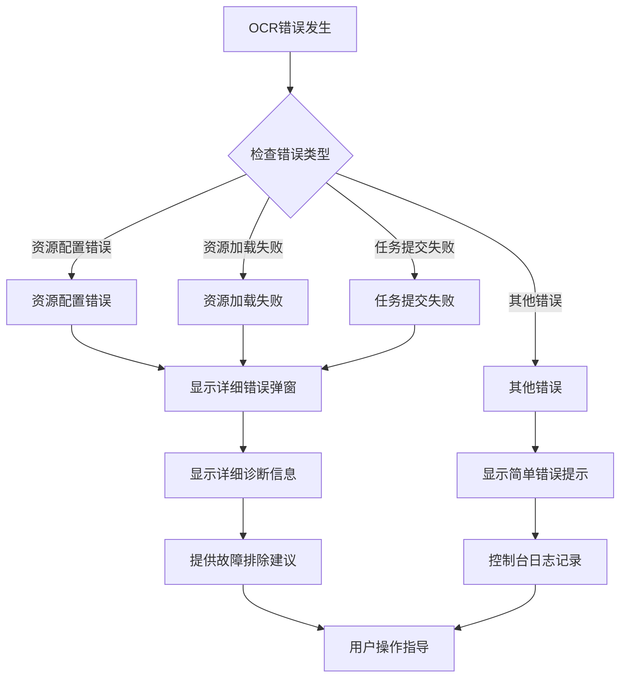
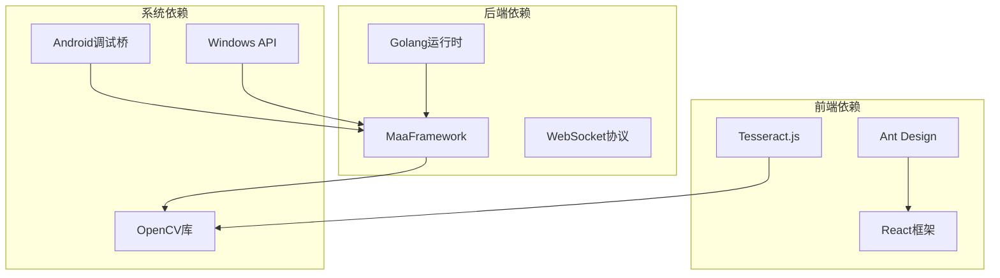
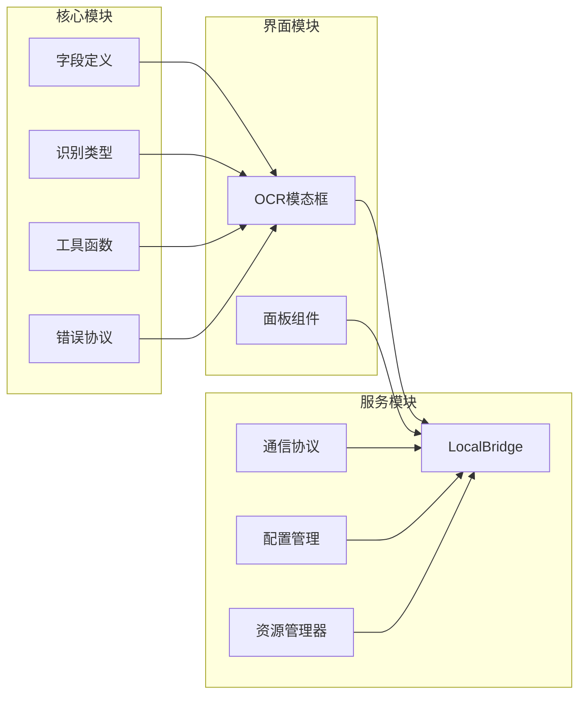
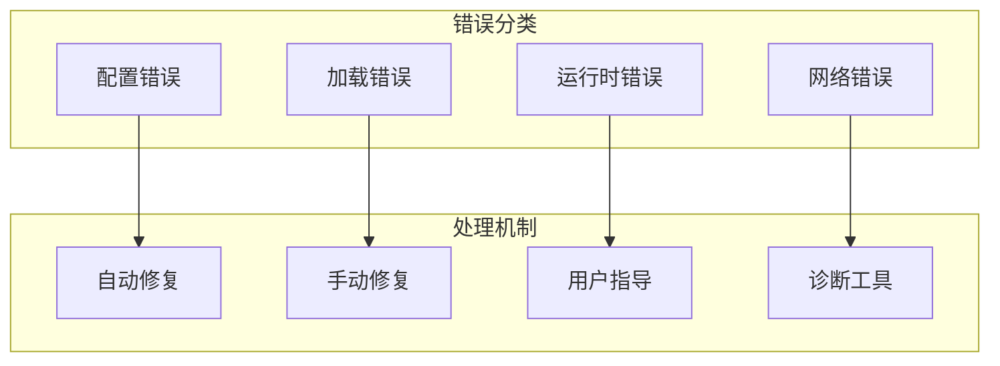

# OCR 文字识别

<cite>
**本文档引用的文件**
- [schema.ts](file://src/core/fields/recognition/schema.ts)
- [fields.ts](file://src/core/fields/recognition/fields.ts)
- [OCRModal.tsx](file://src/components/modals/OCRModal.tsx)
- [aiPredictor.ts](file://src/utils/aiPredictor.ts)
- [handler.go](file://LocalBridge/internal/protocol/utility/handler.go)
- [main.go](file://LocalBridge/cmd/lb/main.go)
- [ErrorProtocol.ts](file://src/services/protocols/ErrorProtocol.ts)
- [error.go](file://LocalBridge/internal/mfw/error.go)
- [resource_manager.go](file://LocalBridge/internal/mfw/resource_manager.go)
- [20.字段快捷工具.md](file://docsite/docs/01.指南/20.本地服务/20.字段快捷工具.md)
- [50.AI 服务.md](file://docsite/docs/01.指南/20.本地服务/50.AI 服务.md)
- [100.进阶配置.md](file://docsite/docs/01.指南/20.本地服务/100.进阶配置.md)
- [release.yaml](file://.github/workflows/release.yaml)
</cite>

## 更新摘要
**变更内容**
- 增强了OCR错误处理系统，新增详细的资源加载失败诊断信息
- 新增故障排除建议和用户友好的错误提示机制
- 完善了OCR资源配置和模型文件的详细说明
- 更新了错误码定义和错误处理流程

## 目录
1. [简介](#简介)
2. [项目结构](#项目结构)
3. [核心组件](#核心组件)
4. [架构概览](#架构概览)
5. [详细组件分析](#详细组件分析)
6. [依赖分析](#依赖分析)
7. [性能考虑](#性能考虑)
8. [故障排除指南](#故障排除指南)
9. [结论](#结论)
10. [附录](#附录)

## 简介

OCR（Optical Character Recognition，光学字符识别）是一种能够从图像中识别和提取文本的技术。在本项目中，OCR功能通过两种模式实现：前端OCR（基于Tesseract.js）和原生OCR（基于MaaFramework）。

前端OCR使用浏览器端的Tesseract.js引擎，无需额外配置即可使用，适合编辑固定内容的场景。原生OCR通过本地MaaFramework服务进行识别，需要配置OCR资源路径，适合实时识别变化内容的场景。

OCR识别广泛应用于自动化流程中，如游戏自动化、应用界面交互、数据提取等场景，能够帮助开发者快速构建智能的视觉识别功能。

## 项目结构

该项目的OCR功能分布在多个层次中，形成了完整的识别体系：



**图表来源**
- [OCRModal.tsx:1-800](file://src/components/modals/OCRModal.tsx#L1-L800)
- [schema.ts:1-276](file://src/core/fields/recognition/schema.ts#L1-L276)
- [fields.ts:1-54](file://src/core/fields/recognition/fields.ts#L1-L54)
- [handler.go:121-140](file://LocalBridge/internal/protocol/utility/handler.go#L121-L140)
- [ErrorProtocol.ts:1-120](file://src/services/protocols/ErrorProtocol.ts#L1-L120)

**章节来源**
- [OCRModal.tsx:1-800](file://src/components/modals/OCRModal.tsx#L1-L800)
- [schema.ts:1-276](file://src/core/fields/recognition/schema.ts#L1-L276)
- [fields.ts:1-54](file://src/core/fields/recognition/fields.ts#L1-L54)

## 核心组件

### OCR字段定义

系统提供了完整的OCR字段配置，支持多种参数组合以满足不同的识别需求：

| 字段名称 | 类型 | 默认值 | 描述 |
|---------|------|--------|------|
| ocrExpected | StringList/String | [""] | 期望的结果，支持正则表达式，必选参数 |
| ocrThreshold | Double | 0.3 | 模型置信度阈值，可选参数 |
| replace | StringPairList/StringPair | [["origin","target"]] | 文本替换规则，可选参数 |
| lengthExpectedOrderBy | String | "Horizontal" | 基于长度和期望的排序方式，可选参数 |
| index | Int | 0 | 命中结果的索引，可选参数 |
| onlyRec | Bool | true | 是否仅进行识别（不进行检测），可选参数 |
| ocrModel | String | "" | OCR模型文件夹路径，可选参数 |
| colorFilter | String | "" | 颜色过滤器节点名，可选参数 |

### 识别模式

系统支持两种OCR识别模式，每种模式都有其特定的应用场景：



**图表来源**
- [OCRModal.tsx:92-252](file://src/components/modals/OCRModal.tsx#L92-L252)
- [handler.go:121-140](file://LocalBridge/internal/protocol/utility/handler.go#L121-L140)

**章节来源**
- [schema.ts:150-188](file://src/core/fields/recognition/schema.ts#L150-L188)
- [OCRModal.tsx:670-722](file://src/components/modals/OCRModal.tsx#L670-L722)

## 架构概览

系统的OCR架构采用了分层设计，从前端用户界面到后端服务处理，形成了完整的识别链路：



**图表来源**
- [OCRModal.tsx:254-321](file://src/components/modals/OCRModal.tsx#L254-L321)
- [handler.go:91-140](file://LocalBridge/internal/protocol/utility/handler.go#L91-L140)
- [ErrorProtocol.ts:80-118](file://src/services/protocols/ErrorProtocol.ts#L80-L118)

## 详细组件分析

### 前端OCR实现

前端OCR功能基于Tesseract.js实现，提供了无需服务器配置的本地识别能力：

#### 图像预处理流程

前端OCR实现了完整的图像预处理管道，确保识别结果的准确性：



**图表来源**
- [OCRModal.tsx:121-189](file://src/components/modals/OCRModal.tsx#L121-L189)

#### 文本后处理机制

前端OCR还实现了智能的文本后处理，提升识别结果的质量：

| 处理步骤 | 算法描述 | 目的 |
|---------|----------|------|
| 去除中文空格 | 正则表达式 `([一-龥])\\s+([一-龥])` | 合并中文字符间的多余空格 |
| 格式化换行 | 正则表达式 `[\r\n]+` | 将换行符统一为单个空格 |
| 去除多余空格 | 正则表达式 `\\s{2,}` | 将连续空格压缩为单个空格 |
| 去除首尾空白 | `trim()` | 清理文本边界空白字符 |

**章节来源**
- [OCRModal.tsx:121-252](file://src/components/modals/OCRModal.tsx#L121-L252)

### 原生OCR实现

原生OCR通过LocalBridge服务实现，提供了强大的本地识别能力：

#### OCR处理器架构

```mermaid
classDiagram
class UtilityHandler {
+performOCR(controllerID, resourceID, roi) map[string]interface{}
+parseOCRResult(taskDetail, img, roi) map[string]interface{}
+buildEmptyOCRResult(img, roi) map[string]interface{}
-encodeImageToBase64(img) string
-mfwService MFWService
-logger Logger
}
class Tasker {
+PostTask(nodeName, config) Job
+BindController(controller) error
+BindResource(resource) error
+Initialized() bool
+Destroy() void
}
class Controller {
+PostScreencap() Job
+Wait() void
}
class OCRNode {
+recognition : "OCR"
+roi : [x, y, w, h]
+action : "DoNothing"
+timeout : 0
}
class ResourceManager {
+LoadResource(path) (string, string, error)
+GetResource(id) (*ResourceInfo, error)
}
UtilityHandler --> Tasker : "创建并管理"
UtilityHandler --> Controller : "获取截图"
UtilityHandler --> ResourceManager : "管理资源"
Tasker --> OCRNode : "执行识别"
```

**图表来源**
- [handler.go:121-140](file://LocalBridge/internal/protocol/utility/handler.go#L121-L140)
- [handler.go:256-287](file://LocalBridge/internal/protocol/utility/handler.go#L256-L287)
- [resource_manager.go:54-118](file://LocalBridge/internal/mfw/resource_manager.go#L54-L118)

#### OCR模型配置

原生OCR需要正确的模型配置才能正常工作：

| 配置项 | 路径 | 用途 |
|-------|------|------|
| det.onnx | `model/ocr/det.onnx` | 文本检测模型 |
| rec.onnx | `model/ocr/rec.onnx` | 文本识别模型 |
| keys.txt | `model/ocr/keys.txt` | 字符映射表 |

**章节来源**
- [handler.go:247-254](file://LocalBridge/internal/protocol/utility/handler.go#L247-L254)
- [release.yaml:229-241](file://.github/workflows/release.yaml#L229-L241)

### AI智能预测集成

系统集成了AI智能预测功能，能够根据OCR识别结果自动推断节点配置：

#### AI预测流程



**图表来源**
- [aiPredictor.ts:235-265](file://src/utils/aiPredictor.ts#L235-L265)

**章节来源**
- [aiPredictor.ts:271-518](file://src/utils/aiPredictor.ts#L271-L518)

### 错误处理系统增强

**更新** 新增了详细的OCR错误处理系统，提供用户友好的错误提示和故障排除建议

系统实现了完整的错误处理机制，包括详细的错误诊断信息和故障排除指导：

#### 错误码定义



**图表来源**
- [error.go:5-21](file://LocalBridge/internal/mfw/error.go#L5-L21)

#### 错误处理流程



**图表来源**
- [ErrorProtocol.ts:80-118](file://src/services/protocols/ErrorProtocol.ts#L80-L118)
- [OCRModal.tsx:315-351](file://src/components/modals/OCRModal.tsx#L315-L351)

**章节来源**
- [ErrorProtocol.ts:1-120](file://src/services/protocols/ErrorProtocol.ts#L1-L120)
- [handler.go:170-173](file://LocalBridge/internal/protocol/utility/handler.go#L170-L173)

## 依赖分析

### 外部依赖关系

系统OCR功能依赖于多个外部组件和服务：



### 内部模块依赖



**图表来源**
- [fields.ts:1-54](file://src/core/fields/recognition/fields.ts#L1-L54)
- [OCRModal.tsx:1-800](file://src/components/modals/OCRModal.tsx#L1-L800)
- [ErrorProtocol.ts:1-120](file://src/services/protocols/ErrorProtocol.ts#L1-L120)

**章节来源**
- [schema.ts:1-276](file://src/core/fields/recognition/schema.ts#L1-L276)
- [fields.ts:1-54](file://src/core/fields/recognition/fields.ts#L1-L54)

## 性能考虑

### 识别性能优化

为了提升OCR识别的性能和准确性，系统采用了多种优化策略：

#### 前端OCR优化

1. **模型懒加载**：首次使用时才加载Tesseract.js模型，减少初始启动时间
2. **图像缓存**：对已处理的图像进行缓存，避免重复处理
3. **防抖机制**：对频繁的识别请求进行防抖处理，减少不必要的计算

#### 原生OCR优化

1. **资源预加载**：在服务启动时预加载OCR模型，减少首次识别延迟
2. **批处理优化**：支持多个OCR任务的批处理执行
3. **内存管理**：及时释放不再使用的OCR资源

### 性能监控指标

| 指标类型 | 目标值 | 监控方法 |
|---------|--------|----------|
| 识别响应时间 | < 2秒 | 前端计时器 |
| 识别准确率 | > 90% | 人工验证 |
| 模型加载时间 | < 5秒 | 性能分析 |
| 内存使用量 | < 500MB | 系统监控 |

## 故障排除指南

### 增强的错误处理系统

**更新** 新增了详细的资源加载失败诊断信息、故障排除建议和用户友好的错误提示机制

系统提供了多层次的错误处理和故障排除功能：

#### 错误分类和处理



#### 详细诊断信息

当OCR资源加载失败时，系统会提供详细的诊断信息：

**错误标题**：OCR 资源加载失败

**错误内容**：
```
原因: PostBundle 返回 nil

资源目录:
D:\assets\resource\base

排查建议:
• 检查 OCR 资源目录是否存在
• 确认目录结构: <resource_dir>/model/ocr/
• 确认必需文件: det.onnx, rec.onnx, keys.txt
• 检查目录访问权限
• 目录下若有 pipeline 文件，检查格式是否正确
```

**章节来源**
- [ErrorProtocol.ts:80-118](file://src/services/protocols/ErrorProtocol.ts#L80-L118)
- [OCRModal.tsx:315-351](file://src/components/modals/OCRModal.tsx#L315-L351)

### 常见问题及解决方案

#### OCR资源未配置

**问题症状**：
- 原生OCR识别报错："OCR资源路径未配置"
- 识别结果为空

**解决方案**：
1. 使用命令行工具设置OCR资源路径
2. 确认模型文件完整性
3. 验证资源目录权限

```bash
# 设置OCR资源路径
mpelb config set-resource

# 验证配置
mpelb info
```

**章节来源**
- [OCRModal.tsx:304-313](file://src/components/modals/OCRModal.tsx#L304-L313)
- [main.go:548-601](file://LocalBridge/cmd/lb/main.go#L548-L601)

#### 模型文件缺失

**问题症状**：
- MaaFramework初始化失败
- 报告缺少det.onnx、rec.onnx或keys.txt

**解决方案**：
1. 检查OCR模型目录结构
2. 确认三个必需文件都存在
3. 验证文件完整性

#### 识别结果不准确

**问题症状**：
- 文本识别错误
- 识别结果与预期不符

**解决方案**：
1. 调整OCR阈值参数
2. 使用颜色过滤器优化图像
3. 手动替换不准确的文本

### 调试技巧

#### 日志分析

系统提供了多层次的日志记录，便于问题诊断：

1. **前端日志**：在浏览器开发者工具中查看
2. **后端日志**：通过LocalBridge查看
3. **OCR日志**：专门的OCR识别日志

#### 性能分析

1. **识别时间分析**：监控每次OCR识别的耗时
2. **内存使用分析**：跟踪OCR相关组件的内存占用
3. **模型加载分析**：监控模型文件的加载情况

**章节来源**
- [100.进阶配置.md:91-123](file://docsite/docs/01.指南/20.本地服务/100.进阶配置.md#L91-L123)

## 结论

本项目的OCR文字识别功能通过前后端分离的设计，为不同场景提供了灵活的识别解决方案。前端OCR适合编辑固定内容的场景，无需额外配置即可使用；原生OCR提供了强大的本地识别能力，适合实时识别变化内容的场景。

**更新亮点**：
- **增强的错误处理系统**：新增详细的资源加载失败诊断信息和故障排除建议
- **用户友好的错误提示**：提供直观的错误弹窗和操作指导
- **完善的错误码体系**：标准化的错误分类和处理机制
- **全面的故障排除指南**：针对不同错误类型的详细解决方案

系统的核心优势包括：

1. **多模式支持**：同时支持前端和原生两种OCR模式
2. **智能集成**：与AI预测功能无缝集成
3. **灵活配置**：丰富的参数配置选项
4. **性能优化**：针对不同场景的性能优化策略
5. **完整生态**：从界面到服务的完整解决方案
6. **增强的错误处理**：详细的诊断信息和故障排除指导

通过合理的参数配置和最佳实践，OCR功能能够为自动化流程提供可靠的视觉识别能力，显著提升开发效率和用户体验。

## 附录

### 参数配置最佳实践

#### 阈值调整建议

| 场景类型 | 阈值范围 | 调整建议 |
|---------|----------|----------|
| 固定界面元素 | 0.7-0.9 | 较高阈值确保准确性 |
| 动态内容识别 | 0.5-0.7 | 适中阈值平衡准确性和召回率 |
| 模糊图像识别 | 0.3-0.5 | 较低阈值提高召回率 |
| 高精度要求 | 0.8-0.95 | 最高阈值确保准确性 |

#### 模型选择指南

1. **中文场景**：推荐使用中文OCR模型
2. **多语言场景**：使用支持多语言的通用模型
3. **专业领域**：考虑使用领域特定的训练模型
4. **性能优先**：选择轻量级模型
5. **精度优先**：选择大型预训练模型

### 常用配置示例

#### 基础OCR配置

```json
{
  "recognition": {
    "type": "OCR",
    "param": {
      "expected": ["登录", "注册"],
      "threshold": 0.7,
      "roi": [100, 100, 200, 50]
    }
  }
}
```

#### 高级OCR配置

```json
{
  "recognition": {
    "type": "OCR",
    "param": {
      "expected": ["^[0-9]{4}-[0-9]{2}-[0-9]{2}$"],
      "threshold": 0.8,
      "replace": [["O", "0"], ["I", "1"]],
      "only_rec": true,
      "color_filter": "color_match_node"
    }
  }
}
```

### 错误处理最佳实践

#### 错误预防措施

1. **资源路径验证**：启动时检查OCR资源路径配置
2. **模型文件完整性检查**：验证必需的模型文件存在
3. **权限检查**：确保对资源目录的读取权限
4. **网络连接检查**：对于远程资源，验证网络连接状态

#### 错误恢复策略

1. **自动重试机制**：对临时性错误进行自动重试
2. **降级处理**：在资源不可用时使用替代方案
3. **缓存机制**：对成功的识别结果进行缓存
4. **优雅降级**：在错误发生时提供基本功能

**章节来源**
- [error.go:5-21](file://LocalBridge/internal/mfw/error.go#L5-L21)
- [ErrorProtocol.ts:80-118](file://src/services/protocols/ErrorProtocol.ts#L80-L118)