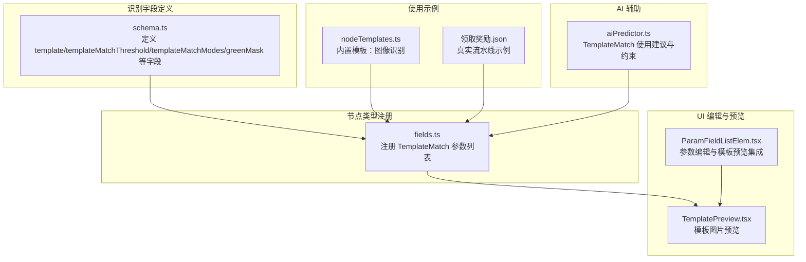
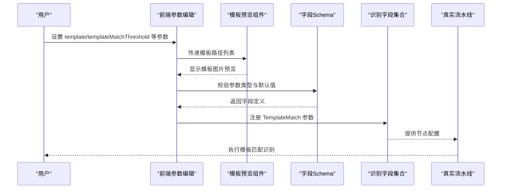
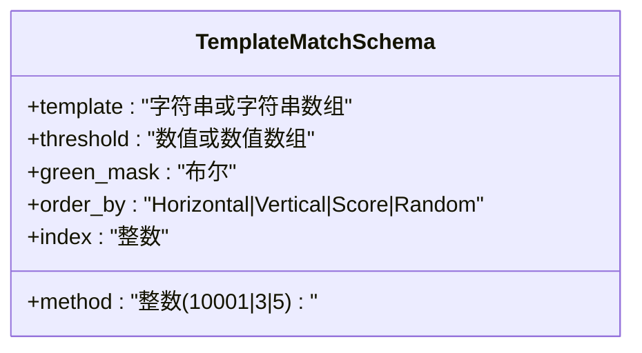
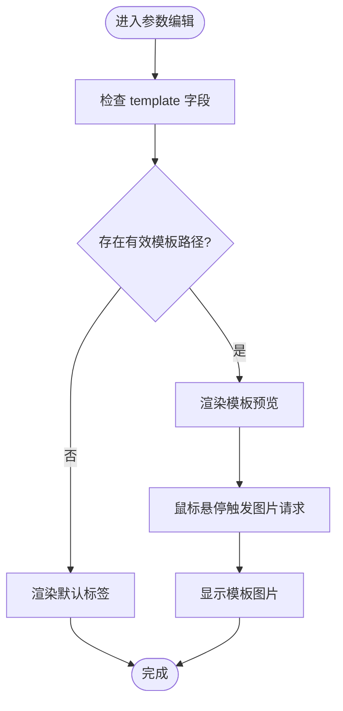
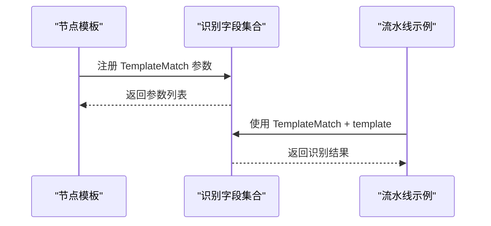
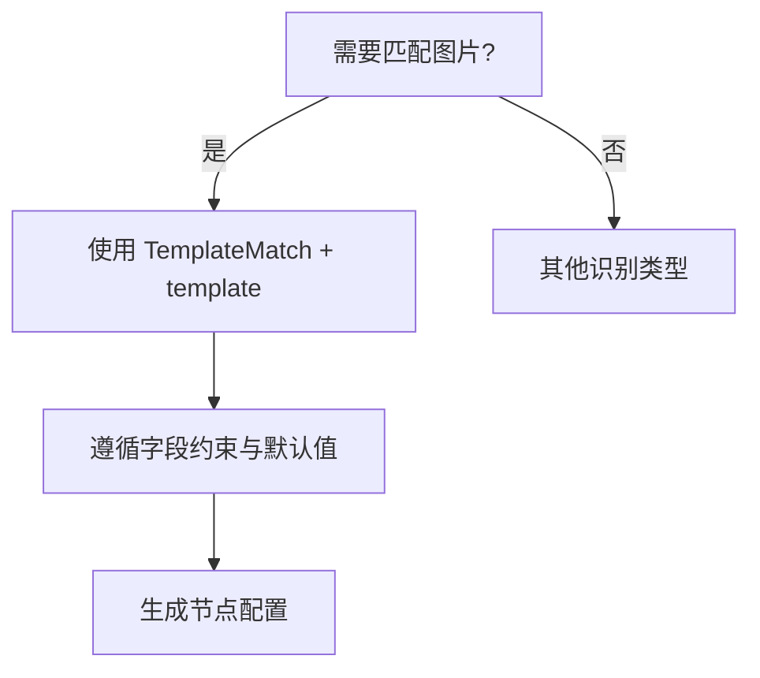
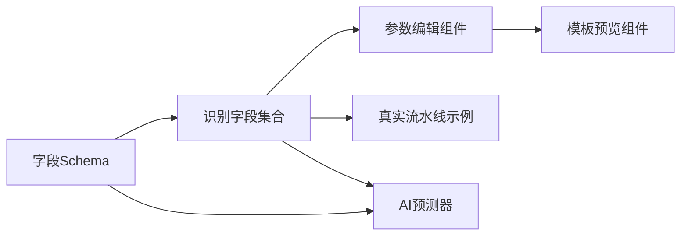

# TemplateMatch 模板匹配识别

<cite>
**本文档引用的文件**
- [schema.ts](file://src/core/fields/recognition/schema.ts)
- [fields.ts](file://src/core/fields/recognition/fields.ts)
- [TemplatePreview.tsx](file://src/components/panels/field/items/TemplatePreview.tsx)
- [ParamFieldListElem.tsx](file://src/components/panels/field/items/ParamFieldListElem.tsx)
- [aiPredictor.ts](file://src/utils/aiPredictor.ts)
- [nodeTemplates.ts](file://src/data/nodeTemplates.ts)
- [领取奖励.json](file://LocalBridge/test-json/base/pipeline/日常任务/领取奖励.json)
</cite>

## 目录
1. [简介](#简介)
2. [项目结构](#项目结构)
3. [核心组件](#核心组件)
4. [架构总览](#架构总览)
5. [详细组件分析](#详细组件分析)
6. [依赖关系分析](#依赖关系分析)
7. [性能考量](#性能考量)
8. [故障排除指南](#故障排除指南)
9. [结论](#结论)
10. [附录](#附录)

## 简介
TemplateMatch 是基于图像模板匹配的识别类型，用于在屏幕截图中查找与预设模板完全或近似匹配的图像区域。它通过比较模板与目标图像窗口的相似度，输出匹配得分和位置信息，并支持多种匹配算法、阈值控制、排序策略以及绿色遮罩等高级选项。TemplateMatch 适合识别固定图标、按钮、UI 元素等稳定图形内容。

## 项目结构
TemplateMatch 的实现分布在以下模块：
- 字段定义与校验：识别字段 Schema
- 节点类型注册：TemplateMatch 在识别节点集合中的声明
- UI 预览与编辑：模板图片预览组件与参数编辑组件
- 使用示例：内置节点模板与真实流水线示例
- AI 辅助配置：AI 预测器对 TemplateMatch 的使用建议与约束

**图表来源**
- [schema.ts:28-55](file://src/core/fields/recognition/schema.ts#L28-L55)
- [fields.ts:27-38](file://src/core/fields/recognition/fields.ts#L27-L38)
- [TemplatePreview.tsx:18-182](file://src/components/panels/field/items/TemplatePreview.tsx#L18-L182)
- [ParamFieldListElem.tsx:528-651](file://src/components/panels/field/items/ParamFieldListElem.tsx#L528-L651)
- [nodeTemplates.ts:33-46](file://src/data/nodeTemplates.ts#L33-L46)
- [领取奖励.json:309-312](file://LocalBridge/test-json/base/pipeline/日常任务/领取奖励.json#L309-L312)

**章节来源**
- [schema.ts:28-55](file://src/core/fields/recognition/schema.ts#L28-L55)
- [fields.ts:27-38](file://src/core/fields/recognition/fields.ts#L27-L38)
- [TemplatePreview.tsx:18-182](file://src/components/panels/field/items/TemplatePreview.tsx#L18-L182)
- [ParamFieldListElem.tsx:528-651](file://src/components/panels/field/items/ParamFieldListElem.tsx#L528-L651)
- [nodeTemplates.ts:33-46](file://src/data/nodeTemplates.ts#L33-L46)
- [aiPredictor.ts:295-304](file://src/utils/aiPredictor.ts#L295-L304)

## 核心组件
- 模板图片路径（template）
  - 类型：字符串或字符串数组
  - 必填：是
  - 默认值：[""]
  - 描述：模板图片的相对路径，位于 image 文件夹下；支持文件夹路径递归加载；模板应为无损原图缩放至 720p 后的裁剪
- 匹配阈值（templateMatchThreshold）
  - 类型：数值或数值数组
  - 默认值：[0.7]
  - 步长：0.01
  - 描述：匹配相似度阈值；若为数组，长度需与 template 数组一致
- 匹配模式（templateMatchModes）
  - 类型：整数
  - 可选值：10001, 3, 5
  - 默认值：5
  - 描述：OpenCV 模板匹配算法模式；10001 为 TM_SQDIFF_NORMED 的反转版本（分数越高越匹配）；3 为 TM_CCORR_NORMED（模板较亮时效果好）；5 为 TM_CCOEFF_NORMED（推荐，阈值易设定，光照鲁棒性好）
- 绿色遮罩（greenMask）
  - 类型：布尔
  - 默认值：true
  - 描述：是否启用绿色遮罩；启用后，将图片中 RGB(0, 255, 0) 的部分视为忽略区域，不参与匹配
- 结果排序（baseOrderBy）
  - 类型：字符串
  - 可选值：Horizontal | Vertical | Score | Random
  - 默认值：Horizontal
  - 描述：匹配结果的排序方式；可结合 index 使用
- 索引（index）
  - 类型：整数
  - 默认值：0
  - 描述：命中第几个结果；支持负索引（Python 风格）；超出范围视为无结果

**章节来源**
- [schema.ts:28-55](file://src/core/fields/recognition/schema.ts#L28-L55)
- [schema.ts:57-92](file://src/core/fields/recognition/schema.ts#L57-L92)

## 架构总览
TemplateMatch 的配置从字段 Schema 定义出发，注册到识别节点集合中，前端通过参数编辑组件渲染模板预览，最终在真实流水线中被使用。

**图表来源**
- [ParamFieldListElem.tsx:614-651](file://src/components/panels/field/items/ParamFieldListElem.tsx#L614-L651)
- [TemplatePreview.tsx:18-182](file://src/components/panels/field/items/TemplatePreview.tsx#L18-L182)
- [schema.ts:28-55](file://src/core/fields/recognition/schema.ts#L28-L55)
- [fields.ts:27-38](file://src/core/fields/recognition/fields.ts#L27-L38)
- [领取奖励.json:309-312](file://LocalBridge/test-json/base/pipeline/日常任务/领取奖励.json#L309-L312)

## 详细组件分析

### 字段定义与参数校验
- 字段类型与默认值由 Schema 统一定义，保证前后端一致性
- 支持数组形式的模板与阈值，便于多模板并行匹配
- 匹配模式枚举限定，避免无效配置

**图表来源**
- [schema.ts:28-55](file://src/core/fields/recognition/schema.ts#L28-L55)
- [schema.ts:57-92](file://src/core/fields/recognition/schema.ts#L57-L92)

**章节来源**
- [schema.ts:28-55](file://src/core/fields/recognition/schema.ts#L28-L55)
- [schema.ts:57-92](file://src/core/fields/recognition/schema.ts#L57-L92)

### UI 预览与参数编辑
- 模板预览组件在 hover 时请求并渲染模板图片，支持多模板并排显示
- 参数编辑组件根据字段类型渲染输入控件，并在模板字段处集成图片预览

**图表来源**
- [ParamFieldListElem.tsx:614-651](file://src/components/panels/field/items/ParamFieldListElem.tsx#L614-L651)
- [TemplatePreview.tsx:18-182](file://src/components/panels/field/items/TemplatePreview.tsx#L18-L182)

**章节来源**
- [ParamFieldListElem.tsx:528-651](file://src/components/panels/field/items/ParamFieldListElem.tsx#L528-L651)
- [TemplatePreview.tsx:18-182](file://src/components/panels/field/items/TemplatePreview.tsx#L18-L182)

### 节点注册与使用
- TemplateMatch 在识别字段集合中注册，包含 ROI、模板、阈值、排序、索引、匹配模式、绿色遮罩等参数
- 内置节点模板提供“图像识别”示例，便于快速创建
- 真实流水线示例展示了在任务界面中使用 TemplateMatch 匹配图标模板

**图表来源**
- [fields.ts:27-38](file://src/core/fields/recognition/fields.ts#L27-L38)
- [nodeTemplates.ts:33-46](file://src/data/nodeTemplates.ts#L33-L46)
- [领取奖励.json:309-312](file://LocalBridge/test-json/base/pipeline/日常任务/领取奖励.json#L309-L312)

**章节来源**
- [fields.ts:27-38](file://src/core/fields/recognition/fields.ts#L27-L38)
- [nodeTemplates.ts:33-46](file://src/data/nodeTemplates.ts#L33-L46)
- [领取奖励.json:309-312](file://LocalBridge/test-json/base/pipeline/日常任务/领取奖励.json#L309-L312)

### AI 辅助配置与约束
- AI 预测器明确 TemplateMatch 的专属字段与使用场景
- 约束规则强调：TemplateMatch/FeatureMatch 必须提供模板；OCR 使用 expected；颜色匹配使用 lower/upper

**图表来源**
- [aiPredictor.ts:295-304](file://src/utils/aiPredictor.ts#L295-L304)
- [aiPredictor.ts:384-409](file://src/utils/aiPredictor.ts#L384-L409)

**章节来源**
- [aiPredictor.ts:295-304](file://src/utils/aiPredictor.ts#L295-L304)
- [aiPredictor.ts:384-409](file://src/utils/aiPredictor.ts#L384-L409)

## 依赖关系分析
- 字段 Schema 为识别节点集合提供参数定义
- 参数编辑组件依赖字段定义与模板预览组件
- 真实流水线示例依赖节点注册与字段定义
- AI 预测器依赖字段定义与节点注册，提供使用建议

**图表来源**
- [schema.ts:28-55](file://src/core/fields/recognition/schema.ts#L28-L55)
- [fields.ts:27-38](file://src/core/fields/recognition/fields.ts#L27-L38)
- [ParamFieldListElem.tsx:528-651](file://src/components/panels/field/items/ParamFieldListElem.tsx#L528-L651)
- [TemplatePreview.tsx:18-182](file://src/components/panels/field/items/TemplatePreview.tsx#L18-L182)
- [领取奖励.json:309-312](file://LocalBridge/test-json/base/pipeline/日常任务/领取奖励.json#L309-L312)
- [aiPredictor.ts:295-304](file://src/utils/aiPredictor.ts#L295-L304)

**章节来源**
- [schema.ts:28-55](file://src/core/fields/recognition/schema.ts#L28-L55)
- [fields.ts:27-38](file://src/core/fields/recognition/fields.ts#L27-L38)
- [ParamFieldListElem.tsx:528-651](file://src/components/panels/field/items/ParamFieldListElem.tsx#L528-L651)
- [TemplatePreview.tsx:18-182](file://src/components/panels/field/items/TemplatePreview.tsx#L18-L182)
- [领取奖励.json:309-312](file://LocalBridge/test-json/base/pipeline/日常任务/领取奖励.json#L309-L312)
- [aiPredictor.ts:295-304](file://src/utils/aiPredictor.ts#L295-L304)

## 性能考量
- 模板质量
  - 尺寸与分辨率：模板应为无损原图缩放至 720p 后的裁剪，避免过度压缩导致细节丢失
  - 对比度与清晰度：高对比度、边缘清晰的模板更易匹配，减少误检
  - 多模板策略：当存在多个变体时，使用模板数组并配合阈值数组，提升鲁棒性
- 匹配算法选择
  - TM_CCOEFF_NORMED（默认）：光照鲁棒性好，阈值易设定，推荐用于大多数场景
  - TM_CCORR_NORMED：模板较亮时效果更好
  - TM_SQDIFF_NORMED 反转（10001）：分数越高越匹配，适用于特定场景
- 阈值设置
  - 初始阈值建议从 0.7 开始，逐步调整；多模板时为每个模板单独设置阈值
  - 高阈值降低误检但可能漏检，低阈值提高召回但增加误检风险
- ROI 与绿色遮罩
  - 合理设置 ROI 缩小搜索范围，提升性能
  - 启用绿色遮罩剔除干扰区域，减少误匹配
- 排序与索引
  - 使用排序策略（如按 Score 排序）结合索引，优先选择最优匹配

## 故障排除指南
- 模板无法匹配
  - 检查模板路径是否正确且位于 image 目录下
  - 确认模板分辨率与截图一致，避免过大或过小
  - 调整阈值或更换匹配模式
- 匹配结果不稳定
  - 启用绿色遮罩，剔除背景干扰
  - 缩小 ROI，减少无关区域影响
  - 使用多模板并行匹配，取最高分结果
- 性能问题
  - 减少模板数量与尺寸
  - 合理设置 ROI，避免全屏扫描
  - 选择合适的匹配模式，避免过于复杂的算法

## 结论
TemplateMatch 提供了稳定高效的图像模板匹配能力，通过合理的模板设计、阈值与算法选择，以及 ROI 和绿色遮罩的配合，能够在多数场景中取得良好效果。结合 AI 辅助配置与真实流水线示例，可快速构建可靠的识别节点。

## 附录
- 实际使用案例
  - 在“进入任务界面”节点中，使用 TemplateMatch + template 匹配主界面图标，定位目标区域
  - 在“进入通行证界面”节点中，使用 TemplateMatch + template 匹配通行证图标，触发下一步操作
- 最佳实践
  - 模板应为无损原图缩放后的裁剪，确保清晰度与对比度
  - 初次配置从默认阈值与匹配模式开始，逐步微调
  - 使用 ROI 精确定位，减少全局扫描
  - 启用绿色遮罩剔除背景干扰，提升稳定性

**章节来源**
- [领取奖励.json:309-312](file://LocalBridge/test-json/base/pipeline/日常任务/领取奖励.json#L309-L312)
- [领取奖励.json:347-352](file://LocalBridge/test-json/base/pipeline/日常任务/领取奖励.json#L347-L352)