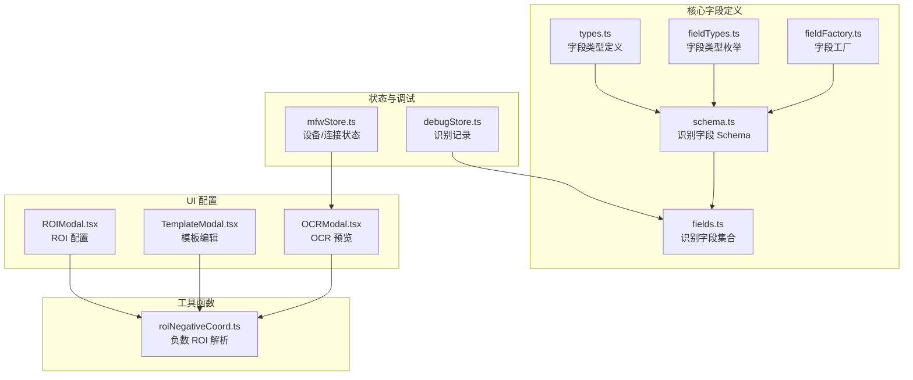
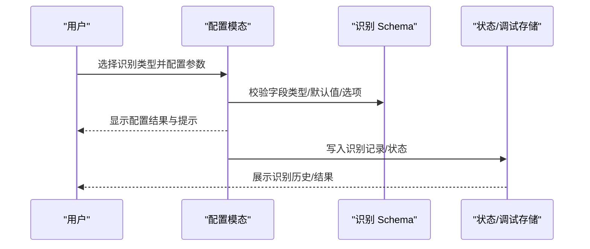
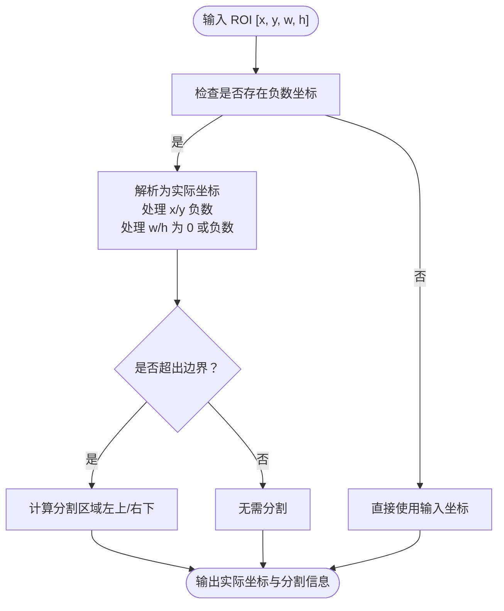
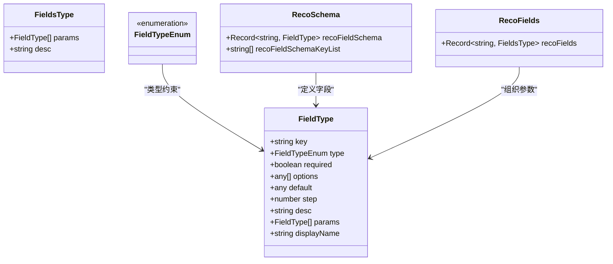

# 识别字段类型

<cite>
**本文档引用的文件**
- [schema.ts](file://src/core/fields/recognition/schema.ts)
- [fields.ts](file://src/core/fields/recognition/fields.ts)
- [types.ts](file://src/core/fields/types.ts)
- [fieldTypes.ts](file://src/core/fields/fieldTypes.ts)
- [fieldFactory.ts](file://src/core/fields/fieldFactory.ts)
- [OCRModal.tsx](file://src/components/modals/OCRModal.tsx)
- [TemplateModal.tsx](file://src/components/modals/TemplateModal.tsx)
- [ROIModal.tsx](file://src/components/modals/ROIModal.tsx)
- [roiNegativeCoord.ts](file://src/utils/roiNegativeCoord.ts)
- [mfwStore.ts](file://src/stores/mfwStore.ts)
- [debugStore.ts](file://src/stores/debugStore.ts)
</cite>

## 目录
1. [简介](#简介)
2. [项目结构](#项目结构)
3. [核心组件](#核心组件)
4. [架构总览](#架构总览)
5. [详细组件分析](#详细组件分析)
6. [依赖关系分析](#依赖关系分析)
7. [性能考量](#性能考量)
8. [故障排查指南](#故障排查指南)
9. [结论](#结论)
10. [附录](#附录)

## 简介
本文件系统性梳理并说明识别字段类型，覆盖 OCR 识别、模板匹配（TemplateMatch）、颜色匹配（ColorMatch）、特征匹配（FeatureMatch）、神经网络分类（NeuralNetworkClassify）、神经网络检测（NeuralNetworkDetect）、组合识别（And/Or）、自定义识别（Custom）以及直接命中（DirectHit）等类型。文档详细阐述每种识别类型的属性定义、配置参数、数据结构、使用示例、结果数据格式与后续处理方式，并给出精度优化建议与常见问题解决方案。

## 项目结构
识别字段的定义集中在核心字段模块，UI 提供了 ROI、模板、OCR 等可视化配置工具，工具函数负责负数 ROI 坐标的解析与渲染。

图表来源
- [schema.ts:1-276](file://src/core/fields/recognition/schema.ts#L1-L276)
- [fields.ts:1-115](file://src/core/fields/recognition/fields.ts#L1-L115)
- [types.ts:1-34](file://src/core/fields/types.ts#L1-L34)
- [fieldTypes.ts:1-27](file://src/core/fields/fieldTypes.ts#L1-L27)
- [fieldFactory.ts:1-16](file://src/core/fields/fieldFactory.ts#L1-L16)
- [ROIModal.tsx:1-564](file://src/components/modals/ROIModal.tsx#L1-L564)
- [TemplateModal.tsx:1-991](file://src/components/modals/TemplateModal.tsx#L1-L991)
- [OCRModal.tsx:1-1059](file://src/components/modals/OCRModal.tsx#L1-L1059)
- [roiNegativeCoord.ts:1-313](file://src/utils/roiNegativeCoord.ts#L1-L313)
- [mfwStore.ts:1-158](file://src/stores/mfwStore.ts#L1-L158)
- [debugStore.ts:56-103](file://src/stores/debugStore.ts#L56-L103)

章节来源
- [schema.ts:1-276](file://src/core/fields/recognition/schema.ts#L1-L276)
- [fields.ts:1-115](file://src/core/fields/recognition/fields.ts#L1-L115)

## 核心组件
- 识别字段 Schema：统一定义所有识别类型的字段键、类型、默认值、选项、步长与描述。
- 识别字段集合：按识别类型组织字段参数，形成可复用的配置模板。
- 字段类型与枚举：定义字段类型系统（基础类型、复合类型、图片路径类型等）。
- 字段工厂：简化字段定义与批量创建。
- ROI 工具：支持负数坐标、零宽高、右下角定位等高级 ROI 语法。
- UI 配置模态：提供 ROI、模板、OCR 的可视化编辑与验证。

章节来源
- [types.ts:1-34](file://src/core/fields/types.ts#L1-L34)
- [fieldTypes.ts:1-27](file://src/core/fields/fieldTypes.ts#L1-L27)
- [fieldFactory.ts:1-16](file://src/core/fields/fieldFactory.ts#L1-L16)
- [roiNegativeCoord.ts:1-313](file://src/utils/roiNegativeCoord.ts#L1-L313)

## 架构总览
识别字段的配置由 Schema 决定，UI 模态负责采集用户输入并校验，最终落盘为 JSON 配置。识别结果通过状态与调试存储进行追踪与展示。

图表来源
- [OCRModal.tsx:291-321](file://src/components/modals/OCRModal.tsx#L291-L321)
- [ROIModal.tsx:217-232](file://src/components/modals/ROIModal.tsx#L217-L232)
- [TemplateModal.tsx:379-496](file://src/components/modals/TemplateModal.tsx#L379-L496)
- [schema.ts:1-276](file://src/core/fields/recognition/schema.ts#L1-L276)
- [debugStore.ts:84-103](file://src/stores/debugStore.ts#L84-L103)

## 详细组件分析

### 通用字段
- roi：感兴趣区域（ROI），支持数组 [x, y, w, h] 或字符串引用前置节点/锚点。v5.6 起支持负数坐标与零宽高语义。
- roiOffset：在 roi 基础上额外平移的偏移量，逐项相加。
- index：命中第几个结果，支持负索引（Python 风格），超出范围视为无结果。

章节来源
- [schema.ts:9-26](file://src/core/fields/recognition/schema.ts#L9-L26)
- [roiNegativeCoord.ts:55-178](file://src/utils/roiNegativeCoord.ts#L55-L178)

### DirectHit（直接命中）
- 描述：不进行识别，直接执行动作。
- 参数：仅包含 roi 与 roiOffset。
- 适用场景：固定坐标点击、滑动等无需识别的场景。

章节来源
- [fields.ts:8-11](file://src/core/fields/recognition/fields.ts#L8-L11)

### OCR（光学字符识别）
- 必选参数：expected（期望文本，支持正则）、roi、roiOffset。
- 可选参数：threshold（置信度阈值）、replace（替换映射）、lengthExpectedOrderBy（按长度排序）、index、onlyRec（仅识别不检测）、model（模型路径）、colorFilter（颜色过滤节点引用）。
- 数据结构：期望字符串列表或单个字符串；阈值为双精度；replace 为键值对列表。
- 使用示例：在 ROI 内提取文本，通过 expected 正则匹配，必要时使用 colorFilter 先做颜色二值化。
- 结果数据格式：成功返回文本与置信度，失败返回错误码或空内容标记。
- 后续处理：可结合 replace 进行文本清洗，结合 onlyRec 精确控制识别范围。

章节来源
- [fields.ts:12-25](file://src/core/fields/recognition/fields.ts#L12-L25)
- [schema.ts:150-188](file://src/core/fields/recognition/schema.ts#L150-L188)
- [OCRModal.tsx:291-321](file://src/components/modals/OCRModal.tsx#L291-L321)

### TemplateMatch（模板匹配）
- 必选参数：template（模板路径，支持文件夹递归加载）、roi、roiOffset。
- 可选参数：threshold（相似度阈值，默认 0.7，可为数组与模板一一对应）、method（匹配算法，默认 5，即归一化相关系数）、green_mask（绿色掩码，默认 false）。
- 排序：order_by（默认 Horizontal）。
- 使用示例：在 ROI 内查找模板，通过阈值与算法筛选匹配结果。
- 结果数据格式：返回匹配框与得分，index 指定第几个结果。
- 后续处理：结合 order_by 与 index 精确选择目标。

章节来源
- [fields.ts:27-38](file://src/core/fields/recognition/fields.ts#L27-L38)
- [schema.ts:28-55](file://src/core/fields/recognition/schema.ts#L28-L55)

### ColorMatch（颜色匹配）
- 必选参数：method（颜色空间，如 RGB/HSV/GRAY）、lower/upper（颜色范围，通道数与 method 一致）、roi、roiOffset。
- 可选参数：count（符合像素点的最低数量）、connected（是否仅统计连通块）、order_by（Area/Score/Random/Expected 等）。
- 使用示例：在 ROI 内按颜色阈值筛选像素，统计连通区域数量。
- 结果数据格式：返回匹配区域与统计结果，index 指定第几个区域。
- 后续处理：结合 connected 与 count 控制误检率。

章节来源
- [fields.ts:40-52](file://src/core/fields/recognition/fields.ts#L40-L52)
- [schema.ts:116-148](file://src/core/fields/recognition/schema.ts#L116-L148)

### FeatureMatch（特征匹配）
- 必选参数：template、roi、roiOffset。
- 可选参数：count（特征点最低数量）、detector（SIFT/KAZE/AKAZE/BRISK/ORB）、ratio（KNN 距离比值）、order_by、index、green_mask。
- 使用示例：在 ROI 内使用特征检测器匹配模板，适合抗透视、抗尺寸变化场景。
- 结果数据格式：返回匹配框与特征点数量。
- 后续处理：根据 detector 与 ratio 调整鲁棒性与召回。

章节来源
- [fields.ts:63-76](file://src/core/fields/recognition/fields.ts#L63-L76)
- [schema.ts:94-114](file://src/core/fields/recognition/schema.ts#L94-L114)

### NeuralNetworkClassify（神经网络分类）
- 必选参数：model（ONNX 模型路径）、expected（期望类别下标）、roi、roiOffset。
- 可选参数：labels（类别名称列表，调试用）、order_by（Score/Random/Expected 等）。
- 使用示例：在固定位置判断图像属于哪个类别。
- 结果数据格式：返回类别概率与预测类别。
- 后续处理：结合 labels 便于调试与日志输出。

章节来源
- [fields.ts:89-98](file://src/core/fields/recognition/fields.ts#L89-L98)
- [schema.ts:190-211](file://src/core/fields/recognition/schema.ts#L190-L211)

### NeuralNetworkDetect（神经网络检测）
- 必选参数：model（YOLOv8 ONNX 模型路径）、expected（类别下标）、roi、roiOffset。
- 可选参数：labels、threshold（置信度阈值）、order_by（Area/Score/Random/Expected 等）、index。
- 使用示例：在任意位置检测目标，适合复杂场景。
- 结果数据格式：返回多个检测框与类别概率。
- 后续处理：结合 index 与 order_by 精确选择目标。

章节来源
- [fields.ts:101-113](file://src/core/fields/recognition/fields.ts#L101-L113)
- [schema.ts:212-218](file://src/core/fields/recognition/schema.ts#L212-L218)

### And/Or（组合识别）
- And：all_of 子识别列表全部命中才成功，可指定 box_index 与 sub_name。
- Or：any_of 子识别列表命中第一个即成功，后续不再识别。
- 使用示例：先颜色匹配再 OCR，或先模板匹配再颜色过滤。
- 结果数据格式：组合识别返回首个子识别的 box 作为当前节点的识别框（可配置）。
- 后续处理：通过 sub_name 将前序识别结果作为后续识别的 ROI。

章节来源
- [fields.ts:77-88](file://src/core/fields/recognition/fields.ts#L77-L88)
- [schema.ts:220-246](file://src/core/fields/recognition/schema.ts#L220-L246)

### Custom（自定义识别）
- 必选参数：custom_recognition（识别名）、custom_recognition_param（任意参数）、roi（可选）。
- 使用示例：通过自定义回调执行第三方识别逻辑。
- 结果数据格式：由自定义识别器决定，通常包含识别框与置信度。
- 后续处理：结合 roiOffset 与 index 精确控制识别区域。

章节来源
- [fields.ts:54-62](file://src/core/fields/recognition/fields.ts#L54-L62)
- [schema.ts:248-267](file://src/core/fields/recognition/schema.ts#L248-L267)

### ROI 区域设置与负数坐标
- 语法支持：x/y 负数表示从右/下边缘计算；w/h 为 0 表示延伸至边缘；w/h 负数时取绝对值并将 (x, y) 视为右下角。
- 工具函数：解析负数坐标、计算扩展画布尺寸、绘制扩展边距与标签。
- UI 支持：ROIModal、TemplateModal、OCRModal 均支持负数坐标输入与可视化反馈。

图表来源
- [roiNegativeCoord.ts:55-178](file://src/utils/roiNegativeCoord.ts#L55-L178)
- [ROIModal.tsx:46-121](file://src/components/modals/ROIModal.tsx#L46-L121)
- [TemplateModal.tsx:103-199](file://src/components/modals/TemplateModal.tsx#L103-L199)
- [OCRModal.tsx:323-395](file://src/components/modals/OCRModal.tsx#L323-L395)

章节来源
- [roiNegativeCoord.ts:1-313](file://src/utils/roiNegativeCoord.ts#L1-L313)
- [ROIModal.tsx:1-564](file://src/components/modals/ROIModal.tsx#L1-L564)
- [TemplateModal.tsx:1-991](file://src/components/modals/TemplateModal.tsx#L1-L991)
- [OCRModal.tsx:1-1059](file://src/components/modals/OCRModal.tsx#L1-L1059)

### 识别结果的数据格式与后续处理
- 识别记录：包含识别 ID、节点名称、状态、命中情况、时间戳等，便于调试与回溯。
- OCR 结果：包含文本、置信度、错误码与“无内容”标记；前端/原生两种模式。
- 模板/颜色/特征识别：返回匹配框与得分，index 与 order_by 控制结果选择。
- 组合识别：返回首个子识别的 box 作为当前节点的识别框（可配置）。

章节来源
- [debugStore.ts:84-103](file://src/stores/debugStore.ts#L84-L103)
- [OCRModal.tsx:291-321](file://src/components/modals/OCRModal.tsx#L291-L321)
- [schema.ts:220-246](file://src/core/fields/recognition/schema.ts#L220-L246)

## 依赖关系分析

图表来源
- [types.ts:6-24](file://src/core/fields/types.ts#L6-L24)
- [fieldTypes.ts:4-26](file://src/core/fields/fieldTypes.ts#L4-L26)
- [schema.ts:7-276](file://src/core/fields/recognition/schema.ts#L7-L276)
- [fields.ts:7-115](file://src/core/fields/recognition/fields.ts#L7-L115)

章节来源
- [types.ts:1-34](file://src/core/fields/types.ts#L1-L34)
- [fieldTypes.ts:1-27](file://src/core/fields/fieldTypes.ts#L1-L27)
- [schema.ts:1-276](file://src/core/fields/recognition/schema.ts#L1-L276)
- [fields.ts:1-115](file://src/core/fields/recognition/fields.ts#L1-L115)

## 性能考量
- ROI 精准：尽量缩小 ROI，减少不必要的图像处理。
- 阈值调优：OCR 的 threshold 与模板匹配的 threshold/ratio 需结合场景调优，避免过高或过低。
- 算法选择：特征匹配在抗透视/尺寸变化场景更稳健，但计算成本更高；模板匹配速度较快但鲁棒性有限。
- 模型选择：神经网络检测模型复杂度更高，需权衡精度与性能。
- 批处理优化：组合识别（And/Or）可减少重复识别，提升整体效率。

## 故障排查指南
- OCR 资源未配置：前端会提示资源路径未配置，需运行配置命令并重启服务。
- ROI 超出边界：负数坐标可能导致 ROI 被分割，需检查分割后的区域是否正确。
- 颜色匹配误检：提高 lower/upper 阈值或启用 connected 连通块统计。
- 模板匹配失败：调整阈值、更换匹配算法或启用绿色掩码。
- 组合识别无结果：检查子识别顺序与依赖关系，确保前置节点有结果。

章节来源
- [OCRModal.tsx:304-314](file://src/components/modals/OCRModal.tsx#L304-L314)
- [roiNegativeCoord.ts:125-178](file://src/utils/roiNegativeCoord.ts#L125-L178)
- [schema.ts:28-55](file://src/core/fields/recognition/schema.ts#L28-L55)

## 结论
识别字段类型体系提供了从基础模板/颜色/OCR 到高级特征匹配与神经网络的完整能力。通过统一的 Schema 与 UI 工具，用户可以高效地配置识别参数、优化 ROI、调优阈值与算法，并获得清晰的识别结果与调试信息。建议在实际应用中结合场景选择合适的识别类型与参数，持续迭代以提升识别精度与稳定性。

## 附录
- 字段类型枚举涵盖基础类型、列表类型、图片路径类型与复合类型，满足不同识别需求。
- 字段工厂简化了字段定义与批量创建，便于维护一致性。

章节来源
- [fieldTypes.ts:1-27](file://src/core/fields/fieldTypes.ts#L1-L27)
- [fieldFactory.ts:1-16](file://src/core/fields/fieldFactory.ts#L1-L16)