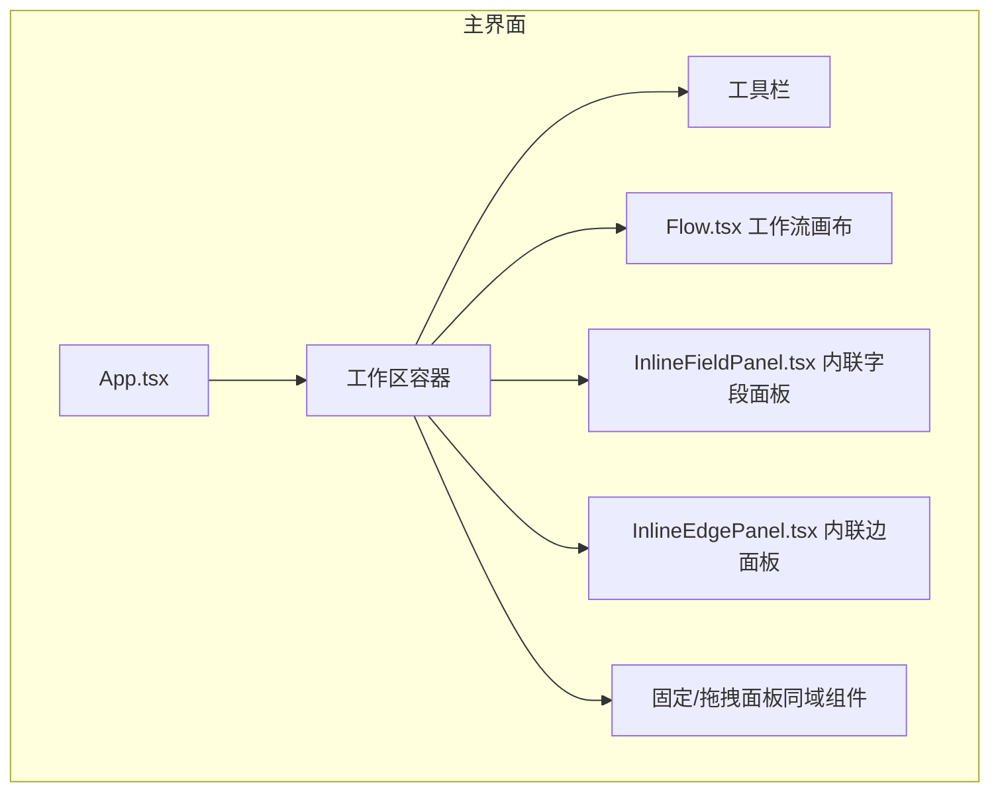
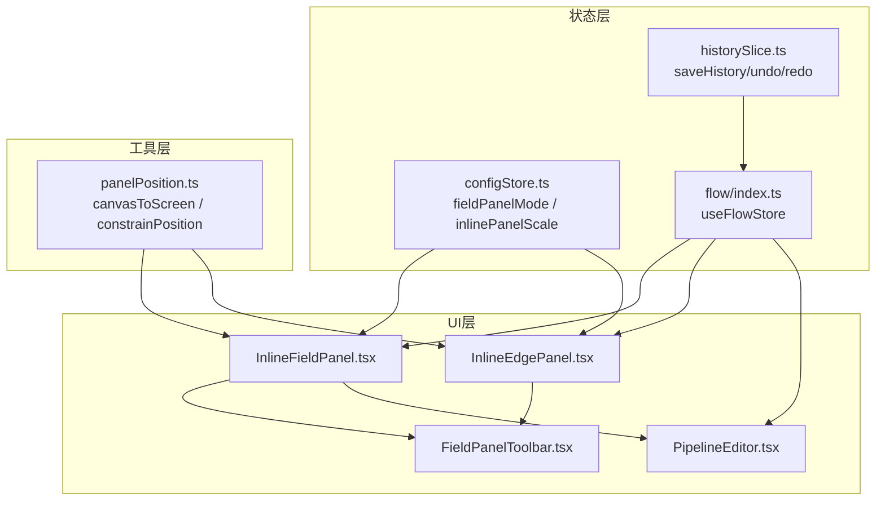
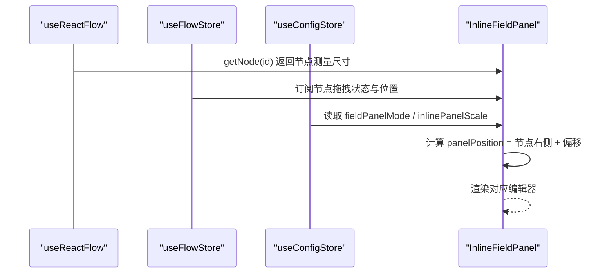
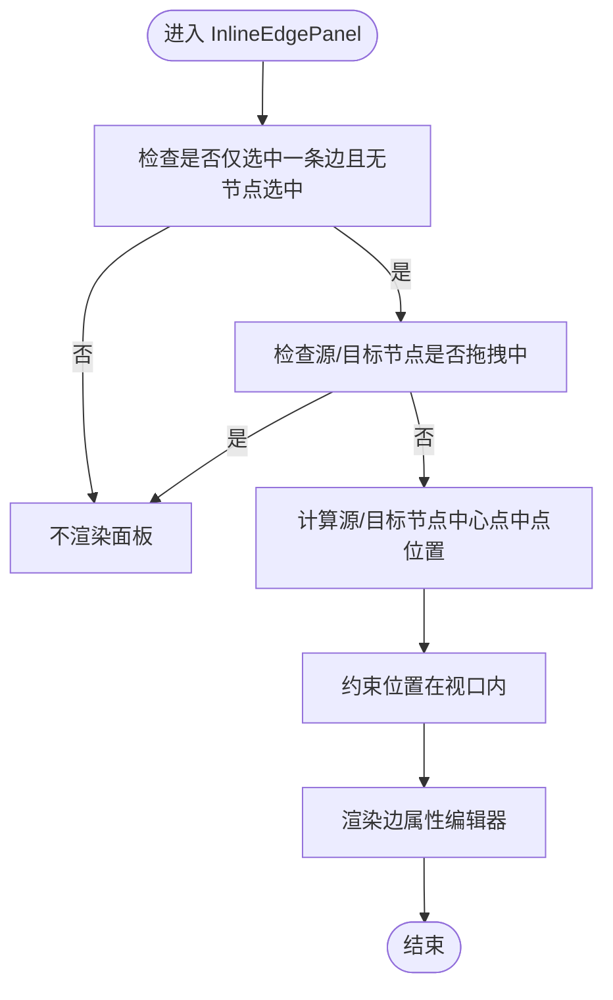
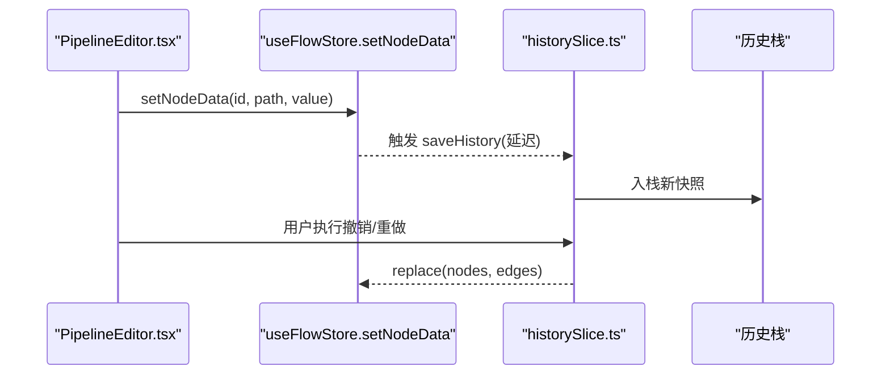
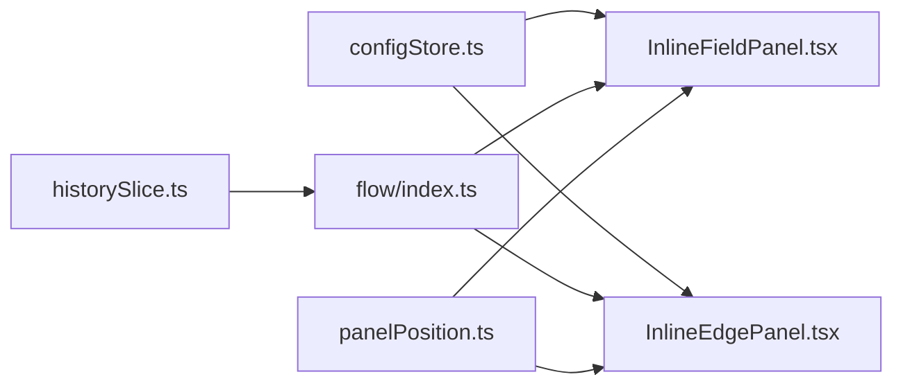

# 内联字段编辑器

<cite>
**本文引用的文件**
- [InlineFieldPanel.tsx](file://src/components/panels/main/InlineFieldPanel.tsx)
- [InlineEdgePanel.tsx](file://src/components/panels/main/InlineEdgePanel.tsx)
- [InlineFieldPanel.module.less](file://src/styles/InlineFieldPanel.module.less)
- [FieldPanel.module.less](file://src/styles/FieldPanel.module.less)
- [FieldPanelToolbar.tsx](file://src/components/panels/field/tools/FieldPanelToolbar.tsx)
- [PipelineEditor.tsx](file://src/components/panels/node-editors/PipelineEditor.tsx)
- [configStore.ts](file://src/stores/configStore.ts)
- [flow/index.ts](file://src/stores/flow/index.ts)
- [historySlice.ts](file://src/stores/flow/slices/historySlice.ts)
- [types.ts](file://src/stores/flow/types.ts)
- [panelPosition.ts](file://src/utils/panelPosition.ts)
- [Flow.tsx](file://src/components/Flow.tsx)
- [App.tsx](file://src/App.tsx)
</cite>

## 目录
1. [简介](#简介)
2. [项目结构](#项目结构)
3. [核心组件](#核心组件)
4. [架构总览](#架构总览)
5. [详细组件分析](#详细组件分析)
6. [依赖关系分析](#依赖关系分析)
7. [性能考量](#性能考量)
8. [故障排查指南](#故障排查指南)
9. [结论](#结论)
10. [附录](#附录)

## 简介
本文件系统性阐述内联字段编辑器组件的设计与实现，重点覆盖以下内容：
- InlineFieldPanel 内联字段面板与 InlineEdgePanel 内联边编辑器的工作机制与触发条件
- 实时编辑、自动保存、撤销重做、焦点管理等高级特性
- 与工作流图的集成方式：位置计算、层级管理、冲突处理
- 性能优化策略与用户体验设计原则
- 扩展开发指南与自定义配置选项

## 项目结构
内联编辑器位于主面板区域，与固定面板、拖拽面板共同构成字段面板体系；其渲染采用视口传送门（ViewportPortal）挂载到画布外层，确保在缩放与平移场景下稳定显示。

图表来源
- [App.tsx:296-330](file://src/App.tsx#L296-L330)
- [Flow.tsx:1-200](file://src/components/Flow.tsx#L1-L200)
- [InlineFieldPanel.tsx:141-189](file://src/components/panels/main/InlineFieldPanel.tsx#L141-L189)
- [InlineEdgePanel.tsx:190-286](file://src/components/panels/main/InlineEdgePanel.tsx#L190-L286)

章节来源
- [App.tsx:296-330](file://src/App.tsx#L296-L330)
- [Flow.tsx:1-200](file://src/components/Flow.tsx#L1-L200)

## 核心组件
- InlineFieldPanel：在节点右侧内联展示字段编辑器，随节点拖拽实时更新位置，支持加载遮罩与进度反馈。
- InlineEdgePanel：在边中点附近内联展示边属性编辑器，支持顺序调整、JumpBack 开关、删除连接等操作。
- 面板样式：统一使用内联面板样式模块，支持缩放与绝对定位，避免与画布布局冲突。
- 配置联动：受全局面板模式与缩放比例配置影响，仅在 inline 模式下生效。

章节来源
- [InlineFieldPanel.tsx:31-192](file://src/components/panels/main/InlineFieldPanel.tsx#L31-L192)
- [InlineEdgePanel.tsx:55-290](file://src/components/panels/main/InlineEdgePanel.tsx#L55-L290)
- [InlineFieldPanel.module.less:1-68](file://src/styles/InlineFieldPanel.module.less#L1-L68)
- [FieldPanel.module.less:1-200](file://src/styles/FieldPanel.module.less#L1-L200)
- [configStore.ts:195-211](file://src/stores/configStore.ts#L195-L211)

## 架构总览
内联编辑器通过订阅画布状态与选择状态，动态决定显示与位置；编辑器内容由具体节点编辑器按类型渲染；配置存储负责面板模式与缩放比例；历史切片提供撤销重做能力；面板位置工具负责边界约束与嵌入跟随。

图表来源
- [configStore.ts:195-211](file://src/stores/configStore.ts#L195-L211)
- [flow/index.ts:16-24](file://src/stores/flow/index.ts#L16-L24)
- [historySlice.ts:49-108](file://src/stores/flow/slices/historySlice.ts#L49-L108)
- [InlineFieldPanel.tsx:33-108](file://src/components/panels/main/InlineFieldPanel.tsx#L33-L108)
- [InlineEdgePanel.tsx:57-172](file://src/components/panels/main/InlineEdgePanel.tsx#L57-L172)
- [FieldPanelToolbar.tsx:67-238](file://src/components/panels/field/tools/FieldPanelToolbar.tsx#L67-L238)
- [PipelineEditor.tsx:22-55](file://src/components/panels/node-editors/PipelineEditor.tsx#L22-L55)
- [panelPosition.ts:15-170](file://src/utils/panelPosition.ts#L15-L170)

## 详细组件分析

### InlineFieldPanel 内联字段面板
- 触发条件与显示逻辑
  - 仅当全局面板模式为 inline 时渲染。
  - 当前选中节点存在且非 Group 类型时显示。
  - 节点拖拽中隐藏，避免交互冲突。
  - 支持加载遮罩与进度反馈，便于长耗时操作。
- 位置计算
  - 基于节点实时位置与测量尺寸，计算面板在节点右侧的绝对坐标。
  - 使用 transform 缩放，transform-origin 设为左上角，保证缩放不偏移。
- 编辑器内容
  - 根据节点类型动态渲染对应编辑器（Pipeline/External/Anchor/Sticker）。
  - 顶部工具栏提供复制节点名、保存模板、AI预测、删除节点等操作。
- 事件处理
  - 阻止面板事件冒泡到画布，避免干扰画布交互。

图表来源
- [InlineFieldPanel.tsx:33-108](file://src/components/panels/main/InlineFieldPanel.tsx#L33-L108)
- [InlineFieldPanel.module.less:14-25](file://src/styles/InlineFieldPanel.module.less#L14-L25)

章节来源
- [InlineFieldPanel.tsx:31-192](file://src/components/panels/main/InlineFieldPanel.tsx#L31-L192)
- [InlineFieldPanel.module.less:1-68](file://src/styles/InlineFieldPanel.module.less#L1-L68)
- [FieldPanelToolbar.tsx:67-238](file://src/components/panels/field/tools/FieldPanelToolbar.tsx#L67-L238)

### InlineEdgePanel 内联边编辑器
- 触发条件与显示逻辑
  - 仅当仅选中一条边且未选中节点时显示。
  - 源/目标节点任一拖拽中隐藏，避免冲突。
- 位置计算
  - 基于源/目标节点中心点计算边中点，稍作偏移避免遮挡。
  - 结合面板尺寸与视口约束，确保在可视区域内显示。
- 边属性编辑
  - 显示源/目标节点标签与连接类型标签。
  - 支持顺序输入框与最大序号限制。
  - 对特定类型边（如 Error）提供 JumpBack 开关。
  - 提供删除连接按钮。

图表来源
- [InlineEdgePanel.tsx:70-187](file://src/components/panels/main/InlineEdgePanel.tsx#L70-L187)
- [panelPosition.ts:159-170](file://src/utils/panelPosition.ts#L159-L170)

章节来源
- [InlineEdgePanel.tsx:55-290](file://src/components/panels/main/InlineEdgePanel.tsx#L55-L290)
- [panelPosition.ts:56-170](file://src/utils/panelPosition.ts#L56-L170)

### 节点编辑器（以 PipelineEditor 为例）
- 实时编辑
  - 通过 store 的 setNodeData 方法即时更新节点数据，配合历史切片实现自动保存。
- 焦点管理
  - focus 字段支持字符串与结构化对象两种模式，提供新增、变更、删除操作。
  - 切换模式时进行确认提示，避免误操作丢失数据。
- 自动保存与撤销重做
  - 历史切片在状态变更后延迟保存快照，支持 undo/redo。
  - 替换图数据时可选择跳过历史记录，避免历史污染。

图表来源
- [PipelineEditor.tsx:116-186](file://src/components/panels/node-editors/PipelineEditor.tsx#L116-L186)
- [historySlice.ts:49-108](file://src/stores/flow/slices/historySlice.ts#L49-L108)
- [types.ts:271-283](file://src/stores/flow/types.ts#L271-L283)

章节来源
- [PipelineEditor.tsx:1-200](file://src/components/panels/node-editors/PipelineEditor.tsx#L1-L200)
- [historySlice.ts:1-229](file://src/stores/flow/slices/historySlice.ts#L1-L229)
- [types.ts:257-283](file://src/stores/flow/types.ts#L257-L283)

### 面板工具栏与加载反馈
- 工具栏提供复制节点名、复制 Reco JSON、保存模板、AI 预测、删除节点等操作。
- 加载遮罩与进度回调用于长耗时操作的可视化反馈。

章节来源
- [FieldPanelToolbar.tsx:67-238](file://src/components/panels/field/tools/FieldPanelToolbar.tsx#L67-L238)
- [InlineFieldPanel.tsx:78-82](file://src/components/panels/main/InlineFieldPanel.tsx#L78-L82)

## 依赖关系分析
- 配置依赖：fieldPanelMode 控制是否启用内联模式；inlinePanelScale 控制缩放比例。
- 状态依赖：useFlowStore 提供节点/边/选择状态；useReactFlow 提供节点测量尺寸与视口状态。
- 历史依赖：historySlice 提供自动保存、撤销重做能力。
- 工具依赖：panelPosition 提供坐标转换与边界约束。

图表来源
- [configStore.ts:195-211](file://src/stores/configStore.ts#L195-L211)
- [InlineFieldPanel.tsx:33-108](file://src/components/panels/main/InlineFieldPanel.tsx#L33-L108)
- [InlineEdgePanel.tsx:57-172](file://src/components/panels/main/InlineEdgePanel.tsx#L57-L172)
- [flow/index.ts:16-24](file://src/stores/flow/index.ts#L16-L24)
- [historySlice.ts:49-108](file://src/stores/flow/slices/historySlice.ts#L49-L108)
- [panelPosition.ts:15-170](file://src/utils/panelPosition.ts#L15-L170)

章节来源
- [configStore.ts:195-211](file://src/stores/configStore.ts#L195-L211)
- [flow/index.ts:16-24](file://src/stores/flow/index.ts#L16-L24)
- [historySlice.ts:1-229](file://src/stores/flow/slices/historySlice.ts#L1-L229)
- [panelPosition.ts:1-170](file://src/utils/panelPosition.ts#L1-L170)

## 性能考量
- 渲染优化
  - 使用 useMemo 缓存面板位置与渲染内容，减少不必要的重渲染。
  - 使用 memo 包装组件，避免无关 props 变化导致的重渲染。
- 事件处理
  - 阻止面板事件冒泡，降低画布事件处理开销。
- 坐标计算
  - 使用 useStore 订阅节点拖拽状态，避免全量订阅导致的抖动。
  - 位置计算仅在必要时触发，结合 transform 缩放避免重排。
- 历史保存
  - 延迟保存（setTimeout）合并频繁变更，降低写入频率。
- 可见性控制
  - 拖拽中隐藏面板，避免无效渲染与交互冲突。

章节来源
- [InlineFieldPanel.tsx:46-108](file://src/components/panels/main/InlineFieldPanel.tsx#L46-L108)
- [InlineEdgePanel.tsx:78-187](file://src/components/panels/main/InlineEdgePanel.tsx#L78-L187)
- [historySlice.ts:49-108](file://src/stores/flow/slices/historySlice.ts#L49-L108)

## 故障排查指南
- 面板不显示
  - 检查全局面板模式是否为 inline。
  - 确认当前是否选中节点且非 Group 类型。
  - 若节点处于拖拽中，面板将被隐藏。
- 位置异常
  - 检查节点测量尺寸是否可用，若不可用将回退默认尺寸。
  - 确认缩放比例配置是否合理。
- 编辑无效
  - 确认 setNodeData 调用链路是否正确，以及历史切片是否正常保存。
  - 撤销/重做后需确保替换图数据时未保存多余历史。
- 边面板不出现
  - 确认仅选中一条边且未同时选中节点。
  - 源/目标节点拖拽中将隐藏边面板。

章节来源
- [configStore.ts:195-211](file://src/stores/configStore.ts#L195-L211)
- [InlineFieldPanel.tsx:110-129](file://src/components/panels/main/InlineFieldPanel.tsx#L110-L129)
- [InlineEdgePanel.tsx:70-187](file://src/components/panels/main/InlineEdgePanel.tsx#L70-L187)
- [historySlice.ts:110-150](file://src/stores/flow/slices/historySlice.ts#L110-L150)

## 结论
内联字段编辑器通过“视口传送门 + 响应式订阅 + 坐标约束”的组合，在保持良好交互体验的同时兼顾性能与稳定性。其与工作流图的状态解耦、与历史切片的协作，使得实时编辑具备可靠的持久化与恢复能力。通过合理的配置与扩展点，可进一步提升编辑效率与可定制性。

## 附录

### 高级特性一览
- 实时编辑：通过 store 的 setNodeData 即时更新节点数据。
- 自动保存：historySlice 延迟保存快照，支持批量合并。
- 撤销重做：基于历史栈的 undo/redo，支持替换图数据时的无历史模式。
- 焦点管理：focus 字段的字符串/结构化模式切换与确认提示。
- 加载反馈：工具栏回调驱动的加载遮罩与进度提示。

章节来源
- [PipelineEditor.tsx:116-186](file://src/components/panels/node-editors/PipelineEditor.tsx#L116-L186)
- [historySlice.ts:49-204](file://src/stores/flow/slices/historySlice.ts#L49-L204)
- [FieldPanelToolbar.tsx:119-183](file://src/components/panels/field/tools/FieldPanelToolbar.tsx#L119-L183)

### 与工作流图的集成要点
- 位置计算：使用节点测量尺寸与中心点计算，结合视口缩放与平移。
- 层级管理：通过 transform-origin 与 z-index 控制层级，避免遮挡。
- 冲突处理：拖拽中隐藏面板，避免与画布交互冲突；边面板仅在单边选中时显示。

章节来源
- [InlineFieldPanel.tsx:63-69](file://src/components/panels/main/InlineFieldPanel.tsx#L63-L69)
- [InlineEdgePanel.tsx:94-124](file://src/components/panels/main/InlineEdgePanel.tsx#L94-L124)
- [InlineFieldPanel.module.less:14-25](file://src/styles/InlineFieldPanel.module.less#L14-L25)
- [panelPosition.ts:15-170](file://src/utils/panelPosition.ts#L15-L170)

### 扩展开发指南
- 新增节点类型编辑器
  - 在 InlineFieldPanel 的渲染分支中增加类型判断与编辑器组件。
  - 确保编辑器通过 setNodeData 更新节点数据。
- 自定义面板行为
  - 通过配置项控制面板模式与缩放比例。
  - 如需更复杂的布局，可复用 panelPosition 工具进行坐标转换与约束。
- 历史与撤销
  - 在关键编辑动作后调用 saveHistory，必要时传入延迟参数。
  - 对批量操作可考虑在替换图数据时跳过历史保存。

章节来源
- [InlineFieldPanel.tsx:88-108](file://src/components/panels/main/InlineFieldPanel.tsx#L88-L108)
- [configStore.ts:195-211](file://src/stores/configStore.ts#L195-L211)
- [historySlice.ts:49-108](file://src/stores/flow/slices/historySlice.ts#L49-L108)
- [panelPosition.ts:15-170](file://src/utils/panelPosition.ts#L15-L170)