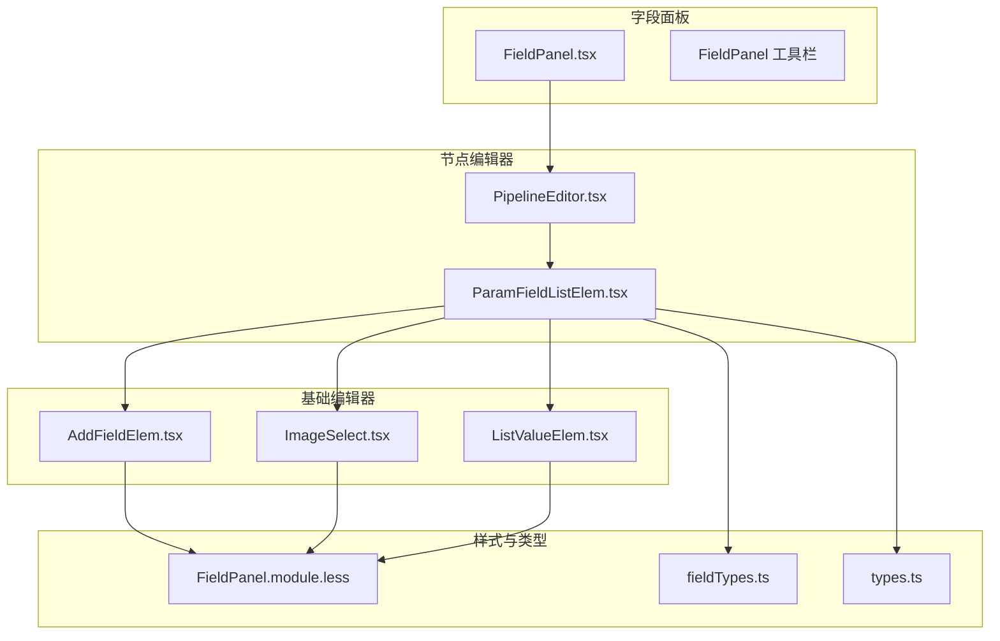
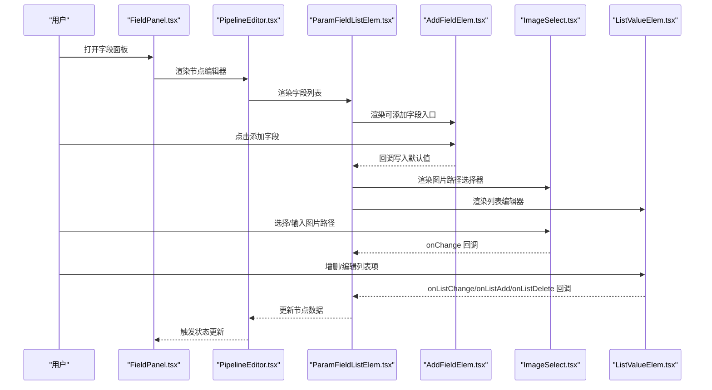
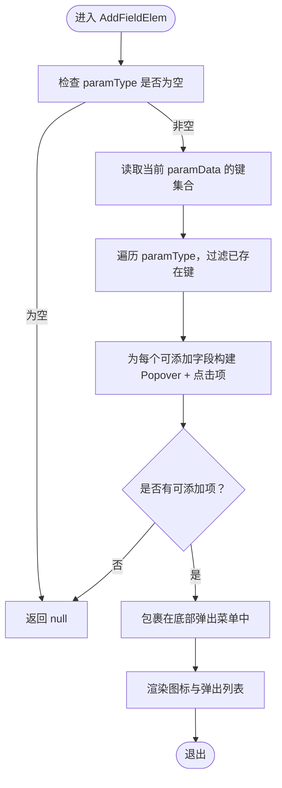
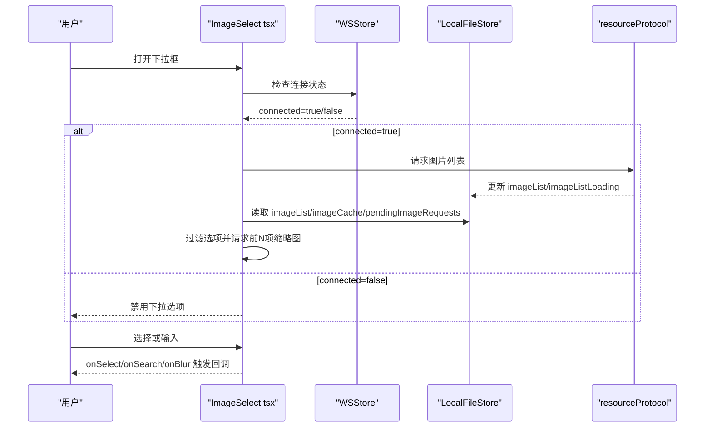
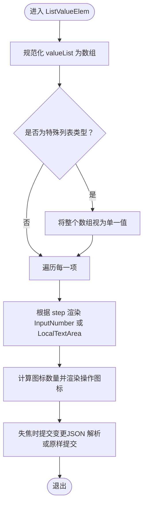
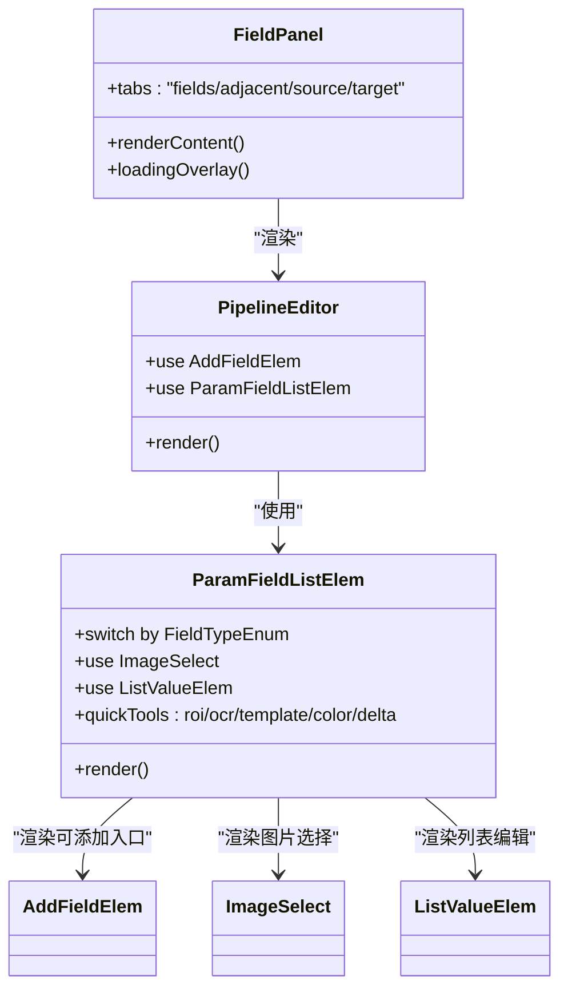
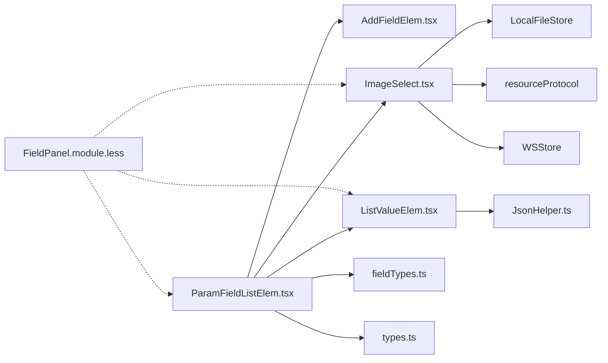

# 基础输入编辑器

<cite>
**本文档引用的文件**
- [AddFieldElem.tsx](file://src/components/panels/field/items/AddFieldElem.tsx)
- [ImageSelect.tsx](file://src/components/panels/field/items/ImageSelect.tsx)
- [ListValueElem.tsx](file://src/components/panels/field/items/ListValueElem.tsx)
- [ParamFieldListElem.tsx](file://src/components/panels/field/items/ParamFieldListElem.tsx)
- [FieldPanel.module.less](file://src/styles/FieldPanel.module.less)
- [types.ts](file://src/core/fields/types.ts)
- [fieldTypes.ts](file://src/core/fields/fieldTypes.ts)
- [index.ts](file://src/components/panels/field/items/index.ts)
- [PipelineEditor.tsx](file://src/components/panels/node-editors/PipelineEditor.tsx)
- [FieldPanel.tsx](file://src/components/panels/main/FieldPanel.tsx)
- [jsonHelper.ts](file://src/utils/jsonHelper.ts)
</cite>

## 目录
1. [简介](#简介)
2. [项目结构](#项目结构)
3. [核心组件](#核心组件)
4. [架构总览](#架构总览)
5. [详细组件分析](#详细组件分析)
6. [依赖关系分析](#依赖关系分析)
7. [性能考量](#性能考量)
8. [故障排除指南](#故障排除指南)
9. [结论](#结论)
10. [附录](#附录)

## 简介
本文件聚焦于基础输入编辑器组件，深入解析以下核心组件的实现原理与使用方法：
- AddFieldElem：用于在字段面板中动态添加新字段元素的交互入口
- ImageSelect：图片路径选择器，支持下拉自动完成与缩略图预览
- ListValueElem：列表值编辑器，支持字符串/数字/复杂对象的列表编辑与快速工具集成

文档将从数据绑定机制、验证规则、事件处理与状态管理四个维度展开，覆盖属性配置、样式定制与交互行为，并提供最佳实践与常见问题解决方案，最后结合实际代码示例展示如何在字段面板中集成这些编辑器组件。

## 项目结构
基础输入编辑器位于字段面板（Field Panel）的“字段配置”页签内，主要由以下层次构成：
- 组件层：AddFieldElem、ImageSelect、ListValueElem、ParamFieldListElem
- 样式层：FieldPanel.module.less 提供统一的布局与交互样式
- 类型层：core/fields/types.ts 与 fieldTypes.ts 定义字段类型与枚举
- 集成层：PipelineEditor.tsx 与 FieldPanel.tsx 将组件集成到节点编辑器与面板容器中

**图表来源**
- [FieldPanel.tsx:185-524](file://src/components/panels/main/FieldPanel.tsx#L185-L524)
- [PipelineEditor.tsx:22-200](file://src/components/panels/node-editors/PipelineEditor.tsx#L22-L200)
- [ParamFieldListElem.tsx:72-775](file://src/components/panels/field/items/ParamFieldListElem.tsx#L72-L775)
- [AddFieldElem.tsx:12-62](file://src/components/panels/field/items/AddFieldElem.tsx#L12-L62)
- [ImageSelect.tsx:28-291](file://src/components/panels/field/items/ImageSelect.tsx#L28-L291)
- [ListValueElem.tsx:60-149](file://src/components/panels/field/items/ListValueElem.tsx#L60-L149)
- [FieldPanel.module.less:1-206](file://src/styles/FieldPanel.module.less#L1-L206)
- [fieldTypes.ts:1-27](file://src/core/fields/fieldTypes.ts#L1-L27)
- [types.ts:1-34](file://src/core/fields/types.ts#L1-L34)

**章节来源**
- [FieldPanel.tsx:185-524](file://src/components/panels/main/FieldPanel.tsx#L185-L524)
- [PipelineEditor.tsx:22-200](file://src/components/panels/node-editors/PipelineEditor.tsx#L22-L200)
- [ParamFieldListElem.tsx:72-775](file://src/components/panels/field/items/ParamFieldListElem.tsx#L72-L775)

## 核心组件
本节对三个基础组件进行概览性说明，后续章节将深入其内部实现与使用细节。

- AddFieldElem：根据当前已存在的参数键集合，筛选可添加的字段类型，提供弹出式菜单与气泡提示，点击后触发父组件回调以写入默认值。
- ImageSelect：基于 Ant Design AutoComplete 实现的图片路径选择器，支持远程图片列表拉取、本地缓存与缩略图预览，具备搜索过滤与占位图/加载态展示。
- ListValueElem：通用列表编辑器，支持字符串/数字/对象等多种值类型的列表编辑；提供增删图标与快速工具渲染钩子；在失焦时提交变更，提升输入体验。

**章节来源**
- [AddFieldElem.tsx:12-62](file://src/components/panels/field/items/AddFieldElem.tsx#L12-L62)
- [ImageSelect.tsx:28-291](file://src/components/panels/field/items/ImageSelect.tsx#L28-L291)
- [ListValueElem.tsx:60-149](file://src/components/panels/field/items/ListValueElem.tsx#L60-L149)

## 架构总览
基础编辑器组件在字段面板中的协作关系如下：

**图表来源**
- [FieldPanel.tsx:185-524](file://src/components/panels/main/FieldPanel.tsx#L185-L524)
- [PipelineEditor.tsx:467-503](file://src/components/panels/node-editors/PipelineEditor.tsx#L467-L503)
- [ParamFieldListElem.tsx:72-775](file://src/components/panels/field/items/ParamFieldListElem.tsx#L72-L775)
- [AddFieldElem.tsx:12-62](file://src/components/panels/field/items/AddFieldElem.tsx#L12-L62)
- [ImageSelect.tsx:28-291](file://src/components/panels/field/items/ImageSelect.tsx#L28-L291)
- [ListValueElem.tsx:60-149](file://src/components/panels/field/items/ListValueElem.tsx#L60-L149)

## 详细组件分析

### AddFieldElem 组件分析
- 设计目的：在字段面板中提供“添加字段”的便捷入口，避免手动输入键名与默认值。
- 数据绑定机制：接收 paramType（候选字段类型数组）与 paramData（当前节点参数），通过对比键集合过滤出尚未存在的字段类型。
- 事件处理：点击某字段类型时，触发 onClick 回调，传入该字段类型，父组件据此写入默认值。
- 交互行为：使用 Popover 展示字段 key 与描述，支持鼠标悬停查看帮助信息；当无可添加字段时返回空。
- 最佳实践：
  - 确保 paramType 中包含所有可添加字段的完整定义
  - onClick 回调应调用统一的数据更新接口，保证状态一致性
  - 对于结构化字段（如 focus），建议提供明确的默认值策略

**图表来源**
- [AddFieldElem.tsx:12-62](file://src/components/panels/field/items/AddFieldElem.tsx#L12-L62)

**章节来源**
- [AddFieldElem.tsx:12-62](file://src/components/panels/field/items/AddFieldElem.tsx#L12-L62)
- [PipelineEditor.tsx:467-487](file://src/components/panels/node-editors/PipelineEditor.tsx#L467-L487)

### ImageSelect 组件分析
- 设计目的：提供图片路径选择与输入的组合控件，支持连接本地服务时的图片列表检索与缩略图预览。
- 数据绑定机制：value 与 onChange 双向绑定，外部值变化时同步内部搜索值；onBlur 时提交最终值。
- 状态管理：
  - open：控制下拉框开关，打开时请求图片列表
  - searchValue：本地搜索值，用于过滤图片列表
  - imageList/imageListLoading/imageCache/pendingImageRequests：来自本地文件存储的状态，驱动选项渲染与缩略图加载
- 事件处理：
  - onDropdownVisibleChange：打开时请求图片列表
  - onSelect：选择后同步搜索值并触发 onChange
  - onSearch：输入时仅更新本地搜索值
  - onBlur：失焦时若值变化则触发 onChange
- 性能优化：
  - 仅对可见的前若干项请求缩略图，避免一次性加载过多
  - 对当前值进行兜底加载，确保显示
  - 使用 useMemo 缓存过滤与选项生成逻辑
- 交互行为：
  - 未连接时禁用下拉选项
  - 加载中显示加载动画与文字
  - 无匹配或无可用图片时显示空状态
  - 缩略图加载中显示占位图，加载完成后显示图片

**图表来源**
- [ImageSelect.tsx:28-291](file://src/components/panels/field/items/ImageSelect.tsx#L28-L291)
- [FieldPanel.module.less:150-173](file://src/styles/FieldPanel.module.less#L150-L173)

**章节来源**
- [ImageSelect.tsx:28-291](file://src/components/panels/field/items/ImageSelect.tsx#L28-L291)
- [FieldPanel.module.less:150-173](file://src/styles/FieldPanel.module.less#L150-L173)

### ListValueElem 组件分析
- 设计目的：统一处理字符串/数字/对象等类型的列表编辑，提供增删与快速工具渲染能力。
- 数据绑定机制：valueList 作为本地状态，onChange/onListChange/onListAdd/onListDelete 由父组件注入，用于回写节点数据。
- 事件处理：
  - 数字列表：使用 InputNumber，支持 step 步长
  - 文本列表：使用 LocalTextArea，编辑时仅更新本地状态，失焦时尝试 JSON 解析并提交
- 交互行为：
  - 快速工具：通过 quickToolRender 回调注入，按需渲染
  - 图标区域宽度自适应：根据工具数量动态计算
  - 特殊处理：对于特定枚举类型（如整型列表列表），将单个数值数组视为整体

**图表来源**
- [ListValueElem.tsx:60-149](file://src/components/panels/field/items/ListValueElem.tsx#L60-L149)
- [jsonHelper.ts:14-26](file://src/utils/jsonHelper.ts#L14-L26)

**章节来源**
- [ListValueElem.tsx:60-149](file://src/components/panels/field/items/ListValueElem.tsx#L60-L149)
- [jsonHelper.ts:14-26](file://src/utils/jsonHelper.ts#L14-L26)

### 组件在字段面板中的集成
- FieldPanel.tsx：负责渲染字段面板容器、标签页与遮罩层，承载节点编辑器内容。
- PipelineEditor.tsx：在 Pipeline 节点编辑器中使用 AddFieldElem 与 ParamFieldListElem，实现字段的添加与编辑。
- ParamFieldListElem.tsx：作为字段列表的中枢，根据字段类型渲染不同的输入控件（含 ImageSelect 与 ListValueElem），并提供快捷工具（如 ROI、OCR、模板截图、颜色取点、位移差值）的弹窗交互。

**图表来源**
- [FieldPanel.tsx:185-524](file://src/components/panels/main/FieldPanel.tsx#L185-L524)
- [PipelineEditor.tsx:22-200](file://src/components/panels/node-editors/PipelineEditor.tsx#L22-L200)
- [ParamFieldListElem.tsx:72-775](file://src/components/panels/field/items/ParamFieldListElem.tsx#L72-L775)
- [AddFieldElem.tsx:12-62](file://src/components/panels/field/items/AddFieldElem.tsx#L12-L62)
- [ImageSelect.tsx:28-291](file://src/components/panels/field/items/ImageSelect.tsx#L28-L291)
- [ListValueElem.tsx:60-149](file://src/components/panels/field/items/ListValueElem.tsx#L60-L149)

**章节来源**
- [FieldPanel.tsx:185-524](file://src/components/panels/main/FieldPanel.tsx#L185-L524)
- [PipelineEditor.tsx:22-200](file://src/components/panels/node-editors/PipelineEditor.tsx#L22-L200)
- [ParamFieldListElem.tsx:72-775](file://src/components/panels/field/items/ParamFieldListElem.tsx#L72-L775)

## 依赖关系分析
- 组件间依赖：
  - ParamFieldListElem 依赖 AddFieldElem、ImageSelect、ListValueElem 与多种模态框（ROI、OCR、模板、颜色、位移）
  - ImageSelect 依赖本地文件存储与资源协议，实现图片列表与缩略图加载
  - ListValueElem 依赖 JsonHelper 进行对象/数组到字符串的转换与解析
- 类型系统：
  - FieldType 与 FieldTypeEnum 定义了字段的键、类型、默认值、描述、显示名等元信息
  - 通过枚举区分基础类型（int、double、bool、string）、列表类型（list<int>、list<string>、list<image_path> 等）与复合类型（XYWH、位置列表等）

**图表来源**
- [ParamFieldListElem.tsx:72-775](file://src/components/panels/field/items/ParamFieldListElem.tsx#L72-L775)
- [AddFieldElem.tsx:12-62](file://src/components/panels/field/items/AddFieldElem.tsx#L12-L62)
- [ImageSelect.tsx:28-291](file://src/components/panels/field/items/ImageSelect.tsx#L28-L291)
- [ListValueElem.tsx:60-149](file://src/components/panels/field/items/ListValueElem.tsx#L60-L149)
- [fieldTypes.ts:1-27](file://src/core/fields/fieldTypes.ts#L1-L27)
- [types.ts:1-34](file://src/core/fields/types.ts#L1-L34)
- [FieldPanel.module.less:1-206](file://src/styles/FieldPanel.module.less#L1-L206)
- [jsonHelper.ts:14-26](file://src/utils/jsonHelper.ts#L14-L26)

**章节来源**
- [ParamFieldListElem.tsx:72-775](file://src/components/panels/field/items/ParamFieldListElem.tsx#L72-L775)
- [fieldTypes.ts:1-27](file://src/core/fields/fieldTypes.ts#L1-L27)
- [types.ts:1-34](file://src/core/fields/types.ts#L1-L34)

## 性能考量
- ImageSelect 的缩略图加载优化：
  - 仅对前若干可见项请求缩略图，避免一次性加载过多导致卡顿
  - 对当前值进行兜底加载，确保显示
  - 使用 useMemo 缓存过滤与选项生成，减少重复计算
- ListValueElem 的输入体验：
  - 文本编辑采用本地状态，失焦时再提交，降低频繁更新带来的重渲染
  - JSON 解析失败时回退为原始字符串，提升健壮性
- 样式层面：
  - 统一的模块化样式减少全局污染，提高渲染效率

[本节为通用性能讨论，无需具体文件分析]

## 故障排除指南
- 图片选择器无选项或显示“无可用图片”
  - 检查本地服务连接状态，确保 connected 为真
  - 确认当前项目路径有效，图片列表请求已发送
  - 若长时间处于加载态，检查 pendingImageRequests 与 imageCache 的状态
- 缩略图不显示或一直显示占位图
  - 确认缩略图请求已发出且未被重复触发
  - 检查 imageCache 中是否存在对应键值
- 列表编辑器无法增删或提交失败
  - 确认 onListChange/onListAdd/onListDelete 回调正确绑定
  - 对于文本列表，检查 JSON 解析逻辑，确保输入格式合法
- 添加字段入口不显示
  - 检查 paramType 与 paramData 的键集合是否一致
  - 确保字段类型定义包含默认值与描述信息

**章节来源**
- [ImageSelect.tsx:28-291](file://src/components/panels/field/items/ImageSelect.tsx#L28-L291)
- [ListValueElem.tsx:60-149](file://src/components/panels/field/items/ListValueElem.tsx#L60-L149)
- [AddFieldElem.tsx:12-62](file://src/components/panels/field/items/AddFieldElem.tsx#L12-L62)

## 结论
基础输入编辑器组件通过清晰的职责划分与统一的类型系统，实现了字段面板中多样化输入场景的高效编辑。AddFieldElem 提供便捷的字段添加入口，ImageSelect 优化了图片路径选择体验，ListValueElem 则统一了列表编辑的交互与数据提交。在字段面板的集成中，这些组件协同工作，配合 ParamFieldListElem 的类型分发与快捷工具，形成了完整的字段编辑生态。

[本节为总结性内容，无需具体文件分析]

## 附录

### 组件属性与配置要点
- AddFieldElem
  - 参数：paramType（候选字段类型数组）、paramData（当前参数键集合）、onClick（回调）
  - 行为：过滤已存在键，渲染可添加字段的弹出菜单
- ImageSelect
  - 参数：value、onChange、placeholder、inList
  - 行为：连接状态下请求图片列表，支持搜索过滤与缩略图预览
- ListValueElem
  - 参数：key、valueList、onChange、onAdd、onDelete、placeholder、step、quickToolRender
  - 行为：根据 step 渲染数字或文本输入，支持增删与快速工具渲染

**章节来源**
- [AddFieldElem.tsx:12-62](file://src/components/panels/field/items/AddFieldElem.tsx#L12-L62)
- [ImageSelect.tsx:12-28](file://src/components/panels/field/items/ImageSelect.tsx#L12-L28)
- [ListValueElem.tsx:60-69](file://src/components/panels/field/items/ListValueElem.tsx#L60-L69)

### 样式定制与主题适配
- 统一样式：FieldPanel.module.less 提供统一的布局、间距与交互样式
- 图片选择器：固定高度与选择器样式，确保在列表中的一致性
- 列表项：图标容器宽度自适应，支持快速工具与增删操作

**章节来源**
- [FieldPanel.module.less:150-206](file://src/styles/FieldPanel.module.less#L150-L206)

### 实际使用示例（代码路径）
- 在 PipelineEditor 中集成 AddFieldElem 与 ParamFieldListElem：
  - [PipelineEditor.tsx:467-487](file://src/components/panels/node-editors/PipelineEditor.tsx#L467-L487)
  - [PipelineEditor.tsx:491-503](file://src/components/panels/node-editors/PipelineEditor.tsx#L491-L503)
- 在 ParamFieldListElem 中渲染 ImageSelect 与 ListValueElem：
  - [ParamFieldListElem.tsx:446-510](file://src/components/panels/field/items/ParamFieldListElem.tsx#L446-L510)
  - [ParamFieldListElem.tsx:521-545](file://src/components/panels/field/items/ParamFieldListElem.tsx#L521-L545)

**章节来源**
- [PipelineEditor.tsx:467-503](file://src/components/panels/node-editors/PipelineEditor.tsx#L467-L503)
- [ParamFieldListElem.tsx:446-545](file://src/components/panels/field/items/ParamFieldListElem.tsx#L446-L545)