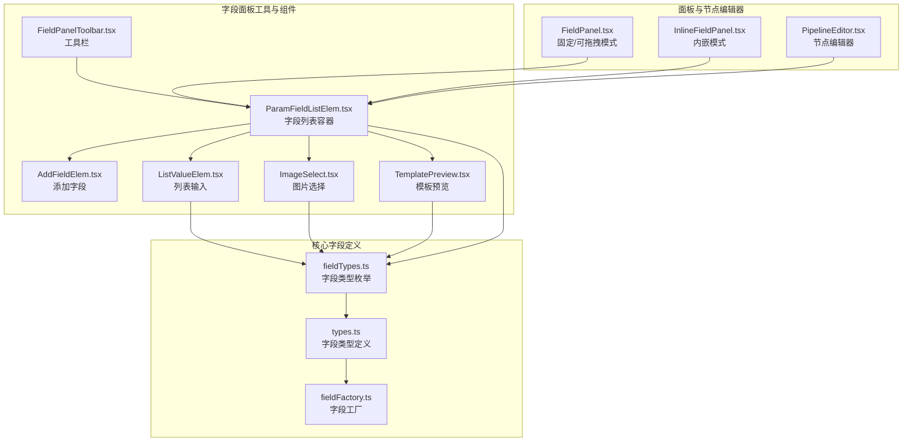
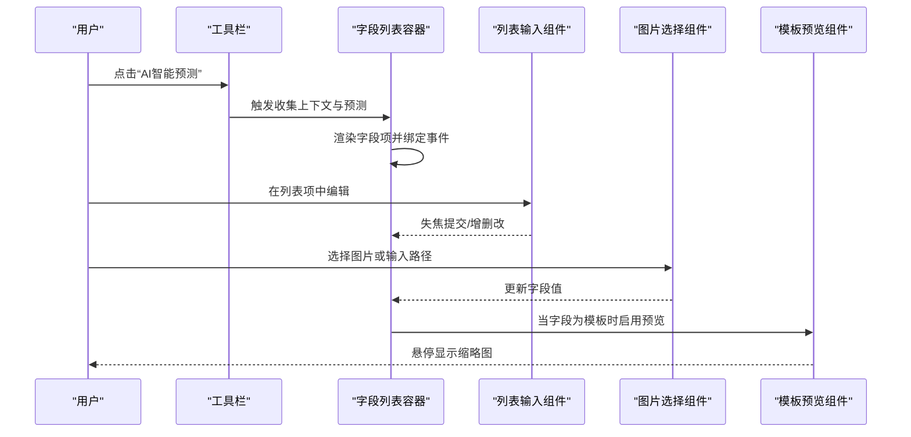
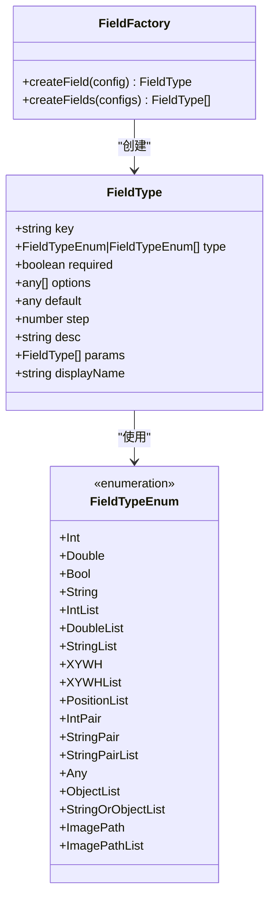
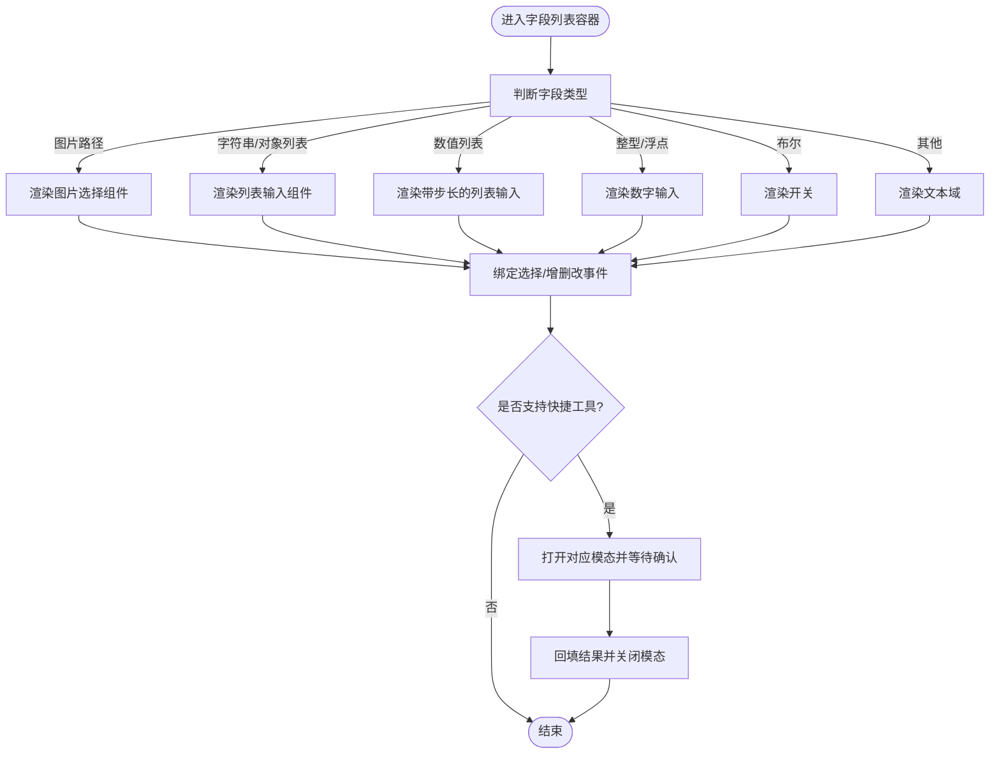
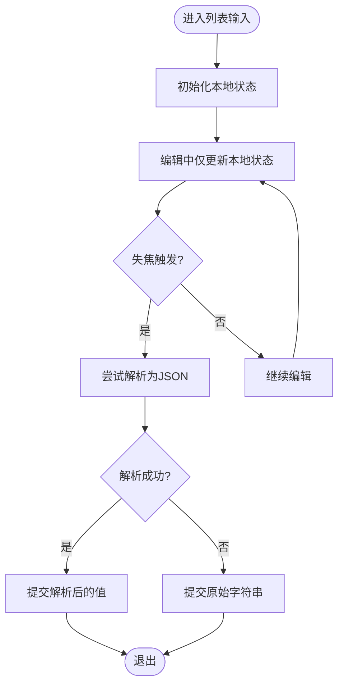
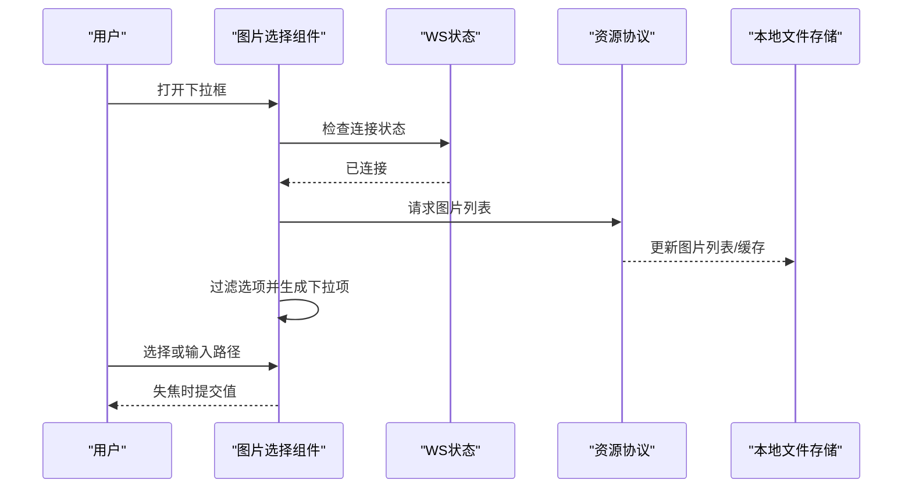
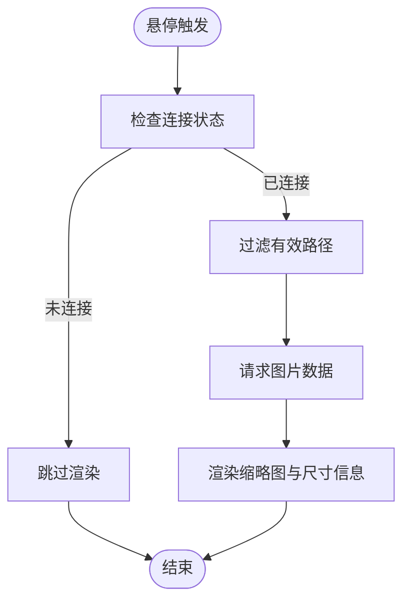
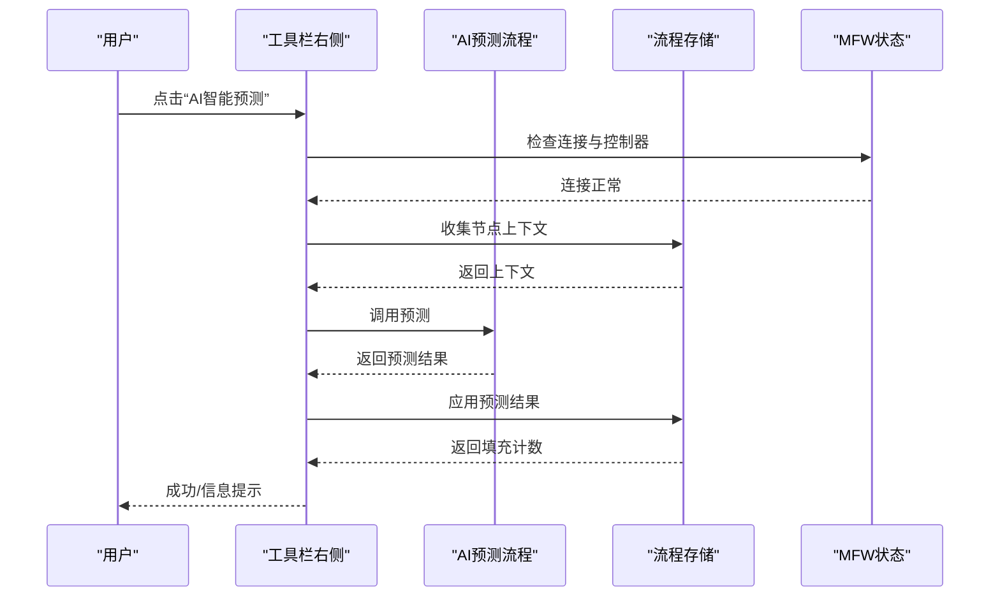
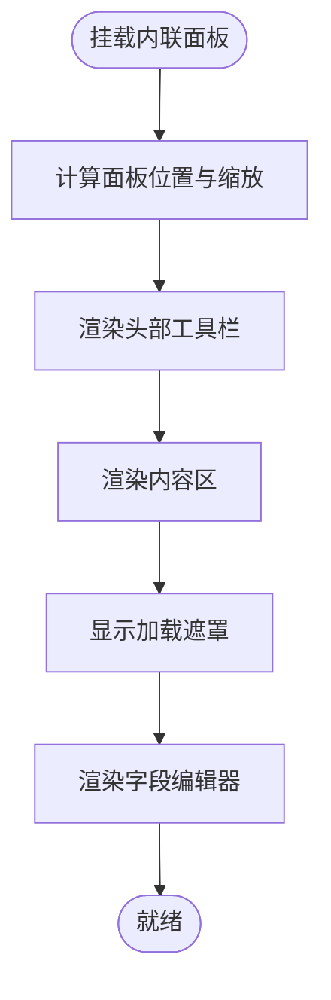
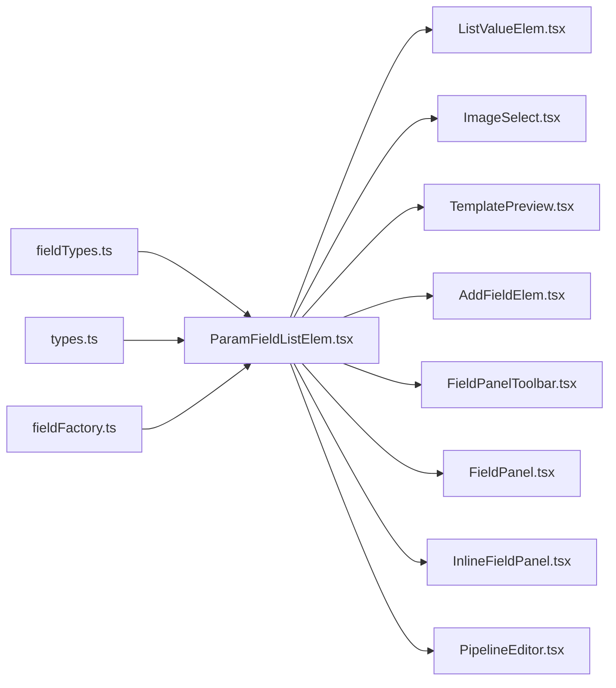

# 字段编辑器组件

<cite>
**本文引用的文件**
- [AddFieldElem.tsx](file://src/components/panels/field/items/AddFieldElem.tsx)
- [ImageSelect.tsx](file://src/components/panels/field/items/ImageSelect.tsx)
- [ListValueElem.tsx](file://src/components/panels/field/items/ListValueElem.tsx)
- [ParamFieldListElem.tsx](file://src/components/panels/field/items/ParamFieldListElem.tsx)
- [TemplatePreview.tsx](file://src/components/panels/field/items/TemplatePreview.tsx)
- [FieldPanelToolbar.tsx](file://src/components/panels/field/tools/FieldPanelToolbar.tsx)
- [index.ts（items 导出）](file://src/components/panels/field/items/index.ts)
- [index.ts（tools 导出）](file://src/components/panels/field/tools/index.ts)
- [fieldFactory.ts](file://src/core/fields/fieldFactory.ts)
- [types.ts](file://src/core/fields/types.ts)
- [fieldTypes.ts](file://src/core/fields/fieldTypes.ts)
- [InlineFieldPanel.tsx](file://src/components/panels/main/InlineFieldPanel.tsx)
- [FieldPanel.tsx](file://src/components/panels/main/FieldPanel.tsx)
- [PanelConfigSection.tsx](file://src/components/panels/config/PanelConfigSection.tsx)
- [PipelineEditor.tsx](file://src/components/panels/node-editors/PipelineEditor.tsx)
</cite>

## 目录
1. [简介](#简介)
2. [项目结构](#项目结构)
3. [核心组件](#核心组件)
4. [架构总览](#架构总览)
5. [详细组件分析](#详细组件分析)
6. [依赖关系分析](#依赖关系分析)
7. [性能考量](#性能考量)
8. [故障排查指南](#故障排查指南)
9. [结论](#结论)
10. [附录](#附录)

## 简介
本文件系统性梳理字段编辑器组件的设计与实现，覆盖基础输入组件、列表编辑组件、模板预览组件等；解释字段编辑器的生命周期管理、状态同步、事件处理机制；深入说明内联字段编辑器的实现原理（实时编辑、自动保存、撤销重做建议）；阐述样式定制与主题适配策略；提供扩展开发指南（自定义编辑器组件的创建与集成）；并包含用户体验优化与无障碍访问支持建议、实际使用示例与常见问题解决方案。

## 项目结构
字段编辑器相关代码主要分布在以下位置：
- 组件层：字段面板工具条与字段项组件
- 核心层：字段类型定义与工厂方法
- 面板层：固定/可拖拽/内嵌三种面板模式
- 节点编辑器层：针对特定节点（如 Pipeline）的字段处理

图表来源
- [FieldPanelToolbar.tsx:1-238](file://src/components/panels/field/tools/FieldPanelToolbar.tsx#L1-L238)
- [ParamFieldListElem.tsx:1-775](file://src/components/panels/field/items/ParamFieldListElem.tsx#L1-L775)
- [ListValueElem.tsx:1-149](file://src/components/panels/field/items/ListValueElem.tsx#L1-L149)
- [ImageSelect.tsx:1-291](file://src/components/panels/field/items/ImageSelect.tsx#L1-L291)
- [TemplatePreview.tsx:1-185](file://src/components/panels/field/items/TemplatePreview.tsx#L1-L185)
- [AddFieldElem.tsx:1-62](file://src/components/panels/field/items/AddFieldElem.tsx#L1-L62)
- [fieldTypes.ts:1-27](file://src/core/fields/fieldTypes.ts#L1-L27)
- [types.ts:1-34](file://src/core/fields/types.ts#L1-L34)
- [fieldFactory.ts:1-16](file://src/core/fields/fieldFactory.ts#L1-L16)
- [FieldPanel.tsx:501-523](file://src/components/panels/main/FieldPanel.tsx#L501-L523)
- [InlineFieldPanel.tsx:141-191](file://src/components/panels/main/InlineFieldPanel.tsx#L141-L191)
- [PipelineEditor.tsx:154-306](file://src/components/panels/node-editors/PipelineEditor.tsx#L154-L306)

章节来源
- [FieldPanel.tsx:501-523](file://src/components/panels/main/FieldPanel.tsx#L501-L523)
- [InlineFieldPanel.tsx:141-191](file://src/components/panels/main/InlineFieldPanel.tsx#L141-L191)
- [FieldPanelToolbar.tsx:1-238](file://src/components/panels/field/tools/FieldPanelToolbar.tsx#L1-L238)
- [ParamFieldListElem.tsx:1-775](file://src/components/panels/field/items/ParamFieldListElem.tsx#L1-L775)
- [ListValueElem.tsx:1-149](file://src/components/panels/field/items/ListValueElem.tsx#L1-L149)
- [ImageSelect.tsx:1-291](file://src/components/panels/field/items/ImageSelect.tsx#L1-L291)
- [TemplatePreview.tsx:1-185](file://src/components/panels/field/items/TemplatePreview.tsx#L1-L185)
- [AddFieldElem.tsx:1-62](file://src/components/panels/field/items/AddFieldElem.tsx#L1-L62)
- [fieldTypes.ts:1-27](file://src/core/fields/fieldTypes.ts#L1-L27)
- [types.ts:1-34](file://src/core/fields/types.ts#L1-L34)
- [fieldFactory.ts:1-16](file://src/core/fields/fieldFactory.ts#L1-L16)
- [PipelineEditor.tsx:154-306](file://src/components/panels/node-editors/PipelineEditor.tsx#L154-L306)

## 核心组件
- 字段类型系统：通过枚举与类型定义统一描述字段类型、默认值、步长、可选值等元信息。
- 字段工厂：提供便捷的字段创建与批量创建能力。
- 字段列表容器：根据字段类型动态渲染对应输入控件，支持快捷工具（ROI、OCR、模板、颜色、位移差值等），并处理列表增删改。
- 列表输入组件：支持字符串/数字/对象等多形态列表，提供本地状态编辑与失焦提交。
- 图片选择组件：支持远程图片列表检索、缩略图预加载、手动输入与下拉选择。
- 模板预览组件：悬停展示模板图片缩略图，支持多路径与尺寸自适应。
- 添加字段组件：基于可用字段类型与当前已存在字段，提供一键添加入口。
- 工具栏：提供复制节点名、复制识别 JSON、保存模板、AI预测、跳转到目标节点、删除节点等操作。

章节来源
- [fieldTypes.ts:1-27](file://src/core/fields/fieldTypes.ts#L1-L27)
- [types.ts:1-34](file://src/core/fields/types.ts#L1-L34)
- [fieldFactory.ts:1-16](file://src/core/fields/fieldFactory.ts#L1-L16)
- [ParamFieldListElem.tsx:1-775](file://src/components/panels/field/items/ParamFieldListElem.tsx#L1-L775)
- [ListValueElem.tsx:1-149](file://src/components/panels/field/items/ListValueElem.tsx#L1-L149)
- [ImageSelect.tsx:1-291](file://src/components/panels/field/items/ImageSelect.tsx#L1-L291)
- [TemplatePreview.tsx:1-185](file://src/components/panels/field/items/TemplatePreview.tsx#L1-L185)
- [AddFieldElem.tsx:1-62](file://src/components/panels/field/items/AddFieldElem.tsx#L1-L62)
- [FieldPanelToolbar.tsx:1-238](file://src/components/panels/field/tools/FieldPanelToolbar.tsx#L1-L238)

## 架构总览
字段编辑器采用“类型驱动 + 动态渲染”的架构：
- 类型系统决定渲染策略与行为约束；
- 容器组件负责状态聚合与事件分发；
- 具体输入组件负责用户交互与数据校验；
- 面板层负责布局与可见性控制（固定/可拖拽/内嵌）；
- 节点编辑器层对特定节点的复杂字段进行专门处理。

图表来源
- [FieldPanelToolbar.tsx:120-183](file://src/components/panels/field/tools/FieldPanelToolbar.tsx#L120-L183)
- [ParamFieldListElem.tsx:521-545](file://src/components/panels/field/items/ParamFieldListElem.tsx#L521-L545)
- [ListValueElem.tsx:102-111](file://src/components/panels/field/items/ListValueElem.tsx#L102-L111)
- [ImageSelect.tsx:245-266](file://src/components/panels/field/items/ImageSelect.tsx#L245-L266)
- [TemplatePreview.tsx:162-180](file://src/components/panels/field/items/TemplatePreview.tsx#L162-L180)

## 详细组件分析

### 字段类型系统与工厂
- 字段类型枚举涵盖整型、浮点、布尔、字符串、列表（整型/浮点/字符串/对象）、坐标/矩形数组、图片路径、图片路径列表等。
- 字段类型定义包含键名、类型、是否必填、默认值、步长、描述、显示名等元信息。
- 字段工厂提供便捷的字段创建与批量创建方法，便于在业务模块中声明字段。

图表来源
- [types.ts:6-16](file://src/core/fields/types.ts#L6-L16)
- [fieldTypes.ts:4-26](file://src/core/fields/fieldTypes.ts#L4-L26)
- [fieldFactory.ts:6-15](file://src/core/fields/fieldFactory.ts#L6-L15)

章节来源
- [types.ts:1-34](file://src/core/fields/types.ts#L1-L34)
- [fieldTypes.ts:1-27](file://src/core/fields/fieldTypes.ts#L1-L27)
- [fieldFactory.ts:1-16](file://src/core/fields/fieldFactory.ts#L1-L16)

### 字段列表容器（ParamFieldListElem）
- 动态渲染：根据字段类型映射到对应输入控件（下拉、开关、数字输入、文本域、图片选择、列表输入等）。
- 快捷工具：为特定字段键提供 ROI、OCR、模板、颜色、位移差值、ROI偏移等快捷采集工具，打开对应模态并回填结果。
- 列表处理：统一处理列表字段的增删改，支持步长、占位符、快速工具图标等。
- 模板预览：当字段为模板且存在有效路径时，使用模板预览组件展示缩略图。
- 状态同步：通过回调函数向上层传递变更，保持与节点数据一致。

图表来源
- [ParamFieldListElem.tsx:444-610](file://src/components/panels/field/items/ParamFieldListElem.tsx#L444-L610)
- [ParamFieldListElem.tsx:360-395](file://src/components/panels/field/items/ParamFieldListElem.tsx#L360-L395)
- [ParamFieldListElem.tsx:198-350](file://src/components/panels/field/items/ParamFieldListElem.tsx#L198-L350)

章节来源
- [ParamFieldListElem.tsx:1-775](file://src/components/panels/field/items/ParamFieldListElem.tsx#L1-L775)

### 列表输入组件（ListValueElem）
- 本地状态：编辑时仅更新本地状态，失焦时尝试解析并提交，避免频繁触发父组件更新。
- 多形态支持：字符串、数字、对象/数组等，支持步长（数值列表）。
- 增删改：支持在同一行内添加/删除列表项，配合快捷工具按钮。

图表来源
- [ListValueElem.tsx:13-58](file://src/components/panels/field/items/ListValueElem.tsx#L13-L58)
- [ListValueElem.tsx:60-149](file://src/components/panels/field/items/ListValueElem.tsx#L60-L149)

章节来源
- [ListValueElem.tsx:1-149](file://src/components/panels/field/items/ListValueElem.tsx#L1-L149)

### 图片选择组件（ImageSelect）
- 远程联动：在连接本地服务时请求图片列表与缩略图，支持搜索过滤与懒加载。
- 缩略图优化：仅预加载可见项与当前值，避免一次性加载过多导致卡顿。
- 用户体验：加载中与空状态友好提示，支持手动输入与下拉选择。

图表来源
- [ImageSelect.tsx:54-62](file://src/components/panels/field/items/ImageSelect.tsx#L54-L62)
- [ImageSelect.tsx:65-102](file://src/components/panels/field/items/ImageSelect.tsx#L65-L102)
- [ImageSelect.tsx:105-242](file://src/components/panels/field/items/ImageSelect.tsx#L105-L242)
- [ImageSelect.tsx:245-266](file://src/components/panels/field/items/ImageSelect.tsx#L245-L266)

章节来源
- [ImageSelect.tsx:1-291](file://src/components/panels/field/items/ImageSelect.tsx#L1-L291)

### 模板预览组件（TemplatePreview）
- 悬停触发：鼠标悬停时请求并渲染模板图片缩略图，支持多路径与尺寸自适应。
- 状态反馈：pending 时显示加载，未命中时显示提示，命中时显示尺寸信息。

图表来源
- [TemplatePreview.tsx:45-50](file://src/components/panels/field/items/TemplatePreview.tsx#L45-L50)
- [TemplatePreview.tsx:62-137](file://src/components/panels/field/items/TemplatePreview.tsx#L62-L137)
- [TemplatePreview.tsx:162-180](file://src/components/panels/field/items/TemplatePreview.tsx#L162-L180)

章节来源
- [TemplatePreview.tsx:1-185](file://src/components/panels/field/items/TemplatePreview.tsx#L1-L185)

### 添加字段组件（AddFieldElem）
- 可用字段：根据当前已存在字段与类型定义，筛选可添加的字段键。
- 提示信息：通过气泡提示展示字段描述，提升易用性。

章节来源
- [AddFieldElem.tsx:1-62](file://src/components/panels/field/items/AddFieldElem.tsx#L1-L62)

### 工具栏（FieldPanelToolbar）
- 复制节点名与识别 JSON：便于快速分享与复用。
- 保存模板：将当前节点配置保存为模板。
- AI智能预测：收集上下文、调用预测、应用结果并反馈进度与统计。
- 跳转到目标节点：在外部节点场景中快速导航。
- 删除节点：安全删除当前节点。

图表来源
- [FieldPanelToolbar.tsx:120-183](file://src/components/panels/field/tools/FieldPanelToolbar.tsx#L120-L183)

章节来源
- [FieldPanelToolbar.tsx:1-238](file://src/components/panels/field/tools/FieldPanelToolbar.tsx#L1-L238)

### 内联字段编辑器（InlineFieldPanel）
- 面板定位：基于画布视口与缩放比例进行绝对定位与缩放变换。
- 事件拦截：阻止事件冒泡至画布，避免干扰画布交互。
- 结构组成：头部工具栏 + 内容区（加载遮罩 + 编辑器渲染）。

图表来源
- [InlineFieldPanel.tsx:141-191](file://src/components/panels/main/InlineFieldPanel.tsx#L141-L191)

章节来源
- [InlineFieldPanel.tsx:141-191](file://src/components/panels/main/InlineFieldPanel.tsx#L141-L191)

### 面板模式与配置（FieldPanel / PanelConfigSection）
- 模式切换：固定、可拖拽、内嵌三种模式，内嵌模式支持缩放比例配置。
- 内嵌缩放：提供 0.5–1.0 的缩放范围，满足不同用户的视觉偏好。

章节来源
- [FieldPanel.tsx:501-523](file://src/components/panels/main/FieldPanel.tsx#L501-L523)
- [PanelConfigSection.tsx:329-365](file://src/components/panels/config/PanelConfigSection.tsx#L329-L365)

### 节点编辑器中的字段处理（PipelineEditor）
- 结构化字段：如 focus、wait_freezes 等，提供子字段的增删改与回退逻辑（如空时回退到简单类型）。
- 通用处理：封装通用的字段变更与删除回调，保证一致性。

章节来源
- [PipelineEditor.tsx:154-306](file://src/components/panels/node-editors/PipelineEditor.tsx#L154-L306)

## 依赖关系分析
- 字段类型系统为所有输入组件提供统一约束与渲染指引。
- 字段列表容器是核心协调者，向下委派具体输入组件，向上接收变更回调。
- 面板层（固定/可拖拽/内嵌）仅负责布局与可见性，不参与业务逻辑。
- 节点编辑器层对特定节点的复杂字段进行专门处理，复用字段编辑器能力。

图表来源
- [fieldTypes.ts:1-27](file://src/core/fields/fieldTypes.ts#L1-L27)
- [types.ts:1-34](file://src/core/fields/types.ts#L1-L34)
- [fieldFactory.ts:1-16](file://src/core/fields/fieldFactory.ts#L1-L16)
- [ParamFieldListElem.tsx:1-775](file://src/components/panels/field/items/ParamFieldListElem.tsx#L1-L775)
- [ListValueElem.tsx:1-149](file://src/components/panels/field/items/ListValueElem.tsx#L1-L149)
- [ImageSelect.tsx:1-291](file://src/components/panels/field/items/ImageSelect.tsx#L1-L291)
- [TemplatePreview.tsx:1-185](file://src/components/panels/field/items/TemplatePreview.tsx#L1-L185)
- [AddFieldElem.tsx:1-62](file://src/components/panels/field/items/AddFieldElem.tsx#L1-L62)
- [FieldPanelToolbar.tsx:1-238](file://src/components/panels/field/tools/FieldPanelToolbar.tsx#L1-L238)
- [FieldPanel.tsx:501-523](file://src/components/panels/main/FieldPanel.tsx#L501-L523)
- [InlineFieldPanel.tsx:141-191](file://src/components/panels/main/InlineFieldPanel.tsx#L141-L191)
- [PipelineEditor.tsx:154-306](file://src/components/panels/node-editors/PipelineEditor.tsx#L154-L306)

## 性能考量
- 列表输入组件采用本地状态与失焦提交，减少不必要的父组件重渲染。
- 图片选择组件与模板预览组件仅在可见或悬停时请求与渲染缩略图，限制预加载数量，避免阻塞。
- 内联面板按需挂载与事件拦截，降低对画布交互的影响。
- 字段类型系统通过枚举与类型定义集中约束，减少运行时分支判断成本。

## 故障排查指南
- 图片列表为空或加载中
  - 检查本地服务连接状态与文件路径配置。
  - 确认图片资源是否存在且可访问。
- 模板预览不显示
  - 确认字段键为模板且路径非空。
  - 检查连接状态与缓存命中情况。
- 列表输入无法提交
  - 确认编辑后已失焦。
  - 检查 JSON 解析异常（对象/数组输入）。
- 快捷工具不可用
  - 确认本地服务已连接且控制器可用。
  - 检查字段键是否在快捷工具映射中。
- 内联面板遮挡画布交互
  - 确认事件拦截逻辑生效（面板阻止冒泡）。
  - 调整面板缩放与位置。

章节来源
- [ImageSelect.tsx:105-148](file://src/components/panels/field/items/ImageSelect.tsx#L105-L148)
- [TemplatePreview.tsx:52-60](file://src/components/panels/field/items/TemplatePreview.tsx#L52-L60)
- [ListValueElem.tsx:44-54](file://src/components/panels/field/items/ListValueElem.tsx#L44-L54)
- [ParamFieldListElem.tsx:115-126](file://src/components/panels/field/items/ParamFieldListElem.tsx#L115-L126)
- [InlineFieldPanel.tsx:156-161](file://src/components/panels/main/InlineFieldPanel.tsx#L156-L161)

## 结论
字段编辑器组件通过类型驱动与动态渲染实现了高扩展性与良好的用户体验。其核心在于：
- 统一的字段类型系统与工厂方法；
- 容器组件对输入组件的协调与快捷工具集成；
- 面板层对布局与可见性的解耦；
- 针对特定节点的专用处理逻辑。

在实际使用中，建议优先利用现有组件与快捷工具，结合面板模式与缩放配置，获得最佳的编辑效率与稳定性。

## 附录

### 生命周期管理与状态同步
- 初始化：根据字段类型与默认值初始化本地状态。
- 编辑：输入组件维护本地状态，避免频繁提交。
- 提交：失焦或显式提交时进行校验与解析，再通过回调向上层同步。
- 变更传播：容器组件接收变更并更新节点数据，必要时触发全局状态刷新。

章节来源
- [ListValueElem.tsx:23-33](file://src/components/panels/field/items/ListValueElem.tsx#L23-L33)
- [ParamFieldListElem.tsx:521-545](file://src/components/panels/field/items/ParamFieldListElem.tsx#L521-L545)

### 事件处理机制
- 输入事件：onChange/onSelect/onBlur 等由具体组件处理并触发回调。
- 快捷工具：打开模态 → 设备采集 → 确认回调 → 更新字段值。
- 面板事件：工具栏按钮触发业务流程，内联面板拦截画布事件。

章节来源
- [ImageSelect.tsx:245-266](file://src/components/panels/field/items/ImageSelect.tsx#L245-L266)
- [ParamFieldListElem.tsx:198-221](file://src/components/panels/field/items/ParamFieldListElem.tsx#L198-L221)
- [FieldPanelToolbar.tsx:120-183](file://src/components/panels/field/tools/FieldPanelToolbar.tsx#L120-L183)
- [InlineFieldPanel.tsx:156-161](file://src/components/panels/main/InlineFieldPanel.tsx#L156-L161)

### 实时编辑、自动保存与撤销重做（建议）
- 实时编辑：列表输入组件已采用本地状态与失焦提交，可进一步在高频场景中引入防抖策略。
- 自动保存：建议在失焦或定时器触发时，将变更持久化到本地存储或临时快照。
- 撤销重做：建议引入轻量级历史栈（最多 N 步），在面板关闭或显式触发时清理。

（本节为概念性建议，不直接对应具体源码）

### 样式定制与主题适配
- 组件样式：各组件通过独立的 Less 模块进行样式隔离，便于主题切换与局部定制。
- 主题变量：建议在全局 Less 变量中统一管理颜色、字体、间距等，以适配深浅主题。
- 图标与交互：统一使用图标字体与交互反馈，确保在不同主题下具备良好对比度。

（本节为通用指导，不直接对应具体源码）

### 扩展开发指南
- 新增字段类型：在类型枚举中新增类型，在字段列表容器中映射到新的输入组件。
- 新增输入组件：遵循现有组件的 props 约定（value、onChange、placeholder 等），并在容器中注册渲染逻辑。
- 新增快捷工具：在快捷工具映射中注册新工具键与图标，实现打开模态、采集数据、回填结果的完整流程。
- 新增面板模式：在面板配置中增加模式选项，并在渲染逻辑中处理新模式的布局与行为。

章节来源
- [fieldTypes.ts:4-26](file://src/core/fields/fieldTypes.ts#L4-L26)
- [ParamFieldListElem.tsx:38-64](file://src/components/panels/field/items/ParamFieldListElem.tsx#L38-L64)
- [ParamFieldListElem.tsx:352-358](file://src/components/panels/field/items/ParamFieldListElem.tsx#L352-L358)
- [PanelConfigSection.tsx:329-339](file://src/components/panels/config/PanelConfigSection.tsx#L329-L339)

### 用户体验优化与无障碍访问支持
- 无障碍：为按钮与输入框提供明确的标题与描述，确保键盘可访问与屏幕阅读器友好。
- 反馈：在加载、空状态、错误时提供清晰的提示与占位信息。
- 一致性：统一图标语义、颜色含义与交互节奏，降低学习成本。

（本节为通用指导，不直接对应具体源码）

### 实际使用示例
- 图片路径字段：使用图片选择组件，支持远程列表与手动输入，适合模板、截图等场景。
- 列表字段：使用列表输入组件，支持字符串/数字/对象等多形态，适合坐标、颜色、参数对等场景。
- 快捷工具：在 ROI/OCR/模板/颜色/位移差值等字段上，一键采集并回填，显著提升效率。

章节来源
- [ImageSelect.tsx:28-29](file://src/components/panels/field/items/ImageSelect.tsx#L28-L29)
- [ListValueElem.tsx:60-69](file://src/components/panels/field/items/ListValueElem.tsx#L60-L69)
- [ParamFieldListElem.tsx:360-395](file://src/components/panels/field/items/ParamFieldListElem.tsx#L360-L395)