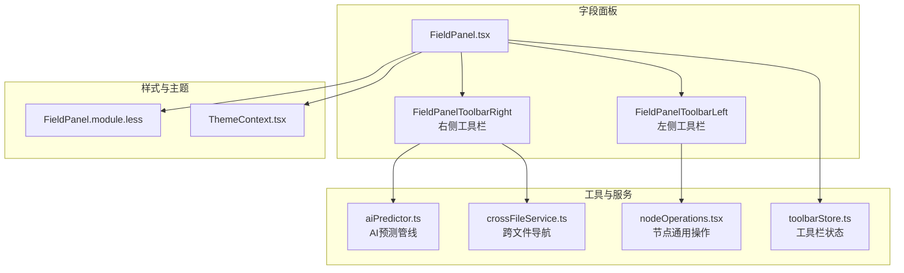
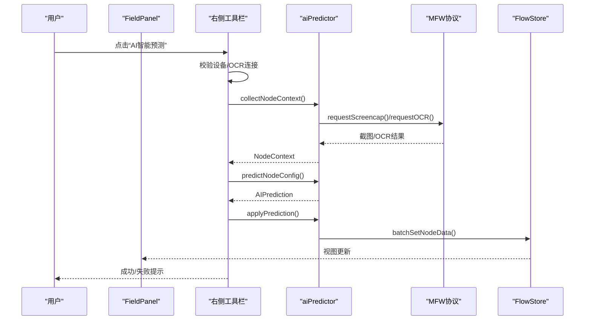
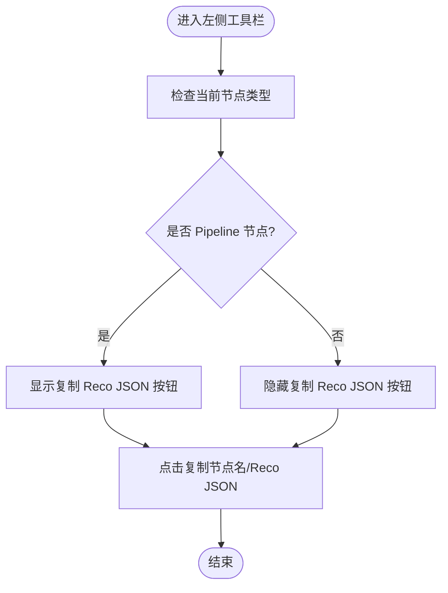
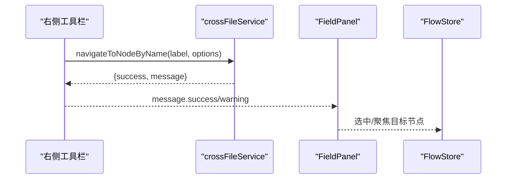
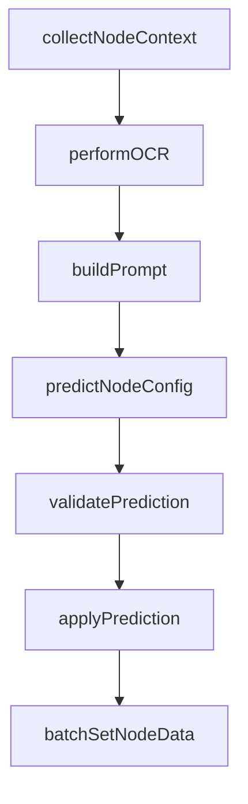
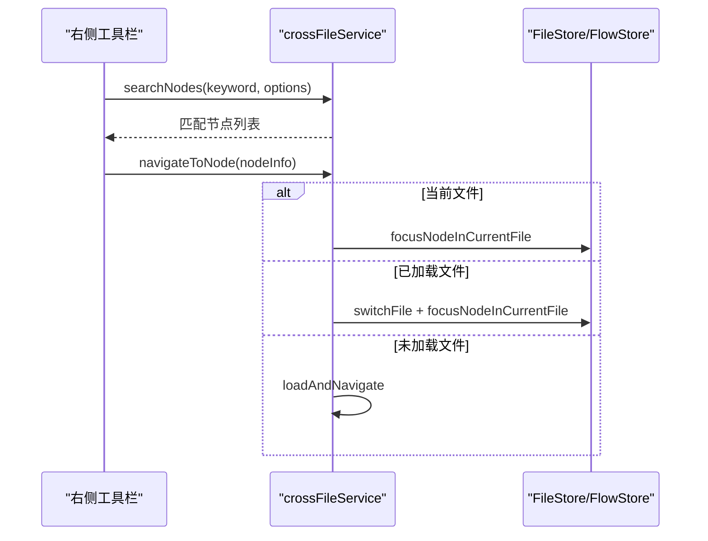
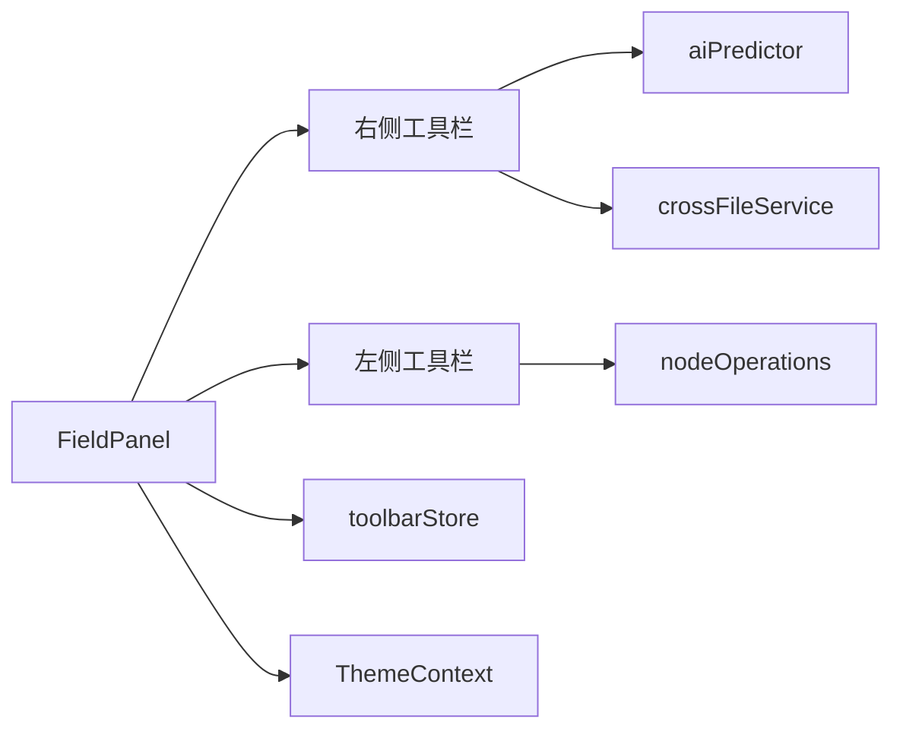

# 字段面板工具

<cite>
**本文档引用的文件**
- [FieldPanelToolbar.tsx](file://src/components/panels/field/tools/FieldPanelToolbar.tsx)
- [index.ts](file://src/components/panels/field/tools/index.ts)
- [FieldPanel.tsx](file://src/components/panels/main/FieldPanel.tsx)
- [aiPredictor.ts](file://src/utils/aiPredictor.ts)
- [crossFileService.ts](file://src/services/crossFileService.ts)
- [nodeOperations.tsx](file://src/components/flow/nodes/utils/nodeOperations.tsx)
- [FieldPanel.module.less](file://src/styles/FieldPanel.module.less)
- [ThemeContext.tsx](file://src/contexts/ThemeContext.tsx)
- [toolbarStore.ts](file://src/stores/toolbarStore.ts)
</cite>

## 目录
1. [简介](#简介)
2. [项目结构](#项目结构)
3. [核心组件](#核心组件)
4. [架构总览](#架构总览)
5. [详细组件分析](#详细组件分析)
6. [依赖分析](#依赖分析)
7. [性能考虑](#性能考虑)
8. [故障排查指南](#故障排查指南)
9. [结论](#结论)
10. [附录](#附录)

## 简介
本文件系统化梳理字段面板工具组件，重点围绕 FieldPanelToolbar 工具栏的实现与功能展开，涵盖：
- 工具按钮的布局、交互行为与状态管理
- 工具栏与字段编辑器的协作机制（命令分发、事件传播、状态同步）
- 工具栏的可定制性（按钮配置、权限控制、主题适配）
- 扩展开发指南（自定义工具按钮的创建与集成）
- 用户体验优化与无障碍访问支持
- 常见问题的诊断与解决思路

## 项目结构
字段面板工具位于前端组件树的“字段面板”模块内，主要由左侧工具栏、右侧工具栏与字段编辑器三部分组成；同时通过全局状态与服务层实现跨组件协作。

**图表来源**
- [FieldPanel.tsx:184-524](file://src/components/panels/main/FieldPanel.tsx#L184-L524)
- [FieldPanelToolbar.tsx:23-238](file://src/components/panels/field/tools/FieldPanelToolbar.tsx#L23-L238)
- [aiPredictor.ts:82-172](file://src/utils/aiPredictor.ts#L82-L172)
- [crossFileService.ts:276-316](file://src/services/crossFileService.ts#L276-L316)
- [nodeOperations.tsx:17-28](file://src/components/flow/nodes/utils/nodeOperations.tsx#L17-L28)
- [FieldPanel.module.less:1-206](file://src/styles/FieldPanel.module.less#L1-L206)
- [ThemeContext.tsx:22-56](file://src/contexts/ThemeContext.tsx#L22-L56)
- [toolbarStore.ts:95-146](file://src/stores/toolbarStore.ts#L95-L146)

**章节来源**
- [FieldPanel.tsx:184-524](file://src/components/panels/main/FieldPanel.tsx#L184-L524)
- [FieldPanelToolbar.tsx:23-238](file://src/components/panels/field/tools/FieldPanelToolbar.tsx#L23-L238)

## 核心组件
- 左侧工具栏（FieldPanelToolbarLeft）
  - 功能：复制节点名、复制 Reco JSON（仅 Pipeline 节点）
  - 交互：基于 Tooltip 的悬停提示，点击触发对应操作
  - 状态：根据当前节点类型动态显示/隐藏相关按钮
- 右侧工具栏（FieldPanelToolbarRight）
  - 功能：保存为模板、AI 智能预测、删除节点、跳转到目标节点（External 节点）
  - 交互：按钮禁用态与加载态（AI 预测期间），进度反馈
  - 状态：AI 预测状态、按钮可见性、与全局 loading/进度联动

**章节来源**
- [FieldPanelToolbar.tsx:23-64](file://src/components/panels/field/tools/FieldPanelToolbar.tsx#L23-L64)
- [FieldPanelToolbar.tsx:67-238](file://src/components/panels/field/tools/FieldPanelToolbar.tsx#L67-L238)

## 架构总览
字段面板工具与编辑器的协作遵循“状态驱动 + 服务调用”的模式：
- 状态来源：FlowStore（当前节点）、MFWStore（设备/OCR连接）、ConfigStore（主题/缩进等）
- 服务来源：AI 预测服务（aiPredictor）、跨文件导航（crossFileService）、节点通用操作（nodeOperations）
- UI 来源：FieldPanel 组合左右工具栏，统一承载遮罩层与进度反馈

**图表来源**
- [FieldPanelToolbar.tsx:119-183](file://src/components/panels/field/tools/FieldPanelToolbar.tsx#L119-L183)
- [aiPredictor.ts:82-172](file://src/utils/aiPredictor.ts#L82-L172)
- [aiPredictor.ts:532-559](file://src/utils/aiPredictor.ts#L532-L559)
- [aiPredictor.ts:720-784](file://src/utils/aiPredictor.ts#L720-L784)

## 详细组件分析

### 左侧工具栏（FieldPanelToolbarLeft）
- 动态显示策略
  - 复制节点名：始终显示，支持带前缀拼接（由节点类型决定）
  - 复制 Reco JSON：仅当当前节点为 Pipeline 时显示
- 交互细节
  - Tooltip 提示标题与图标尺寸统一
  - 点击回调封装在 nodeOperations 中，便于复用与测试
- 样式与主题
  - 使用统一的图标字体与交互样式，支持暗色主题切换

**图表来源**
- [FieldPanelToolbar.tsx:23-64](file://src/components/panels/field/tools/FieldPanelToolbar.tsx#L23-L64)
- [nodeOperations.tsx:17-28](file://src/components/flow/nodes/utils/nodeOperations.tsx#L17-L28)

**章节来源**
- [FieldPanelToolbar.tsx:23-64](file://src/components/panels/field/tools/FieldPanelToolbar.tsx#L23-L64)
- [nodeOperations.tsx:17-28](file://src/components/flow/nodes/utils/nodeOperations.tsx#L17-L28)

### 右侧工具栏（FieldPanelToolbarRight）
- 功能拆解
  - 保存为模板：仅 Pipeline 节点可用，弹窗确认并写入模板存储
  - AI 智能预测：收集上下文、OCR 截图/识别、AI 推理、批量应用配置
  - 删除节点：直接从 FlowStore 移除节点
  - 跳转到目标节点：External 节点专用，跨文件导航
- 状态与交互
  - AI 预测期间禁用按钮并显示加载态与透明度变化
  - 进度通过回调在 FieldPanel 遮罩层展示
  - 错误分类提示（设备未连接、OCR 失败、API 配置缺失等）
- 与服务层协作
  - AI 预测链路：collectNodeContext → predictNodeConfig → applyPrediction
  - 跨文件导航：crossFileService.navigateToNodeByName

**图表来源**
- [FieldPanelToolbar.tsx:96-117](file://src/components/panels/field/tools/FieldPanelToolbar.tsx#L96-L117)
- [crossFileService.ts:276-316](file://src/services/crossFileService.ts#L276-L316)
- [FieldPanel.tsx:360-393](file://src/components/panels/main/FieldPanel.tsx#L360-L393)

**章节来源**
- [FieldPanelToolbar.tsx:67-238](file://src/components/panels/field/tools/FieldPanelToolbar.tsx#L67-L238)
- [FieldPanel.tsx:395-407](file://src/components/panels/main/FieldPanel.tsx#L395-L407)

### AI 预测管线（aiPredictor）
- 上下文收集（collectNodeContext）
  - 提取当前节点、前置节点关系、OCR 结果
  - 对关键参数进行筛选与降级处理
- OCR 执行（performOCR）
  - 通过 MFW 协议请求截图与 OCR，超时与失败处理
- 提示词构建与推理（buildPrompt/predictNodeConfig）
  - 基于协议规范构建系统知识与用户提示词
  - 调用 OpenAIChat 发送请求并解析 JSON
- 结果校验与应用（validatePrediction/applyPrediction）
  - 校验类型与字段合法性，批量更新节点数据

**图表来源**
- [aiPredictor.ts:82-172](file://src/utils/aiPredictor.ts#L82-L172)
- [aiPredictor.ts:177-265](file://src/utils/aiPredictor.ts#L177-L265)
- [aiPredictor.ts:271-525](file://src/utils/aiPredictor.ts#L271-L525)
- [aiPredictor.ts:532-559](file://src/utils/aiPredictor.ts#L532-L559)
- [aiPredictor.ts:603-713](file://src/utils/aiPredictor.ts#L603-L713)
- [aiPredictor.ts:720-784](file://src/utils/aiPredictor.ts#L720-L784)

**章节来源**
- [aiPredictor.ts:82-172](file://src/utils/aiPredictor.ts#L82-L172)
- [aiPredictor.ts:177-265](file://src/utils/aiPredictor.ts#L177-L265)
- [aiPredictor.ts:532-559](file://src/utils/aiPredictor.ts#L532-L559)
- [aiPredictor.ts:720-784](file://src/utils/aiPredictor.ts#L720-L784)

### 跨文件导航（crossFileService）
- 节点搜索与排序
  - 支持模糊匹配、跨文件/当前文件过滤、类型排除
  - 优先级：当前文件 > 完全匹配 > 前缀匹配
- 跳转流程
  - 已加载文件：直接切换并聚焦
  - 未加载文件：请求加载后定位
  - 失败回退与超时处理

**图表来源**
- [crossFileService.ts:207-268](file://src/services/crossFileService.ts#L207-L268)
- [crossFileService.ts:323-393](file://src/services/crossFileService.ts#L323-L393)
- [crossFileService.ts:398-467](file://src/services/crossFileService.ts#L398-L467)

**章节来源**
- [crossFileService.ts:207-268](file://src/services/crossFileService.ts#L207-L268)
- [crossFileService.ts:323-393](file://src/services/crossFileService.ts#L323-L393)
- [crossFileService.ts:398-467](file://src/services/crossFileService.ts#L398-L467)

### 样式与主题适配（FieldPanel.module.less 与 ThemeContext）
- 样式要点
  - 工具栏容器与图标交互 hover 效果
  - 遮罩层与进度提示的层级与布局
- 主题适配
  - 通过 ThemeContext 切换暗色模式，影响整体 UI 明暗对比度

**章节来源**
- [FieldPanel.module.less:42-54](file://src/styles/FieldPanel.module.less#L42-L54)
- [ThemeContext.tsx:22-56](file://src/contexts/ThemeContext.tsx#L22-L56)

## 依赖分析
- 组件耦合
  - FieldPanelToolbar 与 FieldPanel 通过 props 传递当前节点与回调
  - 右侧工具栏依赖 aiPredictor 与 crossFileService，形成“工具层-服务层”解耦
- 状态依赖
  - MFWStore（设备/OCR连接状态）
  - FlowStore（节点数据、批量更新）
  - ConfigStore（主题、JSON 缩进等）
- 外部依赖
  - Ant Design Tooltip/Message
  - DarkReader（主题）

**图表来源**
- [FieldPanel.tsx:184-524](file://src/components/panels/main/FieldPanel.tsx#L184-L524)
- [FieldPanelToolbar.tsx:23-238](file://src/components/panels/field/tools/FieldPanelToolbar.tsx#L23-L238)
- [aiPredictor.ts:1-16](file://src/utils/aiPredictor.ts#L1-L16)
- [crossFileService.ts:1-16](file://src/services/crossFileService.ts#L1-L16)
- [nodeOperations.tsx:1-11](file://src/components/flow/nodes/utils/nodeOperations.tsx#L1-L11)
- [toolbarStore.ts:1-147](file://src/stores/toolbarStore.ts#L1-L147)
- [ThemeContext.tsx:1-68](file://src/contexts/ThemeContext.tsx#L1-L68)

**章节来源**
- [FieldPanel.tsx:184-524](file://src/components/panels/main/FieldPanel.tsx#L184-L524)
- [FieldPanelToolbar.tsx:23-238](file://src/components/panels/field/tools/FieldPanelToolbar.tsx#L23-L238)

## 性能考虑
- AI 预测链路
  - 截图与 OCR 请求具备超时保护，避免阻塞 UI
  - 进度回调分阶段推进，减少用户等待焦虑
- 节点批量更新
  - applyPrediction 使用批量更新，降低多次重渲染开销
- 跨文件导航
  - 未加载文件采用异步加载+轮询等待，避免立即失败导致的频繁重试

[本节为通用指导，无需列出具体文件来源]

## 故障排查指南
- AI 预测失败
  - 症状：提示“请先连接到本地服务与设备”“OCR识别失败”“请先在配置面板中设置AI API”
  - 排查：检查 MFWStore 连接状态与控制器 ID；确认 OCR 配置；核对 AI API 设置
- 复制 Reco JSON 失败
  - 症状：仅 Pipeline 节点支持，其他类型会报错
  - 排查：确认当前节点类型；检查节点数据结构完整性
- 跳转到目标节点失败
  - 症状：未找到节点或跨文件加载超时
  - 排查：确认节点名拼写与前缀；检查 LocalBridge 连接状态；等待文件加载完成
- 工具栏按钮不可用
  - 症状：按钮禁用或透明度降低
  - 排查：AI 预测进行中会禁用按钮；检查当前节点类型是否满足按钮显示条件

**章节来源**
- [FieldPanelToolbar.tsx:164-182](file://src/components/panels/field/tools/FieldPanelToolbar.tsx#L164-L182)
- [nodeOperations.tsx:155-183](file://src/components/flow/nodes/utils/nodeOperations.tsx#L155-L183)
- [crossFileService.ts:289-316](file://src/services/crossFileService.ts#L289-L316)

## 结论
FieldPanelToolbar 通过清晰的左右分工与状态驱动设计，实现了与字段编辑器的高效协作。AI 预测与跨文件导航等能力依托服务层抽象，既保证了功能扩展性，也提升了用户体验。建议在后续迭代中进一步完善按钮权限控制与无障碍访问细节，持续优化性能与稳定性。

[本节为总结性内容，无需列出具体文件来源]

## 附录

### 可定制性与权限控制
- 按钮配置
  - 通过工具栏内部的类型判断与条件渲染实现“按节点类型显示/隐藏”
  - 右侧工具栏支持通过回调参数扩展新功能（如新增命令分发）
- 权限控制
  - 设备/OCR 连接状态与控制器 ID 作为前置条件，避免无效操作
- 主题适配
  - 通过 ThemeContext 切换暗色模式，配合样式层的明暗变量实现一致视觉

**章节来源**
- [FieldPanelToolbar.tsx:25-27](file://src/components/panels/field/tools/FieldPanelToolbar.tsx#L25-L27)
- [FieldPanelToolbar.tsx:81-82](file://src/components/panels/field/tools/FieldPanelToolbar.tsx#L81-L82)
- [FieldPanelToolbar.tsx:126-130](file://src/components/panels/field/tools/FieldPanelToolbar.tsx#L126-L130)
- [ThemeContext.tsx:22-56](file://src/contexts/ThemeContext.tsx#L22-L56)

### 扩展开发指南（自定义工具按钮）
- 新增按钮步骤
  - 在右侧工具栏中添加按钮与 Tooltip
  - 实现点击回调（可复用 nodeOperations 或新增服务）
  - 通过 onDelete/onLoadingChange/onProgressChange 与 FieldPanel 协同
- 状态同步
  - 使用 toolbarStore 管理面板可见性与默认操作
  - 通过 FlowStore 的批量更新接口保证一致性
- 无障碍与 UX
  - 为按钮提供 title 与 aria-label
  - 控制加载态与禁用态，避免误导用户

**章节来源**
- [FieldPanelToolbar.tsx:67-238](file://src/components/panels/field/tools/FieldPanelToolbar.tsx#L67-L238)
- [FieldPanel.tsx:395-407](file://src/components/panels/main/FieldPanel.tsx#L395-L407)
- [toolbarStore.ts:95-146](file://src/stores/toolbarStore.ts#L95-L146)