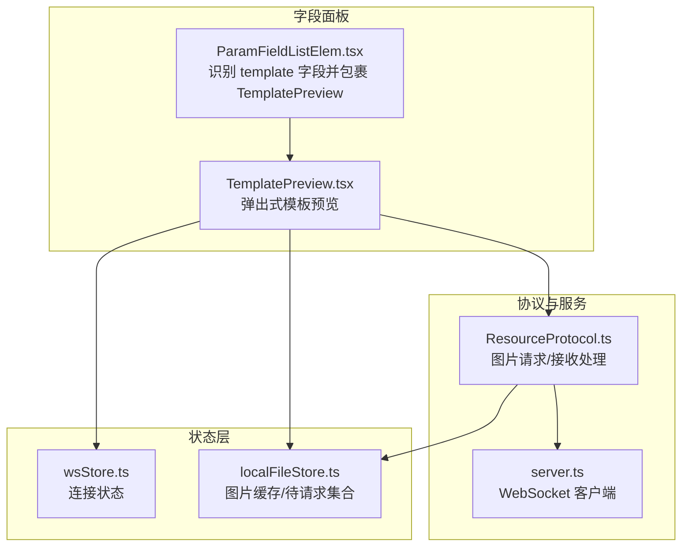
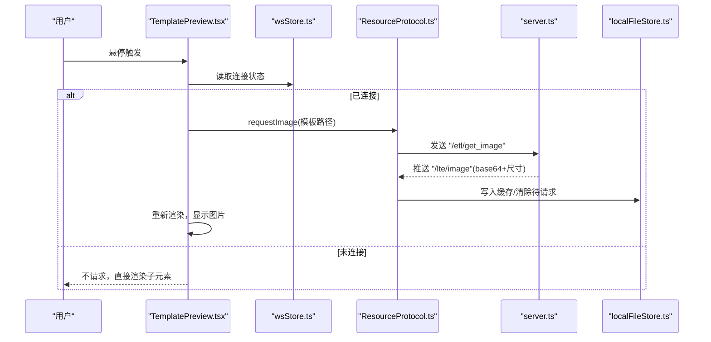
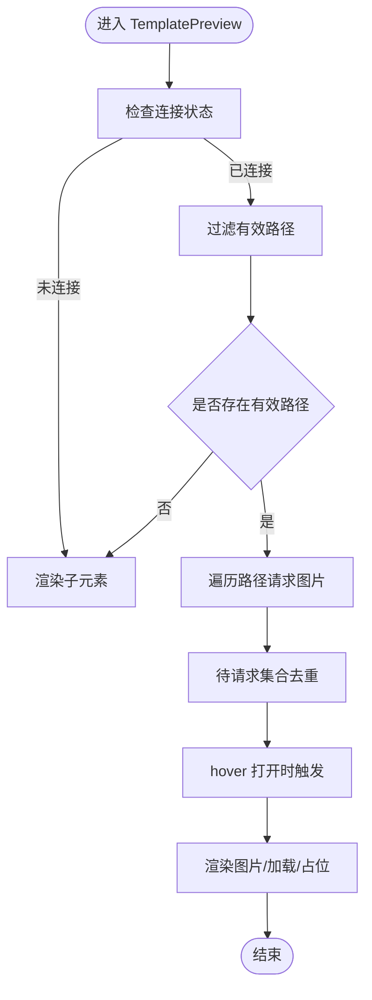
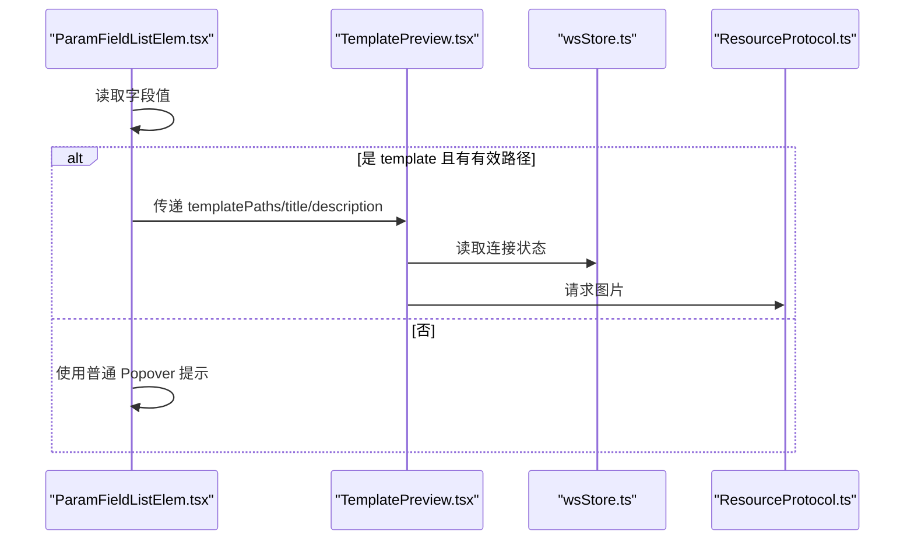
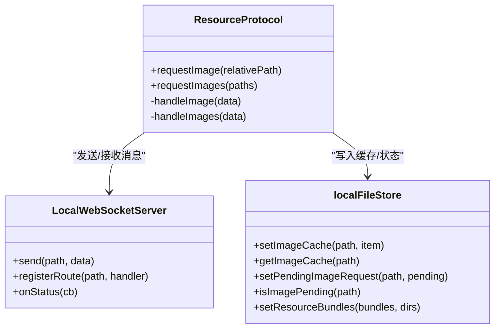
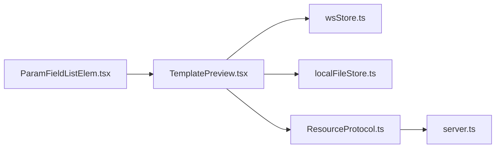

# 模板预览编辑器

<cite>
**本文引用的文件**
- [TemplatePreview.tsx](file://src/components/panels/field/items/TemplatePreview.tsx)
- [ParamFieldListElem.tsx](file://src/components/panels/field/items/ParamFieldListElem.tsx)
- [localFileStore.ts](file://src/stores/localFileStore.ts)
- [wsStore.ts](file://src/stores/wsStore.ts)
- [server.ts](file://src/services/server.ts)
- [ResourceProtocol.ts](file://src/services/protocols/ResourceProtocol.ts)
- [NodeTemplateImages.tsx](file://src/components/flow/nodes/components/NodeTemplateImages.tsx)
- [NodePreviewPopover.tsx](file://src/components/panels/main/node-list/NodePreviewPopover.tsx)
- [ImageSelect.tsx](file://src/components/panels/field/items/ImageSelect.tsx)
- [useCanvasViewport.ts](file://src/hooks/useCanvasViewport.ts)
</cite>

## 目录
1. [简介](#简介)
2. [项目结构](#项目结构)
3. [核心组件](#核心组件)
4. [架构总览](#架构总览)
5. [详细组件分析](#详细组件分析)
6. [依赖关系分析](#依赖关系分析)
7. [性能考量](#性能考量)
8. [故障排查指南](#故障排查指南)
9. [结论](#结论)
10. [附录](#附录)

## 简介
本文件系统性阐述“模板预览编辑器”组件的设计与实现，重点覆盖以下方面：
- 模板渲染：基于 WebSocket 的图片资源请求、缓存与展示
- 缩放与交互：通过弹出层与占位图提升交互体验
- 状态管理：连接状态、图片缓存、待请求集合的协同
- 性能优化：去重请求、尺寸计算、懒加载与节流
- 用户体验与无障碍：悬停触发、占位提示、尺寸标注
- 常见问题与排错：连接失败、图片缺失、尺寸异常

## 项目结构
模板预览编辑器位于字段面板的“参数项”区域，围绕一个轻量的弹出式预览组件展开，并与全局状态、协议层、资源缓存形成闭环。

**图表来源**
- [ParamFieldListElem.tsx:614-640](file://src/components/panels/field/items/ParamFieldListElem.tsx#L614-L640)
- [TemplatePreview.tsx:18-182](file://src/components/panels/field/items/TemplatePreview.tsx#L18-L182)
- [wsStore.ts:18-23](file://src/stores/wsStore.ts#L18-L23)
- [localFileStore.ts:129-337](file://src/stores/localFileStore.ts#L129-L337)
- [server.ts:348-372](file://src/services/server.ts#L348-L372)
- [ResourceProtocol.ts:22-36](file://src/services/protocols/ResourceProtocol.ts#L22-L36)

**章节来源**
- [TemplatePreview.tsx:1-185](file://src/components/panels/field/items/TemplatePreview.tsx#L1-L185)
- [ParamFieldListElem.tsx:614-640](file://src/components/panels/field/items/ParamFieldListElem.tsx#L614-L640)

## 核心组件
- TemplatePreview 弹出式模板预览组件：在 hover 时请求并展示模板图片，支持多图并列与尺寸自适应。
- ResourceProtocol 图片资源协议：负责向后端请求图片、接收并写入缓存。
- localFileStore 图片缓存与待请求集合：集中管理图片缓存、请求状态与资源包信息。
- wsStore 连接状态：驱动预览组件在连接可用时才发起请求。
- server.ts WebSocket 客户端：统一连接、握手、消息收发与错误提示。

**章节来源**
- [TemplatePreview.tsx:18-182](file://src/components/panels/field/items/TemplatePreview.tsx#L18-L182)
- [ResourceProtocol.ts:149-207](file://src/services/protocols/ResourceProtocol.ts#L149-L207)
- [localFileStore.ts:129-337](file://src/stores/localFileStore.ts#L129-L337)
- [wsStore.ts:18-23](file://src/stores/wsStore.ts#L18-L23)
- [server.ts:348-372](file://src/services/server.ts#L348-L372)

## 架构总览
模板预览的端到端流程如下：

**图表来源**
- [TemplatePreview.tsx:34-50](file://src/components/panels/field/items/TemplatePreview.tsx#L34-L50)
- [ResourceProtocol.ts:149-173](file://src/services/protocols/ResourceProtocol.ts#L149-L173)
- [server.ts:286-300](file://src/services/server.ts#L286-L300)
- [localFileStore.ts:259-270](file://src/stores/localFileStore.ts#L259-L270)
- [wsStore.ts:18-23](file://src/stores/wsStore.ts#L18-L23)

## 详细组件分析

### TemplatePreview 组件
- 功能要点
  - 仅在连接可用且存在有效路径时请求图片。
  - 根据缓存状态与待请求集合决定渲染加载态或占位提示。
  - 单图最大尺寸与多图布局自适应，保证可读性。
  - 通过 Popover 提供标题、描述与图片列表的组合展示。
- 关键行为
  - 过滤空路径，避免无效请求。
  - hover 打开时批量请求未缓存且非待请求的图片。
  - 渲染时根据图片宽高与容器上限计算显示尺寸，最小尺寸保护。
  - 未找到图片时显示路径与提示文本，便于定位问题。

**图表来源**
- [TemplatePreview.tsx:20-182](file://src/components/panels/field/items/TemplatePreview.tsx#L20-L182)

**章节来源**
- [TemplatePreview.tsx:18-182](file://src/components/panels/field/items/TemplatePreview.tsx#L18-L182)

### 参数面板中的集成
- ParamFieldListElem 识别 key 为 "template" 的字段，自动包裹 TemplatePreview，传入路径数组、标题与描述。
- 若路径为空或未连接，则回退为普通 Popover 提示。

**图表来源**
- [ParamFieldListElem.tsx:614-640](file://src/components/panels/field/items/ParamFieldListElem.tsx#L614-L640)
- [TemplatePreview.tsx:18-182](file://src/components/panels/field/items/TemplatePreview.tsx#L18-L182)

**章节来源**
- [ParamFieldListElem.tsx:614-640](file://src/components/panels/field/items/ParamFieldListElem.tsx#L614-L640)

### 资源协议与缓存
- ResourceProtocol
  - requestImage/requestImages：去重请求、标记待请求、发送后端请求。
  - handleImage/handleImages：解析返回数据，写入缓存；失败时清除待请求。
- localFileStore
  - imageCache：Map 存储 base64、MIME、尺寸、资源包名等。
  - pendingImageRequests：Set 防止重复请求。
  - setResourceBundles：维护资源包与 image 目录信息。
- server.ts
  - 统一连接、握手、消息路由与错误提示，确保连接状态稳定。

**图表来源**
- [ResourceProtocol.ts:149-207](file://src/services/protocols/ResourceProtocol.ts#L149-L207)
- [server.ts:286-300](file://src/services/server.ts#L286-L300)
- [localFileStore.ts:259-293](file://src/stores/localFileStore.ts#L259-L293)

**章节来源**
- [ResourceProtocol.ts:76-121](file://src/services/protocols/ResourceProtocol.ts#L76-L121)
- [localFileStore.ts:129-337](file://src/stores/localFileStore.ts#L129-L337)
- [server.ts:348-372](file://src/services/server.ts#L348-L372)

### 其他相关组件对比
- NodeTemplateImages：节点底部模板缩略图，采用防抖请求与固定高度，适合紧凑展示。
- NodePreviewPopover：节点预览弹层中的模板图片渲染，尺寸较小，强调快速浏览。
- ImageSelect：图片选择器，支持下拉与手动输入，具备列表懒加载与缩略图预览。

这些组件共享相同的请求与缓存机制，但针对不同场景做了尺寸与交互优化。

**章节来源**
- [NodeTemplateImages.tsx:21-85](file://src/components/flow/nodes/components/NodeTemplateImages.tsx#L21-L85)
- [NodePreviewPopover.tsx:72-116](file://src/components/panels/main/node-list/NodePreviewPopover.tsx#L72-L116)
- [ImageSelect.tsx:28-291](file://src/components/panels/field/items/ImageSelect.tsx#L28-L291)

## 依赖关系分析
- 组件耦合
  - TemplatePreview 依赖 wsStore.connected、localFileStore.imageCache/pendingImageRequests、ResourceProtocol.requestImage。
  - ParamFieldListElem 仅在特定字段条件下包裹 TemplatePreview，耦合度低。
- 外部依赖
  - Ant Design 的 Popover、Spin、Image 组件提供 UI 基元。
  - Zustand 状态管理提供轻量、可订阅的状态。

**图表来源**
- [TemplatePreview.tsx:1-12](file://src/components/panels/field/items/TemplatePreview.tsx#L1-L12)
- [ParamFieldListElem.tsx:614-640](file://src/components/panels/field/items/ParamFieldListElem.tsx#L614-L640)
- [ResourceProtocol.ts:1-20](file://src/services/protocols/ResourceProtocol.ts#L1-L20)
- [server.ts:1-16](file://src/services/server.ts#L1-L16)

**章节来源**
- [TemplatePreview.tsx:1-12](file://src/components/panels/field/items/TemplatePreview.tsx#L1-L12)
- [ParamFieldListElem.tsx:614-640](file://src/components/panels/field/items/ParamFieldListElem.tsx#L614-L640)
- [ResourceProtocol.ts:1-20](file://src/services/protocols/ResourceProtocol.ts#L1-L20)

## 性能考量
- 去重与幂等
  - 已缓存或已在待请求集合中的路径不会重复请求，降低网络与渲染压力。
- 懒加载与尺寸控制
  - 仅在 hover 时请求；渲染时按最大尺寸阈值计算显示宽高，避免大图撑破布局。
- 防抖与节流
  - NodeTemplateImages 对批量请求使用防抖，减少频繁网络波动带来的抖动。
- 资源包与目录
  - 通过资源包信息与 image 目录集合，有助于后续扩展跨包检索与过滤能力。

**章节来源**
- [TemplatePreview.tsx:34-50](file://src/components/panels/field/items/TemplatePreview.tsx#L34-L50)
- [NodeTemplateImages.tsx:37-61](file://src/components/flow/nodes/components/NodeTemplateImages.tsx#L37-L61)
- [localFileStore.ts:259-270](file://src/stores/localFileStore.ts#L259-L270)

## 故障排查指南
- 连接失败或超时
  - 现象：模板预览不加载，仅显示子元素。
  - 排查：确认本地服务已启动、端口正确；查看连接状态与错误通知。
  - 参考：WebSocket 连接与错误提示逻辑。
- 图片未找到
  - 现象：显示路径与“未找到”提示。
  - 排查：核对模板路径是否存在于资源包内；确认资源包扫描与 image 目录配置。
  - 参考：ResourceProtocol 失败分支与缓存写入。
- 显示异常（尺寸过大/过小）
  - 现象：图片被过度压缩或溢出。
  - 排查：检查模板图片实际尺寸与容器限制；确认渲染时的尺寸计算逻辑。
  - 参考：TemplatePreview 中的尺寸计算与最小尺寸保护。
- 交互卡顿
  - 现象：大量模板同时 hover 导致请求洪泛。
  - 排查：利用去重与防抖机制；必要时限制同时 hover 的数量或引入虚拟化。
  - 参考：NodeTemplateImages 的防抖与 TemplatePreview 的去重。

**章节来源**
- [server.ts:118-251](file://src/services/server.ts#L118-L251)
- [ResourceProtocol.ts:109-121](file://src/services/protocols/ResourceProtocol.ts#L109-L121)
- [TemplatePreview.tsx:100-117](file://src/components/panels/field/items/TemplatePreview.tsx#L100-L117)
- [NodeTemplateImages.tsx:37-61](file://src/components/flow/nodes/components/NodeTemplateImages.tsx#L37-L61)

## 结论
TemplatePreview 通过“连接状态驱动 + 去重请求 + 缓存渲染”的设计，在保证交互流畅的同时兼顾了性能与可维护性。其与资源协议、状态层的协作形成了清晰的职责边界，易于扩展至更复杂的模板管理场景（如批量预览、跨资源包检索、缩略图生成等）。

## 附录

### 使用示例与集成指南
- 在字段面板中，当某字段 key 为 "template" 且值为字符串或字符串数组时，组件会自动包裹 TemplatePreview 并传入路径、标题与描述。
- 若未连接或路径为空，将回退为普通 Popover 提示，保持一致的用户体验。

**章节来源**
- [ParamFieldListElem.tsx:614-640](file://src/components/panels/field/items/ParamFieldListElem.tsx#L614-L640)
- [TemplatePreview.tsx:52-60](file://src/components/panels/field/items/TemplatePreview.tsx#L52-L60)

### 用户体验与无障碍支持
- 交互方式：悬停触发，延迟可控，避免误触。
- 信息密度：标题、描述、图片列表与尺寸标注，帮助用户快速理解模板含义。
- 无障碍建议：为 Image 组件补充合适的 alt 文本；为 Popover 提供键盘可达性与焦点管理（可在上层封装中增强）。

**章节来源**
- [TemplatePreview.tsx:162-180](file://src/components/panels/field/items/TemplatePreview.tsx#L162-L180)

### 缩放与视图控制参考
- 本仓库中还提供了通用的画布缩放钩子与截图视图控制，可作为模板预览在更大视图中的缩放参考实现。

**章节来源**
- [useCanvasViewport.ts:136-306](file://src/hooks/useCanvasViewport.ts#L136-L306)