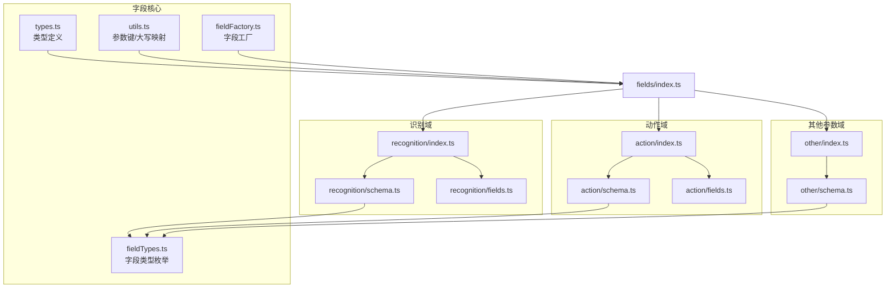
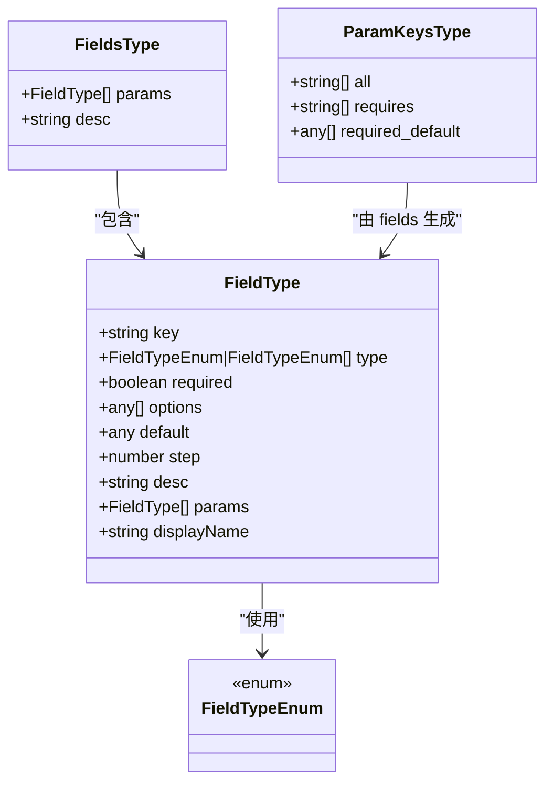
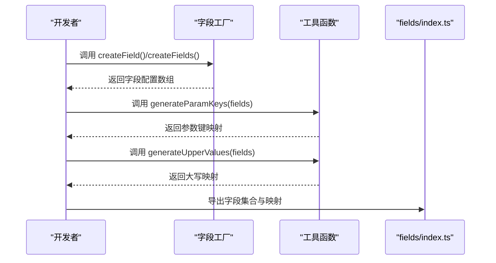
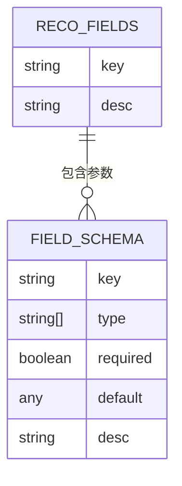
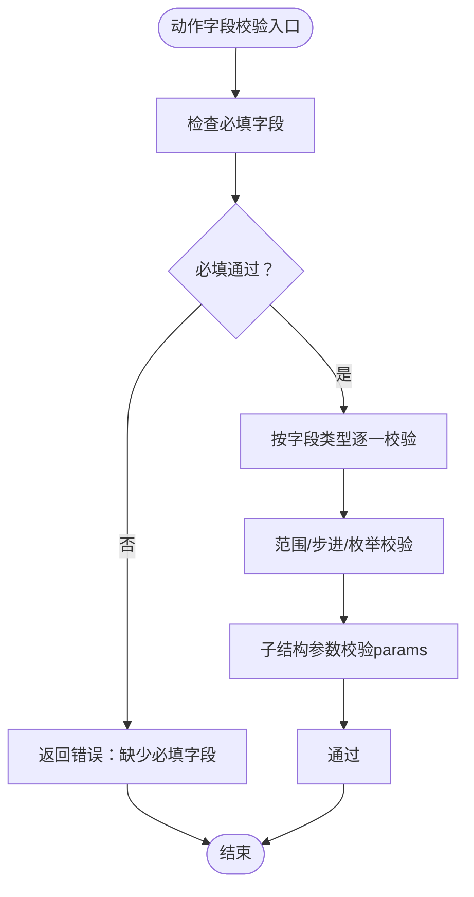
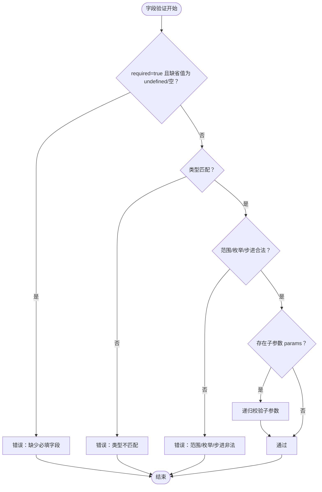
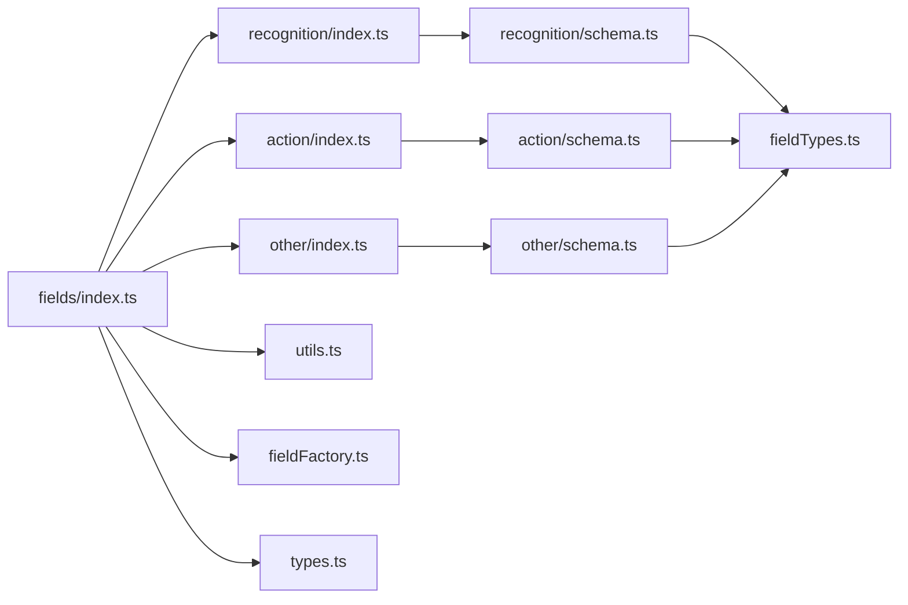

# 字段配置系统

<cite>
**本文档引用的文件**
- [src/core/fields/index.ts](file://src/core/fields/index.ts)
- [src/core/fields/fieldFactory.ts](file://src/core/fields/fieldFactory.ts)
- [src/core/fields/types.ts](file://src/core/fields/types.ts)
- [src/core/fields/utils.ts](file://src/core/fields/utils.ts)
- [src/core/fields/fieldTypes.ts](file://src/core/fields/fieldTypes.ts)
- [src/core/fields/recognition/index.ts](file://src/core/fields/recognition/index.ts)
- [src/core/fields/recognition/schema.ts](file://src/core/fields/recognition/schema.ts)
- [src/core/fields/recognition/fields.ts](file://src/core/fields/recognition/fields.ts)
- [src/core/fields/action/index.ts](file://src/core/fields/action/index.ts)
- [src/core/fields/action/schema.ts](file://src/core/fields/action/schema.ts)
- [src/core/fields/action/fields.ts](file://src/core/fields/action/fields.ts)
- [src/core/fields/other/index.ts](file://src/core/fields/other/index.ts)
- [src/core/fields/other/schema.ts](file://src/core/fields/other/schema.ts)
</cite>

## 目录
1. [简介](#简介)
2. [项目结构](#项目结构)
3. [核心组件](#核心组件)
4. [架构总览](#架构总览)
5. [详细组件分析](#详细组件分析)
6. [依赖关系分析](#依赖关系分析)
7. [性能考量](#性能考量)
8. [故障排查指南](#故障排查指南)
9. [结论](#结论)
10. [附录](#附录)

## 简介
本文件系统性阐述 MaaPipelineEditor 的“字段配置系统”，重点围绕以下主题：
- 字段工厂模式：字段类型注册、实例化、键值映射与大写规范化
- 字段类型体系：基础类型、复合类型、图片路径类型等
- 字段定义与使用：识别字段（OCR、TemplateMatch、DirectHit 等）、动作字段（点击、滑动、输入、应用等）、其他参数字段
- 字段验证机制：必填检查、类型验证、范围限制、子结构参数校验
- 字段编辑器实现：表单渲染、实时验证、错误提示
- 扩展开发指南：如何添加新字段类型
- 最佳实践与常见问题

## 项目结构
字段配置系统位于前端核心模块 src/core/fields 下，采用“按功能域分层 + 工厂 + 工具函数”的组织方式：
- 类型与枚举：定义字段类型、字段集合、参数键映射等
- 字段工厂：提供 createField/createFields 简化字段定义
- 字段类型枚举：统一管理所有可用字段类型
- 字段工具：生成参数键列表、生成大写映射
- 三大域：识别字段、动作字段、其他参数字段，各自维护 schema 与 fields 定义

图表来源
- [src/core/fields/index.ts:1-45](file://src/core/fields/index.ts#L1-L45)
- [src/core/fields/fieldTypes.ts:1-27](file://src/core/fields/fieldTypes.ts#L1-L27)
- [src/core/fields/utils.ts:1-41](file://src/core/fields/utils.ts#L1-L41)
- [src/core/fields/fieldFactory.ts:1-16](file://src/core/fields/fieldFactory.ts#L1-L16)
- [src/core/fields/recognition/index.ts:1-3](file://src/core/fields/recognition/index.ts#L1-L3)
- [src/core/fields/action/index.ts:1-3](file://src/core/fields/action/index.ts#L1-L3)
- [src/core/fields/other/index.ts:1-8](file://src/core/fields/other/index.ts#L1-L8)

章节来源
- [src/core/fields/index.ts:1-45](file://src/core/fields/index.ts#L1-L45)
- [src/core/fields/fieldTypes.ts:1-27](file://src/core/fields/fieldTypes.ts#L1-L27)

## 核心组件
- 字段类型定义：FieldType、FieldsType、ParamKeysType，描述字段键、类型、默认值、是否必填、选项、描述、子参数等
- 字段类型枚举：FieldTypeEnum，涵盖基础类型、列表类型、数组类型、图片路径类型等
- 字段工厂：createField/createFields，提供简洁的字段定义语法
- 字段工具：generateParamKeys、generateUpperValues，生成参数键集合、大小写映射
- 三大域定义：识别字段、动作字段、其他参数字段，分别提供 schema 与 fields

章节来源
- [src/core/fields/types.ts:1-34](file://src/core/fields/types.ts#L1-L34)
- [src/core/fields/fieldTypes.ts:1-27](file://src/core/fields/fieldTypes.ts#L1-L27)
- [src/core/fields/fieldFactory.ts:1-16](file://src/core/fields/fieldFactory.ts#L1-L16)
- [src/core/fields/utils.ts:1-41](file://src/core/fields/utils.ts#L1-L41)

## 架构总览
字段配置系统通过“schema + fields”双层结构实现：
- schema 定义具体字段的键、类型、默认值、描述、子参数等
- fields 将不同算法/动作抽象为“字段集合”，每个集合包含一组参数键
- 工具函数将 fields 转换为参数键映射与大写映射，供编辑器与校验使用
- 编辑器根据 schema 渲染表单，结合字段类型与默认值进行实时校验与提示

图表来源
- [src/core/fields/types.ts:6-24](file://src/core/fields/types.ts#L6-L24)
- [src/core/fields/fieldTypes.ts:4-26](file://src/core/fields/fieldTypes.ts#L4-L26)

## 详细组件分析

### 字段工厂模式与注册
- 字段工厂提供 createField/createFields，简化字段定义与批量创建
- 字段类型定义包含键、类型、默认值、是否必填、选项、描述、子参数等
- 通过 generateParamKeys 从 fields 生成参数键集合（全部、必填、必填默认值）
- 通过 generateUpperValues 生成字段名的大写映射，便于大小写不敏感查找

图表来源
- [src/core/fields/fieldFactory.ts:6-15](file://src/core/fields/fieldFactory.ts#L6-L15)
- [src/core/fields/utils.ts:6-40](file://src/core/fields/utils.ts#L6-L40)
- [src/core/fields/index.ts:34-45](file://src/core/fields/index.ts#L34-L45)

章节来源
- [src/core/fields/fieldFactory.ts:1-16](file://src/core/fields/fieldFactory.ts#L1-L16)
- [src/core/fields/utils.ts:1-41](file://src/core/fields/utils.ts#L1-L41)
- [src/core/fields/index.ts:30-45](file://src/core/fields/index.ts#L30-L45)

### 字段类型体系
- 基础类型：整数、浮点、布尔、字符串、任意类型
- 列表类型：整数列表、浮点列表、字符串列表、对象列表、字符串或对象列表
- 数组类型：二维整数数组、二维字符串数组、位置列表等
- 图片路径类型：单张图片路径、图片路径列表
- 复合类型：XYWH、位置列表、键值对列表等

章节来源
- [src/core/fields/fieldTypes.ts:4-26](file://src/core/fields/fieldTypes.ts#L4-L26)

### 识别字段（OCR、TemplateMatch、ColorMatch、FeatureMatch、NeuralNetwork、DirectHit、组合识别、自定义）
- DirectHit：直接命中，无需识别，直接执行动作
- OCR：期望文本、阈值、替换规则、排序方式、索引、仅识别模式、模型、颜色过滤
- TemplateMatch：模板图片、阈值、匹配算法、排序、索引、绿色掩码
- ColorMatch：颜色空间、上下限、像素数量阈值、连通性、排序、索引
- FeatureMatch：模板、特征点数量、检测器、KNN比率、排序、索引、绿色掩码
- NeuralNetworkClassify/Detect：标签、模型、期望类别/框、排序、索引
- 组合识别 And/Or：子识别列表、框索引、子名称
- 自定义识别：识别名、参数、自定义ROI

图表来源
- [src/core/fields/recognition/fields.ts:7-114](file://src/core/fields/recognition/fields.ts#L7-L114)
- [src/core/fields/recognition/schema.ts:7-268](file://src/core/fields/recognition/schema.ts#L7-L268)

章节来源
- [src/core/fields/recognition/fields.ts:1-115](file://src/core/fields/recognition/fields.ts#L1-L115)
- [src/core/fields/recognition/schema.ts:1-276](file://src/core/fields/recognition/schema.ts#L1-L276)

### 动作字段（点击、滑动、输入、应用、命令、截图、自定义）
- Click/LongPress：目标位置、偏移、触点、压力
- Swipe/MultiSwipe：起点/终点、偏移、时长、停留、仅悬停、触点、压力
- Scroll：目标位置、偏移、dx/dy
- 键盘：单击键、长按键、按下/松开
- 输入：文本
- 应用：包名/Activity
- 命令：可执行文件、参数、分离进程、Shell命令、超时
- 截图：文件名、格式、质量
- 自定义动作：动作名、参数、目标

图表来源
- [src/core/fields/action/schema.ts:7-291](file://src/core/fields/action/schema.ts#L7-L291)

章节来源
- [src/core/fields/action/fields.ts:1-149](file://src/core/fields/action/fields.ts#L1-L149)
- [src/core/fields/action/schema.ts:1-299](file://src/core/fields/action/schema.ts#L1-L299)

### 其他参数字段（等待画面静止、关注、重复、锚点、启用/禁用、反转、延迟、超时、速率限制、附加数据）
- 等待画面静止：预等待/后等待/重复等待，支持整数阈值与复杂对象参数（时间、目标、偏移、阈值、方法、速率限制、超时）
- 关注：节点生命周期事件的消息模板
- 重复：重复次数、重复间隔、重复等待
- 锚点：节点命名与引用
- 启用/禁用、反转、延迟、超时、速率限制、附加数据

章节来源
- [src/core/fields/other/schema.ts:1-363](file://src/core/fields/other/schema.ts#L1-L363)

### 字段验证系统
- 必填检查：required 标记字段缺失即报错
- 类型验证：依据 FieldTypeEnum 校验字段类型一致性
- 范围限制：step、min/max、options 枚举值约束
- 子结构参数：params 中的嵌套字段逐项校验
- 等待画面静止：int/object 双模式，object 时进一步校验内部参数

图表来源
- [src/core/fields/types.ts:6-16](file://src/core/fields/types.ts#L6-L16)
- [src/core/fields/fieldTypes.ts:4-26](file://src/core/fields/fieldTypes.ts#L4-L26)
- [src/core/fields/other/schema.ts:60-178](file://src/core/fields/other/schema.ts#L60-L178)

## 依赖关系分析
- fields/index.ts 汇总导出识别、动作、其他域的 schema 与 fields，并导出工厂与工具函数
- 各域内部通过 schema 定义字段，通过 fields 将字段组织为算法/动作集合
- 工具函数依赖各域 fields 生成参数键映射与大写映射
- 字段类型枚举被 schema 与工具函数共同使用

图表来源
- [src/core/fields/index.ts:1-45](file://src/core/fields/index.ts#L1-L45)
- [src/core/fields/recognition/index.ts:1-3](file://src/core/fields/recognition/index.ts#L1-L3)
- [src/core/fields/action/index.ts:1-3](file://src/core/fields/action/index.ts#L1-L3)
- [src/core/fields/other/index.ts:1-8](file://src/core/fields/other/index.ts#L1-L8)

章节来源
- [src/core/fields/index.ts:1-45](file://src/core/fields/index.ts#L1-L45)

## 性能考量
- 参数键映射与大写映射在初始化阶段生成，避免运行时重复计算
- 等待画面静止的复杂对象参数应谨慎使用，避免频繁深拷贝与校验
- 列表/数组类型字段在编辑器端应限制最大长度，防止 UI 卡顿
- 图片路径类型字段建议提供预览与校验，减少无效资源加载

## 故障排查指南
- 缺少必填字段：检查 required 标记与默认值，确保必填字段非空
- 类型不匹配：核对 FieldTypeEnum 与实际输入类型，修正为允许的联合类型之一
- 范围/枚举非法：确认 step、min/max、options 是否与输入一致
- 子参数校验失败：逐项检查 params 内部字段的键与类型
- 等待画面静止对象参数：确认对象内键完整且类型正确

章节来源
- [src/core/fields/types.ts:6-16](file://src/core/fields/types.ts#L6-L16)
- [src/core/fields/fieldTypes.ts:4-26](file://src/core/fields/fieldTypes.ts#L4-L26)
- [src/core/fields/other/schema.ts:60-178](file://src/core/fields/other/schema.ts#L60-L178)

## 结论
字段配置系统通过清晰的类型定义、工厂模式与工具函数，实现了对识别、动作、其他参数三类字段的统一建模与高效管理。配合 schema 与 fields 的双层结构，编辑器能够基于类型与默认值进行直观渲染与实时校验，显著提升配置体验与准确性。

## 附录

### 字段编辑器实现要点
- 表单渲染：根据 FieldTypeEnum 渲染对应控件（输入框、下拉框、开关、数值步进器、列表编辑器等）
- 实时验证：在用户输入时即时执行必填、类型、范围、子参数校验
- 错误提示：将错误信息与字段键关联，高亮显示并提供帮助链接
- 默认值应用：首次打开节点时应用字段默认值，支持一键清空/恢复默认
- 大小写不敏感：利用大写映射支持大小写不敏感的字段名查找

章节来源
- [src/core/fields/utils.ts:30-40](file://src/core/fields/utils.ts#L30-L40)
- [src/core/fields/fieldTypes.ts:4-26](file://src/core/fields/fieldTypes.ts#L4-L26)

### 扩展开发指南：添加新字段类型
- 定义字段类型：在 FieldTypeEnum 中新增类型，或复用现有复合类型
- 编写字段 schema：在相应域的 schema.ts 中新增字段定义，设置 key、type、default、desc、options、step 等
- 注册字段集合：在 fields.ts 中将新字段加入对应算法/动作集合
- 生成映射：确保 fields/index.ts 导出新字段集合与映射
- 编辑器适配：在前端根据 FieldTypeEnum 渲染对应控件并实现校验逻辑

章节来源
- [src/core/fields/fieldTypes.ts:4-26](file://src/core/fields/fieldTypes.ts#L4-L26)
- [src/core/fields/recognition/schema.ts:7-268](file://src/core/fields/recognition/schema.ts#L7-L268)
- [src/core/fields/action/schema.ts:7-291](file://src/core/fields/action/schema.ts#L7-L291)
- [src/core/fields/other/schema.ts:7-308](file://src/core/fields/other/schema.ts#L7-L308)
- [src/core/fields/recognition/fields.ts:7-114](file://src/core/fields/recognition/fields.ts#L7-L114)
- [src/core/fields/action/fields.ts:7-149](file://src/core/fields/action/fields.ts#L7-L149)
- [src/core/fields/index.ts:7-28](file://src/core/fields/index.ts#L7-L28)

### 最佳实践
- 优先使用联合类型（如 XYWH | String）表达灵活字段，明确文档与默认值
- 为列表/数组字段提供合理的默认值与最小/最大长度限制
- 使用子参数（params）封装复杂对象，便于编辑器渲染与校验
- 对图片路径字段提供预览与有效性检查，减少无效资源
- 对等待画面静止等高开销字段，提供合理默认值与超时控制