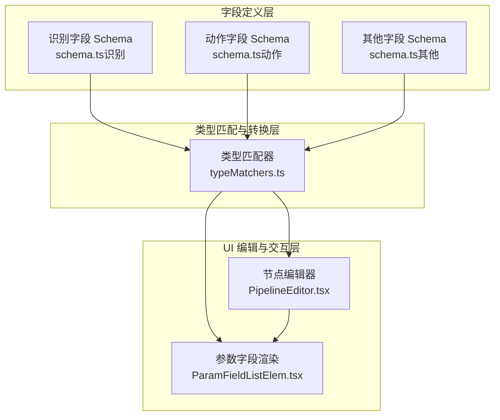
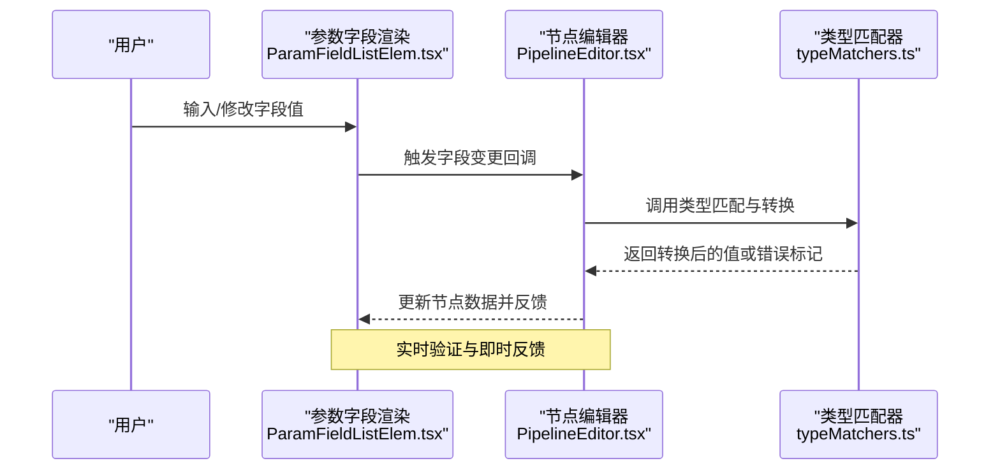
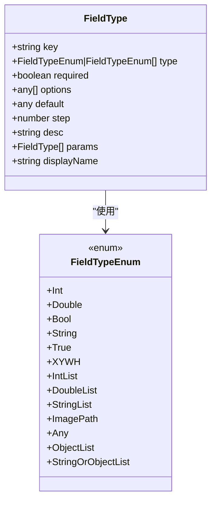
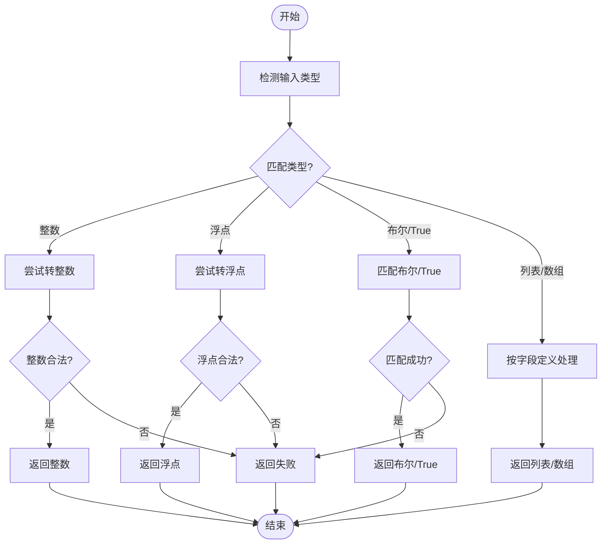
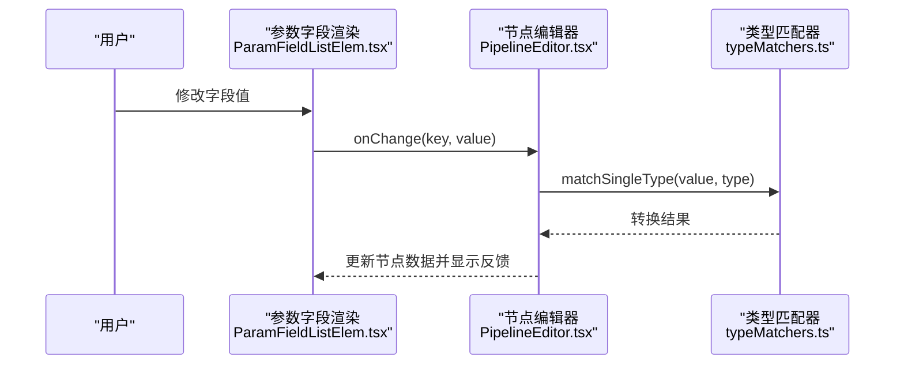
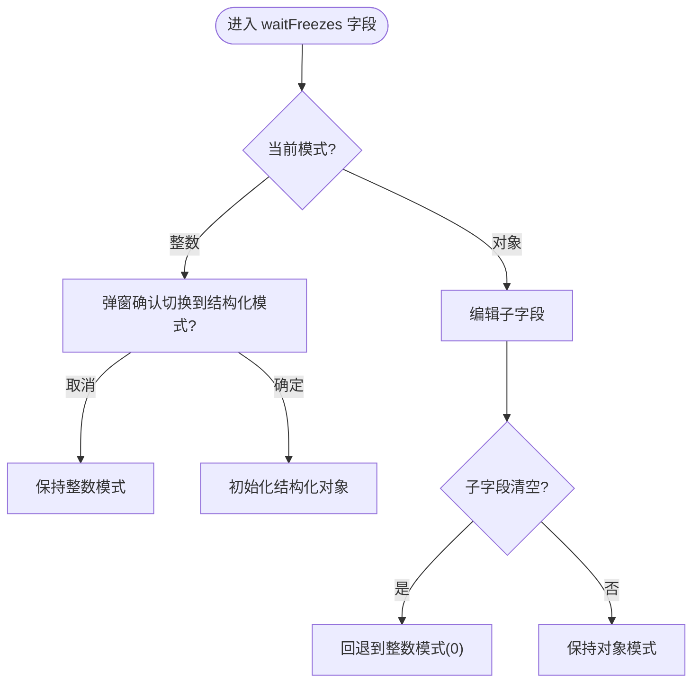
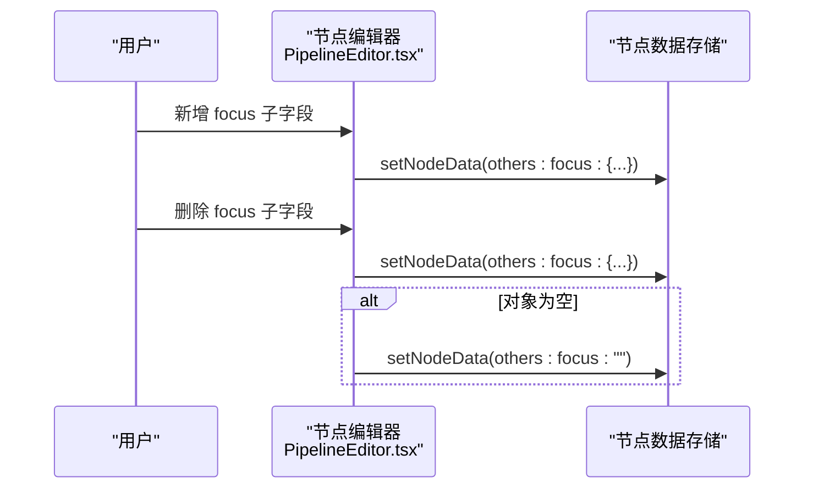
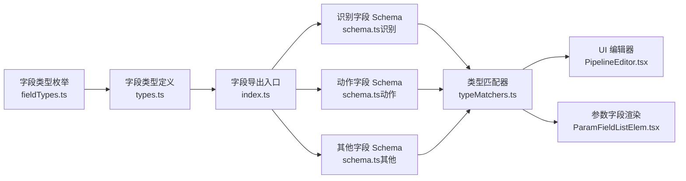

# 字段验证系统

<cite>
**本文档引用的文件**
- [fieldFactory.ts](file://src/core/fields/fieldFactory.ts)
- [fieldTypes.ts](file://src/core/fields/fieldTypes.ts)
- [utils.ts](file://src/core/fields/utils.ts)
- [index.ts](file://src/core/fields/index.ts)
- [types.ts](file://src/core/fields/types.ts)
- [schema.ts（识别）](file://src/core/fields/recognition/schema.ts)
- [schema.ts（动作）](file://src/core/fields/action/schema.ts)
- [schema.ts（其他）](file://src/core/fields/other/schema.ts)
- [typeMatchers.ts](file://src/core/parser/typeMatchers.ts)
- [PipelineEditor.tsx](file://src/components/panels/node-editors/PipelineEditor.tsx)
- [ParamFieldListElem.tsx](file://src/components/panels/field/items/ParamFieldListElem.tsx)
</cite>

## 目录
1. [简介](#简介)
2. [项目结构](#项目结构)
3. [核心组件](#核心组件)
4. [架构总览](#架构总览)
5. [详细组件分析](#详细组件分析)
6. [依赖分析](#依赖分析)
7. [性能考量](#性能考量)
8. [故障排查指南](#故障排查指南)
9. [结论](#结论)
10. [附录](#附录)

## 简介
本文件系统性阐述字段验证体系的设计与实现，涵盖字段类型定义、验证规则（必填、类型、范围、格式等）、验证时机（同步/异步、实时/提交）、错误收集与呈现、自定义规则与复杂逻辑、性能优化策略以及扩展与最佳实践。该系统以“字段 Schema + 类型匹配器 + UI 编辑器”的分层架构实现，既保证强约束的静态校验，又提供灵活的动态交互体验。

## 项目结构
字段验证系统由三层组成：
- 字段定义层：集中于各模块的 schema.ts，声明字段键、类型、默认值、选项集、描述与子参数。
- 类型匹配与转换层：typeMatchers.ts 提供统一的类型匹配与转换逻辑，确保输入值与字段类型一致。
- UI 编辑与交互层：PipelineEditor.tsx 与 ParamFieldListElem.tsx 负责字段渲染、变更处理与即时反馈。

图表来源
- [schema.ts（识别）:1-276](file://src/core/fields/recognition/schema.ts#L1-L276)
- [schema.ts（动作）:1-299](file://src/core/fields/action/schema.ts#L1-L299)
- [schema.ts（其他）:1-363](file://src/core/fields/other/schema.ts#L1-L363)
- [typeMatchers.ts:1-60](file://src/core/parser/typeMatchers.ts#L1-L60)
- [PipelineEditor.tsx:155-306](file://src/components/panels/node-editors/PipelineEditor.tsx#L155-L306)
- [ParamFieldListElem.tsx:528-569](file://src/components/panels/field/items/ParamFieldListElem.tsx#L528-L569)

章节来源
- [index.ts:1-45](file://src/core/fields/index.ts#L1-L45)
- [types.ts:1-34](file://src/core/fields/types.ts#L1-L34)
- [fieldTypes.ts:1-27](file://src/core/fields/fieldTypes.ts#L1-L27)
- [utils.ts:1-41](file://src/core/fields/utils.ts#L1-L41)

## 核心组件
- 字段类型枚举：定义基础与复合类型，如整数、浮点、布尔、字符串、列表、数组、对象等。
- 字段类型定义：描述字段键、类型、是否必填、默认值、步进、选项集、子参数与显示名。
- 字段集合与参数键：生成字段参数键映射与大写值映射，便于上下文查找与大小写兼容。
- 字段工厂：提供 createField/createFields 简化字段定义与批量创建。
- 类型匹配器：统一处理字符串到目标类型的转换与校验，支持整数、浮点、布尔、True、数组等。
- UI 编辑器：负责字段渲染、waitFreezes 结构化模式切换、focus 字段的增删改、以及参数变更的即时应用。

章节来源
- [fieldTypes.ts:1-27](file://src/core/fields/fieldTypes.ts#L1-L27)
- [types.ts:1-34](file://src/core/fields/types.ts#L1-L34)
- [utils.ts:1-41](file://src/core/fields/utils.ts#L1-L41)
- [fieldFactory.ts:1-16](file://src/core/fields/fieldFactory.ts#L1-L16)
- [typeMatchers.ts:1-60](file://src/core/parser/typeMatchers.ts#L1-L60)
- [PipelineEditor.tsx:155-306](file://src/components/panels/node-editors/PipelineEditor.tsx#L155-L306)
- [ParamFieldListElem.tsx:528-569](file://src/components/panels/field/items/ParamFieldListElem.tsx#L528-L569)

## 架构总览
字段验证系统采用“Schema 驱动 + 类型匹配 + UI 即时反馈”的架构。Schema 决定字段的合法性边界，类型匹配器提供转换与校验能力，UI 层在用户输入时即时应用变更并给出反馈，必要时在提交阶段进行更严格的校验。

图表来源
- [ParamFieldListElem.tsx:528-569](file://src/components/panels/field/items/ParamFieldListElem.tsx#L528-L569)
- [PipelineEditor.tsx:155-306](file://src/components/panels/node-editors/PipelineEditor.tsx#L155-L306)
- [typeMatchers.ts:1-60](file://src/core/parser/typeMatchers.ts#L1-L60)

## 详细组件分析

### 字段类型与 Schema 设计
- 字段类型枚举 FieldTypeEnum 覆盖整数、浮点、布尔、字符串、列表、数组、对象、图片路径等，支持复合类型（如 list<array<int,4>>）。
- 字段类型定义 FieldType 包含键、类型、是否必填、选项集、默认值、步进、描述、子参数与显示名。
- 各模块 Schema（识别、动作、其他）集中声明字段及其约束，如阈值、方法、区域、延迟、等待画面静止等。

图表来源
- [types.ts:1-34](file://src/core/fields/types.ts#L1-L34)
- [fieldTypes.ts:1-27](file://src/core/fields/fieldTypes.ts#L1-L27)

章节来源
- [schema.ts（识别）:1-276](file://src/core/fields/recognition/schema.ts#L1-L276)
- [schema.ts（动作）:1-299](file://src/core/fields/action/schema.ts#L1-L299)
- [schema.ts（其他）:1-363](file://src/core/fields/other/schema.ts#L1-L363)
- [types.ts:1-34](file://src/core/fields/types.ts#L1-L34)
- [fieldTypes.ts:1-27](file://src/core/fields/fieldTypes.ts#L1-L27)

### 类型匹配与转换（同步验证）
类型匹配器提供统一的转换与校验逻辑，确保输入值与字段类型一致：
- 整数：将字符串转换为整数，非整数返回失败。
- 浮点：将字符串转换为数字，非 NaN 返回成功。
- 布尔与 True：严格匹配 true/false 或 "true"/"false"。
- 列表与数组：支持多维数组与混合类型，配合 Schema 的 options 与默认值。
- 步进与范围：结合字段定义的 step 与业务范围进行约束。

图表来源
- [typeMatchers.ts:1-60](file://src/core/parser/typeMatchers.ts#L1-L60)

章节来源
- [typeMatchers.ts:1-60](file://src/core/parser/typeMatchers.ts#L1-L60)

### 字段渲染与实时验证（同步验证）
参数字段渲染组件根据字段类型渲染不同输入控件，并在用户输入时进行同步验证与即时反馈：
- 数字/浮点：使用带步进的数值输入框，实时更新。
- 列表：支持列表增删改，结合字段步进与默认值。
- 结构化字段：如 focus、waitFreezes 等，支持对象模式与回退到简单模式。

图表来源
- [ParamFieldListElem.tsx:528-569](file://src/components/panels/field/items/ParamFieldListElem.tsx#L528-L569)
- [PipelineEditor.tsx:155-306](file://src/components/panels/node-editors/PipelineEditor.tsx#L155-L306)
- [typeMatchers.ts:1-60](file://src/core/parser/typeMatchers.ts#L1-L60)

章节来源
- [ParamFieldListElem.tsx:528-569](file://src/components/panels/field/items/ParamFieldListElem.tsx#L528-L569)
- [PipelineEditor.tsx:155-306](file://src/components/panels/node-editors/PipelineEditor.tsx#L155-L306)

### waitFreezes 结构化模式切换（同步验证）
其他字段中的 waitFreezes（pre/post/repeat）支持“整数模式”与“结构化对象模式”双向切换。切换时会弹窗确认，避免丢失当前数值；对象模式下可配置更多参数（如 time、target、threshold、method、rate_limit、timeout）。

图表来源
- [schema.ts（其他）:60-119](file://src/core/fields/other/schema.ts#L60-L119)
- [schema.ts（其他）:120-179](file://src/core/fields/other/schema.ts#L120-L179)
- [schema.ts（其他）:242-301](file://src/core/fields/other/schema.ts#L242-L301)
- [PipelineEditor.tsx:188-306](file://src/components/panels/node-editors/PipelineEditor.tsx#L188-L306)

章节来源
- [schema.ts（其他）:60-119](file://src/core/fields/other/schema.ts#L60-L119)
- [schema.ts（其他）:120-179](file://src/core/fields/other/schema.ts#L120-L179)
- [schema.ts（其他）:242-301](file://src/core/fields/other/schema.ts#L242-L301)
- [PipelineEditor.tsx:188-306](file://src/components/panels/node-editors/PipelineEditor.tsx#L188-L306)

### focus 字段的增删改（同步验证）
focus 字段支持对象模式与字符串模式。当对象为空时自动回退到字符串模式，确保 UI 一致性与数据简洁性。

图表来源
- [schema.ts（其他）:180-229](file://src/core/fields/other/schema.ts#L180-L229)
- [PipelineEditor.tsx:155-186](file://src/components/panels/node-editors/PipelineEditor.tsx#L155-L186)

章节来源
- [schema.ts（其他）:180-229](file://src/core/fields/other/schema.ts#L180-L229)
- [PipelineEditor.tsx:155-186](file://src/components/panels/node-editors/PipelineEditor.tsx#L155-L186)

### 提交验证与错误收集（提交验证）
- 提交阶段可在编辑器或导出流程中进行更严格的校验，如必填字段完整性、跨字段依赖关系、范围与格式约束。
- 错误收集建议采用“字段级错误集合”，在 UI 中以气泡提示、边框高亮、错误列表等形式呈现。
- 对于 waitFreezes 等结构化字段，提交时应校验对象字段的合法性与一致性。

（本节为概念性说明，不直接分析具体文件）

### 自定义验证规则与复杂逻辑
- 自定义规则：通过在 UI 层或解析层扩展类型匹配器，增加特定字段的自定义校验（如范围、格式、依赖关系）。
- 复杂逻辑：利用字段间的联动（如 colorFilter 与 OCR、模板路径与阈值），在提交阶段进行组合校验。
- 扩展点：在 PipelineEditor.tsx 中新增字段变更处理函数，或在 typeMatchers.ts 中扩展 matchSingleType 的分支。

章节来源
- [typeMatchers.ts:1-60](file://src/core/parser/typeMatchers.ts#L1-L60)
- [PipelineEditor.tsx:155-306](file://src/components/panels/node-editors/PipelineEditor.tsx#L155-L306)

## 依赖分析
字段验证系统的关键依赖关系如下：
- 字段定义依赖字段类型枚举与类型定义。
- 类型匹配器依赖字段类型与字段定义。
- UI 编辑器依赖字段定义与类型匹配器，负责渲染与交互。
- 参数键映射与大写值映射由工具函数生成，供上下文查找使用。

图表来源
- [fieldTypes.ts:1-27](file://src/core/fields/fieldTypes.ts#L1-L27)
- [types.ts:1-34](file://src/core/fields/types.ts#L1-L34)
- [index.ts:1-45](file://src/core/fields/index.ts#L1-L45)
- [schema.ts（识别）:1-276](file://src/core/fields/recognition/schema.ts#L1-L276)
- [schema.ts（动作）:1-299](file://src/core/fields/action/schema.ts#L1-L299)
- [schema.ts（其他）:1-363](file://src/core/fields/other/schema.ts#L1-L363)
- [typeMatchers.ts:1-60](file://src/core/parser/typeMatchers.ts#L1-L60)
- [PipelineEditor.tsx:155-306](file://src/components/panels/node-editors/PipelineEditor.tsx#L155-L306)
- [ParamFieldListElem.tsx:528-569](file://src/components/panels/field/items/ParamFieldListElem.tsx#L528-L569)

章节来源
- [index.ts:1-45](file://src/core/fields/index.ts#L1-L45)
- [utils.ts:1-41](file://src/core/fields/utils.ts#L1-L41)

## 性能考量
- 验证缓存：对已转换的字段值进行缓存，避免重复类型匹配；在 UI 层使用 useMemo/useCallback 减少重渲染。
- 批量验证：在提交阶段对一组字段进行批处理校验，减少多次 IO 与状态更新。
- 懒加载与分步校验：对大型列表或复杂结构化字段（如 waitFreezes）采用懒加载与分步校验，提升响应速度。
- 类型匹配优化：在 typeMatchers.ts 中优先处理常见类型，短路非必要分支，减少字符串解析成本。

（本节为通用性能建议，不直接分析具体文件）

## 故障排查指南
- 类型不匹配：检查字段类型定义与输入值，确认是否符合整数/浮点/布尔/True 等规则。
- 必填字段缺失：在提交阶段检查 required 字段是否为空，必要时提供默认值或提示。
- 结构化字段异常：确认 waitFreezes 的对象模式与整数模式切换逻辑，避免误删导致回退。
- focus 字段为空：确认对象字段删除后是否正确回退到字符串模式。
- UI 不响应：检查 onChange 回调链路与 setNodeData 调用，确保数据更新与渲染同步。

章节来源
- [typeMatchers.ts:1-60](file://src/core/parser/typeMatchers.ts#L1-L60)
- [PipelineEditor.tsx:155-306](file://src/components/panels/node-editors/PipelineEditor.tsx#L155-L306)
- [ParamFieldListElem.tsx:528-569](file://src/components/panels/field/items/ParamFieldListElem.tsx#L528-L569)

## 结论
该字段验证系统以 Schema 驱动的方式定义字段约束，结合类型匹配器实现统一的同步验证，并通过 UI 编辑器提供即时反馈。waitFreezes 与 focus 等复杂字段通过结构化模式与模式切换保障灵活性与一致性。建议在提交阶段补充更严格的校验与错误收集机制，并通过缓存与批量处理优化性能。

## 附录
- 常见验证场景与解决方案
  - 必填检查：在提交阶段遍历 required 字段，若为空则标记错误并提示。
  - 类型验证：使用类型匹配器统一转换与校验，失败时返回错误信息。
  - 范围限制：结合字段定义的 step 与业务范围，对数值进行上下限校验。
  - 格式验证：对字符串路径、颜色区间、模板路径等进行格式校验。
  - 自定义规则：在 UI 层或解析层扩展校验逻辑，支持跨字段依赖与复杂条件。
- 扩展与最佳实践
  - 新增字段：在对应 schema.ts 中定义字段，确保 key、type、default、desc 完备。
  - 新增类型：在 FieldTypeEnum 与类型匹配器中扩展支持。
  - UI 交互：在 PipelineEditor.tsx 中新增字段变更处理函数，保持与数据存储一致。
  - 错误呈现：采用统一的错误收集与展示策略，提升用户体验。

（本节为通用指导，不直接分析具体文件）