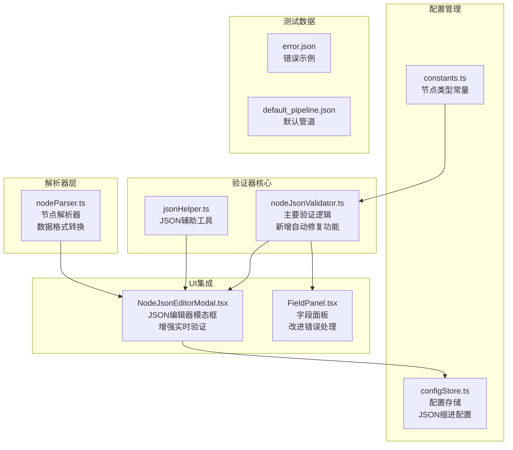
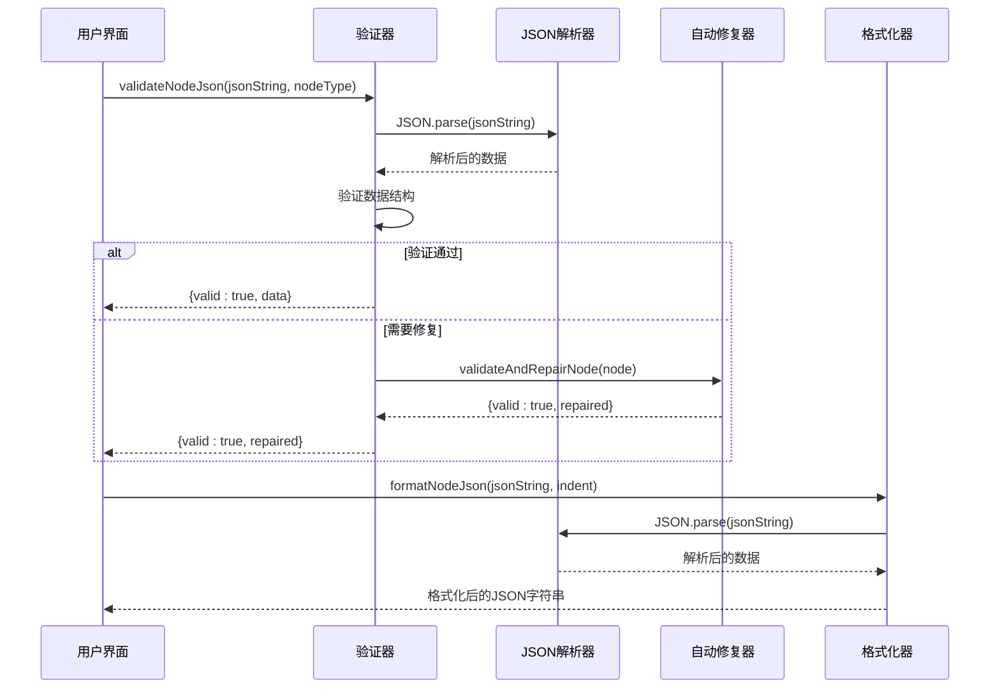
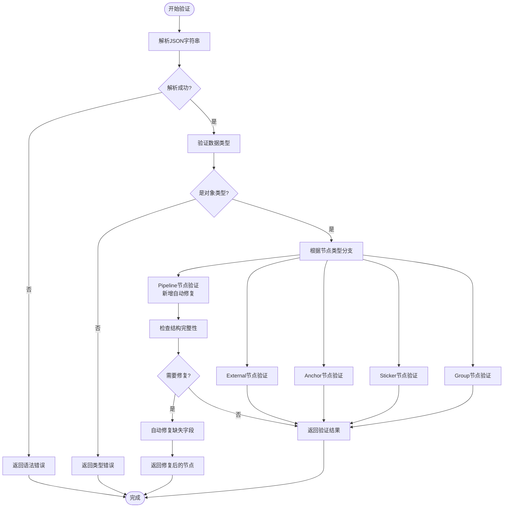
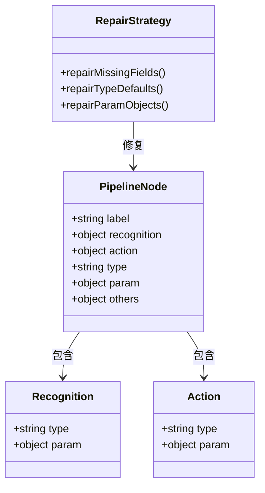
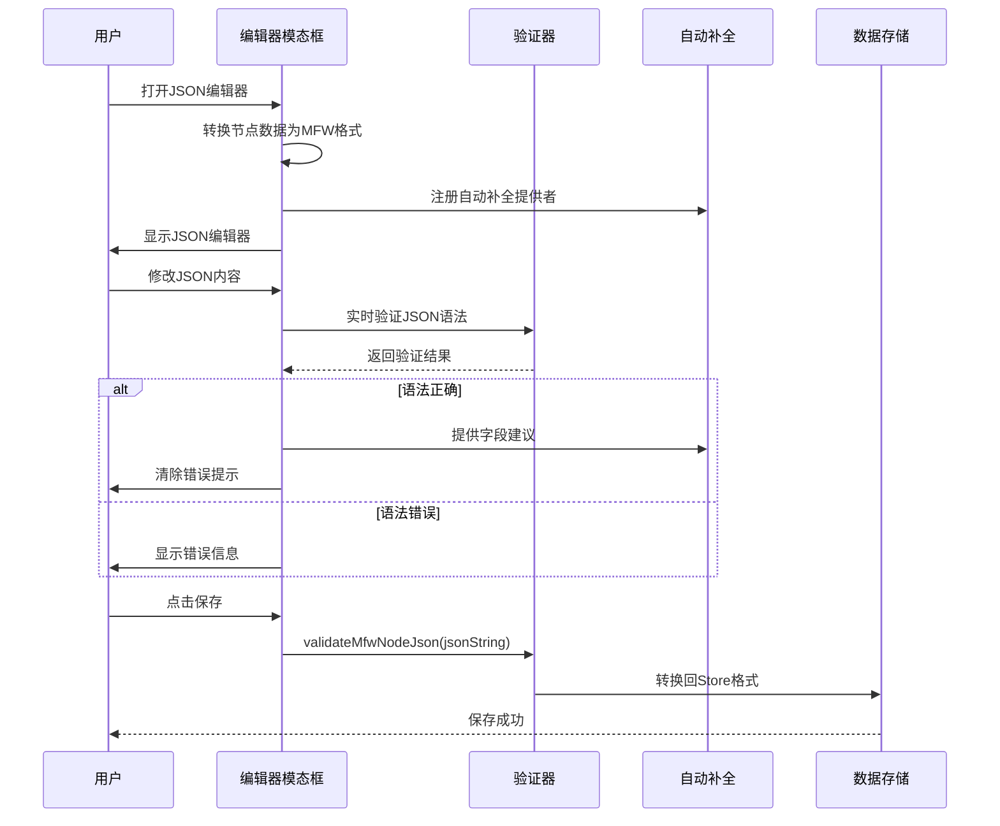
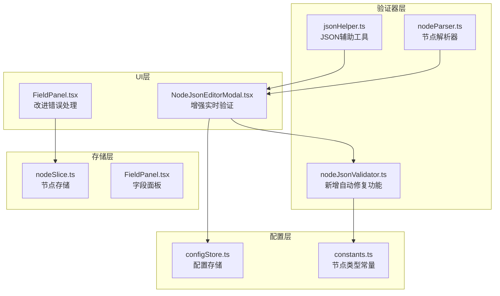

# 节点JSON验证器

<cite>
**本文档引用的文件**
- [nodeJsonValidator.ts](file://src/utils/node/nodeJsonValidator.ts)
- [NodeJsonEditorModal.tsx](file://src/components/modals/NodeJsonEditorModal.tsx)
- [constants.ts](file://src/components/flow/nodes/constants.ts)
- [configStore.ts](file://src/stores/configStore.ts)
- [jsonHelper.ts](file://src/utils/data/jsonHelper.ts)
- [nodeSlice.ts](file://src/stores/flow/slices/nodeSlice.ts)
- [FieldPanel.tsx](file://src/components/panels/main/FieldPanel.tsx)
- [nodeParser.ts](file://src/core/parser/nodeParser.ts)
- [error.json](file://LocalBridge/test-json/base/error.json)
- [default_pipeline.json](file://LocalBridge/test-json/base/default_pipeline.json)
</cite>

## 更新摘要
**变更内容**
- 新增节点数据自动修复功能，包括结构完整性验证
- 增强Pipeline节点的识别和动作字段自动修复能力
- 完善JSON编辑器的实时验证和自动补全功能
- 扩展字段面板的错误处理和修复机制

## 目录
1. [简介](#简介)
2. [项目结构](#项目结构)
3. [核心组件](#核心组件)
4. [架构概览](#架构概览)
5. [详细组件分析](#详细组件分析)
6. [依赖关系分析](#依赖关系分析)
7. [性能考虑](#性能考虑)
8. [故障排除指南](#故障排除指南)
9. [结论](#结论)

## 简介

节点JSON验证器是MAA Pipeline Editor中的一个关键组件，负责验证和格式化节点的JSON数据。该验证器确保节点数据符合预期的结构和类型要求，为整个工作流编辑器提供数据完整性保障。

**更新** 系统现已增强为提供全面的数据安全保障，包括自动修复缺失字段、类型检查和结构完整性验证。验证器不仅能够检测问题，还能智能修复常见的数据结构缺陷，显著提升用户体验和数据可靠性。

该系统主要处理五种节点类型：Pipeline（管道）、External（外部）、Anchor（锚点）、Sticker（贴纸）和Group（分组）。每个节点类型都有特定的验证规则和必需字段，现在都支持自动修复功能。

## 项目结构

节点JSON验证器位于项目的前端代码结构中，主要分布在以下目录：



**图表来源**
- [nodeJsonValidator.ts:1-368](file://src/utils/node/nodeJsonValidator.ts#L1-L368)
- [NodeJsonEditorModal.tsx:1-480](file://src/components/modals/NodeJsonEditorModal.tsx#L1-L480)
- [constants.ts:1-47](file://src/components/flow/nodes/constants.ts#L1-L47)

**章节来源**
- [nodeJsonValidator.ts:1-368](file://src/utils/node/nodeJsonValidator.ts#L1-L368)
- [NodeJsonEditorModal.tsx:1-480](file://src/components/modals/NodeJsonEditorModal.tsx#L1-L480)
- [constants.ts:1-47](file://src/components/flow/nodes/constants.ts#L1-L47)

## 核心组件

### 主要验证接口

验证器提供了三个核心接口：

1. **validateNodeJson**: 主要验证函数，接受JSON字符串和节点类型
2. **validateAndRepairNode**: 新增的自动修复验证函数，支持结构完整性修复
3. **formatNodeJson**: JSON格式化函数，提供缩进格式化

### 验证结果结构

```typescript
interface ValidationResult {
  valid: boolean;
  error?: string;
  data?: any;
}

interface NodeValidationResult {
  valid: boolean;
  error?: string;
  repaired?: NodeType;
}
```

### 节点类型枚举

系统支持五种节点类型：
- Pipeline（管道节点）
- External（外部节点）
- Anchor（锚点节点）
- Sticker（贴纸节点）
- Group（分组节点）

**章节来源**
- [nodeJsonValidator.ts:4-14](file://src/utils/node/nodeJsonValidator.ts#L4-L14)
- [constants.ts:14-20](file://src/components/flow/nodes/constants.ts#L14-L20)

## 架构概览

节点JSON验证器采用模块化设计，具有清晰的职责分离和增强的自动修复能力：



**图表来源**
- [nodeJsonValidator.ts:103-144](file://src/utils/node/nodeJsonValidator.ts#L103-L144)
- [nodeJsonValidator.ts:21-95](file://src/utils/node/nodeJsonValidator.ts#L21-L95)
- [NodeJsonEditorModal.tsx:311-349](file://src/components/modals/NodeJsonEditorModal.tsx#L311-L349)

## 详细组件分析

### 增强验证流程

验证过程现在分为四个主要步骤，增加了自动修复能力：

1. **JSON格式验证**：使用标准JSON.parse()解析输入字符串
2. **数据类型验证**：确保解析后的数据是对象类型
3. **节点特定验证**：根据节点类型执行相应的字段验证
4. **自动修复处理**：对Pipeline节点进行结构完整性修复



**图表来源**
- [nodeJsonValidator.ts:103-144](file://src/utils/node/nodeJsonValidator.ts#L103-L144)
- [nodeJsonValidator.ts:21-95](file://src/utils/node/nodeJsonValidator.ts#L21-L95)

### Pipeline节点自动修复规则

Pipeline节点的自动修复功能提供了智能的数据结构修复：



**图表来源**
- [nodeJsonValidator.ts:34-95](file://src/utils/node/nodeJsonValidator.ts#L34-L95)

### Sticker节点颜色验证

Sticker节点具有特定的颜色限制：

| 颜色类型 | 有效值 |
|---------|--------|
| Sticker节点 | yellow, green, blue, pink, purple |
| Group节点 | blue, green, purple, orange, gray |

**章节来源**
- [nodeJsonValidator.ts:302-308](file://src/utils/node/nodeJsonValidator.ts#L302-L308)
- [nodeJsonValidator.ts:343-349](file://src/utils/node/nodeJsonValidator.ts#L343-L349)

### JSON编辑器集成

NodeJsonEditorModal提供了完整的JSON编辑和验证体验，包括实时语法验证和自动补全：



**图表来源**
- [NodeJsonEditorModal.tsx:284-477](file://src/components/modals/NodeJsonEditorModal.tsx#L284-L477)
- [NodeJsonEditorModal.tsx:49-62](file://src/components/modals/NodeJsonEditorModal.tsx#L49-L62)

**章节来源**
- [NodeJsonEditorModal.tsx:284-477](file://src/components/modals/NodeJsonEditorModal.tsx#L284-L477)
- [NodeJsonEditorModal.tsx:49-62](file://src/components/modals/NodeJsonEditorModal.tsx#L49-L62)

## 依赖关系分析

### 组件间依赖关系



**图表来源**
- [nodeJsonValidator.ts:1](file://src/utils/node/nodeJsonValidator.ts#L1)
- [NodeJsonEditorModal.tsx:21](file://src/components/modals/NodeJsonEditorModal.tsx#L21)

### 关键依赖点

1. **NodeTypeEnum依赖**：验证器依赖节点类型枚举进行分支判断
2. **配置存储依赖**：JSON编辑器依赖配置存储获取缩进设置
3. **数据存储依赖**：字段面板依赖节点存储进行数据操作
4. **解析器依赖**：验证器与节点解析器协作进行数据格式转换

**章节来源**
- [nodeJsonValidator.ts:1](file://src/utils/node/nodeJsonValidator.ts#L1)
- [NodeJsonEditorModal.tsx:21](file://src/components/modals/NodeJsonEditorModal.tsx#L21)
- [configStore.ts:194](file://src/stores/configStore.ts#L194)

## 性能考虑

### 验证性能优化

1. **早期失败策略**：验证器采用早期失败策略，在发现错误时立即返回
2. **单次解析**：JSON解析只进行一次，避免重复解析开销
3. **类型检查优化**：使用typeof操作符进行快速类型检查
4. **自动修复优化**：只对需要修复的节点进行结构完整性检查

### 内存使用优化

1. **对象引用**：验证器返回原始数据对象的引用而非深拷贝
2. **错误信息缓存**：错误消息在验证过程中一次性构建
3. **配置缓存**：JSON缩进配置从配置存储中获取，避免重复计算
4. **自动修复缓存**：修复后的节点数据进行浅拷贝，减少内存占用

## 故障排除指南

### 常见验证错误

| 错误类型 | 触发条件 | 解决方案 | 自动修复 |
|---------|---------|---------|---------|
| JSON语法错误 | JSON.parse抛出异常 | 检查JSON格式，确保括号匹配 | 不适用 |
| 数据类型错误 | 非对象类型数据 | 确保数据是JSON对象 | 不适用 |
| 缺少必需字段 | Pipeline节点缺少label | 添加label字段 | 自动修复 |
| 类型不匹配 | 字段类型不符合要求 | 确保字段类型正确（字符串、对象等） | 不适用 |
| 颜色值无效 | Sticker/Group节点颜色不在允许列表 | 使用允许的颜色值 | 不适用 |
| 结构不完整 | Pipeline节点缺少识别/动作字段 | 自动修复为默认值 | 自动修复 |

### 自动修复功能

**更新** 新增的自动修复功能可以智能修复以下常见问题：

1. **Pipeline节点识别字段修复**：当recognition字段缺失或类型不正确时，自动创建默认的DirectHit识别类型
2. **Pipeline节点动作字段修复**：当action字段缺失或类型不正确时，自动创建默认的DoNothing动作类型
3. **Pipeline节点others字段修复**：当others字段缺失时，自动创建空对象
4. **字段类型默认值**：为缺失的type和param字段设置合理的默认值

### 调试技巧

1. **启用实时验证**：在JSON编辑器中启用实时语法验证
2. **检查配置**：确认JSON缩进配置正确
3. **查看错误详情**：利用详细的错误消息定位问题
4. **使用自动修复**：对于结构不完整的节点，让验证器自动修复

**章节来源**
- [nodeJsonValidator.ts:21-95](file://src/utils/node/nodeJsonValidator.ts#L21-L95)
- [NodeJsonEditorModal.tsx:315-322](file://src/components/modals/NodeJsonEditorModal.tsx#L315-L322)

## 结论

节点JSON验证器为MAA Pipeline Editor提供了可靠且智能的JSON数据验证机制。通过模块化的架构设计和清晰的职责分离，该验证器不仅能够有效地确保节点数据的完整性和一致性，还提供了强大的自动修复功能。

**更新** 主要增强功能包括：

- **自动修复缺失字段**：智能修复Pipeline节点的结构完整性问题
- **增强类型检查**：提供更严格的字段类型验证
- **结构完整性验证**：确保节点数据符合预期的结构要求
- **实时JSON语法验证**：在JSON编辑器中提供即时反馈
- **智能自动补全**：基于上下文提供字段和值的智能建议

主要特点包括：
- 支持五种节点类型的专门验证规则
- 提供实时JSON语法验证和自动补全
- 具备智能的自动修复机制
- 具备友好的错误提示和修复建议
- 与UI组件无缝集成
- 良好的性能表现和内存使用

该验证器为整个工作流编辑器的数据完整性提供了坚实的基础，通过自动修复功能显著提升了用户体验，确保用户能够创建和编辑高质量的节点配置，同时减少了手动修复的工作量。