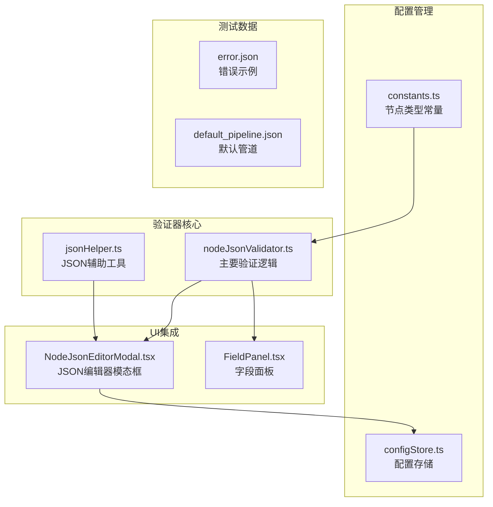
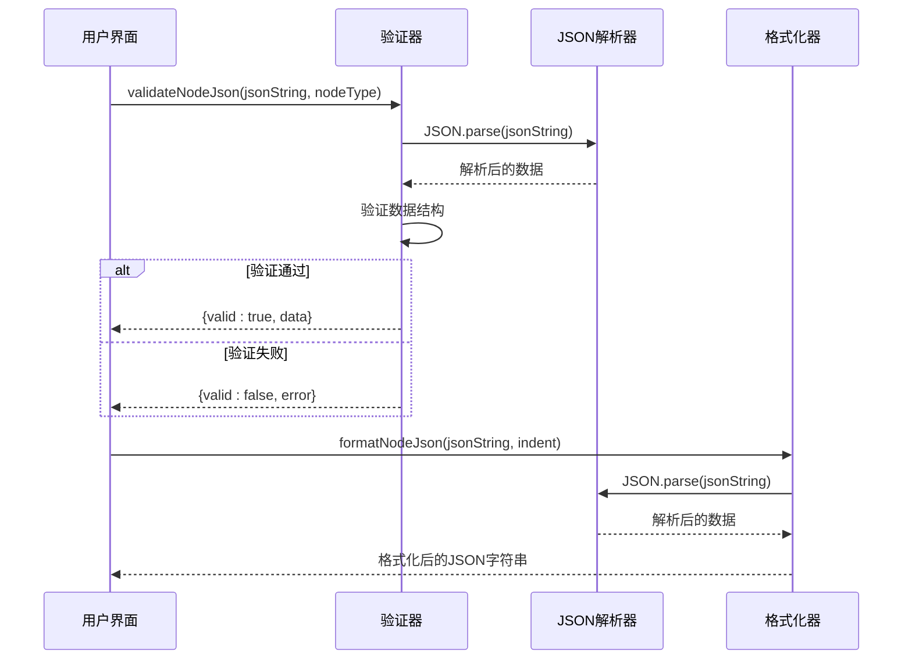
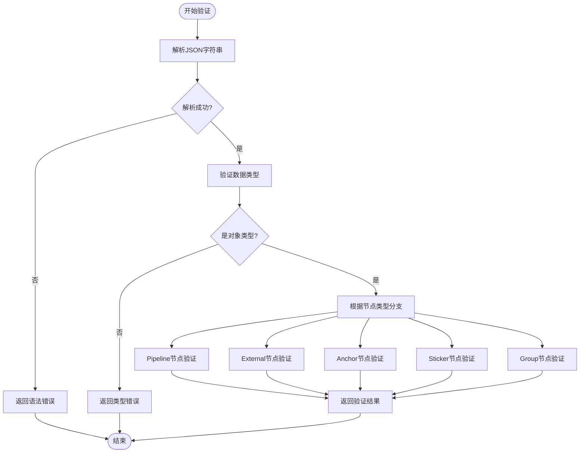
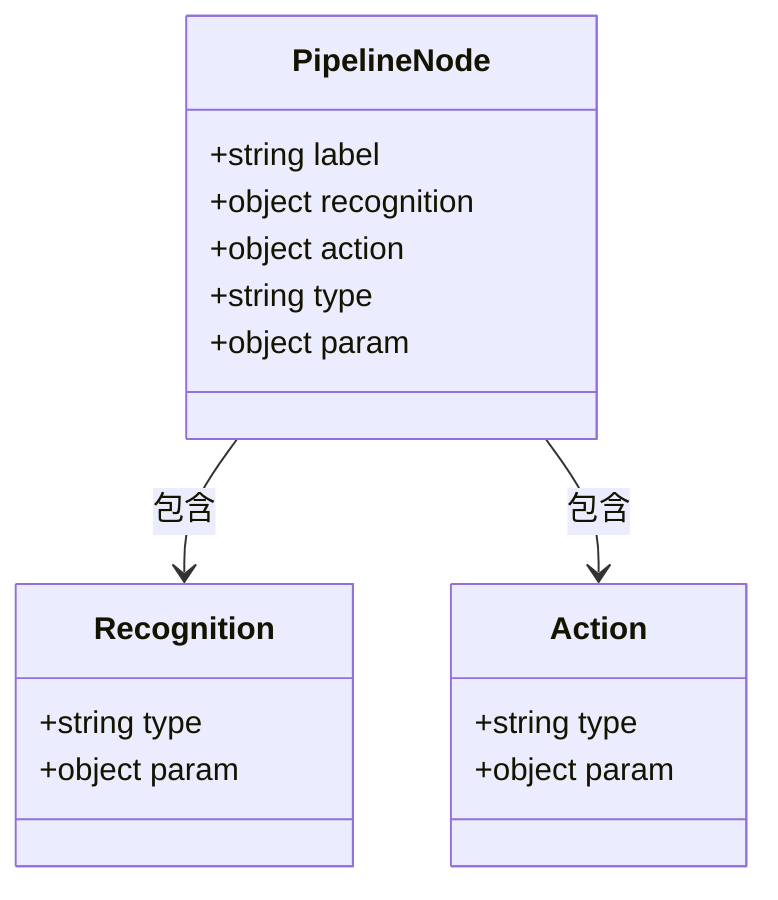
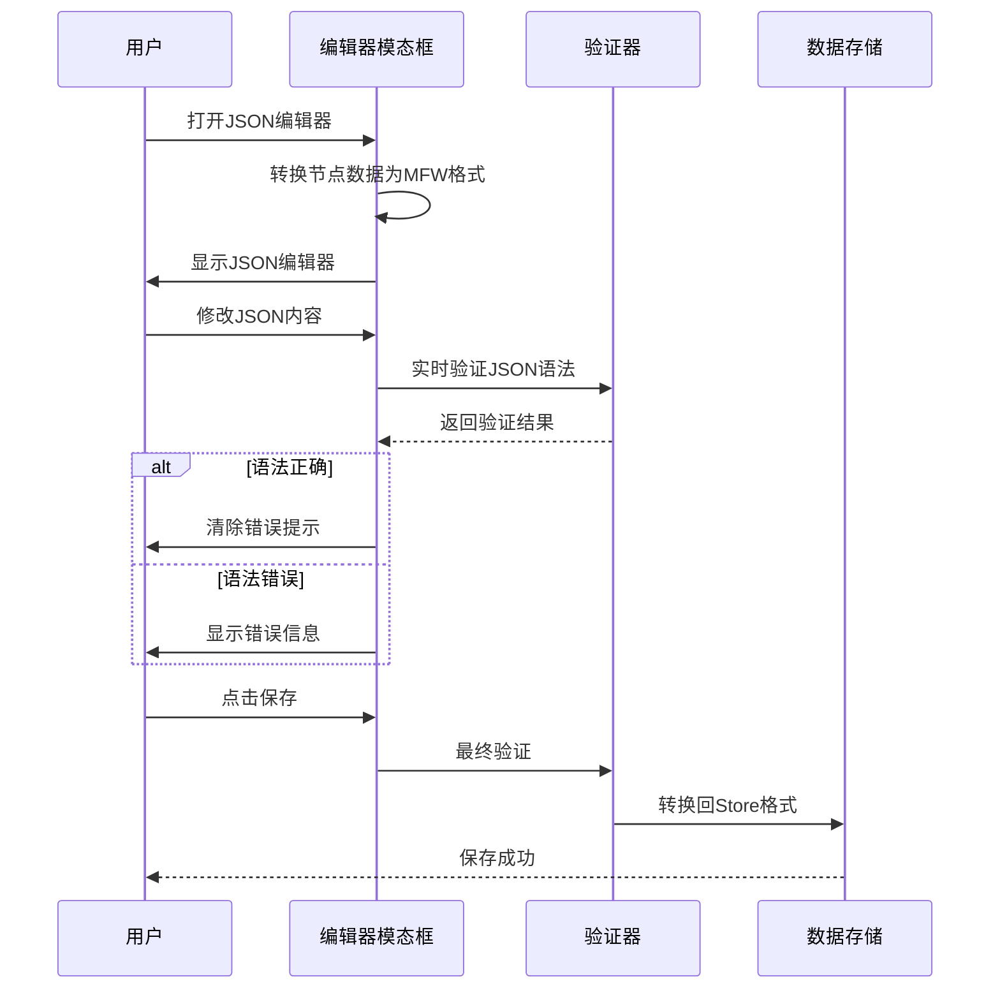
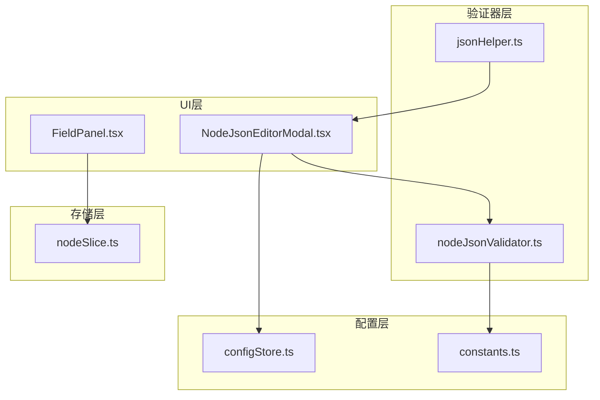

# 节点JSON验证器

<cite>
**本文档引用的文件**
- [nodeJsonValidator.ts](file://src/utils/nodeJsonValidator.ts)
- [NodeJsonEditorModal.tsx](file://src/components/modals/NodeJsonEditorModal.tsx)
- [constants.ts](file://src/components/flow/nodes/constants.ts)
- [configStore.ts](file://src/stores/configStore.ts)
- [jsonHelper.ts](file://src/utils/jsonHelper.ts)
- [nodeSlice.ts](file://src/stores/flow/slices/nodeSlice.ts)
- [FieldPanel.tsx](file://src/components/panels/main/FieldPanel.tsx)
- [error.json](file://LocalBridge/test-json/base/error.json)
- [default_pipeline.json](file://LocalBridge/test-json/base/default_pipeline.json)
</cite>

## 目录
1. [简介](#简介)
2. [项目结构](#项目结构)
3. [核心组件](#核心组件)
4. [架构概览](#架构概览)
5. [详细组件分析](#详细组件分析)
6. [依赖关系分析](#依赖关系分析)
7. [性能考虑](#性能考虑)
8. [故障排除指南](#故障排除指南)
9. [结论](#结论)

## 简介

节点JSON验证器是MAA Pipeline Editor中的一个关键组件，负责验证和格式化节点的JSON数据。该验证器确保节点数据符合预期的结构和类型要求，为整个工作流编辑器提供数据完整性保障。

该系统主要处理五种节点类型：Pipeline（管道）、External（外部）、Anchor（锚点）、Sticker（贴纸）和Group（分组）。每个节点类型都有特定的验证规则和必需字段。

## 项目结构

节点JSON验证器位于项目的前端代码结构中，主要分布在以下目录：



**图表来源**
- [nodeJsonValidator.ts:1-280](file://src/utils/nodeJsonValidator.ts#L1-L280)
- [NodeJsonEditorModal.tsx:1-320](file://src/components/modals/NodeJsonEditorModal.tsx#L1-L320)
- [constants.ts:1-47](file://src/components/flow/nodes/constants.ts#L1-L47)

**章节来源**
- [nodeJsonValidator.ts:1-280](file://src/utils/nodeJsonValidator.ts#L1-L280)
- [NodeJsonEditorModal.tsx:1-320](file://src/components/modals/NodeJsonEditorModal.tsx#L1-L320)
- [constants.ts:1-47](file://src/components/flow/nodes/constants.ts#L1-L47)

## 核心组件

### 主要验证接口

验证器提供了两个核心接口：

1. **validateNodeJson**: 主要验证函数，接受JSON字符串和节点类型
2. **formatNodeJson**: JSON格式化函数，提供缩进格式化

### 验证结果结构

```typescript
interface ValidationResult {
  valid: boolean;
  error?: string;
  data?: any;
}
```

### 节点类型枚举

系统支持五种节点类型：
- Pipeline（管道节点）
- External（外部节点）
- Anchor（锚点节点）
- Sticker（贴纸节点）
- Group（分组节点）

**章节来源**
- [nodeJsonValidator.ts:3-56](file://src/utils/nodeJsonValidator.ts#L3-L56)
- [constants.ts:14-20](file://src/components/flow/nodes/constants.ts#L14-L20)

## 架构概览

节点JSON验证器采用模块化设计，具有清晰的职责分离：



**图表来源**
- [nodeJsonValidator.ts:15-280](file://src/utils/nodeJsonValidator.ts#L15-L280)
- [NodeJsonEditorModal.tsx:121-198](file://src/components/modals/NodeJsonEditorModal.tsx#L121-L198)

## 详细组件分析

### 主验证流程

验证过程分为三个主要步骤：

1. **JSON格式验证**：使用标准JSON.parse()解析输入字符串
2. **数据类型验证**：确保解析后的数据是对象类型
3. **节点特定验证**：根据节点类型执行相应的字段验证



**图表来源**
- [nodeJsonValidator.ts:15-56](file://src/utils/nodeJsonValidator.ts#L15-L56)

### Pipeline节点验证规则

Pipeline节点是最复杂的节点类型，需要验证以下必需字段：



**图表来源**
- [nodeJsonValidator.ts:61-129](file://src/utils/nodeJsonValidator.ts#L61-L129)

### Sticker节点颜色验证

Sticker节点具有特定的颜色限制：

| 颜色类型 | 有效值 |
|---------|--------|
| Sticker节点 | yellow, green, blue, pink, purple |
| Group节点 | blue, green, purple, orange, gray |

**章节来源**
- [nodeJsonValidator.ts:214-223](file://src/utils/nodeJsonValidator.ts#L214-L223)
- [nodeJsonValidator.ts:255-264](file://src/utils/nodeJsonValidator.ts#L255-L264)

### JSON编辑器集成

NodeJsonEditorModal提供了完整的JSON编辑和验证体验：



**图表来源**
- [NodeJsonEditorModal.tsx:132-198](file://src/components/modals/NodeJsonEditorModal.tsx#L132-L198)

**章节来源**
- [NodeJsonEditorModal.tsx:121-198](file://src/components/modals/NodeJsonEditorModal.tsx#L121-L198)

## 依赖关系分析

### 组件间依赖关系



**图表来源**
- [nodeJsonValidator.ts:1](file://src/utils/nodeJsonValidator.ts#L1)
- [NodeJsonEditorModal.tsx:11-14](file://src/components/modals/NodeJsonEditorModal.tsx#L11-L14)

### 关键依赖点

1. **NodeTypeEnum依赖**：验证器依赖节点类型枚举进行分支判断
2. **配置存储依赖**：JSON编辑器依赖配置存储获取缩进设置
3. **数据存储依赖**：字段面板依赖节点存储进行数据操作

**章节来源**
- [nodeJsonValidator.ts:1](file://src/utils/nodeJsonValidator.ts#L1)
- [NodeJsonEditorModal.tsx:11-14](file://src/components/modals/NodeJsonEditorModal.tsx#L11-L14)
- [configStore.ts:169-200](file://src/stores/configStore.ts#L169-L200)

## 性能考虑

### 验证性能优化

1. **早期失败策略**：验证器采用早期失败策略，在发现错误时立即返回
2. **单次解析**：JSON解析只进行一次，避免重复解析开销
3. **类型检查优化**：使用typeof操作符进行快速类型检查

### 内存使用优化

1. **对象引用**：验证器返回原始数据对象的引用而非深拷贝
2. **错误信息缓存**：错误消息在验证过程中一次性构建
3. **配置缓存**：JSON缩进配置从配置存储中获取，避免重复计算

## 故障排除指南

### 常见验证错误

| 错误类型 | 触发条件 | 解决方案 |
|---------|---------|---------|
| JSON语法错误 | JSON.parse抛出异常 | 检查JSON格式，确保括号匹配 |
| 数据类型错误 | 非对象类型数据 | 确保数据是JSON对象 |
| 缺少必需字段 | Pipeline节点缺少label | 添加label字段 |
| 类型不匹配 | 字段类型不符合要求 | 确保字段类型正确（字符串、对象等） |
| 颜色值无效 | Sticker/Group节点颜色不在允许列表 | 使用允许的颜色值 |

### 调试技巧

1. **启用实时验证**：在JSON编辑器中启用实时语法验证
2. **检查配置**：确认JSON缩进配置正确
3. **查看错误详情**：利用详细的错误消息定位问题

**章节来源**
- [nodeJsonValidator.ts:21-28](file://src/utils/nodeJsonValidator.ts#L21-L28)
- [NodeJsonEditorModal.tsx:164-171](file://src/components/modals/NodeJsonEditorModal.tsx#L164-L171)

## 结论

节点JSON验证器为MAA Pipeline Editor提供了可靠的JSON数据验证机制。通过模块化的架构设计和清晰的职责分离，该验证器能够有效地确保节点数据的完整性和一致性。

主要特点包括：
- 支持五种节点类型的专门验证规则
- 提供实时JSON语法验证
- 具备友好的错误提示机制
- 与UI组件无缝集成
- 良好的性能表现和内存使用

该验证器为整个工作流编辑器的数据完整性提供了坚实的基础，确保用户能够创建和编辑高质量的节点配置。