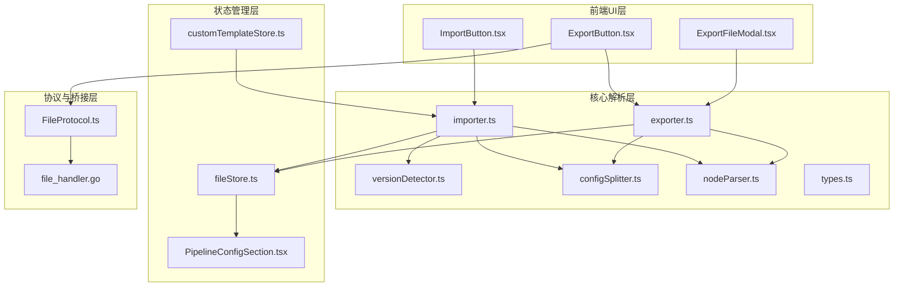
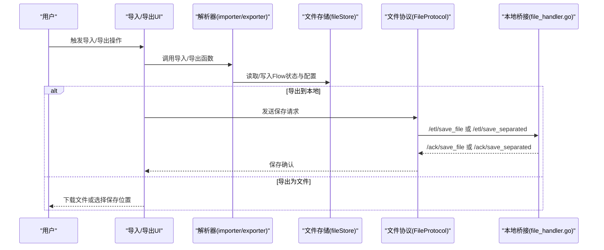
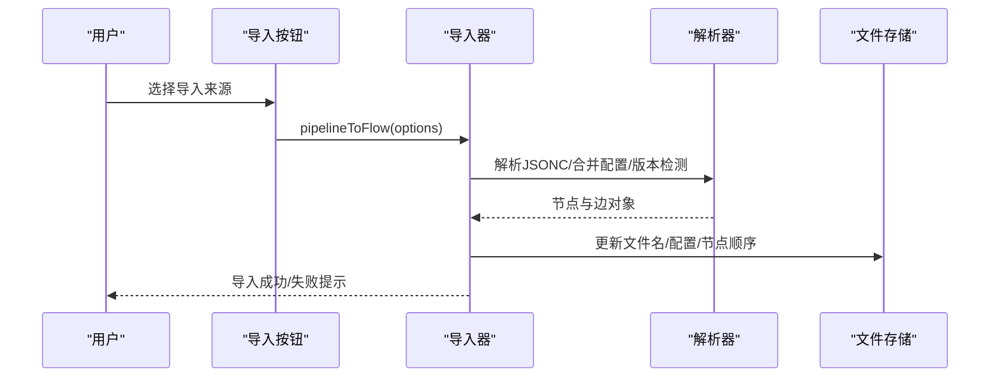
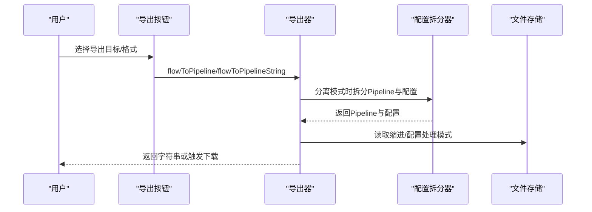
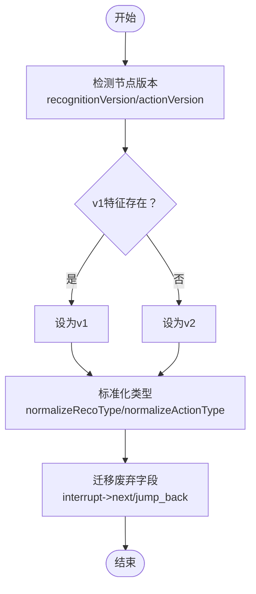
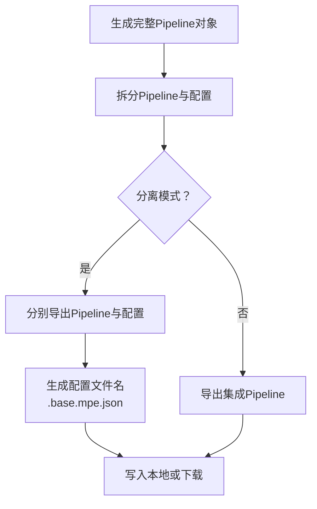
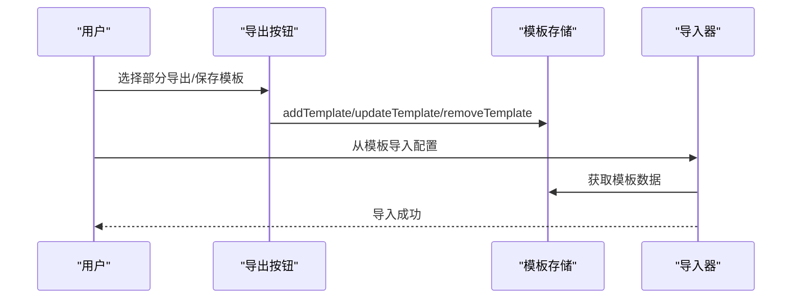
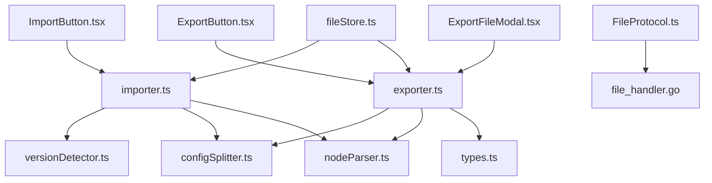

# 导入导出系统

<cite>
**本文档引用的文件**
- [importer.ts](file://src/core/parser/importer.ts)
- [exporter.ts](file://src/core/parser/exporter.ts)
- [versionDetector.ts](file://src/core/parser/versionDetector.ts)
- [configSplitter.ts](file://src/core/parser/configSplitter.ts)
- [nodeParser.ts](file://src/core/parser/nodeParser.ts)
- [types.ts](file://src/core/parser/types.ts)
- [ImportButton.tsx](file://src/components/panels/toolbar/ImportButton.tsx)
- [ExportButton.tsx](file://src/components/panels/toolbar/ExportButton.tsx)
- [ExportFileModal.tsx](file://src/components/modals/ExportFileModal.tsx)
- [FileProtocol.ts](file://src/services/protocols/FileProtocol.ts)
- [file_handler.go](file://LocalBridge/internal/protocol/file/file_handler.go)
- [fileStore.ts](file://src/stores/fileStore.ts)
- [customTemplateStore.ts](file://src/stores/customTemplateStore.ts)
- [PipelineConfigSection.tsx](file://src/components/panels/config/PipelineConfigSection.tsx)
</cite>

## 目录
1. [简介](#简介)
2. [项目结构](#项目结构)
3. [核心组件](#核心组件)
4. [架构总览](#架构总览)
5. [详细组件分析](#详细组件分析)
6. [依赖关系分析](#依赖关系分析)
7. [性能考虑](#性能考虑)
8. [故障排除指南](#故障排除指南)
9. [结论](#结论)
10. [附录](#附录)

## 简介
本文件面向MaaPipelineEditor的导入导出系统，系统支持将可视化画布内容编译为Pipeline格式并导出，同时支持从外部文件或剪贴板导入。系统采用统一的解析与导出管线，支持多种导出格式（JSON、JSONC），并提供分离式配置导出能力。导入流程包含格式检测、数据验证、错误处理与兼容性转换；导出流程涵盖格式选择、缩进配置、分离导出、路径处理等。系统还具备版本检测与迁移机制、批量操作能力（部分导出、模板应用）、以及最佳实践与性能优化建议。

## 项目结构
导入导出系统主要分布在以下层次：
- 前端UI层：工具栏按钮与导出模态框负责用户交互与参数收集
- 核心解析层：导入/导出解析器、版本检测器、配置拆分器、节点解析器
- 状态管理层：文件状态、配置状态、模板状态
- 协议与桥接层：前端协议处理器与本地桥Go服务端

**图表来源**
- [ImportButton.tsx:1-235](file://src/components/panels/toolbar/ImportButton.tsx#L1-L235)
- [ExportButton.tsx:1-316](file://src/components/panels/toolbar/ExportButton.tsx#L1-L316)
- [ExportFileModal.tsx:1-302](file://src/components/modals/ExportFileModal.tsx#L1-L302)
- [importer.ts:1-508](file://src/core/parser/importer.ts#L1-L508)
- [exporter.ts:1-244](file://src/core/parser/exporter.ts#L1-L244)
- [versionDetector.ts:1-149](file://src/core/parser/versionDetector.ts#L1-L149)
- [configSplitter.ts:1-486](file://src/core/parser/configSplitter.ts#L1-L486)
- [nodeParser.ts:1-372](file://src/core/parser/nodeParser.ts#L1-L372)
- [types.ts:1-107](file://src/core/parser/types.ts#L1-L107)
- [fileStore.ts:1-800](file://src/stores/fileStore.ts#L1-L800)
- [FileProtocol.ts:1-607](file://src/services/protocols/FileProtocol.ts#L1-L607)
- [file_handler.go:1-247](file://LocalBridge/internal/protocol/file/file_handler.go#L1-L247)

**章节来源**
- [ImportButton.tsx:1-235](file://src/components/panels/toolbar/ImportButton.tsx#L1-L235)
- [ExportButton.tsx:1-316](file://src/components/panels/toolbar/ExportButton.tsx#L1-L316)
- [ExportFileModal.tsx:1-302](file://src/components/modals/ExportFileModal.tsx#L1-L302)
- [importer.ts:1-508](file://src/core/parser/importer.ts#L1-L508)
- [exporter.ts:1-244](file://src/core/parser/exporter.ts#L1-L244)
- [versionDetector.ts:1-149](file://src/core/parser/versionDetector.ts#L1-L149)
- [configSplitter.ts:1-486](file://src/core/parser/configSplitter.ts#L1-L486)
- [nodeParser.ts:1-372](file://src/core/parser/nodeParser.ts#L1-L372)
- [types.ts:1-107](file://src/core/parser/types.ts#L1-L107)
- [fileStore.ts:1-800](file://src/stores/fileStore.ts#L1-L800)
- [FileProtocol.ts:1-607](file://src/services/protocols/FileProtocol.ts#L1-L607)
- [file_handler.go:1-247](file://LocalBridge/internal/protocol/file/file_handler.go#L1-L247)

## 核心组件
- 导入器（pipelineToFlow）：负责从剪贴板或文件读取Pipeline内容，解析为Flow节点与边，并进行版本迁移、配置合并、位置信息恢复与自动布局。
- 导出器（flowToPipeline）：将Flow节点与边转换为Pipeline对象，支持配置导出、分离导出、连接引用处理、锚点与回跳标记导出。
- 版本检测器：识别节点recognition/action字段版本，进行类型标准化与兼容性转换。
- 配置拆分器：支持分离模式下的Pipeline与配置拆分与合并，维护节点位置与样式信息。
- 节点解析器：将Flow节点数据转换为导出格式，支持协议版本切换、默认值导出策略、额外字段处理。
- 文件协议处理器：负责与本地服务通信，处理文件列表、内容推送、保存确认、创建文件等。
- 文件存储：管理文件列表、当前文件、配置、保存/加载、本地缓存与视口恢复。
- 导入/导出UI：工具栏按钮与导出模态框，提供格式选择、目标选择、文件名预览、下载与保存到本地等能力。

**章节来源**
- [importer.ts:155-508](file://src/core/parser/importer.ts#L155-L508)
- [exporter.ts:42-244](file://src/core/parser/exporter.ts#L42-L244)
- [versionDetector.ts:23-149](file://src/core/parser/versionDetector.ts#L23-L149)
- [configSplitter.ts:21-448](file://src/core/parser/configSplitter.ts#L21-L448)
- [nodeParser.ts:21-372](file://src/core/parser/nodeParser.ts#L21-L372)
- [FileProtocol.ts:44-607](file://src/services/protocols/FileProtocol.ts#L44-L607)
- [fileStore.ts:517-778](file://src/stores/fileStore.ts#L517-L778)
- [ExportFileModal.tsx:16-302](file://src/components/modals/ExportFileModal.tsx#L16-L302)

## 架构总览
导入导出系统采用前后端分离的架构：
- 前端负责用户交互与数据展示，调用解析器进行导入/导出
- 本地桥接服务负责与操作系统文件系统的交互，处理文件读写、保存确认
- 协议层封装消息路由与确认机制，确保导入导出的可靠性

**图表来源**
- [ImportButton.tsx:29-129](file://src/components/panels/toolbar/ImportButton.tsx#L29-L129)
- [ExportButton.tsx:46-125](file://src/components/panels/toolbar/ExportButton.tsx#L46-L125)
- [ExportFileModal.tsx:142-188](file://src/components/modals/ExportFileModal.tsx#L142-L188)
- [FileProtocol.ts:364-417](file://src/services/protocols/FileProtocol.ts#L364-L417)
- [file_handler.go:67-208](file://LocalBridge/internal/protocol/file/file_handler.go#L67-L208)

**章节来源**
- [ImportButton.tsx:1-235](file://src/components/panels/toolbar/ImportButton.tsx#L1-L235)
- [ExportButton.tsx:1-316](file://src/components/panels/toolbar/ExportButton.tsx#L1-L316)
- [ExportFileModal.tsx:1-302](file://src/components/modals/ExportFileModal.tsx#L1-L302)
- [FileProtocol.ts:1-607](file://src/services/protocols/FileProtocol.ts#L1-L607)
- [file_handler.go:1-247](file://LocalBridge/internal/protocol/file/file_handler.go#L1-L247)

## 详细组件分析

### 导入流程
导入流程从剪贴板或文件读取内容，经过解析与迁移，最终渲染到画布并更新文件配置。

关键步骤：
- 输入预处理：去除空内容、提取原始键顺序、合并外部配置
- 配置解析：提取filename/prefix等配置信息
- 版本迁移：将旧版字段迁移到新版格式（如interrupt到next/jump_back）
- 节点解析：识别外部节点、锚点、便签、分组节点，解析recognition/action字段
- 边连接解析：根据next/on_error构建连接，支持锚点与回跳标记
- 布局与历史：自动布局、初始化历史记录、更新文件配置

**图表来源**
- [importer.ts:155-508](file://src/core/parser/importer.ts#L155-L508)
- [versionDetector.ts:23-149](file://src/core/parser/versionDetector.ts#L23-L149)
- [configSplitter.ts:151-448](file://src/core/parser/configSplitter.ts#L151-L448)

**章节来源**
- [importer.ts:155-508](file://src/core/parser/importer.ts#L155-L508)
- [versionDetector.ts:23-149](file://src/core/parser/versionDetector.ts#L23-L149)
- [configSplitter.ts:151-448](file://src/core/parser/configSplitter.ts#L151-L448)

### 导出流程
导出流程将画布内容转换为Pipeline对象，支持配置导出、分离导出与格式选择。

关键步骤：
- 节点导出：按顺序导出普通节点与特殊节点（外部/锚点/便签/分组）
- 连接导出：根据源句柄类型生成next/on_error引用，支持锚点与回跳标记
- 配置导出：过滤运行时字段，标准化视口，附加版本与文件名
- 分离导出：将Pipeline与配置分别导出为独立文件
- 格式选择：支持JSON/JSONC两种格式

**图表来源**
- [exporter.ts:42-244](file://src/core/parser/exporter.ts#L42-L244)
- [configSplitter.ts:21-141](file://src/core/parser/configSplitter.ts#L21-L141)
- [ExportFileModal.tsx:102-139](file://src/components/modals/ExportFileModal.tsx#L102-L139)

**章节来源**
- [exporter.ts:42-244](file://src/core/parser/exporter.ts#L42-L244)
- [configSplitter.ts:21-141](file://src/core/parser/configSplitter.ts#L21-L141)
- [ExportFileModal.tsx:102-139](file://src/components/modals/ExportFileModal.tsx#L102-L139)

### 版本检测与迁移
系统支持识别recognition/action字段的版本，并进行类型标准化与兼容性转换。

**图表来源**
- [versionDetector.ts:23-149](file://src/core/parser/versionDetector.ts#L23-L149)
- [importer.ts:47-149](file://src/core/parser/importer.ts#L47-L149)

**章节来源**
- [versionDetector.ts:23-149](file://src/core/parser/versionDetector.ts#L23-L149)
- [importer.ts:47-149](file://src/core/parser/importer.ts#L47-L149)

### 分离导出与配置管理
分离导出模式将Pipeline与配置分别存储，便于版本控制与团队协作。

**图表来源**
- [configSplitter.ts:21-141](file://src/core/parser/configSplitter.ts#L21-L141)
- [fileStore.ts:606-778](file://src/stores/fileStore.ts#L606-L778)

**章节来源**
- [configSplitter.ts:21-141](file://src/core/parser/configSplitter.ts#L21-L141)
- [fileStore.ts:606-778](file://src/stores/fileStore.ts#L606-L778)

### 批量操作与模板应用
系统支持部分导出、模板保存与导入，提升批量处理效率。

**图表来源**
- [ExportButton.tsx:67-75](file://src/components/panels/toolbar/ExportButton.tsx#L67-L75)
- [customTemplateStore.ts:96-210](file://src/stores/customTemplateStore.ts#L96-L210)
- [ImportButton.tsx:45-65](file://src/components/panels/toolbar/ImportButton.tsx#L45-L65)

**章节来源**
- [ExportButton.tsx:67-75](file://src/components/panels/toolbar/ExportButton.tsx#L67-L75)
- [customTemplateStore.ts:96-210](file://src/stores/customTemplateStore.ts#L96-L210)
- [ImportButton.tsx:45-65](file://src/components/panels/toolbar/ImportButton.tsx#L45-L65)

## 依赖关系分析
导入导出系统的关键依赖关系如下：

**图表来源**
- [importer.ts:1-508](file://src/core/parser/importer.ts#L1-L508)
- [exporter.ts:1-244](file://src/core/parser/exporter.ts#L1-L244)
- [versionDetector.ts:1-149](file://src/core/parser/versionDetector.ts#L1-L149)
- [configSplitter.ts:1-486](file://src/core/parser/configSplitter.ts#L1-L486)
- [nodeParser.ts:1-372](file://src/core/parser/nodeParser.ts#L1-L372)
- [types.ts:1-107](file://src/core/parser/types.ts#L1-L107)
- [ImportButton.tsx:1-235](file://src/components/panels/toolbar/ImportButton.tsx#L1-L235)
- [ExportButton.tsx:1-316](file://src/components/panels/toolbar/ExportButton.tsx#L1-L316)
- [ExportFileModal.tsx:1-302](file://src/components/modals/ExportFileModal.tsx#L1-L302)
- [fileStore.ts:1-800](file://src/stores/fileStore.ts#L1-L800)
- [FileProtocol.ts:1-607](file://src/services/protocols/FileProtocol.ts#L1-L607)
- [file_handler.go:1-247](file://LocalBridge/internal/protocol/file/file_handler.go#L1-L247)

**章节来源**
- [importer.ts:1-508](file://src/core/parser/importer.ts#L1-L508)
- [exporter.ts:1-244](file://src/core/parser/exporter.ts#L1-L244)
- [versionDetector.ts:1-149](file://src/core/parser/versionDetector.ts#L1-L149)
- [configSplitter.ts:1-486](file://src/core/parser/configSplitter.ts#L1-L486)
- [nodeParser.ts:1-372](file://src/core/parser/nodeParser.ts#L1-L372)
- [types.ts:1-107](file://src/core/parser/types.ts#L1-L107)
- [ImportButton.tsx:1-235](file://src/components/panels/toolbar/ImportButton.tsx#L1-L235)
- [ExportButton.tsx:1-316](file://src/components/panels/toolbar/ExportButton.tsx#L1-L316)
- [ExportFileModal.tsx:1-302](file://src/components/modals/ExportFileModal.tsx#L1-L302)
- [fileStore.ts:1-800](file://src/stores/fileStore.ts#L1-L800)
- [FileProtocol.ts:1-607](file://src/services/protocols/FileProtocol.ts#L1-L607)
- [file_handler.go:1-247](file://LocalBridge/internal/protocol/file/file_handler.go#L1-L247)

## 性能考虑
- 导出缩进配置：通过配置项控制JSON缩进，平衡可读性与文件大小
- 键顺序保持：导入时提取顶层键顺序，导出时按原顺序输出，减少diff
- 分离导出：将Pipeline与配置分离，便于增量更新与版本控制
- 自动布局：在无位置信息时自动布局，避免手动调整
- 本地缓存：使用localStorage缓存文件与配置，减少重复加载
- 保存确认：通过协议确认机制避免丢失保存结果

**章节来源**
- [PipelineConfigSection.tsx:213-239](file://src/components/panels/config/PipelineConfigSection.tsx#L213-L239)
- [importer.ts:169-211](file://src/core/parser/importer.ts#L169-L211)
- [exporter.ts:75-81](file://src/core/parser/exporter.ts#L75-L81)
- [fileStore.ts:227-268](file://src/stores/fileStore.ts#L227-L268)

## 故障排除指南
- 导入失败：检查Pipeline格式是否正确、版本是否一致；查看控制台错误信息
- 导出失败：检查节点字段是否符合格式，是否存在重复节点名；查看通知错误信息
- 保存失败：确认本地服务已连接，检查保存确认回调；查看协议确认状态
- 文件名冲突：导入时会检测重复文件名并给出警告；请使用不同名称
- 本地存储不足：当localStorage配额不足时会提示清理或减少文件数量

**章节来源**
- [importer.ts:498-506](file://src/core/parser/importer.ts#L498-L506)
- [exporter.ts:201-209](file://src/core/parser/exporter.ts#L201-L209)
- [FileProtocol.ts:237-267](file://src/services/protocols/FileProtocol.ts#L237-L267)
- [fileStore.ts:352-360](file://src/stores/fileStore.ts#L352-L360)

## 结论
MaaPipelineEditor的导入导出系统通过统一的解析与导出管线，实现了对Pipeline格式的完整支持，并提供了灵活的导出选项与可靠的本地服务集成。系统具备完善的版本检测与迁移机制、分离导出能力、批量操作支持与模板应用，能够满足从个人使用到团队协作的多样化需求。遵循本文档的最佳实践与性能优化建议，可进一步提升导入导出的稳定性与效率。

## 附录
- 支持的导出格式：JSON、JSONC
- 导出选项：格式选择、缩进配置、分离导出、路径处理
- 版本检测：recognition/action字段版本识别与类型标准化
- 迁移机制：废弃字段迁移、向后兼容处理
- 批量操作：部分导出、模板应用、批量验证
- 最佳实践：保持键顺序、合理使用分离导出、启用自动布局、定期清理本地缓存