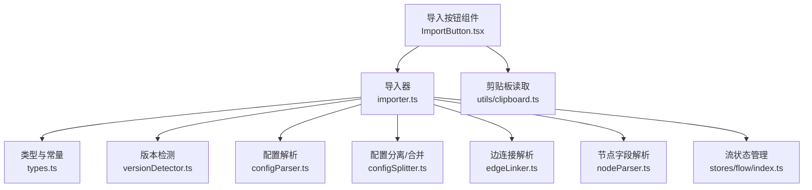
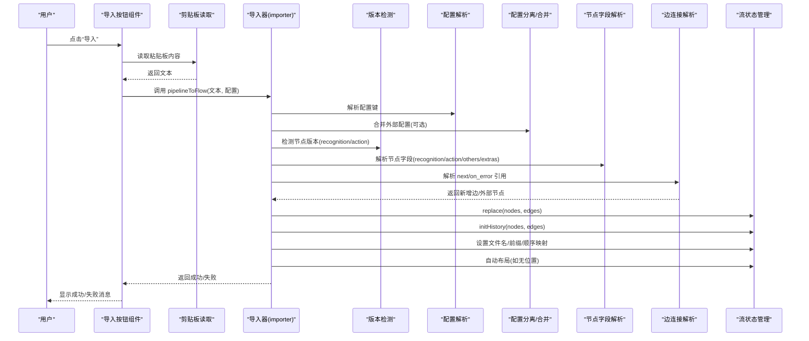
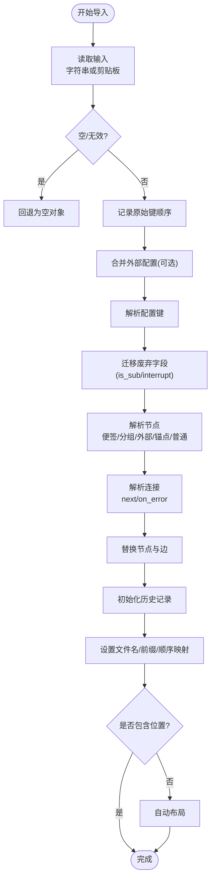
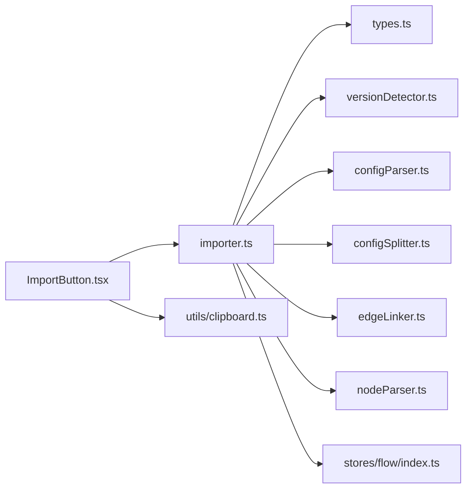

# 导入流程

<cite>
**本文档引用的文件**
- [src/components/panels/toolbar/ImportButton.tsx](file://src/components/panels/toolbar/ImportButton.tsx)
- [src/core/parser/importer.ts](file://src/core/parser/importer.ts)
- [src/core/parser/index.ts](file://src/core/parser/index.ts)
- [src/core/parser/types.ts](file://src/core/parser/types.ts)
- [src/core/parser/versionDetector.ts](file://src/core/parser/versionDetector.ts)
- [src/core/parser/configParser.ts](file://src/core/parser/configParser.ts)
- [src/core/parser/configSplitter.ts](file://src/core/parser/configSplitter.ts)
- [src/core/parser/edgeLinker.ts](file://src/core/parser/edgeLinker.ts)
- [src/core/parser/nodeParser.ts](file://src/core/parser/nodeParser.ts)
- [src/stores/flow/index.ts](file://src/stores/flow/index.ts)
- [src/utils/clipboard.ts](file://src/utils/clipboard.ts)
</cite>

## 目录
1. [简介](#简介)
2. [项目结构](#项目结构)
3. [核心组件](#核心组件)
4. [架构总览](#架构总览)
5. [详细组件分析](#详细组件分析)
6. [依赖分析](#依赖分析)
7. [性能考虑](#性能考虑)
8. [故障排查指南](#故障排查指南)
9. [结论](#结论)
10. [附录](#附录)

## 简介
本文件系统性阐述 MaaPipelineEditor 的导入流程，覆盖从用户触发到最终在画布呈现的全过程。重点包括：文件读取与格式检测、数据解析与节点创建、连接建立、数据验证与兼容性处理、错误处理策略、批量导入能力、性能优化与最佳实践，以及常见问题排查。

## 项目结构
导入流程主要由前端 UI 触发、解析器模块处理、状态管理更新与自动布局组成。核心文件分布如下：
- UI 触发与交互：ImportButton.tsx
- 导入主流程：importer.ts
- 类型与常量：types.ts
- 版本检测与规范化：versionDetector.ts
- 配置解析与分离/合并：configParser.ts、configSplitter.ts
- 连接解析与外部节点创建：edgeLinker.ts
- 节点字段解析：nodeParser.ts
- 流状态与节点/边管理：stores/flow/index.ts
- 剪贴板读取：utils/clipboard.ts

图表来源
- [src/components/panels/toolbar/ImportButton.tsx:19-234](file://src/components/panels/toolbar/ImportButton.tsx#L19-L234)
- [src/core/parser/importer.ts:155-507](file://src/core/parser/importer.ts#L155-L507)
- [src/core/parser/types.ts:15-107](file://src/core/parser/types.ts#L15-L107)
- [src/core/parser/versionDetector.ts:23-149](file://src/core/parser/versionDetector.ts#L23-L149)
- [src/core/parser/configParser.ts:47-69](file://src/core/parser/configParser.ts#L47-L69)
- [src/core/parser/configSplitter.ts:151-448](file://src/core/parser/configSplitter.ts#L151-L448)
- [src/core/parser/edgeLinker.ts:91-162](file://src/core/parser/edgeLinker.ts#L91-L162)
- [src/core/parser/nodeParser.ts:322-372](file://src/core/parser/nodeParser.ts#L322-L372)
- [src/stores/flow/index.ts:16-24](file://src/stores/flow/index.ts#L16-L24)
- [src/utils/clipboard.ts:45-62](file://src/utils/clipboard.ts#L45-L62)

章节来源
- [src/components/panels/toolbar/ImportButton.tsx:19-234](file://src/components/panels/toolbar/ImportButton.tsx#L19-L234)
- [src/core/parser/importer.ts:155-507](file://src/core/parser/importer.ts#L155-L507)

## 核心组件
- 导入按钮组件：提供从粘贴板或文件导入的入口，支持多种导入模式（粘贴板+Pipeline、文件+Pipeline、粘贴板+配置、文件+配置），并在导入后给出用户反馈。
- 导入器（pipelineToFlow）：核心流程实现，负责读取输入、解析配置、迁移废弃字段、解析节点、建立连接、更新状态与布局。
- 版本检测器：识别 recognition/action 字段的版本（v1/v2），并进行类型标准化。
- 配置解析器与分离/合并器：解析/合并配置标记，支持分离存储模式与文件名/前缀等元信息。
- 边连接解析器：解析 next/on_error 引用，支持外部节点与锚点节点的自动创建。
- 节点字段解析器：将 JSON 字段映射到 Flow 节点的数据域，并处理 v1 参数平铺。
- 流状态管理：统一替换节点与边、初始化历史、更新文件配置、自动布局。
- 剪贴板辅助：封装读取/写入粘贴板的操作与错误提示。

章节来源
- [src/components/panels/toolbar/ImportButton.tsx:19-234](file://src/components/panels/toolbar/ImportButton.tsx#L19-L234)
- [src/core/parser/importer.ts:155-507](file://src/core/parser/importer.ts#L155-L507)
- [src/core/parser/versionDetector.ts:23-149](file://src/core/parser/versionDetector.ts#L23-L149)
- [src/core/parser/configParser.ts:47-69](file://src/core/parser/configParser.ts#L47-L69)
- [src/core/parser/configSplitter.ts:151-448](file://src/core/parser/configSplitter.ts#L151-L448)
- [src/core/parser/edgeLinker.ts:91-162](file://src/core/parser/edgeLinker.ts#L91-L162)
- [src/core/parser/nodeParser.ts:322-372](file://src/core/parser/nodeParser.ts#L322-L372)
- [src/stores/flow/index.ts:16-24](file://src/stores/flow/index.ts#L16-L24)
- [src/utils/clipboard.ts:45-62](file://src/utils/clipboard.ts#L45-L62)

## 架构总览
导入流程的端到端序列如下：

图表来源
- [src/components/panels/toolbar/ImportButton.tsx:29-38](file://src/components/panels/toolbar/ImportButton.tsx#L29-L38)
- [src/core/parser/importer.ts:155-507](file://src/core/parser/importer.ts#L155-L507)
- [src/core/parser/versionDetector.ts:23-149](file://src/core/parser/versionDetector.ts#L23-L149)
- [src/core/parser/configParser.ts:47-69](file://src/core/parser/configParser.ts#L47-L69)
- [src/core/parser/configSplitter.ts:151-448](file://src/core/parser/configSplitter.ts#L151-L448)
- [src/core/parser/nodeParser.ts:322-372](file://src/core/parser/nodeParser.ts#L322-L372)
- [src/core/parser/edgeLinker.ts:91-162](file://src/core/parser/edgeLinker.ts#L91-L162)
- [src/stores/flow/index.ts:16-24](file://src/stores/flow/index.ts#L16-L24)

## 详细组件分析

### 导入按钮与入口
- 支持四种导入模式：粘贴板+Pipeline、文件+Pipeline、粘贴板+配置、文件+配置。
- 从粘贴板读取时，若内容为空或仅含空白/特殊值，会回退为空对象，避免解析失败。
- 导入成功/失败分别通过消息提示反馈给用户；失败时弹窗并打印控制台错误。

章节来源
- [src/components/panels/toolbar/ImportButton.tsx:19-234](file://src/components/panels/toolbar/ImportButton.tsx#L19-L234)
- [src/utils/clipboard.ts:45-62](file://src/utils/clipboard.ts#L45-L62)

### 导入主流程（pipelineToFlow）
- 输入处理：支持传入字符串或从剪贴板读取；对空/无效输入进行安全兜底。
- 键顺序保留：使用 JSONC 解析器遍历顶层键，记录原始顺序，用于后续合并配置时保持输出顺序。
- 配置合并：可选地将外部 MPE 配置与 Pipeline 合并，再进行解析。
- 废弃字段迁移：针对 v5.1 的 is_sub/interrupt 等字段进行迁移与引用修正。
- 节点解析：识别并解析便签/分组/外部/锚点/普通节点，剥离配置标记，解析字段，补全缺失参数。
- 连接建立：解析 next/on_error，解析引用（支持字符串与对象形式，支持 [Anchor]/[JumpBack] 前缀），必要时创建外部/锚点节点。
- 状态更新：替换节点与边、初始化历史、设置文件名/前缀/顺序映射。
- 自动布局：若未包含位置信息，则进行自动布局。

图表来源
- [src/core/parser/importer.ts:155-507](file://src/core/parser/importer.ts#L155-L507)

章节来源
- [src/core/parser/importer.ts:155-507](file://src/core/parser/importer.ts#L155-L507)

### 版本检测与兼容性
- 节点版本检测：根据 recognition/action 字段形态（字符串或对象）及是否存在 v1 特征字段判断版本。
- 类型标准化：对识别/动作类型进行大小写归一化与合法性校验，非法类型抛出错误。
- v1/v2 参数迁移：识别/动作字段在 v1 中可能以平铺参数形式存在，解析时映射到对象结构并做兼容处理。

章节来源
- [src/core/parser/versionDetector.ts:23-149](file://src/core/parser/versionDetector.ts#L23-L149)
- [src/core/parser/nodeParser.ts:267-311](file://src/core/parser/nodeParser.ts#L267-L311)

### 配置解析与分离/合并
- 配置键识别：支持新旧配置标记键，兼容 $__mpe_config、__mpe_config、__yamaape_config。
- 配置标记解析：兼容 $__mpe_code/__mpe_code/__yamaape 三种标记形式。
- 分离存储：将节点配置（位置、方向）与节点数据分离，便于独立管理。
- 合并输出：按原始键顺序合并节点与配置，确保输出顺序稳定；支持外部/锚点/便签/分组节点的特殊键拼接。

章节来源
- [src/core/parser/configParser.ts:47-69](file://src/core/parser/configParser.ts#L47-L69)
- [src/core/parser/configSplitter.ts:151-448](file://src/core/parser/configSplitter.ts#L151-L448)

### 边连接解析与外部节点创建
- 引用解析：支持字符串与对象两种形式，字符串可带 [Anchor]/[JumpBack] 前缀；对象可携带 jump_back/anchor 属性。
- 目标节点不存在时：自动创建外部节点或锚点节点，保证连接完整性。
- 目标入口类型：根据 jump_back 属性选择不同入口类型，确保连线语义正确。

章节来源
- [src/core/parser/edgeLinker.ts:47-162](file://src/core/parser/edgeLinker.ts#L47-L162)

### 节点字段解析
- 字段映射：识别/动作/其他字段按 schema 映射到节点数据域；未识别字段进入 extras。
- v1 参数平铺：在 v1 模式下，识别/动作参数以平铺键形式存在，解析时归并到 param 对象。
- 默认值补全：对缺失的 param 对象进行补全，保证节点数据结构一致性。

章节来源
- [src/core/parser/nodeParser.ts:322-372](file://src/core/parser/nodeParser.ts#L322-L372)

### 流状态管理与自动布局
- 替换与初始化：导入完成后统一替换节点与边，初始化历史记录。
- 文件配置：设置文件名、前缀、顺序映射等。
- 自动布局：若未包含位置信息则进行自动布局，提升首次导入体验。

章节来源
- [src/stores/flow/index.ts:16-24](file://src/stores/flow/index.ts#L16-L24)

## 依赖分析
导入流程的模块间依赖关系如下：

图表来源
- [src/components/panels/toolbar/ImportButton.tsx:19-234](file://src/components/panels/toolbar/ImportButton.tsx#L19-L234)
- [src/core/parser/importer.ts:155-507](file://src/core/parser/importer.ts#L155-L507)
- [src/core/parser/types.ts:15-107](file://src/core/parser/types.ts#L15-L107)
- [src/core/parser/versionDetector.ts:23-149](file://src/core/parser/versionDetector.ts#L23-L149)
- [src/core/parser/configParser.ts:47-69](file://src/core/parser/configParser.ts#L47-L69)
- [src/core/parser/configSplitter.ts:151-448](file://src/core/parser/configSplitter.ts#L151-L448)
- [src/core/parser/edgeLinker.ts:91-162](file://src/core/parser/edgeLinker.ts#L91-L162)
- [src/core/parser/nodeParser.ts:322-372](file://src/core/parser/nodeParser.ts#L322-L372)
- [src/stores/flow/index.ts:16-24](file://src/stores/flow/index.ts#L16-L24)
- [src/utils/clipboard.ts:45-62](file://src/utils/clipboard.ts#L45-L62)

章节来源
- [src/core/parser/index.ts:19-85](file://src/core/parser/index.ts#L19-L85)

## 性能考虑
- 键顺序保留：通过遍历顶层对象记录原始键顺序，避免不必要的重排，有助于保持输出稳定性与可比性。
- 延迟布局：仅在未包含位置信息时进行自动布局，减少不必要的计算开销。
- 懒创建外部节点：仅在引用缺失时创建外部/锚点节点，避免冗余节点。
- JSONC 解析：使用高效解析器处理 JSONC，支持尾随逗号等增强语法，降低解析失败率。
- 批量导入建议：对于多文件场景，建议先在内存中逐个解析并收集错误，最后一次性提交到状态管理，减少多次渲染与布局。

## 故障排查指南
- 导入失败弹窗与控制台错误：导入器在捕获异常时会弹出错误对话框并打印详细错误，建议优先查看控制台日志定位问题。
- 粘贴板读取失败：若读取失败，组件会弹出通知并返回空字符串，需确认浏览器权限与内容有效性。
- 节点数据结构损坏：字段面板对节点数据进行基础校验与修复，若仍报错，检查 JSON 结构与字段完整性。
- 重名节点：导入后会检查节点标签重复并记录错误，需修改重复标签。
- 连接引用异常：若 next/on_error 引用的目标节点不存在，会自动创建外部/锚点节点；若引用格式不规范（如缺少前缀或属性），请参考引用解析规则修正。
- 版本不一致：识别/动作类型大小写不一致或非法类型会导致标准化失败，需统一为预定义类型之一。

章节来源
- [src/core/parser/importer.ts:498-507](file://src/core/parser/importer.ts#L498-L507)
- [src/utils/clipboard.ts:45-62](file://src/utils/clipboard.ts#L45-L62)
- [src/components/panels/main/FieldPanel.tsx:54-101](file://src/components/panels/main/FieldPanel.tsx#L54-L101)
- [src/stores/flow/index.ts:69-89](file://src/stores/flow/index.ts#L69-L89)
- [src/core/parser/versionDetector.ts:118-148](file://src/core/parser/versionDetector.ts#L118-L148)

## 结论
MaaPipelineEditor 的导入流程通过清晰的模块划分与严格的兼容性处理，实现了从多种来源（粘贴板/文件/外部配置）到可视化画布的顺畅转换。其关键优势在于：版本检测与类型标准化、配置分离/合并、引用解析与自动节点创建、状态管理与自动布局。遵循本文档的最佳实践与故障排查建议，可显著提升导入成功率与用户体验。

## 附录
- 导入入口与模式：支持粘贴板与文件两种来源，支持 Pipeline 与配置两类内容的组合导入。
- 批量导入建议：在多文件场景下，建议先在内存中解析并汇总错误，最后统一提交，减少中间态渲染与布局成本。
- 兼容性要点：支持 v1/v2 识别/动作字段、多种配置标记与键前缀、外部/锚点/便签/分组节点的混合导入。