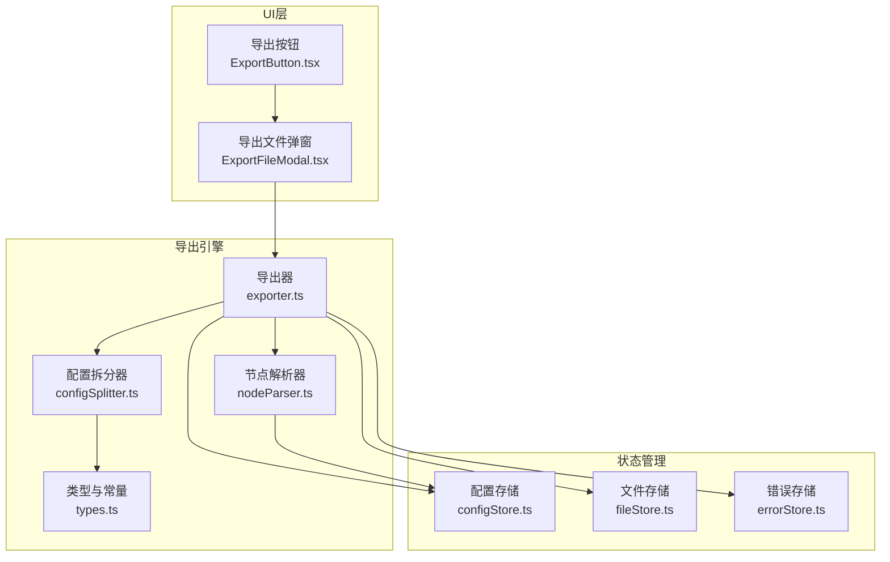
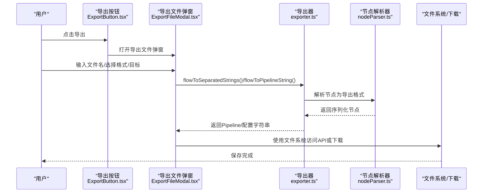
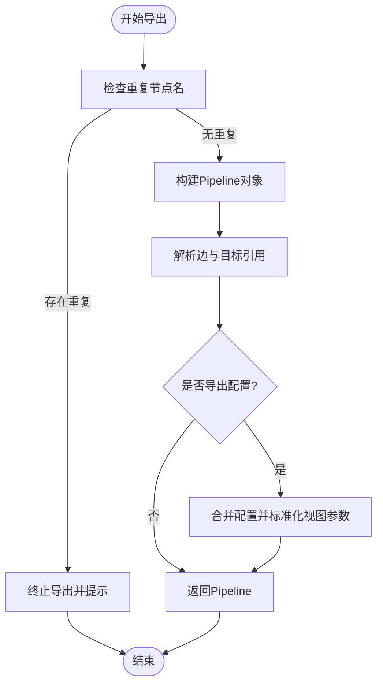
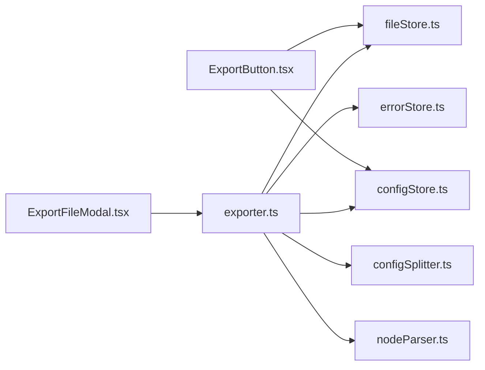

# 导出选项

<cite>
**本文档引用的文件**
- [ExportButton.tsx](file://src/components/panels/toolbar/ExportButton.tsx)
- [ExportFileModal.tsx](file://src/components/modals/ExportFileModal.tsx)
- [exporter.ts](file://src/core/parser/exporter.ts)
- [nodeParser.ts](file://src/core/parser/nodeParser.ts)
- [configSplitter.ts](file://src/core/parser/configSplitter.ts)
- [types.ts](file://src/core/parser/types.ts)
- [configStore.ts](file://src/stores/configStore.ts)
- [PipelineConfigSection.tsx](file://src/components/panels/config/PipelineConfigSection.tsx)
- [fileStore.ts](file://src/stores/fileStore.ts)
- [FieldPanel.tsx](file://src/components/panels/main/FieldPanel.tsx)
- [errorStore.ts](file://src/stores/errorStore.ts)
</cite>

## 目录
1. [简介](#简介)
2. [项目结构](#项目结构)
3. [核心组件](#核心组件)
4. [架构总览](#架构总览)
5. [详细组件分析](#详细组件分析)
6. [依赖分析](#依赖分析)
7. [性能考虑](#性能考虑)
8. [故障排查指南](#故障排查指南)
9. [结论](#结论)
10. [附录](#附录)

## 简介
本章节面向MaaPipelineEditor的“导出选项”功能，系统性说明导出格式、配置处理、预览与批量导出、性能优化与最佳实践，并提供常见问题的解决方案。读者无需深入技术背景即可理解如何正确使用导出功能。

## 项目结构
导出功能由前端UI组件、导出解析器与状态管理共同协作完成：
- UI入口：工具栏导出按钮与导出文件弹窗
- 导出引擎：Flow到Pipeline对象的转换、节点解析、配置拆分
- 配置中心：导出格式、缩进、配置处理策略等
- 存储层：文件与配置状态、错误状态

图表来源
- [ExportButton.tsx:1-316](file://src/components/panels/toolbar/ExportButton.tsx#L1-L316)
- [ExportFileModal.tsx:1-302](file://src/components/modals/ExportFileModal.tsx#L1-L302)
- [exporter.ts:1-244](file://src/core/parser/exporter.ts#L1-L244)
- [nodeParser.ts:1-372](file://src/core/parser/nodeParser.ts#L1-L372)
- [configSplitter.ts:1-50](file://src/core/parser/configSplitter.ts#L1-L50)
- [types.ts:1-107](file://src/core/parser/types.ts#L1-L107)
- [configStore.ts:1-268](file://src/stores/configStore.ts#L1-L268)
- [fileStore.ts:690-709](file://src/stores/fileStore.ts#L690-L709)
- [errorStore.ts:1-38](file://src/stores/errorStore.ts#L1-L38)

章节来源
- [ExportButton.tsx:1-316](file://src/components/panels/toolbar/ExportButton.tsx#L1-L316)
- [ExportFileModal.tsx:1-302](file://src/components/modals/ExportFileModal.tsx#L1-L302)
- [exporter.ts:1-244](file://src/core/parser/exporter.ts#L1-L244)
- [nodeParser.ts:1-372](file://src/core/parser/nodeParser.ts#L1-L372)
- [configSplitter.ts:1-50](file://src/core/parser/configSplitter.ts#L1-L50)
- [types.ts:1-107](file://src/core/parser/types.ts#L1-L107)
- [configStore.ts:1-268](file://src/stores/configStore.ts#L1-L268)
- [fileStore.ts:690-709](file://src/stores/fileStore.ts#L690-L709)
- [errorStore.ts:1-38](file://src/stores/errorStore.ts#L1-L38)

## 核心组件
- 导出按钮与菜单：提供“导出到粘贴板”“导出为文件”“保存到本地”“部分导出”“导出Pipeline/配置”等能力，并根据本地服务连接状态与配置模式动态展示。
- 导出文件弹窗：负责文件名、格式、目标选择与预览，支持现代浏览器的文件系统访问API与回退下载。
- 导出器：将Flow图转换为Pipeline对象，处理节点链接、配置注入与版本化导出。
- 节点解析器：按配置将节点的识别/动作/其他参数序列化为导出格式，支持v1/v2协议与默认字段省略策略。
- 配置拆分器：在分离导出模式下，将完整Pipeline对象拆分为Pipeline与.mpe.json配置两部分。
- 配置存储：集中管理导出格式、缩进、配置处理策略、协议版本等。
- 错误与验证：导出前检查节点名重复等错误，避免无效导出。

章节来源
- [ExportButton.tsx:24-125](file://src/components/panels/toolbar/ExportButton.tsx#L24-L125)
- [ExportFileModal.tsx:16-139](file://src/components/modals/ExportFileModal.tsx#L16-L139)
- [exporter.ts:42-210](file://src/core/parser/exporter.ts#L42-L210)
- [nodeParser.ts:21-147](file://src/core/parser/nodeParser.ts#L21-L147)
- [configSplitter.ts:21-50](file://src/core/parser/configSplitter.ts#L21-L50)
- [configStore.ts:94-180](file://src/stores/configStore.ts#L94-L180)
- [errorStore.ts:3-15](file://src/stores/errorStore.ts#L3-L15)

## 架构总览
导出流程从UI触发，经由导出器与解析器，最终落盘或复制到剪贴板。

图表来源
- [ExportButton.tsx:52-90](file://src/components/panels/toolbar/ExportButton.tsx#L52-L90)
- [ExportFileModal.tsx:102-139](file://src/components/modals/ExportFileModal.tsx#L102-L139)
- [exporter.ts:228-243](file://src/core/parser/exporter.ts#L228-L243)
- [nodeParser.ts:21-147](file://src/core/parser/nodeParser.ts#L21-L147)

章节来源
- [ExportButton.tsx:52-90](file://src/components/panels/toolbar/ExportButton.tsx#L52-L90)
- [ExportFileModal.tsx:102-139](file://src/components/modals/ExportFileModal.tsx#L102-L139)
- [exporter.ts:228-243](file://src/core/parser/exporter.ts#L228-L243)
- [nodeParser.ts:21-147](file://src/core/parser/nodeParser.ts#L21-L147)

## 详细组件分析

### 导出格式与配置处理
- 格式选择：支持.json与.jsonc两种导出格式，弹窗提供下拉选择。
- 配置处理方案：
  - 集成导出：配置嵌入Pipeline文件，适合单文件分享。
  - 分离导出：配置写入独立.mpe.json文件，便于版本管理。
  - 不导出：不保存配置，导入时触发自动布局。
- JSON缩进：可配置每层缩进空格数，默认4空格。
- 协议版本：v2采用嵌套对象结构，v1采用平铺参数，影响识别/动作字段的导出形态。
- 默认识别/动作：可配置是否省略默认DirectHit/DoNothing且无参数的字段。

章节来源
- [ExportFileModal.tsx:253-256](file://src/components/modals/ExportFileModal.tsx#L253-L256)
- [PipelineConfigSection.tsx:240-268](file://src/components/panels/config/PipelineConfigSection.tsx#L240-L268)
- [configStore.ts:94-180](file://src/stores/configStore.ts#L94-L180)
- [exporter.ts:217-221](file://src/core/parser/exporter.ts#L217-L221)
- [nodeParser.ts:84-117](file://src/core/parser/nodeParser.ts#L84-L117)

### 导出范围与过滤条件
- 全量导出：将当前画布所有节点与边转换为Pipeline。
- 部分导出：仅导出当前选中的节点与边，适合局部验证或复用片段。
- 链接排序：按边的label顺序进行稳定排序，确保导出一致性。
- 节点顺序：依据文件配置中的nodeOrderMap进行排序，保证导出顺序可控。

章节来源
- [ExportButton.tsx:67-75](file://src/components/panels/toolbar/ExportButton.tsx#L67-L75)
- [exporter.ts:75-81](file://src/core/parser/exporter.ts#L75-L81)
- [exporter.ts:127-134](file://src/core/parser/exporter.ts#L127-L134)

### 导出预览与路径处理
- 预览文件名：根据文件名与格式实时计算，分离模式下可预览同时导出两个文件的组合名称。
- 路径处理：导出文件弹窗支持现代浏览器的文件系统访问API，优先使用该API以提升用户体验；若不可用则回退到传统下载方式。
- 文件名校验：禁止包含非法字符，确保兼容性。

章节来源
- [ExportFileModal.tsx:54-91](file://src/components/modals/ExportFileModal.tsx#L54-L91)
- [ExportFileModal.tsx:142-188](file://src/components/modals/ExportFileModal.tsx#L142-L188)
- [ExportFileModal.tsx:94-100](file://src/components/modals/ExportFileModal.tsx#L94-L100)

### 批量导出与模板应用
- 批量导出：通过“保存到本地”系列操作，结合分离导出模式，可一次性生成Pipeline与.mpe.json两个文件，便于团队协作与版本管理。
- 模板应用：导出时会保留节点的位置信息与端点方向，便于后续导入后保持布局一致。
- 本地服务集成：当本地服务连接时，导出按钮菜单会显示“保存到本地”“使用本地服务创建”等选项，简化本地文件管理。

章节来源
- [ExportButton.tsx:154-197](file://src/components/panels/toolbar/ExportButton.tsx#L154-L197)
- [ExportButton.tsx:200-209](file://src/components/panels/toolbar/ExportButton.tsx#L200-L209)
- [fileStore.ts:690-709](file://src/stores/fileStore.ts#L690-L709)
- [nodeParser.ts:131-144](file://src/core/parser/nodeParser.ts#L131-L144)

### 导出预览功能
- 格式预览：在弹窗中即时显示目标文件扩展名与组合名称。
- 内容预览：通过“导出到粘贴板”或“部分导出”快速预览导出结果，便于核对。
- 配置预览：在分离导出模式下，可分别导出Pipeline与配置，分别预览其内容。

章节来源
- [ExportFileModal.tsx:272-286](file://src/components/modals/ExportFileModal.tsx#L272-L286)
- [ExportButton.tsx:46-75](file://src/components/panels/toolbar/ExportButton.tsx#L46-L75)

### 导出性能优化
- 大文件处理：优先使用文件系统访问API，避免大文件在内存中反复拼接与下载造成的卡顿。
- 内存管理：导出器在生成字符串时使用配置中心的jsonIndent，避免不必要的中间对象拷贝；分离导出时先生成完整对象再拆分，减少重复遍历。
- 进度显示：导出过程本身无显式进度条，但字段面板在加载时提供遮罩层与进度文案，可作为整体流畅度的参考。

章节来源
- [ExportFileModal.tsx:147-188](file://src/components/modals/ExportFileModal.tsx#L147-L188)
- [exporter.ts:238-242](file://src/core/parser/exporter.ts#L238-L242)
- [FieldPanel.tsx:325-380](file://src/components/panels/main/FieldPanel.tsx#L325-L380)

### 导出配置与规则
- 节点属性导出形式：支持“前缀形式”与“对象形式”，前者如"[Anchor][JumpBack]C"，后者如{ name, anchor, jump_back }。
- 默认端点位置：统一新节点的端点方向，便于导出后保持连线风格一致。
- 忽略字段校验：在调试或快速导出场景下可跳过字段格式校验，但可能导出非规范内容。
- 导出默认识别/动作：可配置是否省略默认DirectHit/DoNothing且无参数的字段，减小文件体积。

章节来源
- [PipelineConfigSection.tsx:63-90](file://src/components/panels/config/PipelineConfigSection.tsx#L63-L90)
- [PipelineConfigSection.tsx:91-132](file://src/components/panels/config/PipelineConfigSection.tsx#L91-L132)
- [PipelineConfigSection.tsx:133-158](file://src/components/panels/config/PipelineConfigSection.tsx#L133-L158)
- [PipelineConfigSection.tsx:187-212](file://src/components/panels/config/PipelineConfigSection.tsx#L187-L212)
- [nodeParser.ts:79-117](file://src/core/parser/nodeParser.ts#L79-L117)

### 导出流程与错误处理
- 导出前检查：若存在重复节点名，导出将被阻止并提示修改。
- 导出失败提示：捕获异常并弹出错误通知，建议检查节点字段格式并在控制台查看详细错误。

图表来源
- [exporter.ts:44-55](file://src/core/parser/exporter.ts#L44-L55)
- [exporter.ts:117-200](file://src/core/parser/exporter.ts#L117-L200)
- [errorStore.ts:3-15](file://src/stores/errorStore.ts#L3-L15)

章节来源
- [exporter.ts:44-55](file://src/core/parser/exporter.ts#L44-L55)
- [exporter.ts:117-200](file://src/core/parser/exporter.ts#L117-L200)
- [errorStore.ts:3-15](file://src/stores/errorStore.ts#L3-L15)

## 依赖分析
- 组件耦合：
  - 导出按钮依赖配置存储与文件存储，以判断菜单项与默认行为。
  - 导出弹窗依赖导出器与配置存储，以生成预览与执行导出。
  - 导出器依赖节点解析器与配置拆分器，以完成节点序列化与配置分离。
- 外部依赖：
  - 浏览器文件系统访问API（现代浏览器支持）。
  - Ant Design组件库（表单、选择器、消息提示等）。

图表来源
- [ExportButton.tsx:25-39](file://src/components/panels/toolbar/ExportButton.tsx#L25-L39)
- [ExportFileModal.tsx:6-9](file://src/components/modals/ExportFileModal.tsx#L6-L9)
- [exporter.ts:1-36](file://src/core/parser/exporter.ts#L1-L36)
- [nodeParser.ts:1-14](file://src/core/parser/nodeParser.ts#L1-L14)
- [configSplitter.ts:1-14](file://src/core/parser/configSplitter.ts#L1-L14)
- [configStore.ts:1-268](file://src/stores/configStore.ts#L1-L268)
- [fileStore.ts:690-709](file://src/stores/fileStore.ts#L690-L709)
- [errorStore.ts:1-38](file://src/stores/errorStore.ts#L1-L38)

章节来源
- [ExportButton.tsx:25-39](file://src/components/panels/toolbar/ExportButton.tsx#L25-L39)
- [ExportFileModal.tsx:6-9](file://src/components/modals/ExportFileModal.tsx#L6-L9)
- [exporter.ts:1-36](file://src/core/parser/exporter.ts#L1-L36)
- [nodeParser.ts:1-14](file://src/core/parser/nodeParser.ts#L1-L14)
- [configSplitter.ts:1-14](file://src/core/parser/configSplitter.ts#L1-L14)
- [configStore.ts:1-268](file://src/stores/configStore.ts#L1-L268)
- [fileStore.ts:690-709](file://src/stores/fileStore.ts#L690-L709)
- [errorStore.ts:1-38](file://src/stores/errorStore.ts#L1-L38)

## 性能考虑
- 优先使用文件系统访问API：减少内存占用与下载延迟，尤其在大文件导出时更为明显。
- 控制缩进与字段数量：合理设置JSON缩进与启用“省略默认识别/动作”，可显著降低文件体积与导出时间。
- 分离导出：将配置与Pipeline分离，有利于增量更新与版本控制，间接提升协作效率。
- 避免重复节点名：导出前修正重复节点名，减少无效重试与错误提示。

## 故障排查指南
- 导出失败并提示重复节点名：请在画布中修改重复节点名，再次尝试导出。
- 导出后文件过大：调整JSON缩进、启用“省略默认识别/动作”，或切换为分离导出模式。
- 文件名非法导致无法保存：避免使用以下字符：\ / : * ? " < > |。
- 本地服务连接时导出异常：检查本地服务状态与网络连接，确保路径与权限正确。
- 导出内容不符合预期：核对“节点属性导出形式”“协议版本”“默认端点位置”等配置，必要时开启“忽略字段校验”进行快速验证。

章节来源
- [errorStore.ts:3-15](file://src/stores/errorStore.ts#L3-L15)
- [ExportFileModal.tsx:94-100](file://src/components/modals/ExportFileModal.tsx#L94-L100)
- [PipelineConfigSection.tsx:187-212](file://src/components/panels/config/PipelineConfigSection.tsx#L187-L212)
- [fileStore.ts:690-709](file://src/stores/fileStore.ts#L690-L709)

## 结论
MaaPipelineEditor的导出选项提供了灵活的格式与配置策略，配合预览与批量导出能力，能够满足从个人分享到团队协作的多种场景。通过合理配置与遵循最佳实践，可在保证质量的同时提升导出效率与可维护性。

## 附录
- 最佳实践清单
  - 优先使用分离导出模式进行团队协作与版本管理。
  - 在生产环境启用“省略默认识别/动作”，以减小文件体积。
  - 使用文件系统访问API导出大文件，避免浏览器内存压力。
  - 导出前统一节点端点方向，确保连线风格一致。
  - 定期清理重复节点名，避免导出失败与导入困难。