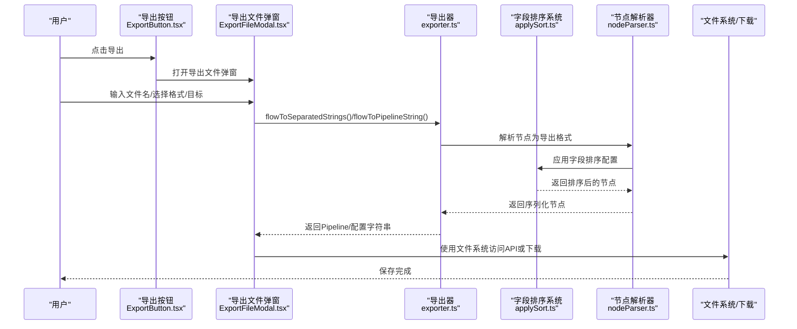
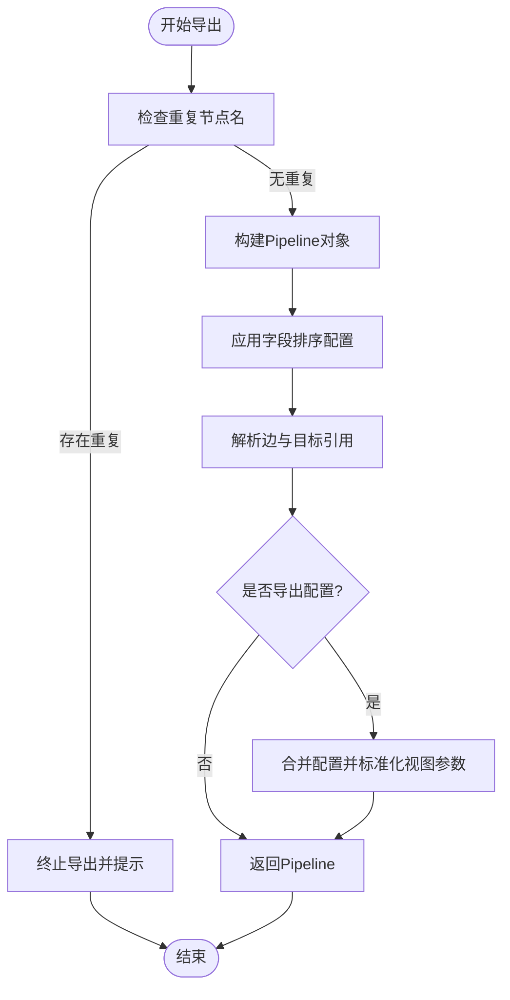
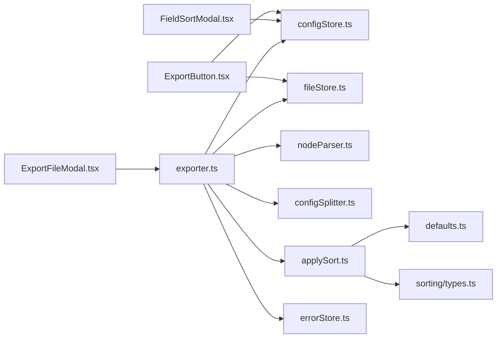

# 导出选项

<cite>
**本文档引用的文件**
- [ExportButton.tsx](file://src/components/panels/toolbar/ExportButton.tsx)
- [ExportFileModal.tsx](file://src/components/modals/ExportFileModal.tsx)
- [exporter.ts](file://src/core/parser/exporter.ts)
- [nodeParser.ts](file://src/core/parser/nodeParser.ts)
- [configSplitter.ts](file://src/core/parser/configSplitter.ts)
- [types.ts](file://src/core/parser/types.ts)
- [configStore.ts](file://src/stores/configStore.ts)
- [PipelineConfigSection.tsx](file://src/components/panels/config/PipelineConfigSection.tsx)
- [fileStore.ts](file://src/stores/fileStore.ts)
- [FieldPanel.tsx](file://src/components/panels/main/FieldPanel.tsx)
- [errorStore.ts](file://src/stores/errorStore.ts)
- [applySort.ts](file://src/core/sorting/applySort.ts)
- [defaults.ts](file://src/core/sorting/defaults.ts)
- [types.ts](file://src/core/sorting/types.ts)
- [FieldSortModal.tsx](file://src/components/modals/FieldSortModal.tsx)
- [FieldSortModal.module.less](file://src/styles/FieldSortModal.module.less)
- [index.ts](file://src/core/sorting/index.ts)
</cite>

## 更新摘要
**所做更改**
- 新增字段排序系统集成章节，详细说明字段排序功能的实现机制
- 更新导出配置与规则章节，增加字段排序相关配置说明
- 新增字段排序配置管理章节，介绍字段排序模态框的使用方法
- 更新导出流程与错误处理章节，增加字段排序相关的处理逻辑
- 新增字段排序最佳实践章节，提供使用建议和注意事项

## 目录
1. [简介](#简介)
2. [项目结构](#项目结构)
3. [核心组件](#核心组件)
4. [架构总览](#架构总览)
5. [详细组件分析](#详细组件分析)
6. [字段排序系统集成](#字段排序系统集成)
7. [字段排序配置管理](#字段排序配置管理)
8. [依赖分析](#依赖分析)
9. [性能考虑](#性能考虑)
10. [故障排查指南](#故障排查指南)
11. [结论](#结论)
12. [附录](#附录)

## 简介
本章节面向MaaPipelineEditor的"导出选项"功能，系统性说明导出格式、配置处理、预览与批量导出、性能优化与最佳实践，并提供常见问题的解决方案。**更新**：新增字段排序系统集成，允许用户自定义导出时字段的排列顺序，增强导出功能的灵活性和可定制性。

## 项目结构
导出功能由前端UI组件、导出解析器与状态管理共同协作完成，**新增字段排序系统**：
- UI入口：工具栏导出按钮与导出文件弹窗
- 导出引擎：Flow到Pipeline对象的转换、节点解析、配置拆分
- **字段排序系统**：字段顺序自定义、排序配置管理
- 配置中心：导出格式、缩进、配置处理策略等
- 存储层：文件与配置状态、错误状态

```mermaid
graph TB
subgraph "UI层"
EB["导出按钮<br/>ExportButton.tsx"]
EFM["导出文件弹窗<br/>ExportFileModal.tsx"]
FSM["字段排序模态框<br/>FieldSortModal.tsx"]
end
subgraph "导出引擎"
EXP["导出器<br/>exporter.ts"]
NPAR["节点解析器<br/>nodeParser.ts"]
CSPL["配置拆分器<br/>configSplitter.ts"]
TYP["类型与常量<br/>types.ts"]
end
subgraph "字段排序系统"
APPLY["排序应用<br/>applySort.ts"]
DEF["默认配置<br/>defaults.ts"]
FTYPE["类型定义<br/>types.ts"]
END
subgraph "状态管理"
CFG["配置存储<br/>configStore.ts"]
FST["文件存储<br/>fileStore.ts"]
ERR["错误存储<br/>errorStore.ts"]
end
EB --> EFM
EFM --> EXP
FSM --> CFG
EXP --> NPAR
EXP --> CSPL
EXP --> APPLY
APPLY --> DEF
APPLY --> FTYPE
EXP --> CFG
EXP --> FST
EXP --> ERR
NPAR --> CFG
CSPL --> TYP
```

**图表来源**
- [ExportButton.tsx:1-316](file://src/components/panels/toolbar/ExportButton.tsx#L1-L316)
- [ExportFileModal.tsx:1-302](file://src/components/modals/ExportFileModal.tsx#L1-L302)
- [FieldSortModal.tsx:1-362](file://src/components/modals/FieldSortModal.tsx#L1-L362)
- [exporter.ts:1-262](file://src/core/parser/exporter.ts#L1-L262)
- [nodeParser.ts:1-471](file://src/core/parser/nodeParser.ts#L1-L471)
- [applySort.ts:1-326](file://src/core/sorting/applySort.ts#L1-L326)
- [defaults.ts:1-152](file://src/core/sorting/defaults.ts#L1-L152)

## 核心组件
- 导出按钮与菜单：提供"导出到粘贴板""导出为文件""保存到本地""部分导出""导出Pipeline/配置"等能力，并根据本地服务连接状态与配置模式动态展示。
- 导出文件弹窗：负责文件名、格式、目标选择与预览，支持现代浏览器的文件系统访问API与回退下载。
- 导出器：将Flow图转换为Pipeline对象，处理节点链接、配置注入与版本化导出。
- **字段排序系统**：提供字段顺序自定义功能，支持主任务字段、识别参数、动作参数、滑动参数和冻结参数的排序配置。
- 节点解析器：按配置将节点的识别/动作/其他参数序列化为导出格式，支持v1/v2协议与默认字段省略策略。
- 配置拆分器：在分离导出模式下，将完整Pipeline对象拆分为Pipeline与.mpe.json配置两部分。
- 配置存储：集中管理导出格式、缩进、配置处理策略、协议版本、**字段排序配置**等。
- 错误与验证：导出前检查节点名重复等错误，避免无效导出。

**章节来源**
- [ExportButton.tsx:24-125](file://src/components/panels/toolbar/ExportButton.tsx#L24-L125)
- [ExportFileModal.tsx:16-139](file://src/components/modals/ExportFileModal.tsx#L16-L139)
- [exporter.ts:42-210](file://src/core/parser/exporter.ts#L42-L210)
- [applySort.ts:275-300](file://src/core/sorting/applySort.ts#L275-L300)
- [nodeParser.ts:21-147](file://src/core/parser/nodeParser.ts#L21-L147)
- [configSplitter.ts:21-50](file://src/core/parser/configSplitter.ts#L21-L50)
- [configStore.ts:94-180](file://src/stores/configStore.ts#L94-L180)
- [errorStore.ts:3-15](file://src/stores/errorStore.ts#L3-L15)

## 架构总览
导出流程从UI触发，经由导出器与解析器，**经过字段排序系统处理**，最终落盘或复制到剪贴板。



**图表来源**
- [ExportButton.tsx:52-90](file://src/components/panels/toolbar/ExportButton.tsx#L52-L90)
- [ExportFileModal.tsx:102-139](file://src/components/modals/ExportFileModal.tsx#L102-L139)
- [exporter.ts:228-243](file://src/core/parser/exporter.ts#L228-L243)
- [applySort.ts:275-300](file://src/core/sorting/applySort.ts#L275-L300)
- [nodeParser.ts:21-147](file://src/core/parser/nodeParser.ts#L21-L147)

## 详细组件分析

### 导出格式与配置处理
- 格式选择：支持.json与.jsonc两种导出格式，弹窗提供下拉选择。
- 配置处理方案：
  - 集成导出：配置嵌入Pipeline文件，适合单文件分享。
  - 分离导出：配置写入独立.mpe.json文件，便于版本管理。
  - 不导出：不保存配置，导入时触发自动布局。
- JSON缩进：可配置每层缩进空格数，默认4空格。
- 协议版本：v2采用嵌套对象结构，v1采用平铺参数，影响识别/动作字段的导出形态。
- 默认识别/动作：可配置是否省略默认DirectHit/DoNothing且无参数的字段。

**章节来源**
- [ExportFileModal.tsx:253-256](file://src/components/modals/ExportFileModal.tsx#L253-L256)
- [PipelineConfigSection.tsx:240-268](file://src/components/panels/config/PipelineConfigSection.tsx#L240-L268)
- [configStore.ts:94-180](file://src/stores/configStore.ts#L94-L180)
- [exporter.ts:217-221](file://src/core/parser/exporter.ts#L217-L221)
- [nodeParser.ts:84-117](file://src/core/parser/nodeParser.ts#L84-L117)

### 导出范围与过滤条件
- 全量导出：将当前画布所有节点与边转换为Pipeline。
- 部分导出：仅导出当前选中的节点与边，适合局部验证或复用片段。
- 链接排序：按边的label顺序进行稳定排序，确保导出一致性。
- 节点顺序：依据文件配置中的nodeOrderMap进行排序，保证导出顺序可控。

**章节来源**
- [ExportButton.tsx:67-75](file://src/components/panels/toolbar/ExportButton.tsx#L67-L75)
- [exporter.ts:75-81](file://src/core/parser/exporter.ts#L75-L81)
- [exporter.ts:127-134](file://src/core/parser/exporter.ts#L127-L134)

### 导出预览与路径处理
- 预览文件名：根据文件名与格式实时计算，分离模式下可预览同时导出两个文件的组合名称。
- 路径处理：导出文件弹窗支持现代浏览器的文件系统访问API，优先使用该API以提升用户体验；若不可用则回退到传统下载方式。
- 文件名校验：禁止包含非法字符，确保兼容性。

**章节来源**
- [ExportFileModal.tsx:54-91](file://src/components/modals/ExportFileModal.tsx#L54-L91)
- [ExportFileModal.tsx:142-188](file://src/components/modals/ExportFileModal.tsx#L142-L188)
- [ExportFileModal.tsx:94-100](file://src/components/modals/ExportFileModal.tsx#L94-L100)

### 批量导出与模板应用
- 批量导出：通过"保存到本地"系列操作，结合分离导出模式，可一次性生成Pipeline与.mpe.json两个文件，便于团队协作与版本管理。
- 模板应用：导出时会保留节点的位置信息与端点方向，便于后续导入后保持布局一致。
- 本地服务集成：当本地服务连接时，导出按钮菜单会显示"保存到本地""使用本地服务创建"等选项，简化本地文件管理。

**章节来源**
- [ExportButton.tsx:154-197](file://src/components/panels/toolbar/ExportButton.tsx#L154-L197)
- [ExportButton.tsx:200-209](file://src/components/panels/toolbar/ExportButton.tsx#L200-L209)
- [fileStore.ts:690-709](file://src/stores/fileStore.ts#L690-L709)
- [nodeParser.ts:131-144](file://src/core/parser/nodeParser.ts#L131-L144)

### 导出预览功能
- 格式预览：在弹窗中即时显示目标文件扩展名与组合名称。
- 内容预览：通过"导出到粘贴板"或"部分导出"快速预览导出结果，便于核对。
- 配置预览：在分离导出模式下，可分别导出Pipeline与配置，分别预览其内容。

**章节来源**
- [ExportFileModal.tsx:272-286](file://src/components/modals/ExportFileModal.tsx#L272-L286)
- [ExportButton.tsx:46-75](file://src/components/panels/toolbar/ExportButton.tsx#L46-L75)

### 导出性能优化
- 大文件处理：优先使用文件系统访问API，避免大文件在内存中反复拼接与下载造成的卡顿。
- 内存管理：导出器在生成字符串时使用配置中心的jsonIndent，避免不必要的中间对象拷贝；分离导出时先生成完整对象再拆分，减少重复遍历。
- 进度显示：导出过程本身无显式进度条，但字段面板在加载时提供遮罩层与进度文案，可作为整体流畅度的参考。

**章节来源**
- [ExportFileModal.tsx:147-188](file://src/components/modals/ExportFileModal.tsx#L147-L188)
- [exporter.ts:238-242](file://src/core/parser/exporter.ts#L238-L242)
- [FieldPanel.tsx:325-380](file://src/components/panels/main/FieldPanel.tsx#L325-L380)

### 导出配置与规则
- 节点属性导出形式：支持"前缀形式""与"对象形式"，前者如"[Anchor][JumpBack]C"，后者如{ name, anchor, jump_back }。
- 默认端点位置：统一新节点的端点方向，便于导出后保持连线风格一致。
- 忽略字段校验：在调试或快速导出场景下可跳过字段格式校验，但可能导出非规范内容。
- 导出默认识别/动作：可配置是否省略默认DirectHit/DoNothing且无参数的字段，减小文件体积。
- **字段排序配置**：可配置主任务字段、识别参数、动作参数、滑动参数和冻结参数的排序顺序，支持拖拽调整。

**章节来源**
- [PipelineConfigSection.tsx:63-90](file://src/components/panels/config/PipelineConfigSection.tsx#L63-L90)
- [PipelineConfigSection.tsx:91-132](file://src/components/panels/config/PipelineConfigSection.tsx#L91-L132)
- [PipelineConfigSection.tsx:133-158](file://src/components/panels/config/PipelineConfigSection.tsx#L133-L158)
- [PipelineConfigSection.tsx:187-212](file://src/components/panels/config/PipelineConfigSection.tsx#L187-L212)
- [nodeParser.ts:79-117](file://src/core/parser/nodeParser.ts#L79-L117)

### 导出流程与错误处理
- 导出前检查：若存在重复节点名，导出将被阻止并提示修改。
- 导出失败提示：捕获异常并弹出错误通知，建议检查节点字段格式并在控制台查看详细错误。
- **字段排序处理**：导出前应用字段排序配置，将MPE特色字段移动到末尾，确保导出结果的一致性。



**图表来源**
- [exporter.ts:44-55](file://src/core/parser/exporter.ts#L44-L55)
- [exporter.ts:117-200](file://src/core/parser/exporter.ts#L117-L200)
- [applySort.ts:275-300](file://src/core/sorting/applySort.ts#L275-L300)
- [errorStore.ts:3-15](file://src/stores/errorStore.ts#L3-L15)

**章节来源**
- [exporter.ts:44-55](file://src/core/parser/exporter.ts#L44-L55)
- [exporter.ts:117-200](file://src/core/parser/exporter.ts#L117-L200)
- [applySort.ts:275-300](file://src/core/sorting/applySort.ts#L275-L300)
- [errorStore.ts:3-15](file://src/stores/errorStore.ts#L3-L15)

## 字段排序系统集成

### 字段排序系统概述
字段排序系统是MaaPipelineEditor新增的核心功能，允许用户自定义导出时字段的排列顺序。该系统基于配置驱动的方式，提供灵活的字段排序能力。

### 排序配置结构
字段排序系统包含以下主要配置：
- **主任务字段排序**：控制节点主要字段的排列顺序
- **识别参数排序**：控制识别参数字段的排列顺序
- **动作参数排序**：控制动作参数字段的排列顺序
- **滑动参数排序**：控制滑动相关参数的排列顺序
- **冻结参数排序**：控制冻结对象参数的排列顺序

### 排序实现机制
字段排序系统通过以下步骤实现：
1. **配置合并**：将用户自定义配置与默认配置合并
2. **版本适配**：根据协议版本(v1/v2)选择相应的排序策略
3. **字段重排**：按照指定顺序重新排列节点字段
4. **MPE字段处理**：将MPE特色字段移动到末尾
5. **参数排序**：对嵌套参数对象进行二次排序

### 默认排序配置
系统提供完善的默认排序配置，涵盖所有可用字段：
- 主任务字段默认顺序：desc → doc → enabled → max_hit → sub_name → recognition → inverse → pre_wait_freezes → pre_delay → action → anchor → repeat → repeat_wait_freezes → repeat_delay → post_wait_freezes → post_delay → timeout → rate_limit → next → on_error → focus → attach
- 识别参数默认顺序：custom_recognition → custom_recognition_param → roi → roi_offset → template → green_mask → method → detector → ratio → lower → upper → connected → expected → replace → only_rec → model → color_filter → labels → threshold → count → all_of → any_of → box_index → order_by → index
- 动作参数默认顺序：custom_action → custom_action_param → target → target_offset → begin → begin_offset → end → end_offset → end_hold → only_hover → duration → contact → pressure → swipes → dx → dy → key → input_text → package → exec → args → detach → cmd → shell_timeout → filename → format → quality

**章节来源**
- [applySort.ts:275-300](file://src/core/sorting/applySort.ts#L275-L300)
- [defaults.ts:122-130](file://src/core/sorting/defaults.ts#L122-L130)
- [defaults.ts:135-143](file://src/core/sorting/defaults.ts#L135-L143)

## 字段排序配置管理

### 字段排序模态框
字段排序配置通过专门的模态框进行管理，提供直观的拖拽式配置界面：

#### 界面组成
- **主任务字段排序面板**：包含desc、doc、enabled、max_hit等主要字段
- **识别参数排序面板**：包含roi、template、method、detector等识别相关字段
- **动作参数排序面板**：包含target、begin、end、duration等动作相关字段
- **滑动参数排序面板**：包含swipes、dx、dy等滑动相关字段
- **冻结参数排序面板**：包含time、target、threshold等冻结相关字段

#### 交互功能
- **拖拽排序**：支持鼠标拖拽调整字段顺序
- **重置功能**：可一键重置为默认排序配置
- **面板重置**：支持单独重置某个面板的排序配置
- **实时预览**：配置变更时实时反映在导出结果中

### 配置存储与应用
字段排序配置通过配置存储系统进行持久化：
- **配置存储**：在configStore中维护fieldSortConfig配置
- **默认值处理**：与默认配置相同的配置会被存储为undefined
- **版本兼容**：支持不同协议版本的排序配置
- **导出应用**：在节点解析阶段自动应用字段排序配置

### 用户界面设计
字段排序模态框采用简洁直观的设计：
- **拖拽句柄**：每个字段项左侧提供拖拽手柄
- **字段名称**：以等宽字体显示字段名称
- **折叠面板**：按功能分类组织不同类型的字段
- **操作按钮**：提供重置、保存、取消等操作按钮

**章节来源**
- [FieldSortModal.tsx:106-362](file://src/components/modals/FieldSortModal.tsx#L106-L362)
- [FieldSortModal.module.less:1-55](file://src/styles/FieldSortModal.module.less#L1-L55)
- [configStore.ts:151-152](file://src/stores/configStore.ts#L151-L152)

## 依赖分析
- 组件耦合：
  - 导出按钮依赖配置存储与文件存储，以判断菜单项与默认行为。
  - 导出弹窗依赖导出器与配置存储，以生成预览与执行导出。
  - **字段排序模态框依赖配置存储，用于管理排序配置**。
  - 导出器依赖节点解析器与配置拆分器，**以及字段排序系统**，以完成节点序列化、排序处理与配置分离。
- 外部依赖：
  - 浏览器文件系统访问API（现代浏览器支持）。
  - Ant Design组件库（表单、选择器、消息提示等）。
  - **DnD Kit库**（拖拽排序功能）。



**图表来源**
- [ExportButton.tsx:25-39](file://src/components/panels/toolbar/ExportButton.tsx#L25-L39)
- [ExportFileModal.tsx:6-9](file://src/components/modals/ExportFileModal.tsx#L6-L9)
- [FieldSortModal.tsx:21-30](file://src/components/modals/FieldSortModal.tsx#L21-L30)
- [exporter.ts:1-36](file://src/core/parser/exporter.ts#L1-L36)
- [applySort.ts:1-36](file://src/core/sorting/applySort.ts#L1-L36)
- [defaults.ts:1-7](file://src/core/sorting/defaults.ts#L1-L7)

**章节来源**
- [ExportButton.tsx:25-39](file://src/components/panels/toolbar/ExportButton.tsx#L25-L39)
- [ExportFileModal.tsx:6-9](file://src/components/modals/ExportFileModal.tsx#L6-L9)
- [FieldSortModal.tsx:21-30](file://src/components/modals/FieldSortModal.tsx#L21-L30)
- [exporter.ts:1-36](file://src/core/parser/exporter.ts#L1-L36)
- [applySort.ts:1-36](file://src/core/sorting/applySort.ts#L1-L36)
- [defaults.ts:1-7](file://src/core/sorting/defaults.ts#L1-L7)
- [configStore.ts:1-268](file://src/stores/configStore.ts#L1-L268)
- [fileStore.ts:690-709](file://src/stores/fileStore.ts#L690-L709)
- [errorStore.ts:1-38](file://src/stores/errorStore.ts#L1-L38)

## 性能考虑
- 优先使用文件系统访问API：减少内存占用与下载延迟，尤其在大文件导出时更为明显。
- 控制缩进与字段数量：合理设置JSON缩进与启用"省略默认识别/动作"，可显著降低文件体积与导出时间。
- 分离导出：将配置与Pipeline分离，有利于增量更新与版本控制，间接提升协作效率。
- 避免重复节点名：导出前修正重复节点名，减少无效重试与错误提示。
- **字段排序性能**：字段排序操作的时间复杂度为O(n)，其中n为字段数量，对大多数实际应用场景影响可忽略不计。

## 故障排查指南
- 导出失败并提示重复节点名：请在画布中修改重复节点名，再次尝试导出。
- 导出后文件过大：调整JSON缩进、启用"省略默认识别/动作"，或切换为分离导出模式。
- 文件名非法导致无法保存：避免使用以下字符：\ / : * ? " < > |。
- 本地服务连接时导出异常：检查本地服务状态与网络连接，确保路径与权限正确。
- 导出内容不符合预期：核对"节点属性导出形式""协议版本""默认端点位置"等配置，必要时开启"忽略字段校验"进行快速验证。
- **字段排序异常**：检查字段排序配置是否正确，确认字段名称是否存在于对应面板中，避免配置冲突。

**章节来源**
- [errorStore.ts:3-15](file://src/stores/errorStore.ts#L3-L15)
- [ExportFileModal.tsx:94-100](file://src/components/modals/ExportFileModal.tsx#L94-L100)
- [PipelineConfigSection.tsx:187-212](file://src/components/panels/config/PipelineConfigSection.tsx#L187-L212)
- [fileStore.ts:690-709](file://src/stores/fileStore.ts#L690-L709)

## 结论
MaaPipelineEditor的导出选项提供了灵活的格式与配置策略，配合预览与批量导出能力，能够满足从个人分享到团队协作的多种场景。**新增的字段排序系统进一步增强了导出功能的灵活性和可定制性**，允许用户精确控制导出文件的字段排列顺序。通过合理配置与遵循最佳实践，可在保证质量的同时提升导出效率与可维护性。

## 附录
- 最佳实践清单
  - 优先使用分离导出模式进行团队协作与版本管理。
  - 在生产环境启用"省略默认识别/动作"，以减小文件体积。
  - 使用文件系统访问API导出大文件，避免浏览器内存压力。
  - 导出前统一节点端点方向，确保连线风格一致。
  - 定期清理重复节点名，避免导出失败与导入困难。
  - **合理配置字段排序，提高导出文件的可读性和一致性**。
  - **利用字段排序功能优化关键字段的可见性，如将常用字段置于前面**。
  - **在团队协作中统一字段排序配置，确保导出结果的一致性**。