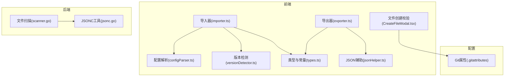
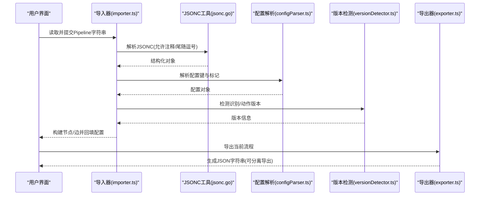
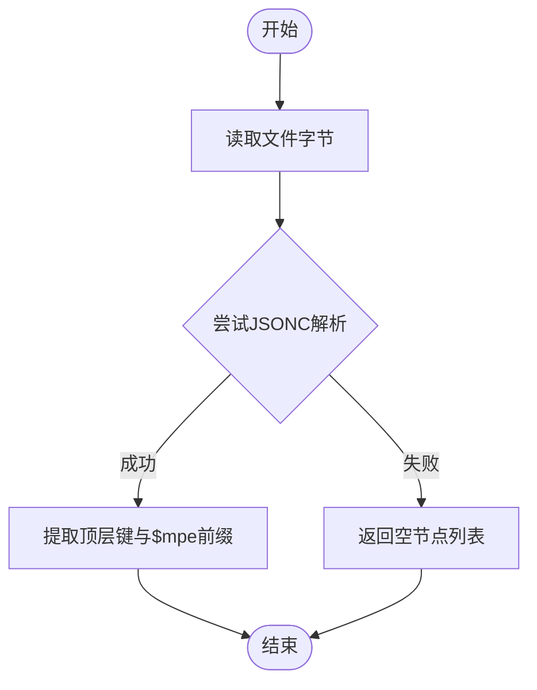
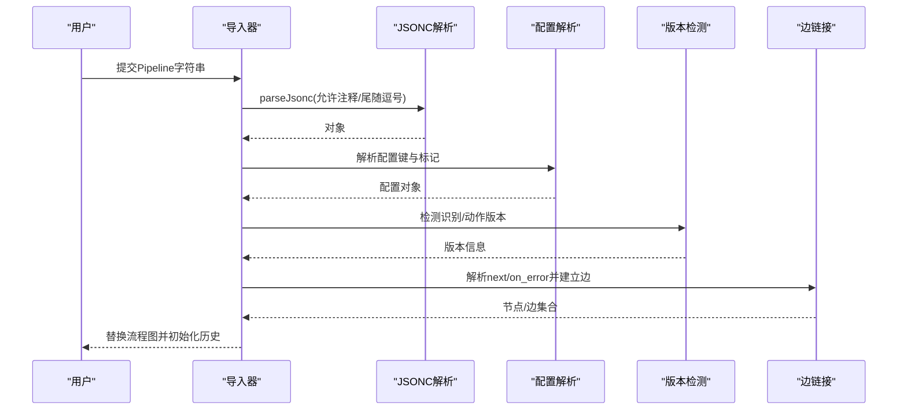
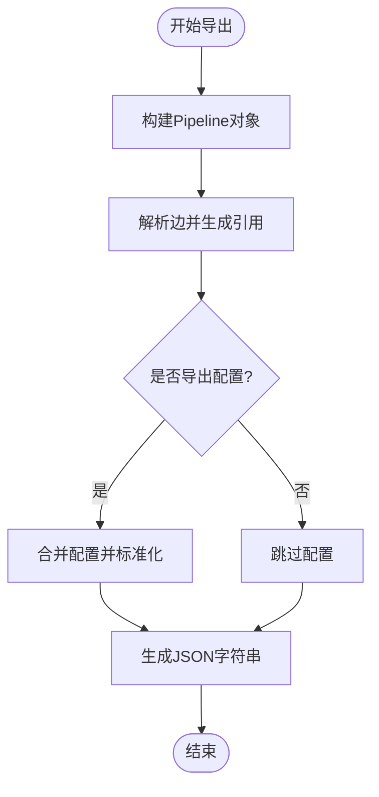
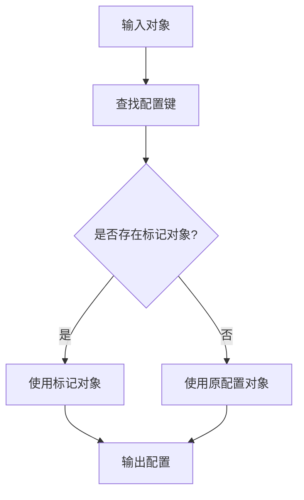
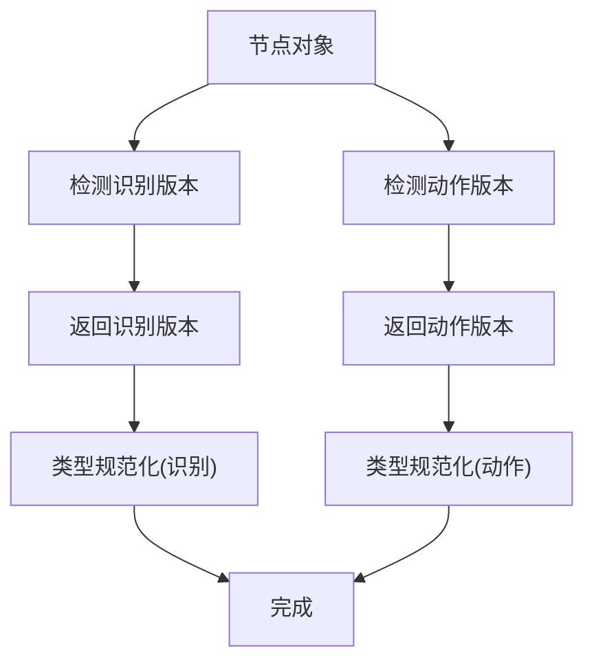
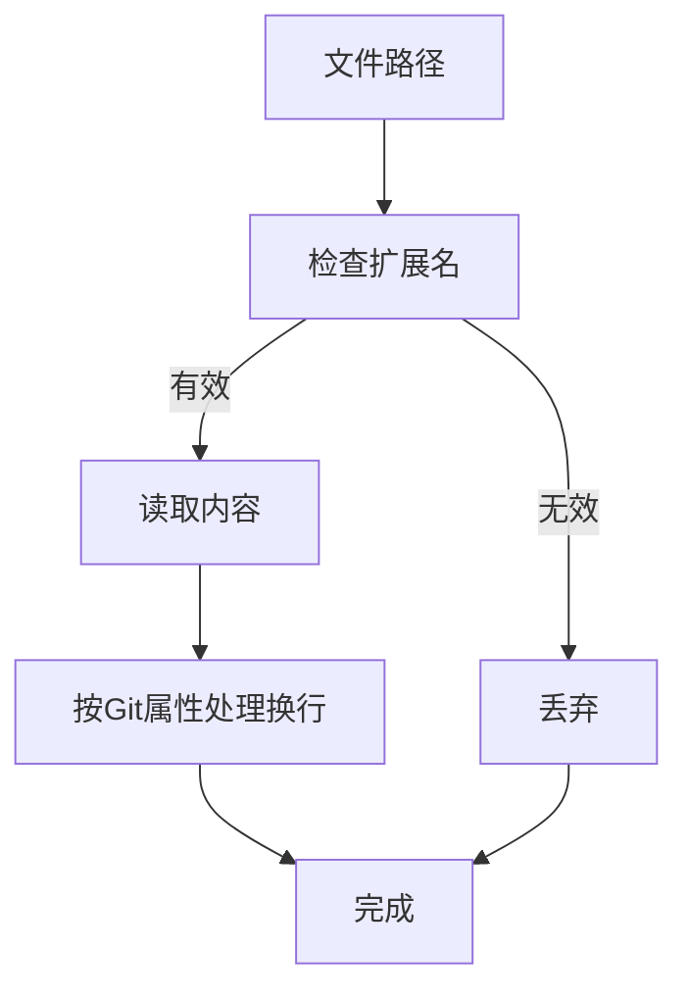
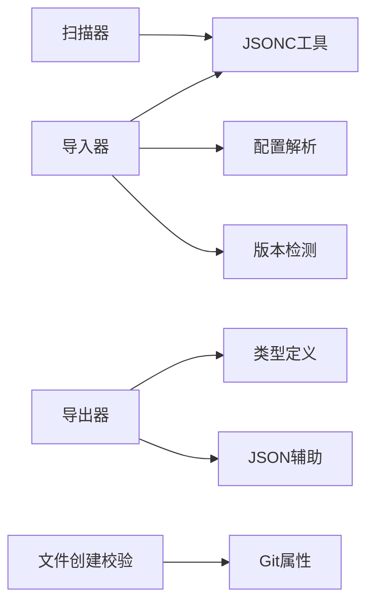

# 文件格式支持

<cite>
**本文档引用的文件**
- [exporter.ts](file://src/core/parser/exporter.ts)
- [importer.ts](file://src/core/parser/importer.ts)
- [jsonHelper.ts](file://src/utils/jsonHelper.ts)
- [jsonc.go](file://LocalBridge/internal/utils/jsonc.go)
- [scanner.go](file://LocalBridge/internal/service/file/scanner.go)
- [configParser.ts](file://src/core/parser/configParser.ts)
- [versionDetector.ts](file://src/core/parser/versionDetector.ts)
- [types.ts](file://src/core/parser/types.ts)
- [.gitattributes](file://.gitattributes)
- [CreateFileModal.tsx](file://src/components/modals/CreateFileModal.tsx)
</cite>

## 目录
1. [简介](#简介)
2. [项目结构](#项目结构)
3. [核心组件](#核心组件)
4. [架构总览](#架构总览)
5. [详细组件分析](#详细组件分析)
6. [依赖分析](#依赖分析)
7. [性能考虑](#性能考虑)
8. [故障排查指南](#故障排查指南)
9. [结论](#结论)
10. [附录](#附录)

## 简介
本文件聚焦于 MaaPipelineEditor 的“文件格式支持”能力，系统性说明其对 JSON、JSONC（带注释 JSON）以及与 YAML/XML 相关的兼容策略与实现方式。重点涵盖：
- 支持的文件格式与解析/生成机制
- JSONC 的注释与尾随逗号处理
- 文件类型与编码的检测与识别
- 格式转换过程中的数据结构映射、字段映射与类型转换
- 格式验证规则（语法、结构、数据类型）
- 示例与最佳实践
- 兼容性说明与版本差异处理

## 项目结构
围绕文件格式支持的关键模块分布如下：
- 前端解析与导出：负责将可视化流程转换为 JSON 字符串，并支持分离导出
- 后端工具与扫描：提供 JSONC 解析与校验、文件扫描与过滤
- 配置与版本：解析配置标记、兼容旧版配置、版本检测与规范化
- 类型与常量：统一导出/导入的类型定义与标记前缀

**图表来源**
- [exporter.ts:1-244](file://src/core/parser/exporter.ts#L1-L244)
- [importer.ts:1-508](file://src/core/parser/importer.ts#L1-L508)
- [configParser.ts:1-69](file://src/core/parser/configParser.ts#L1-L69)
- [versionDetector.ts:1-149](file://src/core/parser/versionDetector.ts#L1-L149)
- [types.ts:1-107](file://src/core/parser/types.ts#L1-L107)
- [jsonHelper.ts:1-28](file://src/utils/jsonHelper.ts#L1-L28)
- [scanner.go:1-250](file://LocalBridge/internal/service/file/scanner.go#L1-L250)
- [jsonc.go:1-30](file://LocalBridge/internal/utils/jsonc.go#L1-L30)
- [.gitattributes:1-48](file://.gitattributes#L1-L48)
- [CreateFileModal.tsx:133-181](file://src/components/modals/CreateFileModal.tsx#L133-L181)

**章节来源**
- [exporter.ts:1-244](file://src/core/parser/exporter.ts#L1-L244)
- [importer.ts:1-508](file://src/core/parser/importer.ts#L1-L508)
- [jsonc.go:1-30](file://LocalBridge/internal/utils/jsonc.go#L1-L30)
- [scanner.go:1-250](file://LocalBridge/internal/service/file/scanner.go#L1-L250)
- [.gitattributes:1-48](file://.gitattributes#L1-L48)
- [CreateFileModal.tsx:133-181](file://src/components/modals/CreateFileModal.tsx#L133-L181)

## 核心组件
- JSONC 解析与校验：使用第三方库进行 JSONC 标准化与解析，支持行注释、块注释与尾随逗号
- 导入/导出管线：将可视化节点与边映射为 JSON 对象，并支持分离导出与配置合并
- 配置解析与标记：识别并解析配置键与标记字段，兼容新旧版本配置
- 版本检测与规范化：根据节点字段特征判断识别/动作版本，并进行类型规范化
- 文件扫描与过滤：扫描本地文件，过滤扩展名与隐藏配置文件，尝试解析 JSONC 提取节点与前缀
- 编码与扩展名：通过 Git 属性统一文本换行与扩展名识别

**章节来源**
- [jsonc.go:1-30](file://LocalBridge/internal/utils/jsonc.go#L1-L30)
- [exporter.ts:212-243](file://src/core/parser/exporter.ts#L212-L243)
- [importer.ts:155-507](file://src/core/parser/importer.ts#L155-L507)
- [configParser.ts:47-68](file://src/core/parser/configParser.ts#L47-L68)
- [versionDetector.ts:23-148](file://src/core/parser/versionDetector.ts#L23-L148)
- [scanner.go:159-174](file://LocalBridge/internal/service/file/scanner.go#L159-L174)

## 架构总览
文件格式支持的端到端流程如下：

**图表来源**
- [importer.ts:155-507](file://src/core/parser/importer.ts#L155-L507)
- [jsonc.go:14-29](file://LocalBridge/internal/utils/jsonc.go#L14-L29)
- [configParser.ts:47-68](file://src/core/parser/configParser.ts#L47-L68)
- [versionDetector.ts:23-148](file://src/core/parser/versionDetector.ts#L23-L148)
- [exporter.ts:212-243](file://src/core/parser/exporter.ts#L212-L243)

## 详细组件分析

### JSONC 解析与生成
- 解析能力
  - 支持行注释与块注释
  - 支持尾随逗号
  - 使用第三方库进行 JSONC 标准化，再交由标准 JSON 解析器处理
- 校验能力
  - 提供 IsValidJSONC 方法用于快速判定输入是否为有效 JSONC
- 在扫描器中的应用
  - 扫描器读取文件后，优先尝试 JSONC 解析以提取顶层键与 $mpe 前缀

**图表来源**
- [scanner.go:213-249](file://LocalBridge/internal/service/file/scanner.go#L213-L249)
- [jsonc.go:14-29](file://LocalBridge/internal/utils/jsonc.go#L14-L29)

**章节来源**
- [jsonc.go:1-30](file://LocalBridge/internal/utils/jsonc.go#L1-L30)
- [scanner.go:213-249](file://LocalBridge/internal/service/file/scanner.go#L213-L249)

### 导入流程（Import）
- 输入处理
  - 支持空文件或仅含空白的字符串归一化为空对象
  - 使用 JSONC 解析器提取原始键顺序，便于保持字段顺序
- 配置合并
  - 若提供外部 MPE 配置，先解析 Pipeline，再合并配置并重建字符串
- 节点解析
  - 识别便签/分组/外部/锚点/普通节点等标记前缀
  - 解析节点字段，兼容 v1/v2 识别/动作字段结构
  - 迁移旧版字段（如 interrupt -> next+jump_back）
- 边解析与布局
  - 解析 next/on_error 连接，构建边集合
  - 自动布局或保留位置信息
- 输出
  - 替换当前流程图状态，初始化历史记录，更新文件配置

**图表来源**
- [importer.ts:155-507](file://src/core/parser/importer.ts#L155-L507)
- [configParser.ts:47-68](file://src/core/parser/configParser.ts#L47-L68)
- [versionDetector.ts:23-148](file://src/core/parser/versionDetector.ts#L23-L148)

**章节来源**
- [importer.ts:155-507](file://src/core/parser/importer.ts#L155-L507)
- [configParser.ts:47-68](file://src/core/parser/configParser.ts#L47-L68)
- [versionDetector.ts:23-148](file://src/core/parser/versionDetector.ts#L23-L148)

### 导出流程（Export）
- 流程到对象
  - 按节点顺序与前缀生成对象，区分普通节点与外部/锚点/便签/分组节点
  - 解析边并生成 next/on_error 引用（支持跳转回与锚点前缀）
- 配置导出
  - 可选择导出配置或分离导出
  - 过滤运行时字段，标准化视口参数
- 字符串生成
  - 使用配置的缩进生成 JSON 字符串

**图表来源**
- [exporter.ts:42-210](file://src/core/parser/exporter.ts#L42-L210)
- [exporter.ts:217-243](file://src/core/parser/exporter.ts#L217-L243)

**章节来源**
- [exporter.ts:42-243](file://src/core/parser/exporter.ts#L42-L243)

### 配置解析与标记
- 配置键识别
  - 支持新旧版本配置键前缀，统一提取配置对象
- 标记字段
  - 识别配置标记与代码标记，兼容不同版本的标记名称
- 配置合并
  - 导入时可将外部 MPE 配置与 Pipeline 合并，保持键顺序

**图表来源**
- [configParser.ts:47-68](file://src/core/parser/configParser.ts#L47-L68)

**章节来源**
- [configParser.ts:1-69](file://src/core/parser/configParser.ts#L1-L69)

### 版本检测与类型规范化
- 节点版本检测
  - 依据识别/动作字段是否存在与结构判断 v1/v2
- 类型规范化
  - 对识别/动作类型进行大小写标准化与合法性校验
- 迁移逻辑
  - 导入时对旧版字段进行迁移，确保向后兼容

**图表来源**
- [versionDetector.ts:23-148](file://src/core/parser/versionDetector.ts#L23-L148)

**章节来源**
- [versionDetector.ts:1-149](file://src/core/parser/versionDetector.ts#L1-L149)

### 文件类型与编码检测
- 扩展名过滤
  - 扫描器过滤无效扩展名，排除隐藏的 .mpe.json 配置文件
- 编码与换行
  - 通过 Git 属性统一文本文件换行（LF/CRLF），减少跨平台差异
- 文件名校验
  - 新建文件时自动补全 .json 或 .jsonc 后缀，并进行非法字符与重复校验

**图表来源**
- [scanner.go:159-174](file://LocalBridge/internal/service/file/scanner.go#L159-L174)
- [.gitattributes:1-48](file://.gitattributes#L1-L48)
- [CreateFileModal.tsx:133-181](file://src/components/modals/CreateFileModal.tsx#L133-L181)

**章节来源**
- [scanner.go:159-174](file://LocalBridge/internal/service/file/scanner.go#L159-L174)
- [.gitattributes:1-48](file://.gitattributes#L1-L48)
- [CreateFileModal.tsx:133-181](file://src/components/modals/CreateFileModal.tsx#L133-L181)

### 格式转换与映射
- 数据结构映射
  - 节点标签映射到顶层键；边映射到 next/on_error 数组
  - 外部/锚点/便签/分组节点使用特定前缀
- 字段映射
  - 识别/动作字段按版本映射到对象或字符串
  - 位置与句柄方向等标记字段单独处理
- 类型转换
  - JSON 字符串转对象，对象转 JSON 字符串，缩进由配置控制
  - JSONC 解析支持注释与尾随逗号，提升可读性

**章节来源**
- [types.ts:15-79](file://src/core/parser/types.ts#L15-L79)
- [exporter.ts:83-210](file://src/core/parser/exporter.ts#L83-L210)
- [importer.ts:228-476](file://src/core/parser/importer.ts#L228-L476)
- [jsonHelper.ts:1-28](file://src/utils/jsonHelper.ts#L1-L28)

### 格式验证规则
- 语法验证
  - JSONC 解析失败即视为语法错误
  - 导入时对空字符串进行归一化处理
- 结构验证
  - 配置键与标记字段的存在性校验
  - 节点字段完整性（识别/动作参数默认值）
- 数据类型验证
  - 识别/动作类型进行大小写规范化与合法性检查
  - 导出时过滤运行时字段，避免污染持久化数据

**章节来源**
- [jsonc.go:25-29](file://LocalBridge/internal/utils/jsonc.go#L25-L29)
- [importer.ts:163-219](file://src/core/parser/importer.ts#L163-L219)
- [versionDetector.ts:118-148](file://src/core/parser/versionDetector.ts#L118-L148)
- [exporter.ts:184-200](file://src/core/parser/exporter.ts#L184-L200)

### 兼容性与版本差异
- 配置兼容
  - 支持 $__mpe_config_、__mpe_config_、__yamaape_config_ 等多版本前缀
  - 兼容 $__mpe_code、__mpe_code、__yamaape 等标记对象
- 字段迁移
  - v5.x 中 interrupt 字段迁移到 next 并附加 jump_back
  - is_sub 引用自动转换为 JumpBack 前缀
- 版本检测
  - 通过字段存在性与结构判断 v1/v2，保证导入/导出一致性

**章节来源**
- [configParser.ts:9-24](file://src/core/parser/configParser.ts#L9-L24)
- [importer.ts:47-149](file://src/core/parser/importer.ts#L47-L149)
- [versionDetector.ts:23-110](file://src/core/parser/versionDetector.ts#L23-L110)

### 示例与最佳实践
- JSONC 注释与尾随逗号
  - 在编辑器中启用注释与尾随逗号，提升可读性与维护性
- 分离导出
  - 将配置与 Pipeline 分离导出，便于版本管理与多人协作
- 文件命名规范
  - 新建文件时建议使用 .json 或 .jsonc 后缀，避免非法字符
- 版本迁移
  - 导入旧版文件时，系统会自动迁移字段，建议在导入后核对节点引用

**章节来源**
- [exporter.ts:224-243](file://src/core/parser/exporter.ts#L224-L243)
- [CreateFileModal.tsx:133-181](file://src/components/modals/CreateFileModal.tsx#L133-L181)
- [importer.ts:47-149](file://src/core/parser/importer.ts#L47-L149)

## 依赖分析
- 组件耦合
  - 导入器依赖 JSONC 工具、配置解析与版本检测
  - 导出器依赖类型定义与 JSON 辅助工具
  - 扫描器依赖 JSONC 工具与文件系统
- 外部依赖
  - JSONC 解析依赖第三方库进行标准化与解析
  - Git 属性用于统一换行与文本文件识别

**图表来源**
- [importer.ts:1-50](file://src/core/parser/importer.ts#L1-L50)
- [exporter.ts:1-35](file://src/core/parser/exporter.ts#L1-L35)
- [scanner.go:1-20](file://LocalBridge/internal/service/file/scanner.go#L1-L20)
- [CreateFileModal.tsx:133-181](file://src/components/modals/CreateFileModal.tsx#L133-L181)
- [.gitattributes:1-48](file://.gitattributes#L1-L48)

**章节来源**
- [importer.ts:1-50](file://src/core/parser/importer.ts#L1-L50)
- [exporter.ts:1-35](file://src/core/parser/exporter.ts#L1-L35)
- [scanner.go:1-20](file://LocalBridge/internal/service/file/scanner.go#L1-L20)
- [CreateFileModal.tsx:133-181](file://src/components/modals/CreateFileModal.tsx#L133-L181)
- [.gitattributes:1-48](file://.gitattributes#L1-L48)

## 性能考虑
- JSONC 解析
  - 使用一次性标准化与解析，避免多次扫描
- 导入优化
  - 提前提取键顺序，减少后续处理成本
- 扫描优化
  - 通过扩展名过滤与深度/数量限制，避免大规模文件遍历
- 导出优化
  - 缩进由配置控制，避免不必要的格式化开销

[本节为通用指导，不直接分析具体文件]

## 故障排查指南
- JSONC 解析失败
  - 检查注释与尾随逗号语法是否正确
  - 确认文件编码与换行符符合预期
- 导入后节点缺失或引用异常
  - 核对配置键与标记字段是否正确
  - 检查版本迁移是否生效（如 interrupt -> next+jump_back）
- 导出后配置丢失
  - 确认配置处理模式与缩进设置
  - 分离导出时检查配置文件是否同时保存

**章节来源**
- [jsonc.go:25-29](file://LocalBridge/internal/utils/jsonc.go#L25-L29)
- [importer.ts:196-226](file://src/core/parser/importer.ts#L196-L226)
- [exporter.ts:183-200](file://src/core/parser/exporter.ts#L183-L200)

## 结论
MaaPipelineEditor 的文件格式支持以 JSONC 为核心，结合严格的配置解析、版本检测与迁移机制，实现了对多种场景的良好兼容。通过分离导出、键顺序保持与类型规范化，既提升了可读性与可维护性，也保障了跨版本与跨平台的一致性。

[本节为总结性内容，不直接分析具体文件]

## 附录
- 支持的扩展名
  - JSON、JSONC（通过后缀与解析器支持）
  - YAML/YML（通过 Git 属性识别，实际解析逻辑位于第三方库）
- 编码与换行
  - 文本文件统一使用 LF（Windows 脚本除外）

**章节来源**
- [.gitattributes:1-48](file://.gitattributes#L1-L48)