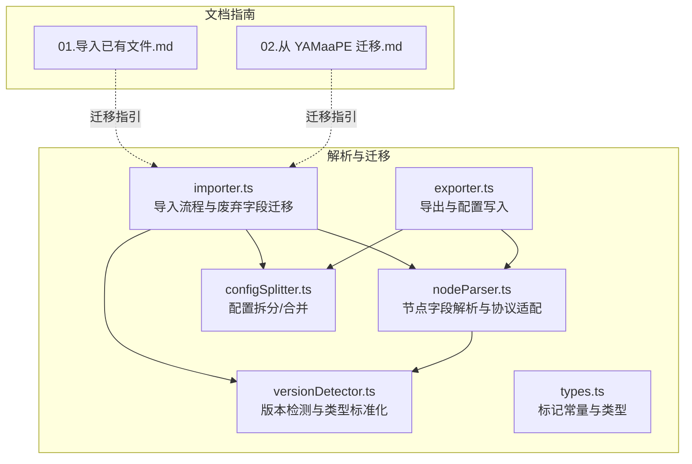
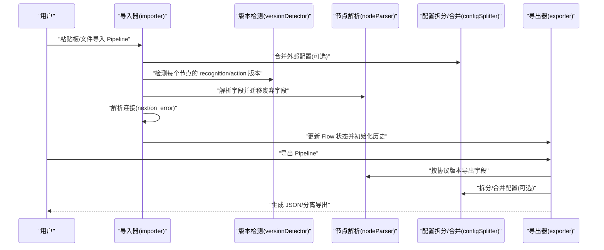
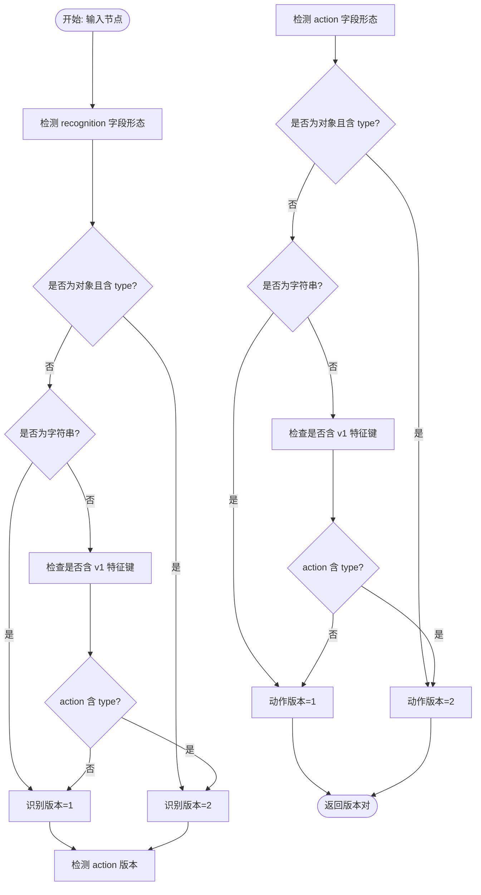
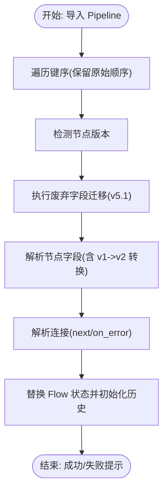
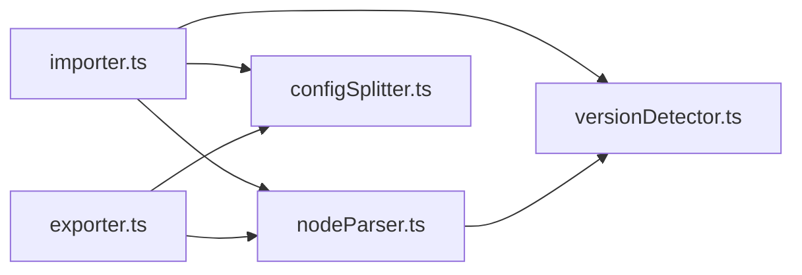

# 版本迁移

<cite>
**本文引用的文件**
- [versionDetector.ts](file://src/core/parser/versionDetector.ts)
- [importer.ts](file://src/core/parser/importer.ts)
- [nodeParser.ts](file://src/core/parser/nodeParser.ts)
- [configSplitter.ts](file://src/core/parser/configSplitter.ts)
- [exporter.ts](file://src/core/parser/exporter.ts)
- [types.ts](file://src/core/parser/types.ts)
- [01.导入已有文件.md](file://docsite/docs/01.指南/90.迁移/01.导入已有文件.md)
- [02.从 YAMaaPE 迁移.md](file://docsite/docs/01.指南/90.迁移/02.从 YAMaaPE 迁移.md)
</cite>

## 目录
1. [简介](#简介)
2. [项目结构](#项目结构)
3. [核心组件](#核心组件)
4. [架构总览](#架构总览)
5. [详细组件分析](#详细组件分析)
6. [依赖分析](#依赖分析)
7. [性能考虑](#性能考虑)
8. [故障排查指南](#故障排查指南)
9. [结论](#结论)
10. [附录](#附录)

## 简介
本文面向 MaaPipelineEditor（MPE）的版本迁移能力，系统阐述版本检测机制、迁移策略、废弃字段处理、版本兼容性、迁移验证与最佳实践，并提供迁移失败的处理与恢复方案。重点覆盖：
- 协议版本识别与兼容性检查
- 自动迁移与手动迁移路径
- 废弃字段的重命名、删除与转换
- 向前/向后兼容与破坏性变更处理
- 数据完整性、功能与性能验证
- 迁移失败的回滚与恢复

## 项目结构
围绕版本迁移的关键模块位于前端核心解析器目录，主要文件职责如下：
- 版本检测与标准化：versionDetector.ts
- 导入流程与废弃字段迁移：importer.ts
- 节点字段解析与协议版本适配：nodeParser.ts
- 配置拆分与合并（分离存储模式）：configSplitter.ts
- 导出流程与配置写入：exporter.ts
- 类型与标记常量：types.ts
- 迁移指南文档：01.导入已有文件.md、02.从 YAMaaPE 迁移.md

图表来源
- [versionDetector.ts:1-149](file://src/core/parser/versionDetector.ts#L1-L149)
- [importer.ts:1-508](file://src/core/parser/importer.ts#L1-L508)
- [nodeParser.ts:1-372](file://src/core/parser/nodeParser.ts#L1-L372)
- [configSplitter.ts:1-486](file://src/core/parser/configSplitter.ts#L1-L486)
- [exporter.ts:1-244](file://src/core/parser/exporter.ts#L1-L244)
- [types.ts:1-107](file://src/core/parser/types.ts#L1-L107)

章节来源
- [versionDetector.ts:1-149](file://src/core/parser/versionDetector.ts#L1-L149)
- [importer.ts:1-508](file://src/core/parser/importer.ts#L1-L508)
- [nodeParser.ts:1-372](file://src/core/parser/nodeParser.ts#L1-L372)
- [configSplitter.ts:1-486](file://src/core/parser/configSplitter.ts#L1-L486)
- [exporter.ts:1-244](file://src/core/parser/exporter.ts#L1-L244)
- [types.ts:1-107](file://src/core/parser/types.ts#L1-L107)
- [01.导入已有文件.md:1-160](file://docsite/docs/01.指南/90.迁移/01.导入已有文件.md#L1-L160)
- [02.从 YAMaaPE 迁移.md:1-17](file://docsite/docs/01.指南/90.迁移/02.从 YAMaaPE 迁移.md#L1-L17)

## 核心组件
- 版本检测与标准化
  - 识别节点的 recognition/action 字段版本（v1/v2），并提供类型标准化函数，确保大小写与枚举一致性。
- 导入流程与废弃字段迁移
  - 在导入阶段执行废弃字段迁移（如 v5.1 的 interrupt、is_sub 等），并兼容 v1/v2 协议。
- 节点字段解析与协议适配
  - 根据版本解析 recognition/action 参数，进行字段转换（如 method 值迁移）。
- 配置拆分与合并
  - 支持分离存储模式，将布局、锚点、便签、分组等配置与节点数据分离，便于版本演进。
- 导出流程与配置写入
  - 导出时写入版本信息与配置，支持强制导出配置与分离导出。

章节来源
- [versionDetector.ts:23-149](file://src/core/parser/versionDetector.ts#L23-L149)
- [importer.ts:44-227](file://src/core/parser/importer.ts#L44-L227)
- [nodeParser.ts:267-371](file://src/core/parser/nodeParser.ts#L267-L371)
- [configSplitter.ts:21-141](file://src/core/parser/configSplitter.ts#L21-L141)
- [exporter.ts:42-210](file://src/core/parser/exporter.ts#L42-L210)

## 架构总览
MPE 的版本迁移贯穿“导入—解析—连接—导出”全链路，关键流程如下：

图表来源
- [importer.ts:155-507](file://src/core/parser/importer.ts#L155-L507)
- [versionDetector.ts:23-110](file://src/core/parser/versionDetector.ts#L23-L110)
- [nodeParser.ts:322-371](file://src/core/parser/nodeParser.ts#L322-L371)
- [configSplitter.ts:151-448](file://src/core/parser/configSplitter.ts#L151-L448)
- [exporter.ts:42-244](file://src/core/parser/exporter.ts#L42-L244)

## 详细组件分析

### 版本检测机制
- 节点版本识别
  - recognition/action 字段版本通过字段形态判断：v2 为对象且包含 type；v1 为字符串。
  - 若节点包含 v1 特征键（来自字段模式表），则按是否存在 type 推断版本。
- 类型标准化
  - 识别算法类型与动作类型均进行大小写与枚举标准化，异常时抛错提示。
- 复杂度与性能
  - 版本检测为 O(k)（k 为节点键数），整体开销极低，适合批量节点扫描。

图表来源
- [versionDetector.ts:23-110](file://src/core/parser/versionDetector.ts#L23-L110)

章节来源
- [versionDetector.ts:23-149](file://src/core/parser/versionDetector.ts#L23-L149)

### 迁移策略与废弃字段处理
- 自动迁移
  - 在导入阶段对 v5.1 的废弃字段执行迁移：将 interrupt 合并到 next，并为引用的子节点添加 JumpBack 前缀或 jump_back 属性；删除 is_sub 字段。
- 手动迁移
  - 文档建议在导入前统一前缀、迁移 YAMaaPE 特殊字段（MaaFramework 4.5 前后字段），再以 v1 导入，随后以 v2 导入完成适配。
- 回滚机制
  - 导入失败时弹窗提示并记录错误，用户可在编辑器内修复后重新导入；导出时可强制导出配置以便后续回溯。

图表来源
- [importer.ts:155-507](file://src/core/parser/importer.ts#L155-L507)

章节来源
- [importer.ts:44-227](file://src/core/parser/importer.ts#L44-L227)
- [01.导入已有文件.md:70-137](file://docsite/docs/01.指南/90.迁移/01.导入已有文件.md#L70-L137)
- [02.从 YAMaaPE 迁移.md:10-17](file://docsite/docs/01.指南/90.迁移/02.从 YAMaaPE 迁移.md#L10-L17)

### 版本兼容性与协议演进
- 向前兼容
  - v1 协议的字符串型 recognition/action 在 v2 解析器中被标准化并包装为对象；同时保留 v1 平铺参数导出能力。
- 向后兼容
  - v2 导出时可选择写入默认识别/动作，以满足 v1 导入器兼容。
- 破坏性变更处理
  - 通过 detectNodeVersion 与 parseNodeField 的版本分支处理，确保字段迁移（如 method 值转换）与类型标准化在导入期完成。

章节来源
- [nodeParser.ts:267-371](file://src/core/parser/nodeParser.ts#L267-L371)
- [exporter.ts:81-117](file://src/core/parser/exporter.ts#L81-L117)

### 迁移验证与质量保障
- 数据完整性检查
  - 导出前校验节点名重复等错误，防止生成非法结构。
- 功能验证
  - 导入后自动布局（可选），并支持分离存储模式导出，便于人工核对。
- 性能测试
  - 导入流程对大文件（示例达上千行）具备可用性；复杂分支/合并关系可能影响布局美观，属于“非可视编程与可视编程思路差异”。

章节来源
- [exporter.ts:42-82](file://src/core/parser/exporter.ts#L42-L82)
- [01.导入已有文件.md:139-160](file://docsite/docs/01.指南/90.迁移/01.导入已有文件.md#L139-L160)

## 依赖分析
- 组件耦合
  - importer 依赖 versionDetector 与 nodeParser，负责整体迁移与解析。
  - nodeParser 依赖 versionDetector 的类型标准化函数，保证字段一致性。
  - exporter 依赖 nodeParser 与 configSplitter，负责最终产物与配置写入。
- 外部依赖
  - JSONC 解析与访问（保留键序）、Ant Design 的模态/通知组件用于错误提示与交互。

图表来源
- [importer.ts:34-42](file://src/core/parser/importer.ts#L34-L42)
- [nodeParser.ts:14-14](file://src/core/parser/nodeParser.ts#L14-L14)
- [exporter.ts:27-35](file://src/core/parser/exporter.ts#L27-L35)

章节来源
- [importer.ts:1-508](file://src/core/parser/importer.ts#L1-L508)
- [nodeParser.ts:1-372](file://src/core/parser/nodeParser.ts#L1-L372)
- [exporter.ts:1-244](file://src/core/parser/exporter.ts#L1-L244)

## 性能考虑
- 导入阶段的键序遍历与 JSONC 访问对大文件有一定开销，但通过保留原始键序与按需解析，避免不必要的二次序列化。
- 自动布局仅基于连接关系“理顺”，复杂拓扑可能导致视觉不美观，建议在 MPE 内完成新文件维护，减少跨版本迁移频率。

## 故障排查指南
- 导入失败
  - 现象：弹出“导入失败”提示，控制台打印错误。
  - 排查：检查 Pipeline 格式、版本一致性；确认无重复节点名；必要时启用分离导出核对配置。
- 类型错误
  - 现象：类型标准化抛错。
  - 排查：确认识别算法类型与动作类型在允许枚举范围内，修正大小写或拼写。
- 连接异常
  - 现象：next/on_error 引用不生效或跳转异常。
  - 排查：确认引用节点存在且未被删除；检查 JumpBack 前缀或 jump_back 属性是否正确迁移。

章节来源
- [importer.ts:498-507](file://src/core/parser/importer.ts#L498-L507)
- [versionDetector.ts:118-148](file://src/core/parser/versionDetector.ts#L118-L148)
- [exporter.ts:42-82](file://src/core/parser/exporter.ts#L42-L82)

## 结论
MPE 的版本迁移以“导入期检测与迁移 + 导出期配置写入”为核心，结合 v1/v2 协议的双向兼容与废弃字段的自动转换，有效降低了跨版本迁移成本。配合分离存储与自动布局，用户可在可视化环境下高效完成迁移与验证。

## 附录

### 最佳实践与注意事项
- 优先在 MPE 内维护新建文件，避免引入非预期的不兼容与布局问题。
- 导入前统一前缀、迁移 YAMaaPE 特殊字段，再以 v1 导入，随后以 v2 导入完成适配。
- 使用分离存储导出，便于人工核对与版本回溯。
- 导入失败时，优先检查格式、类型与连接引用，再尝试重新导入。

章节来源
- [01.导入已有文件.md:14-18](file://docsite/docs/01.指南/90.迁移/01.导入已有文件.md#L14-L18)
- [02.从 YAMaaPE 迁移.md:10-17](file://docsite/docs/01.指南/90.迁移/02.从 YAMaaPE 迁移.md#L10-L17)