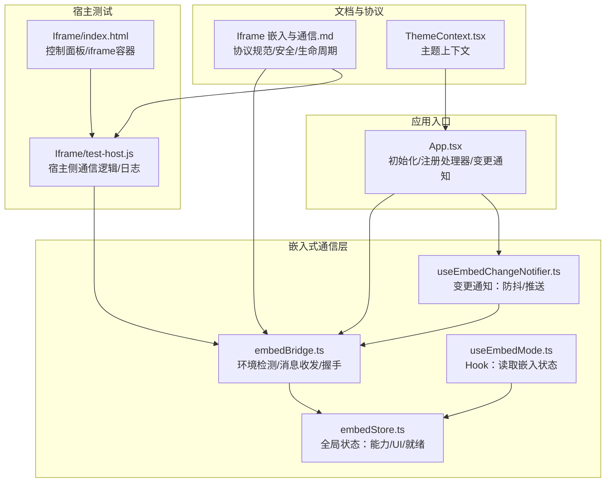
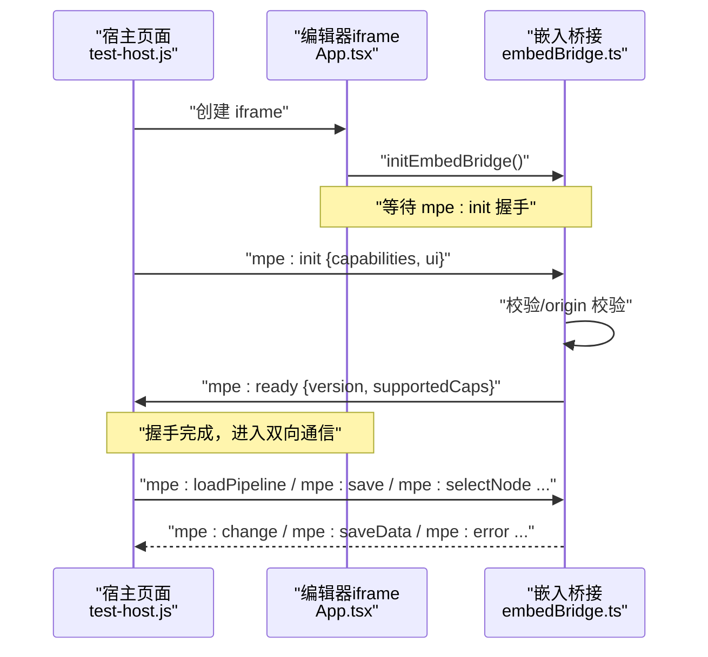
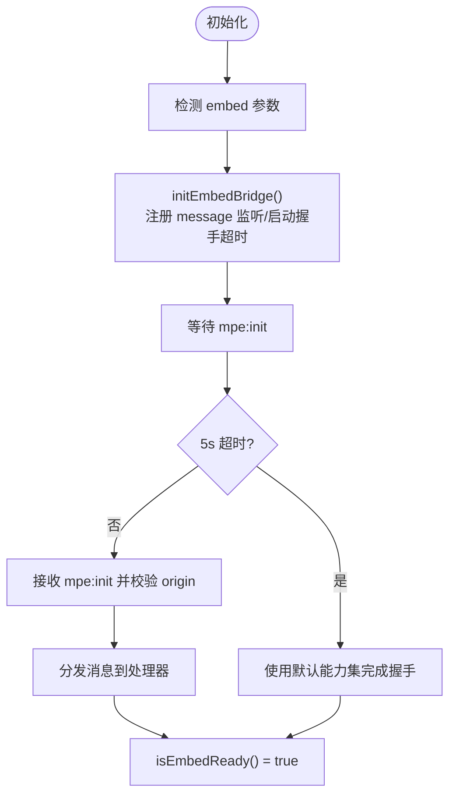
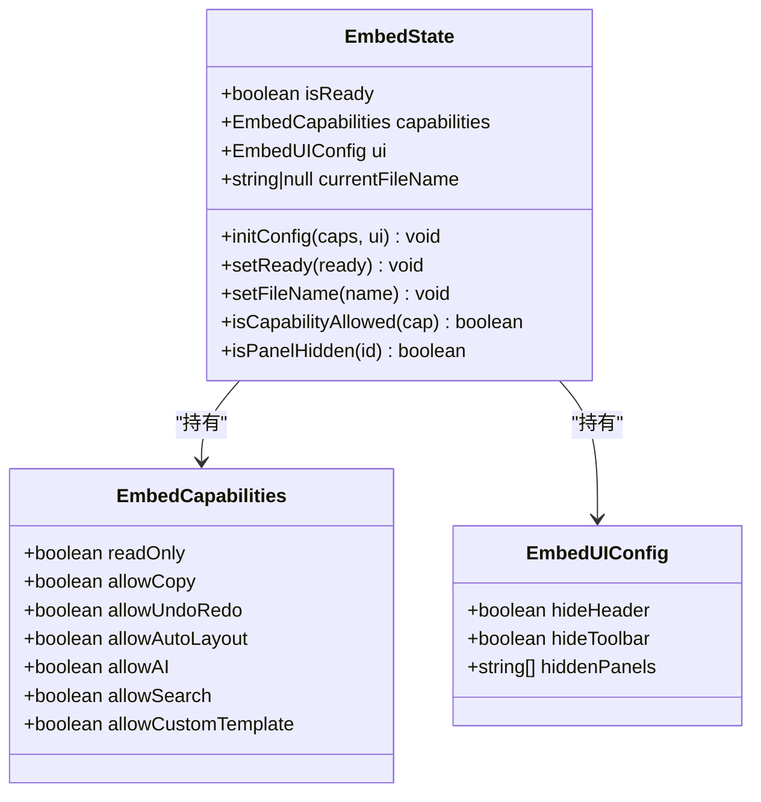
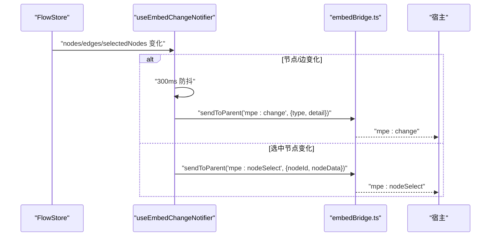
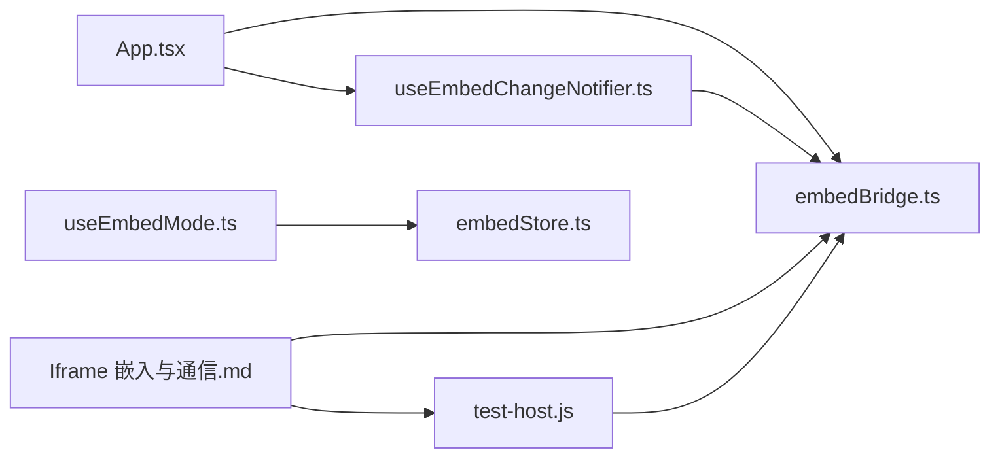

# 嵌入式支持

<cite>
**本文档引用的文件**
- [embedBridge.ts](file://src/utils/embedBridge.ts)
- [embedStore.ts](file://src/stores/embedStore.ts)
- [useEmbedMode.ts](file://src/hooks/useEmbedMode.ts)
- [useEmbedChangeNotifier.ts](file://src/hooks/useEmbedChangeNotifier.ts)
- [App.tsx](file://src/App.tsx)
- [index.html](file://Iframe/index.html)
- [test-host.js](file://Iframe/test-host.js)
- [Iframe 嵌入与通信.md](file://docsite/docs/01.指南/95.开发与调试/20.Iframe 嵌入与通信.md)
- [ThemeContext.tsx](file://src/contexts/ThemeContext.tsx)
- [BaseProtocol.ts](file://src/services/protocols/BaseProtocol.ts)
- [ConfigProtocol.ts](file://src/services/protocols/ConfigProtocol.ts)
- [FileProtocol.ts](file://src/services/protocols/FileProtocol.ts)
</cite>

## 目录
1. [简介](#简介)
2. [项目结构](#项目结构)
3. [核心组件](#核心组件)
4. [架构总览](#架构总览)
5. [详细组件分析](#详细组件分析)
6. [依赖关系分析](#依赖关系分析)
7. [性能考量](#性能考量)
8. [故障排查指南](#故障排查指南)
9. [结论](#结论)
10. [附录](#附录)

## 简介
本文件系统性梳理嵌入式支持功能，围绕 iframe 嵌入机制、消息桥接协议、能力控制与权限管理、UI 配置与主题定制、状态同步与事件传递、生命周期管理与资源隔离、安全与跨域通信、以及最佳实践与性能优化进行深入解析，并辅以可视化图示帮助不同背景读者理解。

## 项目结构
嵌入式支持主要分布在以下模块：
- 通信桥接层：负责检测嵌入环境、建立 postMessage 通道、握手与消息分发
- 全局状态层：集中管理嵌入模式的能力与 UI 配置、就绪状态
- 业务钩子层：为组件提供便捷的嵌入模式状态读取与变更通知
- 宿主测试环境：提供 iframe 嵌入与协议测试的完整示例
- 文档与规范：协议版本、消息类型、安全与生命周期说明

**图表来源**
- [embedBridge.ts:1-282](file://src/utils/embedBridge.ts#L1-L282)
- [embedStore.ts:1-60](file://src/stores/embedStore.ts#L1-L60)
- [useEmbedMode.ts:1-30](file://src/hooks/useEmbedMode.ts#L1-L30)
- [useEmbedChangeNotifier.ts:1-136](file://src/hooks/useEmbedChangeNotifier.ts#L1-L136)
- [App.tsx:180-207](file://src/App.tsx#L180-L207)
- [index.html:1-175](file://Iframe/index.html#L1-L175)
- [test-host.js:1-449](file://Iframe/test-host.js#L1-L449)
- [Iframe 嵌入与通信.md:1-577](file://docsite/docs/01.指南/95.开发与调试/20.Iframe 嵌入与通信.md#L1-L577)
- [ThemeContext.tsx:1-67](file://src/contexts/ThemeContext.tsx#L1-L67)

**章节来源**
- [embedBridge.ts:1-282](file://src/utils/embedBridge.ts#L1-L282)
- [embedStore.ts:1-60](file://src/stores/embedStore.ts#L1-L60)
- [useEmbedMode.ts:1-30](file://src/hooks/useEmbedMode.ts#L1-L30)
- [useEmbedChangeNotifier.ts:1-136](file://src/hooks/useEmbedChangeNotifier.ts#L1-L136)
- [App.tsx:180-207](file://src/App.tsx#L180-L207)
- [index.html:1-175](file://Iframe/index.html#L1-L175)
- [test-host.js:1-449](file://Iframe/test-host.js#L1-L449)
- [Iframe 嵌入与通信.md:1-577](file://docsite/docs/01.指南/95.开发与调试/20.Iframe 嵌入与通信.md#L1-L577)
- [ThemeContext.tsx:1-67](file://src/contexts/ThemeContext.tsx#L1-L67)

## 核心组件
- 嵌入桥接模块：提供环境检测、消息封装、处理器注册、握手完成与就绪查询
- 嵌入全局状态：集中存储能力声明、UI 配置、就绪状态与当前文件名，并提供能力判断与面板隐藏判断
- 嵌入模式 Hook：为组件层提供 isEmbed/isReady/capabilities/ui/isCapAllowed/isPanelHidden 的便捷访问
- 变更通知 Hook：订阅流程状态变化，进行防抖与推送，支持节点/边增删改与选中节点即时通知
- 宿主测试环境：提供 iframe 创建/销毁、能力开关、UI 配置、消息发送与日志记录的完整示例

**章节来源**
- [embedBridge.ts:1-282](file://src/utils/embedBridge.ts#L1-L282)
- [embedStore.ts:1-60](file://src/stores/embedStore.ts#L1-L60)
- [useEmbedMode.ts:1-30](file://src/hooks/useEmbedMode.ts#L1-L30)
- [useEmbedChangeNotifier.ts:1-136](file://src/hooks/useEmbedChangeNotifier.ts#L1-L136)
- [index.html:1-175](file://Iframe/index.html#L1-L175)
- [test-host.js:1-449](file://Iframe/test-host.js#L1-L449)

## 架构总览
嵌入式架构采用“宿主-编辑器”双端协作模型：
- 宿主通过 iframe 加载编辑器，双方通过 postMessage 交换协议消息
- 编辑器在嵌入模式下不依赖后端服务，所有文件操作由宿主代理
- 握手阶段完成能力声明与 UI 配置下发，随后进入双向通信
- 变更通知采用尽力而为的推送机制，精确同步建议通过显式保存/查询

**图表来源**
- [App.tsx:180-207](file://src/App.tsx#L180-L207)
- [embedBridge.ts:179-281](file://src/utils/embedBridge.ts#L179-L281)
- [test-host.js:253-427](file://Iframe/test-host.js#L253-L427)
- [Iframe 嵌入与通信.md:63-86](file://docsite/docs/01.指南/95.开发与调试/20.Iframe 嵌入与通信.md#L63-L86)

## 详细组件分析

### 嵌入桥接模块（embedBridge.ts）
- 功能要点
  - 环境检测：通过 URL 参数判断是否为嵌入模式
  - 消息封装：统一协议标识、版本、类型、requestId 与 payload
  - 处理器注册：支持多处理器订阅同类型消息
  - 握手流程：限定握手阶段仅接受 mpe:init；超时则使用默认能力集
  - 安全校验：origin 参数为 URL 时执行 event.origin 严格匹配
- 关键接口
  - isEmbedEnvironment()/getEmbedOrigin()/getCurrentOrigin()
  - sendToParent()/onParentMessage()/offParentMessage()
  - initEmbedBridge()/completeHandshake()/isEmbedReady()

**图表来源**
- [embedBridge.ts:75-281](file://src/utils/embedBridge.ts#L75-L281)

**章节来源**
- [embedBridge.ts:1-282](file://src/utils/embedBridge.ts#L1-L282)

### 嵌入全局状态（embedStore.ts）
- 功能要点
  - 集中管理嵌入模式的能力与 UI 配置
  - 提供 initConfig() 合并部分配置
  - 提供 setReady()/setFileName() 状态维护
  - 提供 isCapabilityAllowed()/isPanelHidden() 查询
- 与桥接模块的关系
  - 桥接模块在握手完成后将宿主声明的能力与 UI 写入全局状态
  - 组件层通过 useEmbedMode() 读取状态并驱动 UI 行为

**图表来源**
- [embedStore.ts:14-59](file://src/stores/embedStore.ts#L14-L59)
- [embedBridge.ts:19-58](file://src/utils/embedBridge.ts#L19-L58)

**章节来源**
- [embedStore.ts:1-60](file://src/stores/embedStore.ts#L1-L60)
- [embedBridge.ts:1-58](file://src/utils/embedBridge.ts#L1-L58)

### 嵌入模式 Hook（useEmbedMode.ts）
- 功能要点
  - 读取 isEmbed/isReady
  - 读取 capabilities/ui
  - 提供 isCapAllowed/isPanelHidden 便捷判断
- 使用场景
  - 组件根据 isEmbed/isReady 决定是否启用嵌入模式 UI
  - 根据 isCapAllowed 控制按钮/菜单项可见性
  - 根据 isPanelHidden 控制面板显隐

**章节来源**
- [useEmbedMode.ts:1-30](file://src/hooks/useEmbedMode.ts#L1-L30)
- [embedStore.ts:1-60](file://src/stores/embedStore.ts#L1-L60)

### 变更通知 Hook（useEmbedChangeNotifier.ts）
- 功能要点
  - 订阅节点/边/选中节点变化
  - 节点/边变更：300ms 防抖后发送 mpe:change
  - 选中节点：即时发送 mpe:nodeSelect
  - 变更类型推断：add/delete/update
- 与应用入口的集成
  - App.tsx 在嵌入且就绪时启用变更通知

**图表来源**
- [useEmbedChangeNotifier.ts:18-136](file://src/hooks/useEmbedChangeNotifier.ts#L18-L136)
- [embedBridge.ts:120-128](file://src/utils/embedBridge.ts#L120-L128)

**章节来源**
- [useEmbedChangeNotifier.ts:1-136](file://src/hooks/useEmbedChangeNotifier.ts#L1-L136)
- [App.tsx:180-181](file://src/App.tsx#L180-L181)

### 宿主测试环境（index.html + test-host.js）
- 功能要点
  - 提供 iframe URL 输入、创建/销毁按钮
  - 能力开关与 UI 配置面板
  - 所有消息类型的发送按钮与日志输出
  - 请求-响应超时处理
- 与协议规范的映射
  - mpe:init/mpe:ready 握手
  - mpe:loadPipeline/mpe:save/mpe:selectNode/mpe:focusNode/mpe:state
  - mpe:change/mpe:saveRequest/mpe:error 等推送消息

**章节来源**
- [index.html:1-175](file://Iframe/index.html#L1-L175)
- [test-host.js:1-449](file://Iframe/test-host.js#L1-L449)
- [Iframe 嵌入与通信.md:88-218](file://docsite/docs/01.指南/95.开发与调试/20.Iframe 嵌入与通信.md#L88-L218)

### 协议规范与安全（Iframe 嵌入与通信.md）
- 协议版本：1.0.0
- 消息格式：统一信封，包含 protocol/version/type/requestId/payload
- 握手流程：mpe:init → mpe:ready，握手超时使用默认能力集
- 安全考量：严格 origin 校验（URL 形式）；版本策略遵循语义化版本
- 生命周期：创建 iframe → 等待握手 → 正常通信 → 销毁清理

**章节来源**
- [Iframe 嵌入与通信.md:47-86](file://docsite/docs/01.指南/95.开发与调试/20.Iframe 嵌入与通信.md#L47-L86)
- [Iframe 嵌入与通信.md:334-351](file://docsite/docs/01.指南/95.开发与调试/20.Iframe 嵌入与通信.md#L334-L351)
- [Iframe 嵌入与通信.md:305-332](file://docsite/docs/01.指南/95.开发与调试/20.Iframe 嵌入与通信.md#L305-L332)

### 能力控制与权限管理
- 能力声明字段：readOnly、allowCopy、allowUndoRedo、allowAutoLayout、allowAI、allowSearch、allowCustomTemplate
- 生效方式：编辑器依据能力限制功能可用性与交互行为
- 默认能力集：在未握手时启用保守默认值，避免依赖外部服务的功能

**章节来源**
- [embedBridge.ts:19-58](file://src/utils/embedBridge.ts#L19-L58)
- [Iframe 嵌入与通信.md:219-261](file://docsite/docs/01.指南/95.开发与调试/20.Iframe 嵌入与通信.md#L219-L261)

### UI 配置与主题定制
- UI 配置字段：hideHeader、hideToolbar、hiddenPanels
- 面板隐藏清单：field、edge、search、file、config、ai-history、local-file、error、recognition-history、toolbar、logger、exploration
- 主题上下文：通过 ThemeProvider 同步暗黑模式状态至 DarkReader

**章节来源**
- [embedBridge.ts:29-58](file://src/utils/embedBridge.ts#L29-L58)
- [Iframe 嵌入与通信.md:263-294](file://docsite/docs/01.指南/95.开发与调试/20.Iframe 嵌入与通信.md#L263-L294)
- [ThemeContext.tsx:1-67](file://src/contexts/ThemeContext.tsx#L1-L67)

### 状态同步与事件传递机制
- 变更通知：mpe:change（防抖）、mpe:nodeSelect（即时）
- 精确同步：建议使用 mpe:save 获取全量数据，而非依赖变更通知
- 保存代理：宿主监听 mpe:saveRequest 并触发保存流程

**章节来源**
- [useEmbedChangeNotifier.ts:1-136](file://src/hooks/useEmbedChangeNotifier.ts#L1-L136)
- [Iframe 嵌入与通信.md:175-218](file://docsite/docs/01.指南/95.开发与调试/20.Iframe 嵌入与通信.md#L175-L218)

### 嵌入式应用生命周期管理与资源隔离
- 生命周期：创建 iframe → 等待握手 → 正常通信 → 销毁清理
- 资源隔离：嵌入模式不连接后端服务，文件操作由宿主代理；编辑器不暴露设备连接与调试功能
- 跨域通信：通过 postMessage + 协议标识与可选 origin 校验保障安全

**章节来源**
- [Iframe 嵌入与通信.md:12-23](file://docsite/docs/01.指南/95.开发与调试/20.Iframe 嵌入与通信.md#L12-L23)
- [Iframe 嵌入与通信.md:305-332](file://docsite/docs/01.指南/95.开发与调试/20.Iframe 嵌入与通信.md#L305-L332)

## 依赖关系分析
- 组件耦合
  - App.tsx 依赖 embedBridge.ts 完成初始化与处理器注册
  - useEmbedMode.ts 依赖 embedStore.ts 提供状态读取
  - useEmbedChangeNotifier.ts 依赖 embedBridge.ts 发送变更通知
- 外部依赖
  - 宿主测试环境依赖浏览器 postMessage 与 iframe
  - 文档规范定义协议与安全策略

**图表来源**
- [App.tsx:180-207](file://src/App.tsx#L180-L207)
- [embedBridge.ts:179-281](file://src/utils/embedBridge.ts#L179-L281)
- [useEmbedMode.ts:1-30](file://src/hooks/useEmbedMode.ts#L1-L30)
- [embedStore.ts:1-60](file://src/stores/embedStore.ts#L1-L60)
- [useEmbedChangeNotifier.ts:1-136](file://src/hooks/useEmbedChangeNotifier.ts#L1-L136)
- [test-host.js:1-449](file://Iframe/test-host.js#L1-L449)
- [Iframe 嵌入与通信.md:1-577](file://docsite/docs/01.指南/95.开发与调试/20.Iframe 嵌入与通信.md#L1-L577)

**章节来源**
- [App.tsx:180-207](file://src/App.tsx#L180-L207)
- [embedBridge.ts:179-281](file://src/utils/embedBridge.ts#L179-L281)
- [useEmbedMode.ts:1-30](file://src/hooks/useEmbedMode.ts#L1-L30)
- [embedStore.ts:1-60](file://src/stores/embedStore.ts#L1-L60)
- [useEmbedChangeNotifier.ts:1-136](file://src/hooks/useEmbedChangeNotifier.ts#L1-L136)
- [test-host.js:1-449](file://Iframe/test-host.js#L1-L449)
- [Iframe 嵌入与通信.md:1-577](file://docsite/docs/01.指南/95.开发与调试/20.Iframe 嵌入与通信.md#L1-L577)

## 性能考量
- 变更通知防抖：节点/边变更采用 300ms 防抖，降低消息风暴
- 请求-响应超时：宿主侧设置合理超时（建议 10s），避免悬挂请求
- 主题切换：DarkReader 同步切换，避免频繁重绘
- 资源隔离：嵌入模式不加载后端服务，减少网络与内存占用

[本节为通用指导，无需特定文件引用]

## 故障排查指南
- 握手失败
  - 检查宿主是否在 iframe load 后发送 mpe:init
  - 确认 mpe:init 的 requestId 是否正确回填到 mpe:ready
  - 查看宿主日志与编辑器控制台是否有超时或 origin 校验警告
- 消息未达
  - 确认消息携带 protocol/version/type/payload
  - 确认宿主使用 iframe.contentWindow.postMessage 而非 window.postMessage
- 变更通知丢失
  - 变更通知为尽力而为，精确同步请使用 mpe:save
- 节点定位失败
  - 确认 nodeId 或节点标签是否存在；编辑器会尝试按标签回退

**章节来源**
- [Iframe 嵌入与通信.md:84-86](file://docsite/docs/01.指南/95.开发与调试/20.Iframe 嵌入与通信.md#L84-L86)
- [Iframe 嵌入与通信.md:149-161](file://docsite/docs/01.指南/95.开发与调试/20.Iframe 嵌入与通信.md#L149-L161)
- [test-host.js:122-166](file://Iframe/test-host.js#L122-L166)

## 结论
嵌入式支持通过标准化的 postMessage 协议、严格的握手与安全校验、灵活的能力与 UI 配置，实现了宿主与编辑器的低耦合协作。借助变更通知与保存代理机制，宿主可高效地代理文件操作并维持状态一致性。配合测试环境与文档规范，开发者可快速集成并稳定运行嵌入式编辑器。

## 附录
- 协议消息类型与负载参考：见文档“宿主 → MPE 消息”“MPE → 宿主消息”
- VSCode WebView 桥接：通过 acquireVsCodeApi 中继 postMessage
- 本地测试：直接打开 Iframe/index.html 验证所有消息类型

**章节来源**
- [Iframe 嵌入与通信.md:88-218](file://docsite/docs/01.指南/95.开发与调试/20.Iframe 嵌入与通信.md#L88-L218)
- [Iframe 嵌入与通信.md:532-559](file://docsite/docs/01.指南/95.开发与调试/20.Iframe 嵌入与通信.md#L532-L559)
- [index.html:1-175](file://Iframe/index.html#L1-L175)