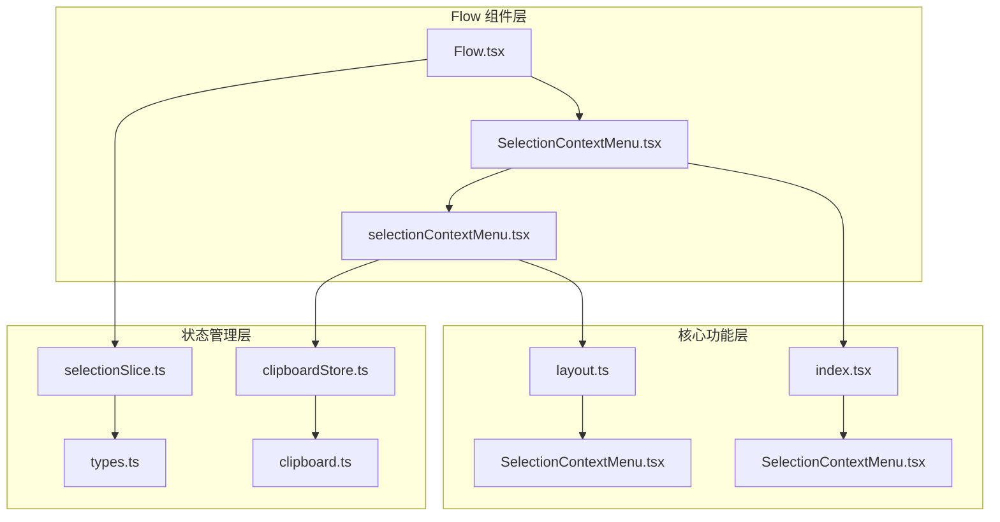
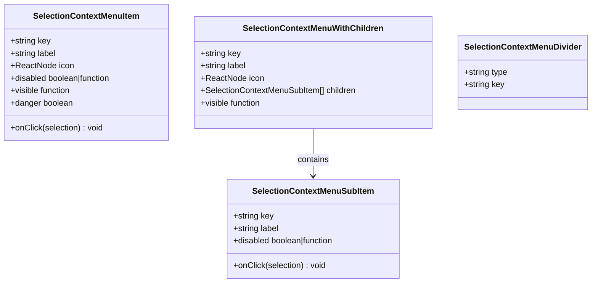
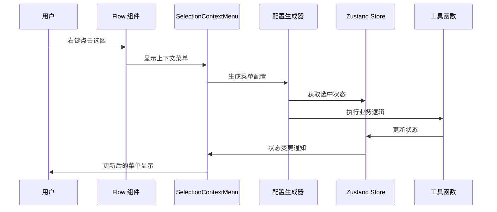
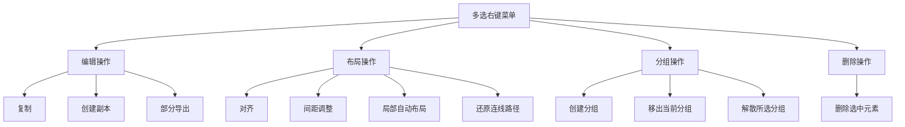
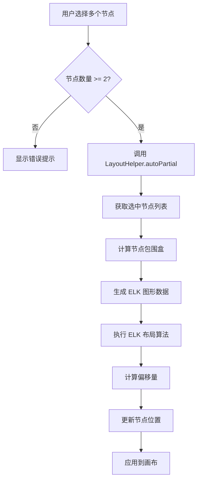
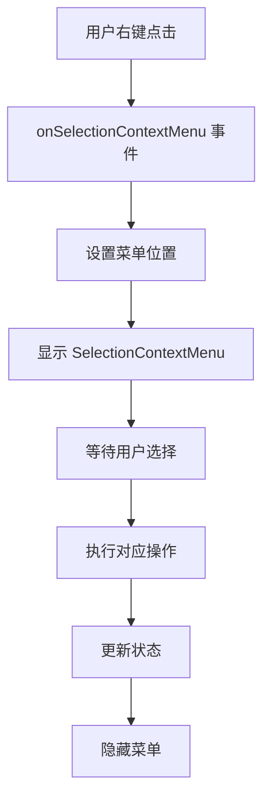
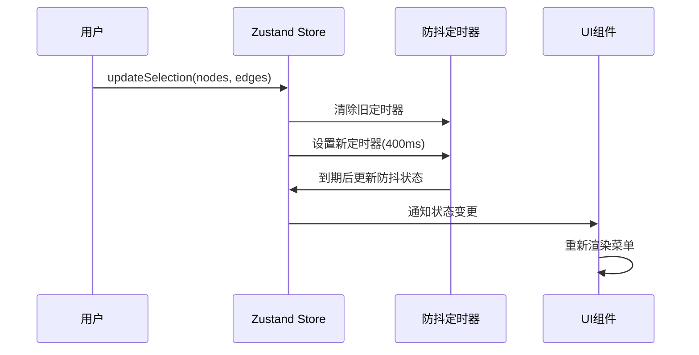
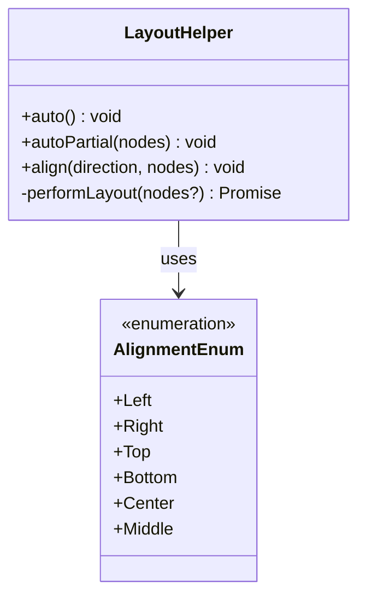

# 多选右键上下文菜单系统

<cite>
**本文档引用的文件**
- [selectionContextMenu.tsx](file://src/components/flow/selectionContextMenu.tsx)
- [SelectionContextMenu.tsx](file://src/components/flow/components/SelectionContextMenu.tsx)
- [Flow.tsx](file://src/components/Flow.tsx)
- [selectionSlice.ts](file://src/stores/flow/slices/selectionSlice.ts)
- [types.ts](file://src/stores/flow/types.ts)
- [layout.ts](file://src/core/layout.ts)
- [clipboard.ts](file://src/utils/clipboard.ts)
- [clipboardStore.ts](file://src/stores/clipboardStore.ts)
- [index.tsx](file://src/components/iconfonts/index.tsx)
</cite>

## 更新摘要
**变更内容**
- 新增"局部自动布局"菜单项，提供针对选中节点的局部布局功能
- 增强布局系统，支持全局和局部两种布局模式
- 完善图标系统，新增流程图图标支持

## 目录
1. [简介](#简介)
2. [项目结构](#项目结构)
3. [核心组件](#核心组件)
4. [架构概览](#架构概览)
5. [详细组件分析](#详细组件分析)
6. [依赖关系分析](#依赖关系分析)
7. [性能考虑](#性能考虑)
8. [故障排除指南](#故障排除指南)
9. [结论](#结论)

## 简介

多选右键上下文菜单系统是 MAA Pipeline Editor 中的一个重要交互功能，它为用户提供了丰富的批量操作能力。该系统允许用户通过右键点击选中的多个节点和边来执行各种操作，包括复制、粘贴、删除、对齐、分组等高级功能。

该系统采用模块化设计，结合了 React 组件、Zustand 状态管理、Ant Design 菜单组件和自定义图标系统，为用户提供直观且高效的批量操作体验。

**更新** 新增了"局部自动布局"功能，为用户提供更精细的布局控制能力，配合现有的全局布局功能形成完整的布局解决方案。

## 项目结构

多选右键上下文菜单系统主要分布在以下目录结构中：



**图表来源**
- [Flow.tsx:195-584](file://src/components/Flow.tsx#L195-L584)
- [SelectionContextMenu.tsx:1-162](file://src/components/flow/components/SelectionContextMenu.tsx#L1-L162)
- [selectionContextMenu.tsx:1-505](file://src/components/flow/selectionContextMenu.tsx#L1-L505)

**章节来源**
- [Flow.tsx:195-584](file://src/components/Flow.tsx#L195-L584)
- [SelectionContextMenu.tsx:1-162](file://src/components/flow/components/SelectionContextMenu.tsx#L1-L162)
- [selectionContextMenu.tsx:1-505](file://src/components/flow/selectionContextMenu.tsx#L1-L505)

## 核心组件

### SelectionContextMenu 配置系统

系统的核心是一个灵活的配置驱动的菜单生成器，支持多种菜单项类型：

- **普通菜单项**：包含基本操作如复制、粘贴、删除
- **子菜单**：提供分组操作（创建分组、移出分组、解散分组）
- **分割线**：用于视觉分组和逻辑分组
- **嵌套子菜单**：支持多级菜单结构

### 菜单项类型定义



**图表来源**
- [selectionContextMenu.tsx:15-58](file://src/components/flow/selectionContextMenu.tsx#L15-L58)

**章节来源**
- [selectionContextMenu.tsx:15-58](file://src/components/flow/selectionContextMenu.tsx#L15-L58)

## 架构概览

多选右键上下文菜单系统采用分层架构设计，确保各层职责清晰分离：



**图表来源**
- [Flow.tsx:485-492](file://src/components/Flow.tsx#L485-L492)
- [SelectionContextMenu.tsx:50-159](file://src/components/flow/components/SelectionContextMenu.tsx#L50-L159)
- [selectionContextMenu.tsx:322-504](file://src/components/flow/selectionContextMenu.tsx#L322-L504)

## 详细组件分析

### SelectionContextMenu 主组件

SelectionContextMenu 是整个系统的入口组件，负责渲染和管理上下文菜单的状态：

#### 核心功能特性

1. **响应式菜单生成**：根据当前选中状态动态生成菜单项
2. **条件可见性控制**：基于选中节点类型和数量控制菜单项显示
3. **禁用状态管理**：智能禁用不适用的操作选项
4. **图标系统集成**：统一的图标管理和渲染

#### 菜单项分类

系统提供以下主要操作类别：



**更新** 新增"局部自动布局"菜单项，提供针对选中节点的智能布局功能。

**图表来源**
- [selectionContextMenu.tsx:322-504](file://src/components/flow/selectionContextMenu.tsx#L322-L504)

**章节来源**
- [SelectionContextMenu.tsx:16-162](file://src/components/flow/components/SelectionContextMenu.tsx#L16-L162)

### selectionContextMenu 配置生成器

配置生成器负责根据当前选中状态动态生成菜单配置：

#### 选区相关辅助函数

系统提供了多个辅助函数来处理选区相关的操作：

- `getSelectionRelatedEdges()`: 获取与选中节点相关的边
- `getSelectionConnectedEdges()`: 获取与选中节点相连的边
- `hasMultiSelectedNodes()`: 检查是否选择了多个节点
- `hasGroupNodes()`: 检查是否包含分组节点
- `hasNonGroupNodes()`: 检查是否包含非分组节点

#### 操作处理函数

每个菜单项都对应一个处理函数：

- **复制操作**：`handleCopySelection()`
- **创建副本**：`handleDuplicateSelection()`
- **部分导出**：`handlePartialExport()`
- **删除操作**：`handleDeleteSelection()`
- **对齐操作**：`handleAlignSelection()`
- **间距调整**：`handleShiftSelection()`
- **局部自动布局**：`handleAutoLayoutSelection()` **新增**
- **分组操作**：`handleCreateGroup()`, `handleDetachSelectionFromGroup()`, `handleUngroupSelection()`

**更新** 新增 `handleAutoLayoutSelection` 函数，专门处理局部自动布局操作。

#### 局部自动布局功能

**新增** 局部自动布局功能提供了针对选中节点的智能布局能力：



**图表来源**
- [selectionContextMenu.tsx:295-304](file://src/components/flow/selectionContextMenu.tsx#L295-L304)
- [layout.ts:36-148](file://src/core/layout.ts#L36-L148)

**章节来源**
- [selectionContextMenu.tsx:60-504](file://src/components/flow/selectionContextMenu.tsx#L60-L504)

### Flow.tsx 集成层

Flow.tsx 作为主容器组件，负责将上下文菜单系统集成到整个应用中：

#### 右键事件处理

Flow.tsx 监听 `onSelectionContextMenu` 事件来触发上下文菜单：



**图表来源**
- [Flow.tsx:485-492](file://src/components/Flow.tsx#L485-L492)

**章节来源**
- [Flow.tsx:485-492](file://src/components/Flow.tsx#L485-L492)

### 状态管理系统

系统使用 Zustand 作为状态管理解决方案，提供高效的状态更新机制：

#### 选择状态切片

selectionSlice.ts 定义了完整的选择状态管理：

- **实时选择状态**：`selectedNodes`, `selectedEdges`
- **防抖选择状态**：`debouncedSelectedNodes`, `debouncedSelectedEdges`
- **目标节点状态**：`targetNode`, `debouncedTargetNode`
- **防抖定时器管理**：全局防抖定时器

#### 状态更新策略

系统采用防抖机制来优化性能：



**图表来源**
- [selectionSlice.ts:12-101](file://src/stores/flow/slices/selectionSlice.ts#L12-L101)

**章节来源**
- [selectionSlice.ts:12-101](file://src/stores/flow/slices/selectionSlice.ts#L12-L101)

### 布局和对齐系统

系统集成了强大的布局和对齐功能：

#### 对齐枚举定义



**更新** 新增 `autoPartial` 方法，支持局部自动布局功能。

**图表来源**
- [layout.ts:6-220](file://src/core/layout.ts#L6-L220)

**章节来源**
- [layout.ts:6-220](file://src/core/layout.ts#L6-L220)

### 剪贴板集成系统

系统提供了完整的剪贴板操作支持：

#### 内部剪贴板实现

clipboardStore.ts 提供了内部剪贴板功能：

- **内存存储**：在应用内存中存储复制的节点和边
- **内容检查**：`hasContent()` 方法检查剪贴板是否有内容
- **异步操作**：支持异步的复制和粘贴操作

#### 浏览器剪贴板集成

clipboard.ts 封装了浏览器原生剪贴板 API：

- **字符串操作**：`writeString()` 和 `read()` 方法
- **对象序列化**：自动将对象转换为 JSON 字符串
- **错误处理**：完善的异常处理和用户反馈

**章节来源**
- [clipboardStore.ts:13-50](file://src/stores/clipboardStore.ts#L13-L50)
- [clipboard.ts:3-63](file://src/utils/clipboard.ts#L3-L63)

## 依赖关系分析

多选右键上下文菜单系统具有清晰的依赖关系：

```mermaid
graph TB
subgraph "外部依赖"
A[React]
B[Ant Design]
C[Zustand]
D[@xyflow/react]
E[ELKJS]
end
subgraph "内部模块"
F[Flow.tsx]
G[SelectionContextMenu.tsx]
H[selectionContextMenu.tsx]
I[selectionSlice.ts]
J[layout.ts]
K[clipboard.ts]
L[clipboardStore.ts]
end
F --> G
G --> H
H --> I
H --> J
H --> K
H --> L
F --> I
G --> A
G --> B
H --> C
F --> D
J --> E
```

**更新** 新增 ELKJS 依赖，用于支持智能布局算法。

**图表来源**
- [Flow.tsx:30-42](file://src/components/Flow.tsx#L30-L42)
- [SelectionContextMenu.tsx:1-14](file://src/components/flow/components/SelectionContextMenu.tsx#L1-L14)
- [selectionContextMenu.tsx:1-8](file://src/components/flow/selectionContextMenu.tsx#L1-L8)
- [layout.ts:1-5](file://src/core/layout.ts#L1-L5)

### 关键依赖关系

1. **React 生态系统**：使用 React Hooks 和组件生命周期
2. **Ant Design**：提供 UI 组件和图标系统
3. **Zustand**：轻量级状态管理解决方案
4. **@xyflow/react**：提供画布和节点操作能力
5. **ELKJS**：提供智能布局算法支持 **新增**
6. **自定义图标系统**：集成丰富的图标资源

**章节来源**
- [Flow.tsx:30-42](file://src/components/Flow.tsx#L30-L42)
- [SelectionContextMenu.tsx:1-14](file://src/components/flow/components/SelectionContextMenu.tsx#L1-L14)
- [selectionContextMenu.tsx:1-8](file://src/components/flow/selectionContextMenu.tsx#L1-L8)

## 性能考虑

系统在设计时充分考虑了性能优化：

### 防抖机制

- **400ms 防抖延迟**：避免频繁的状态更新导致的性能问题
- **全局定时器管理**：防止内存泄漏和重复定时器
- **选择状态分离**：区分实时状态和防抖状态

### 渲染优化

- **memo 包装**：使用 React.memo 优化组件渲染
- **useShallow 选择器**：精确控制状态订阅范围
- **条件渲染**：仅在需要时重新生成菜单配置

### 内存管理

- **及时清理**：菜单关闭时自动清理状态
- **引用优化**：避免不必要的对象创建
- **事件监听器管理**：正确处理事件绑定和解绑

### 布局性能优化

**新增** 局部自动布局功能采用了多项性能优化措施：

- **请求动画帧调度**：使用 `requestAnimationFrame` 优化布局计算时机
- **节点测量检查**：确保所有节点都有准确的尺寸信息
- **智能重试机制**：当节点尚未测量完成时自动重试
- **局部布局优化**：仅处理选中的节点和相关边，提高计算效率

## 故障排除指南

### 常见问题及解决方案

#### 菜单不显示问题

**症状**：右键点击后菜单不出现

**可能原因**：
1. 选区状态未正确更新
2. ReactFlow 实例未初始化完成
3. 事件处理器未正确绑定

**解决方法**：
1. 检查 `updateSelection` 函数是否被调用
2. 确认 ReactFlow 实例存在
3. 验证 `onSelectionContextMenu` 事件处理器

#### 菜单项不可用问题

**症状**：菜单项显示为灰色但应该可用

**可能原因**：
1. `disabled` 函数返回 `true`
2. 选中状态不符合操作要求
3. 条件函数逻辑错误

**解决方法**：
1. 检查对应的 `disabled` 函数实现
2. 验证选中节点的数量和类型
3. 确认条件判断逻辑

#### 操作执行失败问题

**症状**：点击菜单项后操作没有效果

**可能原因**：
1. 状态更新函数未正确调用
2. 异步操作处理异常
3. ReactFlow 实例方法调用失败

**解决方法**：
1. 检查状态更新函数的调用链
2. 添加适当的错误处理和日志记录
3. 验证 ReactFlow 实例的方法可用性

#### 局部自动布局失效问题

**新增** 局部自动布局功能可能出现的问题：

**症状**：点击"局部自动布局"后无反应或布局异常

**可能原因**：
1. 选中节点数量不足（少于2个）
2. 节点尺寸信息未正确测量
3. ELKJS 布局算法执行失败
4. 选中节点间缺少连接关系

**解决方法**：
1. 确保至少选择了2个节点
2. 等待节点测量完成后重试
3. 检查 ELKJS 依赖是否正确加载
4. 确认选中节点之间存在有效的连接关系

**章节来源**
- [selectionContextMenu.tsx:132-200](file://src/components/flow/selectionContextMenu.tsx#L132-L200)
- [SelectionContextMenu.tsx:126-131](file://src/components/flow/components/SelectionContextMenu.tsx#L126-L131)

## 结论

多选右键上下文菜单系统是一个设计精良、功能完备的交互组件。它通过模块化的设计、清晰的分层架构和完善的错误处理机制，为用户提供了强大而易用的批量操作能力。

**更新** 新增的"局部自动布局"功能进一步增强了系统的实用性和灵活性，为用户提供了更精细的布局控制能力。该功能与现有的全局布局功能形成了完整的布局解决方案，满足了不同场景下的布局需求。

### 系统优势

1. **高度模块化**：各组件职责明确，易于维护和扩展
2. **配置驱动**：灵活的菜单配置系统支持动态生成
3. **性能优化**：防抖机制和渲染优化确保流畅体验
4. **错误处理**：完善的异常处理和用户反馈机制
5. **可扩展性**：清晰的接口设计支持功能扩展
6. **智能布局**：集成 ELKJS 提供专业的布局算法支持

### 技术亮点

- **React + Zustand 架构**：现代前端技术栈的最佳实践
- **类型安全**：完整的 TypeScript 类型定义
- **图标系统集成**：统一的视觉设计语言
- **状态管理优化**：高效的防抖和选择状态管理
- **智能布局算法**：基于 ELKJS 的专业布局引擎
- **局部布局支持**：精细化的布局控制能力

该系统为 MAA Pipeline Editor 提供了强大的批量操作能力和智能布局功能，显著提升了用户的操作效率和体验质量。