# 工作流编辑器

<cite>
**本文档引用的文件**
- [App.tsx](file://src/App.tsx)
- [ExplorationFAB.tsx](file://src/components/panels/exploration/ExplorationFAB.tsx)
- [ExplorationPanel.tsx](file://src/components/panels/exploration/ExplorationPanel.tsx)
- [explorationSlice.ts](file://src/stores/flow/slices/explorationSlice.ts)
- [explorationAI.ts](file://src/utils/ai/explorationAI.ts)
- [ExplorationPanel.module.less](file://src/styles/panels/ExplorationPanel.module.less)
- [Flow.tsx](file://src/components/Flow.tsx)
- [edges.tsx](file://src/components/flow/edges.tsx)
- [nodes/index.ts](file://src/components/flow/nodes/index.ts)
- [nodes/constants.ts](file://src/components/flow/nodes/constants.ts)
- [PipelineNode/index.tsx](file://src/components/flow/nodes/PipelineNode/index.tsx)
- [ExternalNode.tsx](file://src/components/flow/nodes/ExternalNode.tsx)
- [AnchorNode.tsx](file://src/components/flow/nodes/AnchorNode.tsx)
- [StickerNode.tsx](file://src/components/flow/nodes/StickerNode.tsx)
- [GroupNode.tsx](file://src/components/flow/nodes/GroupNode.tsx)
- [NodeAddPanel.tsx](file://src/components/panels/main/NodeAddPanel.tsx)
- [types.ts](file://src/stores/flow/types.ts)
- [layout.ts](file://src/core/layout.ts)
- [nodeTemplates.ts](file://src/data/nodeTemplates.ts)
- [nodeSlice.ts](file://src/stores/flow/slices/nodeSlice.ts)
- [edgeSlice.ts](file://src/stores/flow/slices/edgeSlice.ts)
- [PanelConfigSection.tsx](file://src/components/panels/config/PanelConfigSection.tsx)
- [configStore.ts](file://src/stores/configStore.ts)
- [edges.module.less](file://src/styles/edges.module.less)
- [NodeAddPanel.module.less](file://src/styles/NodeAddPanel.module.less)
- [graphSlice.ts](file://src/stores/flow/slices/graphSlice.ts)
- [clipboardStore.ts](file://src/stores/clipboardStore.ts)
- [SearchPanel.tsx](file://src/components/panels/main/SearchPanel.tsx)
- [AddPanel.tsx](file://src/components/panels/tools/AddPanel.tsx)
- [ToolboxPanel.tsx](file://src/components/panels/tools/ToolboxPanel.tsx)
- [FieldPanelToolbar.tsx](file://src/components/panels/field/tools/FieldPanelToolbar.tsx)
- [aiPredictor.ts](file://src/utils/ai/aiPredictor.ts)
- [crossFileService.ts](file://src/services/crossFileService.ts)
- [viewportUtils.ts](file://src/stores/flow/utils/viewportUtils.ts)
- [jsonHelper.ts](file://src/utils/data/jsonHelper.ts)
- [nodeJsonValidator.ts](file://src/utils/node/nodeJsonValidator.ts)
- [snapper.ts](file://src/utils/ui/snapper.ts)
- [wailsBridge.ts](file://src/utils/wailsBridge.ts)
</cite>

## 更新摘要
**变更内容**
- 新增探索模式功能：集成探索面板和浮动操作按钮，提供AI驱动的工作流探索能力
- 探索模式状态管理：实现完整的探索生命周期管理，包括预测、审核、执行、完成状态
- AI探索工具：提供专门的探索AI工具函数，支持截图获取、节点预测和动作执行
- 探索面板UI：提供完整的探索模式用户界面，支持目标输入、进度显示、节点审核等功能
- 探索FAB：浮动操作按钮作为探索功能入口，提供状态指示和交互反馈

## 目录
1. [简介](#简介)
2. [项目结构](#项目结构)
3. [核心组件](#核心组件)
4. [架构总览](#架构总览)
5. [详细组件分析](#详细组件分析)
6. [依赖分析](#依赖分析)
7. [性能考虑](#性能考虑)
8. [故障排查指南](#故障排查指南)
9. [结论](#结论)
10. [附录](#附录)

## 简介
本文件面向MaaPipelineEditor的工作流编辑器，系统性阐述节点系统、连接系统、节点操作、布局算法、节点编辑器以及扩展开发指南，并提供性能优化建议与最佳实践。读者无需深入前端技术背景即可理解并高效使用该编辑器。

**更新** 本版本新增了探索模式功能，集成了AI驱动的工作流探索能力。探索模式通过浮动操作按钮(ExplorationFAB)提供入口，探索面板(ExplorationPanel)提供完整的交互界面，支持从目标描述到节点创建的全流程自动化。该功能基于现有的AI预测工具，为用户提供智能化的工作流设计体验。

## 项目结构
工作流编辑器基于React与@xyflow/react构建，采用模块化的节点与边实现、Zustand状态管理、ELKJS自动布局与磁吸对齐等能力，形成可扩展、可维护的可视化工作流编辑平台。新增的探索模式通过专门的组件和状态管理集成到现有架构中。

```mermaid
graph TB
subgraph "UI层"
Flow["Flow.tsx<br/>工作流画布容器"]
Nodes["nodes/index.ts<br/>节点注册"]
Edges["edges.tsx<br/>边渲染与交互"]
ConfigPanel["PanelConfigSection.tsx<br/>配置面板"]
NodeAddPanel["NodeAddPanel.tsx<br/>节点添加面板"]
SearchPanel["SearchPanel.tsx<br/>搜索面板"]
AddPanel["AddPanel.tsx<br/>工具面板"]
FieldPanelToolbar["FieldPanelToolbar.tsx<br/>字段面板工具"]
ToolboxPanel["ToolboxPanel.tsx<br/>工具箱面板"]
ExplorationFAB["ExplorationFAB.tsx<br/>探索浮动操作按钮"]
ExplorationPanel["ExplorationPanel.tsx<br/>探索面板"]
end
subgraph "节点实现"
PN["PipelineNode/index.tsx"]
EN["ExternalNode.tsx"]
AN["AnchorNode.tsx"]
SN["StickerNode.tsx"]
GN["GroupNode.tsx"]
end
subgraph "状态与模型"
Types["stores/flow/types.ts<br/>类型定义"]
NSlice["stores/flow/slices/nodeSlice.ts<br/>节点状态"]
ESlice["stores/flow/slices/edgeSlice.ts<br/>边状态"]
GraphSlice["stores/flow/slices/graphSlice.ts<br/>图形状态"]
ClipboardStore["stores/clipboardStore.ts<br/>剪贴板状态"]
ConfigStore["stores/configStore.ts<br/>配置状态"]
ExplorationSlice["stores/flow/slices/explorationSlice.ts<br/>探索状态"]
end
subgraph "布局与工具"
Layout["core/layout.ts<br/>自动布局/对齐"]
Templates["data/nodeTemplates.ts<br/>节点模板"]
Styles["edges.module.less<br/>边样式"]
NodeAddStyles["NodeAddPanel.module.less<br/>节点添加面板样式"]
ExplorationStyles["ExplorationPanel.module.less<br/>探索面板样式"]
CrossFileService["services/crossFileService.ts<br/>跨文件服务"]
AIPredictor["utils/ai/aiPredictor.ts<br/>AI预测工具"]
ExplorationAI["utils/ai/explorationAI.ts<br/>探索AI工具"]
ViewportUtils["stores/flow/utils/viewportUtils.ts<br/>视口工具"]
JsonHelper["utils/data/jsonHelper.ts<br/>JSON处理工具"]
NodeJsonValidator["utils/node/nodeJsonValidator.ts<br/>节点JSON验证"]
Snapper["utils/ui/snapper.ts<br/>截图工具"]
WailsBridge["utils/wailsBridge.ts<br/>Wails桥接"]
end
Flow --> Nodes
Flow --> Edges
Flow --> ConfigPanel
Flow --> NodeAddPanel
Flow --> SearchPanel
Flow --> AddPanel
Flow --> FieldPanelToolbar
Flow --> ToolboxPanel
Flow --> ExplorationFAB
Flow --> ExplorationPanel
Nodes --> PN
Nodes --> EN
Nodes --> AN
Nodes --> SN
Nodes --> GN
Flow --> Types
Flow --> NSlice
Flow --> ESlice
Flow --> GraphSlice
Flow --> ClipboardStore
Flow --> ConfigStore
Flow --> ExplorationSlice
Flow --> Layout
Flow --> Templates
Flow --> Styles
Flow --> NodeAddStyles
Flow --> ExplorationStyles
Flow --> CrossFileService
Flow --> AIPredictor
Flow --> ExplorationAI
Flow --> ViewportUtils
Flow --> JsonHelper
Flow --> NodeJsonValidator
Flow --> Snapper
Flow --> WailsBridge
```

**图表来源**
- [App.tsx:341-350](file://src/App.tsx#L341-L350)
- [ExplorationFAB.tsx:1-97](file://src/components/panels/exploration/ExplorationFAB.tsx#L1-L97)
- [ExplorationPanel.tsx:1-293](file://src/components/panels/exploration/ExplorationPanel.tsx#L1-L293)
- [explorationSlice.ts:1-270](file://src/stores/flow/slices/explorationSlice.ts#L1-L270)
- [explorationAI.ts:1-389](file://src/utils/ai/explorationAI.ts#L1-L389)
- [ExplorationPanel.module.less:1-287](file://src/styles/panels/ExplorationPanel.module.less#L1-L287)

**章节来源**
- [App.tsx:341-350](file://src/App.tsx#L341-L350)
- [ExplorationFAB.tsx:1-97](file://src/components/panels/exploration/ExplorationFAB.tsx#L1-L97)
- [ExplorationPanel.tsx:1-293](file://src/components/panels/exploration/ExplorationPanel.tsx#L1-L293)
- [explorationSlice.ts:1-270](file://src/stores/flow/slices/explorationSlice.ts#L1-L270)
- [explorationAI.ts:1-389](file://src/utils/ai/explorationAI.ts#L1-L389)
- [ExplorationPanel.module.less:1-287](file://src/styles/panels/ExplorationPanel.module.less#L1-L287)

## 核心组件
- 工作流画布容器：负责节点与边的渲染、事件回调、键盘快捷键、视口持久化、磁吸对齐与分组拖拽逻辑。
- 节点系统：支持Pipeline、External、Anchor、Sticker、Group五类节点，每类节点具备独立的渲染与交互行为。
- **连接系统**：基于marked边类型，支持贝塞尔曲线路径、直角阶梯路径、避让路径、控制点拖拽、标签排序、错误/跳转回链路样式区分。
- **边走线模式**：提供三种连接样式选择：曲线模式（贝塞尔）、直角模式（阶梯状折线）和避让模式（自动绕过节点），满足不同视觉需求。
- **智能连接到空白处**：当用户从节点拖拽连接到画布空白区域时，自动弹出节点添加面板，支持快速创建新节点。
- **智能粘贴功能**：支持节点关系保持、自动定位逻辑，粘贴时自动处理父子关系和坐标转换。
- **搜索面板AI搜索**：增强的AI搜索能力，支持跨文件节点搜索、自动定位和智能跳转。
- **动态模板计数**：工具面板根据画布高度自适应显示模板数量，提供更好的用户体验。
- **AI配置验证**：字段面板工具提供智能字段填充和验证机制，支持AI预测结果的应用。
- **跨文件导航**：支持节点间跳转和文件间导航，提供完整的跨文件工作流设计体验。
- **探索模式**：全新的AI驱动探索功能，支持从目标描述到节点创建的自动化工作流设计。
- **探索浮动操作按钮**：始终显示的探索入口，提供状态指示和交互反馈。
- **探索面板**：完整的探索模式用户界面，支持目标输入、进度显示、节点审核等功能。
- **探索状态管理**：实现完整的探索生命周期，包括预测、审核、执行、完成状态。
- **探索AI工具**：专门的AI工具函数，支持截图获取、节点预测和动作执行。
- 状态管理：Zustand切片管理节点、边、历史、视口、选择、路径、探索等状态，提供批量更新与历史快照。
- 布局与对齐：ELKJS分层布局，自动排列；内置对齐工具，支持顶部对齐、底部对齐、水平居中对齐。
- 节点模板与编辑器：提供常用节点模板，节点编辑器支持字段校验与实时预览。
- **工具模块重构**：数据处理工具、UI工具、节点工具按功能分类组织，提升代码可维护性和可扩展性。

**章节来源**
- [App.tsx:341-350](file://src/App.tsx#L341-L350)
- [ExplorationFAB.tsx:22-97](file://src/components/panels/exploration/ExplorationFAB.tsx#L22-L97)
- [ExplorationPanel.tsx:30-293](file://src/components/panels/exploration/ExplorationPanel.tsx#L30-L293)
- [explorationSlice.ts:34-270](file://src/stores/flow/slices/explorationSlice.ts#L34-L270)
- [explorationAI.ts:24-389](file://src/utils/ai/explorationAI.ts#L24-L389)

## 架构总览
工作流编辑器采用"容器-节点-边-状态-布局"分层架构，容器负责事件与渲染，节点与边各自封装UI与交互，状态通过切片集中管理，布局算法独立于UI层。新增的探索模式通过专门的状态切片和工具函数集成到现有架构中。

```mermaid
graph TB
Container["Flow.tsx 容器"]
Registry["nodes/index.ts 注册表"]
Edge["edges.tsx 边"]
ConfigPanel["PanelConfigSection.tsx 配置面板"]
NodeAddPanel["NodeAddPanel.tsx 节点添加面板"]
SearchPanel["SearchPanel.tsx 搜索面板"]
AddPanel["AddPanel.tsx 工具面板"]
FieldPanelToolbar["FieldPanelToolbar.tsx 字段面板工具"]
ToolboxPanel["ToolboxPanel.tsx 工具箱面板"]
ExplorationFAB["ExplorationFAB.tsx 探索FAB"]
ExplorationPanel["ExplorationPanel.tsx 探索面板"]
Store["Zustand 状态切片"]
GraphSlice["graphSlice.ts 图形状态"]
ClipboardStore["clipboardStore.ts 剪贴板状态"]
CrossFileService["crossFileService.ts 跨文件服务"]
AIPredictor["utils/ai/aiPredictor.ts AI预测工具"]
ExplorationAI["utils/ai/explorationAI.ts 探索AI工具"]
Layout["layout.ts 布局"]
Templates["nodeTemplates.ts 模板"]
Styles["edges.module.less 样式"]
NodeAddStyles["NodeAddPanel.module.less 样式"]
ExplorationStyles["ExplorationPanel.module.less 探索样式"]
JsonHelper["utils/data/jsonHelper.ts JSON处理"]
NodeJsonValidator["utils/node/nodeJsonValidator.ts 节点验证"]
Snapper["utils/ui/snapper.ts 截图工具"]
WailsBridge["utils/wailsBridge.ts Wails桥接"]
ExplorationSlice["explorationSlice.ts 探索状态"]
Container --> Registry
Container --> Edge
Container --> ConfigPanel
Container --> NodeAddPanel
Container --> SearchPanel
Container --> AddPanel
Container --> FieldPanelToolbar
Container --> ToolboxPanel
Container --> ExplorationFAB
Container --> ExplorationPanel
Container --> Store
Container --> GraphSlice
Container --> ClipboardStore
Container --> CrossFileService
Container --> AIPredictor
Container --> ExplorationAI
Container --> Layout
Container --> Templates
Container --> Styles
Container --> NodeAddStyles
Container --> ExplorationStyles
Container --> JsonHelper
Container --> NodeJsonValidator
Container --> Snapper
Container --> WailsBridge
Container --> ExplorationSlice
Registry --> |"渲染"| PN["PipelineNode"]
Registry --> |"渲染"| EN["ExternalNode"]
Registry --> |"渲染"| AN["AnchorNode"]
Registry --> |"渲染"| SN["StickerNode"]
Registry --> |"渲染"| GN["GroupNode"]
Edge --> |"直角模式"| SmoothStep["getSmoothStepPath"]
Edge --> |"曲线模式"| Bezier["getCustomBezierPath"]
Edge --> |"避让模式"| Avoid["getAvoidNodeEdgePath"]
ExplorationPanel --> |"状态管理"| ExplorationSlice
ExplorationFAB --> |"状态管理"| ExplorationSlice
ExplorationAI --> |"AI预测"| AIPredictor
```

**图表来源**
- [App.tsx:341-350](file://src/App.tsx#L341-L350)
- [ExplorationFAB.tsx:22-97](file://src/components/panels/exploration/ExplorationFAB.tsx#L22-L97)
- [ExplorationPanel.tsx:30-293](file://src/components/panels/exploration/ExplorationPanel.tsx#L30-L293)
- [explorationSlice.ts:34-270](file://src/stores/flow/slices/explorationSlice.ts#L34-L270)
- [explorationAI.ts:69-225](file://src/utils/ai/explorationAI.ts#L69-L225)

**章节来源**
- [App.tsx:341-350](file://src/App.tsx#L341-L350)
- [ExplorationFAB.tsx:22-97](file://src/components/panels/exploration/ExplorationFAB.tsx#L22-L97)
- [ExplorationPanel.tsx:30-293](file://src/components/panels/exploration/ExplorationPanel.tsx#L30-L293)
- [explorationSlice.ts:34-270](file://src/stores/flow/slices/explorationSlice.ts#L34-L270)
- [explorationAI.ts:69-225](file://src/utils/ai/explorationAI.ts#L69-L225)

## 详细组件分析

### 探索模式系统

**新增** 探索模式是工作流编辑器的新功能，提供AI驱动的工作流探索能力。该系统包含浮动操作按钮、探索面板、状态管理和AI工具等多个组件。

#### 探索浮动操作按钮(ExplorationFAB)
- 始终显示的探索入口，位于布局面板上方
- 根据设备连接状态和AI配置状态提供不同的视觉反馈
- 支持脉冲动画指示探索状态，支持徽章显示步骤计数
- 点击时检查前置条件，未满足时给出相应提示

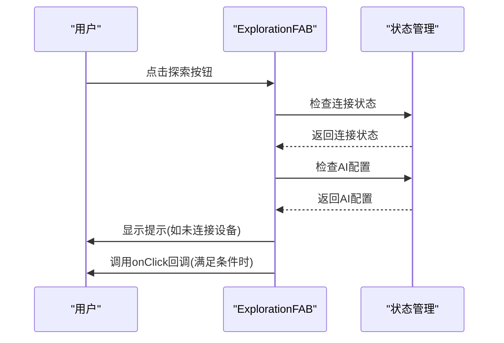

**图表来源**
- [ExplorationFAB.tsx:47-58](file://src/components/panels/exploration/ExplorationFAB.tsx#L47-L58)
- [ExplorationFAB.tsx:61-66](file://src/components/panels/exploration/ExplorationFAB.tsx#L61-L66)

**章节来源**
- [ExplorationFAB.tsx:22-97](file://src/components/panels/exploration/ExplorationFAB.tsx#L22-L97)

#### 探索面板(ExplorationPanel)
- 完整的探索模式用户界面，支持目标输入、进度显示、节点审核等功能
- 实现完整的探索生命周期：空闲(idle)、预测(predicting)、审核(reviewing)、执行(executing)、完成(completed)
- 提供目标输入、起始节点选择、进度信息显示、操作按钮等功能
- 支持退出确认对话框，允许用户选择保存或不保存已确认的节点

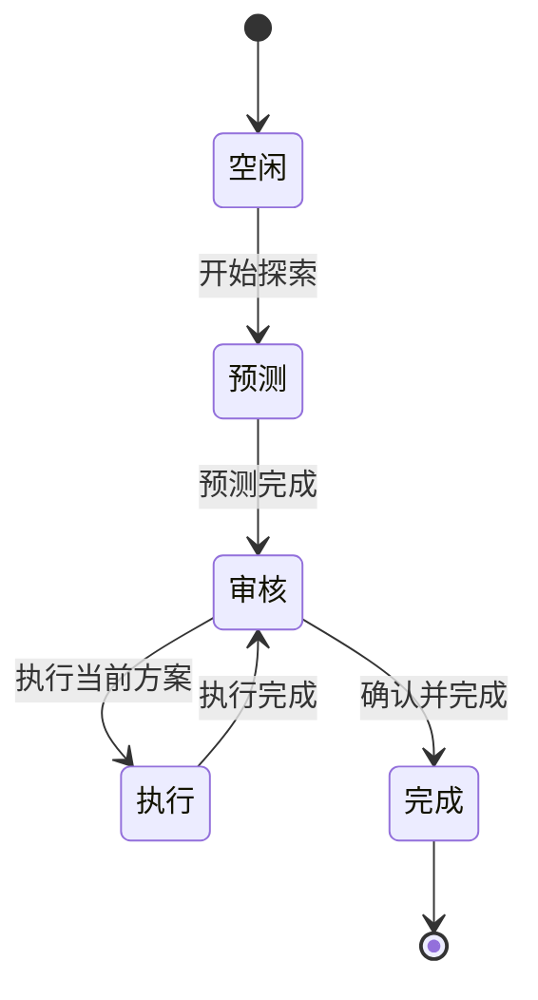

**图表来源**
- [ExplorationPanel.tsx:114-241](file://src/components/panels/exploration/ExplorationPanel.tsx#L114-L241)

**章节来源**
- [ExplorationPanel.tsx:30-293](file://src/components/panels/exploration/ExplorationPanel.tsx#L30-L293)

#### 探索状态管理(explorationSlice)
- 实现完整的探索生命周期管理，包括状态转换和数据管理
- 支持开始探索(start)、执行当前方案(execute)、确认当前方案(confirm)、完成探索(complete)、退出探索(abort)
- 管理探索目标、起始节点、Ghost节点、步骤计数、已确认节点列表、错误信息、进度信息等状态
- 提供内部方法用于状态更新和进度报告

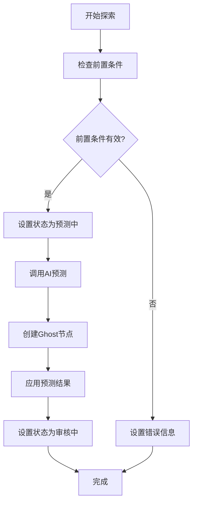

**图表来源**
- [explorationSlice.ts:42-118](file://src/stores/flow/slices/explorationSlice.ts#L42-L118)
- [explorationSlice.ts:144-231](file://src/stores/flow/slices/explorationSlice.ts#L144-L231)

**章节来源**
- [explorationSlice.ts:34-270](file://src/stores/flow/slices/explorationSlice.ts#L34-L270)

#### 探索AI工具(explorationAI)
- 专门的AI工具函数，支持探索模式的预测和执行能力
- 提供Ghost节点位置计算、探索预测、节点动作执行、截图获取等功能
- 复用现有的AI预测功能，为探索模式提供专用的提示词和处理逻辑
- 支持进度回调，提供详细的执行进度信息

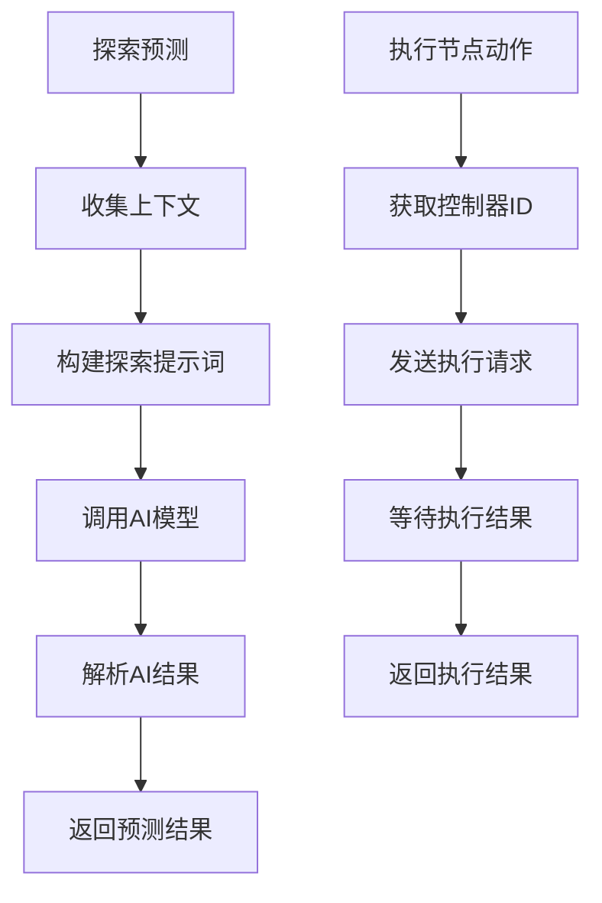

**图表来源**
- [explorationAI.ts:69-116](file://src/utils/ai/explorationAI.ts#L69-L116)
- [explorationAI.ts:278-340](file://src/utils/ai/explorationAI.ts#L278-L340)

**章节来源**
- [explorationAI.ts:1-389](file://src/utils/ai/explorationAI.ts#L1-L389)

### 节点系统与类型模型
- 节点类型枚举：Pipeline、External、Anchor、Sticker、Group。
- 边类型：marked边，支持label作为链路顺序，attributes存储jump_back、anchor等属性。
- 节点数据模型：Pipeline包含识别与动作参数、others及其他扩展；External/Anchor包含标签与方向；Sticker包含标签、内容与颜色主题；Group包含标签与颜色主题。
- 节点句柄方向：支持left-right、right-left、top-bottom、bottom-top四种方向，默认left-right。


**图表来源**
- [types.ts:14-244](file://src/stores/flow/types.ts#L14-L244)
- [nodes/constants.ts:14-20](file://src/components/flow/nodes/constants.ts#L14-L20)

**章节来源**
- [types.ts:14-244](file://src/stores/flow/types.ts#L14-L244)
- [nodes/constants.ts:14-20](file://src/components/flow/nodes/constants.ts#L14-L20)

### 节点实现与交互

#### Pipeline节点
- 支持三种外观风格：经典、现代、极简，由配置切换。
- 与调试状态联动：执行中、已执行、正在识别、失败等状态样式。
- 与选中/路径/聚焦透明度联动，实现"聚焦相关元素"的视觉聚焦效果。
- 右键菜单集成，支持节点上下文操作。

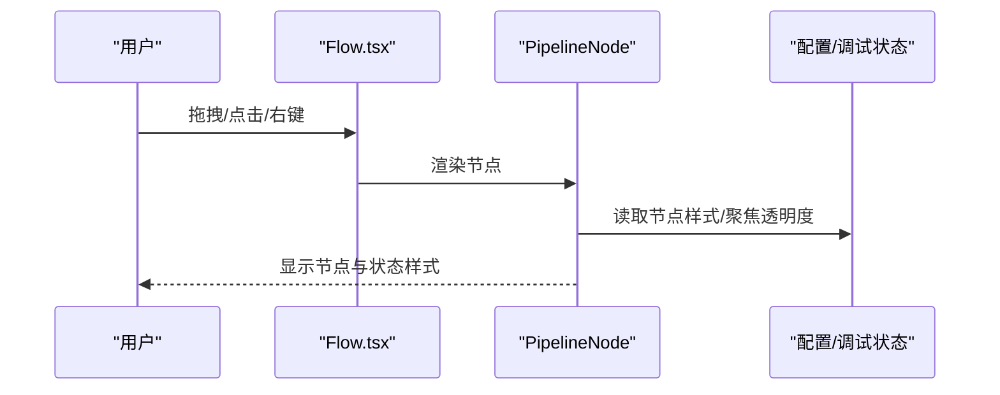

**图表来源**
- [PipelineNode/index.tsx:22-194](file://src/components/flow/nodes/PipelineNode/index.tsx#L22-L194)
- [Flow.tsx:464-504](file://src/components/Flow.tsx#L464-L504)

**章节来源**
- [PipelineNode/index.tsx:22-194](file://src/components/flow/nodes/PipelineNode/index.tsx#L22-L194)

#### External节点
- 仅展示标签与句柄，适合作为外部入口/出口节点。
- 支持句柄方向配置，便于与上游/下游节点对齐。

**章节来源**
- [ExternalNode.tsx:29-145](file://src/components/flow/nodes/ExternalNode.tsx#L29-L145)

#### Anchor节点
- 用于重定向/锚点，支持句柄方向配置。
- 常用于流程跳转或复用节点。

**章节来源**
- [AnchorNode.tsx:31-147](file://src/components/flow/nodes/AnchorNode.tsx#L31-L147)

#### Sticker节点
- 可拖拽调整大小，支持多颜色主题。
- 双击进入编辑模式，支持标题与内容修改。
- 不受"聚焦透明度"影响，始终可见。

**章节来源**
- [StickerNode.tsx:165-237](file://src/components/flow/nodes/StickerNode.tsx#L165-L237)

#### Group节点
- 支持标题编辑与拖拽调整大小。
- 子节点相对定位，拖出边界自动脱离分组。
- 提供多种颜色主题，增强分组辨识度。

**章节来源**
- [GroupNode.tsx:112-184](file://src/components/flow/nodes/GroupNode.tsx#L112-L184)

### 连接系统与边渲染

**更新** 新增直角走线模式功能，提供三种连接样式选择：

- **贝塞尔曲线模式**：支持控制点拖拽调整路径形状，双击重置，适合需要流畅曲线的工作流。
- **直角阶梯模式**：使用阶梯状折线连接节点，路径规整清晰，适合需要清晰层次结构的工作流图。
- **避让模式**：自动绕过路径上的节点，智能规划最优路线，适合复杂网络拓扑。

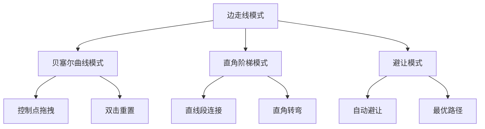

**图表来源**
- [PanelConfigSection.tsx:154-181](file://src/components/panels/config/PanelConfigSection.tsx#L154-L181)
- [edges.tsx:300-310](file://src/components/flow/edges.tsx#L300-L310)
- [edges.tsx:206-233](file://src/components/flow/edges.tsx#L206-L233)

**章节来源**
- [PanelConfigSection.tsx:154-181](file://src/components/panels/config/PanelConfigSection.tsx#L154-L181)
- [configStore.ts:95-96](file://src/stores/configStore.ts#L95-L96)
- [edges.tsx:300-310](file://src/components/flow/edges.tsx#L300-L310)

### 智能连接到空白处功能

**新增** 智能连接到空白处功能的技术实现：

- **连接检测**：在onConnectEnd事件中检测连接是否结束在空白区域，通过FinalConnectionState判断。
- **面板控制**：使用useState管理NodeAddPanel的可见性与位置，结合useRef跟踪连接状态。
- **坐标转换**：通过screenToFlowPosition将屏幕坐标转换为画布坐标，确保面板显示在正确位置。
- **配置开关**：通过quickCreateNodeOnConnectBlank配置项控制功能启用状态，默认开启。
- **事件抑制**：使用suppressNextPaneClickRef防止面板弹出后立即关闭。

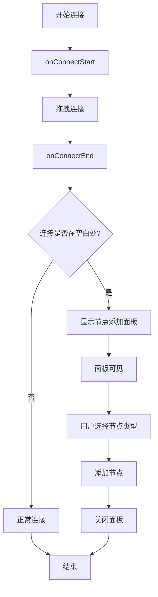

**图表来源**
- [Flow.tsx:278-323](file://src/components/Flow.tsx#L278-L323)
- [Flow.tsx:331-361](file://src/components/Flow.tsx#L331-L361)
- [NodeAddPanel.tsx:151-193](file://src/components/panels/main/NodeAddPanel.tsx#L151-L193)

**章节来源**
- [Flow.tsx:278-323](file://src/components/Flow.tsx#L278-L323)
- [Flow.tsx:331-361](file://src/components/Flow.tsx#L331-L361)
- [NodeAddPanel.tsx:151-193](file://src/components/panels/main/NodeAddPanel.tsx#L151-L193)

### 智能粘贴功能

**新增** 智能粘贴功能支持节点关系保持和自动定位逻辑：

- **关系保持**：粘贴时自动处理父子关系映射，确保组内节点的相对位置关系保持不变。
- **坐标转换**：将相对坐标转换为绝对坐标，支持跨文件粘贴时的坐标转换。
- **自动定位**：粘贴后自动聚焦到新粘贴的节点集合，提供更好的视觉反馈。
- **计数器管理**：使用pasteIdCounter确保粘贴节点的唯一标识和标签去重。

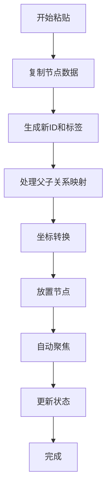

**图表来源**
- [graphSlice.ts:60-336](file://src/stores/flow/slices/graphSlice.ts#L60-L336)

**章节来源**
- [graphSlice.ts:60-336](file://src/stores/flow/slices/graphSlice.ts#L60-L336)

### 搜索面板AI搜索能力增强

**新增** 搜索面板AI搜索能力增强：

- **跨文件搜索**：支持在多个文件中搜索节点，提供更全面的搜索结果。
- **自动定位**：搜索结果支持直接定位到节点，提供流畅的导航体验。
- **智能跳转**：支持从一个文件跳转到另一个文件并定位节点。
- **进度反馈**：提供详细的搜索进度和状态反馈。
- **文件路径显示**：搜索结果中显示节点所在文件的相对路径。

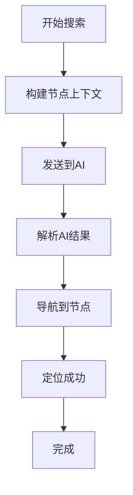

**图表来源**
- [SearchPanel.tsx:178-261](file://src/components/panels/main/SearchPanel.tsx#L178-L261)
- [crossFileService.ts:276-316](file://src/services/crossFileService.ts#L276-L316)

**章节来源**
- [SearchPanel.tsx:178-261](file://src/components/panels/main/SearchPanel.tsx#L178-L261)
- [crossFileService.ts:276-316](file://src/services/crossFileService.ts#L276-L316)

### 动态模板计数功能

**新增** 工具面板动态模板计数功能：

- **自适应显示**：根据画布高度自动计算显示的模板数量。
- **基准计算**：基于720px显示7个模板，840px显示10个模板的基准计算。
- **范围限制**：最少显示5个模板，最多不超过模板总数。
- **用户体验**：提供更好的工具面板布局和使用体验。

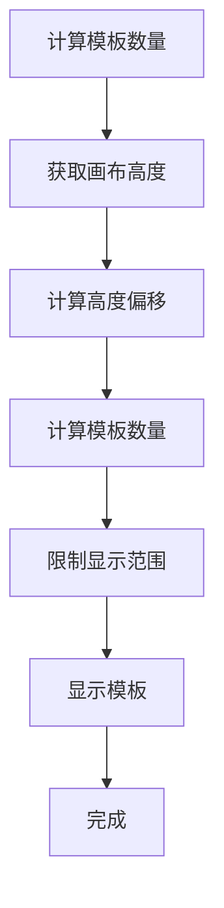

**图表来源**
- [AddPanel.tsx:34-41](file://src/components/panels/tools/AddPanel.tsx#L34-L41)

**章节来源**
- [AddPanel.tsx:34-41](file://src/components/panels/tools/AddPanel.tsx#L34-L41)

### 字段面板工具AI配置验证

**新增** 字段面板工具AI配置验证：

- **智能预测**：基于AI预测生成节点配置，支持识别和动作参数的智能填充。
- **配置验证**：对AI预测结果进行严格验证，过滤无效类型和字段。
- **应用机制**：将验证后的配置批量应用到节点，支持部分字段填充。
- **进度反馈**：提供详细的AI预测进度和状态反馈。

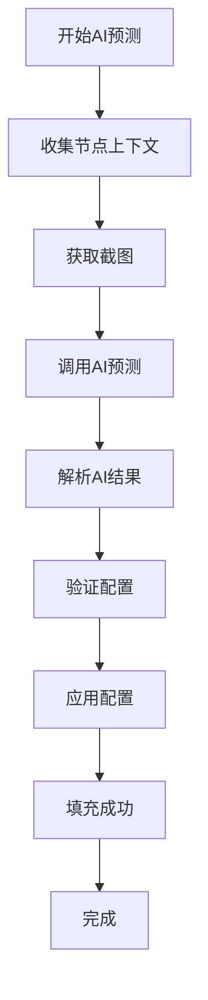

**图表来源**
- [FieldPanelToolbar.tsx:141-203](file://src/components/panels/field/tools/FieldPanelToolbar.tsx#L141-L203)
- [aiPredictor.ts:285-395](file://src/utils/ai/aiPredictor.ts#L285-L395)

**章节来源**
- [FieldPanelToolbar.tsx:141-203](file://src/components/panels/field/tools/FieldPanelToolbar.tsx#L141-L203)
- [aiPredictor.ts:285-395](file://src/utils/ai/aiPredictor.ts#L285-L395)

### 跨文件导航能力

**新增** 跨文件导航能力的技术实现：

- **节点搜索**：支持在多个文件中搜索节点，提供模糊匹配和精确匹配。
- **文件跳转**：支持从一个文件跳转到另一个文件并定位节点。
- **自动完成**：提供节点名称的自动完成功能，支持跨文件引用。
- **锚点引用**：支持查询跨文件的锚点引用关系。
- **连接状态**：检查LocalBridge连接状态，提供离线模式支持。

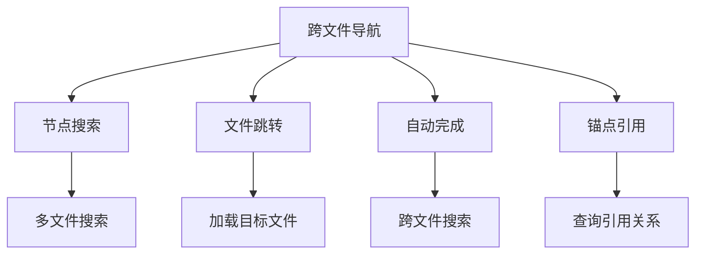

**图表来源**
- [crossFileService.ts:264-729](file://src/services/crossFileService.ts#L264-L729)
- [SearchPanel.tsx:1-406](file://src/components/panels/main/SearchPanel.tsx#L1-406)

**章节来源**
- [crossFileService.ts:264-729](file://src/services/crossFileService.ts#L264-L729)
- [SearchPanel.tsx:1-406](file://src/components/panels/main/SearchPanel.tsx#L1-406)

### 节点操作与磁吸对齐
- 拖拽磁吸：拖拽节点时计算与其他节点的对齐参考线，拖拽结束时应用对齐位置。
- 分组拖拽：拖入/拖出分组检测，自动挂载/脱离父分组。
- 键盘快捷键：支持复制/粘贴节点。
- 视口持久化：视口变化时保存至文件配置。

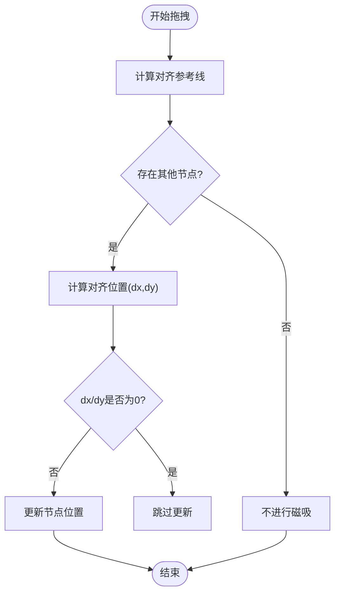

**图表来源**
- [Flow.tsx:297-360](file://src/components/Flow.tsx#L297-L360)

**章节来源**
- [Flow.tsx:297-360](file://src/components/Flow.tsx#L297-L360)

### 布局算法与自动排列
- 自动布局：基于ELKJS分层布局算法，根据节点测量宽高生成布局，批量更新节点位置。
- 对齐工具：支持顶部对齐、底部对齐、水平居中对齐，生成NodeChange批量更新。
- 依赖：节点需完成测量（measured.width/height），否则延时重试。

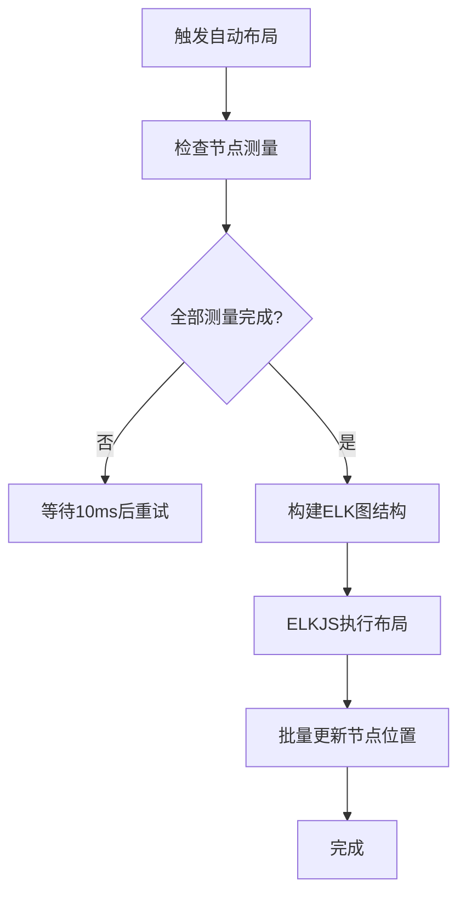

**图表来源**
- [layout.ts:46-107](file://src/core/layout.ts#L46-L107)

**章节来源**
- [layout.ts:46-107](file://src/core/layout.ts#L46-L107)

### 节点编辑器与字段验证
- 字段工厂与模式：识别/动作/其他三类参数通过字段工厂与模式驱动，支持类型切换时自动增删字段与默认值填充。
- 批量更新：支持一次性应用多个字段更新，减少多次渲染。
- 名称重复检测：节点标签重复时在错误面板提示。
- 实时预览：字段变更即时反映到节点外观与边样式。

**章节来源**
- [nodeSlice.ts:291-394](file://src/stores/flow/slices/nodeSlice.ts#L291-L394)
- [nodeSlice.ts:402-516](file://src/stores/flow/slices/nodeSlice.ts#L402-L516)

### 节点模板与节点列表
- 节点模板：提供空节点、文字识别、图像识别、无延迟节点、直接点击、自定义动作、外部节点、锚点、便签、分组等模板。
- 节点列表：按类型分组展示，支持图标与统计信息。

**章节来源**
- [nodeTemplates.ts:13-108](file://src/data/nodeTemplates.ts#L13-L108)

### 工具模块重构与分类管理

**更新** 工具模块现已重构为按功能分类的组织结构：

- **数据处理工具**：位于 `src/utils/data/` 目录，包含JSON处理、缓冲区操作、URL处理等工具
- **UI工具**：位于 `src/utils/ui/` 目录，包含截图、磁吸对齐、面板控制等UI相关工具
- **节点工具**：位于 `src/utils/node/` 目录，包含节点JSON验证、节点名称处理等节点相关工具
- **AI工具**：位于 `src/utils/ai/` 目录，包含AI预测、提示词构建、OpenAI集成等AI相关工具
- **探索AI工具**：位于 `src/utils/ai/explorationAI.ts`，专门处理探索模式的AI功能
- **Wails桥接**：位于 `src/utils/wailsBridge.ts`，提供Wails环境检测和事件监听功能

```mermaid
graph TB
subgraph "工具模块重构"
Utils["src/utils/"]
Utils --> Data["utils/data/"]
Utils --> UI["utils/ui/"]
Utils --> Node["utils/node/"]
Utils --> AI["utils/ai/"]
Utils --> Bridge["utils/wailsBridge.ts"]
AI --> ExplorationAI["utils/ai/explorationAI.ts<br/>探索AI工具"]
end
subgraph "数据处理工具"
Data --> JsonHelper["jsonHelper.ts<br/>JSON处理"]
Data --> BufferHelper["bufferHelper.ts<br/>缓冲区操作"]
Data --> UrlHelper["urlHelper.ts<br/>URL处理"]
Data --> ShareHelper["shareHelper.ts<br/>分享功能"]
Data --> RoiNegativeCoord["roiNegativeCoord.ts<br/>ROI坐标处理"]
end
subgraph "UI工具"
UI --> Snapper["snapper.ts<br/>截图工具"]
UI --> Clipboard["clipboard.ts<br/>剪贴板操作"]
UI --> PanelPosition["panelPosition.ts<br/>面板位置管理"]
UI --> Snapper["snapper.ts<br/>磁吸对齐"]
end
subgraph "节点工具"
Node --> NodeJsonValidator["nodeJsonValidator.ts<br/>节点JSON验证"]
Node --> NodeNameHelper["nodeNameHelper.ts<br/>节点名称处理"]
end
subgraph "AI工具"
AI --> AIPredictor["aiPredictor.ts<br/>AI预测"]
AI --> AIPrompts["aiPrompts.ts<br/>提示词构建"]
AI --> OpenAI["openai.ts<br/>OpenAI集成"]
AI --> ExplorationAI["explorationAI.ts<br/>探索AI工具"]
end
```

**图表来源**
- [jsonHelper.ts:1-28](file://src/utils/data/jsonHelper.ts#L1-L28)
- [nodeJsonValidator.ts:1-280](file://src/utils/node/nodeJsonValidator.ts#L1-L280)
- [snapper.ts:1-87](file://src/utils/ui/snapper.ts#L1-L87)
- [aiPredictor.ts:1-583](file://src/utils/ai/aiPredictor.ts#L1-L583)
- [explorationAI.ts:1-389](file://src/utils/ai/explorationAI.ts#L1-L389)
- [wailsBridge.ts:1-387](file://src/utils/wailsBridge.ts#L1-L387)

**章节来源**
- [jsonHelper.ts:1-28](file://src/utils/data/jsonHelper.ts#L1-L28)
- [nodeJsonValidator.ts:1-280](file://src/utils/node/nodeJsonValidator.ts#L1-L280)
- [snapper.ts:1-87](file://src/utils/ui/snapper.ts#L1-L87)
- [aiPredictor.ts:1-583](file://src/utils/ai/aiPredictor.ts#L1-L583)
- [explorationAI.ts:1-389](file://src/utils/ai/explorationAI.ts#L1-L389)
- [wailsBridge.ts:1-387](file://src/utils/wailsBridge.ts#L1-L387)

## 依赖分析
- 容器依赖：Flow.tsx依赖节点注册表、边类型、配置、磁吸工具与状态切片。
- 节点依赖：各节点组件依赖状态切片、配置、调试状态与右键菜单。
- 边依赖：edges.tsx依赖句柄方向、控制点拖拽、标签排序与样式类，新增直角路径计算依赖。
- 状态依赖：nodeSlice与edgeSlice分别管理节点与边的状态变更、历史与批量更新。
- 布局依赖：layout.ts依赖ELKJS与节点测量信息。
- 配置依赖：configStore提供边走线模式配置，PanelConfigSection提供用户界面。
- **新增** 探索模式依赖：ExplorationFAB与ExplorationPanel依赖explorationSlice进行状态管理。
- **新增** 探索AI依赖：explorationSlice依赖explorationAI进行AI预测和执行。
- **新增** 探索样式依赖：ExplorationPanel依赖ExplorationPanel.module.less进行样式管理。
- **新增** 节点添加面板依赖：NodeAddPanel依赖Flow.tsx的状态管理与坐标转换功能。
- **新增** 智能粘贴依赖：graphSlice依赖clipboardStore进行节点数据管理。
- **新增** 搜索面板依赖：SearchPanel依赖crossFileService进行跨文件搜索。
- **新增** AI预测依赖：FieldPanelToolbar依赖aiPredictor进行智能配置验证。
- **新增** 跨文件服务依赖：crossFileService依赖LocalBridge连接状态与文件存储。
- **新增** 工具模块重构依赖：各工具模块按功能分类组织，提升代码可维护性。

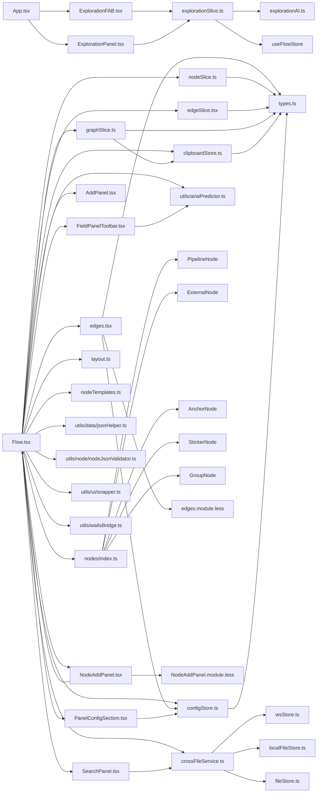

**图表来源**
- [App.tsx:341-350](file://src/App.tsx#L341-L350)
- [ExplorationFAB.tsx:11-14](file://src/components/panels/exploration/ExplorationFAB.tsx#L11-L14)
- [ExplorationPanel.tsx:16-20](file://src/components/panels/exploration/ExplorationPanel.tsx#L16-L20)
- [explorationSlice.ts:7-19](file://src/stores/flow/slices/explorationSlice.ts#L7-L19)

**章节来源**
- [App.tsx:341-350](file://src/App.tsx#L341-L350)
- [ExplorationFAB.tsx:11-14](file://src/components/panels/exploration/ExplorationFAB.tsx#L11-L14)
- [ExplorationPanel.tsx:16-20](file://src/components/panels/exploration/ExplorationPanel.tsx#L16-L20)
- [explorationSlice.ts:7-19](file://src/stores/flow/slices/explorationSlice.ts#L7-L19)

## 性能考虑
- 渲染优化
  - 使用memo与浅比较避免不必要的重渲染（如PipelineNodeMemo、StickerNodeMemo等）。
  - 节点与边组件内部按需计算样式与类名，减少DOM开销。
  - **新增** 探索面板使用memo包装，避免不必要的重新渲染。
  - **新增** 探索FAB使用memo包装，提升渲染性能。
- 交互优化
  - 拖拽磁吸与分组拖拽采用节流/防抖策略，避免频繁状态更新。
  - 视口变化与节点尺寸变化使用ResizeObserver与防抖函数，降低重排频率。
  - **新增** 智能连接到空白处功能使用useRef跟踪连接状态，避免不必要的重新渲染。
  - **新增** 智能粘贴功能使用批量更新减少多次渲染。
  - **新增** 搜索面板使用防抖函数优化搜索性能。
  - **新增** 跨文件搜索使用缓存机制，避免重复请求。
  - **新增** 探索模式使用状态管理优化，避免不必要的状态更新。
  - **新增** 探索AI工具使用异步处理，避免阻塞主线程。
- 状态管理
  - 历史快照按操作类型延迟保存，减少频繁写入。
  - 批量更新接口（batchSetNodeData）减少多次渲染与状态变更。
  - **新增** 剪贴板状态管理避免重复的节点数据复制。
  - **新增** 跨文件服务状态管理优化文件加载性能。
  - **新增** 探索状态管理使用专门的切片，避免与其他状态冲突。
  - **新增** 探索AI工具使用缓存机制，避免重复的AI调用。
- 布局优化
  - ELKJS布局在节点测量完成后执行，未测量节点延时重试，避免阻塞主线程。
  - 自动布局在下一帧执行，避免同步阻塞渲染。
- **边渲染优化**
  - **新增** 直角模式使用getSmoothStepPath，相比贝塞尔曲线计算更简单，性能更好。
  - **新增** 贝塞尔模式的控制点拖拽仅在需要时计算，避免不必要的重渲染。
  - **新增** 避让模式使用智能路径规划算法，平衡性能与效果。
- **新增** 节点添加面板优化
  - 使用memo包装NodeAddPanelController，避免面板组件的不必要重渲染。
  - 面板位置计算使用useMemo缓存，减少重复计算。
- **新增** AI搜索优化
  - 搜索结果使用useMemo缓存，避免重复计算。
  - AI预测过程提供进度反馈，避免界面卡顿。
  - 截图获取使用超时机制，避免长时间阻塞。
- **新增** 探索模式优化
  - 探索状态管理使用专门的切片，避免与其他状态冲突。
  - 探索AI工具使用异步处理，避免阻塞主线程。
  - 探索面板使用状态管理优化，避免不必要的状态更新。
  - 探索FAB使用条件渲染，避免不必要的DOM节点。
- **新增** 工具模块重构优化
  - 按功能分类的工具模块提升代码可维护性，减少模块间的耦合。
  - 数据处理、UI操作、节点验证、探索AI等工具职责明确，便于单独测试和优化。
  - 工具函数的单一职责原则提升整体性能和可维护性。

[本节为通用性能指导，无需特定文件引用]

## 故障排查指南
- 节点名称重复
  - 现象：错误面板提示重复节点名。
  - 排查：检查节点标签是否重复，必要时修改标签或启用导出配置前缀。
  - 参考：节点数据更新时的重复检测逻辑。
- 边顺序异常
  - 现象：同源同句柄边顺序错乱。
  - 排查：通过边标签排序接口重新计算顺序，确保新增边label正确。
  - 参考：边标签更新与顺序计算逻辑。
- 磁吸无效
  - 现象：拖拽节点不吸附。
  - 排查：确认磁吸开关与仅视口内吸附设置；检查节点是否为分组节点；确认节点测量尺寸是否存在。
  - 参考：磁吸对齐计算与拖拽停止逻辑。
- 自动布局不生效
  - 现象：节点未自动排列。
  - 排查：确认节点已完成测量；等待测量完成后自动重试；检查ELKJS是否报错。
  - 参考：自动布局执行与测量检查逻辑。
- **边走线模式问题**
  - **新增** 现象：直角模式下连接线出现角度问题。
  - 排查：确认节点句柄方向配置正确；检查节点位置关系；尝试切换到贝塞尔模式验证问题。
  - 参考：直角路径计算逻辑与句柄方向映射。
- **智能连接到空白处问题**
  - **新增** 现象：连接到空白处不弹出面板。
  - 排查：确认quickCreateNodeOnConnectBlank配置项已启用；检查连接事件处理逻辑；验证面板状态管理。
  - 参考：连接检测逻辑与面板控制状态。
- **智能粘贴功能问题**
  - **新增** 现象：粘贴后节点位置不正确。
  - 排查：检查父子关系映射是否正确；确认坐标转换逻辑；验证自动定位功能。
  - 参考：粘贴时的坐标转换与自动定位逻辑。
- **搜索面板AI搜索问题**
  - **新增** 现象：AI搜索结果不准确或超时。
  - 排查：检查AI配置是否正确；确认设备连接状态；验证节点上下文构建。
  - 参考：AI搜索的配置检查与上下文构建逻辑。
- **动态模板计数问题**
  - **新增** 现象：工具面板模板数量显示异常。
  - 排查：检查画布高度获取；确认基准计算逻辑；验证显示范围限制。
  - 参考：模板数量计算与范围限制逻辑。
- **AI配置验证问题**
  - **新增** 现象：AI预测结果应用失败或字段填充异常。
  - 排查：检查AI预测结果格式；确认配置验证逻辑；验证批量应用机制。
  - 参考：AI预测结果验证与批量应用逻辑。
- **跨文件导航问题**
  - **新增** 现象：跨文件搜索结果不准确或跳转失败。
  - 排查：检查LocalBridge连接状态；确认文件加载状态；验证节点名称解析。
  - 参考：跨文件服务的连接检查与文件加载逻辑。
- **探索模式问题**
  - **新增** 现象：探索功能无法正常使用。
  - 排查：检查设备连接状态；确认AI API配置；验证探索状态管理；检查探索AI工具功能。
  - 参考：探索模式的前置条件检查与状态管理逻辑。
- **探索FAB问题**
  - **新增** 现象：探索FAB无法点击或显示异常。
  - 排查：检查探索状态管理；确认设备连接状态；验证AI配置状态；检查样式文件。
  - 参考：探索FAB的状态检查与样式逻辑。
- **探索面板问题**
  - **新增** 现象：探索面板无法显示或功能异常。
  - 排查：检查探索状态管理；确认面板可见性状态；验证探索生命周期；检查样式文件。
  - 参考：探索面板的状态管理与生命周期逻辑。
- **工具模块重构问题**
  - **新增** 现象：工具函数导入路径错误或功能异常。
  - 排查：确认工具函数的导入路径是否更新为新的模块结构；检查工具函数的兼容性；验证功能是否正常。
  - 参考：工具模块重构后的导入路径和功能验证。

**章节来源**
- [nodeSlice.ts:377-391](file://src/stores/flow/slices/nodeSlice.ts#L377-L391)
- [edgeSlice.ts:102-148](file://src/stores/flow/slices/edgeSlice.ts#L102-L148)
- [Flow.tsx:297-360](file://src/components/Flow.tsx#L297-L360)
- [layout.ts:55-64](file://src/core/layout.ts#L55-L64)
- [edges.tsx:206-233](file://src/components/flow/edges.tsx#L206-L233)
- [Flow.tsx:278-323](file://src/components/Flow.tsx#L278-L323)
- [graphSlice.ts:60-336](file://src/stores/flow/slices/graphSlice.ts#L60-L336)
- [SearchPanel.tsx:178-261](file://src/components/panels/main/SearchPanel.tsx#L178-L261)
- [AddPanel.tsx:34-41](file://src/components/panels/tools/AddPanel.tsx#L34-L41)
- [FieldPanelToolbar.tsx:141-203](file://src/components/panels/field/tools/FieldPanelToolbar.tsx#L141-L203)
- [aiPredictor.ts:285-395](file://src/utils/ai/aiPredictor.ts#L285-L395)
- [crossFileService.ts:264-729](file://src/services/crossFileService.ts#L264-L729)
- [explorationSlice.ts:42-118](file://src/stores/flow/slices/explorationSlice.ts#L42-L118)
- [ExplorationFAB.tsx:47-58](file://src/components/panels/exploration/ExplorationFAB.tsx#L47-L58)
- [ExplorationPanel.tsx:114-241](file://src/components/panels/exploration/ExplorationPanel.tsx#L114-L241)
- [jsonHelper.ts:1-28](file://src/utils/data/jsonHelper.ts#L1-L28)
- [nodeJsonValidator.ts:1-280](file://src/utils/node/nodeJsonValidator.ts#L1-L280)
- [snapper.ts:1-87](file://src/utils/ui/snapper.ts#L1-L87)
- [wailsBridge.ts:1-387](file://src/utils/wailsBridge.ts#L1-L387)

## 结论
MaaPipelineEditor的工作流编辑器以清晰的分层架构、完善的节点与边系统、灵活的状态管理与强大的布局能力，提供了高效、易用且可扩展的可视化工作流设计体验。

**更新** 新增的探索模式功能进一步增强了编辑器的智能化水平和用户体验。探索模式通过浮动操作按钮(ExplorationFAB)提供便捷的入口，探索面板(ExplorationPanel)提供完整的交互界面，支持从目标描述到节点创建的自动化工作流设计。该功能基于专门的探索AI工具(explorationAI)和状态管理(explorationSlice)，实现了完整的探索生命周期管理。

通过本文档的节点类型说明、连接机制解析、操作流程梳理、探索模式分析与扩展指南，用户可以全面掌握编辑器的使用与二次开发。探索模式不仅提高了工作效率，还为复杂工作流的设计提供了强有力的技术支撑。工具模块的重构更是为未来的功能扩展和维护奠定了坚实的基础。

## 附录

### 探索模式开发指南
- 探索模式组件集成步骤
  - 在App.tsx中引入ExplorationFAB和ExplorationPanel组件
  - 在状态管理中集成explorationSlice
  - 在样式文件中添加ExplorationPanel.module.less
  - 在工具函数中集成explorationAI
- 探索模式最佳实践
  - 使用memo优化探索面板和FAB组件的渲染性能
  - 保持探索状态管理的独立性，避免与其他状态冲突
  - 为探索功能提供清晰的用户反馈和进度指示
  - 在探索过程中提供适当的错误处理和恢复机制
- 探索模式扩展开发
  - 可以扩展探索AI工具，支持更多类型的节点预测
  - 可以添加探索历史记录功能，支持探索过程的回放
  - 可以集成更多的AI模型，提供更精准的节点预测
  - 可以添加探索结果的导出功能，支持探索结果的分享和复用

**章节来源**
- [App.tsx:341-350](file://src/App.tsx#L341-L350)
- [ExplorationFAB.tsx:1-97](file://src/components/panels/exploration/ExplorationFAB.tsx#L1-L97)
- [ExplorationPanel.tsx:1-293](file://src/components/panels/exploration/ExplorationPanel.tsx#L1-L293)
- [explorationSlice.ts:1-270](file://src/stores/flow/slices/explorationSlice.ts#L1-L270)
- [explorationAI.ts:1-389](file://src/utils/ai/explorationAI.ts#L1-L389)

### 边走线模式技术实现

**新增** 边走线模式的技术细节：

- **路径计算**：使用getSmoothStepPath函数生成阶梯状折线，支持四个方向的直角转弯。
- **样式支持**：直角路径使用直线段连接，没有曲线部分，视觉上更加规整。
- **性能优势**：相比贝塞尔曲线，直角路径计算更简单，渲染性能更好。
- **适用场景**：特别适合需要清晰层次结构的工作流图，如流程图、状态机等。
- **避让模式**：使用智能路径规划算法，自动绕过路径上的节点，提供最优路径。

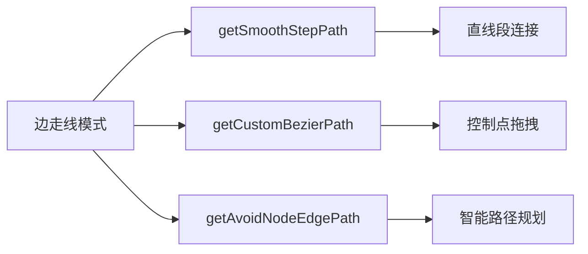

**图表来源**
- [edges.tsx:206-233](file://src/components/flow/edges.tsx#L206-L233)
- [edges.tsx:222-230](file://src/components/flow/edges.tsx#L222-L230)
- [edges.tsx:28-188](file://src/components/flow/edges.tsx#L28-L188)

**章节来源**
- [edges.tsx:206-233](file://src/components/flow/edges.tsx#L206-L233)
- [edges.tsx:222-230](file://src/components/flow/edges.tsx#L222-L230)
- [edges.tsx:28-188](file://src/components/flow/edges.tsx#L28-L188)
- [edges.module.less:1-98](file://src/styles/edges.module.less#L1-L98)

### 智能连接到空白处技术实现

**新增** 智能连接到空白处功能的技术细节：

- **连接检测**：通过FinalConnectionState参数判断连接是否结束在空白区域，使用!connectionState.isValid && !connectionState.toNode && !connectionState.toHandle条件。
- **状态管理**：使用useState管理面板可见性与位置，useRef跟踪连接状态，避免不必要的重新渲染。
- **坐标转换**：通过screenToFlowPosition将屏幕坐标转换为画布坐标，确保面板显示在正确位置。
- **事件处理**：在onConnectEnd事件中处理连接完成后的逻辑，结合配置开关控制功能启用状态。
- **面板控制**：NodeAddPanelController组件负责面板的位置计算与重新打开功能。

```mermaid
flowchart TD
OnConnectEnd["onConnectEnd事件"] --> CheckState["检查连接状态"]
CheckState --> IsBlank{"是否在空白处?"}
IsBlank --> |是| SetPos["设置面板位置"]
IsBlank --> |否| Return["返回"]
SetPos --> ShowPanel["显示面板"]
ShowPanel --> UserAction["用户操作"]
UserAction --> AddNode["添加节点"]
AddNode --> ClosePanel["关闭面板"]
```

**图表来源**
- [Flow.tsx:278-323](file://src/components/Flow.tsx#L278-L323)
- [Flow.tsx:151-193](file://src/components/Flow.tsx#L151-L193)
- [NodeAddPanel.tsx:151-193](file://src/components/panels/main/NodeAddPanel.tsx#L151-L193)

**章节来源**
- [Flow.tsx:278-323](file://src/components/Flow.tsx#L278-L323)
- [Flow.tsx:151-193](file://src/components/Flow.tsx#L151-L193)
- [NodeAddPanel.tsx:151-193](file://src/components/panels/main/NodeAddPanel.tsx#L151-L193)

### 智能粘贴功能技术实现

**新增** 智能粘贴功能的技术细节：

- **关系映射**：使用pairs映射表处理父子关系，确保粘贴后节点的相对位置关系保持不变。
- **坐标转换**：将相对坐标转换为绝对坐标，支持跨文件粘贴时的坐标转换。
- **自动定位**：使用fitFlowView自动聚焦到新粘贴的节点集合。
- **计数器管理**：使用pasteIdCounter确保粘贴节点的唯一标识和标签去重。
- **组关系处理**：自动检测现有组并决定是否将新节点加入组内。

```mermaid
flowchart TD
PasteStart["开始粘贴"] --> CloneData["克隆节点数据"]
CloneData --> GenerateIds["生成新ID和标签"]
GenerateIds --> ProcessParents["处理父子关系映射"]
ProcessParents --> ConvertCoords["坐标转换"]
ConvertCoords --> PlaceNodes["放置节点"]
PlaceNodes --> AutoFocus["自动聚焦"]
AutoFocus --> UpdateState["更新状态"]
UpdateState --> End["完成"]
```

**图表来源**
- [graphSlice.ts:60-336](file://src/stores/flow/slices/graphSlice.ts#L60-L336)

**章节来源**
- [graphSlice.ts:60-336](file://src/stores/flow/slices/graphSlice.ts#L60-L336)

### 搜索面板AI搜索技术实现

**新增** 搜索面板AI搜索功能的技术细节：

- **上下文构建**：collectNodeContext函数收集当前节点及其前置节点的上下文信息。
- **截图获取**：performScreenshot函数通过MFW协议获取设备截图，用于AI分析。
- **AI预测**：predictNodeConfig函数调用AI模型生成节点配置预测。
- **结果应用**：applyPrediction函数将验证后的预测结果批量应用到节点。
- **跨文件搜索**：searchNodes函数支持跨文件节点搜索，提供文件路径提示。

```mermaid
flowchart TD
SearchStart["开始搜索"] --> BuildContext["构建节点上下文"]
BuildContext --> GetScreenshot["获取设备截图"]
GetScreenshot --> CallAI["调用AI模型"]
CallAI --> ParseResult["解析AI结果"]
ParseResult --> Validate["验证配置"]
Validate --> Apply["应用配置"]
Apply --> Navigate["导航到节点"]
Navigate --> Success["搜索成功"]
Success --> End["完成"]
```

**图表来源**
- [SearchPanel.tsx:178-261](file://src/components/panels/main/SearchPanel.tsx#L178-L261)
- [aiPredictor.ts:71-150](file://src/utils/ai/aiPredictor.ts#L71-L150)
- [aiPredictor.ts:155-200](file://src/utils/ai/aiPredictor.ts#L155-L200)
- [aiPredictor.ts:200-241](file://src/utils/ai/aiPredictor.ts#L200-L241)

**章节来源**
- [SearchPanel.tsx:178-261](file://src/components/panels/main/SearchPanel.tsx#L178-L261)
- [aiPredictor.ts:71-150](file://src/utils/ai/aiPredictor.ts#L71-L150)
- [aiPredictor.ts:155-200](file://src/utils/ai/aiPredictor.ts#L155-L200)
- [aiPredictor.ts:200-241](file://src/utils/ai/aiPredictor.ts#L200-L241)

### 动态模板计数技术实现

**新增** 动态模板计数功能的技术细节：

- **基准计算**：基于720px显示7个模板，840px显示10个模板的基准计算公式。
- **高度偏移**：每个模板对应的高度增量为40px，基于两个基准点计算。
- **范围限制**：最少显示5个模板，最多不超过模板总数。
- **自适应显示**：根据画布高度动态计算显示的模板数量。

```mermaid
flowchart TD
CalcStart["计算模板数量"] --> GetHeight["获取画布高度"]
GetHeight --> CalcOffset["计算高度偏移 (height - 720)"]
CalcOffset --> CalcIncrement["计算模板增量 (偏移 / 40)"]
CalcIncrement --> CalcCount["计算基础数量 (7 + 增量)"]
CalcCount --> LimitMin["限制最小数量 (≥ 5)"]
LimitMin --> LimitMax["限制最大数量 (≤ 模板总数)"]
LimitMax --> Display["显示模板数量"]
Display --> End["完成"]
```

**图表来源**
- [AddPanel.tsx:34-41](file://src/components/panels/tools/AddPanel.tsx#L34-L41)

**章节来源**
- [AddPanel.tsx:34-41](file://src/components/panels/tools/AddPanel.tsx#L34-L41)

### 字段面板工具AI配置验证技术实现

**新增** 字段面板工具AI配置验证的技术细节：

- **预测验证**：validatePrediction函数对AI预测结果进行严格验证，过滤无效类型和字段。
- **参数校验**：检查识别和动作参数的有效性，过滤无效组合和字段。
- **批量应用**：applyPrediction函数将验证后的配置批量应用到节点。
- **进度反馈**：提供详细的AI预测进度和状态反馈。

```mermaid
flowchart TD
AIPredictStart["开始AI预测"] --> CollectContext["收集节点上下文"]
CollectContext --> GetScreenshot["获取截图"]
GetScreenshot --> CallAI["调用AI预测"]
CallAI --> ParseResult["解析AI结果"]
ParseResult --> Validate["验证配置"]
Validate --> FilterInvalid["过滤无效字段"]
FilterInvalid --> BatchApply["批量应用配置"]
BatchApply --> Success["填充成功"]
Success --> Feedback["显示反馈"]
Feedback --> End["完成"]
```

**图表来源**
- [FieldPanelToolbar.tsx:141-203](file://src/components/panels/field/tools/FieldPanelToolbar.tsx#L141-L203)
- [aiPredictor.ts:285-395](file://src/utils/ai/aiPredictor.ts#L285-L395)
- [aiPredictor.ts:402-466](file://src/utils/ai/aiPredictor.ts#L402-L466)

**章节来源**
- [FieldPanelToolbar.tsx:141-203](file://src/components/panels/field/tools/FieldPanelToolbar.tsx#L141-L203)
- [aiPredictor.ts:285-395](file://src/utils/ai/aiPredictor.ts#L285-L395)
- [aiPredictor.ts:402-466](file://src/utils/ai/aiPredictor.ts#L402-L466)

### 跨文件导航技术实现

**新增** 跨文件导航功能的技术细节：

- **节点搜索**：getAllNodes函数获取所有可用节点，支持本地文件和前端tab文件。
- **文件跳转**：navigateToNode函数支持跨文件跳转，自动处理文件加载和节点定位。
- **自动完成**：getAutoCompleteOptions函数提供节点名称的自动完成功能。
- **锚点引用**：getAnchorReferencesCrossFile函数查询跨文件的锚点引用关系。
- **连接状态检查**：isConnected函数检查LocalBridge连接状态。

```mermaid
flowchart TD
CrossFile["跨文件导航"] --> GetAllNodes["获取所有节点"]
GetAllNodes --> SearchNodes["搜索节点"]
SearchNodes --> NavigateToNode["跳转到节点"]
NavigateToNode --> LoadAndNavigate["加载并跳转"]
LoadAndNavigate --> FocusNode["定位节点"]
FocusNode --> Success["跳转成功"]
```

**图表来源**
- [crossFileService.ts:264-729](file://src/services/crossFileService.ts#L264-L729)

**章节来源**
- [crossFileService.ts:264-729](file://src/services/crossFileService.ts#L264-L729)

### 探索模式组件设计

**新增** 探索模式组件的设计特点：

- **探索FAB设计**：圆形浮动按钮，支持脉冲动画、激活状态、禁用状态等视觉反馈
- **探索面板布局**：采用卡片式设计，支持多种状态的界面切换
- **状态管理**：完整的探索生命周期管理，包括空闲、预测、审核、执行、完成状态
- **用户交互**：提供目标输入、进度显示、节点审核、动作执行等完整的用户交互流程
- **错误处理**：提供详细的错误信息显示和处理机制

```mermaid
flowchart LR
ExplorationFAB["探索FAB"] --> StatusCheck["状态检查"]
StatusCheck --> Connected{"设备已连接?"}
Connected --> |否| ShowWarning["显示警告"]
Connected --> |是| AIConfig{"AI配置完整?"}
AIConfig --> |否| ShowWarning
AIConfig --> |是| ShowPanel["显示探索面板"]
ExplorationPanel["探索面板"] --> Idle["空闲状态"]
Idle --> Predicting["预测状态"]
Predicting --> Reviewing["审核状态"]
Reviewing --> Executing["执行状态"]
Executing --> Completed["完成状态"]
```

**图表来源**
- [ExplorationFAB.tsx:47-58](file://src/components/panels/exploration/ExplorationFAB.tsx#L47-L58)
- [ExplorationPanel.tsx:114-241](file://src/components/panels/exploration/ExplorationPanel.tsx#L114-L241)

**章节来源**
- [ExplorationFAB.tsx:1-97](file://src/components/panels/exploration/ExplorationFAB.tsx#L1-L97)
- [ExplorationPanel.tsx:1-293](file://src/components/panels/exploration/ExplorationPanel.tsx#L1-L293)

### 探索模式状态管理技术实现

**新增** 探索模式状态管理的技术细节：

- **状态枚举**：定义完整的探索状态枚举，包括空闲、预测、审核、执行、完成
- **状态转换**：实现完整的状态转换逻辑，支持状态之间的正确转换
- **数据管理**：管理探索目标、起始节点、Ghost节点、步骤计数、已确认节点列表等数据
- **生命周期管理**：提供开始、执行、确认、完成、退出等完整的生命周期方法
- **错误处理**：提供详细的错误信息管理和处理机制

```mermaid
flowchart TD
InitialState["初始状态"] --> Idle["空闲状态"]
Idle --> Start["开始探索"]
Start --> Predicting["预测状态"]
Predicting --> Reviewing["审核状态"]
Reviewing --> Execute["执行动作"]
Execute --> Reviewing
Reviewing --> Confirm["确认节点"]
Confirm --> Predicting
Reviewing --> Complete["完成探索"]
Complete --> Idle
Idle --> Abort["退出探索"]
Abort --> Idle
```

**图表来源**
- [explorationSlice.ts:21-32](file://src/stores/flow/slices/explorationSlice.ts#L21-L32)
- [explorationSlice.ts:378-397](file://src/stores/flow/slices/explorationSlice.ts#L378-L397)

**章节来源**
- [explorationSlice.ts:1-270](file://src/stores/flow/slices/explorationSlice.ts#L1-L270)

### 探索AI工具技术实现

**新增** 探索AI工具的技术细节：

- **位置计算**：calculateGhostNodePosition函数计算Ghost节点的合理位置
- **上下文收集**：支持从前置节点收集上下文或直接采集截图
- **提示词构建**：buildExplorationPrompt函数构建专门的探索提示词
- **AI预测**：predictExplorationNodeConfig函数调用AI模型进行节点预测
- **动作执行**：executeNodeAction函数通过MFW协议执行节点动作
- **截图获取**：performExplorationScreenshot函数获取设备截图

```mermaid
flowchart TD
PredictStep["预测探索步骤"] --> CheckContext["检查前置节点"]
CheckContext --> HasContext{"有前置节点?"}
HasContext --> |是| CollectContext["收集上下文"]
HasContext --> |否| TakeScreenshot["采集截图"]
CollectContext --> BuildPrompt["构建提示词"]
TakeScreenshot --> BuildPrompt
BuildPrompt --> CallAI["调用AI模型"]
CallAI --> ParseResult["解析AI结果"]
ParseResult --> ReturnPrediction["返回预测结果"]
ExecuteAction["执行节点动作"] --> GetController["获取控制器ID"]
GetController --> SendRequest["发送执行请求"]
SendRequest --> WaitResult["等待执行结果"]
WaitResult --> ReturnResult["返回执行结果"]
```

**图表来源**
- [explorationAI.ts:69-116](file://src/utils/ai/explorationAI.ts#L69-L116)
- [explorationAI.ts:278-340](file://src/utils/ai/explorationAI.ts#L278-L340)

**章节来源**
- [explorationAI.ts:1-389](file://src/utils/ai/explorationAI.ts#L1-L389)

### 节点添加面板设计

**新增** 节点添加面板的设计特点：

- **双栏布局**：左侧预览区域显示节点预览，右侧列表区域显示模板列表。
- **响应式设计**：根据鼠标位置自动调整布局方向，避免超出视口边界。
- **键盘导航**：支持上下箭头键选择模板，Enter键添加，Esc键关闭。
- **搜索功能**：支持按节点标签搜索模板，提高查找效率。
- **自定义模板**：支持删除自定义模板，提供模板管理功能。
- **动画效果**：使用fadeIn动画提升用户体验，避免突兀的显示效果。

```mermaid
flowchart LR
Panel["NodeAddPanel"] --> Preview["预览区域"]
Panel --> List["模板列表"]
Preview --> NodePreview["节点预览"]
List --> Search["搜索框"]
List --> TemplateItems["模板项"]
TemplateItems --> CustomBadge["自定义徽章"]
TemplateItems --> DeleteBtn["删除按钮"]
```

**图表来源**
- [NodeAddPanel.tsx:444-580](file://src/components/panels/main/NodeAddPanel.tsx#L444-L580)
- [NodeAddPanel.module.less:12-45](file://src/styles/NodeAddPanel.module.less#L12-L45)

**章节来源**
- [NodeAddPanel.tsx:444-580](file://src/components/panels/main/NodeAddPanel.tsx#L444-L580)
- [NodeAddPanel.module.less:12-45](file://src/styles/NodeAddPanel.module.less#L12-L45)

### 工具模块重构技术实现

**新增** 工具模块重构的技术细节：

- **模块化组织**：将工具函数按功能分类组织到不同的模块目录中，提升代码可维护性。
- **导入路径更新**：所有工具函数的导入路径已更新为新的模块结构，确保功能正常。
- **职责分离**：数据处理、UI操作、节点验证、探索AI等工具职责明确，便于单独测试和优化。
- **单一职责原则**：每个工具模块专注于特定的功能领域，提升整体性能和可维护性。
- **向后兼容**：重构过程中保持API接口的兼容性，确保现有功能不受影响。

```mermaid
flowchart TD
Reorg["工具模块重构"] --> DataModule["utils/data/<br/>数据处理工具"]
Reorg --> UIModule["utils/ui/<br/>UI工具"]
Reorg --> NodeModule["utils/node/<br/>节点工具"]
Reorg --> AIModule["utils/ai/<br/>AI工具"]
Reorg --> Bridge["utils/wailsBridge.ts"]
DataModule --> JsonHelper["jsonHelper.ts"]
DataModule --> BufferHelper["bufferHelper.ts"]
DataModule --> UrlHelper["urlHelper.ts"]
UIModule --> Snapper["snapper.ts"]
UIModule --> Clipboard["clipboard.ts"]
UIModule --> PanelPosition["panelPosition.ts"]
NodeModule --> NodeJsonValidator["nodeJsonValidator.ts"]
AIModule --> AIPredictor["aiPredictor.ts"]
AIModule --> AIPrompts["aiPrompts.ts"]
AIModule --> ExplorationAI["explorationAI.ts"]
```

**图表来源**
- [jsonHelper.ts:1-28](file://src/utils/data/jsonHelper.ts#L1-L28)
- [nodeJsonValidator.ts:1-280](file://src/utils/node/nodeJsonValidator.ts#L1-L280)
- [snapper.ts:1-87](file://src/utils/ui/snapper.ts#L1-L87)
- [aiPredictor.ts:1-583](file://src/utils/ai/aiPredictor.ts#L1-L583)
- [explorationAI.ts:1-389](file://src/utils/ai/explorationAI.ts#L1-L389)
- [wailsBridge.ts:1-387](file://src/utils/wailsBridge.ts#L1-L387)

**章节来源**
- [jsonHelper.ts:1-28](file://src/utils/data/jsonHelper.ts#L1-L28)
- [nodeJsonValidator.ts:1-280](file://src/utils/node/nodeJsonValidator.ts#L1-L280)
- [snapper.ts:1-87](file://src/utils/ui/snapper.ts#L1-L87)
- [aiPredictor.ts:1-583](file://src/utils/ai/aiPredictor.ts#L1-L583)
- [explorationAI.ts:1-389](file://src/utils/ai/explorationAI.ts#L1-L389)
- [wailsBridge.ts:1-387](file://src/utils/wailsBridge.ts#L1-L387)