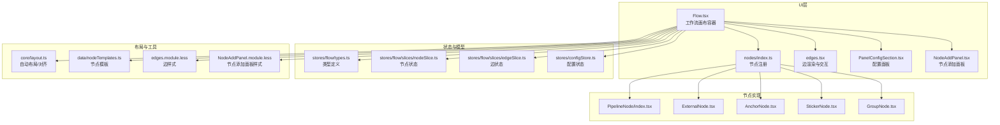
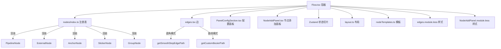
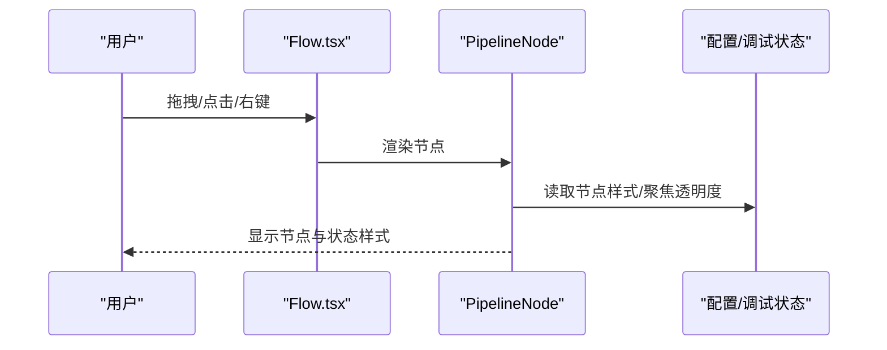
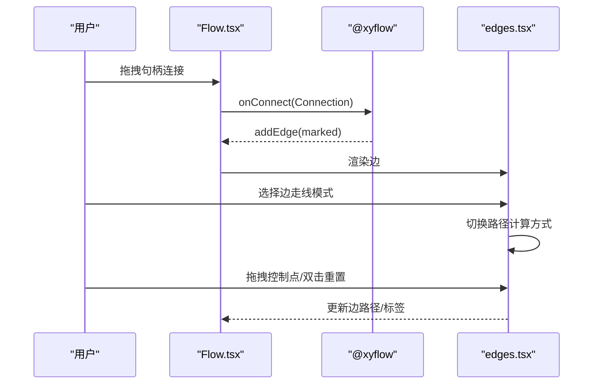
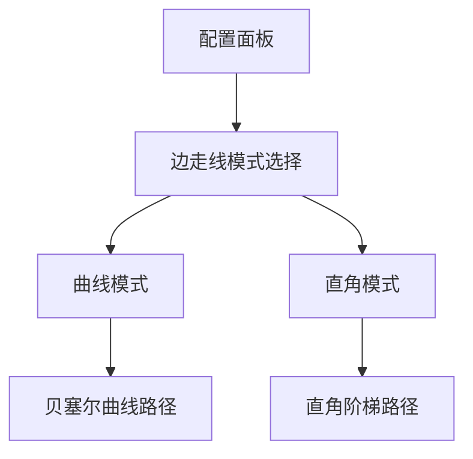
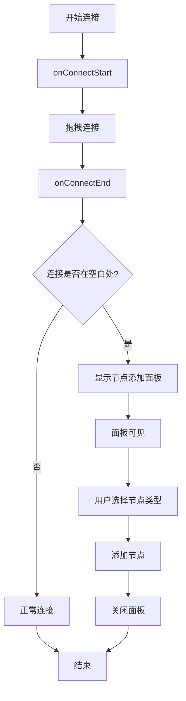
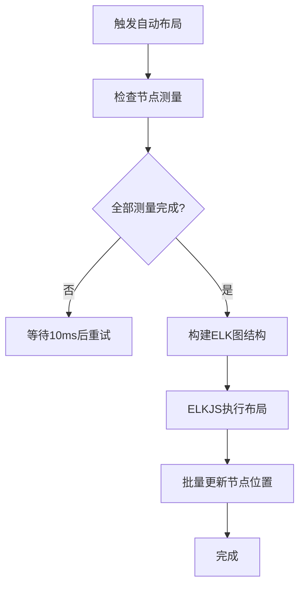
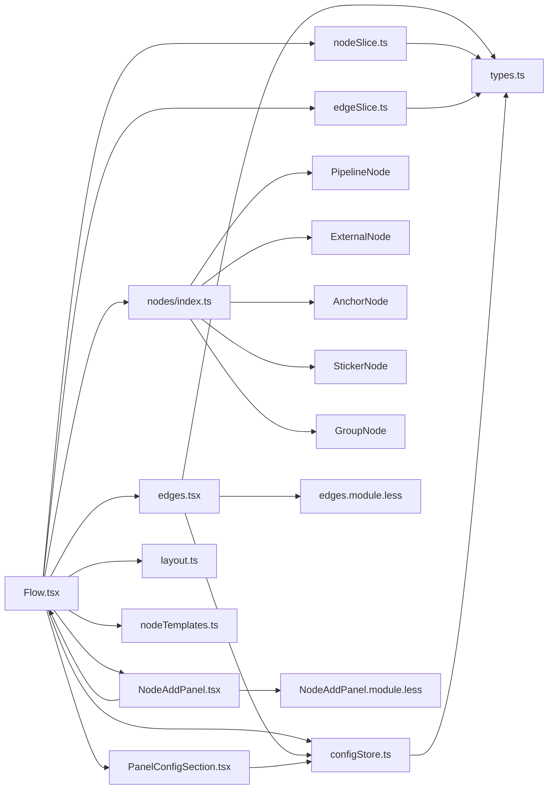
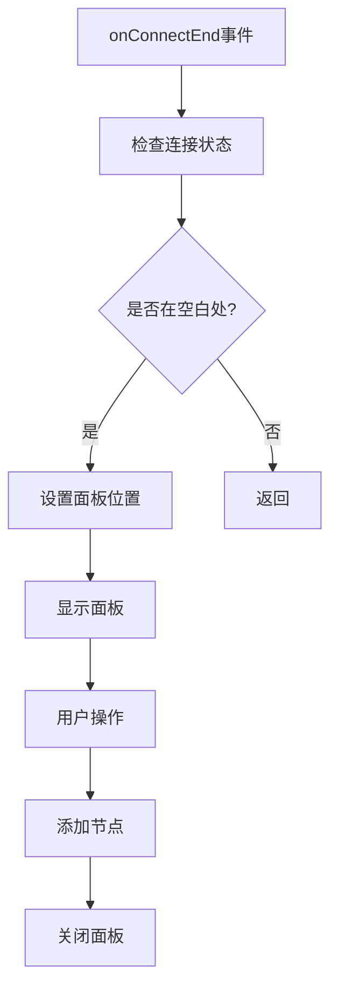
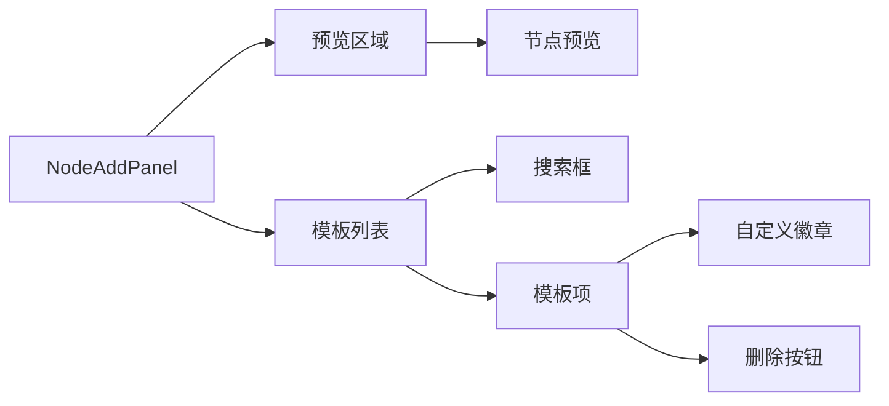

# 工作流编辑器

<cite>
**本文档引用的文件**
- [Flow.tsx](file://src/components/Flow.tsx)
- [edges.tsx](file://src/components/flow/edges.tsx)
- [nodes/index.ts](file://src/components/flow/nodes/index.ts)
- [nodes/constants.ts](file://src/components/flow/nodes/constants.ts)
- [PipelineNode/index.tsx](file://src/components/flow/nodes/PipelineNode/index.tsx)
- [ExternalNode.tsx](file://src/components/flow/nodes/ExternalNode.tsx)
- [AnchorNode.tsx](file://src/components/flow/nodes/AnchorNode.tsx)
- [StickerNode.tsx](file://src/components/flow/nodes/StickerNode.tsx)
- [GroupNode.tsx](file://src/components/flow/nodes/GroupNode.tsx)
- [NodeAddPanel.tsx](file://src/components/panels/main/NodeAddPanel.tsx)
- [types.ts](file://src/stores/flow/types.ts)
- [layout.ts](file://src/core/layout.ts)
- [nodeTemplates.ts](file://src/data/nodeTemplates.ts)
- [nodeSlice.ts](file://src/stores/flow/slices/nodeSlice.ts)
- [edgeSlice.ts](file://src/stores/flow/slices/edgeSlice.ts)
- [PanelConfigSection.tsx](file://src/components/panels/config/PanelConfigSection.tsx)
- [configStore.ts](file://src/stores/configStore.ts)
- [edges.module.less](file://src/styles/edges.module.less)
- [NodeAddPanel.module.less](file://src/styles/NodeAddPanel.module.less)
</cite>

## 更新摘要
**变更内容**
- 新增直角走线模式功能，支持更规整的连接样式
- 新增智能连接到空白处功能，支持从节点拖拽连接到画布空白区域时自动弹出节点添加面板
- 更新连接系统以支持两种边走线模式：曲线（贝塞尔）和直角（阶梯）
- 添加边走线模式配置面板和相关样式支持
- 增强边渲染逻辑以适应不同的路径模式
- 新增节点添加面板控制器和状态管理

## 目录
1. [简介](#简介)
2. [项目结构](#项目结构)
3. [核心组件](#核心组件)
4. [架构总览](#架构总览)
5. [详细组件分析](#详细组件分析)
6. [依赖分析](#依赖分析)
7. [性能考虑](#性能考虑)
8. [故障排查指南](#故障排查指南)
9. [结论](#结论)
10. [附录](#附录)

## 简介
本文件面向MaaPipelineEditor的工作流编辑器，系统性阐述节点系统、连接系统、节点操作、布局算法、节点编辑器以及扩展开发指南，并提供性能优化建议与最佳实践。读者无需深入前端技术背景即可理解并高效使用该编辑器。

**更新** 本版本新增了直角走线模式功能和智能连接到空白处功能，为用户提供更规整的连接样式选择和更便捷的节点创建体验，特别适用于需要清晰层次结构的工作流图。

## 项目结构
工作流编辑器基于React与@xyflow/react构建，采用模块化的节点与边实现、Zustand状态管理、ELKJS自动布局与磁吸对齐等能力，形成可扩展、可维护的可视化工作流编辑平台。

**图表来源**
- [Flow.tsx:193-542](file://src/components/Flow.tsx#L193-L542)
- [nodes/index.ts:1-26](file://src/components/flow/nodes/index.ts#L1-L26)
- [edges.tsx:1-592](file://src/components/flow/edges.tsx#L1-L592)
- [PanelConfigSection.tsx:154-181](file://src/components/panels/config/PanelConfigSection.tsx#L154-L181)
- [NodeAddPanel.tsx:1-583](file://src/components/panels/main/NodeAddPanel.tsx#L1-L583)
- [types.ts:1-362](file://src/stores/flow/types.ts#L1-L362)
- [layout.ts:1-142](file://src/core/layout.ts#L1-L142)
- [nodeTemplates.ts:1-108](file://src/data/nodeTemplates.ts#L1-L108)
- [configStore.ts:1-276](file://src/stores/configStore.ts#L1-L276)
- [edges.module.less:1-98](file://src/styles/edges.module.less#L1-L98)
- [NodeAddPanel.module.less:1-428](file://src/styles/NodeAddPanel.module.less#L1-L428)

**章节来源**
- [Flow.tsx:193-542](file://src/components/Flow.tsx#L193-L542)
- [nodes/index.ts:1-26](file://src/components/flow/nodes/index.ts#L1-L26)
- [edges.tsx:1-592](file://src/components/flow/edges.tsx#L1-L592)
- [PanelConfigSection.tsx:154-181](file://src/components/panels/config/PanelConfigSection.tsx#L154-L181)
- [NodeAddPanel.tsx:1-583](file://src/components/panels/main/NodeAddPanel.tsx#L1-L583)
- [types.ts:1-362](file://src/stores/flow/types.ts#L1-L362)
- [layout.ts:1-142](file://src/core/layout.ts#L1-L142)
- [nodeTemplates.ts:1-108](file://src/data/nodeTemplates.ts#L1-L108)
- [configStore.ts:1-276](file://src/stores/configStore.ts#L1-L276)
- [edges.module.less:1-98](file://src/styles/edges.module.less#L1-L98)
- [NodeAddPanel.module.less:1-428](file://src/styles/NodeAddPanel.module.less#L1-L428)

## 核心组件
- 工作流画布容器：负责节点与边的渲染、事件回调、键盘快捷键、视口持久化、磁吸对齐与分组拖拽逻辑。
- 节点系统：支持Pipeline、External、Anchor、Sticker、Group五类节点，每类节点具备独立的渲染与交互行为。
- **连接系统**：基于marked边类型，支持贝塞尔曲线路径、直角阶梯路径、控制点拖拽、标签排序、错误/跳转回链路样式区分。
- **边走线模式**：提供两种连接样式选择：曲线模式（贝塞尔）和直角模式（阶梯状折线），满足不同视觉需求。
- **智能连接到空白处**：当用户从节点拖拽连接到画布空白区域时，自动弹出节点添加面板，支持快速创建新节点。
- 状态管理：Zustand切片管理节点、边、历史、视口、选择、路径等状态，提供批量更新与历史快照。
- 布局与对齐：ELKJS分层布局，自动排列；内置对齐工具，支持顶部对齐、底部对齐、水平居中对齐。
- 节点模板与编辑器：提供常用节点模板，节点编辑器支持字段校验与实时预览。

**章节来源**
- [Flow.tsx:248-413](file://src/components/Flow.tsx#L248-L413)
- [edges.tsx:188-525](file://src/components/flow/edges.tsx#L188-L525)
- [PanelConfigSection.tsx:154-181](file://src/components/panels/config/PanelConfigSection.tsx#L154-L181)
- [types.ts:27-244](file://src/stores/flow/types.ts#L27-L244)
- [layout.ts:39-141](file://src/core/layout.ts#L39-L141)

## 架构总览
工作流编辑器采用"容器-节点-边-状态-布局"分层架构，容器负责事件与渲染，节点与边各自封装UI与交互，状态通过切片集中管理，布局算法独立于UI层。

**图表来源**
- [Flow.tsx:464-504](file://src/components/Flow.tsx#L464-L504)
- [nodes/index.ts:8-14](file://src/components/flow/nodes/index.ts#L8-L14)
- [edges.tsx:527-529](file://src/components/flow/edges.tsx#L527-L529)
- [edges.tsx:206-233](file://src/components/flow/edges.tsx#L206-L233)
- [edges.tsx:28-188](file://src/components/flow/edges.tsx#L28-L188)
- [NodeAddPanel.tsx:151-193](file://src/components/panels/main/NodeAddPanel.tsx#L151-L193)

**章节来源**
- [Flow.tsx:464-504](file://src/components/Flow.tsx#L464-L504)
- [nodes/index.ts:8-14](file://src/components/flow/nodes/index.ts#L8-L14)
- [edges.tsx:527-529](file://src/components/flow/edges.tsx#L527-L529)
- [edges.tsx:206-233](file://src/components/flow/edges.tsx#L206-L233)
- [edges.tsx:28-188](file://src/components/flow/edges.tsx#L28-L188)
- [NodeAddPanel.tsx:151-193](file://src/components/panels/main/NodeAddPanel.tsx#L151-L193)

## 详细组件分析

### 节点系统与类型模型
- 节点类型枚举：Pipeline、External、Anchor、Sticker、Group。
- 边类型：marked边，支持label作为链路顺序，attributes存储jump_back、anchor等属性。
- 节点数据模型：Pipeline包含识别与动作参数、others及其他扩展；External/Anchor包含标签与方向；Sticker包含标签、内容与颜色主题；Group包含标签与颜色主题。
- 节点句柄方向：支持left-right、right-left、top-bottom、bottom-top四种方向，默认left-right。

**图表来源**
- [types.ts:14-244](file://src/stores/flow/types.ts#L14-L244)
- [nodes/constants.ts:14-20](file://src/components/flow/nodes/constants.ts#L14-L20)

**章节来源**
- [types.ts:14-244](file://src/stores/flow/types.ts#L14-L244)
- [nodes/constants.ts:14-20](file://src/components/flow/nodes/constants.ts#L14-L20)

### 节点实现与交互

#### Pipeline节点
- 支持三种外观风格：经典、现代、极简，由配置切换。
- 与调试状态联动：执行中、已执行、正在识别、失败等状态样式。
- 与选中/路径/聚焦透明度联动，实现"聚焦相关元素"的视觉聚焦效果。
- 右键菜单集成，支持节点上下文操作。

**图表来源**
- [PipelineNode/index.tsx:22-194](file://src/components/flow/nodes/PipelineNode/index.tsx#L22-L194)
- [Flow.tsx:464-504](file://src/components/Flow.tsx#L464-L504)

**章节来源**
- [PipelineNode/index.tsx:22-194](file://src/components/flow/nodes/PipelineNode/index.tsx#L22-L194)

#### External节点
- 仅展示标签与句柄，适合作为外部入口/出口节点。
- 支持句柄方向配置，便于与上游/下游节点对齐。

**章节来源**
- [ExternalNode.tsx:29-145](file://src/components/flow/nodes/ExternalNode.tsx#L29-L145)

#### Anchor节点
- 用于重定向/锚点，支持句柄方向配置。
- 常用于流程跳转或复用节点。

**章节来源**
- [AnchorNode.tsx:31-147](file://src/components/flow/nodes/AnchorNode.tsx#L31-L147)

#### Sticker节点
- 可拖拽调整大小，支持多颜色主题。
- 双击进入编辑模式，支持标题与内容修改。
- 不受"聚焦透明度"影响，始终可见。

**章节来源**
- [StickerNode.tsx:165-237](file://src/components/flow/nodes/StickerNode.tsx#L165-L237)

#### Group节点
- 支持标题编辑与拖拽调整大小。
- 子节点相对定位，拖出边界自动脱离分组。
- 提供多种颜色主题，增强分组辨识度。

**章节来源**
- [GroupNode.tsx:112-184](file://src/components/flow/nodes/GroupNode.tsx#L112-L184)

### 连接系统与边渲染

**更新** 新增直角走线模式功能，提供两种连接样式选择：

- **贝塞尔曲线模式**：支持控制点拖拽调整路径形状，双击重置，适合需要流畅曲线的工作流。
- **直角阶梯模式**：使用阶梯状折线连接节点，路径规整清晰，适合需要清晰层次结构的工作流图。

**新增** 智能连接到空白处功能：

- **自动弹出面板**：当用户从节点拖拽连接到画布空白区域时，自动在鼠标位置弹出节点添加面板。
- **配置开关**：可通过配置面板启用/禁用此功能，支持"连接空白处时创建"选项。
- **状态管理**：使用useState管理面板可见性与位置，结合useRef处理连接状态跟踪。
- **事件处理**：在onConnectEnd事件中检测连接是否结束在空白区域，如果是则触发面板显示。

**图表来源**
- [Flow.tsx:256-256](file://src/components/Flow.tsx#L256-L256)
- [Flow.tsx:278-323](file://src/components/Flow.tsx#L278-L323)
- [edges.tsx:188-525](file://src/components/flow/edges.tsx#L188-L525)
- [edges.tsx:299-344](file://src/components/flow/edges.tsx#L299-L344)

**章节来源**
- [Flow.tsx:256-256](file://src/components/Flow.tsx#L256-L256)
- [Flow.tsx:278-323](file://src/components/Flow.tsx#L278-L323)
- [edges.tsx:188-525](file://src/components/flow/edges.tsx#L188-L525)
- [edges.tsx:299-344](file://src/components/flow/edges.tsx#L299-L344)

### 边走线模式配置

**新增** 用户可以通过配置面板选择边的走线模式：

- **曲线模式**：使用贝塞尔曲线连接节点，线条平滑流畅
- **直角模式**：使用阶梯状折线连接节点，路径规整清晰

**图表来源**
- [PanelConfigSection.tsx:154-181](file://src/components/panels/config/PanelConfigSection.tsx#L154-L181)
- [edges.tsx:300-310](file://src/components/flow/edges.tsx#L300-L310)

**章节来源**
- [PanelConfigSection.tsx:154-181](file://src/components/panels/config/PanelConfigSection.tsx#L154-L181)
- [configStore.ts:95-96](file://src/stores/configStore.ts#L95-L96)
- [edges.tsx:300-310](file://src/components/flow/edges.tsx#L300-L310)

### 智能连接到空白处功能

**新增** 智能连接到空白处功能的技术实现：

- **连接检测**：在onConnectEnd事件中检测连接是否结束在空白区域，通过FinalConnectionState判断。
- **面板控制**：使用useState管理NodeAddPanel的可见性与位置，结合useRef跟踪连接状态。
- **坐标转换**：通过screenToFlowPosition将屏幕坐标转换为画布坐标，确保面板显示在正确位置。
- **配置开关**：通过quickCreateNodeOnConnectBlank配置项控制功能启用状态，默认开启。
- **事件抑制**：使用suppressNextPaneClickRef防止面板弹出后立即关闭。

**图表来源**
- [Flow.tsx:278-323](file://src/components/Flow.tsx#L278-L323)
- [Flow.tsx:331-361](file://src/components/Flow.tsx#L331-L361)
- [NodeAddPanel.tsx:151-193](file://src/components/panels/main/NodeAddPanel.tsx#L151-L193)

**章节来源**
- [Flow.tsx:278-323](file://src/components/Flow.tsx#L278-L323)
- [Flow.tsx:331-361](file://src/components/Flow.tsx#L331-L361)
- [NodeAddPanel.tsx:151-193](file://src/components/panels/main/NodeAddPanel.tsx#L151-L193)

### 节点操作与磁吸对齐
- 拖拽磁吸：拖拽节点时计算与其他节点的对齐参考线，拖拽结束时应用对齐位置。
- 分组拖拽：拖入/拖出分组检测，自动挂载/脱离父分组。
- 键盘快捷键：支持复制/粘贴节点。
- 视口持久化：视口变化时保存至文件配置。

**图表来源**
- [Flow.tsx:297-360](file://src/components/Flow.tsx#L297-L360)

**章节来源**
- [Flow.tsx:297-360](file://src/components/Flow.tsx#L297-L360)

### 布局算法与自动排列
- 自动布局：基于ELKJS分层布局算法，根据节点测量宽高生成布局，批量更新节点位置。
- 对齐工具：支持顶部对齐、底部对齐、水平居中对齐，生成NodeChange批量更新。
- 依赖：节点需完成测量（measured.width/height），否则延时重试。

**图表来源**
- [layout.ts:46-107](file://src/core/layout.ts#L46-L107)

**章节来源**
- [layout.ts:46-107](file://src/core/layout.ts#L46-L107)

### 节点编辑器与字段验证
- 字段工厂与模式：识别/动作/其他三类参数通过字段工厂与模式驱动，支持类型切换时自动增删字段与默认值填充。
- 批量更新：支持一次性应用多个字段更新，减少多次渲染。
- 名称重复检测：节点标签重复时在错误面板提示。
- 实时预览：字段变更即时反映到节点外观与边样式。

**章节来源**
- [nodeSlice.ts:291-394](file://src/stores/flow/slices/nodeSlice.ts#L291-L394)
- [nodeSlice.ts:402-516](file://src/stores/flow/slices/nodeSlice.ts#L402-L516)

### 节点模板与节点列表
- 节点模板：提供空节点、文字识别、图像识别、无延迟节点、直接点击、自定义动作、外部节点、锚点、便签、分组等模板。
- 节点列表：按类型分组展示，支持图标与统计信息。

**章节来源**
- [nodeTemplates.ts:13-108](file://src/data/nodeTemplates.ts#L13-L108)

## 依赖分析
- 容器依赖：Flow.tsx依赖节点注册表、边类型、配置、磁吸工具与状态切片。
- 节点依赖：各节点组件依赖状态切片、配置、调试状态与右键菜单。
- 边依赖：edges.tsx依赖句柄方向、控制点拖拽、标签排序与样式类，新增直角路径计算依赖。
- 状态依赖：nodeSlice与edgeSlice分别管理节点与边的状态变更、历史与批量更新。
- 布局依赖：layout.ts依赖ELKJS与节点测量信息。
- 配置依赖：configStore提供边走线模式配置，PanelConfigSection提供用户界面。
- **新增** 节点添加面板依赖：NodeAddPanel依赖Flow.tsx的状态管理与坐标转换功能。

**图表来源**
- [Flow.tsx:29-40](file://src/components/Flow.tsx#L29-L40)
- [nodes/index.ts:1-26](file://src/components/flow/nodes/index.ts#L1-L26)
- [edges.tsx:14-18](file://src/components/flow/edges.tsx#L14-L18)
- [PanelConfigSection.tsx:154-181](file://src/components/panels/config/PanelConfigSection.tsx#L154-L181)
- [NodeAddPanel.tsx:1-583](file://src/components/panels/main/NodeAddPanel.tsx#L1-L583)
- [nodeSlice.ts:1-35](file://src/stores/flow/slices/nodeSlice.ts#L1-L35)
- [edgeSlice.ts:1-15](file://src/stores/flow/slices/edgeSlice.ts#L1-L15)
- [configStore.ts:1-276](file://src/stores/configStore.ts#L1-L276)

**章节来源**
- [Flow.tsx:29-40](file://src/components/Flow.tsx#L29-L40)
- [nodes/index.ts:1-26](file://src/components/flow/nodes/index.ts#L1-L26)
- [edges.tsx:14-18](file://src/components/flow/edges.tsx#L14-L18)
- [PanelConfigSection.tsx:154-181](file://src/components/panels/config/PanelConfigSection.tsx#L154-L181)
- [NodeAddPanel.tsx:1-583](file://src/components/panels/main/NodeAddPanel.tsx#L1-L583)
- [nodeSlice.ts:1-35](file://src/stores/flow/slices/nodeSlice.ts#L1-L35)
- [edgeSlice.ts:1-15](file://src/stores/flow/slices/edgeSlice.ts#L1-L15)
- [configStore.ts:1-276](file://src/stores/configStore.ts#L1-L276)

## 性能考虑
- 渲染优化
  - 使用memo与浅比较避免不必要的重渲染（如PipelineNodeMemo、StickerNodeMemo等）。
  - 节点与边组件内部按需计算样式与类名，减少DOM开销。
- 交互优化
  - 拖拽磁吸与分组拖拽采用节流/防抖策略，避免频繁状态更新。
  - 视口变化与节点尺寸变化使用ResizeObserver与防抖函数，降低重排频率。
  - **新增** 智能连接到空白处功能使用useRef跟踪连接状态，避免不必要的重新渲染。
- 状态管理
  - 历史快照按操作类型延迟保存，减少频繁写入。
  - 批量更新接口（batchSetNodeData）减少多次渲染与状态变更。
- 布局优化
  - ELKJS布局在节点测量完成后执行，未测量节点延时重试，避免阻塞主线程。
  - 自动布局在下一帧执行，避免同步阻塞渲染。
- **边渲染优化**
  - **新增** 直角模式使用getSmoothStepPath，相比贝塞尔曲线计算更简单，性能更好。
  - **新增** 贝塞尔模式的控制点拖拽仅在需要时计算，避免不必要的重渲染。
- **新增** 节点添加面板优化
  - 使用memo包装NodeAddPanelController，避免面板组件的不必要重渲染。
  - 面板位置计算使用useMemo缓存，减少重复计算。

[本节为通用性能指导，无需特定文件引用]

## 故障排查指南
- 节点名称重复
  - 现象：错误面板提示重复节点名。
  - 排查：检查节点标签是否重复，必要时修改标签或启用导出配置前缀。
  - 参考：节点数据更新时的重复检测逻辑。
- 边顺序异常
  - 现象：同源同句柄边顺序错乱。
  - 排查：通过边标签排序接口重新计算顺序，确保新增边label正确。
  - 参考：边标签更新与顺序计算逻辑。
- 磁吸无效
  - 现象：拖拽节点不吸附。
  - 排查：确认磁吸开关与仅视口内吸附设置；检查节点是否为分组节点；确认节点测量尺寸是否存在。
  - 参考：磁吸对齐计算与拖拽停止逻辑。
- 自动布局不生效
  - 现象：节点未自动排列。
  - 排查：确认节点已完成测量；等待测量完成后自动重试；检查ELKJS是否报错。
  - 参考：自动布局执行与测量检查逻辑。
- **边走线模式问题**
  - **新增** 现象：直角模式下连接线出现角度问题。
  - 排查：确认节点句柄方向配置正确；检查节点位置关系；尝试切换到贝塞尔模式验证问题。
  - 参考：直角路径计算逻辑与句柄方向映射。
- **智能连接到空白处问题**
  - **新增** 现象：连接到空白处不弹出面板。
  - 排查：确认quickCreateNodeOnConnectBlank配置项已启用；检查连接事件处理逻辑；验证面板状态管理。
  - 参考：连接检测逻辑与面板控制状态。

**章节来源**
- [nodeSlice.ts:377-391](file://src/stores/flow/slices/nodeSlice.ts#L377-L391)
- [edgeSlice.ts:102-148](file://src/stores/flow/slices/edgeSlice.ts#L102-L148)
- [Flow.tsx:297-360](file://src/components/Flow.tsx#L297-L360)
- [layout.ts:55-64](file://src/core/layout.ts#L55-L64)
- [edges.tsx:206-233](file://src/components/flow/edges.tsx#L206-L233)
- [Flow.tsx:278-323](file://src/components/Flow.tsx#L278-L323)

## 结论
MaaPipelineEditor的工作流编辑器以清晰的分层架构、完善的节点与边系统、灵活的状态管理与强大的布局能力，提供了高效、易用且可扩展的可视化工作流设计体验。

**更新** 新增的直角走线模式功能和智能连接到空白处功能进一步增强了编辑器的灵活性与用户体验。直角走线模式提供了更规整的连接样式，而智能连接功能让用户能够更便捷地从现有节点继续创建工作流。通过本文档的节点类型说明、连接机制解析、操作流程梳理与扩展指南，用户可以快速掌握编辑器的使用与二次开发。

## 附录

### 节点扩展开发指南
- 新增节点类型步骤
  - 定义节点类型枚举与数据模型：在类型定义文件中新增类型与数据结构。
  - 实现节点组件：参考现有节点（如PipelineNode/ExternalNode/AnchorNode/StickerNode/GroupNode）实现渲染与交互。
  - 注册节点：在节点注册表中导出并注册新节点类型。
  - 状态适配：在状态切片中补充对应的数据更新与批量更新逻辑。
  - 边样式适配：如需特殊边样式，在边渲染中增加条件分支。
  - 模板与列表：在节点模板与节点列表中添加新节点的展示信息。
- 最佳实践
  - 使用memo与浅比较减少重渲染。
  - 保持数据模型稳定，避免深层对象频繁变更。
  - 为新节点提供默认句柄方向与合理的尺寸。
  - 在右键菜单中提供必要的上下文操作。
- **直角走线模式适配**
  - **新增** 新节点应支持直角模式下的路径计算，确保连接线在直角模式下也能正确显示。
  - **新增** 考虑节点形状对直角路径的影响，可能需要调整节点的视觉表现以配合直角连接线。
- **智能连接到空白处适配**
  - **新增** 新节点类型应考虑在智能连接场景下的用户体验，确保节点添加面板能够正确显示。
  - **新增** 考虑节点的默认属性设置，使智能连接创建的节点能够立即投入使用。

**章节来源**
- [types.ts:14-244](file://src/stores/flow/types.ts#L14-L244)
- [nodes/index.ts:8-14](file://src/components/flow/nodes/index.ts#L8-L14)
- [nodeSlice.ts:132-288](file://src/stores/flow/slices/nodeSlice.ts#L132-L288)
- [edges.tsx:413-451](file://src/components/flow/edges.tsx#L413-L451)
- [nodeTemplates.ts:13-108](file://src/data/nodeTemplates.ts#L13-L108)
- [edges.tsx:206-233](file://src/components/flow/edges.tsx#L206-L233)

### 直角走线模式技术实现

**新增** 直角走线模式的技术细节：

- **路径计算**：使用getSmoothStepPath函数生成阶梯状折线，支持四个方向的直角转弯。
- **样式支持**：直角路径使用直线段连接，没有曲线部分，视觉上更加规整。
- **性能优势**：相比贝塞尔曲线，直角路径计算更简单，渲染性能更好。
- **适用场景**：特别适合需要清晰层次结构的工作流图，如流程图、状态机等。

**图表来源**
- [edges.tsx:206-233](file://src/components/flow/edges.tsx#L206-L233)
- [edges.tsx:222-230](file://src/components/flow/edges.tsx#L222-L230)

**章节来源**
- [edges.tsx:206-233](file://src/components/flow/edges.tsx#L206-L233)
- [edges.tsx:222-230](file://src/components/flow/edges.tsx#L222-L230)
- [edges.module.less:1-98](file://src/styles/edges.module.less#L1-L98)

### 智能连接到空白处技术实现

**新增** 智能连接到空白处功能的技术细节：

- **连接检测**：通过FinalConnectionState参数判断连接是否结束在空白区域，使用!connectionState.isValid && !connectionState.toNode && !connectionState.toHandle条件。
- **状态管理**：使用useState管理面板可见性与位置，useRef跟踪连接状态，避免不必要的重新渲染。
- **坐标转换**：通过screenToFlowPosition将屏幕坐标转换为画布坐标，确保面板显示在正确位置。
- **事件处理**：在onConnectEnd事件中处理连接完成后的逻辑，结合配置开关控制功能启用状态。
- **面板控制**：NodeAddPanelController组件负责面板的位置计算与重新打开功能。

**图表来源**
- [Flow.tsx:278-323](file://src/components/Flow.tsx#L278-L323)
- [Flow.tsx:151-193](file://src/components/Flow.tsx#L151-L193)
- [NodeAddPanel.tsx:151-193](file://src/components/panels/main/NodeAddPanel.tsx#L151-L193)

**章节来源**
- [Flow.tsx:278-323](file://src/components/Flow.tsx#L278-L323)
- [Flow.tsx:151-193](file://src/components/Flow.tsx#L151-L193)
- [NodeAddPanel.tsx:151-193](file://src/components/panels/main/NodeAddPanel.tsx#L151-L193)

### 节点添加面板设计

**新增** 节点添加面板的设计特点：

- **双栏布局**：左侧预览区域显示节点预览，右侧列表区域显示模板列表。
- **响应式设计**：根据鼠标位置自动调整布局方向，避免超出视口边界。
- **键盘导航**：支持上下箭头键选择模板，Enter键添加，Esc键关闭。
- **搜索功能**：支持按节点标签搜索模板，提高查找效率。
- **自定义模板**：支持删除自定义模板，提供模板管理功能。
- **动画效果**：使用fadeIn动画提升用户体验，避免突兀的显示效果。

**图表来源**
- [NodeAddPanel.tsx:444-580](file://src/components/panels/main/NodeAddPanel.tsx#L444-L580)
- [NodeAddPanel.module.less:12-45](file://src/styles/NodeAddPanel.module.less#L12-L45)

**章节来源**
- [NodeAddPanel.tsx:444-580](file://src/components/panels/main/NodeAddPanel.tsx#L444-L580)
- [NodeAddPanel.module.less:12-45](file://src/styles/NodeAddPanel.module.less#L12-L45)