# 工作流编辑器

<cite>
**本文档引用的文件**
- [Flow.tsx](file://src/components/Flow.tsx)
- [edges.tsx](file://src/components/flow/edges.tsx)
- [nodes/index.ts](file://src/components/flow/nodes/index.ts)
- [nodes/constants.ts](file://src/components/flow/nodes/constants.ts)
- [PipelineNode/index.tsx](file://src/components/flow/nodes/PipelineNode/index.tsx)
- [ExternalNode.tsx](file://src/components/flow/nodes/ExternalNode.tsx)
- [AnchorNode.tsx](file://src/components/flow/nodes/AnchorNode.tsx)
- [StickerNode.tsx](file://src/components/flow/nodes/StickerNode.tsx)
- [GroupNode.tsx](file://src/components/flow/nodes/GroupNode.tsx)
- [SelectionContextMenu.tsx](file://src/components/flow/selectionContextMenu.tsx)
- [SelectionContextMenu.tsx](file://src/components/flow/components/SelectionContextMenu.tsx)
- [NodeJsonEditorModal.tsx](file://src/components/modals/NodeJsonEditorModal.tsx)
- [FieldSortModal.tsx](file://src/components/modals/FieldSortModal.tsx)
- [avoidanceUtils.ts](file://src/core/avoidanceUtils.ts)
- [pathSlice.ts](file://src/stores/flow/slices/pathSlice.ts)
- [PathSelector.tsx](file://src/components/panels/tools/PathSelector.tsx)
- [types.ts](file://src/stores/flow/types.ts)
- [layout.ts](file://src/core/layout.ts)
- [nodeTemplates.ts](file://src/data/nodeTemplates.ts)
- [nodeSlice.ts](file://src/stores/flow/slices/nodeSlice.ts)
- [edgeSlice.ts](file://src/stores/flow/slices/edgeSlice.ts)
</cite>

## 更新摘要
**变更内容**
- 新增多选上下文菜单功能，支持批量节点操作
- 增强边避让算法，实现智能路径规划
- 新增字段排序系统，支持自定义字段排列顺序
- 引入JSON编辑器，提供节点数据的直接编辑能力
- 新增路径查找工具，支持工作流路径分析

## 目录
1. [简介](#简介)
2. [项目结构](#项目结构)
3. [核心组件](#核心组件)
4. [架构总览](#架构总览)
5. [详细组件分析](#详细组件分析)
6. [依赖分析](#依赖分析)
7. [性能考虑](#性能考虑)
8. [故障排查指南](#故障排查指南)
9. [结论](#结论)
10. [附录](#附录)

## 简介
本文件面向MaaPipelineEditor的工作流编辑器，系统性阐述节点系统、连接系统、节点操作、布局算法、节点编辑器以及扩展开发指南，并提供性能优化建议与最佳实践。读者无需深入前端技术背景即可理解并高效使用该编辑器。

**更新** 本次更新重点介绍了新增的多选上下文菜单、高级路由算法、字段排序系统和JSON编辑能力等增强功能。

## 项目结构
工作流编辑器基于React与@xyflow/react构建，采用模块化的节点与边实现、Zustand状态管理、ELKJS自动布局与磁吸对齐等能力，形成可扩展、可维护的可视化工作流编辑平台。

```mermaid
graph TB
subgraph "UI层"
Flow["Flow.tsx<br/>工作流画布容器"]
Nodes["nodes/index.ts<br/>节点注册"]
Edges["edges.tsx<br/>边渲染与交互"]
SelectionMenu["SelectionContextMenu.tsx<br/>多选上下文菜单"]
JsonEditor["NodeJsonEditorModal.tsx<br/>JSON编辑器"]
FieldSort["FieldSortModal.tsx<br/>字段排序"]
PathSelector["PathSelector.tsx<br/>路径选择器"]
end
subgraph "节点实现"
PN["PipelineNode/index.tsx"]
EN["ExternalNode.tsx"]
AN["AnchorNode.tsx"]
SN["StickerNode.tsx"]
GN["GroupNode.tsx"]
end
subgraph "状态与模型"
Types["stores/flow/types.ts<br/>类型定义"]
NSlice["stores/flow/slices/nodeSlice.ts<br/>节点状态"]
ESlice["stores/flow/slices/edgeSlice.ts<br/>边状态"]
PathSlice["stores/flow/slices/pathSlice.ts<br/>路径状态"]
end
subgraph "算法与工具"
Layout["core/layout.ts<br/>自动布局/对齐"]
Avoidance["core/avoidanceUtils.ts<br/>避让算法"]
FieldSortCore["core/sorting/*<br/>字段排序系统"]
Templates["data/nodeTemplates.ts<br/>节点模板"]
end
Flow --> Nodes
Flow --> Edges
Flow --> SelectionMenu
Flow --> JsonEditor
Flow --> FieldSort
Flow --> PathSelector
Nodes --> PN
Nodes --> EN
Nodes --> AN
Nodes --> SN
Nodes --> GN
Flow --> Types
Flow --> NSlice
Flow --> ESlice
Flow --> PathSlice
Flow --> Layout
Flow --> Avoidance
Flow --> FieldSortCore
Flow --> Templates
```

**图表来源**
- [Flow.tsx:193-542](file://src/components/Flow.tsx#L193-L542)
- [nodes/index.ts:1-26](file://src/components/flow/nodes/index.ts#L1-L26)
- [edges.tsx:1-530](file://src/components/flow/edges.tsx#L1-L530)
- [SelectionContextMenu.tsx:1-161](file://src/components/flow/components/SelectionContextMenu.tsx#L1-L161)
- [NodeJsonEditorModal.tsx:1-464](file://src/components/modals/NodeJsonEditorModal.tsx#L1-L464)
- [FieldSortModal.tsx:1-200](file://src/components/modals/FieldSortModal.tsx#L1-L200)
- [PathSelector.tsx:1-120](file://src/components/panels/tools/PathSelector.tsx#L1-L120)
- [avoidanceUtils.ts:1-200](file://src/core/avoidanceUtils.ts#L1-L200)
- [pathSlice.ts:1-159](file://src/stores/flow/slices/pathSlice.ts#L1-L159)

**章节来源**
- [Flow.tsx:193-542](file://src/components/Flow.tsx#L193-L542)
- [nodes/index.ts:1-26](file://src/components/flow/nodes/index.ts#L1-L26)
- [edges.tsx:1-530](file://src/components/flow/edges.tsx#L1-L530)
- [SelectionContextMenu.tsx:1-161](file://src/components/flow/components/SelectionContextMenu.tsx#L1-L161)
- [NodeJsonEditorModal.tsx:1-464](file://src/components/modals/NodeJsonEditorModal.tsx#L1-L464)
- [FieldSortModal.tsx:1-200](file://src/components/modals/FieldSortModal.tsx#L1-L200)
- [PathSelector.tsx:1-120](file://src/components/panels/tools/PathSelector.tsx#L1-L120)
- [avoidanceUtils.ts:1-200](file://src/core/avoidanceUtils.ts#L1-L200)
- [pathSlice.ts:1-159](file://src/stores/flow/slices/pathSlice.ts#L1-L159)

## 核心组件
- 工作流画布容器：负责节点与边的渲染、事件回调、键盘快捷键、视口持久化、磁吸对齐与分组拖拽逻辑。
- 节点系统：支持Pipeline、External、Anchor、Sticker、Group五类节点，每类节点具备独立的渲染与交互行为。
- 连接系统：基于marked边类型，支持贝塞尔曲线路径、控制点拖拽、标签排序、错误/跳转回链路样式区分。
- 多选上下文菜单：支持批量节点操作，包括复制、创建副本、部分导出、对齐、间距调整、分组管理等。
- 高级避让算法：实现智能路径规划，支持节点间避让、自循环处理和递归绕行。
- 字段排序系统：提供自定义字段排列顺序，支持主任务字段、识别参数、动作参数等分类排序。
- JSON编辑器：提供节点数据的直接编辑能力，支持语法验证、自动补全和格式化。
- 路径查找工具：支持工作流路径分析，提供起始节点和结束节点的选择功能。
- 状态管理：Zustand切片管理节点、边、历史、视口、选择、路径等状态，提供批量更新与历史快照。
- 布局与对齐：ELKJS分层布局，自动排列；内置对齐工具，支持顶部对齐、底部对齐、水平居中对齐。
- 节点模板与编辑器：提供常用节点模板，节点编辑器支持字段校验与实时预览。

**章节来源**
- [Flow.tsx:248-413](file://src/components/Flow.tsx#L248-L413)
- [edges.tsx:188-525](file://src/components/flow/edges.tsx#L188-L525)
- [SelectionContextMenu.tsx:314-487](file://src/components/flow/selectionContextMenu.tsx#L314-L487)
- [avoidanceUtils.ts:379-587](file://src/core/avoidanceUtils.ts#L379-L587)
- [FieldSortModal.tsx:104-170](file://src/components/modals/FieldSortModal.tsx#L104-L170)
- [NodeJsonEditorModal.tsx:271-464](file://src/components/modals/NodeJsonEditorModal.tsx#L271-L464)
- [PathSelector.tsx:6-120](file://src/components/panels/tools/PathSelector.tsx#L6-L120)
- [types.ts:27-244](file://src/stores/flow/types.ts#L27-L244)
- [layout.ts:39-141](file://src/core/layout.ts#L39-L141)

## 架构总览
工作流编辑器采用"容器-节点-边-状态-布局"分层架构，容器负责事件与渲染，节点与边各自封装UI与交互，状态通过切片集中管理，布局算法独立于UI层。

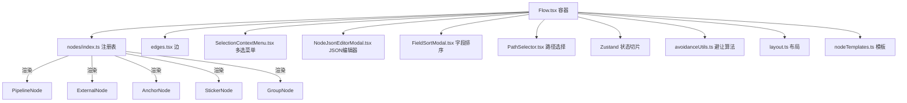

**图表来源**
- [Flow.tsx:464-504](file://src/components/Flow.tsx#L464-L504)
- [nodes/index.ts:8-14](file://src/components/flow/nodes/index.ts#L8-L14)
- [edges.tsx:527-529](file://src/components/flow/edges.tsx#L527-L529)
- [SelectionContextMenu.tsx:50-161](file://src/components/flow/components/SelectionContextMenu.tsx#L50-L161)
- [NodeJsonEditorModal.tsx:271-464](file://src/components/modals/NodeJsonEditorModal.tsx#L271-L464)
- [FieldSortModal.tsx:104-170](file://src/components/modals/FieldSortModal.tsx#L104-L170)
- [PathSelector.tsx:6-120](file://src/components/panels/tools/PathSelector.tsx#L6-L120)

**章节来源**
- [Flow.tsx:464-504](file://src/components/Flow.tsx#L464-L504)
- [nodes/index.ts:8-14](file://src/components/flow/nodes/index.ts#L8-L14)
- [edges.tsx:527-529](file://src/components/flow/edges.tsx#L527-L529)
- [SelectionContextMenu.tsx:50-161](file://src/components/flow/components/SelectionContextMenu.tsx#L50-L161)
- [NodeJsonEditorModal.tsx:271-464](file://src/components/modals/NodeJsonEditorModal.tsx#L271-L464)
- [FieldSortModal.tsx:104-170](file://src/components/modals/FieldSortModal.tsx#L104-L170)
- [PathSelector.tsx:6-120](file://src/components/panels/tools/PathSelector.tsx#L6-L120)

## 详细组件分析

### 多选上下文菜单系统
- 多选支持：支持同时选择多个节点和边，提供批量操作能力。
- 菜单项分类：包括编辑操作（复制、创建副本、部分导出）、布局操作（对齐、间距调整）、分组操作（创建分组、移出分组、解散分组）和删除操作。
- 条件可见性：根据选中状态动态显示可用的菜单项，如对齐操作仅在多选时显示。
- 子菜单结构：分组操作使用子菜单，提供更精细的操作选项。
- 禁用逻辑：根据当前选中状态智能禁用不适用的菜单项。

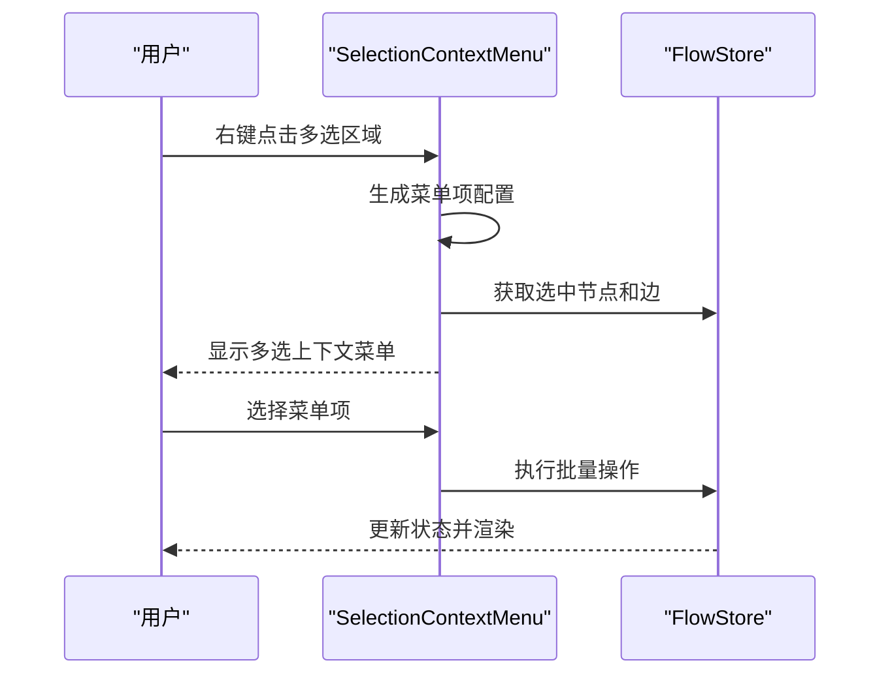

**图表来源**
- [SelectionContextMenu.tsx:50-161](file://src/components/flow/components/SelectionContextMenu.tsx#L50-L161)
- [SelectionContextMenu.tsx:314-487](file://src/components/flow/selectionContextMenu.tsx#L314-L487)

**章节来源**
- [SelectionContextMenu.tsx:50-161](file://src/components/flow/components/SelectionContextMenu.tsx#L50-L161)
- [SelectionContextMenu.tsx:314-487](file://src/components/flow/selectionContextMenu.tsx#L314-L487)

### 高级避让算法
- 智能路径规划：实现复杂的边避让算法，自动避开节点障碍物。
- 多种路径策略：支持直线连接、45度斜线路径、直角路径变体和递归绕行。
- 配置化参数：提供可调的递归深度、避让边距、转角半径等参数。
- 自循环处理：专门处理节点自连接的情况，提供最优绕行路径。
- 性能优化：使用递归限制和路径长度检查，避免无限递归和过度计算。

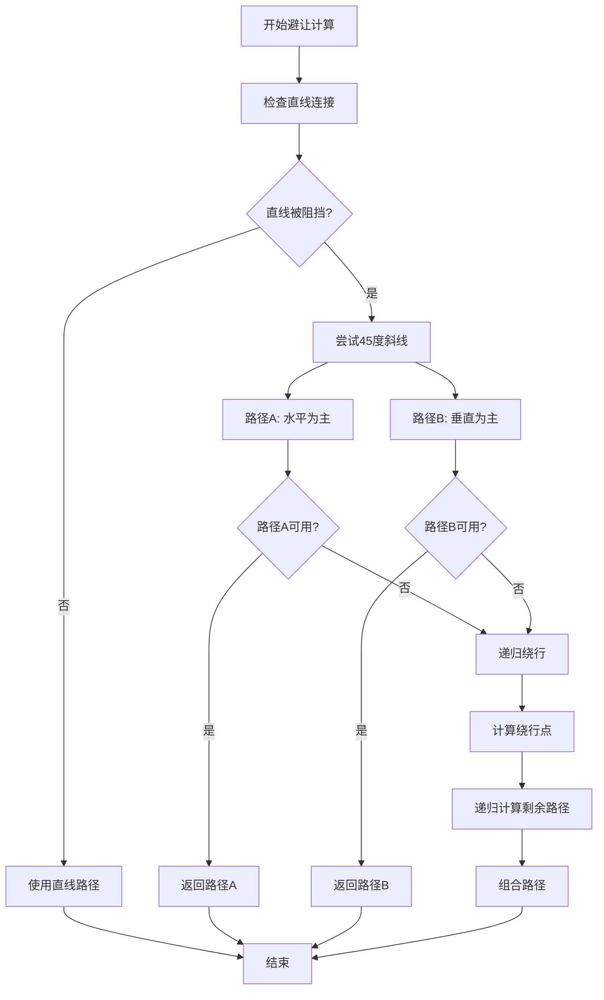

**图表来源**
- [avoidanceUtils.ts:379-587](file://src/core/avoidanceUtils.ts#L379-L587)

**章节来源**
- [avoidanceUtils.ts:379-587](file://src/core/avoidanceUtils.ts#L379-L587)

### 字段排序系统
- 配置化排序：支持自定义字段排列顺序，包括主任务字段、识别参数、动作参数等。
- 版本兼容：支持v1和v2协议版本的不同排序策略。
- 默认配置：提供合理的默认排序顺序，确保用户体验。
- 动态应用：排序配置可动态应用到导出的节点数据中。
- 用户界面：提供直观的排序配置界面，支持重置为默认值。

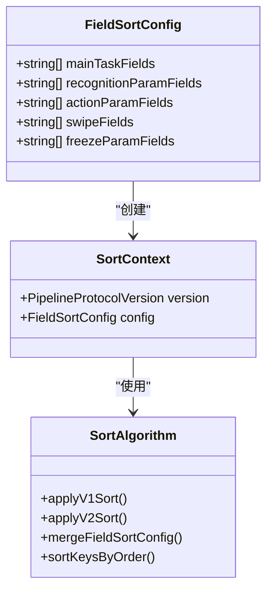

**图表来源**
- [FieldSortModal.tsx:104-170](file://src/components/modals/FieldSortModal.tsx#L104-L170)
- [applySort.ts:314-340](file://src/core/sorting/applySort.ts#L314-L340)

**章节来源**
- [FieldSortModal.tsx:104-170](file://src/components/modals/FieldSortModal.tsx#L104-L170)
- [applySort.ts:314-340](file://src/core/sorting/applySort.ts#L314-L340)

### JSON编辑器
- 专业编辑器：基于Monaco Editor提供专业的JSON编辑体验。
- 语法验证：实时验证JSON语法，提供错误提示和修复建议。
- 智能补全：支持MaaFramework字段的智能补全，包括识别类型、动作类型和字段名称。
- 格式化功能：提供一键格式化和缩进设置。
- 数据转换：支持MFW格式与Store格式之间的双向转换。
- 实时预览：编辑过程中的实时验证和错误反馈。

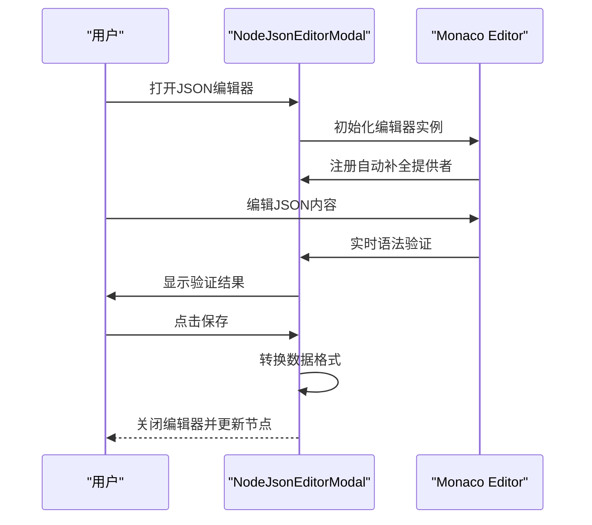

**图表来源**
- [NodeJsonEditorModal.tsx:271-464](file://src/components/modals/NodeJsonEditorModal.tsx#L271-L464)

**章节来源**
- [NodeJsonEditorModal.tsx:271-464](file://src/components/modals/NodeJsonEditorModal.tsx#L271-L464)

### 路径查找工具
- 路径分析：支持查找从起始节点到结束节点的所有可达路径。
- 可视化显示：在工作流中高亮显示找到的路径节点和边。
- 状态管理：使用专用的pathSlice管理路径查找状态。
- 交互界面：提供简洁的路径选择界面，支持起始和结束节点的选择。
- 算法实现：使用深度优先搜索(DFS)遍历所有可能的路径。

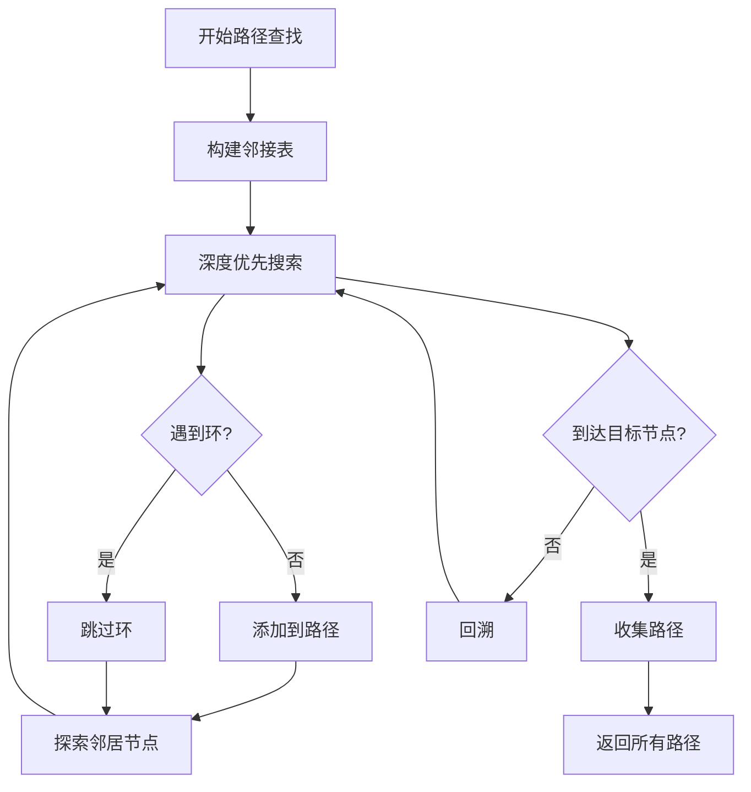

**图表来源**
- [pathSlice.ts:9-87](file://src/stores/flow/slices/pathSlice.ts#L9-L87)

**章节来源**
- [pathSlice.ts:9-87](file://src/stores/flow/slices/pathSlice.ts#L9-L87)
- [PathSelector.tsx:6-120](file://src/components/panels/tools/PathSelector.tsx#L6-L120)

### 节点系统与类型模型
- 节点类型枚举：Pipeline、External、Anchor、Sticker、Group。
- 边类型：marked边，支持label作为链路顺序，attributes存储jump_back、anchor等属性。
- 节点数据模型：Pipeline包含识别与动作参数、others及其他扩展；External/Anchor包含标签与方向；Sticker包含标签、内容与颜色主题；Group包含标签与颜色主题。
- 节点句柄方向：支持left-right、right-left、top-bottom、bottom-top四种方向，默认left-right。

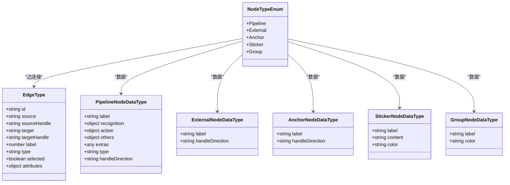

**图表来源**
- [types.ts:14-244](file://src/stores/flow/types.ts#L14-L244)
- [nodes/constants.ts:14-20](file://src/components/flow/nodes/constants.ts#L14-L20)

**章节来源**
- [types.ts:14-244](file://src/stores/flow/types.ts#L14-L244)
- [nodes/constants.ts:14-20](file://src/components/flow/nodes/constants.ts#L14-L20)

### 节点实现与交互

#### Pipeline节点
- 支持三种外观风格：经典、现代、极简，由配置切换。
- 与调试状态联动：执行中、已执行、正在识别、失败等状态样式。
- 与选中/路径/聚焦透明度联动，实现"聚焦相关元素"的视觉聚焦效果。
- 右键菜单集成，支持节点上下文操作。

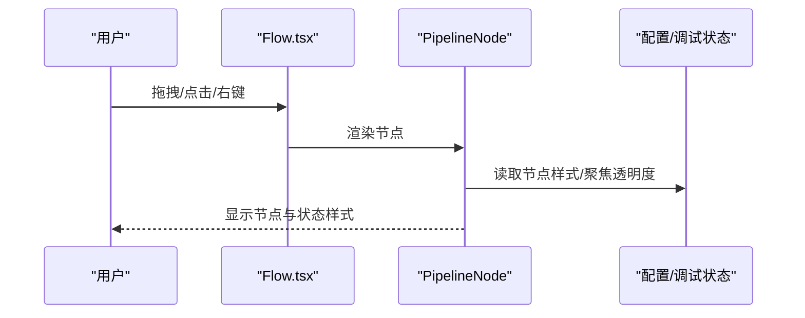

**图表来源**
- [PipelineNode/index.tsx:22-194](file://src/components/flow/nodes/PipelineNode/index.tsx#L22-L194)
- [Flow.tsx:464-504](file://src/components/Flow.tsx#L464-L504)

**章节来源**
- [PipelineNode/index.tsx:22-194](file://src/components/flow/nodes/PipelineNode/index.tsx#L22-L194)

#### External节点
- 仅展示标签与句柄，适合作为外部入口/出口节点。
- 支持句柄方向配置，便于与上游/下游节点对齐。

**章节来源**
- [ExternalNode.tsx:29-145](file://src/components/flow/nodes/ExternalNode.tsx#L29-L145)

#### Anchor节点
- 用于重定向/锚点，支持句柄方向配置。
- 常用于流程跳转或复用节点。

**章节来源**
- [AnchorNode.tsx:31-147](file://src/components/flow/nodes/AnchorNode.tsx#L31-L147)

#### Sticker节点
- 可拖拽调整大小，支持多颜色主题。
- 双击进入编辑模式，支持标题与内容修改。
- 不受"聚焦透明度"影响，始终可见。

**章节来源**
- [StickerNode.tsx:165-237](file://src/components/flow/nodes/StickerNode.tsx#L165-L237)

#### Group节点
- 支持标题编辑与拖拽调整大小。
- 子节点相对定位，拖出边界自动脱离分组。
- 提供多种颜色主题，增强分组辨识度。

**章节来源**
- [GroupNode.tsx:112-184](file://src/components/flow/nodes/GroupNode.tsx#L112-L184)

### 连接系统与边渲染
- marked边类型：支持贝塞尔曲线路径、控制点拖拽、标签排序、错误/跳转回样式。
- 控制点拖拽：鼠标拖动边上的控制点可调整曲线形状，双击重置。
- 标签排序：同源同句柄边按label顺序排列，新增边自动计算顺序。
- 样式区分：next/on_error、跳转回、选中态等样式类名控制。
- 高级避让：集成避让算法，自动处理节点间的路径冲突。

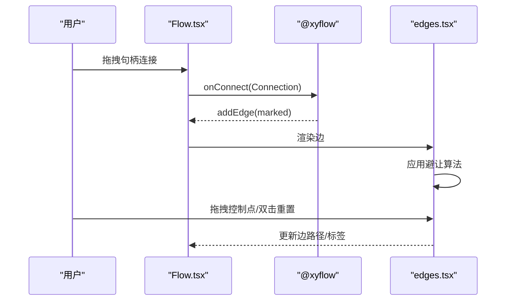

**图表来源**
- [Flow.tsx:256-256](file://src/components/Flow.tsx#L256-L256)
- [edges.tsx:188-525](file://src/components/flow/edges.tsx#L188-L525)
- [avoidanceUtils.ts:379-587](file://src/core/avoidanceUtils.ts#L379-L587)

**章节来源**
- [Flow.tsx:256-256](file://src/components/Flow.tsx#L256-L256)
- [edges.tsx:188-525](file://src/components/flow/edges.tsx#L188-L525)
- [avoidanceUtils.ts:379-587](file://src/core/avoidanceUtils.ts#L379-L587)

### 节点操作与磁吸对齐
- 拖拽磁吸：拖拽节点时计算与其他节点的对齐参考线，拖拽结束时应用对齐位置。
- 分组拖拽：拖入/拖出分组检测，自动挂载/脱离父分组。
- 键盘快捷键：支持复制/粘贴节点。
- 视口持久化：视口变化时保存至文件配置。

**图表来源**
- [Flow.tsx:297-360](file://src/components/Flow.tsx#L297-L360)

**章节来源**
- [Flow.tsx:297-360](file://src/components/Flow.tsx#L297-L360)

### 布局算法与自动排列
- 自动布局：基于ELKJS分层布局算法，根据节点测量宽高生成布局，批量更新节点位置。
- 对齐工具：支持顶部对齐、底部对齐、水平居中对齐，生成NodeChange批量更新。
- 依赖：节点需完成测量（measured.width/height），否则延时重试。

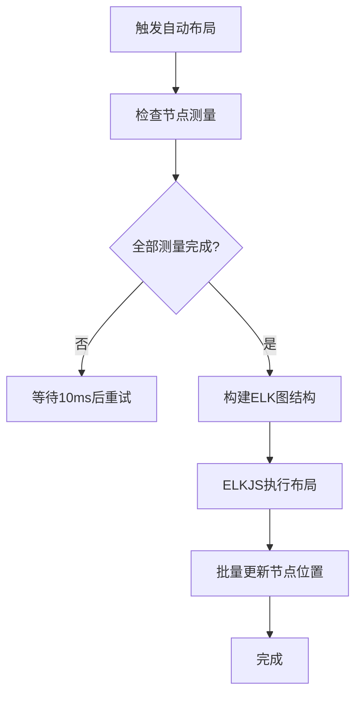

**图表来源**
- [layout.ts:46-107](file://src/core/layout.ts#L46-L107)

**章节来源**
- [layout.ts:46-107](file://src/core/layout.ts#L46-L107)

### 节点编辑器与字段验证
- 字段工厂与模式：识别/动作/其他三类参数通过字段工厂与模式驱动，支持类型切换时自动增删字段与默认值填充。
- 批量更新：支持一次性应用多个字段更新，减少多次渲染。
- 名称重复检测：节点标签重复时在错误面板提示。
- 实时预览：字段变更即时反映到节点外观与边样式。
- 字段排序：集成字段排序系统，支持自定义字段排列顺序。

**章节来源**
- [nodeSlice.ts:291-394](file://src/stores/flow/slices/nodeSlice.ts#L291-L394)
- [nodeSlice.ts:402-516](file://src/stores/flow/slices/nodeSlice.ts#L402-L516)

### 节点模板与节点列表
- 节点模板：提供空节点、文字识别、图像识别、无延迟节点、直接点击、自定义动作、外部节点、锚点、便签、分组等模板。
- 节点列表：按类型分组展示，支持图标与统计信息。

**章节来源**
- [nodeTemplates.ts:13-108](file://src/data/nodeTemplates.ts#L13-L108)

## 依赖分析
- 容器依赖：Flow.tsx依赖节点注册表、边类型、配置、磁吸工具与状态切片。
- 节点依赖：各节点组件依赖状态切片、配置、调试状态与右键菜单。
- 边依赖：edges.tsx依赖句柄方向、控制点拖拽、标签排序与样式类。
- 多选菜单依赖：SelectionContextMenu.tsx依赖布局工具、剪贴板工具与FlowStore状态。
- JSON编辑器依赖：NodeJsonEditorModal.tsx依赖Monaco Editor、字段模式和数据转换工具。
- 路径查找依赖：pathSlice.ts依赖邻接表构建和DFS算法实现。
- 避让算法依赖：avoidanceUtils.ts依赖几何计算和递归算法。
- 状态依赖：nodeSlice与edgeSlice分别管理节点与边的状态变更、历史与批量更新。
- 布局依赖：layout.ts依赖ELKJS与节点测量信息。

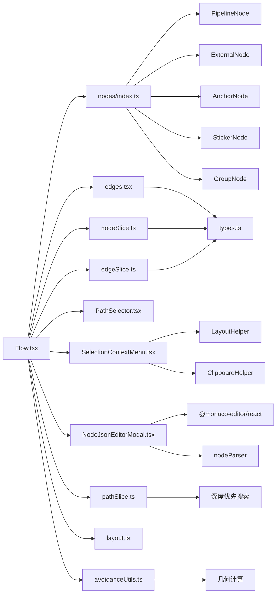

**图表来源**
- [Flow.tsx:29-40](file://src/components/Flow.tsx#L29-L40)
- [nodes/index.ts:1-26](file://src/components/flow/nodes/index.ts#L1-L26)
- [edges.tsx:14-18](file://src/components/flow/edges.tsx#L14-L18)
- [SelectionContextMenu.tsx:1-8](file://src/components/flow/selectionContextMenu.tsx#L1-L8)
- [NodeJsonEditorModal.tsx:8-27](file://src/components/modals/NodeJsonEditorModal.tsx#L8-L27)
- [PathSelector.tsx:1-5](file://src/components/panels/tools/PathSelector.tsx#L1-L5)
- [pathSlice.ts:1-3](file://src/stores/flow/slices/pathSlice.ts#L1-L3)
- [avoidanceUtils.ts:5](file://src/core/avoidanceUtils.ts#L5)

**章节来源**
- [Flow.tsx:29-40](file://src/components/Flow.tsx#L29-L40)
- [nodes/index.ts:1-26](file://src/components/flow/nodes/index.ts#L1-L26)
- [edges.tsx:14-18](file://src/components/flow/edges.tsx#L14-L18)
- [SelectionContextMenu.tsx:1-8](file://src/components/flow/selectionContextMenu.tsx#L1-L8)
- [NodeJsonEditorModal.tsx:8-27](file://src/components/modals/NodeJsonEditorModal.tsx#L8-L27)
- [PathSelector.tsx:1-5](file://src/components/panels/tools/PathSelector.tsx#L1-L5)
- [pathSlice.ts:1-3](file://src/stores/flow/slices/pathSlice.ts#L1-L3)
- [avoidanceUtils.ts:5](file://src/core/avoidanceUtils.ts#L5)

## 性能考虑
- 渲染优化
  - 使用memo与浅比较避免不必要的重渲染（如PipelineNodeMemo、StickerNodeMemo等）。
  - 节点与边组件内部按需计算样式与类名，减少DOM开销。
  - 多选菜单使用useShallow优化状态订阅，避免不必要的重渲染。
- 交互优化
  - 拖拽磁吸与分组拖拽采用节流/防抖策略，避免频繁状态更新。
  - 视口变化与节点尺寸变化使用ResizeObserver与防抖函数，降低重排频率。
  - JSON编辑器使用onMount回调注册补全提供者，避免重复初始化。
- 状态管理
  - 历史快照按操作类型延迟保存，减少频繁写入。
  - 批量更新接口（batchSetNodeData）减少多次渲染与状态变更。
  - 路径查找使用Set数据结构，提高查找效率。
- 算法优化
  - 避让算法使用递归深度限制，防止无限递归。
  - 路径查找算法使用邻接表和DFS，时间复杂度为O(V+E)。
  - 字段排序使用Map和Set数据结构，提高查找和去重效率。
- 布局优化
  - ELKJS布局在节点测量完成后执行，未测量节点延时重试，避免阻塞主线程。
  - 自动布局在下一帧执行，避免同步阻塞渲染。

## 故障排查指南
- 节点名称重复
  - 现象：错误面板提示重复节点名。
  - 排查：检查节点标签是否重复，必要时修改标签或启用导出配置前缀。
  - 参考：节点数据更新时的重复检测逻辑。
- 边顺序异常
  - 现象：同源同句柄边顺序错乱。
  - 排查：通过边标签排序接口重新计算顺序，确保新增边label正确。
  - 参考：边标签更新与顺序计算逻辑。
- 磁吸无效
  - 现象：拖拽节点不吸附。
  - 排查：确认磁吸开关与仅视口内吸附设置；检查节点是否为分组节点；确认节点测量尺寸是否存在。
  - 参考：磁吸对齐计算与拖拽停止逻辑。
- 自动布局不生效
  - 现象：节点未自动排列。
  - 排查：确认节点已完成测量；等待测量完成后自动重试；检查ELKJS是否报错。
  - 参考：自动布局执行与测量检查逻辑。
- 多选菜单不响应
  - 现象：右键点击多选区域无反应。
  - 排查：检查选中状态是否正确；确认SelectionContextMenu配置是否正确；查看控制台是否有错误。
  - 参考：SelectionContextMenu配置与事件处理逻辑。
- JSON编辑器无法使用
  - 现象：JSON编辑器加载失败或无法编辑。
  - 排查：检查Monaco Editor依赖是否正确加载；确认字段模式配置；查看网络连接状态。
  - 参考：NodeJsonEditorModal初始化与依赖注入逻辑。
- 路径查找无结果
  - 现象：选择起始和结束节点后无路径显示。
  - 排查：确认节点间存在可达路径；检查边的方向性；验证节点ID的有效性。
  - 参考：pathSlice路径查找算法实现。

**章节来源**
- [nodeSlice.ts:377-391](file://src/stores/flow/slices/nodeSlice.ts#L377-L391)
- [edgeSlice.ts:102-148](file://src/stores/flow/slices/edgeSlice.ts#L102-L148)
- [Flow.tsx:297-360](file://src/components/Flow.tsx#L297-L360)
- [layout.ts:55-64](file://src/core/layout.ts#L55-L64)
- [SelectionContextMenu.tsx:314-487](file://src/components/flow/selectionContextMenu.tsx#L314-L487)
- [NodeJsonEditorModal.tsx:271-464](file://src/components/modals/NodeJsonEditorModal.tsx#L271-L464)
- [pathSlice.ts:9-87](file://src/stores/flow/slices/pathSlice.ts#L9-L87)

## 结论
MaaPipelineEditor的工作流编辑器以清晰的分层架构、完善的节点与边系统、灵活的状态管理与强大的布局能力，提供了高效、易用且可扩展的可视化工作流设计体验。通过本文档的节点类型说明、连接机制解析、操作流程梳理与扩展指南，用户可以快速掌握编辑器的使用与二次开发。

**更新** 本次更新重点介绍了新增的多选上下文菜单、高级路由算法、字段排序系统和JSON编辑能力等增强功能，进一步提升了编辑器的实用性和用户体验。

## 附录

### 节点扩展开发指南
- 新增节点类型步骤
  - 定义节点类型枚举与数据模型：在类型定义文件中新增类型与数据结构。
  - 实现节点组件：参考现有节点（如PipelineNode/ExternalNode/AnchorNode/StickerNode/GroupNode）实现渲染与交互。
  - 注册节点：在节点注册表中导出并注册新节点类型。
  - 状态适配：在状态切片中补充对应的数据更新与批量更新逻辑。
  - 边样式适配：如需特殊边样式，在边渲染中增加条件分支。
  - 模板与列表：在节点模板与节点列表中添加新节点的展示信息。
- 最佳实践
  - 使用memo与浅比较减少重渲染。
  - 保持数据模型稳定，避免深层对象频繁变更。
  - 为新节点提供默认句柄方向与合理的尺寸。
  - 在右键菜单中提供必要的上下文操作。
  - 集成避让算法，确保新节点的边连接质量。

**章节来源**
- [types.ts:14-244](file://src/stores/flow/types.ts#L14-L244)
- [nodes/index.ts:8-14](file://src/components/flow/nodes/index.ts#L8-L14)
- [nodeSlice.ts:132-288](file://src/stores/flow/slices/nodeSlice.ts#L132-L288)
- [edges.tsx:413-451](file://src/components/flow/edges.tsx#L413-L451)
- [nodeTemplates.ts:13-108](file://src/data/nodeTemplates.ts#L13-L108)

### 多选上下文菜单开发指南
- 菜单项配置：参考SelectionContextMenu.tsx中的配置结构，定义菜单项的key、label、icon、onClick等属性。
- 条件可见性：使用visible函数根据选中状态动态控制菜单项的显示。
- 禁用逻辑：使用disabled函数根据当前状态智能禁用不适用的菜单项。
- 子菜单结构：对于复杂的操作，使用children属性创建子菜单。
- 批量操作：在onClick回调中实现批量操作逻辑，使用FlowStore的状态管理API。

**章节来源**
- [SelectionContextMenu.tsx:15-58](file://src/components/flow/selectionContextMenu.tsx#L15-L58)
- [SelectionContextMenu.tsx:314-487](file://src/components/flow/selectionContextMenu.tsx#L314-L487)

### JSON编辑器集成指南
- 编辑器初始化：参考NodeJsonEditorModal.tsx的初始化逻辑，注册自动补全提供者。
- 数据转换：实现parsePipelineNodeForExport和convertMfwToStoreFormat函数，处理数据格式转换。
- 语法验证：使用validateMfwNodeJson函数进行JSON语法验证。
- 字段补全：实现createMfwCompletionProvider函数，提供智能字段补全。
- 错误处理：在编辑过程中提供实时的错误提示和修复建议。

**章节来源**
- [NodeJsonEditorModal.tsx:271-464](file://src/components/modals/NodeJsonEditorModal.tsx#L271-L464)

### 路径查找算法实现
- 邻接表构建：使用邻接表数据结构存储图的连接关系。
- DFS遍历：实现深度优先搜索算法，遍历所有可能的路径。
- 环检测：在遍历过程中检测环的存在，避免无限递归。
- 路径收集：将找到的路径节点和边收集到结果集合中。
- 性能优化：使用Set数据结构提高查找效率，避免重复计算。

**章节来源**
- [pathSlice.ts:9-87](file://src/stores/flow/slices/pathSlice.ts#L9-L87)

### 避让算法优化策略
- 递归深度限制：设置最大递归深度，防止无限递归导致的栈溢出。
- 路径长度检查：对过长的路径进行优化，避免不必要的复杂路径。
- 几何计算优化：使用高效的几何算法判断线段相交和点在线段上的判断。
- 缓存机制：缓存计算结果，避免重复计算相同的路径。
- 参数调优：提供可配置的参数，允许用户根据需求调整避让行为。

**章节来源**
- [avoidanceUtils.ts:379-587](file://src/core/avoidanceUtils.ts#L379-L587)