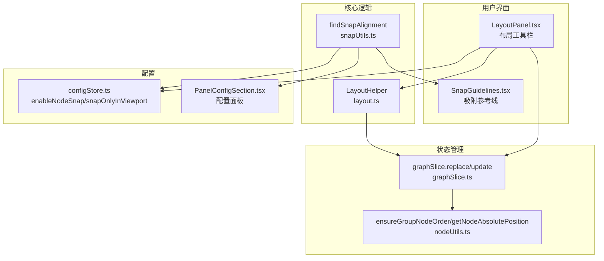
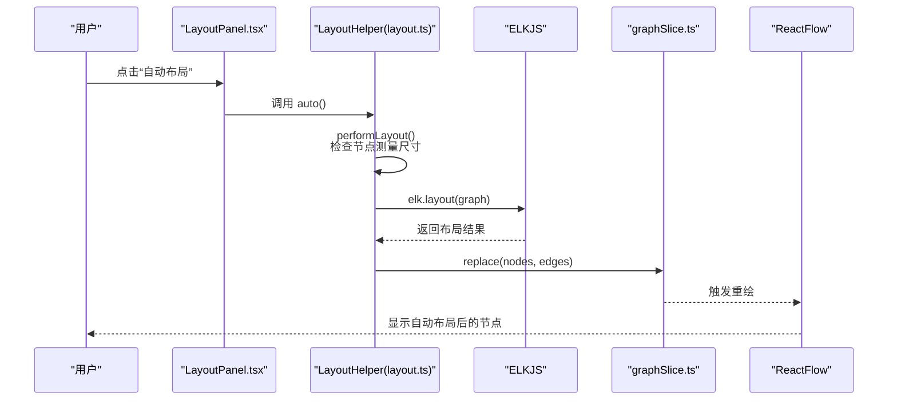
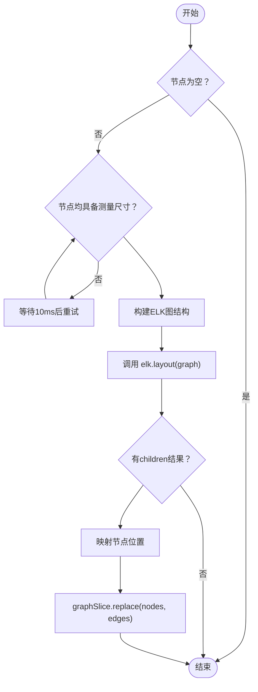
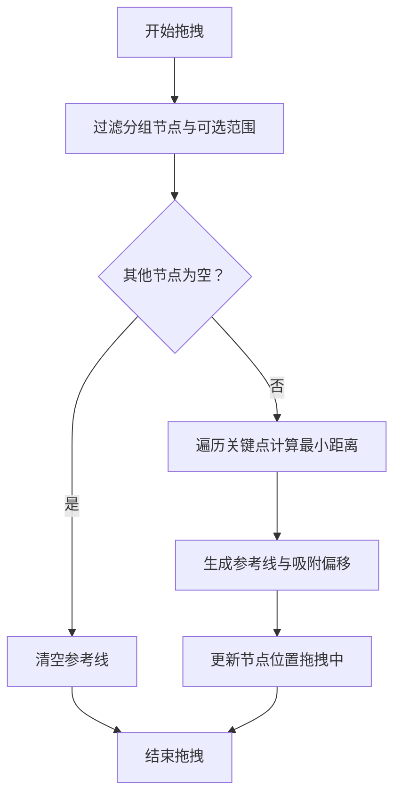
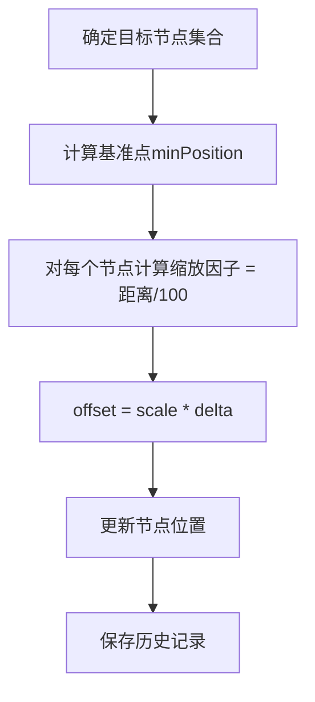
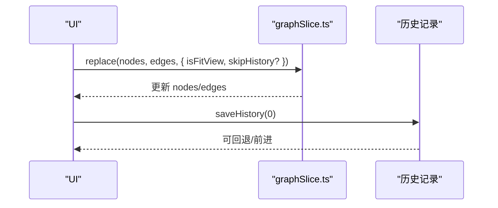
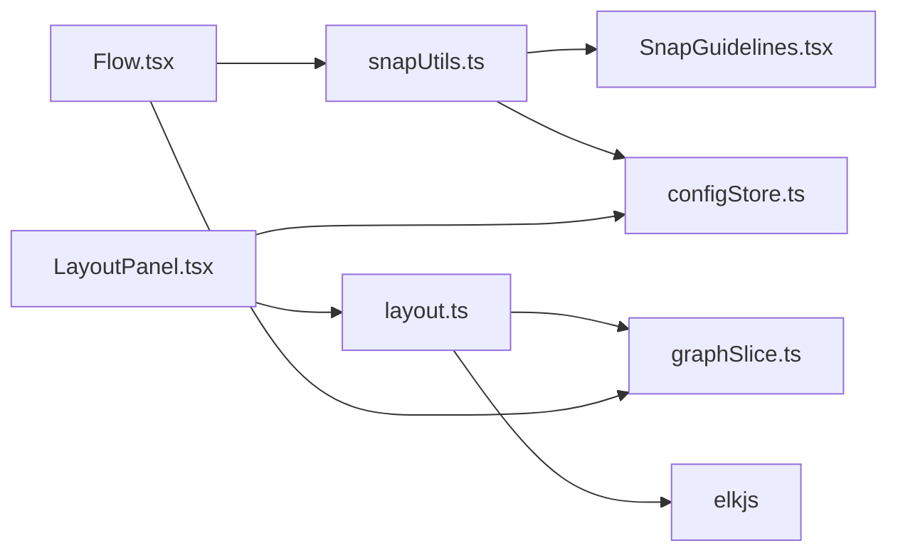

# 布局算法

<cite>
**本文引用的文件**
- [layout.ts](file://src/core/layout.ts)
- [snapUtils.ts](file://src/core/snapUtils.ts)
- [LayoutPanel.tsx](file://src/components/panels/tools/LayoutPanel.tsx)
- [Flow.tsx](file://src/components/Flow.tsx)
- [SnapGuidelines.tsx](file://src/components/flow/SnapGuidelines.tsx)
- [graphSlice.ts](file://src/stores/flow/slices/graphSlice.ts)
- [nodeUtils.ts](file://src/stores/flow/utils/nodeUtils.ts)
- [configStore.ts](file://src/stores/configStore.ts)
- [PanelConfigSection.tsx](file://src/components/panels/config/PanelConfigSection.tsx)
</cite>

## 目录
1. [简介](#简介)
2. [项目结构](#项目结构)
3. [核心组件](#核心组件)
4. [架构总览](#架构总览)
5. [详细组件分析](#详细组件分析)
6. [依赖分析](#依赖分析)
7. [性能考虑](#性能考虑)
8. [故障排查指南](#故障排查指南)
9. [结论](#结论)
10. [附录](#附录)

## 简介
本文件面向 MaaPipelineEditor 的“布局算法”能力，系统化梳理自动布局、对齐吸附、智能间距调整、手动与自动布局切换、布局保存与恢复、以及配置项与性能优化策略。文档以代码为依据，结合可视化图示，帮助开发者与使用者理解并高效使用布局功能。

## 项目结构
围绕布局功能的关键文件分布如下：
- 核心算法与工具
  - 自动布局与对齐：[layout.ts](file://src/core/layout.ts)
  - 磁吸对齐与参考线：[snapUtils.ts](file://src/core/snapUtils.ts)，[SnapGuidelines.tsx](file://src/components/flow/SnapGuidelines.tsx)
- 用户交互入口
  - 布局工具栏：[LayoutPanel.tsx](file://src/components/panels/tools/LayoutPanel.tsx)
  - Flow 画布拖拽与吸附：[Flow.tsx](file://src/components/Flow.tsx)
- 状态与持久化
  - 节点替换与批量更新：[graphSlice.ts](file://src/stores/flow/slices/graphSlice.ts)
  - 节点工具与绝对坐标：[nodeUtils.ts](file://src/stores/flow/utils/nodeUtils.ts)
- 配置与开关
  - 全局配置与开关：[configStore.ts](file://src/stores/configStore.ts)，[PanelConfigSection.tsx](file://src/components/panels/config/PanelConfigSection.tsx)

图表来源
- [LayoutPanel.tsx:1-171](file://src/components/panels/tools/LayoutPanel.tsx#L1-L171)
- [layout.ts:39-141](file://src/core/layout.ts#L39-L141)
- [snapUtils.ts:100-161](file://src/core/snapUtils.ts#L100-L161)
- [graphSlice.ts:18-50](file://src/stores/flow/slices/graphSlice.ts#L18-L50)
- [nodeUtils.ts:321-334](file://src/stores/flow/utils/nodeUtils.ts#L321-L334)
- [configStore.ts:136-210](file://src/stores/configStore.ts#L136-L210)
- [PanelConfigSection.tsx:19-253](file://src/components/panels/config/PanelConfigSection.tsx#L19-L253)

章节来源
- [layout.ts:1-142](file://src/core/layout.ts#L1-L142)
- [snapUtils.ts:1-162](file://src/core/snapUtils.ts#L1-L162)
- [LayoutPanel.tsx:1-171](file://src/components/panels/tools/LayoutPanel.tsx#L1-L171)
- [Flow.tsx:300-413](file://src/components/Flow.tsx#L300-L413)
- [graphSlice.ts:18-50](file://src/stores/flow/slices/graphSlice.ts#L18-L50)
- [nodeUtils.ts:321-334](file://src/stores/flow/utils/nodeUtils.ts#L321-L334)
- [configStore.ts:136-210](file://src/stores/configStore.ts#L136-L210)
- [PanelConfigSection.tsx:19-253](file://src/components/panels/config/PanelConfigSection.tsx#L19-L253)

## 核心组件
- 自动布局（ELK）
  - 使用 ELKJS 的分层布局算法，按层级方向与间距参数生成节点位置，并通过状态替换应用到画布。
  - 关键点：节点需具备测量尺寸；空图直接返回；异常捕获；异步执行。
- 对齐吸附
  - 提供网格/边缘/中心对齐的三种模式；拖拽过程实时计算吸附偏移与参考线；支持仅在可视范围内吸附。
- 智能间距调整
  - 基于选中节点集合，以基准点为参照，按距离比例分配位移，实现“整体均匀扩展/压缩”的视觉效果。
- 手动与自动布局切换
  - 工具栏按钮区分全局自动布局与选中节点对齐/间距调整；自动布局要求无选中节点且存在节点。
- 布局保存与恢复
  - 通过状态替换接口批量写入节点位置；历史记录保存由状态切片统一管理；粘贴时自动适配坐标与分组关系。
- 配置项
  - 磁吸开关与仅可视范围吸附；吸附阈值与参考线样式；自动布局方向、间距等参数在 ELK 配置中集中定义。

章节来源
- [layout.ts:39-141](file://src/core/layout.ts#L39-L141)
- [snapUtils.ts:100-161](file://src/core/snapUtils.ts#L100-L161)
- [graphSlice.ts:18-50](file://src/stores/flow/slices/graphSlice.ts#L18-L50)
- [LayoutPanel.tsx:55-129](file://src/components/panels/tools/LayoutPanel.tsx#L55-L129)
- [configStore.ts:136-210](file://src/stores/configStore.ts#L136-L210)

## 架构总览
自动布局与对齐吸附在 UI、核心算法与状态管理之间形成闭环：工具栏触发 → 核心算法计算 → 状态替换 → UI 重绘；吸附在拖拽过程中实时反馈参考线。

图表来源
- [LayoutPanel.tsx:107-113](file://src/components/panels/tools/LayoutPanel.tsx#L107-L113)
- [layout.ts:46-107](file://src/core/layout.ts#L46-L107)
- [graphSlice.ts:18-50](file://src/stores/flow/slices/graphSlice.ts#L18-L50)

## 详细组件分析

### 自动布局（ELK 分层布局）
- 输入
  - 节点集合：包含 id、宽高（measured）与初始位置
  - 边集合：source/target
- 参数
  - 方向：自左向右
  - 层间间距、同层间距、交叉最小化策略、节点放置策略、分层策略、边路由、紧凑策略、自环处理
- 输出
  - 每个节点的新位置（x/y），通过状态替换应用

图表来源
- [layout.ts:46-107](file://src/core/layout.ts#L46-L107)
- [graphSlice.ts:18-50](file://src/stores/flow/slices/graphSlice.ts#L18-L50)

章节来源
- [layout.ts:15-37](file://src/core/layout.ts#L15-L37)
- [layout.ts:46-107](file://src/core/layout.ts#L46-L107)

### 对齐吸附（网格/边缘/中心）
- 对齐模式
  - 居中对齐：以最左侧节点为基准对齐
  - 顶部对齐：以最低纵坐标为基准
  - 底部对齐：以最底端边缘为基准
- 吸附算法
  - 计算拖拽节点与其它节点的左右/上下关键点（left/centerX/right、top/centerY/bottom）
  - 在 X/Y 轴分别寻找最小距离，生成吸附偏移与参考线
  - 支持“仅可视范围内”过滤
- 参考线渲染
  - 将吸附参考线投影到画布坐标系，使用重复渐变线样式提示对齐位置

图表来源
- [Flow.tsx:300-329](file://src/components/Flow.tsx#L300-L329)
- [snapUtils.ts:100-161](file://src/core/snapUtils.ts#L100-L161)
- [SnapGuidelines.tsx:5-58](file://src/components/flow/SnapGuidelines.tsx#L5-L58)

章节来源
- [layout.ts:109-141](file://src/core/layout.ts#L109-L141)
- [snapUtils.ts:38-78](file://src/core/snapUtils.ts#L38-L78)
- [Flow.tsx:300-329](file://src/components/Flow.tsx#L300-L329)
- [SnapGuidelines.tsx:5-58](file://src/components/flow/SnapGuidelines.tsx#L5-L58)

### 智能间距调整（整体均匀扩展/压缩）
- 基准点
  - 以目标节点集合中某一维度（横或纵）的最小位置为基准
- 缩放因子
  - 以每个节点与基准点的距离占“100像素”的比例，乘以 delta 得到偏移
- 应用
  - 更新节点位置并保存历史

图表来源
- [graphSlice.ts:255-303](file://src/stores/flow/slices/graphSlice.ts#L255-L303)

章节来源
- [graphSlice.ts:255-303](file://src/stores/flow/slices/graphSlice.ts#L255-L303)

### 手动布局与自动布局的切换机制
- 自动布局
  - 无选中节点且存在节点时可用；调用 ELK 计算并替换节点位置
- 对齐与间距
  - 选中两个及以上节点时可用；对齐改变节点位置；间距调整按比例扩展/压缩
- 切换要点
  - 工具栏按钮根据选中状态与节点数量动态禁用/启用
  - 自动布局与对齐/间距互斥（自动布局要求无选中）

章节来源
- [LayoutPanel.tsx:55-129](file://src/components/panels/tools/LayoutPanel.tsx#L55-L129)
- [layout.ts:41-43](file://src/core/layout.ts#L41-L43)

### 布局的保存与恢复
- 保存
  - 通过状态切片的 replace 接口批量写入节点与边，自动聚焦视图并保存历史
- 恢复
  - 通过历史记录回退/前进（由状态切片统一管理）
- 粘贴与坐标适配
  - 粘贴时处理相对/绝对坐标转换、分组归属检测与自动加入

图表来源
- [graphSlice.ts:18-50](file://src/stores/flow/slices/graphSlice.ts#L18-L50)
- [graphSlice.ts:250-253](file://src/stores/flow/slices/graphSlice.ts#L250-L253)

章节来源
- [graphSlice.ts:18-50](file://src/stores/flow/slices/graphSlice.ts#L18-L50)
- [graphSlice.ts:52-248](file://src/stores/flow/slices/graphSlice.ts#L52-L248)

### 配置选项
- 磁吸相关
  - enableNodeSnap：启用/禁用节点磁吸对齐
  - snapOnlyInViewport：仅在可视范围内进行吸附
  - 吸附阈值：默认 5（flow 坐标）
- 自动布局
  - 方向：从左到右
  - 层间间距：默认 100
  - 同层间距：默认 80
  - 交叉最小化、节点放置、分层策略、边路由、紧凑策略、自环处理等参数集中配置
- 其它
  - isAutoFocus、focusOpacity、canvasBackgroundMode 等影响布局观感与交互体验

章节来源
- [configStore.ts:136-210](file://src/stores/configStore.ts#L136-L210)
- [PanelConfigSection.tsx:19-253](file://src/components/panels/config/PanelConfigSection.tsx#L19-L253)
- [layout.ts:15-37](file://src/core/layout.ts#L15-L37)

## 依赖分析
- 组件耦合
  - LayoutHelper 依赖 ELKJS 与状态切片；对齐吸附依赖 snapUtils 与配置开关；Flow.tsx 在拖拽事件中集成吸附与参考线
- 外部依赖
  - ELKJS：分层布局引擎
  - Zustand：状态管理（flow 与 config）
- 潜在循环依赖
  - 未发现直接循环依赖；布局工具与状态切片通过接口解耦

图表来源
- [layout.ts:1-3](file://src/core/layout.ts#L1-L3)
- [graphSlice.ts:1-14](file://src/stores/flow/slices/graphSlice.ts#L1-L14)
- [snapUtils.ts:1-161](file://src/core/snapUtils.ts#L1-L161)
- [SnapGuidelines.tsx:1-58](file://src/components/flow/SnapGuidelines.tsx#L1-L58)
- [configStore.ts:1-268](file://src/stores/configStore.ts#L1-L268)
- [Flow.tsx:300-413](file://src/components/Flow.tsx#L300-L413)
- [LayoutPanel.tsx:1-171](file://src/components/panels/tools/LayoutPanel.tsx#L1-L171)

章节来源
- [layout.ts:1-3](file://src/core/layout.ts#L1-L3)
- [snapUtils.ts:1-161](file://src/core/snapUtils.ts#L1-L161)
- [Flow.tsx:300-413](file://src/components/Flow.tsx#L300-L413)
- [graphSlice.ts:1-14](file://src/stores/flow/slices/graphSlice.ts#L1-L14)
- [configStore.ts:1-268](file://src/stores/configStore.ts#L1-L268)

## 性能考虑
- 自动布局
  - 节点测量尺寸缺失时采用重试策略，避免阻塞主线程
  - 使用 requestAnimationFrame 包裹布局计算，降低卡顿风险
  - ELK 配置中启用半交互式交叉最小化与 NETWORK_SIMPLEX 等策略，平衡质量与性能
- 对齐吸附
  - 仅在可视范围内吸附可显著减少计算量
  - 吸附阈值与关键点枚举规模可控，复杂度与节点数量呈平方增长
- 间距调整
  - 按比例缩放的偏移计算为 O(n)，适合大规模节点集
- 状态更新
  - replace 接口一次性批量更新，减少多次重绘

章节来源
- [layout.ts:41-43](file://src/core/layout.ts#L41-L43)
- [layout.ts:55-64](file://src/core/layout.ts#L55-L64)
- [Flow.tsx:300-329](file://src/components/Flow.tsx#L300-L329)
- [graphSlice.ts:18-50](file://src/stores/flow/slices/graphSlice.ts#L18-L50)

## 故障排查指南
- 自动布局无效
  - 检查是否存在节点；确认节点已具备测量尺寸；查看控制台错误日志
  - 参考：[layout.ts:52-64](file://src/core/layout.ts#L52-L64)，[layout.ts:104-106](file://src/core/layout.ts#L104-L106)
- 对齐/吸附不生效
  - 确认 enableNodeSnap 与 snapOnlyInViewport 配置；检查节点是否被过滤（分组节点不会参与吸附）
  - 参考：[configStore.ts:136-210](file://src/stores/configStore.ts#L136-L210)，[Flow.tsx:300-329](file://src/components/Flow.tsx#L300-L329)
- 参考线不显示
  - 确认吸附结果包含 guidelines；检查 SnapGuidelines 是否渲染
  - 参考：[SnapGuidelines.tsx:5-58](file://src/components/flow/SnapGuidelines.tsx#L5-L58)
- 历史记录无法回退
  - 确认 replace 调用时未跳过历史保存；检查 saveHistory 的调用时机
  - 参考：[graphSlice.ts:47-49](file://src/stores/flow/slices/graphSlice.ts#L47-L49)

章节来源
- [layout.ts:52-64](file://src/core/layout.ts#L52-L64)
- [layout.ts:104-106](file://src/core/layout.ts#L104-L106)
- [configStore.ts:136-210](file://src/stores/configStore.ts#L136-L210)
- [Flow.tsx:300-329](file://src/components/Flow.tsx#L300-L329)
- [SnapGuidelines.tsx:5-58](file://src/components/flow/SnapGuidelines.tsx#L5-L58)
- [graphSlice.ts:47-49](file://src/stores/flow/slices/graphSlice.ts#L47-L49)

## 结论
MaaPipelineEditor 的布局体系以 ELK 分层布局为核心，辅以对齐吸附与智能间距调整，既保证了复杂工作流的自动化排版，又保留了手动微调的能力。通过配置项与状态切片的协同，系统实现了稳定的布局体验与良好的可维护性。

## 附录
- 复杂工作流布局策略
  - 先使用自动布局获得全局结构，再通过对齐与间距调整优化局部细节
  - 对于长链路，优先保证层间间距与方向一致性，避免边交叉过多
- 性能优化建议
  - 控制节点数量与吸附范围，必要时开启“仅可视范围内吸附”
  - 合理设置 ELK 参数，避免过度优化导致计算时间过长
  - 使用 replace 接口进行批量更新，减少频繁小改动带来的重绘成本